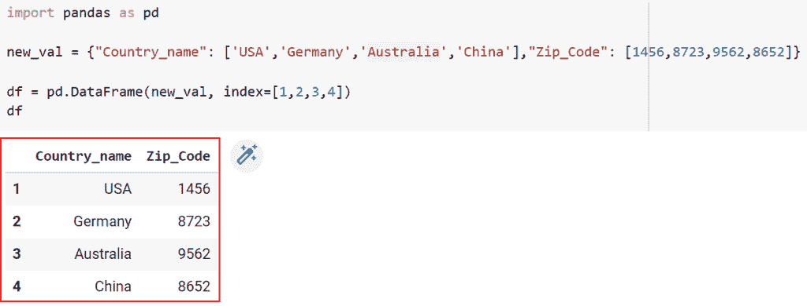
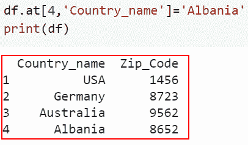
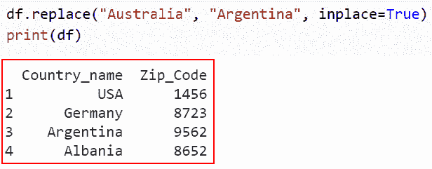
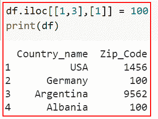
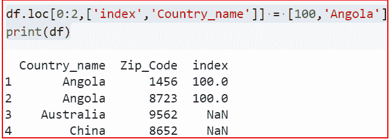
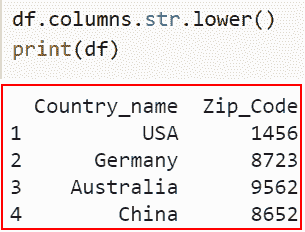
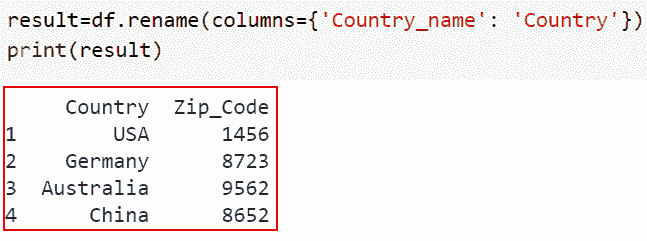
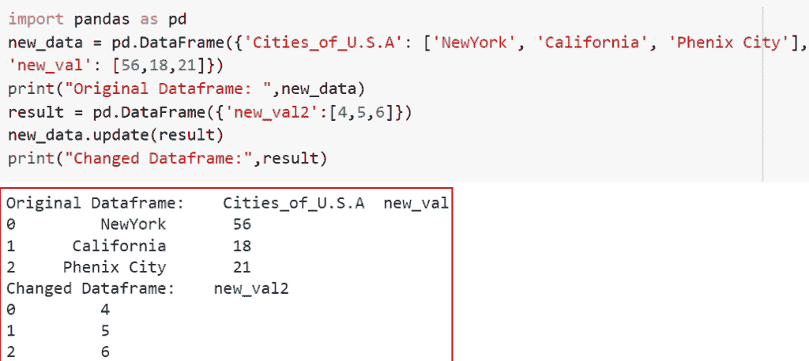
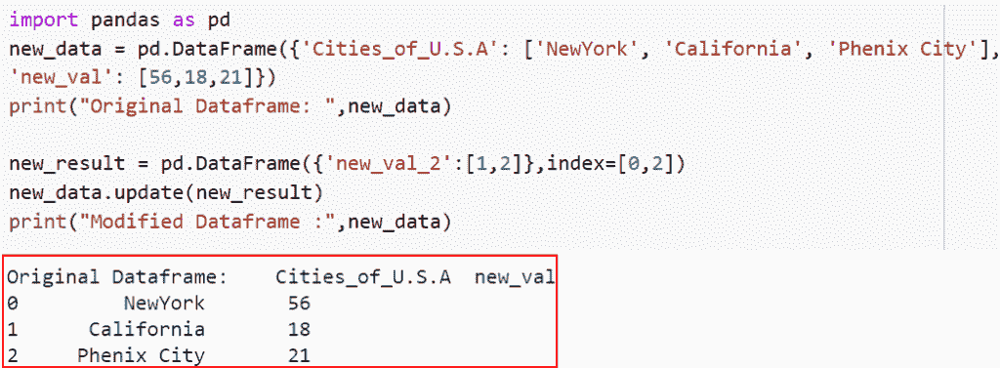

# 如何在 Python Pandas 中更新列值

> 原文：<https://pythonguides.com/update-column-values-in-python-pandas/>

[](https://sharepointsky.teachable.com/p/python-and-machine-learning-training-course)

在这个 [Python 教程](https://pythonguides.com/python-hello-world-program/)中，我们将学习在 [Python 熊猫](https://pythonguides.com/pandas-in-python/)中更新列值的各种方法。我们将使用一些内置函数来理解在 Python Pandas 中更新列值的不同方法。

作为一名开发人员，在开发 Python 项目时，我需要在 Python Pandas 中更新列值。

在这里我们将看到:

*   如何使用 at()更新 Python Pandas 中的列值
*   如何使用 replace()更新 Python Pandas 中的列值
*   如何使用 iloc()更新 Python Pandas 中的列值
*   如何使用 loc()更新 Python Pandas 中的列值
*   如何在 Python Pandas 中更新列名的大小写
*   如何使用 rename()更新 Python Pandas 中的列值
*   如何使用 update()更新不同数据长度的 Dataframe
*   如何使用 update()更新特定位置的 Dataframe

目录

[](#)

*   [如何在 Python Pandas 中更新列值](#How_to_update_column_values_in_Python_Pandas "How to update column values in Python Pandas")
    *   [如何使用 at()](#How_to_update_column_values_in_Python_Pandas_by_using_at "How to update column values in Python Pandas by using at()") 更新 Python Pandas 中的列值
    *   [如何使用 replace()](#How_to_update_column_values_in_Python_Pandas_by_using_replace "How to update column values in Python Pandas by using replace()") 更新 Python Pandas 中的列值
    *   [如何使用 iloc()](#How_to_update_column_values_in_Python_Pandas_by_using_iloc "How to update column values in Python Pandas by using iloc()") 更新 Python Pandas 中的列值
    *   [如何使用 loc()](#How_to_update_column_values_in_Python_Pandas_by_using_loc "How to update column values in Python Pandas by using  loc()") 更新 Python Pandas 中的列值
    *   [如何在 Python Pandas 中更新列名的大小写](#How_to_update_the_case_of_the_column_names_in_Python_Pandas "How to update the case of the column names in Python Pandas")
    *   [如何使用 rename()](#How_to_update_the_column_values_in_Python_Pandas_by_using_rename "How to update the column values in Python Pandas by using rename() ") 更新 Python Pandas 中的列值
    *   [如何使用 update()](#How_to_update_Dataframe_with_different_data_lengths_using_update "How to update Dataframe with different data lengths using update()") 更新不同数据长度的数据帧
    *   [如何使用 update()更新特定位置的数据帧](#How_to_update_Dataframe_at_a_specific_location_using_update "How to update Dataframe at a specific location using update()")

## 如何在 Python Pandas 中更新列值

在 Python 中，主要有一些常用的方法，在 Python Pandas 中更新列值时，理解这些方法非常重要。

### 如何使用 at() 更新 Python Pandas 中的列值

*   在本节中，我们将讨论如何使用***【replace()***来更新 Python Pandas 中的列值。
*   首先，我们将使用 **pd.dataframe()** 函数创建一个数据帧，数据以行和列的形式存储在数据帧中。因此，它有资格作为一个矩阵，并有助于数据分析。

**举例:**

```py
import pandas as pd

new_val = {"Country_name": ['USA','Germany','Australia','China'],"Zip_Code": [1456,8723,9562,8652]}

df = pd.DataFrame(new_val, index=[1,2,3,4])
df
```

下面是下面给出的代码的截图。



Created Dataframe in Python Pandas

*   现在创建一个 dataframe 后，我们将通过使用 ***at()*** 函数来更新列值
*   基于行索引和列名，pandas 中的 ***at()*** 方法用于从数据帧中提取单个值。
*   在 Python 的 ***at()*** 方法的帮助下，我们可以一次一列地改变一行的值。

**语法:**

下面是 Python 中的 **dataframe.at()** 方法的语法

```py
Dataframe.at[rowIndex, columnLabel]
```

> **注:**–该参数取行索引和列标签两个参数。如果作为行索引和列标签给出的参数超出范围或在数据帧中缺失，则会引发键错误。

在本例中，我们使用了数据框和列“Country_name”的索引为 4 的 **at()** 函数。因此，行索引 4 处的列“ ***国家名称*** ”的值被修改。

**源代码:**

```py
df.at[4,'Country_name']='Albania'
print(df)
```

下面是以下给定代码的实现。



at() method to update column values in dataframe

这就是我们如何在() 使用 ***更新数据帧中的列值。***

阅读:[向数据帧添加行 Python 熊猫](https://pythonguides.com/add-row-to-dataframe-python-pandas/)

### 如何使用 replace() 更新 Python Pandas 中的列值

*   现在让我们了解如何使用 replace()更新 Python Pandas 中的列值。
*   使用 Python 中的 replace()函数可以更新或更改数据框中任何字符串的值。没有必要给它提供索引和标签值。
*   可以使用 DataFrame.replace()函数更改列值(在所有列上用一个值替换另一个值)。这个函数返回一个新的 DataFrame，它接受要替换的参数、值、位置、限制、正则表达式和方法。当使用 inplace=True 参数时，它将替换现有的 DataFrame 对象并返回 None 结果。

**语法:**

下面是 Python Pandas 中***data frame . replace()***函数的语法

```py
DataFrame.replace(to_replace=None, value=None, inplace=False, limit=None, regex=False, method='pad')
```

*   它由几个参数组成
    *   **to_replace:** 制作一个字符串、列表、字典、正则表达式、整数、浮点或其他数据类型，并指定要替换的值。
    *   **value:** 默认不取值，指定我们想要替换的值。
    *   **到位:**是否执行到位。默认情况下，它采用一个假值。
    *   **极限:**前进或后退时要填充的最大间隙。
    *   **regex:** 如果要替换 and/or 值应被视为 regex。
    *   **方法:**默认情况下，它采用“填充”值，用于替换。

**举例:**

让我们举个例子，看看如何使用 ***replace()*** 在 Python Pandas 中更新列值。

**源代码:**

```py
df.replace("Australia", "Argentina", inplace=True)
print(df)
```

你可以参考下面的截图



How to update column values in Python Pandas by using replace method

正如你在截图中看到的，我们已经讨论了如何使用 ***replace()*** 来更新 Python Pandas 中的列值。

阅读: [Python 熊猫掉行示例](https://pythonguides.com/python-pandas-drop-rows-example/)

### 如何使用 iloc() 更新 Python Pandas 中的列值

*   在本节中，我们将讨论如何使用 ***iloc()*** 来更新 Python Pandas 中的列值。
*   通过提供相应行/列的索引值，可以使用 Python ***iloc()*** 方法更新或更改行/列的值。

**举例:**

```py
df.iloc[[1,3],[1]] = 100
print(df)
```

*   在本例中，我们已经将第 1、3 行和第一列“Num”的值更改为 100。
*   使用 ***iloc()*** 函数，我们甚至可以对提供给该函数的行进行切片，以便一次修改许多行的值。

下面是下面给出的代码的截图。



How to update column values in Python Pandas by using iloc

这就是如何使用 ***iloc()*** 在 Python Pandas 中更新列值。

阅读:[熊猫删除栏目](https://pythonguides.com/pandas-delete-column/)

### 如何使用 loc() 更新 Python Pandas 中的列值

*   在本节中，我们将讨论如何使用 ***loc()*** 来更新 Python Pandas 中的列值。
*   使用 loc 选择 pandas 数据帧的行和列。DataFrame 使用简单是其主要优势之一。用熊猫的时候可以验证一下。数据框。要选择或过滤数据帧行或列，请使用 loc[]属性。
*   通过提供列的标签和行的索引，Python 中的 **loc()** 方法也可以用于更改与列相关的行的值。

**语法:**

下面是 Python Pandas 中 loc()方法的语法。

```py
dataframe.loc[row index,['column-names']] = value
```

**举例:**

让我们举一个例子，检查如何使用 ***loc()*** 在 Python Pandas 中更新列值。

**源代码:**

```py
df.loc[0:2,['index','Country_name']] = [100,'Angola']
print(df)
```

下面是以下给定代码的实现。



How to update column values in Python Pandas by using loc

这就是如何使用 ***loc()*** 更新 Python Pandas 中的列值。

阅读: [Python 数据帧到 CSV](https://pythonguides.com/python-dataframe-to-csv/)

### 如何在 Python Pandas 中更新列名的大小写

*   现在让我们了解如何在 Python Pandas 中更新列名的大小写。
*   如您所见，我们数据中所有列名的首字母都大写。最好是所有列名都有一个标准的大小写。

**举例:**

让我们举一个例子，检查如何在 Python Pandas 中更新列名的大小写。

**源代码:**

```py
df.columns.str.lower()
print(df)
```

你可以参考下面的截图。



How to update the case of the column names in Python Pandas

在这个例子中，我们已经理解了如何在 Python Pandas 中更新列名的大小写。

阅读:[如何删除熊猫](https://pythonguides.com/delete-a-column-in-pandas/)中的一个栏目

### 如何使用 rename() 更新 Python Pandas 中的列值

*   现在让我们了解如何使用***【rename()***来更新 Python Pandas 中的列值。
*   使用 ***rename()*** 函数是重命名熊猫数据帧中的列的一种技术。当我们需要重命名一些特定的列时，这种方法工作得很好，因为我们只需要为需要更改的列提供信息。

**语法:**

让我们看一下语法并理解 Python 中的 **df.rename()** 函数的工作原理。

```py
DataFrame.rename(mapper=None, *, index=None, columns=None, axis=None, copy=None, inplace=False, level=None, errors='ignore')
```

**举例:**

这里我们将举一个例子，检查如何使用***【rename()***来更新 Python Pandas 中的列值。

**源代码:**

```py
result=df.rename(columns={'Country_name': 'Country'})
print(result)
```

下面是以下给定代码的执行。



How to update the column values in Python Pandas by using rename

这就是如何使用***【rename()***来更新 Python Pandas 中的列值。

阅读:[如何在 Python 数据帧中找到重复项](https://pythonguides.com/how-to-find-duplicates-in-python-dataframe/)

### 如何使用 update() 更新不同数据长度的数据帧

*   本节我们将讨论如何使用 ***update()*** 更新不同数据长度的 Dataframe。
*   让我们考虑这样一种情况，我需要用比原始数据帧更多的记录来更新数据帧。如果我使用 ***update()*** 函数，记录将被更新，直到长度匹配初始数据帧的大小。

**举例:**

我们举个例子，检查一下如何使用 ***update()*** 更新不同数据长度的 Dataframe。

**源代码:**

```py
import pandas as pd
new_data = pd.DataFrame({'Cities_of_U.S.A': ['NewYork', 'California', 'Phenix City'],
'new_val': [56,18,21]})
print("Original Dataframe: ",new_data)
result = pd.DataFrame({'new_val2':[4,5,6]})
new_data.update(result)
print("Changed Dataframe:",result)
```

下面是以下给定代码的实现。



How to update Dataframe with different data lengths using an update()

这就是如何使用一个 ***update()*** 用不同的数据长度更新 Dataframe。

阅读:[Python 中熊猫如何将整数转换成日期时间](https://pythonguides.com/convert-integers-to-datetime-in-pandas/)

### 如何使用 update()更新特定位置的数据帧

*   在本节中，我们将讨论如何使用 update()更新特定位置的 Dataframe。
*   在本例中，我将更改指定位置的值。我们必须首先使用 index 参数创建一个 dataframe，然后对它使用 update 方法。

**举例:**

让我们举一个例子，检查如何使用 update()更新特定位置的 Dataframe。

**源代码:**

```py
import pandas as pd
new_data = pd.DataFrame({'Cities_of_U.S.A': ['NewYork', 'California', 'Phenix City'],
'new_val': [56,18,21]})
print("Original Dataframe: ",new_data)

new_result = pd.DataFrame({'new_val_2':[1,2]},index=[0,2])
new_data.update(new_result)
print("Modified Dataframe :",new_data)
```

下面是以下给定代码的执行过程



How to update Dataframe at a specific location using update()

这就是如何使用 update()更新特定位置的 Dataframe。

你可能也喜欢阅读下面的 Python 熊猫教程。

*   [Python 中熊猫缺失数据](https://pythonguides.com/missing-data-in-pandas/)
*   [Python 熊猫数据帧 Iterrows](https://pythonguides.com/pandas-dataframe-iterrows/)
*   [Python 熊猫中的交叉表](https://pythonguides.com/crosstab-in-python-pandas/)

在本文中，我们已经讨论了如何在 Python 熊猫 中更新列值。我们还讨论了以下主题。

*   如何使用 at()更新 Python Pandas 中的列值
*   如何使用 replace()更新 Python Pandas 中的列值
*   如何使用 iloc()更新 Python Pandas 中的列值
*   如何使用 loc()更新 Python Pandas 中的列值
*   如何在 Python Pandas 中更新列名的大小写
*   如何使用 rename()更新 Python Pandas 中的列值
*   如何使用 update()更新不同数据长度的 Dataframe
*   如何使用 update()更新特定位置的 Dataframe

[Bijay Kumar](https://pythonguides.com/author/fewlines4biju/)

Python 是美国最流行的语言之一。我从事 Python 工作已经有很长时间了，我在与 Tkinter、Pandas、NumPy、Turtle、Django、Matplotlib、Tensorflow、Scipy、Scikit-Learn 等各种库合作方面拥有专业知识。我有与美国、加拿大、英国、澳大利亚、新西兰等国家的各种客户合作的经验。查看我的个人资料。

[enjoysharepoint.com/](https://enjoysharepoint.com/)[](https://www.facebook.com/fewlines4biju "Facebook")[](https://www.linkedin.com/in/fewlines4biju/ "Linkedin")[](https://twitter.com/fewlines4biju "Twitter")