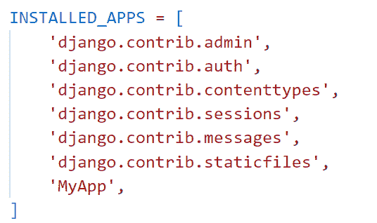

# AttributeError 模块对象在 Django 中没有属性

> 原文：<https://pythonguides.com/module-object-has-no-attribute-in-django/>

[](https://sharepointsky.teachable.com/p/python-and-machine-learning-training-course)

在这个 [Python Django 教程中，](https://pythonguides.com/what-is-python-django/)我会解释**如何解决 AttributeError 模块对象在 Django 中没有属性**。

最近，当我在做一个 Django 项目时，我遇到了一个问题，我有一个错误**“模块对象没有属性”**。因此，在查看了多个解决方案后，我找到了一个帮助我解决这个问题的解决方案。

在这里我们将看到:

*   **属性错误:**模块对象在 Django 中没有属性
*   Django 中属性错误“模块对象没有属性”的解决方案

目录

[](#)

*   [AttributeError 模块对象在 Django](#AttributeError_module_object_has_no_attribute_in_Django "AttributeError module object has no attribute in Django") 中没有属性
*   [解决 Django](#Solution_of_attributeerror_module_object_has_no_attribute_in_Django "Solution of attributeerror “module object has no attribute” in Django") 中“模块对象没有属性”的错误
*   [结论](#Conclusion "Conclusion")

## AttributeError 模块对象在 Django 中没有属性

最近，我在做 Django，我遇到了一个问题 Django 属性错误模块对象没有属性。在这个问题中，模块中缺少特定的属性。

通常，当我们定义的视图与 URL 路径不匹配时，就会出现这种错误。例如，我们在 **views.py** 中创建了一个名为**‘home’**的视图，并在 Django 的 app **urls.py** 中指定了其名为**‘views . index’**的路径。

下面是 Django 中出现“模块对象没有属性”错误的示例截图。


AttributeError in Python Django

Read: [ModuleNotFoundError:没有名为 Django 的模块](https://pythonguides.com/modulenotfounderror-no-module-named-django/)

## 解决 Django 中“模块对象没有属性”的错误

为了解决这个 **Django AttributeError:模块对象没有属性**。我们必须修改位于 app 目录中的 urls.py 的 URL 路径中定义的视图名称。

让我们看一个例子来清楚地理解这个概念。

在本例中，我将创建一个名为 AttributeErrorProject 的 Django 项目，其中包含一个名为 MyApp 的应用程序，以及一个名为 home 的基于函数的视图。

> ***注意:*** 项目名称、app、视图取决于你的项目。我采取这种情况只是为了理解。

通过打开终端并输入以下命令，启动一个 Django 项目。这里， **AttributeErrorProject** 是 Django 项目的名称。

```py
django-admin startproject AttributeErrorProject
```

它将创建一个名为 **AttributeErrorProject** 的文件夹，并在终端中输入下面的命令。

```py
cd AttributeErrorProject
```

通过在终端中键入下面的命令，在这个项目文件夹中创建一个名为 **MyApp** 的 Django 应用程序。

```py
python manage.py startapp MyApp
```

将应用名称添加到位于 **settings.py** 文件中的 **INSTALLED_APP** 列表中，以激活该应用。



Settings.py in django

默认情况下，Django 在项目目录中包含一个 **urls.py** 文件，用于将新构建的应用程序映射到其中。为此，在其中添加以下代码。

```py
from django.contrib import admin
from django.urls import path,include

urlpatterns = [
    path('admin/', admin.site.urls),
    path('',include('MyApp.urls')),
]
```

要定义应用程序的主要逻辑，打开 **views.py** 文件并添加下面给出的代码。

```py
from django.shortcuts import HttpResponse

# Create your views here.

def home(request):
    return HttpResponse('Welcome to PythonGuides!!!')
```

这里，我们创建了一个基于函数的视图 home，它返回 HttpResponse。

现在，我们必须用 URL 映射视图以便调用它，因此我们必须在 app 目录中创建一个名为 **urls.py** 的文件。包括下面的代码。

```py
from django.urls import path
from MyApp import views

urlpatterns = [
    path("", views.home, name="home"),   
]
```

这里，我们将名为 home 的视图的路径指定为 views.home。

要启动开发服务器，请在终端中键入下面给出的命令。

```py
python manage.py runserver
```

它将成功地打开页面并返回 HttpResponse，没有任何错误。


Solution of attribute error “module object has no attribute”

但是，如果我们在 urls.py 的路径中指定了不正确的视图名称，我们将得到 Django 属性错误**“模块对象没有属性”**。例如，我错误地将视图的名称指定为 urls.py 中的索引。

```py
from django.urls import path
from MyApp import views

urlpatterns = [
    path("", views.index, name="home"),   
]
```

现在，启动开发服务器，看到它将产生一个错误 **AttributeError:模块“MyApp.views”在 Django 中没有属性“index”**，如下所示。


AttributeError module object has no attribute in Django

因此，通过在 urls.py 文件中指定视图的正确名称，我们可以解决上面定义的 Django 中的错误。

阅读: [Python Django 获取枚举选择](https://pythonguides.com/python-django-get-enum-choices/)

## 结论

至此，我们已经了解了如何解决与 Django 中的 **AttributeError 模块对象没有属性**相关的问题。此外，为了在 Python Django 中解决这个问题，我们介绍了一个分步过程。

此外，我们还讨论了以下主题。

*   **属性错误**模块对象在 Django 中没有属性
*   AttributeError 模块对象的解决方案在 Django
    中没有属性

您可能也喜欢阅读下面的 Python Django 教程。

*   [Django 模板中的 If 语句](https://pythonguides.com/if-statement-in-django-template/)
*   [Python Django 随机数](https://pythonguides.com/django-random-number/)
*   [将 Python 输出到 html Django](https://pythonguides.com/outputting-python-to-html-django/)
*   [Python Django 连接字符串](https://pythonguides.com/django-concatenate-string/)

[Bijay Kumar](https://pythonguides.com/author/fewlines4biju/)

Python 是美国最流行的语言之一。我从事 Python 工作已经有很长时间了，我在与 Tkinter、Pandas、NumPy、Turtle、Django、Matplotlib、Tensorflow、Scipy、Scikit-Learn 等各种库合作方面拥有专业知识。我有与美国、加拿大、英国、澳大利亚、新西兰等国家的各种客户合作的经验。查看我的个人资料。

[enjoysharepoint.com/](https://enjoysharepoint.com/)[](https://www.facebook.com/fewlines4biju "Facebook")[](https://www.linkedin.com/in/fewlines4biju/ "Linkedin")[](https://twitter.com/fewlines4biju "Twitter")