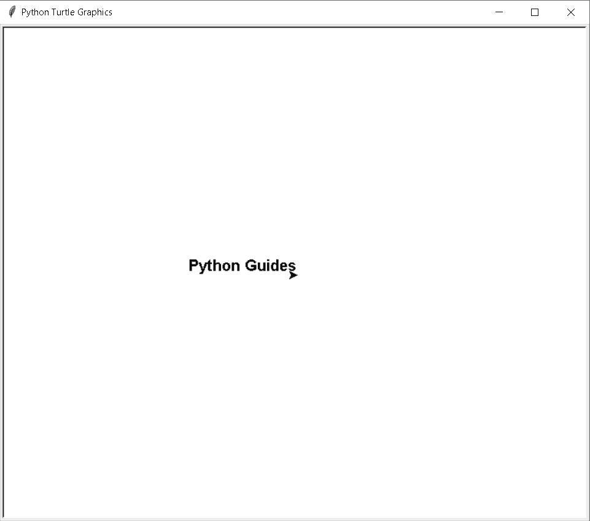
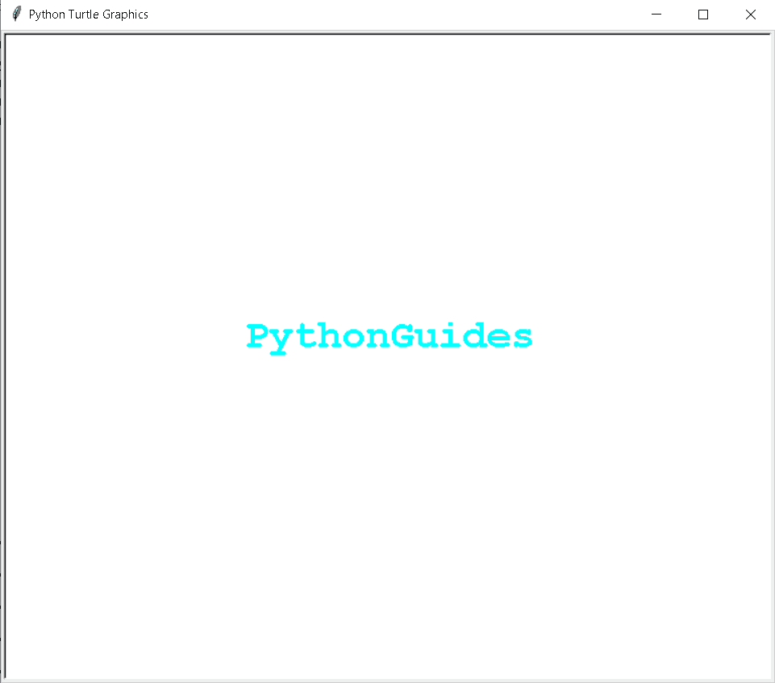
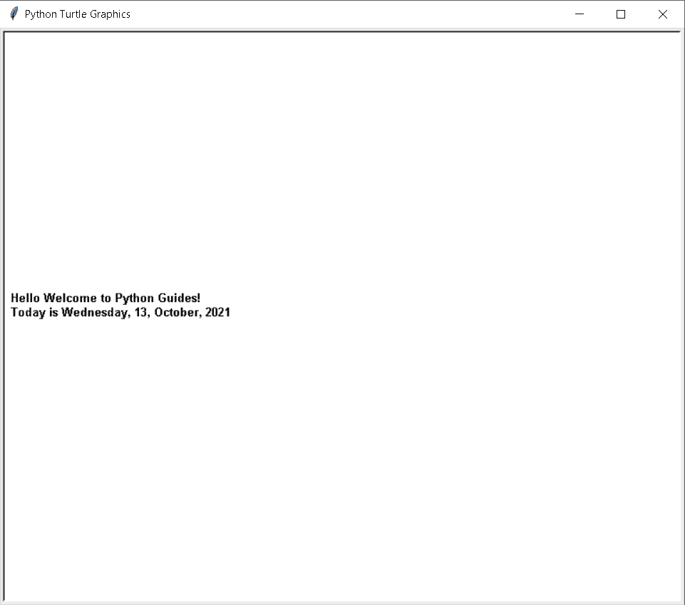
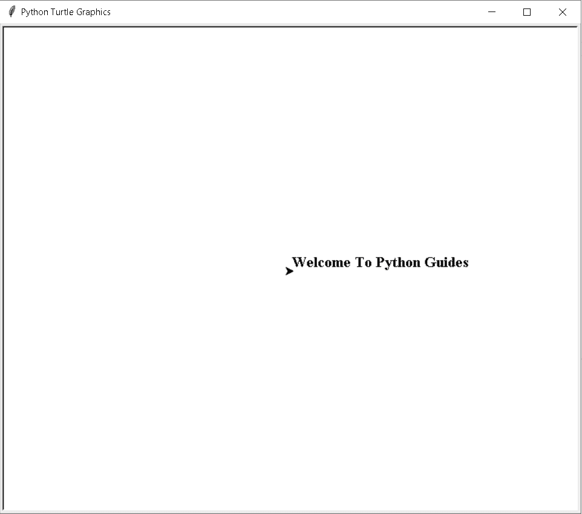
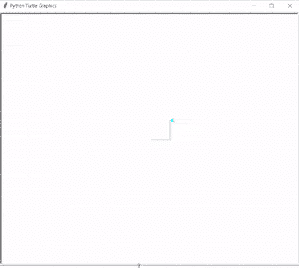
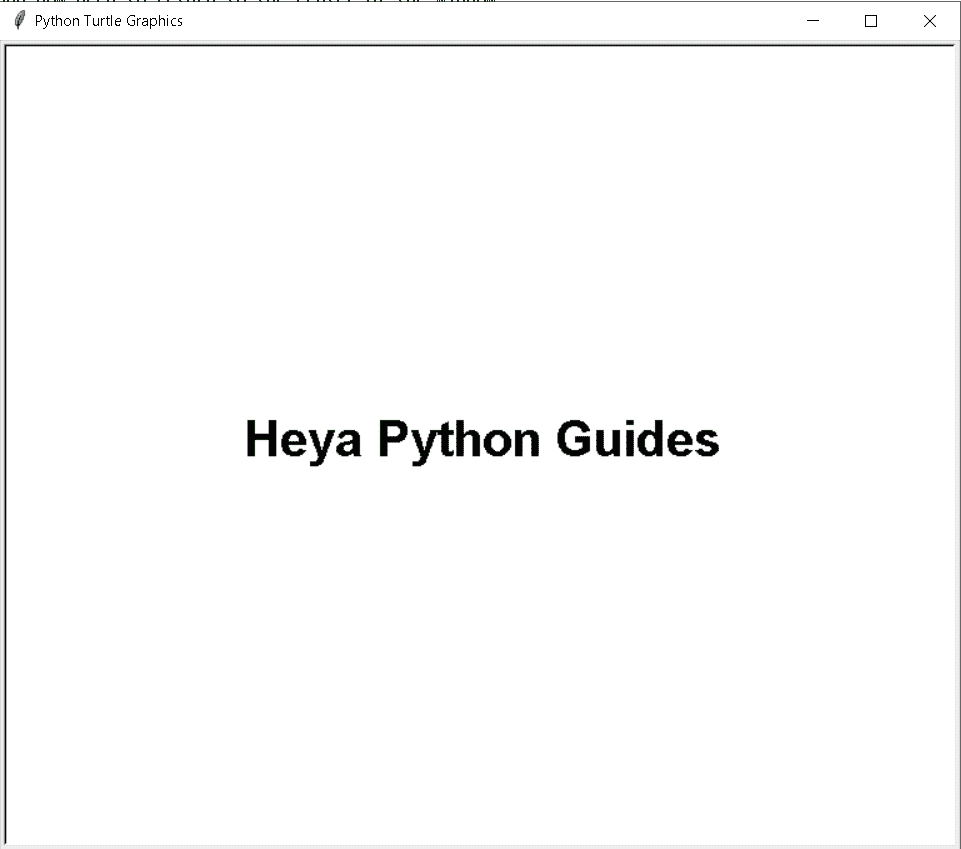
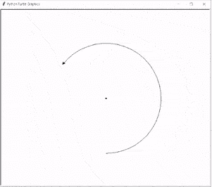
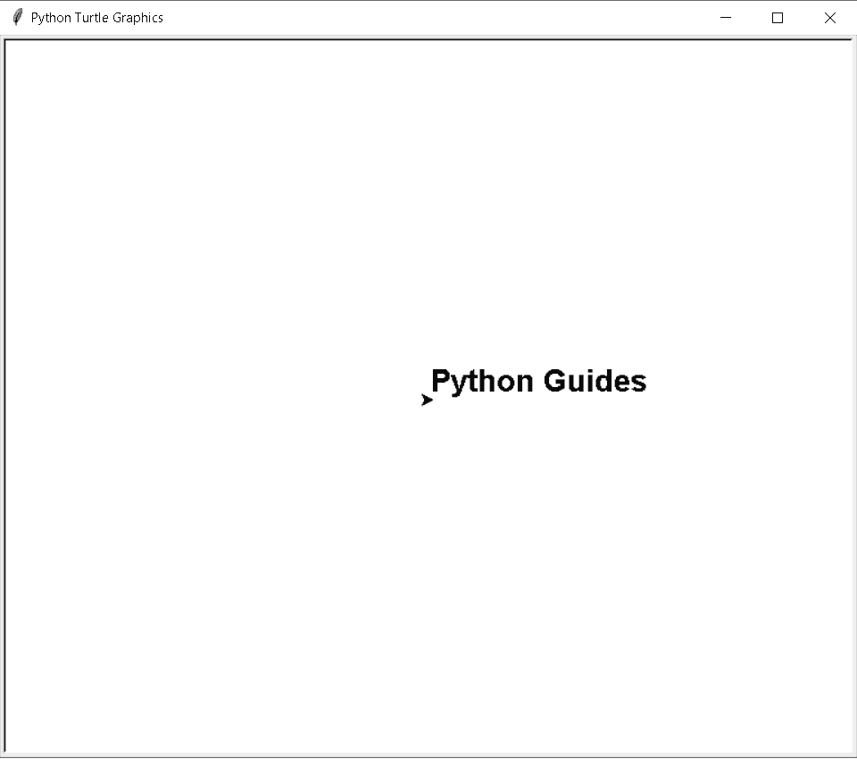
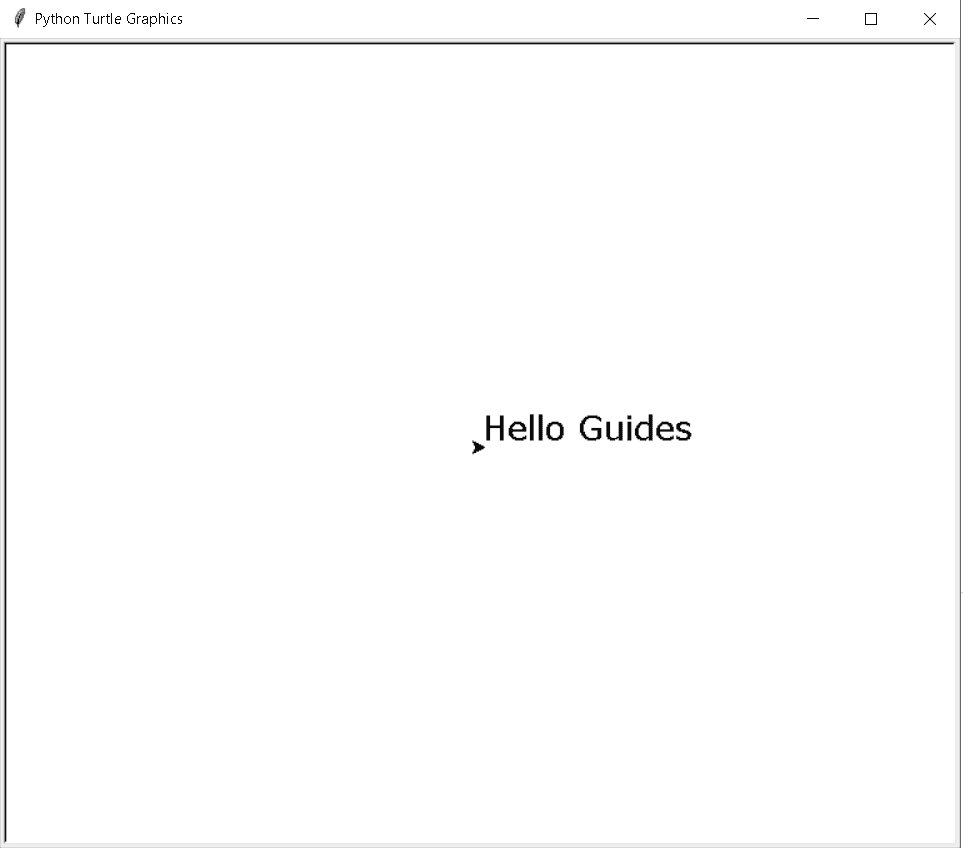
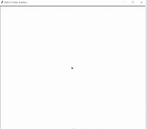

# Python Turtle 写函数

> 原文：<https://pythonguides.com/python-turtle-write-function/>

[](https://sharepointsky.teachable.com/p/python-and-machine-learning-training-course)

在这个 [Python 教程](https://pythonguides.com/python-hello-world-program/)中，我们将学习**如何在 Python Turtle** 中编写函数，我们还将涵盖与 **Python Turtle 编写函数**相关的不同示例。我们将讨论这些话题。

*   Python Turtle 写函数
*   蟒龟写名字
*   Python Turtle 写位置
*   巨蟒龟写字体大小
*   蟒蛇龟写颜色
*   Python Turtle 写对齐
*   Python Turtle 写变量
*   巨蟒龟写文字大小
*   巨蟒龟写在屏幕上
*   巨蟒龟写文字

目录

[](#)

*   [Python 龟写函数](#Python_Turtle_Write_Function "Python Turtle Write Function")
*   [蟒龟写名字](#Python_Turtle_Write_Name "Python Turtle Write Name")
*   [蟒龟写位置](#Python_Turtle_Write_Position "Python Turtle Write Position")
*   [蟒龟写字体大小](#Python_Turtle_Write_Font_size "Python Turtle Write Font size")
*   [蟒龟写色](#Python_Turtle_Write_Color "Python Turtle Write Color")
*   [蟒龟写对齐](#Python_Turtle_Write_Align "Python Turtle Write Align")
*   [蟒龟写变量](#Python_Turtle_Write_Variable "Python Turtle Write Variable")
*   [蟒龟写文字大小](#Python_Turtle_Write_Text_size "Python Turtle Write Text size")
*   [蟒龟写在屏幕上](#Python_Turtle_Write_On-Screen "Python Turtle Write On-Screen")
*   [蟒龟写正文](#Python_Turtle_Write_Text "Python Turtle Write Text")

## Python 龟写函数

在这一节中，我们将学习如何用 Python turtle 编写函数。

书写功能用于在任何地方书写文本。如果用户想在屏幕上写点什么，他们只需使用 **write()** 函数。

**代码:**

在下面的代码中，我们使用 write 函数在屏幕上书写文本。

**turtle.write()-** 用来在用户想要的任何地方写文字。

```py
 import turtle 

ws=turtle.write("Python Guides" , move=True,align='right',font=('Arial',15,'bold'))
turtle.done()
```

**输出:**

运行上面的代码后，我们得到下面的输出，我们可以看到文本是用 write()函数写在屏幕上的。



Python turtle write function Output

阅读[蟒龟圈](https://pythonguides.com/python-turtle-circle/)

## 蟒龟写名字

在这一节中，我们将学习如何用 Python turtle 编写名字。

我们可以从 **tur.write** ()函数中的任何地方编写我们选择的任何名称。如果我们不简单地删除以前的名字，而在参数中写入新的名字，我们也可以重写这个名字。

**代码:**

在下面的代码中，我们从 turtle import * 、 **import** 、**tur、**中导入乌龟库**，并使用 **write()函数**在屏幕上写名字，同时给名字赋予**【青色】**颜色。**

```py
from turtle import *
import turtle as tur

tur.color('cyan')
style = ('Courier', 30, 'bold')
tur.write('PythonGuides', font=style, align='center')
tur.hideturtle()
tur.done()
```

**输出:**

在下面的输出中，我们看到名字显示在屏幕上，它是在 **write()函数**的帮助下编写的。



Python turtle write name Output

阅读 [Python 龟速带示例](https://pythonguides.com/python-turtle-speed/)

## 蟒龟写位置

在这一节中，我们将学习如何在 Python turtle 中设置写位置。

书写位置是指当我们书写文本、姓名或任何其他内容时，现在我们想要改变位置，或者我们可以说将文本的位置设置为左、右或中间。

**代码:**

在这段代码中，我们从 turtle import * 、 **import turtle** 中导入 turtle 库**，还导入了 **date，time** 库用于显示当前日期和时间。**

**today 1 = datetime . datetime . now()**用于显示当前日期和时间。

```py
from turtle import *
import turtle
import datetime

tur = turtle.Turtle()

today1 = datetime.datetime.now()
tur.hideturtle()
tur.penup()

tur.backward((tur.getscreen().window_width() / 2) - 10)
message = "Hello Welcome to Python Guides! \nToday is " + today1.strftime("%A") + ', ' + today1.strftime("%d") \
           + ', ' + today1.strftime("%B") + ', ' + today1.strftime("%Y") 

tur.write(message,move=False, font=('arial',10,'bold'),align='left')
turtle.exitonclick()
```

**输出:**

运行上面的代码后，我们得到下面的输出，其中我们看到带有当前日期和时间的文本被放在屏幕的左边。



Python turtle write position Output

阅读[蟒蛇龟的颜色](https://pythonguides.com/python-turtle-colors/)

## 蟒龟写字体大小

在这一节中，我们将学习如何在 Python turtle 中设置字体大小。

字体大小是我们的文本在屏幕上显示的大小。我们也可以根据需要改变字体大小。如果我们认为小字体看起来很漂亮，那就改变字体大小。

**代码:**

在下面的代码中，我们导入海龟库，并借助 **write()** 函数编写文本，还将字体大小设置为 **font=("Times New Roman "，15，****【bold】)**。

```py
import turtle

fontsize = turtle.Turtle()

fontsize.write("Welcome To Python Guides", font=("Times New Roman", 15, "bold"))
turtle.done()
```

**输出:**

在下面的输出中，我们看到文本以 **15** 的**字体大小**写在屏幕上。



Python turtle write font-size output

阅读[如何在 Turtle Python 中附加图像](https://pythonguides.com/attach-image-to-turtle-python/)

## 蟒龟写色

在这一节中，我们将学习如何在 Python turtle 中给文本赋予颜色。

写色彩就是给文字赋予色彩。当我们书写文本、姓名或其他任何东西时，它们的默认颜色是黑色，如果我们想改变颜色，那么我们使用 **tur.color("青色)**。

**代码:**

在下面的代码中，我们导入 turtle 库来编写文本并给文本着色。

*   **turt.begin_fill()** 用于开始填充颜色。
*   **turt.color('青色')**用于填充形状中的颜色。
*   **turt.forward(50)** 用于向前移动乌龟。
*   **turt.left(90)** 用于向左移动乌龟。
*   **turt.end_fill()** 用于结束填充颜色。
*   **turt . write(' Python Guides ')**用于在屏幕上显示文本。
*   **turt.fillcolor('blue')** 用于给文本赋予颜色。

```py
import turtle

def turt():
    turt = turtle.Turtle()
    turt.fillcolor('blue')
    turt.begin_fill()
    turt.color('cyan')
    for i in range(4):
        turt.forward(50)
        turt.left(90)
    turt.end_fill()

def screen():
    turt = turtle.Turtle()
    turt.color('blue')
    turt.fillcolor('cyan')
    turt.begin_fill()
    turt.penup()
    turt.goto(0, -20)
    turt.pendown()
    turt.write('Python Guides')
    turt.end_fill()

turt()
screen()
turtle.done()
```

**输出:**

运行上面的代码后，我们得到下面的输出，其中我们看到一个形状和文本显示在屏幕上



Python turtle write color Output

阅读[巨蟒龟命令](https://pythonguides.com/python-turtle-commands/)

## 蟒龟写对齐

在本节中，我们将学习如何在 Python turtle 中对齐文本。

根据页面要求，我们可以给文本对齐，通常页面从左到右对齐。如果我们想改变对齐方式，那么我们可以给文本居中对齐或右对齐，然后页面从中间向右或从右向左开始。

**代码:**

在下面的代码中，我们从 turtle import turtle 中导入 Turtle 库**，并赋予文本字体。**

*   Turtle()-这是一个预装的库，用于创建形状和图片。
*   **turtle.penup()-** 停止绘制海龟笔。
*   **turtle.home()** 函数用于将乌龟移动到原点。
*   **turtle.write()-** 用来写屏幕上的文字。

```py
from turtle import Turtle, Screen

FONTSIZE = 30

FONT = ("Arial", FONTSIZE, "bold")

turtle = Turtle()

turtle.penup()
turtle.home()

turtle.sety(-FONTSIZE/2)

turtle.write("Heya Python Guides", align="center", font=FONT)

turtle.hideturtle()

screen = Screen()

screen.exitonclick()
```

**输出:**

运行上面的代码后，我们得到下面的输出，其中我们看到文本在页面中央对齐。



Python turtle write align Output

阅读[如何使用 Turtle](https://pythonguides.com/snake-game-in-python/) 创建 Python 中的贪吃蛇游戏

## 蟒龟写变量

在这一节中，我们将学习如何在 python turtle 中编写 turtle 变量。

变量是我们存储值的内存位置。写变量的定义是，当我们画一些像圆一样的形状时，我们可以控制我们的圆有多大，然后我们把这个值赋给一个变量，我们还在形状里面写一些文本。

**代码:**

在下面的代码中，我们导入 turtle 库**导入 turtle 作为 tur** 用于画圆。

*   **tur.dot()** 用于在圆内放置一个点。
*   **tur.penup()** 停止绘制龟笔。
*   **tur.goto(0，-radius)** 从原点到给定半径画圆。
*   tur.pendown() 开始画乌龟笔。
*   **tur.write()** 用于书写圆圈内的文字。

```py
import turtle as tur
import math
radius = int( input ( "Enter number: " ) ) 
Area = (( math.pi ) * (radius ** 2))   

tur.dot() 
tur.penup() 
tur.goto(0, -radius) 
tur.pendown() 
tur.circle(radius) 
tur.penup()  
tur.home() 

tur.hideturtle() 
tur.write("Area of circle", (Area))
tur.exitonclick()
```

**输出:**

运行上面的代码后，我们得到了下面的输出，其中我们看到画了一个圆，文本被放在圆内。



Python turtle write variable Output

阅读[使用蟒蛇龟绘制彩色填充形状](https://pythonguides.com/draw-colored-filled-shapes-using-python-turtle/)

## 蟒龟写文字大小

在这一节中，我们将学习如何在 Python turtle 中改变**写文本大小**。

文本大小类似于字体大小，因为我们更改字体编号来查看文本的外观。当我们增加字体大小时，文本的大小也会增加，如果我们减小字体大小，文本大小也会减小。

**代码:**

在下面的代码中，我们导入 turtle 库**导入 turtle** 并且我们想要调整文本大小。

**textsize . write(" Python Guides "，font=("Arial "，20，" bold))**它是用来写文本的，写完文本后我们可以给出文本的大小。

```py
import turtle

textsize = turtle.Turtle()

textsize.write("Python Guides", font=("Arial", 20, "bold"))
turtle.done()
```

**输出:**

运行上面的代码后，我们得到下面的输出，其中我们看到文本以给定的文本大小显示在屏幕上。



Python turtle write text size Output

阅读[如何使用 Turtle 在 python 中绘制形状](https://pythonguides.com/turtle-programming-in-python/)

## 蟒龟写在屏幕上

在这一节中，我们将学习如何用 Python turtle 编写屏幕上的。

我们可以通过简单地使用 write()函数在屏幕上写任何东西，比如文本、段落。

**代码:**

在下面的代码中，我们导入 turtle 包**导入 turtle 作为 turt** 来编写文本，并赋予文本样式。

**turt.write("Hello Guides "，font=("Verdana "，20，" normal))**它用于书写文本，为文本赋予样式，我们使用 Verdana。

```py
from turtle import *
import turtle as turt

turt.write("Hello Guides", font=("Verdana",20, "normal"))
turt.exitonclick()
```

**输出:**

运行上面的代码后，我们得到了下面的输出，在屏幕上显示了我们编写的内容。



Python turtle write on-screen output

还有，读:[蟒龟艺术](https://pythonguides.com/python-turtle-art/)

## 蟒龟写正文

在这一节中，我们将学习如何用 Python turtle 编写文本。

在钢笔和铅笔的帮助下，我们可以在纸上、笔记本上、教科书上写文章。在这里，我们看到了如何在海龟当前位置的帮助下在屏幕上书写文本。

**代码:**

在下面的代码中，我们导入 turtle 包 **import turtle 作为 turt** 用于在屏幕上写文本。乌龟写的文本是在 write()函数的帮助下编写的。

```py
import turtle as turt

turt.write("Welcome guides", move=True)
turt.exitonclick()
```

**输出:**

运行上面的代码后，我们得到下面的输出，其中我们看到文本写在屏幕上。



Python turtle write text output

您可能会喜欢以下 Python 教程:

*   [蟒龟广场](https://pythonguides.com/python-turtle-square/)
*   [蟒龟字体](https://pythonguides.com/python-turtle-font/)

因此，在本教程中，我们讨论了 **Python turtle write 函数**,我们还讨论了与其实现相关的不同示例。这是我们讨论过的例子列表。

*   Python Turtle 写函数
*   蟒龟写名字
*   Python Turtle 写位置
*   巨蟒龟写字体大小
*   蟒蛇龟写颜色
*   Python Turtle 写对齐
*   Python Turtle 写变量
*   巨蟒龟写文字大小
*   巨蟒龟写在屏幕上
*   巨蟒龟写文字

[Bijay Kumar](https://pythonguides.com/author/fewlines4biju/)

Python 是美国最流行的语言之一。我从事 Python 工作已经有很长时间了，我在与 Tkinter、Pandas、NumPy、Turtle、Django、Matplotlib、Tensorflow、Scipy、Scikit-Learn 等各种库合作方面拥有专业知识。我有与美国、加拿大、英国、澳大利亚、新西兰等国家的各种客户合作的经验。查看我的个人资料。

[enjoysharepoint.com/](https://enjoysharepoint.com/)[](https://www.facebook.com/fewlines4biju "Facebook")[](https://www.linkedin.com/in/fewlines4biju/ "Linkedin")[](https://twitter.com/fewlines4biju "Twitter")