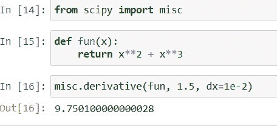
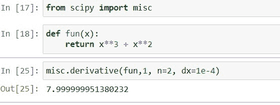
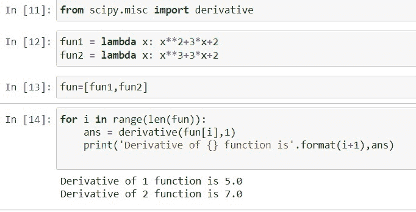
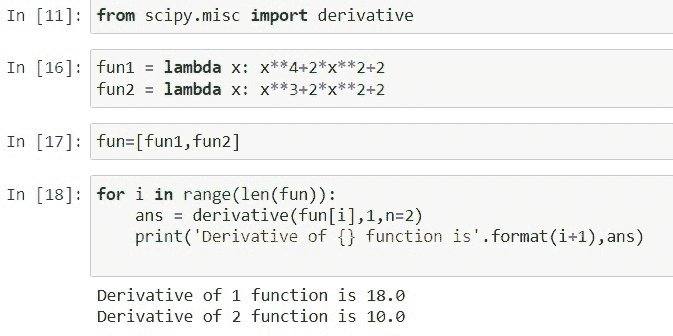
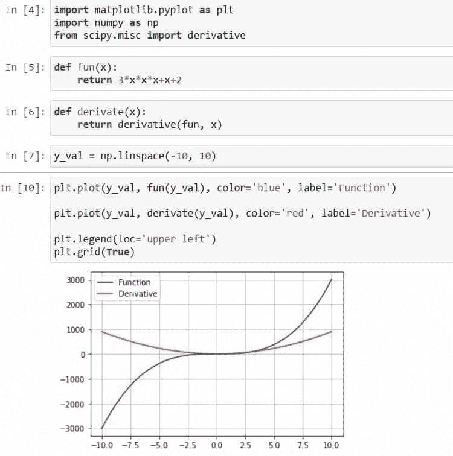
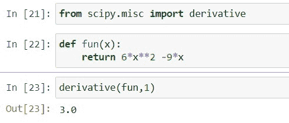

# 数组的 Python Scipy 派生物

> 原文：<https://pythonguides.com/python-scipy-derivative-of-array/>

[](https://sharepointsky.teachable.com/p/python-and-machine-learning-training-course)

在本 [Python 教程](https://pythonguides.com/learn-python/)中，我们将学习数组 的“ ***Python Scipy 导数”来对数组内的一个或多个给定函数进行微分，以找到这些函数的导数。此外，涵盖以下主题。***

*   函数的 Python Scipy 导数
*   函数的二阶导数
*   数组的 Python Scipy 派生物
*   Python SciPy 数组的二阶导数
*   数组的 Python SciPy 绘图导数
*   Python Scipy 衍生的数组示例

目录

[](#)

*   [函数的 Python Scipy 导数](#Python_Scipy_Derivative_of_Function "Python Scipy Derivative of Function")
*   [函数的二阶导数](#Python_SciPy_Second_Derivative_of_function "Python SciPy Second Derivative of function")
*   [Python Scipy 衍生的数组](#Python_Scipy_Derivative_of_Array "Python Scipy Derivative of Array")
*   [Python SciPy 数组的二阶导数](#Python_SciPy_Second_Derivative_of_Array "Python SciPy Second Derivative of Array")
*   [Python SciPy Plot 衍生的数组](#Python_SciPy_Plot_Derivative_of_Array "Python SciPy Plot Derivative of Array")
*   [Python Scipy 衍生例子](#Python_Scipy_Derivative_Example "Python Scipy Derivative Example")

## 函数的 Python Scipy 导数

函数关于独立变量的变化率可以变化，这就是导数。当变量和变化率存在时，导数是最常用的。

Python Scipy 在模块`***scipy.misc***`中有一个方法 ***`derivative()`*** ，该方法为一个函数的 n 阶导数寻找一个点的值。

下面给出了语法。

```
scipy.misc.derivative(func, x0, dx=1.0, n=1, args=(), order=3)
```

其中参数为:

*   **func:** 是输入函数。
*   **x0(float):** 可以发现 n 阶导数的点。
*   **dx(float):** 是一个间距。
*   **n(int):** 导数的阶。默认值为 1。
*   **args(tuple):** 用于提供参数。
*   **order(int):** 只使用奇数个点。

让我们按照下面的步骤来寻找任何函数的导数:

使用下面的 python 代码导入必要的库。

```
from scipy import misc
```

使用下面的代码定义函数`***x²+x³***`，我们需要找到它的导数。

```
def fun(x):
    return x**2 + x**3
```

现在用下面的代码找出上面函数的导数。

```
misc.derivative(fun, 1.5, dx=1e-2)
```



Python Scipy Derivative of Function

这就是如何使用 Python Scipy 的方法`***derivative()***`求函数的导数。

阅读: [Python Scipy Gamma](https://pythonguides.com/python-scipy-gamma/)

## 函数的二阶导数

粗略地说，二阶导数衡量一个量的变化率本身是如何变化的。例如，物体位置对时间的二阶导数是物体的瞬时加速度或物体速度对时间的变化率。

让我们按照下面的步骤找到任何函数的二阶导数:

使用下面的 python 代码导入必要的库。

```
from scipy import misc
```

使用下面的代码定义函数`***x³+x²***`，我们需要找到它的导数。

```
def fun(x):
    return x**3 + x**2
```

现在用下面的代码找出上面函数的导数。

```
misc.derivative(fun,1, n=2, dx=1e-4)
```



Python Second Derivative of function

这就是如何使用 Python Scipy 的方法`misc.derivative`找到函数的二阶导数。

阅读: [Python Scipy Stats 泊松](https://pythonguides.com/python-scipy-stats-poisson/)

## Python Scipy 衍生的数组

为了计算数组的导数，我们将在本节中使用带有导数函数的 python 循环。

让我们按照以下步骤来看一个例子:

使用下面的 python 代码导入必要的库。

```
from scipy import misc
```

使用`***lambda***`定义函数，我们需要使用下面的代码找到它的导数。

```
fun1 = lambda x: x**2+3*x+2
fun2 = lambda x: x**3+3*x+2
```

使用下面的代码创建上述函数的数组。

```
fun=[fun1,fun2]
```

使用下面的代码计算包含函数的数组的导数。

```
for i in range(len(fun)):
    ans = derivative(fun[i],1)
    print('Derivative of {} function is'.format(i+1),ans) 
```



Python Scipy Derivative of Array

上述输出包含上述函数的导数，即 5.0 和 7.0。

阅读: [Python Scipy Kdtree](https://pythonguides.com/python-scipy-kdtree/)

## Python SciPy 数组的二阶导数

在本节中，我们将利用 Python 循环和导数函数来计算数组的二阶导数。

让我们按照以下步骤来看一个例子:

使用下面的 python 代码导入必要的库。

```
from scipy import misc
```

使用`***lambda***`定义函数，我们需要使用下面的代码找到它的导数。

```
func1 = lambda x: x**4+2*x**2+2
func2 = lambda x: x**3+2*x**2+2
```

使用下面的代码，通过使用方法`***derivative()***`的参数，创建上述函数的数组。

```
func=[func1,func2]
```

使用下面的代码计算包含函数的数组的二阶导数。

```
for i in range(len(fun)):
    ans = derivative(fun[i],1,n=2)
    print('Derivative of {} function is'.format(i+1),ans) 
```

在上面的代码中，我们将参数 n=2 传递给方法 derivative()，用于计算数组中函数的二阶导数。



Python Second Derivative of Array

这就是如何使用 Python Scipy 的方法`derivative()`和参数`n`计算数组的二阶导数。

阅读: [Python Scipy 特征值](https://pythonguides.com/python-scipy-eigenvalues/)

## Python SciPy Plot 衍生的数组

我们已经从上面的小节中学习了如何计算导数，现在我们将计算导数并画出导数，看看它是什么样子。

让我们按照以下步骤计算并绘制导数:

使用下面的 python 代码导入所需的方法或库。

```
import matplotlib.pyplot as plt
import numpy as np
from scipy.misc import derivative 
```

现在使用下面的代码定义函数。

```
def fun(x):
    return 3*x*x*x+x+2
```

使用下面的代码计算上述函数的导数。

```
def derivate(x):
    return derivative(fun, x)
```

使用下面的代码定义 x 轴间隔。

```
y_val = np.linspace(-10, 10)
```

用下面的代码画出上面的函数和导数。

```
plt.plot(y_val, fun(y_val), color='blue', label='Function')

plt.plot(y_val, derivate(y_val), color='red', label='Derivative')

plt.legend(loc='upper left')
plt.grid(True)
```



Python Plot Derivative of Array

这就是如何使用 [matplotlib](https://pythonguides.com/what-is-matplotlib/) 库方法绘制数组的导数。

阅读: [Python Scipy 统计模式](https://pythonguides.com/python-scipy-stats-mode/)

## Python Scipy 衍生例子

我们已经学习了 Python Scipy 的`***derivative()***`方法，以及如何计算任何函数的导数。在这一节中，我们将采用函数并以详细的方式找到它的导数以及数学细节。

假设我们有一个函数 f(x)=***6x²-9x***，我们想求这个函数在 x=1 时的导数，那么首先我们将它微分如下:

微分后变成 f(x)= `12x-9`，现在把微分表达式中 x 的值放入为 f(1) = `12*1-9`，就变成了 3。所以上述函数的答案或导数是 3。

让我们通过下面的步骤来看看 Python Scipy 的模块`***scipy.misc***`的方法 ***`derivative()`*** 的相同例子:

使用下面的 python 代码导入所需的库或方法。

```
from scipy.misc import derivative
```

使用下面的代码定义函数。

```
def fun(x):
    return 6*x**2 -9*x
```

现在使用下面的代码，找出 x=1 处的导数。

```
derivative(fun,1)
```



Python Scipy Derivative Example

看看上面的代码，我们已经计算了函数 ***6x ² -9x*** 的导数，也就是 3.0。

您可能也喜欢阅读下面的 Python SciPy 教程。

*   [Python Scipy Load Mat File](https://pythonguides.com/python-scipy-load-mat-file/)
*   [Python Scipy Butterworth 滤镜](https://pythonguides.com/python-scipy-butterworth-filter/)
*   [Python Scipy Stats multivarial _ Normal](https://pythonguides.com/python-scipy-stats-multivariate_normal/)
*   [Python Scipy 最小化【附 8 个例子】](https://pythonguides.com/python-scipy-minimize/)
*   [Python Scipy 距离矩阵](https://pythonguides.com/scipy-distance-matrix/)
*   [Python Scipy 置信区间](https://pythonguides.com/scipy-confidence-interval/)

因此，在本教程中，我们已经介绍了数组 的“ ***Python Scipy 衍生”，并介绍了以下主题。***

*   函数的二阶导数
*   数组的 Python Scipy 派生物
*   Python SciPy 数组的二阶导数
*   数组的 Python SciPy 绘图导数
*   Python Scipy 衍生的数组示例

[Bijay Kumar](https://pythonguides.com/author/fewlines4biju/)

Python 是美国最流行的语言之一。我从事 Python 工作已经有很长时间了，我在与 Tkinter、Pandas、NumPy、Turtle、Django、Matplotlib、Tensorflow、Scipy、Scikit-Learn 等各种库合作方面拥有专业知识。我有与美国、加拿大、英国、澳大利亚、新西兰等国家的各种客户合作的经验。查看我的个人资料。

[enjoysharepoint.com/](https://enjoysharepoint.com/)[](https://www.facebook.com/fewlines4biju "Facebook")[](https://www.linkedin.com/in/fewlines4biju/ "Linkedin")[](https://twitter.com/fewlines4biju "Twitter")