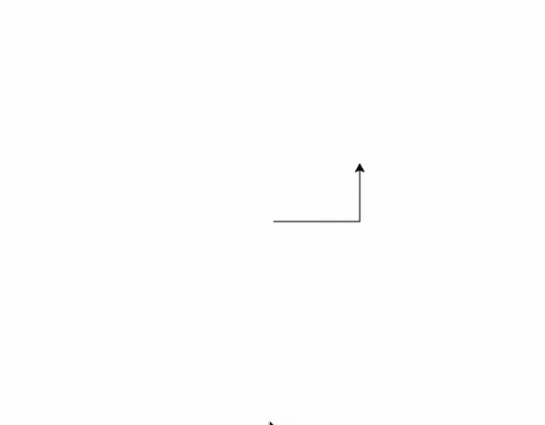
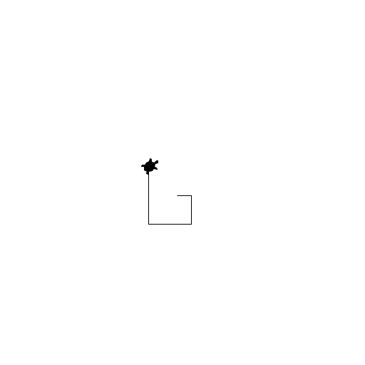
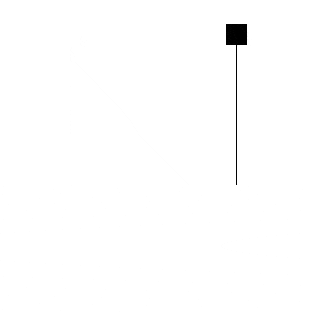
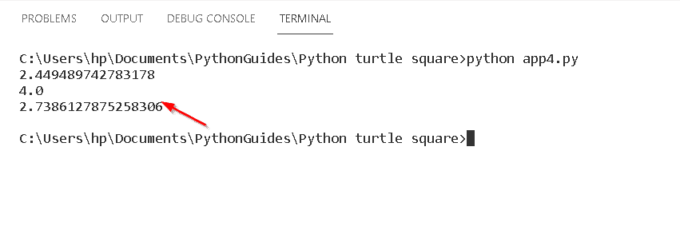
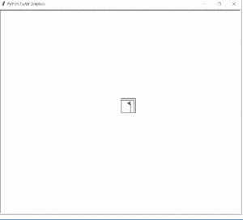
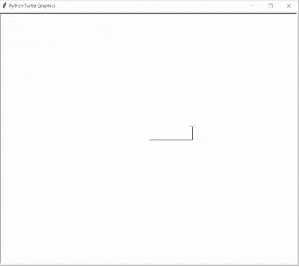
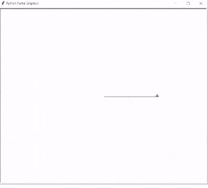
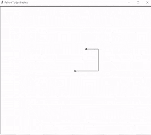
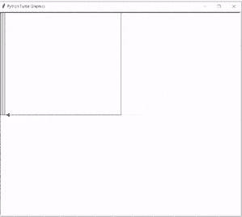

# 蟒蛇龟广场——实用指南

> 原文：<https://pythonguides.com/python-turtle-square/>

[](https://sharepointsky.teachable.com/p/python-and-machine-learning-training-course)

在这个 Python 教程中，我们将学习如何在 Python Turtle 中创建正方形 **，我们还将介绍与 Turtle square 相关的不同示例。我们将讨论这些话题。**

*   Python 乌龟平方函数
*   蟒蛇龟方形环
*   蟒蛇龟方形螺旋
*   蟒蛇龟方形大小
*   蟒蛇龟平方根
*   方形中的蟒蛇龟方形
*   蟒蛇龟广场示例
*   蟒蛇龟用颜色填充正方形
*   巨蟒龟画多个方块
*   蟒蛇龟重复方块

目录

[](#)

*   [Python 龟平方函数](#Python_turtle_square_function "Python turtle square function")
*   [蟒龟方圈](#Python_turtle_square_loop "Python turtle square loop")
*   [蟒龟方形螺旋](#Python_turtle_square_spiral "Python turtle square spiral")
*   [巨蟒龟方形尺寸](#Python_turtle_square_size "Python turtle square size")
*   [蟒龟平方根](#Python_turtle_square_root "Python turtle square root")
*   [蟒龟广场内的一个广场](#Python_turtle_square_inside_a_square "Python turtle square inside a square")
*   [蟒龟广场示例](#Python_turtle_square_example "Python turtle square example")
*   [蟒蛇龟用颜色填充正方形](#Python_turtle_fill_square_with_color "Python turtle fill square with color")
*   [巨蟒龟画多个方块](#Python_turtle_draw_multiple_squares "Python turtle draw multiple squares")
*   [蟒龟重复方块](#Python_turtle_repeating_square "Python turtle repeating square")

## Python 龟平方函数

在本节中，我们将学习 Python turtle 中的 **Turtle Square 函数**。

在这里，我们使用 python (turtle)中的一个内置模块。它用一只乌龟(钢笔)在屏幕上画画。为了移动乌龟，这里有一些函数，我们用它们来给出形状**向前()**和**向后()**。

**代码:**

在下面的代码中，我们用 python 导入了 turtle 模块，在 **forward()** 和 **left()** 函数的帮助下，我们生成了一个正方形的形状。

*   **ws.forward(100)** 正向乌龟转发 5 个单位
*   **ws.left(90)** 将乌龟转动 90 度。

```
from turtle import *
import turtle

ws = turtle.Turtle()

ws.forward(100) 
ws.left(90) 

ws.forward(100) 
ws.left(90) 

ws.forward(100) 
ws.left(90)  

ws.forward(100) 
ws.left(90) 
turtle.exitonclick() 
```

**输出:**

在下面的输出中，我们在 forward()和 left()函数的帮助下制作了一个正方形。



Python turtle square function Output

阅读:[巨蟒龟命令](https://pythonguides.com/python-turtle-commands/)

## 蟒龟方圈

在这一节，我们将学习 python turtle 中的**龟方循环**。

循环是一种有趣的方式，简单地学习和实现，看看它会画什么。

**代码:**

在下面的代码中，我们在一个程序中使用 **for** 循环得到了一些乐趣，在这个程序中，我们使用 **left()** 和 **forward()** 函数设计了一个正方形的形状。

```
from turtle import *

ws = Screen()
ws.setup(width=550, height=400)

shape('square')
for s in range(4):
    left(90)
    forward(150)

done() 
```

输出:

运行完上面的代码后，我们有了下面的输出，这是在使用 for 循环的 **left()** 和 **forward()** 函数的帮助下生成的。


python turtle square loop Output

阅读:[蟒龟颜色](https://pythonguides.com/python-turtle-colors/)

## 蟒龟方形螺旋

在这一节中，我们将学习《蟒龟》中的**龟方螺旋**。

在这里，我们使用了 python (turtle)中的一个内置模块。它用一只乌龟(钢笔)在屏幕上画画。为了移动 turtle，这里有一些函数，我们用来向前()和向后()等形状。

**代码:**

在下面的代码中，我们使用了一个 turtle 模块，并使用了 **forward()** 和 **right()** 函数，其中我们将长度定义为 **len =10** ，将角度定义为 **angl=90** ，以形成一个螺旋形状。

```
import turtle as tur
len = 10
angl = 90
tur.showturtle()
tur.shape("turtle")
tur.forward(len+len)
tur.right(angl)
length = len + 10
tur.forward(length+length)
tur.right(angl)
length = length + 10
tur.forward(length+length)
tur.right(angl)
length = length + 10
tur.forward(length+length)
tur.right(angl)
length = length + 10
tur.forward(length+length)
tur.right(angl)
length = length + 10
tur.forward(length+length)
tur.right(angl)
length = length + 10
tur.forward(length+length)
tur.right(angl)
length = length + 10
tur.forward(length+length)
tur.right(angl)
length = length + 10
tur.forward(length+length)
tur.right(angl)
length = length + 10
tur.forward(length+length)
tur.right(angl)
length = length + 10
tur.forward(length+length)
tur.right(angl)
length = length + 10
tur.forward(length+length)
tur.right(angl)
length = length + 10
tur.forward(length+length)
tur.right(angl)
length = length + 10
tur.forward(length+length)
tur.right(angl)
length = length + 10
```

**输出:**

运行上面的代码后，我们可以看到如何使用 **forward()** 和 **right()** 函数制作螺旋形状。



Python turtle square spiral Output

阅读:[蟒龟速度](https://pythonguides.com/python-turtle-speed/)

## 巨蟒龟方形尺寸

在这一节中，我们将了解 python turtles 中的**乌龟方块大小**。

在这里，我们使用 python (turtle)中的一个内置模块。正方形类似于规则的四边形，两者都有相等的边和相等的 90 度角。正方形的大小取决于正方形的边长。

**代码:**

在下面的代码中，我们在中创建一个屏幕，我们设置正方形的大小，给出宽度和高度。

*   **size.setup(width=850，height=650)** 是用来设置正方形的高度和宽度的功能。
*   **形状(‘正方形’)**用于制作正方形的形状。

```
from turtle import *

size = Screen()
size.setup(width=850, height=650)

shape('square')
for si in range(4):
    left(90)
    forward(150)

done() 
```

**输出:**

运行上面的代码后，我们得到下面的输出，其中我们看到一个正方形在代码中提到的给定大小内，我们取**宽度=850** 和**高度=650** ，这取决于使用 size.setup()函数。



Python turtle square size Output

阅读:[蟒龟圈](https://pythonguides.com/python-turtle-circle/)

## 蟒龟平方根

本节我们将学习 Python turtle 中的 **Turtle 平方根**。

在前进之前，我们应该有一个关于平方根的知识。平方根是一个数自己相乘产生另一个数。

**代码:**

在下面的代码中，我们导入了 turtle 库，还导入了使用数学函数的 math 模块。

*   **print(math.sqrt(6))** 用于打印 6 的平方根。
*   **print(math.sqrt(16))** 用于打印 16 的平方根。
*   **print(math.sqrt(7.5))** 用于打印 7.5 的平方根。

```
from turtle import *
import turtle
import math

print(math.sqrt(6))
print(math.sqrt(16))
print(math.sqrt(7.5))
```

**输出:**

运行上述代码后，我们得到以下输出，其中我们可以看到**‘6’、‘16’和‘7.5’的**平方根**。**



Python turtle square root Output

阅读:[蟒龟艺术](https://pythonguides.com/python-turtle-art/)

## 蟒龟广场内的一个广场

在这一节中，我们将学习 python 海龟中正方形内的**正方形。**

众所周知，正方形有四条等边和四个等角，每个正方形里面还有一个正方形，它也有一条等边和四个等角。

**代码:**

在下面的代码中，我们导入海龟库**导入海龟导入*，**导入海龟用于在正方形内绘制正方形。

**tur.forward (length)** 功能用于将乌龟向前移动给定的长度。

```
from turtle import *
import turtle
tur=turtle.Turtle()
for length in [45,40,30,30,25,20,15,10,5]:
    for x in range (4):

      tur.forward (length)

      tur.left (90)
```

**输出:**

运行上面的代码后，我们得到下面的输出，其中我们看到正方形被画在一个正方形内。



Python turtle square inside a square Output

阅读: [Python 龟写函数](https://pythonguides.com/python-turtle-write-function/)

## 蟒龟广场示例

在本节中，我们将了解 Python turtle 中的 **turtle square 示例**。

在正方形的例子中，我们在一只乌龟的帮助下制作一个正方形。我们使用 **forward()和 left()** 函数来制作正方形的完美形状。

**代码:**

在下面的代码中，我们导入了 turtle 库，以便在 turtle 的帮助下绘制正方形。

*   **tur.forward(110)** 用于将乌龟向前移动 110 个单位。
*   **tur.left(90)** 用于乌龟向前移动后向左方向转弯。

```
from turtle import *
import turtle
tur = turtle.Turtle()
tur.forward(110) 
tur.left(90) 
tur.forward(110)
tur.left(90)
tur.forward(110)
tur.left(90)
tur.forward(110)
tur.left(90)
```

**输出:**

在下面的输出中，我们看到这个正方形是在一只乌龟的帮助下画在屏幕上的。



Python turtle square example Output

阅读:[如何在 Turtle Python 中附加图片](https://pythonguides.com/attach-image-to-turtle-python/)

## 蟒蛇龟用颜色填充正方形

在这一节，我们将学习如何在 Python turtle 中用颜色填充正方形。

正如我们所知，我们在一只乌龟的帮助下画了一个正方形，为了观察这个正方形，我们还在正方形内部填充了颜色。

**代码:**

在下面的代码中，我们用乌龟画了一个正方形，并在正方形内填充了颜色，看起来很吸引人。

*   **tur.fillcolor("青色")**函数用于设置填充颜色。
*   **tur.begin_fill()** 函数用于开始填充颜色。
*   **tur.end_fill()** 函数用来结束颜色的填充。

```
 from turtle import * 
import turtle

tur = turtle.Turtle()

tur.fillcolor("cyan")

tur.begin_fill()

for _ in range(4):
  tur.forward(200)
  tur.right(90)

tur.end_fill()
turtle.exitonclick()
```

**输出:**

运行上面的代码后，我们得到下面的输出，其中我们看到一个用**“青色”**颜色填充的正方形。



Python turtle fill square with color Output

阅读:[如何使用 Turtle](https://pythonguides.com/snake-game-in-python/) 创建 Python 中的贪吃蛇游戏

## 巨蟒龟画多个方块

本节我们将学习**如何在 Python turtle 中绘制多个正方形**。

正如我们可以在乌龟的帮助下画一个正方形一样，我们也可以画多个正方形。多个方块在屏幕上创建美丽的图片。

**代码:**

在下面的代码中，我们在屏幕内部创建了一个屏幕来绘制多个正方形，这些正方形给屏幕带来了美丽的外观。

```
from turtle import *
import turtle

scrn = turtle.Screen()
tur = turtle.Turtle()

def drawSquares(tur, siz, num, angl):

    for i in range(num):
        for x in range(4):
            turtle.forward(siz)
            turtle.left(90)
        turtle.right(angl)

drawSquares(tur, 110, 5, 2)
```

**输出:**

运行上面的代码后，我们得到下面的输出，其中我们看到在乌龟的帮助下画出了多个正方形。



Python turtle draw multiple square Output

阅读:[使用蟒蛇龟绘制彩色填充形状](https://pythonguides.com/draw-colored-filled-shapes-using-python-turtle/)

## 蟒龟重复方块

在这一节中，我们将学习如何在 python turtle 中绘制重复的正方形。

重复方块是指当我们画一个方块，我们想画更多的方块，然后我们应用循环后，重复方块显示在屏幕上。

**代码:**

在下面的代码中，我们从龟导入* 、**导入龟库**用于绘制重复方块。****

*   **turtle.right(180)** 用于将乌龟向右旋转 180 度。
*   **turtle.speed(0)** 功能用于给乌龟速度，**‘0’**为最快速度。

```
from turtle import *
import turtle

turtle.right(180)

turtle.speed(0)

leng = 500

for times in range (100):
  for endtimes in range (4):
    turtle.forward(leng)
    turtle.right(90)
  leng -= 6
```

**输出:**

运行上面的代码后，我们得到下面的输出，其中我们看到正方形是以重复模式绘制的。



Python turtle repeating square Output

您可以查看以下教程。

*   [Replit 蟒蛇龟](https://pythonguides.com/replit-python-turtle/)
*   [巨蟒龟大小](https://pythonguides.com/python-turtle-size/)
*   [蟒龟三角](https://pythonguides.com/python-turtle-triangle/)
*   [蟒龟 onclick](https://pythonguides.com/python-turtle-onclick/)
*   [蟒龟赛跑](https://pythonguides.com/python-turtle-race/)
*   [巨蟒龟屏幕尺寸](https://pythonguides.com/python-turtle-screen-size/)

因此，在本教程中，我们讨论了 **Python Turtle Square** ,我们还讨论了与其实现相关的不同示例。这是我们已经讨论过的例子列表。

*   Python 乌龟平方函数
*   蟒蛇龟方形环
*   蟒蛇龟方形螺旋
*   蟒蛇龟方形大小
*   蟒蛇龟平方根
*   方形中的蟒蛇龟方形
*   蟒蛇龟广场示例
*   蟒蛇龟用颜色填充正方形
*   巨蟒龟画多个方块
*   蟒蛇龟重复方块

[Bijay Kumar](https://pythonguides.com/author/fewlines4biju/)

Python 是美国最流行的语言之一。我从事 Python 工作已经有很长时间了，我在与 Tkinter、Pandas、NumPy、Turtle、Django、Matplotlib、Tensorflow、Scipy、Scikit-Learn 等各种库合作方面拥有专业知识。我有与美国、加拿大、英国、澳大利亚、新西兰等国家的各种客户合作的经验。查看我的个人资料。

[enjoysharepoint.com/](https://enjoysharepoint.com/)[](https://www.facebook.com/fewlines4biju "Facebook")[](https://www.linkedin.com/in/fewlines4biju/ "Linkedin")[](https://twitter.com/fewlines4biju "Twitter")