# Python 中的函数

> 原文：<https://pythonguides.com/function-in-python/>

[](https://sharepointsky.teachable.com/p/python-and-machine-learning-training-course)

在本 [python 教程中，](https://pythonguides.com/python-hello-world-program/)你将通过几个例子了解 python 中的**函数。这里我们将检查 **:****

*   Python 中的函数是什么？
*   如何在 python 中创建函数
*   如何在 python 中调用函数
*   python 函数中的参数
*   Python 任意参数
*   Python 关键字参数
*   默认参数值
*   在 python 中将列表作为参数传递
*   python 中的返回值
*   python 中的返回与打印
*   python 中的函数与方法
*   产出与回报 python
*   python 中函数内部的函数
*   Python 嵌套函数变量作用域

目录

[](#)

*   [Python 中的函数是什么？](#What_is_a_function_in_Python "What is a function in Python?")
*   [如何在 Python 中创建函数](#How_to_create_a_function_in_Python "How to create a function in Python")
*   [如何在 Python 中调用函数](#How_to_call_a_function_in_Python "How to call a function in Python")
*   [Python 函数参数](#Python_function_arguments "Python function arguments")
*   [Python 任意参数](#Python_arbitrary_arguments "Python arbitrary arguments")
*   [Python 关键字参数](#Python_keyword_arguments "Python keyword arguments")
*   [Python 函数中的默认参数值](#Default_parameter_value_in_Python_functions "Default parameter value in Python functions")
*   [Python 将列表作为参数传递给函数](#Python_pass_list_as_arguments_to_function "Python pass list as arguments to function")
*   [Python 函数中的返回值](#Return_value_in_Python_function "Return value in Python function")
*   [python 中的 Return vs print](#Return_vs_print_in_python "Return vs print in python")
*   [python 中的函数 vs 方法](#Function_vs_method_in_python "Function vs method in python")
*   [收益 vs 回报 python](#Yield_vs_return_python "Yield vs return python")
*   [python 中函数内部的函数](#Function_inside_a_function_in_python "Function inside a function in python")
*   [Python 嵌套函数变量作用域](#Python_nested_function_variable_scoping "Python nested function variable scoping")

## Python 中的函数是什么？

**Python 中的函数是什么？**python 中的函数提供了可重用性、有组织性和模块化的代码来执行特定的动作。该函数通过将程序分成更小的块来简化代码，避免了重复，并使代码可重用。一个函数只有在被调用时才会运行。

Python 有很多内置函数。我们也可以创建自己的函数来做更具体的工作，它被称为用户定义函数。你可以通过例子查看 [Python 内置函数。](https://pythonguides.com/python-built-in-functions/)

## 如何在 Python 中创建函数

让我们看看**如何用 Python 创建函数？**

使用 **def** 语句是 python 中定义函数最常见的方式。这里，参数是一个可选的标识符列表，它绑定到以逗号分隔的参数形式提供的值。

**举例:**

```py
def function(parameters):
print("Welcome to function")
```

*   [Python 字符串函数](https://pythonguides.com/string-methods-in-python/)
*   [Python 数组与示例](https://pythonguides.com/python-array/)

## 如何在 Python 中调用函数

现在，让我们看看**如何在 Python 中调用函数？**为了用**调用函数 Python** ，我们将使用**的函数名**后跟一个括号。

**举例:**

```py
def new_function():
print("Welcome to function")
new_function()
```

写完上面的代码(用 python 调用一个函数)，你将调用 **"new_function()"** ，然后输出将显示为**"欢迎使用函数"**。这里，我们通过函数名和参数来调用函数。

用 python 调用函数可以参考下面的截图。

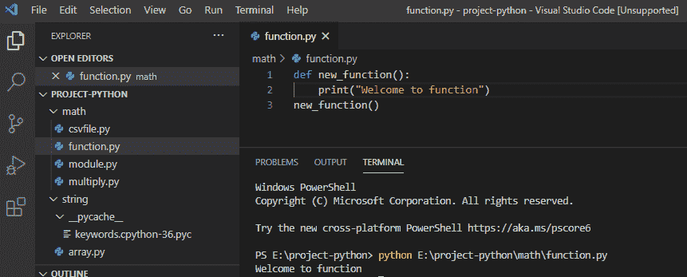

Calling a function in python

## Python 函数参数

在 python 中，信息作为参数传递给函数。参数在圆括号内传递，我们可以添加尽可能多的参数，但应该用逗号分隔。在这里，将会看到一个单独的自变量“ **stu_name** ”。

**举例:**

```py
def new_function(stu_name):
print(stu_name + " good ")
new_function("James")
new_function("Kavish")
```

写完上面的代码(python 中的参数)，你将调用 **"new_function()"** 然后输出将显示为 **" James good Kavish good "** 。在这里，当函数被调用时，我们传递函数中使用的学生名字，它将打印“good”。

可以参考下面 python 中的截图参数。

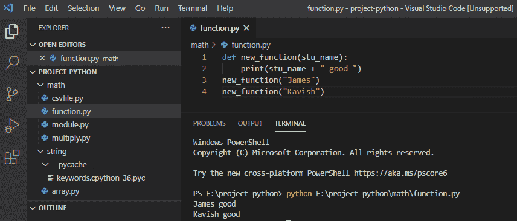

Arguments in python

这里，我们将看到带有两个参数的**函数，调用该函数时必须使用正确数量的参数以避免错误。**

**举例:**

```py
def new_function(name, behaviour):
print(name + " " + behaviour)
new_function("James", "good")
```

在编写了上面的代码(python 中有两个参数的函数)之后，您将调用 **"new_function()"** ，然后输出将显示为 **" James good "** 。在这里，调用函数时使用了两个参数，因为它需要两个参数。

可以参考下面 python 中带两个参数的截图函数。

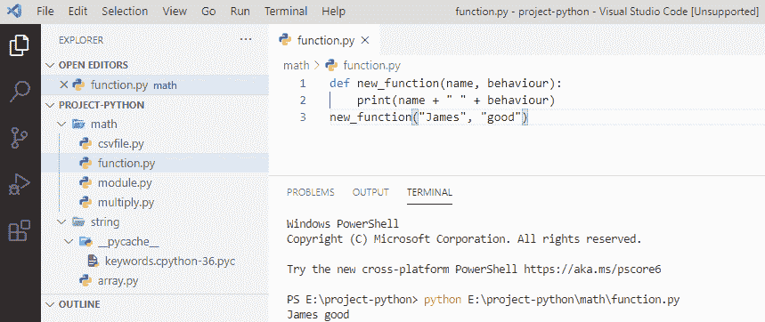

python function arguments

阅读:[如何在 Python 中使用过滤函数](https://pythonguides.com/filter-function-in-python/)

## Python 任意参数

在 python 中，如果我们事先不知道有多少个参数将被传递到函数中，那么我们在函数中的参数名前使用**星号“(*)”。**

**举例:**

```py
def new_function(*food):
for foods in food:
print("Favorite", foods)
new_function("pizza", "pasta", "maggi")
```

写完上面的代码(python 任意参数)，你将调用 **"new_function()"** 然后输出将显示为**"最喜欢的披萨最喜欢的意大利面最喜欢的 maggi "** 。这里，我们调用了带有多个参数的函数，在函数内部，我们使用 for 循环来检索所有参数。

可以参考下面截图 python 任意参数。

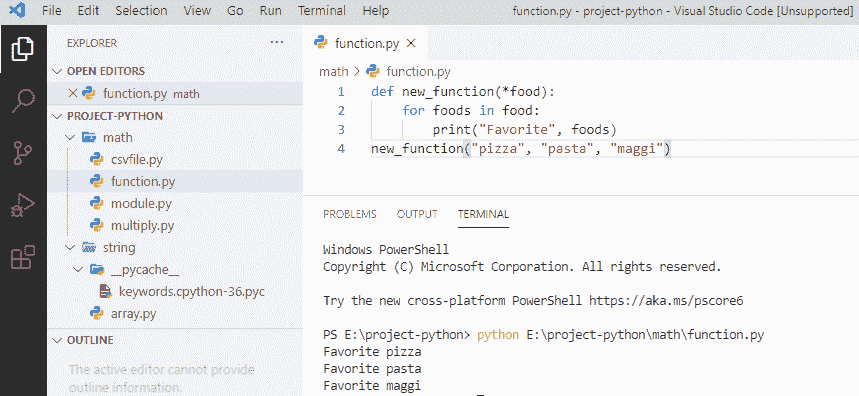

Python arbitrary arguments

## Python 关键字参数

关键字参数是用**“关键字=值”**传递给函数的参数。这里，关键字是关键字参数，值是传递的对象。

**举例:**

```py
def new_function(student1, student2):
print("Highest marks is obtained by " + student2)
new_function(student1 = "John", student2 = "Kavish")
```

写完上面的代码(python 关键字参数)，你将调用 **"new_function()"** ，然后输出将显示为**"最高分由卡维什获得"**。这里，关键字参数被传递给函数，参数的顺序无关紧要。

可以参考下面截图 python 关键字参数。

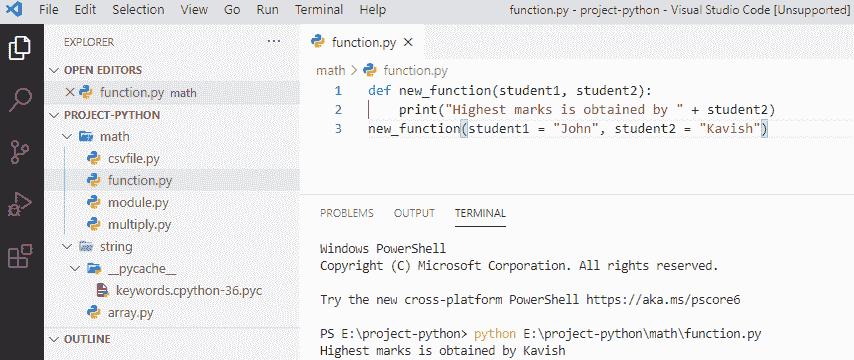

Python keyword arguments

## Python 函数中的默认参数值

在 python 中，如果一个函数在没有参数的情况下被调用，那么参数就会得到它的默认值，这个值叫做默认参数。

**举例:**

```py
def new_function(fruits = "apple"):
print("My favorite is " + fruits)
new_function("orange")
new_function()
```

写完上面的代码(python 中默认的参数值)，你会调用 **"new_function()"** 然后输出会出现一个**"我最喜欢的是橘子我最喜欢的是苹果"**。这里，默认参数是自动传递的，它出现在函数调用的输出中。

可以参考下面关于 Python 默认函数参数值的截图。

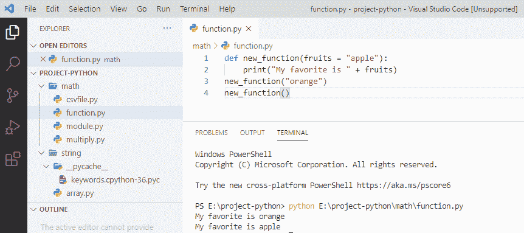

python default function parameter value

## Python 将列表作为参数传递给函数

在 python 中，可以向函数发送任何数据类型的参数，并且在函数内部将它们视为相同的数据类型。

**举例:**

```py
def new_function(flower):
for a in flower:
print(a)
flowers = ["rose", "lily", "tulip"]
new_function(flowers)
```

在编写了上面的代码(在 python 中以参数的形式传递一个列表)之后，你将调用 **"new_function()"** 然后输出将显示为**"玫瑰百合郁金香"**。在这里，我们将列表作为一个参数发送，当它到达函数时，它将同样处理。

你可以参考下面用 python 传递一个列表作为参数的截图。

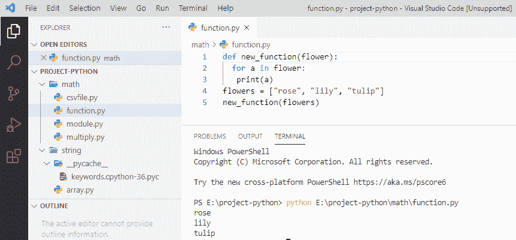

python pass list as arguments to function

## Python 函数中的返回值

我们在 python 中使用 **return 语句**，这样，python 中的函数返回值。

**举例:**

```py
def new_function(value)
return 10*value
print(new_function(5))
```

写完上面的代码(python 中的返回值)，你将调用 **"new_function()"** ，那么输出将显示为 **"50"** 。这里，return 语句跟在被求值的表达式后面，它返回值。

关于 python 中的返回值，可以参考下面的截图。

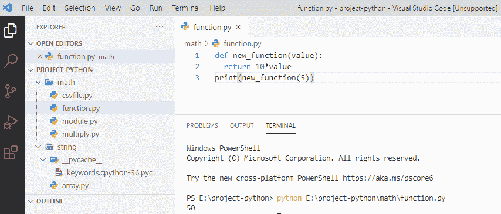

Return value in Python function

## python 中的 Return vs print

*   **退货**–**退货**是一个关键词。当到达 **return** 语句时，python 将停止当前函数的执行，并向调用函数的地方发送一个值。当你想把一个值从代码中的一点发送到另一点时，使用 **return** 。
*   **打印**–**打印**是你调用的一个函数。当我们调用 **print** 时，它会立即让你的程序写出来，你可以看到文本。当我们想向人类展示价值或任何信息时，我们使用印刷品。

## python 中的函数 vs 方法

**功能:**

*   它主要用于代码重用。
*   函数有两种类型:
    1.  内置函数
    2.  用户定义的函数
*   函数既可以在类内部使用，也可以在类外部使用。
*   一个函数可以通过它的名字来调用。
*   该函数可以有不同的参数，也可以没有任何参数。

**内置函数示例:**

```py
a = sum([10,5,15])
print(a)
```

你可以参考下面的 python 内置函数截图

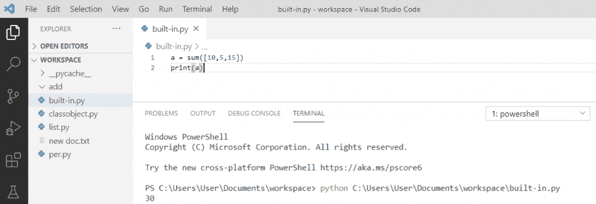

**Built-in function in python**

****自定义函数示例:****

```py
def add(x,y):
    return x+y
print (add(10,15))
```

你可以参考下面的用户自定义 python 函数的截图

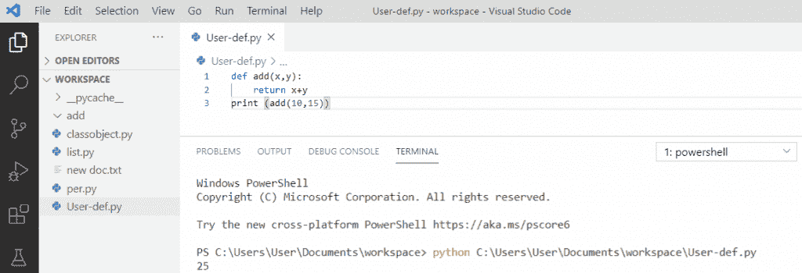

**Example of** **User-define functions:**

**方法:**

*   方法类似于函数，方法的主要任务是代码重用。
*   方法由用户定义。
*   方法总是使用面向对象的编程语言。
*   方法是在类内部定义的。
*   一个方法被它的名字调用，但是它与一个对象相关联。

**用户自定义方法示例:**

```py
class info:
    def method_s(self):
        print("This is method_s of info class.")
obj = info()
obj.method_s()
```

你可以参考下面的用户自定义 python 方法的截图

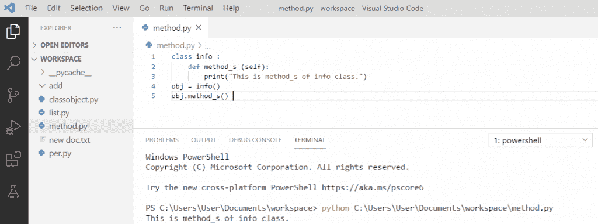

**User-defined method in python**

## 收益 vs 回报 python

| **产量** | **返回** |
| Yield 用于将常规 python 函数转换成生成器 | Return 一般用于结束执行并返回结果。 |
| 它可以运行多次。 | 返回仅运行一次 |
| 在下一个函数调用中执行 yield 语句后编写的代码 | 而在 return 语句之后编写的代码将不会执行 |
| 当生成器将结果返回给调用者时，使用 Yield。 | 当函数准备好发送一个值时，使用 Return。 |

## python 中函数内部的函数

函数内的**函数是内部函数或嵌套函数。嵌套函数能够访问变量，内部函数用于防止函数外部发生任何事情。**

**举例:**

```py
def outer_function(msg):
    msg = msg
    def inner_function():
        print(msg)
    inner_function()
if __name__ == '__main__':
    outer_function('Welcome to Python!')
```

在编写了上面的代码(python 中函数内部的函数)之后，一旦打印，输出将显示为**“欢迎使用 Python！”**。这里，inner_function()是在 outer_function()内部定义的。因此，要调用 inner_function，我们必须先调用 outer_function，然后 inner_function 才能执行。

你可以参考下面的 python 中函数内部函数的截图。

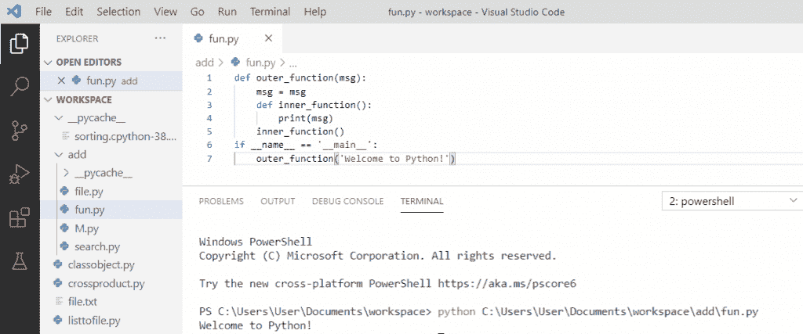

Function inside a function in python

让我们看看如果我们尝试调用 **inner_function()** 而不是 outer_function()会发生什么。你可以参考下面的例子

**举例:**

```py
def outer_function(msg):
    msg = msg
    def inner_function():
        print(msg)
    inner_function()
```

一旦你将**执行代码**，那么它将返回 **nothing** 。这是因为我们没有调用 outer_function()。所以，要调用 **inner_function()** ，我们必须先调用 **outer_function()** 。

## Python 嵌套函数变量作用域

我们可以找到变量并在需要时访问它的位置称为变量作用域。嵌套函数可以访问封闭范围的变量。

**举例:**

```py
def fun1():
    v = 'PythonGuides'
    def fun2():
        print(v)
    fun2()
fun1()
```

在编写了上面的代码(python 嵌套函数变量作用域)之后，一旦你要打印，那么输出将显示为 **"PythonGuides"** 。在这里，我们可以看到它类似于从函数中访问全局变量。

你可以参考下面的 python 嵌套函数变量作用域截图。

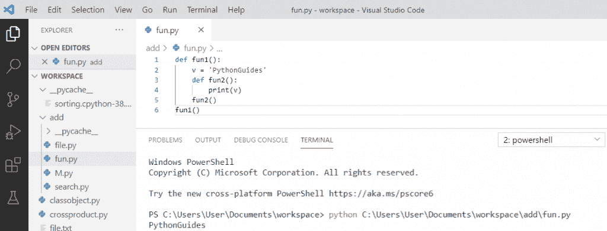

Python nested function variable scoping

您可能会喜欢以下 Python 教程:

*   [语法错误返回外部函数 python](https://pythonguides.com/syntaxerror-return-outside-function-python/)
*   [python 中的哈希表](https://pythonguides.com/hash-table-in-python/)
*   [Python 中的块缩进](https://pythonguides.com/block-indentation-in-python/)
*   [Python 从路径中获取文件名](https://pythonguides.com/python-get-filename-from-the-path/)
*   [Python For 循环示例](https://pythonguides.com/python-for-loop/)
*   [Python 创建空集](https://pythonguides.com/python-create-empty-set/)
*   [Python 关键字与示例](https://pythonguides.com/python-keywords/)
*   [Python While 循环示例](https://pythonguides.com/python-while-loop/)
*   [Python 中的字符串方法及示例](https://pythonguides.com/string-methods-in-python/)

在本 python 教程中，我们学习了 Python 函数以及如何使用它:

*   Python 中的函数是什么
*   在 python 中创建函数
*   在 python 中调用函数
*   python 中的参数
*   Python 任意参数
*   Python 关键字参数
*   默认参数值
*   在 python 中将列表作为参数传递
*   python 中的返回值
*   python 中的返回与打印
*   python 中的函数与方法
*   产出与回报 python
*   python 中函数内部的函数
*   Python 嵌套函数变量作用域

[Bijay Kumar](https://pythonguides.com/author/fewlines4biju/)

Python 是美国最流行的语言之一。我从事 Python 工作已经有很长时间了，我在与 Tkinter、Pandas、NumPy、Turtle、Django、Matplotlib、Tensorflow、Scipy、Scikit-Learn 等各种库合作方面拥有专业知识。我有与美国、加拿大、英国、澳大利亚、新西兰等国家的各种客户合作的经验。查看我的个人资料。

[enjoysharepoint.com/](https://enjoysharepoint.com/)[](https://www.facebook.com/fewlines4biju "Facebook")[](https://www.linkedin.com/in/fewlines4biju/ "Linkedin")[](https://twitter.com/fewlines4biju "Twitter")**