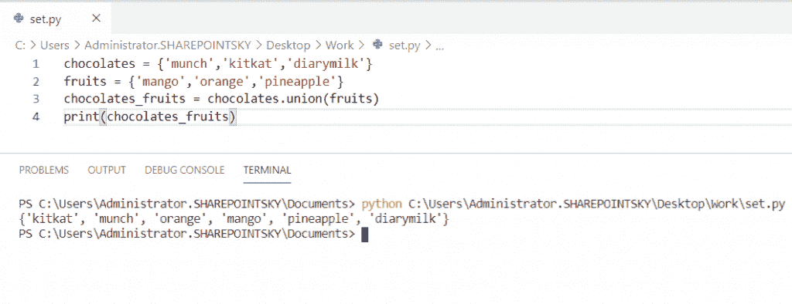
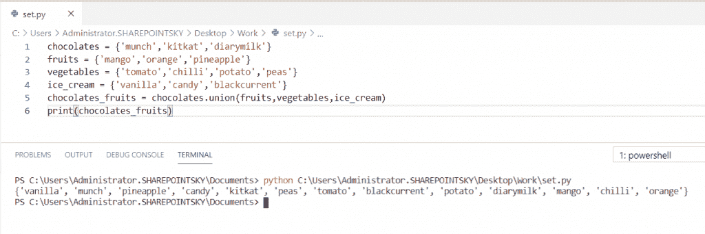
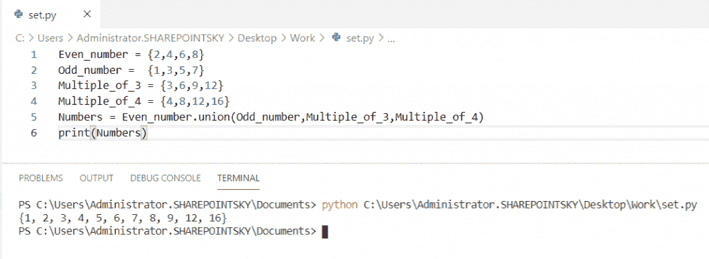
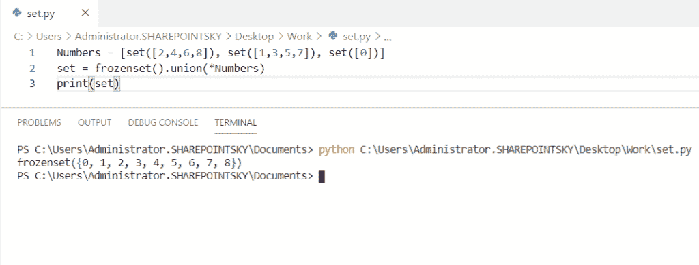
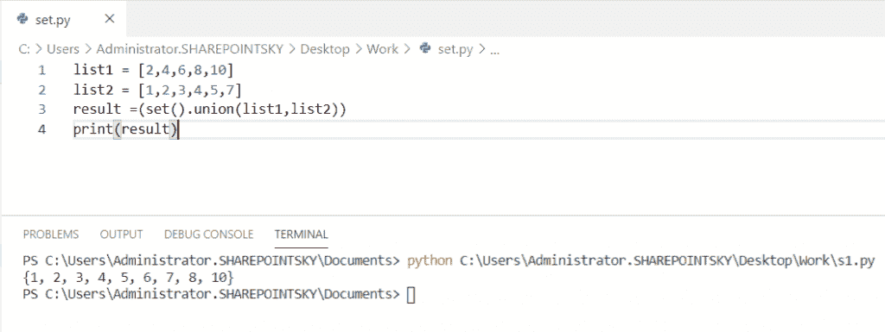

# 集合的联合 Python +示例

> 原文：<https://pythonguides.com/union-of-sets-python/>

[](https://sharepointsky.teachable.com/p/python-and-machine-learning-training-course)

在这个 [python 教程中，](https://pythonguides.com/python-hello-world-program/)我们将讨论集合的**并以及 python 中的并是什么**。我们还将检查:

*   Python 中两个集合的并集
*   Python 中多个集合的并集
*   Python 中集合的联合列表
*   Python 中多个集合的并集
*   Python 中几个集合的并集
*   Python 中列表中所有集合的并集
*   集合的联合 python 示例
*   列表的联合 Python

目录

[](#)

*   [什么是工会？](#What_is_the_union "What is the union?")
*   [Python 中两个集合的并集](#Union_of_two_sets_in_Python "Union of two sets in Python")
*   [Python 中多个集合的并集](#Union_of_multiple_sets_in_Python "Union of multiple sets in Python")
*   [Python 中集合的联合列表](#Union_list_of_sets_in_Python "Union list of sets in Python")
*   [多套 Python 的并集](#Union_of_many_sets_Python "Union of many sets Python")
*   [几个集合的并集 Python](#Union_of_several_sets_Python "Union of several sets Python")
*   [列表中所有集合的并集 Python](#Union_of_all_sets_in_a_list_Python "Union of all sets in a list Python")
*   [集合的并集 Python 示例](#Union_of_sets_Python_example "Union of sets Python example")
*   [列表的联合 Python](#Union_of_lists_Python "Union of lists Python")

## 什么是工会？

**Union()** 是 Python 中的一个方法，它返回一个包含所有集合中不同项目的**新集合**。

语法:

```py
union set = set1.union(set2)
```

## Python 中两个集合的并集

让我们看看，**如何在 python 中对两个集合**进行并集运算。

*   在这个例子中，我取了两组作为**巧克力和水果**这些组包含元素。
*   为了对这些集合执行 union 操作，我们必须创建一个名为 chocolates _ fruits 的新集合。为了创建一个新的集合，我们必须使用**巧克力 _ 水果=巧克力. union(水果)**。
*   新的集合**巧克力 _ 水果**由**调用 union()** 创建，**水果集合作为参数传递**在 union()方法中。

示例:

```py
chocolates = {'munch','kitkat','diarymilk'}
fruits = {'mango','orange','pineapple'}
chocolates_fruits = chocolates.union(fruits)
print(chocolates_fruits)
```

将两个集合中的所有项目组合成一个名为 **chocolate_fruits 的新集合。**我们必须使用**打印(巧克力 _ 水果)。**下面的截图显示了输出。



Union of two sets python

阅读:[如何在 Django 中添加下拉导航条](https://pythonguides.com/add-dropdown-navbar-in-django/)

## Python 中多个集合的并集

这里可以看到**如何在 python 中对多个集合**进行 union 运算。

*   在这个例子中，我拿了多套，它们是巧克力、水果、蔬菜和冰淇淋。
*   对这些集合执行并集运算。新的集合**巧克力 _ 水果**被创建，为了创建一个新的集合我们必须使用**巧克力 _ 水果=巧克力. union(水果，蔬菜，冰淇淋)**。
*   **union()** 方法被调用，**将所有集合作为参数**传递给了 **union()** 方法。

语法:

```py
union set = set1.union(set2,set3,set4)
```

示例:

```py
chocolates = {'munch','kitkat','diarymilk'}
fruits = {'mango','orange','pineapple'}
vegetables = {'tomato','chilli','potato','peas'}
ice_cream = {'vanilla','candy','blackcurrent'}
chocolates_fruits = chocolates.union(fruits,vegetables,ice_cream)
print(chocolates_fruits)
```

要获得多个集合中所有项目的组合输出，比如新集合中的**巧克力= {'munch '，' kitkat '，' diarymilk'}，水果= {'mango '，' orange '，'菠萝' }，蔬菜= { '番茄'，'辣椒'，'土豆'，'豌豆' }，冰激凌= { '香草'，'糖果'，' blackcurrent'}** ，称为**巧克力 _ 水果**，我们必须使用**打印(巧克力 _ 水果)**。您可以在下面的截图中看到输出。



Union of multiple sets python

## Python 中集合的联合列表

现在，我们可以看到**如何在 python 中对集合列表**执行联合操作

*   在这个例子中，我已经用 Python 中的[创建了一个列表，并将其命名为**条目**、**T5，并在列表中分配了一些集合。**](https://pythonguides.com/create-list-in-python/)
*   使用 set()创建一个新的集合，并调用 **union()** ，然后**项集合作为参数**被传递到 **union()** 方法中。
*   使用**星号*** 对列表进行解包。

示例:

```py
items = [{'chocolate','biscuits'}, {'potato','tomato'}, {'apple','orange','pear'}]
print(set().union(*items))
```

要获得集合中所有项目的组合输出，比如新集合中的 **[{ '巧克力'，'饼干' }，{ '土豆'，'番茄' }，{ '苹果'，'橘子'，'梨' }]** ，我们必须使用 **print(set()。工会(*项))**。您可以在下面的截图中看到输出。


Union list of sets python

阅读:[如何在 Python 中添加集合中的元素](https://pythonguides.com/add-elements-in-a-set-in-python/)

## 多套 Python 的并集

在这里，我们可以看到**如何在 python 中对多个集合**执行 union 操作

*   在这个例子中，我在一个列表中取了许多集合，并将一个列表命名为**数字**
*   使用 set()创建一个新的集合，然后调用 **union()** 方法，在 union()方法中传递**参数号**。
*   使用**星号*** 对列表进行解包

示例:

```py
Numbers = [{2,4,6}, {1,3,5}, {0}, {3,6,9},{4,8,12}]
print(set().union(*Numbers))
```

要获得集合中所有项目的组合输出，比如新集合中的 **[{2，4，6}，{1，3，5}，{0}，{3，6，9}，{4，8，12}]** ，我们必须使用 **print(set()。工会(*数字))**。下面的截图显示了输出。


Union of many sets python

## 几个集合的并集 Python

现在，我们可以**如何在 python 中对几个集合**执行联合运算

*   在这个例子中，我取了几个集合，分别命名为 **Even_number，Odd_number，Multiple_of_3，Multiple_of_4。**
*   创建名为**号的新集合。**我们要用 **Numbers = Even_number.union(奇数，3 的倍数，4 的倍数)**。
*   对所有这些集合执行联合运算。一个新的集合被创建为**数字**，在新的集合中 **union()** 被调用，所有的集合都作为参数在 union()方法中传递。

示例:

```py
Even_number = {2,4,6,8}
Odd_number =  {1,3,5,7}
Multiple_of_3 = {3,6,9,12} 
Multiple_of_4 = {4,8,12,16}
Numbers = Even_number.union(Odd_number,Multiple_of_3,Multiple_of_4)
print(Numbers)
```

要获得几个集合中所有项目的组合输出，比如在一个名为 **Numbers** 的新集合中的**偶数= {2，4，6，8}
奇数= {1，3，5，7}，3 的倍数= {3，6，9，12}，4 的倍数= {4，8，12，16}** ，我们必须使用 **print(Numbers)** 。您可以参考下面的输出截图。



Union of several sets python

## 列表中所有集合的并集 Python

让我们看看，**如何在 python 中对列表**中的所有集合进行并集运算。

*   在这个例子中，我取了一个名为**数字**的**列表**。
*   我们必须使用 **set = frozenset()创建一个新的集合。联合(*数字)**。为了创建一个新的集合，调用了 frozenset()，还调用了 **union()** 。然后在 union()方法中传递参数**数字**。
*   **frozenset()** 是一个从列表中返回所有集合对象的函数。一个**星号*** 用于解包列表。

示例:

```py
Numbers = [set([2,4,6,8]), set([1,3,5,7]), set([0])]
set = frozenset().union(*Numbers)
print(set)
```

从一个新集合中的集合 **[set([2，4，6，8])，set([1，3，5，7])，set([0])]**中获取项目的组合输出。我们必须使用**打印(设置)**。下面的截图显示了输出。



Union of all sets in a list python

## 集合的并集 Python 示例

现在，我们可以看到一个关于 python 中集合的并集的例子。

*   在这个例子中，我取了两个集合**元音**和**辅音**。
*   获取新列表中的所有字母，称为**字母表。**使用**字母表=元音. Union(辅音)**进行联合运算。

示例:

```py
vowels = {'a','e','i','o','u'}
consonants =   {'b','c','d','f','g','h','j','k','l','m','n','p','q','r','s','t','v','w','x','y','z'}
alphabets = vowels.union(consonants)
print(alphabets)
```

以字母表的形式获得输出。我们必须使用 **print(字母表)**。您可以在下面的截图中看到输出。


Union of sets python example

## 列表的联合 Python

在这里，我们可以看到**如何在 Python** 中执行列表的 union 操作。

*   在这个例子中，我取了两个列表作为**列表 1** 和**列表 2。**
*   要创建一个新的列表，我们必须使用 **result =(set()。union(list1，list2))** 。
*   新的 set **结果**由**调用 set()** 创建，也由**调用 union()** 创建，然后 **list1、list2 作为参数在 union()方法中传递。**

示例:

```py
list1 = [2,4,6,8,10]
list2 = [1,2,3,4,5,7]
result =(set().union(list1,list2))
print(result)
```

为了获得新列表的输出，我们必须使用 **print(result)** 。您可以参考下面的输出截图。



Union of lists python

您可能会喜欢以下 Python 教程:

*   [Python 接口介绍](https://pythonguides.com/python-interface/)
*   [如何在 Python 中把字符串转换成日期时间](https://pythonguides.com/convert-a-string-to-datetime-in-python/)
*   [Python 中的转义序列](https://pythonguides.com/escape-sequence-in-python/)
*   [Python 列表理解λ](https://pythonguides.com/python-list-comprehension/)
*   [使用 Python 发送电子邮件](https://pythonguides.com/send-email-using-python/)
*   [在 Python 中使用 JSON 数据](https://pythonguides.com/json-data-in-python/)
*   [Python – stderr, stdin and stdout](https://pythonguides.com/python-stderr-stdin-and-stdout/)
*   [Python 获得一个 IP 地址](https://pythonguides.com/python-get-an-ip-address/)
*   [Python 中的递增和递减运算符](https://pythonguides.com/increment-and-decrement-operators-in-python/)
*   [Python 中的构造函数](https://pythonguides.com/constructor-in-python/)
*   [如何在 Python 中将 dictionary 转换成 JSON](https://pythonguides.com/convert-dictionary-to-json-python/)

在本 Python 教程中，我们学习了集合 **的**并，以及 Python** 中什么是并** **。此外，我们还讨论了以下主题:**

*   两个集合的并集
*   多个集合的并集
*   集合的联合列表 python
*   多集合的并集
*   几个集合的并集
*   列表 python 中所有集合的并集
*   集合的联合 python 示例
*   列表的联合 python

[Bijay Kumar](https://pythonguides.com/author/fewlines4biju/)

Python 是美国最流行的语言之一。我从事 Python 工作已经有很长时间了，我在与 Tkinter、Pandas、NumPy、Turtle、Django、Matplotlib、Tensorflow、Scipy、Scikit-Learn 等各种库合作方面拥有专业知识。我有与美国、加拿大、英国、澳大利亚、新西兰等国家的各种客户合作的经验。查看我的个人资料。

[enjoysharepoint.com/](https://enjoysharepoint.com/)[](https://www.facebook.com/fewlines4biju "Facebook")[](https://www.linkedin.com/in/fewlines4biju/ "Linkedin")[](https://twitter.com/fewlines4biju "Twitter")