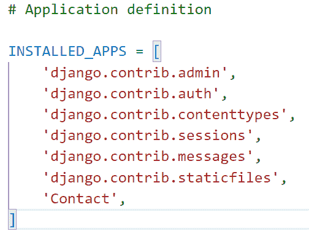
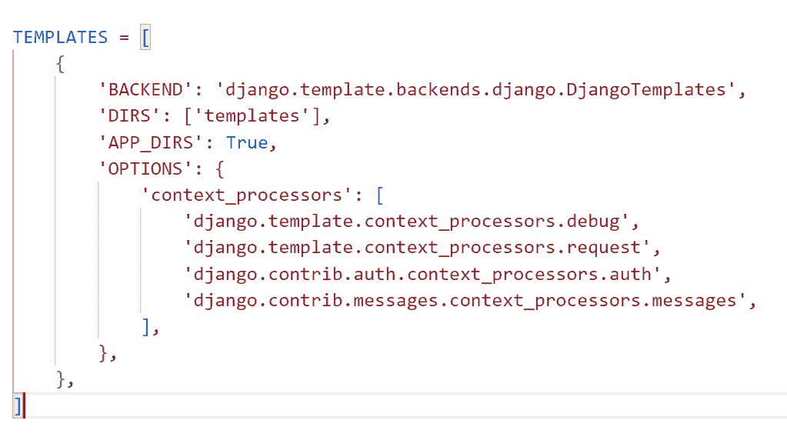
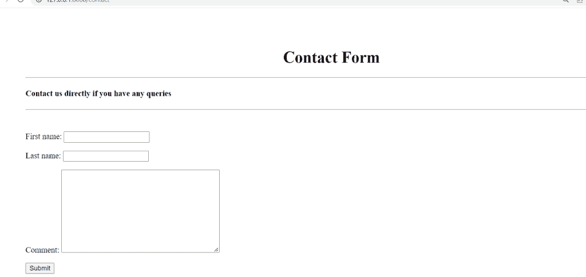
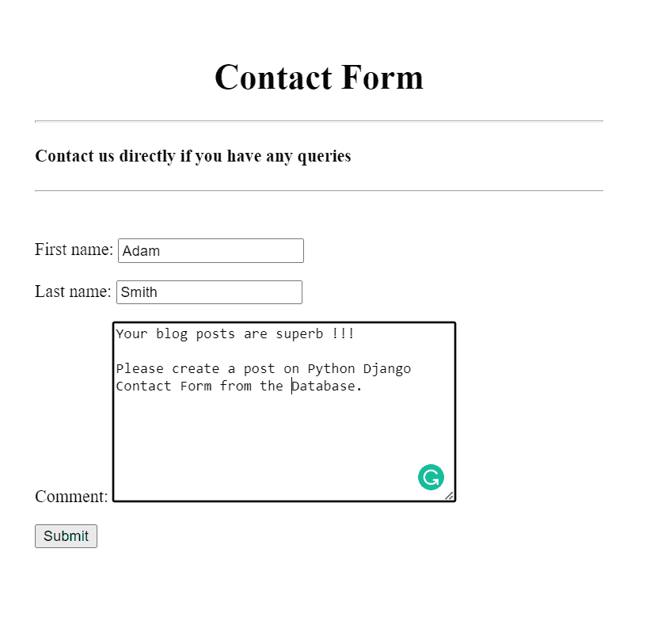

# Python Django 中网站的简单联系方式

> 原文：<https://pythonguides.com/simple-contact-form-for-website-in-python-django/>

[](https://sharepointsky.teachable.com/p/python-and-machine-learning-training-course)

在这个 [Python Django 教程](https://pythonguides.com/what-is-python-django/)中，我将一步一步地解释如何在 Python Django 中**为网站构建简单的联系表单。**

最近，我一直在使用 Django 框架为 PythonGuides 创建一个网站。我发现它需要一个联系表格来与网站工作人员沟通。

所以，我做了一些研究，并用 FormClass 为 Django 的一个网站创建了一个联系表单，如下所示。


Simple Contact Form for Website in Python Django

在这里我们将看到:

*   什么是联系方式
*   如何在 Python Django 中为网站设置一个简单的联系方式
*   如何在 Django 中添加 max_length 表单验证
*   如何在 Django 中将表单呈现为一个段落
*   如何在 Django 终端上查看表单数据

在本文的最后，您还可以下载代码:**在 Python Django** 中为网站创建一个简单的联系表单 **。**

目录

[](#)

*   [如何在 Python Django 中为网站创建一个简单的联系表单](#How_to_create_a_simple_Contact_form_for_website_in_Python_Django "How to create a simple Contact form for website in Python Django")
    *   [联系方式](#Contact_Form "Contact Form")
    *   [如何在 Python Django 中设置简单的网站联系方式](#How_to_set_up_a_simple_contact_form_for_website_in_Python_Django "How to set up a simple contact form for website in Python Django")
    *   [创建简单表单](#Create_Simple_Form "Create Simple Form")
    *   [在 Django 中以段落形式呈现表单](#Render_the_form_as_a_paragraph_in_Django "Render the form as a paragraph in Django")
    *   [在 Django 终端查看表单数据](#View_form_data_on_the_Django_terminal "View form data on the Django terminal")
    *   [执行 Django 应用程序的联系表](#Execute_Contact_Form_Django_Application "Execute Contact Form Django Application")
*   [下载 Django 从完整代码中构建一个简单的联系人](#Download_the_Django_build_a_simple_contact_from_complete_code "Download the Django build a simple contact from complete code")
*   [结论](#Conclusion "Conclusion")

## 如何在 Python Django 中为网站创建一个简单的联系表单

现在，让我们一步一步地看看如何为 Python Django 应用程序构建联系人表单。

### 联系方式

我们可能已经注意到，在大多数公司网站上，网站上有一个页面，允许访问者与网站所有者进行交流。

姓名、地址和评论类型是页面上经常需要的字段，偶尔电子邮件地址也是。该页面称为联系页面，由联系表单组成。

简而言之，联系表单为用户提供了一种快速、简便的方式来询问公司问题。

### 如何在 Python Django 中设置简单的网站联系方式

要启动 Django 项目，请打开终端并输入以下命令。这里 **PythonGuides** 是 Django 项目的名称。

```
django-admin startproject PythonGuides
```

它将创建一个名为 **PythonGuides** 的新文件夹，并在终端中输入以下命令。

```
cd PythonGuides
```

现在，通过在终端中键入下面的命令，在这个项目文件夹中创建一个名为 **Contact** 的 Django 应用程序。

```
python manage.py startapp Contact
```

要激活此应用程序，请将应用程序名称添加到位于 **settings.py** 文件中的 **INSTALLED_APP** 列表中。



Settings.py

Django 默认在项目目录中包含一个 **urls.py** 文件，用于将新构建的应用程序映射到其中。在其中添加下面的代码。

```
from django.contrib import admin
from django.urls import path,include

urlpatterns = [
    path('admin/', admin.site.urls),
    path('',include('Contact.urls')),
]
```

阅读: [Python Django 表单验证](https://pythonguides.com/django-form-validation/)

### 创建简单表单

创建 Django 表单，该表单接受用户对**联系人**应用程序的输入。为此，在 app 目录中创建 **forms.py** 文件，并添加下面给出的代码。

```
from django import forms

# Create your forms here.

class ContactForm(forms.Form):
	first_name = forms.CharField(max_length = 100)
	last_name = forms.CharField(max_length = 100)
	comment = forms.CharField(widget = forms.Textarea, max_length = 1500)
```

这里，我们创建一个表单类 **ContactForm** ，它有以下字段。

1.  将**的名**和**的姓**作为 Django CharFields。每个字符域都有 100 个 **max_length** 字符的限制。
2.  作为 Django CharField 的 **comment** 字段将显示为一个 Textarea。并且有 1500 个 **max_length** 字符的限制。\

阅读:[点击 Django 中的 HTML 按钮运行 Python 函数](https://pythonguides.com/run-python-function-by-clicking-on-html-button-in-django/)

### 在 Django 中以段落形式呈现表单

在 Django 中，应用程序的**前端**是在模板中定义的，为此，在主项目目录中创建一个名为**模板**的子目录来存储所有的项目模板。

打开 **settings.py** 文件，更新 **DIRS** 指向 Templates 文件夹的位置。



Setting Templates Folder Location

为了定义联系人网页的前端，在**模板**文件夹中创建一个名为**contact.html**的 HTML 文件。并添加下面的代码。

```
<div style="margin:80px">
    <h1 align="center">Contact Form</h1>
    <hr>
    <h4>Contact us directly if you have any queries</h4>
    <hr>
    <br>
    <form method="post">
        
        {{form.as_p}}
        <button type="submit">Submit</button>
    </form>
</div>
```

*   首先使用 HTML 标签 **h1** 和 **h4** 将标题添加到表单中。
*   然后用方法 **POST** 调用**表单**标签，这样表单在提交时就被发布了。
*   为了防止表单受到网络攻击并允许您安全地发送信息，请在**表单**元素中添加 **** 。
*   接下来，使用 **form.as_p** 标签将表单呈现为一个段落。
*   最后，添加一个**提交**按钮来提交表单。

### 在 Django 终端查看表单数据

为了定义简单联系人表单的主要逻辑，我们打开 **views.py** 文件并添加下面给出的代码。

```
from django.shortcuts import render
from .forms import ContactForm

# Create your views here.

def contact(request):
	if request.method == 'POST':
		form = ContactForm(request.POST)
		if form.is_valid():
			first_name = form.cleaned_data['first_name']
			last_name = form.cleaned_data['last_name']
			comment = form.cleaned_data['comment']
			print('First Name:', first_name)
			print('Last Name:', last_name)
			print('Comment:',comment)	      
	form = ContactForm()
	return render(request, "contact.html", {'form':form})
```

*   首先从 **forms.py** 中导入 **ContactForm** ，然后调用 **if** 语句，检查请求方式是否为 **POST** 。
*   如果是，我们通过 **ContactForm(请求。POST)** 将数据绑定到表单类，这样我们就可以进行验证。
*   现在，调用 **is_valid()** 来验证用户输入的内容，如果验证成功，调用**form . cleaned _ data[' form _ field ']**来清理数据，并使用 **print()** 函数在终端上打印出来。
*   如果请求方法是 **GET** ，则使用 **render()** 函数向用户呈现一个空白的联系人表单。

现在，我们必须用 URL 映射视图以便调用它，因此我们必须在 app 目录中创建一个名为 **urls.py** 的文件。包括下面的代码。

```
from django.urls import path
from Contact import views

urlpatterns = [
    path("contact", views.contact, name="contact"),   
]
```

阅读:[如何在 Django 中创建模型](https://pythonguides.com/create-model-in-django/)

### 执行 Django 应用程序的联系表

Django 的 **manage.py** 文件包含一个名为 **runserver** 的内置子命令，它将为特定的 Django 项目启动一个开发服务器。

在终端中键入下面给出的命令并运行服务器。

```
python manage.py runserver
```

每个互联网页面都需要一个唯一的 URL。通过这样做，您的应用程序将能够识别当用户打开该 URL 时显示什么。

默认情况下，Django localhost 将 URL 显示为 **127.0.0.1:8000/** 。现在如下扩展这个 URL 来打开联系表单。

```
127.0.0.1:8000/contact
```

它成功地打开了 Django 简单联系表单，看起来像这样。



Contact Us

现在，填写联系表单并点击提交按钮，如下所示。



Simple Contact Form for the website

点击提交后，会在终端上打印出**名**、**姓**和**备注**。


Output on the terminal after submission of the Contact Form

这就是我们如何为 Django 网站构建一个简单的 Django 联系表单。

阅读: [Python Django app 上传文件](https://pythonguides.com/django-app-upload-files/)

## 下载 Django **从**建立简单联系完整代码

这是代码。

[Build Simple Contact Form](https://pythonguides.com/wp-content/uploads/2022/11/PythonGuides.zip)

## 结论

这样，我们就成功地使用 Django 项目中的 form 类构建了一个简单的联系人表单。我们还学习了将表单呈现为一个段落，并在终端中查看表单数据。

您可能也喜欢阅读下面的 Python Django 教程。

*   [Django 从 POST 请求中获取所有数据](https://pythonguides.com/django-get-all-data-from-post-request/)
*   [Django 模板中的 If 语句](https://pythonguides.com/if-statement-in-django-template/)
*   [Python Django 随机数](https://pythonguides.com/django-random-number/)
*   [用姜戈脆皮蛋糕制作蛋糕](https://pythonguides.com/create-form-with-django-crispy-forms/)
*   [将 Google reCAPTCHA 添加到 Django 表单中](https://pythonguides.com/add-google-recaptcha-to-django-form/)
*   [将 Python 输出到 html Django](https://pythonguides.com/outputting-python-to-html-django/)

此外，我们还讨论了以下主题。

*   什么是联系方式
*   如何在 Python Django 中为网站设置一个简单的联系方式
*   如何在 Django 中添加 max_length 表单验证
*   如何在 Django 中将表单呈现为一个段落
*   如何在 Django 终端上查看表单数据

[Bijay Kumar](https://pythonguides.com/author/fewlines4biju/)

Python 是美国最流行的语言之一。我从事 Python 工作已经有很长时间了，我在与 Tkinter、Pandas、NumPy、Turtle、Django、Matplotlib、Tensorflow、Scipy、Scikit-Learn 等各种库合作方面拥有专业知识。我有与美国、加拿大、英国、澳大利亚、新西兰等国家的各种客户合作的经验。查看我的个人资料。

[enjoysharepoint.com/](https://enjoysharepoint.com/)[](https://www.facebook.com/fewlines4biju "Facebook")[](https://www.linkedin.com/in/fewlines4biju/ "Linkedin")[](https://twitter.com/fewlines4biju "Twitter")