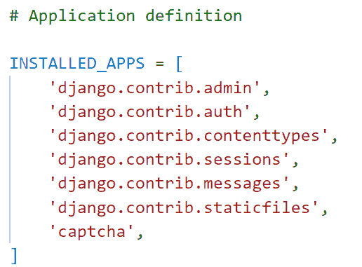
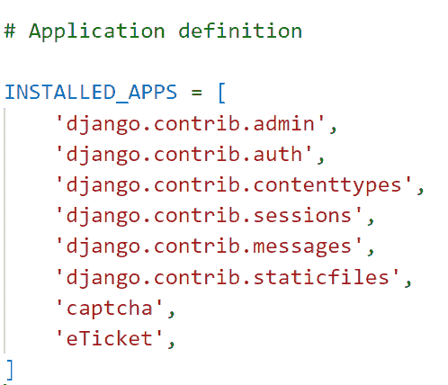
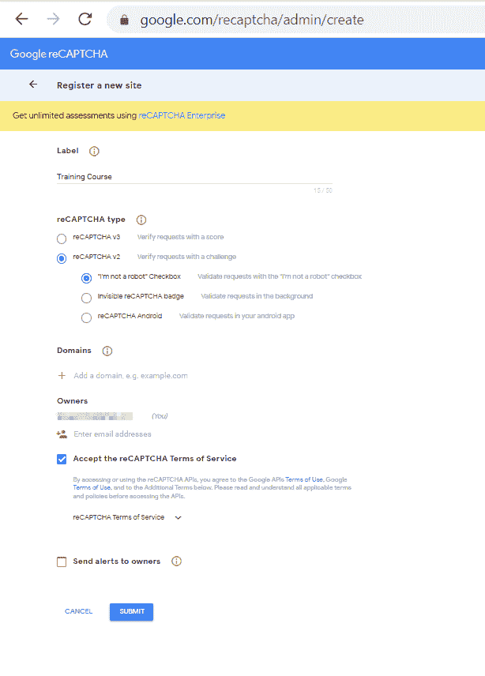
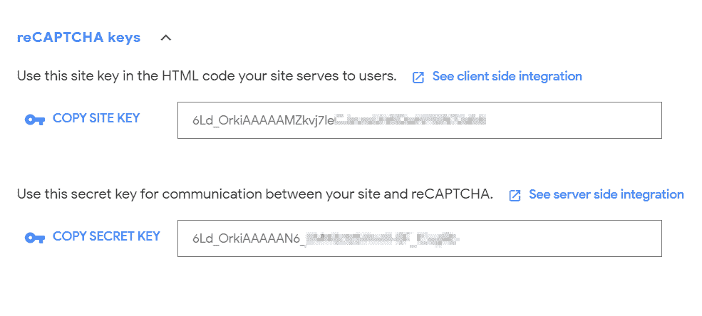
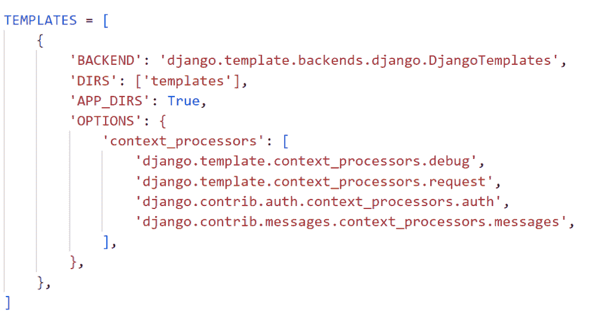
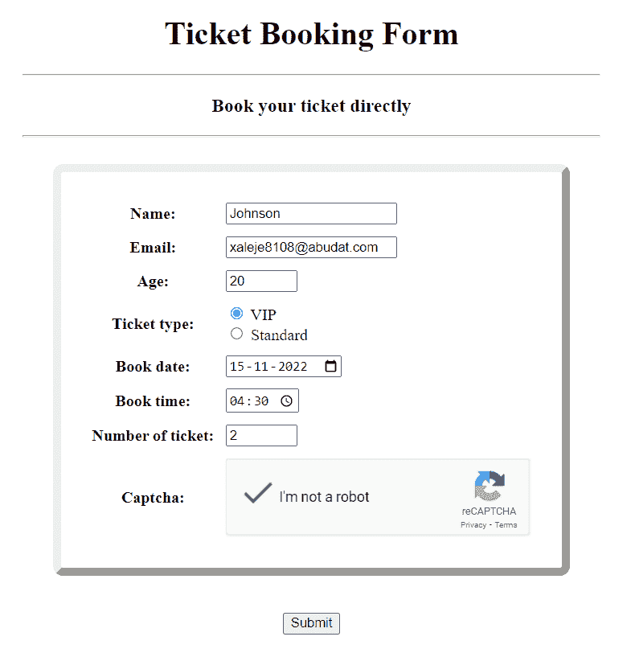

# 如何将 Google reCAPTCHA 添加到 Django 表单中

> 原文：<https://pythonguides.com/add-google-recaptcha-to-django-form/>

[](https://sharepointsky.teachable.com/p/python-and-machine-learning-training-course)

在这个 [Python Django 教程](https://pythonguides.com/what-is-python-django/)中，我将一步步解释如何**将 Google reCAPTCHA 添加到 Django 表单**中。

作为一名 Python Django 开发人员，在处理 Django 表单时，我想保护它免受垃圾邮件、僵尸程序和 DDoS 攻击。所以，我搜索了一下，发现 reCAPTCHA 是最好的解决方案之一。

在这里我们将看到:

*   什么是 reCAPTCHA
*   如何使用 Form 类构建 Django 表单
*   如何在 Django 中添加对年龄和门票数量字段的验证
*   将 Google reCAPTCHA 添加到 Django 表单
*   如何在 Django 中使用各种控件，如文本框、电子邮件、日期、时间和整数
*   如何在 Django 中将表单呈现为表格

在本文的最后，您还可以下载代码:**将 Google reCAPTCHA v3 添加到 Django 表单中。**

这是我们将在这里建造的。


Add Google reCAPTCHA to Django Form

目录

[](#)

*   [将 Google reCAPTCHA 添加到 Django 表单中](#Add_Google_reCAPTCHA_to_Django_Forms "Add Google reCAPTCHA to Django Forms")
    *   [谷歌 reCAPTCHA](#Google_reCAPTCHA "Google reCAPTCHA")
    *   [如何设置 Django Google reCAPTCHA](#How_to_setup_Django_Google_reCAPTCHA "How to setup Django Google reCAPTCHA")
    *   [用 reCAPTCHA 设置 Django 项目](#Setup_Django_Project_with_reCAPTCHA "Setup Django Project with reCAPTCHA")
    *   [生成 Google reCAPTCHA 的步骤](#Steps_to_generate_Google_reCAPTCHA "Steps to generate Google reCAPTCHA")
    *   使用带有 reCAPTCHA 的表单类构建 Django 表单。
    *   [在 Django 中以表格的形式呈现表单](#Render_the_form_as_a_table_in_Django "Render the form as a table in Django")
    *   [在终端上查看 Django 表单数据](#View_Django_form_data_on_the_terminal "View Django form data on the terminal")
    *   [在 Django 执行订票表格申请](#Execute_Ticket_Booking_Form_Application_in_Django "Execute Ticket Booking Form Application in Django")
*   [下载添加 Google reCAPTCHA v3 到 Django 表单的完整代码](#Download_Adding_Google_reCAPTCHA_v3_to_Django_Forms_complete_code "Download Adding Google reCAPTCHA v3 to Django Forms complete code")
*   [结论](#Conclusion "Conclusion")

## 将 Google reCAPTCHA 添加到 Django 表单中

现在，让我们一步一步地看看如何用 Google reCAPTCHA 创建 Django 表单。

### 谷歌 reCAPTCHA

reCAPTCHA 是谷歌的一项免费服务，它可以在通过表单提交或传递任何数据时保护我们的网站免受不必要的机器人或垃圾邮件的攻击。

基本上，reCAPTCHA 是一种区分人类和机器人的测试。

通过在网站上包含 reCAPTCHA，我们可以防止自动软件进入，同时方便用户进入。因为这对于人们来说很容易发现，但对于“机器人”和其他有害软件来说却是一个挑战。

### 如何设置 Django Google reCAPTCHA

django-recaptcha 应该首先安装在您激活的虚拟环境中。在这个包的帮助下，我们可以用 Google reCAPTCHA 呈现 Django 表单。

```
pip install django-recaptcha 
```

安装完成后，将 Django **captcha** 添加到 **settings.py** 文件中的 **INSTALLED_APPS** 中。



settings.py

阅读: [Python Django vs ReactJS](https://pythonguides.com/django-vs-reactjs/)

### 用 reCAPTCHA 设置 Django 项目

要启动 Django 项目，请打开终端并输入以下命令。这里 **eBooking** 是 Django 项目的名称。

```
django-admin startproject eBooking
```

它将创建一个名为 **eBooking** 的新文件夹，并在终端中输入以下命令。

```
cd eBooking
```

通过在终端中键入下面的命令，在这个项目文件夹中创建一个名为 **eTicket** 的 Django 应用程序。

```
python manage.py startapp eTicket
```

要激活此应用程序，请将应用程序名称添加到位于 **settings.py** 文件中的 **INSTALLED_APP** 列表中。



settings.py

Django 默认在项目目录中包含一个 **urls.py** 文件，用于将新构建的应用程序映射到其中。在其中添加下面的代码。

```
from django.contrib import admin
from django.urls import path,include

urlpatterns = [
    path('admin/', admin.site.urls),
    path('',include('eTicket.urls')),
]
```

阅读: [Python Django MySQL CRUD](https://pythonguides.com/python-django-mysql-crud/)

### 生成 Google reCAPTCHA 的步骤

我们必须按照下面的步骤生成一个 reCAPTCHA。

1.  我们的网站必须首先在 [reCaptcha 管理控制台](https://www.google.com/recaptcha/admin/create)上注册。
2.  设置我们想要的标签。标签是单词或短语中的某个东西。
3.  我们可以选择任何你喜欢的 reCaptcha 类型；在这种情况下，我选择了带有“我不是机器人”复选框的 v2。
4.  在域选项中，添加本地主机域，即 127.0.0.1。
5.  现在，单击 save 按钮保存更改。
6.  保存表单时，API 键会显示给我们。



Google reCAPTCHA



reCAPTCHA keys

一旦我们获得了我们的 API 证书，返回到 Django 项目目录并打开 **settings.py** 文件。

现在添加 Django 验证 reCAPTCHA 所需的设置，如下所示。

```
# Recaptcha Settings
RECAPTCHA_PUBLIC_KEY = 'Paste your site key here'
RECAPTCHA_PRIVATE_KEY = 'Paste your secret key here'
SILENCED_SYSTEM_CHECKS = ['captcha.recaptcha_test_key_error']
```

阅读:[如何在 Django 中创建模型](https://pythonguides.com/create-model-in-django/)

### 使用带有 reCAPTCHA 的表单类构建 Django 表单。

为了收集用户输入，我们使用了一个表单，并且还向其中添加了 reCAPTCHA。为此，创建 **forms.py** 文件，并将给定的代码添加到其中。

```
from django import forms
from captcha.fields import ReCaptchaField
from captcha.widgets import ReCaptchaV2Checkbox

# Create your forms here.

select_ticket_type = (
    ("1","VIP"),
    ("2", "Standard"),
)

class DateInput(forms.DateInput):
    input_type = 'date'

class TimeInput(forms.TimeInput):
    input_type = 'time'

class BookTicketForm(forms.Form):
    name = forms.CharField(max_length = 100)
    email = forms.EmailField()
    age = forms.IntegerField(min_value=18,max_value=50)
    ticket_type = forms.CharField(widget=forms.RadioSelect(choices=select_ticket_type))
    book_date = forms.DateTimeField(widget=DateInput)
    book_time = forms.TimeField(widget=TimeInput)
    number_of_ticket = forms.IntegerField(min_value=1,max_value=100)
    captcha = ReCaptchaField(widget=ReCaptchaV2Checkbox)
```

首先，当我们使用 form 类创建表单时，导入**表单**。

要将验证码添加到表单中，分别从验证码字段和小部件中导入 **ReCaptchaField** 和**recaptchav2 复选框**。

然后创建一个名为 **BookTicketForm** 的表单。并向其中添加以下字段。

1.  **名**是 Django CharFields。这个字符域有 100 个 **max_length** 字符的限制。
2.  **电子邮件**是 Django EmailField，允许用户保存电子邮件地址。
3.  **年龄**是姜戈·因吉尔菲尔德。这里我们将 18 设置为**最小值**，将 100 设置为**最大值**。
4.  **ticket_type** 是 Django CharField。我们将**窗口小部件**属性传递给它，将其设置为单选按钮，一个**选项**选项，是可以用作字段选项的序列。我们为这个选项定义了一个名为 **select_ticket_type** 的元组。
5.  **book_date** 是 Django DateField，我们将 **widget** 属性作为 **DateInput** 传递。我们将 DateInput 类定义为 **input_type** date。
6.  **book_time** 是 Django TimeField，我们将**小部件**属性作为 **TimeInput** 传递。我们将 DateInput 类定义为 **input_type** time。
7.  车票的号码是 Django IntegerField。这里我们将 1 设为**最小值**，将 100 设为**最大值**。
8.  添加了作为 Django **ReCaptchaField** 的 **captcha** ，这将呈现 Google reCAPTCHA V2-复选框，为了呈现它，我们将**小部件**作为选项传递给 ReCaptchaField，并将其值设置为 **ReCaptchaV2Checkbox** 。

**注:**

如果我们使用另一个 reCAPTCHA 类型，那么 V2 复选框小部件将如下所示。

1.  对于谷歌 reCAPTCHA V2-无形:reCAPTCHA V2 可感
2.  对于谷歌 reCAPTCHA V3 : ReCaptchaV3

阅读:[使用 PostgreSQL 的 Django CRUD 示例](https://pythonguides.com/django-crud-example-with-postgresql/)

### 在 Django 中以表格的形式呈现表单

在 Django 中，应用程序的**前端**是在模板中定义的，为此，在主项目目录中创建一个名为**模板**的子目录来存储所有的项目模板。

打开 **settings.py** 文件，更新 **DIRS** 指向 Templates 文件夹的位置。



Setting Templates Folder Location

为了定义订票网页的前端，在**模板**文件夹中创建一个名为**book.html**的 HTML 文件。并添加下面的代码。

```
<!DOCTYPE html>
<html lang="en">

<head>
    <meta charset="UTF-8">
    <meta http-equiv="X-UA-Compatible" content="IE=edge">
    <meta name="viewport" content="width=device-width, initial-scale=1.0">
    <title>E-Ticket Booking</title>
    <style>
        table {
            border: 8px outset;
            border-radius: 10px;
            border-spacing: 10px;
            padding: 20px;
            margin-left: auto;
            margin-right: auto;
        }
    </style>
</head>

<body>
    <div style="margin:80px">
        <h1 align="center">Ticket Booking Form</h1>
        <hr>
        <h3 align="center">Book your ticket directly</h3>
        <hr>
        <br>
        <form method="post">
            
            <table>
                {{form.as_table}}
            </table>
            <br><br>
            <div style="text-align:center">
                <input type="submit" />
            </div>
        </form>
        <script src="https://www.google.com/recaptcha/api.js" async defer></script>

    </div>
</body>

</html>
```

*   首先，我们在**头**标签中设置**表**的**样式**。
*   然后在 body 标签中，我们使用 HTML 标签 **h1** 和 **h4** 将标题添加到表单中。
*   然后用方法 **POST** 调用**表单**标签，这样表单在提交时就被发布了。
*   为了防止表单受到网络攻击并允许您安全地发送信息，请在**表单**元素中添加 **** 。
*   接下来，使用 **form.as_tabel** 标签将表单呈现为表格。
*   最后，添加一个**提交**按钮来提交表单。
*   为了呈现 reCAPTCHA 小部件，使用了**脚本**标签，这个**脚本**标签由 Google reCAPTCHA API 的源代码组成。

**注意:**我们可以在 HTML 页面的任何地方包含这个脚本，没有任何限制。

阅读:[如何使用 bootstrap 在 Django 中构建联系人表单](https://pythonguides.com/contact-form-in-django-using-bootstrap/)

### 在终端上查看 Django 表单数据

为了定义用 reCAPTCHA 添加 Django 表单的主要逻辑，我们打开 **views.py** 文件并添加下面给出的代码。

```
from django.shortcuts import render
from .forms import BookTicketForm

# Create your views here.

def bookticket(request):
	if request.method == 'POST':
		form = BookTicketForm(request.POST)
		if form.is_valid():
			name = form.cleaned_data['name']
			email = form.cleaned_data['email']
			age = form.cleaned_data['age']
			ticket_type = form.cleaned_data['ticket_type']
			book_date = form.cleaned_data['book_date']
			book_time = form.cleaned_data['book_time']
			number_of_ticket = form.cleaned_data['number_of_ticket']
			print('Name:', name)
			print('Email:', email)
			print('Age:', age)	
			print('Ticket Type:',ticket_type)
			print('Book Date and Time:', book_date, book_time)
			print('Number of Tickets', number_of_ticket)      
	form = BookTicketForm()
	return render(request, "book.html", {'form':form})
```

*   首先从 **forms.py** 中导入 **BookTicketForm** ，然后调用 **if** 语句，检查请求方式是否为 **POST** 。
*   如果是，我们通过 **BookTicketForm(请求。POST)** 将数据绑定到表单类，这样我们就可以进行验证。
*   调用 is **valid()** 函数检查用户的输入，如果验证成功，调用表单 **cleaned_data['表单域']** 验证数据，并使用 **print()** 函数在终端上显示。
*   如果请求方法是 **GET** ，则使用 **render()** 函数向用户呈现一个空白的图书表单。

现在，我们必须用 URL 映射视图以便调用它，因此我们必须在 app 目录中创建一个名为 **urls.py** 的文件。包括下面的代码。

```
from django.urls import path
from eTicket import views

urlpatterns = [
    path("", views.bookticket, name="bookticket"),   
]
```

阅读: [Python Django 过滤器](https://pythonguides.com/python-django-filter/)

### 在 Django 执行订票表格申请

Django 的 **manage.py** 文件包含一个名为 **runserver** 的内置子命令，它将为特定的 Django 项目启动一个开发服务器。

在终端中键入下面给出的命令并运行服务器。

```
python manage.py runserver
```

它成功地打开了 Django 机票预订表单，如下所示。


Form with reCAPTCHA

现在，填写表格并点击提交按钮，如下所示。



Online Booking with Google reCAPTCHA

点击提交后，它将在终端上打印每个属性。


Details printed on terminal

阅读: [Python Django group by](https://pythonguides.com/python-django-group-by/)

## 下载**添加 Google reCAPTCHA v3 到 Django 表单**完整代码

代码如下:

[Add Google reCAPTCHA v3 to Django Forms](https://pythonguides.com/wp-content/uploads/2022/11/eBooking.zip)

## 结论

这样，我们就成功地用 Google reCAPTCHA v3 创建了一个 Django 表单。我们还学习了在表单上添加验证。

此外，我们还讨论了以下主题。

*   什么是 reCAPTCHA
*   如何使用 Form 类构建 Django 表单
*   如何在“票证的年龄和数量”字段中添加验证
*   将 Google reCAPTCHA 添加到 Django 表单
*   如何在 Django 中使用各种控件，如文本框、电子邮件、日期、时间和整数
*   如何在 Django 中将表单呈现为表格

另外，看看更多的 Python Django 教程。

*   [获取 Django 中的 URL 参数](https://pythonguides.com/get-url-parameters-in-django/)
*   [Django 从 POST 请求中获取所有数据](https://pythonguides.com/django-get-all-data-from-post-request/)
*   [Django 模板中的 If 语句](https://pythonguides.com/if-statement-in-django-template/)
*   [Python Django 随机数](https://pythonguides.com/django-random-number/)
*   [点击 Django 中的 HTML 按钮运行 Python 函数](https://pythonguides.com/run-python-function-by-clicking-on-html-button-in-django/)

[Bijay Kumar](https://pythonguides.com/author/fewlines4biju/)

Python 是美国最流行的语言之一。我从事 Python 工作已经有很长时间了，我在与 Tkinter、Pandas、NumPy、Turtle、Django、Matplotlib、Tensorflow、Scipy、Scikit-Learn 等各种库合作方面拥有专业知识。我有与美国、加拿大、英国、澳大利亚、新西兰等国家的各种客户合作的经验。查看我的个人资料。

[enjoysharepoint.com/](https://enjoysharepoint.com/)[](https://www.facebook.com/fewlines4biju "Facebook")[](https://www.linkedin.com/in/fewlines4biju/ "Linkedin")[](https://twitter.com/fewlines4biju "Twitter")