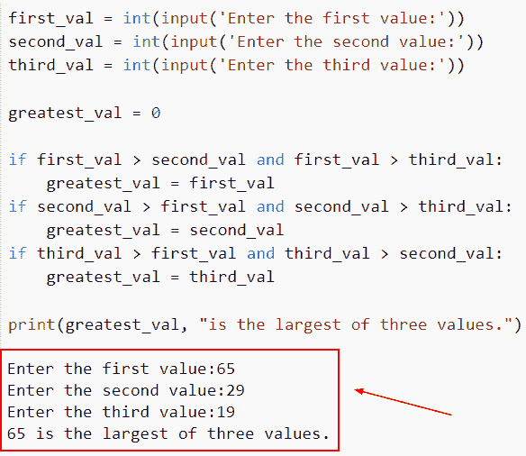
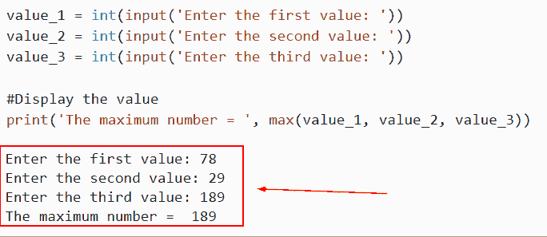
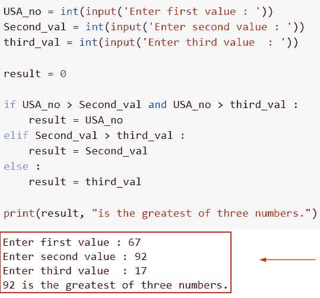
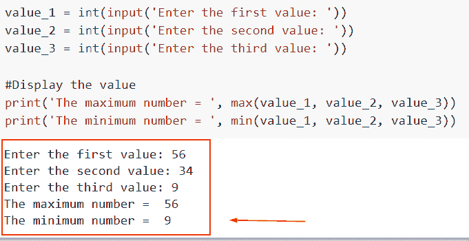
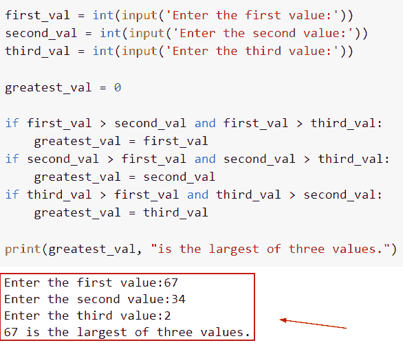
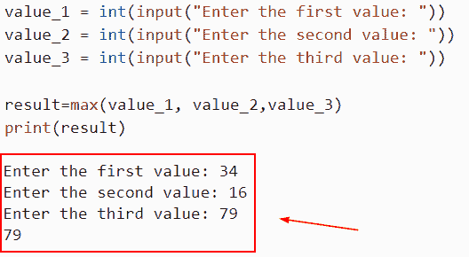
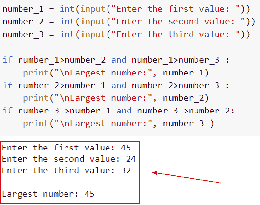
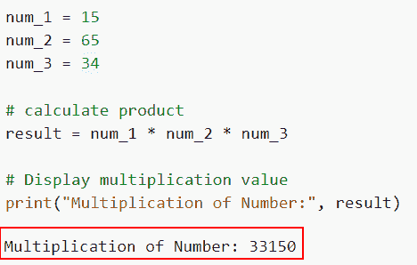

# 寻找 3 个数中最大值的 Python 程序

> 原文：<https://pythonguides.com/python-program-for-finding-greatest-of-3-numbers/>

[](https://sharepointsky.teachable.com/p/python-and-machine-learning-training-course)

在本 Python 教程中，我们将讨论如何在 Python 中找到 3 个数中的最大值。目的是识别作为输入给出的三个整数中最大的一个，并找到最大的数。此外，我们还将讨论以下主题。

*   寻找 3 个数中最大值的 Python 程序
*   Python 程序查找最多 3 个数字
*   Python 程序，使用函数找出三个数字中的最大值
*   Python 程序使用嵌套的 if else-if 找到三个数中最大的一个
*   Python 程序找出三个数字中最大的和最小的
*   写一个 Python 代码，找出用户输入的三个数字中最大的一个
*   Python 函数来查找三个数的最大值
*   Python 程序使用嵌套的 if 找到三个数中最大的一个
*   三个数乘积的 Python 程序

目录

[](#)

*   [寻找 3 个数最大值的 Python 程序](#Python_program_for_finding_the_greatest_of_3_numbers "Python program for finding the greatest of 3 numbers")
*   [Python 程序求 3 个数的最大值](#Python_program_to_find_the_max_of_3_numbers "Python program to find the max of 3 numbers")
*   [Python 程序使用函数](#Python_program_to_find_greatest_among_three_numbers_using_the_function "Python program to find greatest among three numbers using the function")找出三个数字中的最大值
*   [Python 程序使用嵌套的 if else-if 找到三个数中最大的一个](#Python_program_to_find_biggest_of_three_numbers_using_nested_if_else-if "Python program to find biggest of three numbers using nested if else-if")
*   [Python 程序找出三个数字中最大和最小的](#Python_program_to_find_biggest_and_smallest_of_three_numbers "Python program to find biggest and smallest of three numbers")
*   [写一个 Python 代码，找出用户输入的三个数字中最大的一个](#Write_a_Python_code_to_find_the_greatest_of_three_numbers_inputted_by_the_users "Write a Python code to find the greatest of three numbers inputted by the users")
*   [Python 函数求三个数的最大值](#Python_function_to_find_the_max_of_three_numbers "Python function to find the max of three numbers")
*   [Python 程序使用嵌套 if 找到三个数中最大的一个](#Python_program_to_find_the_largest_of_three_numbers_using_nested_if "Python program to find the largest of three numbers using nested if")
*   [三个数乘积的 Python 程序](#Python_program_for_product_of_three_numbers "Python program for product of three numbers")

## 寻找 3 个数最大值的 Python 程序

*   在这一节中，我们将讨论如何在 Python 中找到 3 个数中的最大值。
*   目的是识别作为输入给出的三个整数中最大的一个。为此，我们检查并比较三个整数输入，然后公布最大的数字。
*   为了获得本例中三个数字中的最大值，我们将使用 Python If 语句。
*   为了确定三个中的最大数量，我们将如下进行。假设我们有三个变量 a，b，c。
*   如果 a 大于 b 和 c 之和，则 a 是三个数中最大的。当 b 和 c 都大于 a 时，b 是三个值中最大的。如果 c 和 b 都大于 a 和 b，那么 c 是三个数中最大的。

**举例**:

让我们举一个例子，看看如何在 Python 中从给定的 3 个数字的输入中找到最大的数字。

**源代码**:

```
first_val = int(input('Enter the first value:'))
second_val = int(input('Enter the second value:'))
third_val = int(input('Enter the third value:'))

greatest_val = 0

if first_val > second_val and first_val > third_val:
    greatest_val = first_val
if second_val > first_val and second_val > third_val:
    greatest_val = second_val
if third_val > first_val and third_val > second_val:
    greatest_val = third_val

print(greatest_val, "is the largest of three values.")
```

下面是以下代码的截图



Python program for finding the greatest of 3 numbers

这是一个寻找 3 个数中最大值的 python 程序的例子。

阅读[如何用 python 从两个列表创建字典](https://pythonguides.com/python-creates-a-dictionary-from-two-lists/)

## Python 程序求 3 个数的最大值

*   这里我们将讨论如何在 Python 中求 3 个数的最大值。
*   通过使用 **max()** 函数，max()方法返回 iterable 的最大值或提供的参数数。
*   Python 中的 max()方法返回最大或最大元素。可迭代的或直接的元素集都可以作为参数提供。Python 的 max 函数在接收各种数据类型的值时会返回 TypeError。
*   或者，如果参数中没有给定默认值并且 iterable 为空，Python 中的 max()函数会抛出 ValueError。

**语法**:

下面是 Python 中 max()函数的语法

```
max(iterable, *iterables, key, default)
```

*   它由几个参数组成
    *   iterable:该参数定义存储一个或多个 iterable 项的 iterable 对象，如列表、元组等。
    *   **键**:如果提供了多个 iterables，这也是一个可选参数。基于这些关键函数的结果，对可迭代函数进行比较。

**举例**:

```
value_1 = int(input('Enter the first value: '))
value_2 = int(input('Enter the second value: '))
value_3 = int(input('Enter the third value: '))

#Display the value 
print('The maximum number = ', max(value_1, value_2, value_3))
```

在下面给出的代码中，我们首先创建了三个变量，并使用 input 函数从用户那里获取输入。现在我们必须从输入值中找出最大值，为此我们使用了 max()函数。

下面是以下给定代码的执行过程



Python program to find the max of 3 numbers

这是**如何在 Python** 中求 3 个数的最大值。

阅读 [Python 字典弹出](https://pythonguides.com/python-dictionary-pop/)

## Python 程序使用函数找出三个数字中的最大值

*   在这一节中，我们将讨论如何使用 Python 中的函数找到三个数字中的最大值。
*   为了执行这个特定的任务，我们将使用三元运算符三元运算符，也称为条件表达式，是一种根据某个条件是真还是假来计算值的运算符。

**举例**:

让我们举一个例子，检查如何使用函数找到三个数字中的最大值。

**源代码**:

```
first_val, second_val, third_val = 56 , 28 , 38
result = first_val if first_val>second_val else second_val
result = third_val if third_val>result else result
print(result)
```

在下面给出的代码中，我们首先声明了三个变量，并将它们赋给一个整数值。接下来，我们使用的条件是，如果第一个值大于第二个值，否则第二个值大于相同值

你可以参考下面的截图


Python program to find the greatest among three numbers using the function

这是如何使用 Python 中的函数找到三个数中的最大值。

通过列表读取 [Python 循环](https://pythonguides.com/python-loop-through-a-list/)

## Python 程序使用嵌套的 if else-if 找到三个数中最大的一个

*   在这个例子中，我们将讨论如何在 Python 中使用嵌套的 if else-if 条件找到三个数中最大的一个。
*   可以使用 if/else if 语句构建 if 链。一次评估一个 if 语句，直到其中一个 if 表达式评估为 true 或到达 if/else 链的结尾。如果 if/else 链在没有真表达式的情况下得出结论，则不会执行任何代码块。
*   在本例中，我们将使用 input 函数从用户处获取输入，并设置条件，如果 a>b>c，那么如果它大于其他数字，它将存储在结果中。

示例:

```
USA_no = int(input('Enter first value : '))
Second_val = int(input('Enter second value : '))
third_val = int(input('Enter third value  : '))

result = 0

if USA_no > Second_val and USA_no > third_val :
    result = USA_no
elif Second_val > third_val :
    result = Second_val
else :
    result = third_val

print(result, "is the greatest of three numbers.")
```

下面是以下给定代码的实现



Python program to find the biggest of three numbers using nested if else if

这是一个 Python 程序的例子，使用嵌套的 if else-if 找到三个数中最大的一个。

阅读 [Python 字典理解](https://pythonguides.com/python-dictionary-comprehension/)

## Python 程序找出三个数字中最大和最小的

*   在这个例子中，我们将在 Python 中找到给定的三个数中的最大值和最小值。
*   要执行此任务，我们将使用 max()函数和 min()函数，最大或最大元素由 Python 中的 max()方法返回。可迭代的或直接的元素集都可以作为参数提供。Python 的 max 函数在接收各种数据类型的值时会返回 TypeError。
*   内置函数 min()和 max()都有一个独特的签名，允许您使用一个可迭代的或者两个或更多的普通参数作为它们的初始参数来调用它们。

**举例**:

```
value_1 = int(input('Enter the first value: '))
value_2 = int(input('Enter the second value: '))
value_3 = int(input('Enter the third value: '))

#Display the value 
print('The maximum number = ', max(value_1, value_2, value_3))
print('The minimum number = ', min(value_1, value_2, value_3))
```

下面是以下给定代码的执行过程



Python program to find the biggest and smallest of three numbers

这是一个在 Python 中求三个数中最大和最小的例子。

阅读:[如何在 Python 中检查一个字符串是否包含子串](https://pythonguides.com/check-if-a-string-contains-a-substring-in-python/)

## 写一个 Python 代码，找出用户输入的三个数字中最大的一个

*   目的是识别作为输入给出的三个整数中最大的一个。为此，我们检查并比较三个整数输入，然后公布最大的数字。
*   为了获得本例中三个数字中的最大值，我们将使用 Python If 语句。
*   在本例中，我们将使用 input 函数从用户处获取输入，并设置哪个数字大于其他数字的条件。

**举例**:

```
first_val = int(input('Enter the first value:'))
second_val = int(input('Enter the second value:'))
third_val = int(input('Enter the third value:'))

greatest_val = 0

if first_val > second_val and first_val > third_val:
    greatest_val = first_val
if second_val > first_val and second_val > third_val:
    greatest_val = second_val
if third_val > first_val and third_val > second_val:
    greatest_val = third_val

print(greatest_val, "is the largest of three values.")
```

下面是以下给定代码的输出



Write a Python code to find the greatest of three numbers inputted by the users

这是一个 Python 查找用户输入的三个数字中最大的一个的例子。

在 Python 中读取[的循环 vs while 循环](https://pythonguides.com/for-loop-vs-while-loop-in-python/)

## Python 函数求三个数的最大值

*   使用 max()函数，我们能够确定这种情况下三个值中的最大值。为了找到 iterable 中的最大数，我们可以使用内置的 Python 方法 max()。
*   通过使用 **max()** 函数，max()方法返回 iterable 的最大值或提供的参数数。
*   Python 中的 max()方法返回最大或最大元素。可迭代的或直接的元素集都可以作为参数提供。Python 的 max 函数在接收各种数据类型的值时会返回 TypeError。

**举例**:

```
value_1 = int(input("Enter the first value: "))
value_2 = int(input("Enter the second value: "))
value_3 = int(input("Enter the third value: "))

result=max(value_1, value_2,value_3)
print(result)
```

你可以参考下面的截图



Python function to find the max of three numbers

这就是我们如何通过使用 max()函数在 Python 中从给定的三个数字中找到最大值。

阅读 [Python 字典按值查找键](https://pythonguides.com/python-dictionary-find-a-key-by-value/)

## Python 程序使用嵌套 if 找到三个数中最大的一个

*   在这一节中，我们将讨论如何使用嵌套的 if 方法找到三个数中的最大值。
*   为了执行这个特定的任务，我们将使用 only if 语句，在这个语句中，我们将应用**和**操作，并设置 if 语句的两个条件，这验证了只有当两个条件都被评估为真时，程序流才会出现在 if 语句体中。

**举例**:

```
number_1 = int(input("Enter the first value: "))
number_2 = int(input("Enter the second value: "))
number_3 = int(input("Enter the third value: "))

if number_1>number_2 and number_1>number_3 :
    print("\nLargest number:", number_1)
if number_2>number_1 and number_2>number_3 :
    print("\nLargest number:", number_2)
if number_3 >number_1 and number_3 >number_2:
    print("\nLargest number:", number_3 ) 
```

在下面给定的代码中，我们将首先使用 input()函数从用户处获取输入，然后设置条件，如果 number_1 大于 number_2 和 number_3，则它将显示最大的数字。类似地，在第二种情况下，如果条件编号 2 大于编号 1 和编号 3。

你可以参考下面的截图



Python program to find the largest of three numbers using nested if

这是如何在 Python 中使用嵌套 if 找到三个数中最大的一个。

阅读:[用于冒泡排序的 Python 程序](https://pythonguides.com/python-program-for-bubble-sort/)

## 三个数乘积的 Python 程序

*   在本节中，我们将讨论如何在 Python 中获得三个数的乘积。
*   所有值相乘的结果是一个简单的任务。例如，对于列表[2，5，9]，结果将是 90。我们将讨论计算列表中所有数字总和的各种方法。
*   为了执行这个任务，我们将首先使用*运算符，这是 Python 中三个数相乘最简单、最快的方法。在声明变量时，我们将取三个数字，并计算这些数字的乘积。最终，乘法值放入乘积变量后会显示在屏幕上。

**举例**:

我们举个例子，检查一下如何在 Python 中得到三个数的乘积。

**源代码**:

```
num_1 = 15
num_2 = 65
num_3 = 34

# calculate product
result = num_1 * num_2 * num_3

# Display multiplication value
print("Multiplication of Number:", result)
```

在上面的代码中，我们将首先声明三个变量并赋整数值。接下来，我们使用*运算符对给定的三个数进行乘法运算。执行这段代码后，它将显示三个数的乘积。

下面是以下给定代码的执行过程



Python program for product of three numbers

在本 Python 教程中，我们将讨论如何在 Python 中找到 3 个数中的最大值。目的是识别作为输入给出的三个整数中最大的一个，并找到最大的数。此外，我们还将讨论以下主题。

*   寻找 3 个数中最大值的 Python 程序
*   Python 程序查找最多 3 个数字
*   Python 程序，使用函数找出三个数字中的最大值
*   Python 程序使用嵌套的 if else-if 找到三个数中最大的一个
*   Python 程序找出三个数字中最大的和最小的
*   写一个 Python 代码，找出用户输入的三个数字中最大的一个

您可能会喜欢以下 Python 教程:

*   [Python 将字典转换为列表](https://pythonguides.com/python-convert-dictionary-to-list/)
*   [Python while 循环继续](https://pythonguides.com/python-while-loop-continue/)
*   [Python 元组排序列表](https://pythonguides.com/python-sort-list-of-tuples/)
*   [如何在 Python 中从字典中移除密钥](https://pythonguides.com/python-dictionary-remove/)
*   [Python While 循环条件](https://pythonguides.com/python-while-loop-condition/)

[Arvind](https://pythonguides.com/author/arvind/)

Arvind 目前是 TSInfo Technologies 的高级 Python 开发人员。他精通 Python 库，如 NumPy 和 Tensorflow。