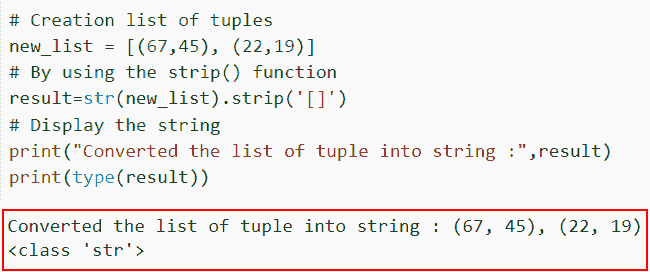
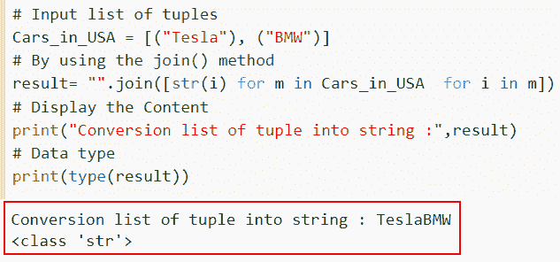
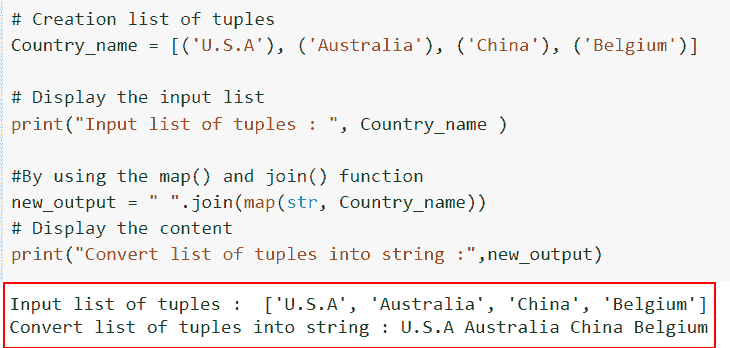

# 如何在 Python 中将元组列表转换成字符串

> 原文：<https://pythonguides.com/convert-list-of-tuples-to-string-in-python/>

[](https://sharepointsky.teachable.com/p/python-and-machine-learning-training-course)

在本 [Python 教程](https://pythonguides.com/python-programming-for-the-absolute-beginner/)中，我们将讨论几种在 Python 中将元组列表**转换为字符串的方法。此外，我们将查看各种示例，将元组列表转换为 Python 中的字符串。**

最近，我在做一个机器学习项目，我发现它需要一些字符串元素，而不是元组的 Python 列表。所以我做了一些研究，发现我们必须用 Python 把元组列表转换成字符串。

我们将讨论一些简单的技术，这些技术可以很容易地将 Python 元组列表转换成字符串。

在这里我们将学习

*   在 Python 中将元组列表转换为字符串
*   如何使用 join()将元组列表转换为字符串
*   使用 join()和 map()

我们的目标是把它转换成一个字符串，也就是一串字符。字符可以是字母、某些符号，甚至是用双引号或单引号括起来的整数。

目录

[](#)

*   [如何在 Python 中将元组列表转换成字符串](#How_to_convert_list_of_tuples_to_string_in_Python "How to convert list of tuples to string in Python")
    *   [将元组列表转换为 Python 中的字符串](#Convert_list_of_tuples_to_string_in_Python "Convert list of tuples to string in Python")
    *   [如何使用 join()](#How_to_convert_list_of_tuples_to_string_using_join "How to convert list of tuples to string using join()") 将元组列表转换为字符串
    *   [使用 join()和 map()](#Using_join_and_map "Using join() and map()")

## 如何在 Python 中将元组列表转换成字符串

在 Python 中，在将元组列表转换为字符串时，主要有三种常用且重要的理解方法。

### 将元组列表转换为 Python 中的字符串

*   在这一节中，我们将讨论如何在 Python 中将元组列表转换为[字符串。](https://pythonguides.com/create-a-string-in-python/)
*   Python 有一个内置的库函数叫做 **strip()** 。通过删除提供给 **strip()** 方法的前导和尾随空格、字母和符号，它用于返回原始字符串的副本。
*   为了将列表转换成字符串，我们将使用 **str()** 函数。

**语法**:

```
string.strip(character)
```

> **注** : 为可选参数。当一个字符被传递给 **strip()** 函数时，它将从字符串的两端被移除。

**举例:**

让我们举个例子，看看如何在 Python 中将元组列表转换成字符串。

**源代码**:

```
**# Creation list of tuples**
new_list = [(67,45), (22,19)]

**# By using the strip() function**
result=str(new_list).strip('[]')

**# Display the string**
print("Converted the list of tuple into string :",result)
print(type(result))
```

在上面的代码中，我们已经创建了一个元组列表，然后从一个元组中移除该列表，我们使用了 ***strip()*** 函数的概念。

下面是以下给定代码的实现。



How to convert the list of tuples into strings in Python

在这个例子中，我们已经理解了如何在 Python 中将元组列表转换成字符串。

阅读:[在 python 中把整数转换成字符串](https://pythonguides.com/convert-an-integer-to-string-in-python/)

### 如何使用 join() 将元组列表转换为字符串

*   在这一节中，我们将讨论如何使用 join()方法在 Python 中将元组列表转换为字符串。
*   使用 **str.join()** 函数，我们可以将一个 Python 元组变成一个 Python 字符串。string **join()** 方法将一个 iterable 中的字符串连接起来，比如一个**元组、列表、字典或集合**，并返回一个字符串。
*   由于这个实例中的 iterable 是一个 tuple，返回字符串的 **join()** 方法将接受 tuple 作为参数，同时我们将使用 list comprehension 方法。

**举例**:

让我们举一个例子，检查如何使用 Python 中的 **join()** 方法将元组列表转换为字符串。

```
**# Input list of tuples**
Cars_in_USA = [("Tesla"), ("BMW")]

**# By using the join() method**
result= "".join([str(i) for m in Cars_in_USA  for i in m])

**# Display the Content**
print("Conversion list of tuple into string :",result)

**# Data type**
print(type(result))
```

在上面的代码中，我们首先创建了链表，并以元组的形式分配元素。现在我们想把它们转换成一个字符串，通过使用 list comprehension 和 join()方法，我们可以很容易地得到单个输入字符串。

你可以参考下面的截图



Convert list of tuples to string in Python by using the join method

这就是如何使用 join 方法将元组列表转换为字符串

### 使用 join()和 map()

*   这是执行这项任务的不同方式。这里，在使用 join 函数组合元组()之前，我们将每个项目转换为一个字符串。
*   map()函数将每个元组转换成一个字符串值，join()方法通过应用提供的分隔符将一组字符串组合成一个字符串。

**举例:**

让我们举个例子，看看如何在 Python 中将元组列表转换成字符串。

**源代码:**

```
# Creation list of tuples
Country_name = [('U.S.A'), ('Australia'), ('China'), ('Belgium')]

# Display the input list
print("Input list of tuples : ", Country_name )

#By using the map() and join() function 
new_output = " ".join(map(str, Country_name))
# Display the content
print("Convert list of tuples into string :",new_output)
```

在下面给出的代码中，我们首先将输入列表初始化为' ***Country_name*** '，然后使用 ***join()*** 和 ***map()*** 函数将元组的输入列表转换为字符串

下面是以下给定代码的实现。



Convert a list of tuples into a string in Python by using the map and join function

另外，看看更多的 Python 教程。

*   [Python 将元组转换为列表](https://pythonguides.com/python-convert-tuple-to-list/)
*   [将 float 转换为 int Python](https://pythonguides.com/convert-float-to-int-python/)
*   [Python 字典值列表](https://pythonguides.com/python-dictionary-values-to-list/)
*   [在 Python 中把元组转换成字符串](https://pythonguides.com/convert-tuple-to-string-in-python/)
*   [如何用 Python 将列表转换成数据帧](https://pythonguides.com/convert-a-list-to-dataframe-in-python/)

在本文中，我们讨论了如何将元组列表转换为字符串，并且我们应用了不同的方法来理解何时将元组列表转换为字符串

*   用 Python 将元组列表转换成字符串
*   如何使用 join()将元组列表转换为字符串
*   使用 join()和 map()

[Arvind](https://pythonguides.com/author/arvind/)

Arvind 目前是 TSInfo Technologies 的高级 Python 开发人员。他精通 Python 库，如 NumPy 和 Tensorflow。