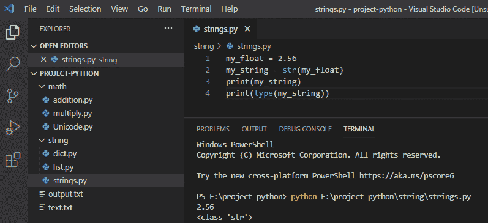
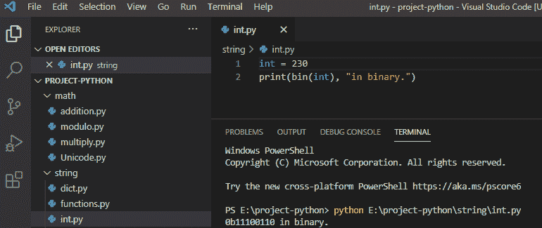
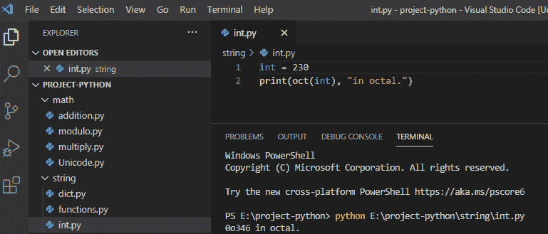
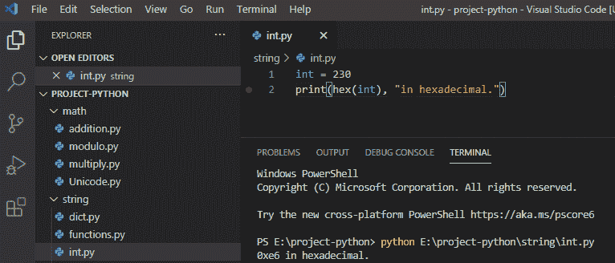
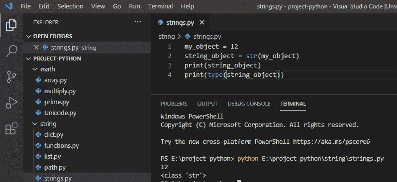
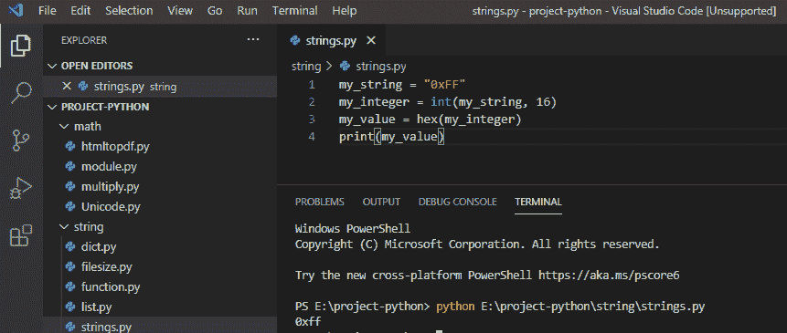
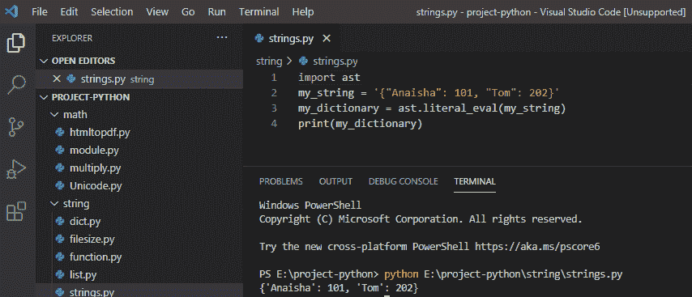
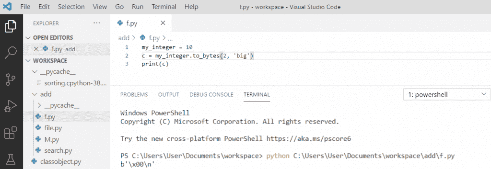
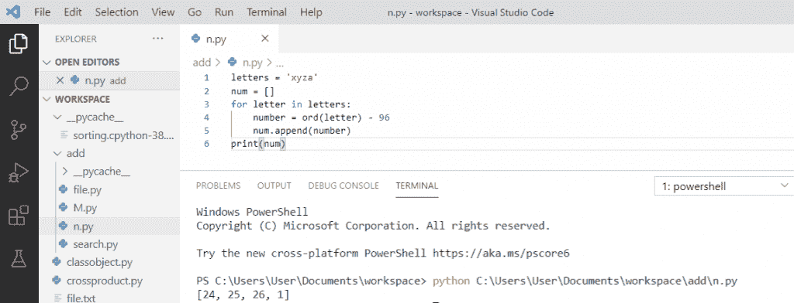
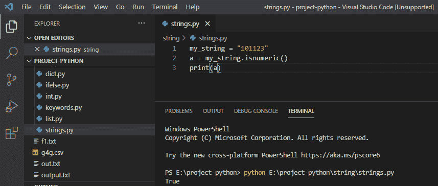

# 如何在 python 中将整数转换成字符串

> 原文：<https://pythonguides.com/convert-an-integer-to-string-in-python/>

[](https://sharepointsky.teachable.com/p/python-and-machine-learning-training-course)

在本 [Python 教程](https://pythonguides.com/python-programming-for-the-absolute-beginner/)中，我们将学习**如何在 python** 中将整数转换成字符串。

此外，我们还将讨论:

*   将整数转换为字符串的 Python 代码
*   如何在 python 中将字符串转换成整数
*   在 python 中将字符串转换为浮点型
*   如何在 Python 中将字节转换成字符串
*   在 Python 中将浮点数转换为整数
*   如何在 Python 中将整数转换成浮点数
*   在 Python 中将整数转换为复数
*   Python 将字符串转换为日期时间
*   Python 将浮点转换为字符串
*   Python 将 int 转换为 binary
*   Python 将 int 转换成八进制
*   Python 将 int 转换为十六进制
*   将对象转换为字符串 python
*   Python 将字符串转换为十六进制
*   Python 将字符串转换成字典
*   Python 将整数转换为字节
*   在 python 中将字节转换为整数
*   Python 将字母转换成数字
*   检查字符串是否是数字 python

Python 可以在不同的平台上工作，如 windows、mac、pi 等。为了使用 Python，我们需要在操作系统中安装 Python 解释器。在这里，我使用 Python IDLE。但是也可以用 Pycharm，Spyder 等。

如果您是 Python 的新手，请查看以下教程:

*   [Python 下载和安装步骤](https://pythonguides.com/python-download-and-installation/)
*   [Python Hello World 程序(一步一步使用 Pycharm + Visual Studio 代码)](https://pythonguides.com/python-hello-world-program/)
*   [如何在 Python 中创建字符串](https://pythonguides.com/create-a-string-in-python/)

目录

[](#)

*   [在 python 中把整数转换成字符串](#Convert_an_integer_to_string_in_python "Convert an integer to string in python")
*   [如何在 python 中将字符串转换成整数](#How_to_Convert_a_String_to_integer_in_python "How to Convert a String to integer in python")
    *   [将字符串转换成整数的 Python 代码](#Python_Code_to_convert_a_string_to_integer "Python Code to convert a string to integer ")
*   [如何在 python 中把字符串转换成浮点数](#How_to_convert_a_string_to_float_in_python "How to convert a string to float in python")
    *   [将字符串转换成浮点数的 Python 代码](#Python_Code_to_convert_a_string_to_float "Python Code to convert a string to float")
*   [如何在 Python 中把字节转换成字符串](#How_to_convert_bytes_to_string_in_Python "How to convert bytes to string in Python")
    *   [将字节转换成字符串的 Python 代码](#Python_Code_to_convert_bytes_to_string "Python Code to convert bytes to string")
*   [如何在 Python 中把浮点数转换成整数](#How_to_Convert_float_to_integer_in_Python "How to Convert float to integer in Python")
    *   [将浮点数转换为整数的 Python 代码](#Python_Code_to_convert_float_to_integer "Python Code to convert float to integer")
*   [如何在 Python 中把整数转换成浮点数](#How_to_convert_integer_to_float_in_Python "How to convert integer to float in Python")
    *   [将整数转换成浮点数的 Python 代码](#Python_Code_to_convert_integer_to_float "Python Code to convert integer to float")
*   [如何在 Python 中把整数转换成复数](#How_to_convert_integer_to_complex_number_in_Python "How to convert integer to complex number in Python")
    *   [Python 代码将整数转换成复数](#Python_Code_to_convert_integer_to_complex_number "Python Code to convert integer to complex number")
*   [Python 将字符串转换为日期时间](#Python_to_convert_string_to_datetime "Python to convert string to datetime")
    *   [将字符串转换为日期时间的 Python 代码](#Python_Code_to_convert_string_to_datetime "Python Code to convert string to datetime")
*   [Python 将浮点转换成字符串](#Python_convert_float_to_string "Python convert float to string")
*   [Python 将 int 转换成 binary](#Python_convert_int_to_binary "Python convert int to binary")
*   [Python 将 int 转换成八进制](#Python_convert_int_to_octal "Python convert int to octal")
*   [Python 将 int 转换成十六进制](#Python_convert_int_to_hexadecimal "Python convert int to hexadecimal")
*   [将对象转换成字符串 python](#Convert_an_object_to_string_python "Convert an object to string python")
*   [Python 将字符串转换成十六进制](#Python_convert_string_to_hex "Python convert string to hex")
*   [Python 将字符串转换成字典](#Python_convert_string_to_a_dictionary "Python convert string to a dictionary")
*   [Python 将 int 转换成 bytes](#Python_convert_int_to_bytes "Python convert int to bytes")
*   [在 python 中把字节转换成整数](#Convert_bytes_to_int_in_python "Convert bytes to int in python")
*   [Python 将字母转换成数字](#Python_convert_letters_to_a_number "Python convert letters to a number")
*   [检查一个字符串是否是数字 python](#Check_if_a_string_is_number_python "Check if a string is number python")

## 在 python 中把整数转换成字符串

现在，我们将看到**如何在 Python** 中将整数转换成字符串。

要在 python 中将整数转换为字符串，我们需要遵循以下步骤:

**第一步**

*   为了将整数转换为字符串，我们内置了函数 **str()** ，它将参数转换为字符串格式。
*   该函数可以接受任何整数作为输入，并且可以产生一个字符串作为输出。

**第二步**

*   首先，我们需要取一个整数值。在下面的 python 代码中，你可以看到，我把值取为**“123”**。
*   然后我们需要将字符串值存储在**“value _ str”**中。
*   现在打印 **"value_str"** ，它会将整数转换成字符串。

下面显示了将整数转换为字符串的 Python 代码。

```
value=123
value_str=str(value)
value_str
```

**第三步**

在编写完上面的 Python 代码(将整数转换为字符串)后，您将打印 value_str，然后输出将显示为字符串值 **'123'** 。另外，你可以参考下面的截图。


convert an integer to string in python

上面的 python 代码我们可以用来在 python 中**将整数转换成字符串。**

阅读:[如何在 Python 中把 string 转换成 float](https://pythonguides.com/convert-string-to-float-in-python/)

## 如何在 python 中将字符串转换成整数

在这里，我们将学习如何用 python 将一个字符串**转换成整数。**

此外，通过一个简单的例子，我们将了解如何使用 python 中的代码将字符串转换为整数，以及输出是什么。

### 将字符串转换成整数的 Python 代码

要在 python 中将字符串转换成整数，我们需要遵循以下步骤:

**第一步**

*   将字符串转换成整数。我们有内置的函数 **int()** 方法，它将一个字符串作为参数并返回一个整数值。
*   该函数可以将任何字符串作为输入，并将返回一个整数作为输出。

**第二步**

*   首先，我们需要取一个字符串值。在下面的代码中，你可以看到，我已经把值作为 **"111"** 作为一个字符串。
*   然后我们需要将值存储在**“value _ int”**中。
*   现在打印 **"value_int"** ，它会将字符串转换成整数。

下面显示了将字符串转换为整数的 python 代码。

```
value='111'
value_int=int(value)
value_int
```

**第三步**

写完上面的 Python 代码(把字符串转换成整数)。您将打印 value_int，然后输出将显示为一个整数值 **111** 。你也可以参考下面的截图。


Convert a String to integer in python

这是**如何在 python** 中把一个字符串转换成整数。

阅读:[如何在 Python 中把字典转换成字符串](https://pythonguides.com/how-to-convert-a-dictionary-into-a-string-in-python/)

## 如何在 python 中把字符串转换成浮点数

在这个场景中，我们将学习**如何在 python** 中将字符串转换成浮点数。

此外，通过一个简单的例子，我们将了解如何使用代码在 python 中将字符串转换为浮点型，以及输出是什么。

### 将字符串转换成浮点数的 Python 代码

要在 python 中将字符串转换为浮点型，我们需要遵循以下步骤:

**第一步**

*   将字符串转换为浮点型。我们可以使用内置函数 float()方法将一个字符串转换为 float，它将返回一个 float 值。
*   该函数可以将任何字符串作为输入，并将返回一个浮点值作为输出。

**第二步**

*   首先，我们需要取一个字符串值。在下面的代码中，你可以看到，我已经把值作为 **"12.5"** 作为一个字符串。
*   然后我们需要将值存储在**“value _ f”**中。
*   现在打印 **"value_f"** ，它将把字符串转换成浮点型。

下面显示了将字符串转换为浮点型的 python 代码。

```
value = '12.5'
value_f = float(value)
value_f
```

**第三步**

写完上面的 python 代码(把字符串转换成浮点)。一旦你打印出值 f，输出将显示为浮点值 **12.5** 。你也可以参考下面的截图。


convert a string to float in python

阅读:[追加到字符串 Python](https://pythonguides.com/append-to-a-string-python/)

## 如何在 Python 中把字节转换成字符串

在这一节中，我们将学习如何在 python 中将字节转换成字符串。

还有，举个简单的例子。我们将看到如何使用代码将 python 中的字节转换成字符串，以及输出是什么。

### 将字节转换成字符串的 Python 代码

要在 python 中将字节转换为字符串，我们需要遵循以下步骤:

**第一步**

*   为了在 python 中将字节转换成字符串，我们有 bytes 类**。decode()** 方法，该方法将转换字节并返回一个字符串值。
*   该函数可以将任何字节作为输入，并将返回一个字符串作为输出。

**第二步**

*   首先，我们需要取一个字节值。在下面的代码中，你可以看到，我已经把值作为**b“hello”**作为一个字节。
*   然后我们需要将值存储在**“value _ b”**中。
*   现在打印 **"value_b"** ，它会将字节值转换成字符串。

下面显示了将字节转换为字符串的 python 代码。

```
value = b'hello'
value_b = value.decode()
value_b
```

**第三步**

写完上面的 python 代码(把字节转换成字符串)。一旦打印出 value_b，输出将显示为一个字符串值**‘hello’**。你也可以参考下面的截图。


convert bytes to string in Python

上面的 Python 代码我们可以用 Python 把字节转换成字符串。

## 如何在 Python 中把浮点数转换成整数

在这里，我们将学习如何在 python 中把浮点数转换成整数。

还有，举个简单的例子。我们将看到如何使用 python 中的代码将 float 转换为 integer，以及输出是什么。

### 将浮点数转换为整数的 Python 代码

要在 python 中将浮点数转换为整数，我们需要遵循以下步骤:

**第一步**

*   为了在 python 中将 float 转换为 integer，我们使用了内置函数 **int()** ，该函数将转换正或负的 float 值，并返回整数和整数。
*   该函数可以将任何浮点数作为输入，并将返回一个整数作为输出。

**第二步**

*   首先，我们需要取一个浮点值。在下面的代码中，你可以看到，我已经把值作为**【15.2】**作为浮点数。
*   然后我们需要将值存储在**“value _ I”**中。
*   现在打印**“value _ I”**，它会将浮点值转换为整数，并带有四舍五入的数字。

下面显示了将浮点数转换为整数的 python 代码。

```
value = 15.2
value_i = int(value)
value_i
```

**第三步**

写完上面的 python 代码(把 float 转换成 integer)。一旦打印出值 _i，输出将显示为整数 **"15"** ，为整数。你也可以参考下面的截图。


Python Code to convert float to integer

## 如何在 Python 中把整数转换成浮点数

在这里，我们将学习**如何在 python** 中将整数转换成浮点数。

还有，举个简单的例子。我们将看到如何使用 python 中的代码将 integer 转换为 float，以及输出是什么。

### 将整数转换成浮点数的 Python 代码

要在 python 中将整数转换为浮点，我们需要遵循以下步骤:

**第一步**

*   为了在 python 中将 integer 转换为 float，我们使用了内置函数 **float()** ，它将转换整数值并返回 float 值。
*   该函数可以将任何整数值作为输入，并将返回一个浮点数作为输出。

**第二步**

*   首先，我们需要取整数值。在下面的代码中，你可以看到，我已经把值作为**【12】**作为一个整数。
*   然后我们需要将值存储在**“value _ f”**中。
*   现在打印 **"value_f"** ，它将把整数值转换成浮点数。

下面显示了将整数转换为浮点数的 python 代码。

```
value = 12
value_f = float(value)
value_f
```

**第三步**

写完上面的 python 代码(把整数转换成浮点数)。一旦你打印出值 f，输出将显示为一个浮点值**“12.0”**。你也可以参考下面的截图。


convert integer to float in Python

## 如何在 Python 中把整数转换成复数

在这里，我们将学习**如何在 python** 中将整数转换成复数。

还有，举个简单的例子。我们将看到如何使用 python 中的代码将整数转换为复数，以及输出是什么。

### Python 代码将整数转换成复数

要在 python 中将整数转换为复数，我们需要遵循以下步骤:

**第一步**

*   要在 python 中将整数转换成复数，我们可以使用 **complex()** ，它会将整数转换成复数作为参数，或者将虚部加到整数上。
*   该函数可以将任何整数值作为输入，并将返回一个复数作为输出。

**第二步**

*   首先，我们需要取整数值。在下面的代码中，你可以看到，我已经把值作为**【10】**的一个整数。
*   然后我们需要将值存储在**“复杂值”**中。
*   现在打印**“复数值”**，它会将整数值转换成复数。

下面是将整数转换为复数的 python 代码。

```
value = 10
complex_value = complex(value)
complex_value
```

**第三步**

写完上面的 python 代码(把整数转换成复数)。一旦您打印了 complex_value，那么输出将显示为一个复数值 **"10+0j"** 。你也可以参考下面的截图。


convert integer to complex number in Python

这个 Python 代码可以用来在 Python 中将整数转换成复数。

## Python 将字符串转换为日期时间

在这里，我们将学习如何用 python 将字符串转换成日期时间。

还有，举个简单的例子。我们将看到如何使用 python 中的代码将字符串转换为日期时间，以及输出是什么。

### 将字符串转换为日期时间的 Python 代码

要在 python 中将字符串转换为日期时间，我们需要遵循以下步骤:

**第一步**

*   为了在 python 中将字符串转换成日期时间，我们将使用 **strptime()** 这个函数在日期时间模块中可用，它将字符串转换成日期时间对象。
*   该函数可以将字符串值作为输入，并将 datetime 作为输出返回。

**第二步**

*   首先，我们需要导入 datetime 模块。之后我们可以取字符串值。在下面的代码中，你可以看到，我把值取为 **"06/25/20 14:55:23"** 。
*   然后我们需要将值存储在**“datetime _ o”**中。我们有一个日期时间的格式指令，如 **"%m %d %y %H:%M%S"** ，它与下面例子中的格式相匹配。
*   现在打印 **"datetime_o"** ，它会将字符串值转换成 datetime 格式。

下面显示了将字符串转换为日期时间的 python 代码。

```
from datetime import datetime
datetime_s = '06/25/20 14:55:23'
datetime_o = datetime.strptime(datetime_s,'%m/%d/%y %H:%M:%S')
print(datetime_o)
```

**第三步**

写完上面的 python 代码(把 string 转换成 datetime)。打印 datetime_o 之后，输出将显示为 **"2020-06-25 14:55:23"** 。你也可以参考下面的截图。


Python to convert string to datetime

**注**:没有世纪的年份作为零填充的十进制数，我们用 **"%y"** 表示年份。

## Python 将浮点转换成字符串

在 python 中，为了**将浮点数转换成字符串**，我们使用内置的 **str()** 方法将浮点数转换成字符串。

**举例:**

```
my_float = 2.56
my_string = str(my_float)
print(my_string)
print(type(my_string))
```

写完上面的代码(python convert float to string)，你将打印出**“my _ string”**，然后输出将显示为**“2.56”**。

这里， **str()** 函数将把浮点值转换成字符串，我们可以通过打印 type()来检查输出是否是字符串。可以参考下面的截图 python convert float to string。



Python convert float to string

这是**如何在 Python** 中将 float 转换成 string。

## Python 将 int 转换成 binary

在 python 中，为了**将整数转换成二进制**，我们将使用内置函数 **bin()** 将整数转换成二进制。

**举例:**

```
int = 230
print(bin(int), "in binary.")
```

写完上面的代码(python convert int to binary)，你将打印出 **" bin(int) "** ，然后输出将显示为 **" 0b11100110 in binary "** 。这里， **bin()** 函数将把 int 值转换成二进制，前缀“0b”被认为是二进制。可以参考下面的截图 python convert int to binary。



Python convert int to binary

这是**如何在 Python** 中把 int 转换成 binary。

## Python 将 int 转换成八进制

在 python 中，为了**将整数转换为八进制**，我们将使用内置函数 **oct()** 将整数值转换为八进制。

**举例:**

```
int = 230
print(oct(int), "in octal.")
```

写完上面的代码(python convert int to octal)，你将打印出 **" oct(int) "** ，然后输出将显示为 **" 0o346 in octal "** 。这里， **oct()** 函数会将 int 值转换为八进制，前缀“0o”被认为是八进制。可以参考下面的截图 python convert int 到 octal。



Python convert int to octal

这是**如何在 Python** 中把 int 转换成八进制。

## Python 将 int 转换成十六进制

在 python 中，为了**将整数转换成十六进制**，我们将使用内置函数 **hex()** 将整数转换成十六进制。

**举例:**

```
int = 230
print(hex(int), "in hexadecimal.")
```

写完上面的代码(python 将 int 转换成十六进制)，你将打印出 **" hex(int) "** ，然后输出将显示为**"十六进制的 0x E6 "**。这里， **hex()** 函数会将 int 值转换成十六进制，前缀“0x”被认为是十六进制。可以参考下面的截图 python 把 int 转换成十六进制。



Python convert int to hexadecimal

这就是如何在 Python 中**将 int 转换成十六进制。**

## 将对象转换成字符串 python

在 python 中，要将对象转换成字符串，我们可以使用 **str()** 方法将对象转换成字符串，这样对象就成了字符串形式。

**举例:**

```
my_object = 12
string_object = str(my_object)
print(string_object)
print(type(string_object)
```

写完上面的代码(将一个对象转换成 string python)，你将打印出 **" string_object "** ，然后输出将显示为一个被转换成字符串的 **" 12 "** 。这里， **str()** 函数将把对象转换成字符串，类型为**‘str’。**你可以参考下面的截图把一个对象转换成字符串 python。



Convert an object to string python

这是**如何在 Python** 中将对象转换成字符串。

## Python 将字符串转换成十六进制

在 python 中，对于将字符串转换成十六进制的**，我们将使用带有整数的**十六进制()**，然后它将被转换成十六进制。**

**举例:**

```
my_string = "0xFF"
my_integer = int(my_string, 16)
my_value = hex(my_integer)
print(my_value)
```

写完上面的代码(python 将字符串转换成十六进制)，你将打印出 **" my_ value "** ，然后输出将显示为 **" 0xff "** 。这里，hex()方法将数字转换为十六进制。可以参考下面的截图 python 把字符串转换成十六进制。



Python convert string to hex

上面的代码我们可以用 Python 把字符串转换成十六进制。

## Python 将字符串转换成字典

为了在 Python 中**将字符串转换成字典，我们将使用 **ast.literal_eval** 将字符串转换成字典，并且我们需要导入 ast。**

**举例:**

```
import ast
my_string = '{"Anaisha": 101, "Tom": 202}'
my_dictionary = ast.literal_eval(my_string)
print(my_dictionary)
```

写完上面的代码(python 将字符串转换成字典)，你将打印出 **" my_ dictionary "** ，然后输出将显示为 **"{'Anaisha': 101，' Tom': 202}"** 。这里，为了将字符串转换成字典，我们将调用**“ast . literal _ eval”**。可以参考下面的截图 python 把字符串转换成字典。



Python convert string to a dictionary

上面的 Python 代码我们可以用来把字符串转换成 Python 中的字典。

阅读:[在 Python 中从一个字符串中移除一个特定的字符](https://pythonguides.com/remove-specific-character-from-string-in-python/)

## Python 将 int 转换成 bytes

为了在 Python 中**将整数转换成字节，我们将对具有所需数组长度的整数使用 integer.to_bytes(length，byteorder ),因为长度是数组的阶数。byteorder 设置为“big”，最高有效字节的顺序从数组的开头开始。**

**举例:**

```
my_integer = 10
c = my_integer.to_bytes(2, 'big')
print(c)
```

写完上面的代码(python 将 int 转换成 bytes)，你将打印出 **" c "** ，然后输出将显示为 **" b'\x00\n' "** 。这里， **int.to_bytes()** 方法将整数转换成字节。可以参考下面的截图 python 把 int 转换成 bytes。



Python convert int to bytes

这就是如何在 Python 中**将 int 转换成 bytes。**

## 在 python 中把字节转换成整数

为了在 python 中**将字节转换为 int，我们将使用 **int.from_bytes()** 方法，它会将字节转换为 int 值。**

**举例:**

```
a_Bytes = b'\x00\n'
c = int.from_bytes(a_Bytes, byteorder='big')
print(c)
```

写完上面的代码(在 python 中将 bytes 转换为 int)，你将打印出 **" c "** ，然后输出将显示为 **" 10 "** 。这里， **int.from_bytes()** 方法将字节转换为整数值。可以参考下面的截图用 python 把 bytes 转换成 int。


Convert bytes to int in python

这是如何在 Python 中将字节转换为 int。

## Python 将字母转换成数字

让我们看看如何在 python 中将字母转换成数字。

为了将**字母转换成数字**将产生一个列表，我们将使用 **ord()** 在 python 中将字母转换成数字。

**举例:**

```
letters = 'xyza'
num = []
for letter in letters:
    number = ord(letter)-96
    num.append(number)
print(num)
```

写完上面的代码(python 将字母转换成数字)，你将打印出 **" num "** ，然后输出将显示为 **" [24，25，26，1] "** 。这里，for 循环用于迭代字符串**中的每个字母。**在每次迭代中， **ord(letter)-96** 与**字母**一起作为当前字母到一个初始为空的链表中。你可以参考下面 python 把字母转换成数字的截图。



Python convert letters to a number

上面的 Python 代码，我们可以用来把字母转换成数字。

## 检查一个字符串是否是数字 python

在 python 中，为了检查所有字符是否都是数字，我们将使用方法 **string.isnumeric()** 方法，如果所有字符都是数字，该方法将返回 true，否则返回 false。

**举例:**

```
my_string = "101123"
a = my_string.isnumeric()
print(a)
```

写完上面的代码后(检查一个字符串是否是数字 python)，你将打印出 **"a"** ，然后输出将显示为" True "。这里，我们将使用 isnumeric()方法来检查字符串是否为数字。

你可以参考下面的截图 python 检查一个字符串是否是数字 python



Check if a string is number python

您可能会喜欢以下 Python 教程:

*   [Python For 循环示例](https://pythonguides.com/python-for-loop/)
*   [Python 读取 excel 文件并在 Python 中写入 Excel](https://pythonguides.com/python-read-excel-file/)
*   [在 Python 中创建一个元组](https://pythonguides.com/create-a-tuple-in-python/)
*   [Python 创建空集](https://pythonguides.com/python-create-empty-set/)
*   [使用 Python Pygame(井字游戏)创建一个游戏](https://pythonguides.com/create-a-game-using-python-pygame/)
*   [无法将字符串转换为浮点 Python](https://pythonguides.com/could-not-convert-string-to-float-python/)

在这个 [Python](https://python.org) 教程中，我们学习了用 Python 中的内置方法将几种重要的数据类型转换成不同的数据类型。比如，在 python 中将整数转换为字符串，如何在 python 中将字符串转换为整数，python 将浮点转换为字符串，python 将 int 转换为二进制，Python 将 int 转换为八进制，Python 将 int 转换为十六进制，将对象转换为字符串 Python，Python 将字符串转换为十六进制，Python 将字符串转换为字典，Python 将 int 转换为字节，Python 将字节转换为 int，Python 将字母转换为数字。

此外，通过一个简单的例子，我们看到了如何使用代码将数据类型转换为其他数据类型并输出。

[Bijay Kumar](https://pythonguides.com/author/fewlines4biju/)

Python 是美国最流行的语言之一。我从事 Python 工作已经有很长时间了，我在与 Tkinter、Pandas、NumPy、Turtle、Django、Matplotlib、Tensorflow、Scipy、Scikit-Learn 等各种库合作方面拥有专业知识。我有与美国、加拿大、英国、澳大利亚、新西兰等国家的各种客户合作的经验。查看我的个人资料。

[enjoysharepoint.com/](https://enjoysharepoint.com/)[](https://www.facebook.com/fewlines4biju "Facebook")[](https://www.linkedin.com/in/fewlines4biju/ "Linkedin")[](https://twitter.com/fewlines4biju "Twitter")