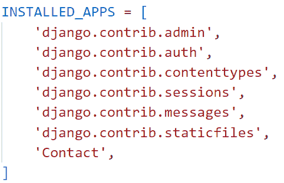
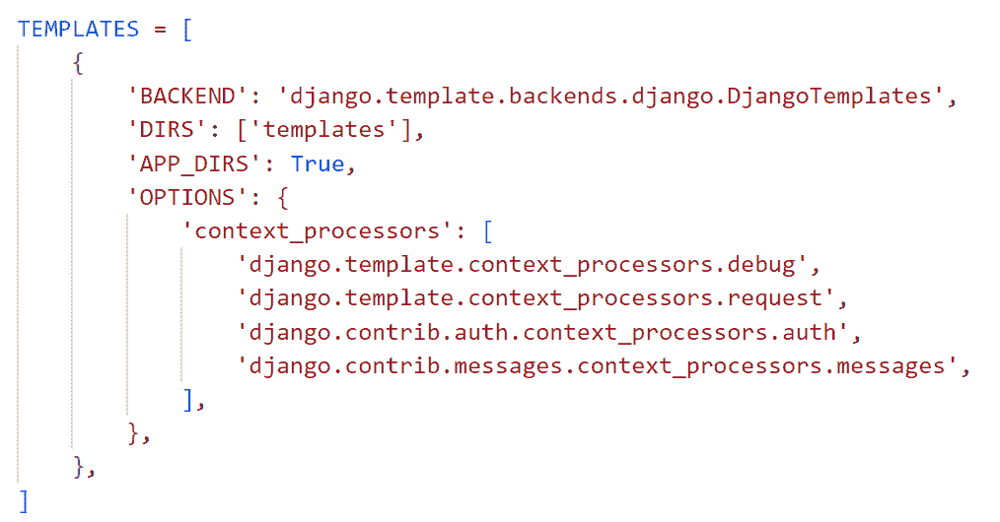
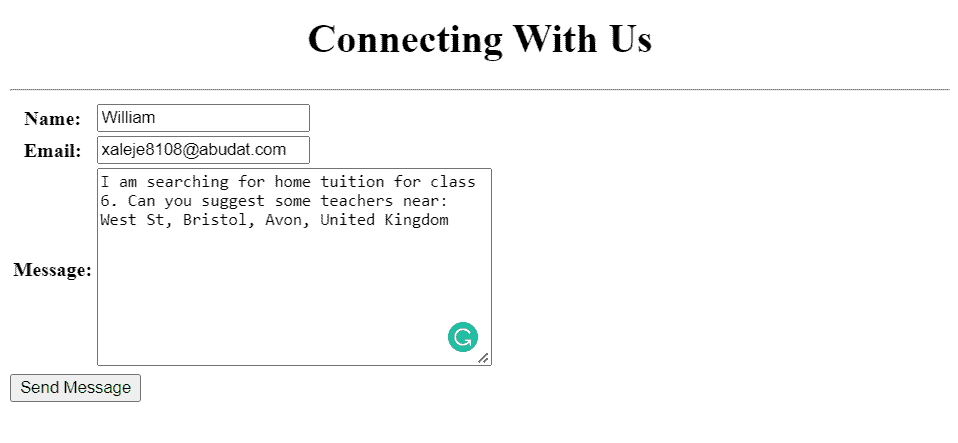

# 基于类视图的 Django 联系人表单

> 原文：<https://pythonguides.com/django-contact-form-with-class-based-views/>

[](https://sharepointsky.teachable.com/p/python-and-machine-learning-training-course)

在这个 [Python Django 教程](https://pythonguides.com/what-is-python-django/)中，我将解释如何**用基于类的视图**创建 Django 联系表单。

在处理联系人表单时，我刚刚了解到使用基于函数的视图创建联系人表单需要几十行代码以及大量的工作和时间。

所以，在做了一些研究之后，我了解到 Django 有基于阶级的观点。在这里，我们将集中讨论用基于类的视图处理 Django 联系表单。

在这里我们将看到:

*   用基于类的视图构建 Django 联系表单
*   Django 中基于类的表单视图的表单处理
*   如何在 Django 中使用 TemplateView
*   如何在 Django 中使用各种控件，如文本框、电子邮件和字符栏
*   如何在 Django 中将表单呈现为表格

在本文的最后，你也可以下载代码:**带有基于类的视图的联系表单**。

这是我们将在这里建造的。


Django Contact Form with class based views

目录

[](#)

*   [用基于类的视图构建 Django 联系表单](#Build_a_Django_contact_form_with_class_based_views "Build a Django contact form with class based views")
    *   [设置 Django 项目](#Setup_Django_Project "Setup Django Project")
    *   [具有各种字段的 Django 表单](#Django_Form_with_various_fields "Django Form with various fields")
    *   [在 Django 中以表格的形式呈现表单](#Render_the_form_as_a_table_in_Django "Render the form as a table in Django")
    *   [用基于类的表单视图处理 Django 联系人表单的逻辑](#Logic_to_handle_Django_contact_form_with_class-based_FormView "Logic to handle Django contact form with class-based FormView")
    *   [执行 Django 应用程序](#Execute_Django_Application "Execute Django Application")
*   [下载 Django 联系表单，包含基于类的视图完整代码。](#Download_the_Django_Contact_form_with_class_based_views_complete_code "Download the Django Contact form with class based views complete code.")
*   [结论](#Conclusion "Conclusion")

## 用基于类的视图构建 Django 联系表单

现在，让我们一步一步地看看如何用基于类的 FormView 处理 Django 表单。

### 设置 Django 项目

首先，使用下面给出的命令在 Django 中创建一个名为**导师**的项目。

```
django-admin startproject Tutors
```

通过在终端键入下面的命令，在 Django 项目中创建一个名为 **Contact** 的 Django 应用程序。

```
python manage.py startapp Contact
```

将**联系人**应用添加到位于 **settings.py** 文件中的已安装应用列表中。



settings.py

Django 默认在项目目录中包含一个 **urls.py** 文件，用于将新构建的应用程序映射到其中。为此，在其中添加以下代码。

```
from django.contrib import admin
from django.urls import path,include

urlpatterns = [
    path('admin/', admin.site.urls),
    path('',include('Contact.urls')),
]
```

### 具有各种字段的 Django 表单

创建 Django 表单，联系人应用程序将使用它来收集用户输入。

在 app 目录中创建 **forms.py** 文件，并在其中添加以下代码。

```
from django import forms

# Create your forms here.

class TutorBookForm(forms.Form):
    name = forms.CharField(max_length=50)
    email = forms.EmailField()
    message = forms.CharField(widget=forms.Textarea)
```

在这里，我们创建一个名为 **TutorBookForm** 的表单类，其字段如下所示。

*   **名称**字段是 Django CharField。此外，该字符域有 50 个**最大长度**字符的限制。
*   **电子邮件**字段是 Django EmailField。此字段用于收集来自用户的电子邮件。
*   **消息**字段是 Django CharField，带有一个小部件，指定表单将显示为 Textarea。

阅读: [Python 改 Django 版本](https://pythonguides.com/python-change-django-version/)

### 在 Django 中以表格的形式呈现表单

为了允许开发者将 Django 逻辑代码嵌入到 HTML 模板文件中，Django Template 应运而生。

为此，在主项目目录中创建一个名为 **Templates** 的子目录来存储所有的项目模板。

然后，打开 **settings.py** 文件，更新 **DIRS** 指向 Templates 文件夹的位置。



settings.py

在**模板**文件夹中创建一个名为**form.html**的文件来定义联系人网页的前端。添加下面给出的代码。

```
<!DOCTYPE html>
<html lang="en">

<head>
    <meta charset="UTF-8">
    <meta http-equiv="X-UA-Compatible" content="IE=edge">
    <meta name="viewport" content="width=device-width, initial-scale=1.0">
    <title>Contact Us</title>
</head>

<body>
    <h1 align="center">Connecting With Us</h1>
    <hr>
    <form method="post">
        
        <table>
        {{form.as_table}}
        </table>
        <button type="submit">Send Message</button>
    </form>
</body>

</html>
```

*   首先使用 HTML 标签 **h1** 向表单添加标题，并使用 **hr** 标签添加一条水平线。
*   然后用方法 **POST** 调用**表单**标签，这样表单在提交时就被发布了。
*   为了防止表单受到网络攻击并允许您安全地发送信息，请在**表单**元素中添加 **** 。
*   接下来，将表单呈现为表格，在**表**标签中使用 **form.as_table** 标签。
*   最后，添加一个**提交**按钮来发送消息。

当联系表单成功提交后，我们希望将其呈现到另一个页面，因此我们再次收到成功消息和联系表单链接。

为此，我们将另一个名为**success.html**的 HTML 文件添加到**模板**文件夹。

```
<!DOCTYPE html>
<html lang="en">

<head>
    <meta charset="UTF-8">
    <meta http-equiv="X-UA-Compatible" content="IE=edge">
    <meta name="viewport" content="width=device-width, initial-scale=1.0">
    <title>Success Page</title>
</head>

<body>
    <h2 style="text-align: center; color: red;" "></h2style>Your form is successfully submitted.</h2>
    <p> You can send another in the <a href=" ">Contact Page</a></p>
</body>

</html>
```

**h2** 标签用于定义标题，并且**文本对齐**和**颜色**属性被传递到标签内部以使文本居中并将其颜色设置为红色。然后使用 **a href** 标签将联系页面链接到 **p** 标签内部。

阅读: [Python Django 表单验证](https://pythonguides.com/django-form-validation/)

### 用基于类的表单视图处理 Django 联系人表单的逻辑

为了定义使用基于类的视图创建联系人表单的主要逻辑，我们打开 **views.py** 文件并添加下面给出的代码。

```
from django.shortcuts import render
from .forms import TutorBookForm
from django.views.generic.edit import FormView
from django.views.generic.base import TemplateView

# Create your views here.

class TutorBookFormView(FormView):
    template_name = 'form.html'
    form_class = TutorBookForm
    success_url = '/success/'

class SuccessView(TemplateView):
    template_name = 'success.html' 
```

*   首先，从**表单. py** 中导入**联系人表单**。
*   然后分别从 **generic.edit** 和 **generic.base** 模块中导入 **FromView** 类和 **TemplateView** 类。
*   接下来，创建一个名为 **TutorBookFormView** 的子类，然后用一个名为 **FormView** 的现有视图扩展它。
    *   在这个基于类的视图中，我们覆盖了它的 **template_name** 、 **form_class** 和 **success_url** 属性，分别将模板作为**form.html**，表单作为 **TutorBookForm** ，当我们成功提交表单时，重定向到 **success** 视图。
*   然后，我们创建一个名为 **SuccessView** 的子类，并用名为 **TemplateView** 的现有视图对其进行扩展。
    *   在这个基于类的视图中，我们覆盖了它的 **template_name** 属性，这些属性分别将用户带到名为【success.html】的**模板**。

我们必须用 URL 映射视图以便调用它，因此我们必须在 app 目录中创建一个名为 **urls.py** 的文件。并在其中包含下面的代码。

```
from django.urls import path
from .views import TutorBookFormView,SuccessView

urlpatterns = [ 
    path("contact", TutorBookFormView.as_view(), name="contact"),
    path("success/", SuccessView.as_view(), name="success"),  
]
```

阅读: [Python Django MySQL CRUD](https://pythonguides.com/python-django-mysql-crud/)

### 执行 Django 应用程序

为了启动这个特定 Django 项目的开发服务器，我们在终端中输入下面的命令。

```
python manage.py runserver
```

我们通过展开 URL 来访问 contact 表单，如下所示。

```
127.1.1.0/contact
```

它成功地打开了我们使用基于类的视图创建的 Django 联系人表单，如下所示。


Contact Us

现在，填写联系表单并点击发送消息按钮，如下所示。



Contact Form with class-based view

单击提交后，我们将被带到成功页面。如果我们点击联系页面链接，我们将再次被带到一个未填写的联系表格。


Success Page

另外，检查: [Django CRUD 示例和 PostgreSQL](https://pythonguides.com/django-crud-example-with-postgresql/)

## 下载带有基于类的视图的**Django**联系表完整代码。

这是代码。

[Django contact form with class based views](https://pythonguides.com/wp-content/uploads/2022/11/Tutors.zip)

## 结论

这样，我们就成功地创建了一个带有基于类的视图的 Django 联系表单。我们还学习了如何在 Python Django 中使用 FormView 类和 TemplateView 类。

此外，我们还讨论了以下主题。

*   用基于类的视图构建 Django 联系表单
*   使用基于类的 FormView 进行表单处理
*   如何在 Django 中使用 TemplateView
*   如何在 Django 中使用各种控件，如文本框、电子邮件和字符栏
*   如何在 Django 中将表单呈现为表格

另外，看看下面的 Python Django 教程。

*   [Python Django group by](https://pythonguides.com/python-django-group-by/)
*   [Python Django 长度过滤器](https://pythonguides.com/python-django-length-filter/)
*   [使用 bootstrap 在 Django 中创建一个联系表单](https://pythonguides.com/contact-form-in-django-using-bootstrap/)

[Tanya Puri](https://pythonguides.com/author/tanya/)

拥有丰富 Django 和 Matplotlib 经验的 Python 开发人员，目前在 TSInfo Technologies 工作。我正在成为专业程序员、博客写手和 YouTuber 的路上。