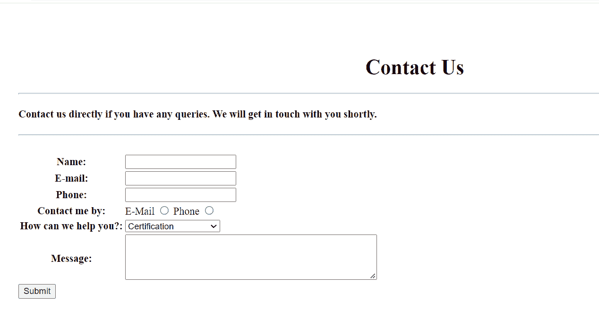
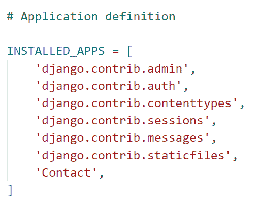
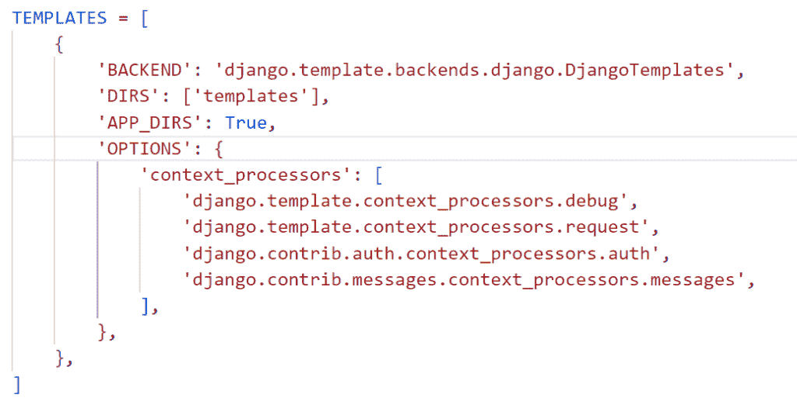
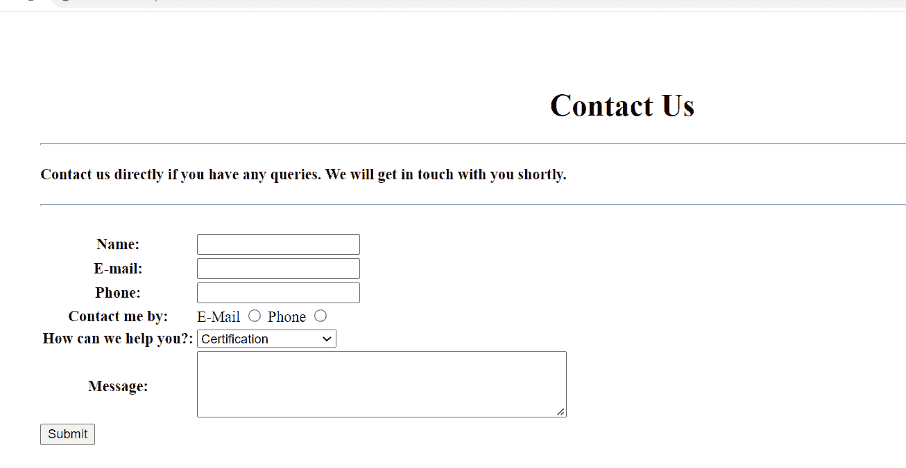
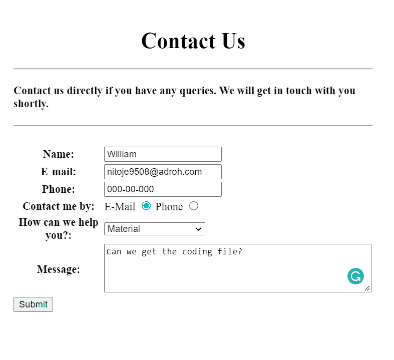
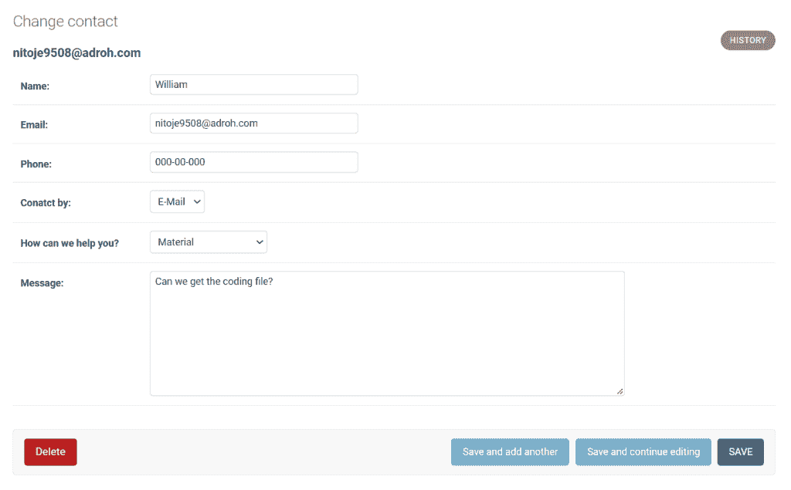

# 如何用 Django 和 SQLite 创建联系人表单

> 原文：<https://pythonguides.com/contact-form-with-django-and-sqlite/>

[](https://sharepointsky.teachable.com/p/python-and-machine-learning-training-course)

最近，我接到一个在 Django 中创建联系人表单并将数据保存到 SQLite 数据库的请求。在这里，我将一步一步地解释如何用 Django 和 SQLite 创建联系人表单。

作为一名 Python Django 开发人员，我需要为一个培训课程创建一个网站，在这个网站上，我需要一个带有 SQLite 数据库的联系表单。

在这里我们将看到:

*   如何将 HTML 表单中的数据保存到数据库中
*   如何在 Django 中使用各种控件，如文本框、文本区、电子邮件和单选按钮
*   如何在 Django 中删除必需的表单验证
*   如何在电话号码上添加自定义验证
*   如何在 Django 中使用 HTML 构建联系人表单
*   如何从 Django 管理界面查看提交的数据

有不同的方法，我们可以在 Django 中创建联系表单，比如使用 Form、ModelForm 类和 HTML。但是我们将关注使用 HTML 在 Django 中创建一个联系表单。

在本文的最后，你也可以下载代码:**与 Django 和 SQLite** 的联系方式。

这是我们将在这里建造的。



Contact Form with Django and SQLite

目录

[](#)

*   [与 Django 和 SQLite 的联系表](#Contact_Form_with_Django_and_SQLite "Contact Form with Django and SQLite")
    *   [使用 Django 创建模型](#Create_Model_using_Django "Create Model using Django")
    *   [定义带验证的 Django 表单](#Define_Django_Form_with_validation "Define Django Form with validation")
    *   [定义 Django 视图](#Define_Django_View "Define Django View")
    *   [执行 Django 应用程序](#Execute_Django_Application "Execute Django Application")
    *   [从 Django 管理界面查看提交的数据](#View_submitted_data_from_the_Django_admin_interface "View submitted data from the Django admin interface")
*   [下载包含 Django 和 SQLite 完整代码的 Django 联系表](#Download_Django_Contact_Form_with_Django_and_SQLite_complete_code "Download Django Contact Form with Django and SQLite complete code")
*   [结论](#Conclusion "Conclusion")

## 与 Django 和 SQLite 的联系表

现在，让我们一步一步地看看如何将数据从 HTML 格式保存到数据库中。

首先，我们需要使用下面给出的命令在 Django 中建立一个项目。这里的 **TrainingGuides** 是项目的名称。

```
django-admin startproject TrainingGuides
```

通过在终端键入下面的命令，在 Django 项目中创建一个名为 **Contact** 的 Django 应用程序。

```
python manage.py startapp Contact
```

将**联系人**应用添加到位于 **settings.py** 文件中的**已安装应用**列表中。



settings.py

Django 中的请求首先到达位于项目目录中的 **urls.py** ，然后到达 app 目录中 urls.py 中的匹配 URL。在其中添加下面的代码。

```
from django.contrib import admin
from django.urls import path,include

urlpatterns = [
    path('admin/', admin.site.urls),
    path('',include('Contact.urls')),
]
```

阅读: [Python Django 获取管理员密码](https://pythonguides.com/python-django-get-admin-password/)

### 使用 Django 创建模型

为了存储项目数据，创建 Django 模型，这些模型基本上是我们数据库中的表。为此，打开 app 目录中的 **models.py** 文件，并添加下面给出的代码。

```
from django.db import models

# Create your models here.

select_mode_of_contact = (
    ("email", "E-Mail"),
    ("phone", "Phone"),
)
select_question_categories = (
    ("certification", "Certification"),
    ("interview", "Interview"),
    ("material", "Material"),
    ("access_duration","Access and Duration"),
    ("other", "Others"),
)

class Contact(models.Model):
    name = models.CharField(max_length=250)
    email = models.EmailField()
    phone = models.CharField(max_length=10)
    mode_of_contact = models.CharField('Conatct by', max_length=50,choices=select_mode_of_contact,default='email')
    question_categories = models.CharField('How can we help you?', max_length=50,choices=select_question_categories,default='certification')
    message = models.TextField(max_length=3000)

    def __str__(self):
        return self.email
```

在这里，我们创建一个模型类 **Contact** ，它具有以下字段。

1.  **的名字**是姜戈·查菲尔斯。并且该字符字段有 25 个字符的限制。
2.  **电子邮件**是 Django EmailField，允许用户保存电子邮件地址。
3.  电话是 Django CharField。并且该字符字段有 10 个字符的限制。
4.  **联系方式**和**问题类别**是 Django CharField。这些字符字段有 50 个字符的限制。此外，还有一个**选择**选项，它们是可用作字段选项的序列，由项目的可重复项组成，我们为此定义了一个名为 **select_mode_of_contact** 和**select _ question _ categories**的元组。
5.  **消息**字段是 Django 文本字段。并且有 3000 个字符的限制。

并使用 **def __str__(self)** 来更改 Django 模型中对象的显示名称。当我们返回 **self.email** 时，它会将项目名称显示为电子邮件。

将**联系人**模型注册到管理站点，以便用户可以在管理应用程序中查看它。打开 **admin.py** 文件，添加下面给出的代码。

```
from django.contrib import admin
from .models import Contact

# Register your models here.

admin.site.register(Contact)
```

阅读: [Python Django vs 金字塔](https://pythonguides.com/python-django-vs-pyramid/)

### 定义带验证的 Django 表单

我们的主要目标是使用 HTML 在 Django 中建立一个联系表单。因此，在主项目目录中创建一个名为 **Templates** 的子目录来存储所有的项目模板。

之后，打开 **settings.py** 文件配置 Django 模板系统，更新 **DIRS** 指向模板文件夹的位置。



settings.py

要使用 HTML 在 Django 中创建联系人表单，我们需要创建一个 HTML 文件。为了定义联系表单字段，我们在**模板**文件夹中创建**contact.html**，并包含下面给出的代码。

```
<!DOCTYPE html>
<html lang="en">

<head>
    <meta charset="UTF-8">
    <meta http-equiv="X-UA-Compatible" content="IE=edge">
    <meta name="viewport" content="width=device-width, initial-scale=1.0">
    <title>Contact</title>
</head>

<body>
    <div style="margin:80px">
        <h1 align="center">Contact Us</h1>
        <hr>
        <h4>Contact us directly if you have any queries. We will get in touch with you shortly.</h4>
        <hr>
        <br>
        <form method="post">
            
            <table>
                <tr>
                    <th>
                        <label for="name">Name:</label>
                    </th>
                    <td>
                        <input type="text" id="name" name="name" required>
                    </td>
                </tr>
                <tr>
                    <th>
                        <label for="email">E-mail:</label>
                    </th>
                    <td>
                        <input type="email" id="email" name="email" required>
                    </td>
                </tr>
                <tr>
                    <th>
                        <label for="phone">Phone:</label>
                    </th>
                    <td>
                        <input type="tel" id="phone" name="phone" pattern="[0-9]{3}-[0-9]{2}-[0-9]{3}">
                    </td>
                </tr>
                <tr>
                    <th>
                        Contact me by:
                    </th>
                    <td>
                        <label for="email">E-Mail</label>
                        <input type="radio" id="email" name=contact value="email">

                        <label for="phone">Phone</label>
                        <input type="radio" id="phone" name=contact value="phone">
                    </td>
                </tr>
                <tr>
                    <th>
                        <label for="queries">How can we help you?:</label>
                    </th>
                    <td>
                        <select name="queries" id="queries">
                            <option value="certification">Certification</option>
                            <option value="interview">Interview</option>
                            <option value="material">Material</option>
                            <option value="access_duration">Access and Duration</option>
                            <option value="other">Others</option>
                        </select>
                    </td>
                </tr>
                <tr>
                    <th>
                        <label for="message">Message:</label>
                    </th>
                    <td>
                        <textarea id="message" name="message" rows=10 cols=40 maxlength=3000 required></textarea>
                    </td>
                </tr>
            </table>
            <button type="submit">Submit</button>
        </form>
</body>

</html>
```

*   首先使用 HTML 标签 **h1** 和 **h4** 将标题添加到表单中。
*   然后用方法 **POST** 调用**表单**标签，这样表单在提交时就被发布了。
*   为了防止表单受到网络攻击，并允许我们安全地发送信息，在**表单**元素中添加 **csrf_token** 。
*   然后，调用**表的**标签来创建一个 HTML 表，并在这个表内调用 **tr** 标签来定义表的行。
*   接下来，在每个表格行中，我们调用 **th** 标记，该标记将表格标题定义为**姓名**、**电子邮件**、**电话**、**通过**、**联系我，我们能为您做些什么？**和**消息**。
*   然后为了定义这些头，我们称之为 **td** 标签。
*   下面是我们在 **td** 标签中定义的字段。
    *   对于**名称**字段，我们使用**输入 type="text "，**来定义单行文本。
    *   我们利用**输入 type="email"** 标签在 **email** 字段中定义一个电子邮件地址。
    *   **输入 type="tel"** 用于定义用于输入电话号码的**电话**字段。我们还在这个字段上添加了自定义验证。
    *   **输入 type="radio"** 用于将**联系方式**字段定义为单选按钮。单选按钮用于描述一组相关选项，一次只能选择一个。
    *   **选择名称=** 属性为下拉列表指定了**问题类别**。
    *   在表单中使用了 **textarea** 元素，来收集用户输入的**消息**。
*   我们还通过将**必需的**属性传递给**输入**标签，在**姓名**、**电子邮件**和**消息**字段上设置必需的字段验证。
*   最后，添加一个**提交**按钮来提交表单。

我们希望在成功提交后将联系表单呈现到另一个页面，因此我们再次收到成功消息和联系表单链接。为此，我们将另一个名为**success.html**的 HTML 文件添加到**模板**文件夹中。

```
<!DOCTYPE html>
<html lang="en">

<head>
    <meta charset="UTF-8">
    <meta http-equiv="X-UA-Compatible" content="IE=edge">
    <meta name="viewport" content="width=device-width, initial-scale=1.0">
    <title>Document</title>
</head>

<body>
    <h2 style="text-align: center; color: red;" "></h2style>We sent your message</h2>
    <p> You can send another in the <a href=" ">Contact Page</a></p>
</body>

</html>
```

标签 **h2** 用于创建标题，属性 **text-align** 和 **color** 用于文本居中、对齐并将其颜色改为红色。然后，在 **p** 标签中，我们使用 **a href** 标签将其链接到联系人表单。

阅读: [Python 改 Django 版本](https://pythonguides.com/python-change-django-version/)

### 定义 Django 视图

为了创建使用 HTML 创建联系人表单的主要逻辑，我们打开 **views.py** 文件并添加下面给出的代码。

```
from django.shortcuts import render
from .models import Contact

# Create your views here.

def contact(request):
    if request.method == 'POST':
        name = request.POST.get('name')
        email = request.POST.get('email')
        phone = request.POST.get('phone')
        mode_of_contact = request.POST.get('contact')
        question_categories = request.POST.get('queries')
        message = request.POST.get('message')
        contact_data = Contact(name=name, email=email, phone=phone, mode_of_contact=mode_of_contact, question_categories=question_categories, message=message)
        contact_data.save()
        return render(request, 'success.html')
    return render(request, 'contact.html') 
```

*   导入 **models.py** 文件中定义的**联系人**模型。
*   然后调用 **if** 语句，检查请求方法是否为 **POST** 。
    *   如果是，使用**请求获取表单中定义的所有字段。POST.get('html-field-name)**
    *   现在，将它传递给模型的构造器并使用 **save()** 保存数据，并将用户呈现给【success.html】的**。**

***   如果请求方法是 **GET** ，则使用 **render()** 函数向用户呈现一个空白的联系人表单。**

 **为了调用视图，我们必须将它与 URL 关联起来，因此我们必须在 app 目录中创建一个名为 **urls.py** 的文件。在其中包含以下代码。

```
from django.urls import path
from Contact import views

urlpatterns = [
    path("contact", views.contact, name="contact"),   
]
```

阅读: [Python Django vs ReactJS](https://pythonguides.com/django-vs-reactjs/)

### 执行 Django 应用程序

创建模型之后，您必须做的第一件事就是为它创建一个迁移。您可以使用命令执行此操作。

```
python manage.py makemigrations
```

现在已经创建了迁移，您必须使用 migrate 命令将任何更改实际应用到数据库。

```
python manage.py migrate
```

要为这个特定的 Django 项目启动一个开发服务器，我们可以在终端运行一个特殊的命令。

```
python manage.py runserver
```

通过如下所示展开 URL，我们可以访问联系表单。

```
127.1.1.0/contact
```

它成功地打开了使用 HTML 和 SQLite 创建的联系人表单，如下所示。



Contact Form using HTML

现在，填写这张联系表，并点击**提交**按钮，如下所示。



HTML Contact Form

一旦我们点击提交，我们将被带到**成功**页面。如果我们点击联系页面链接，我们将再次被带到一个未填写的联系表格。


Success Page

阅读: [Python Django MySQL CRUD](https://pythonguides.com/python-django-mysql-crud/)

### 从 Django 管理界面查看提交的数据

它还会将数据保存在数据库中。因此，创建一个超级用户，打开管理应用程序并查看它。



Save Data from HTML Form to Database

这就是如何用 Django 和 SQLite 创建联系人表单。

## 下载 Django **与 Django 和 SQLite** 的联系表，完成代码

代码如下:

[Contact Form with Django and SQLite](https://pythonguides.com/wp-content/uploads/2022/11/TrainingGuides.zip)

## 结论

这样，我们成功地创建了一个 Contact 表单，它将来自 HTML 表单的数据保存到数据库中，该表单具有各种控件，如 textbox、textarea、email 和单选按钮。我们还学习了删除必需的验证，并在管理界面上查看提交的表单数据。

此外，我们还讨论了以下主题。

*   如何将 HTML 表单中的数据保存到数据库中
*   如何在 Django 中使用各种控件，如文本框、文本区、电子邮件和单选按钮
*   如何在 Django 中删除必需的表单验证
*   如何在电话号码上添加自定义验证
*   如何在 Django 中使用 HTML 构建联系人表单
*   如何从 Django 管理界面查看提交的数据

您可能也喜欢阅读下面的 Python Django 教程。

*   [Python Django MySQL CRUD](https://pythonguides.com/python-django-mysql-crud/)
*   [Python Django 表单验证](https://pythonguides.com/django-form-validation/)
*   [如何在 Django 中创建模型](https://pythonguides.com/create-model-in-django/)
*   [用姜戈脆皮蛋糕制作蛋糕](https://pythonguides.com/create-form-with-django-crispy-forms/)
*   [如何将 Google reCAPTCHA 添加到 Django 表单中](https://pythonguides.com/add-google-recaptcha-to-django-form/)

[Tanya Puri](https://pythonguides.com/author/tanya/)

拥有丰富 Django 和 Matplotlib 经验的 Python 开发人员，目前在 TSInfo Technologies 工作。我正在成为专业程序员、博客写手和 YouTuber 的路上。**