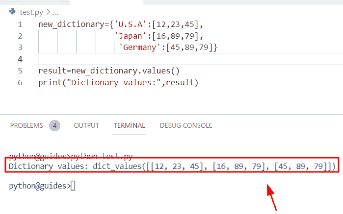
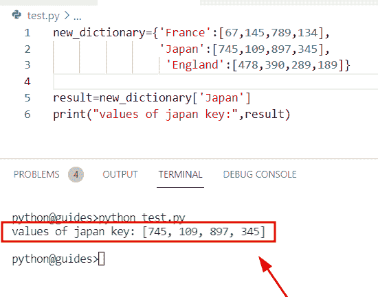
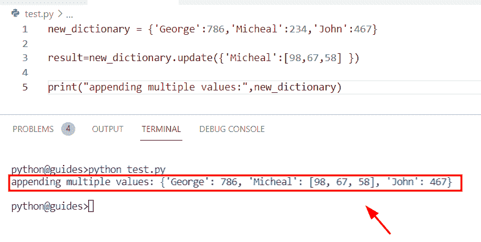
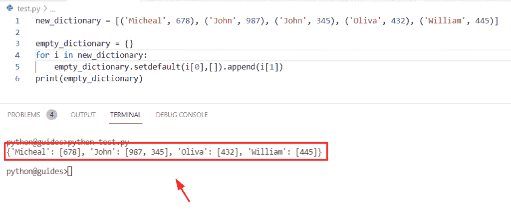
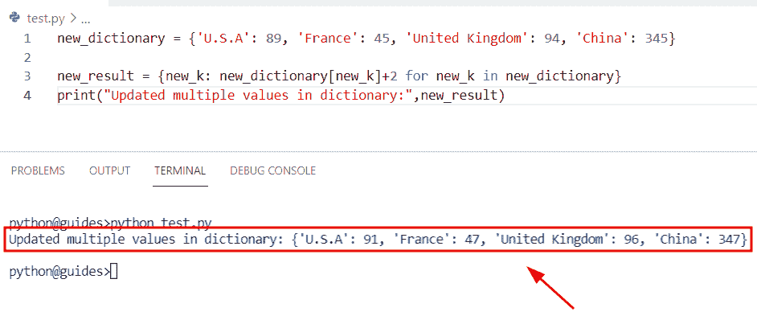
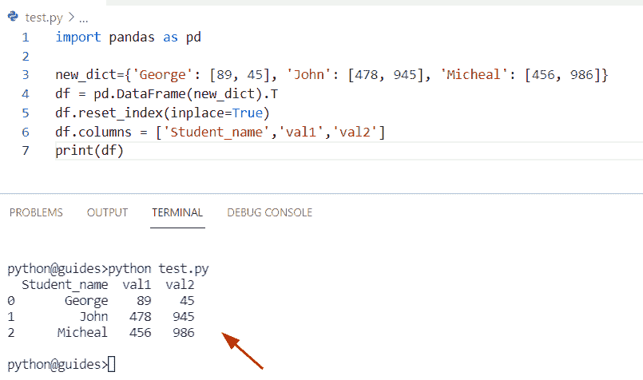
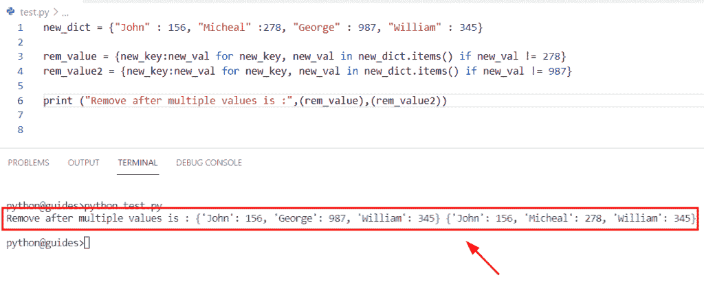
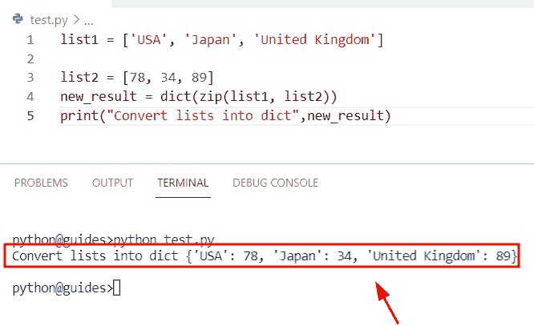

# Python 字典多值

> 原文：<https://pythonguides.com/python-dictionary-multiple-values/>

[](https://sharepointsky.teachable.com/p/python-and-machine-learning-training-course)

在本 [Python 教程](https://pythonguides.com/learn-python/)中，我们将使用 Python 中的一些例子来学习 **Python 字典多值**。此外，我们还将涉及这些主题。

*   Python 字典一个键有多个值
*   Python 字典追加多个值
*   Python 字典一个键有多个值
*   Python 字典更新多个值
*   具有多个数据帧值的 Python 字典
*   Python 字典删除多个值
*   Python 列表来字典多个值
*   Python 按多个值对字典列表进行排序

目录

[](#)

*   [Python 字典多值](#Python_dictionary_multiple_values "Python dictionary multiple values")
*   [Python 字典一键多值](#Python_dictionary_multiple_values_for_one_key "Python dictionary multiple values for one key")
*   [Python 字典追加多个值](#Python_dictionary_append_multiple_values "Python dictionary append multiple values")
*   [Python 字典一个键有多个值](#Python_dictionary_multiple_values_for_a_key "Python dictionary multiple values for a key")
*   [Python 字典更新多个值](#Python_dictionary_update_multiple_values "Python dictionary update multiple values")
*   [数据帧有多个值的 Python 字典](#Python_dictionary_with_multiple_values_to_dataframe "Python dictionary with multiple values to dataframe")
*   [Python 字典删除多个值](#Python_dict_remove_multiple_values "Python dict remove multiple values")
*   [Python 列表到字典的多个值](#Python_list_to_dictionary_multiple_values "Python list to dictionary multiple values")
*   [Python 按多值排序字典列表](#Python_sort_list_of_dictionary_by_multiple_values "Python sort list of dictionary by multiple values")

## Python 字典多值

*   在本节中，我们将讨论如何在 Python dictionary 中创建具有多个值的字典。
*   为了执行这个特定的任务，我们将使用 **dict.values()** 方法。在 Python 中， **dict.values()** 方法返回字典中所有可用的值，并将它们存储到一个列表中。

**语法:**

让我们看一下语法并理解 **dict.values()** 函数的工作原理

```py
dictionary.values()
```

**举例:**

让我们举个例子，看看如何创建一个包含多个值的字典。

```py
new_dictionary={'U.S.A':[12,23,45],
                'Japan':[16,89,79],
                 'Germany':[45,89,79]}

result=new_dictionary.values()
print("Dictionary values:",result) 
```

在上面的代码中，我们创建了一个名为**‘new _ dictionary’**的字典，它包含了以**键-值**对形式的元素。在本例中，我们为每个键分配了多个值。之后，我们使用了 **dict.values()** 方法，它将只从给定的字典中提取值。

下面是下面给出的代码的截图。



Python dictionary multiple values

阅读: [Python 字典重复键](https://pythonguides.com/python-dictionary-duplicate-keys/)

## Python 字典一键多值

*   在这个程序中，我们将讨论如何在 Python 字典中获取一个键的多个值。
*   为了完成这项任务，我们将选择特定的键，它会给出该键的值。
*   在这个例子中，我们将创建一个字典，然后声明一个变量**‘result’**，我们将在这个变量中分配从字典中选择的条目。

**举例:**

```py
new_dictionary={'France':[67,145,789,134],
                'Japan':[745,109,897,345],
                 'England':[478,390,289,189]}

result=new_dictionary['Japan']
print("values of japan key:",result)
```

下面是以下给定代码的实现。



Python dictionary multiple values for one key

正如您在屏幕截图中看到的，输出显示了“Japan”键的多个值。

阅读:[获取字典 Python 中的第一个键](https://pythonguides.com/get-first-key-in-dictionary-python/)

## Python 字典追加多个值

*   这里我们将讨论如何在 Python 字典中追加多个值。
*   通过使用 **dictionary.update()** 函数，我们可以很容易地在现有字典中追加多个值。
*   在 Python 中， **dictionary.update()** 方法将帮助用户更新字典元素，或者如果它不在字典中，它将插入键-值对。

**语法:**

让我们看一下语法并理解 Python**dictionary . update()**函数的工作原理。

```py
dict.update([other])
```

**举例:**

```py
new_dictionary = {'George':786,'Micheal':234,'John':467}

result=new_dictionary.update({'Micheal':[98,67,58] })

print("appending multiple values:",new_dictionary)
```

在上面的代码中，我们在 Python 字典的 **dict.update()** 函数中向一个**键(Micheal)** 添加了一个值列表。一旦执行了这段代码，输出将显示多个值。

下面是以下给定代码的输出。



Python dictionary append multiple values

阅读: [Python 字典增量值](https://pythonguides.com/python-dictionary-increment-value/)

## Python 字典一个键有多个值

*   在本节中，我们将讨论如何在 Python 字典中获取特定键的多个值。
*   为了完成这个任务，我们将使用 **set.default()** 函数，它用于设置字典键的默认值。

**举例:**

```py
new_dictionary = [('Micheal', 678), ('John', 987), ('John', 345), ('Oliva', 432), ('William', 445)]

empty_dictionary = {}
for i in new_dictionary:
    empty_dictionary.setdefault(i[0],[]).append(i[1])
print(empty_dictionary)
```

下面是以下给定代码的实现



Python dictionary multiple values for a key

阅读: [Python 字典扩展](https://pythonguides.com/python-dictionary-extend/)

## Python 字典更新多个值

*   在本节中，我们将学习如何在 Python 字典中更新多个值。
*   为了执行这个特定的任务，我们将使用字典理解方法。这个函数用于创建一个字典，它迭代键值对。
*   在这个字典理解方法中，我们将使用赋值操作符 **'+'** ，这个操作数将帮助用户在给定的键中添加值。

**举例:**

```py
new_dictionary = {'U.S.A': 89, 'France': 45, 'United Kingdom': 94, 'China': 345}

new_result = {new_k: new_dictionary[new_k]+2 for new_k in new_dictionary}
print("Updated multiple values in dictionary:",new_result)
```

在上面的代码中，我们创建了一个包含键值对形式的元素的字典。之后，为了更新字典中的多个值，我们指定了 **'+2'** 操作符，这个操作数将更新字典中的每个值。一旦执行了这段代码，输出将显示字典中的更新值。

下面是以下给定代码的执行。



Python dictionary update multiple values

阅读: [Python 字典副本带示例](https://pythonguides.com/python-dictionary-copy/)

## 数据帧有多个值的 Python 字典

*   在这个程序中，我们将学习如何在 Python 中将一个字典转换成具有多个值的 Pandas Dataframe。
*   要完成这项任务，首先我们将创建一个字典并分配键值对，但多个值将存储在列表中，它将认为是值。
*   接下来，为了将字典转换成熊猫数据帧，我们将使用 **pd。DataFrame()** 语法，在这些参数中，我们将为字典' **new_dict'** 和**赋值。T** 。
*   在[巨蟒熊猫](https://pythonguides.com/pandas-in-python/)中，**。T** 用于移位数据帧中的列和索引，这个**‘T’**表示转置。接下来，我们将使用 **df.reset.index()** 方法，该方法将对数据帧的索引进行重新排序。

**语法:**

下面是 **df.reset.index()** 方法的语法。

```py
DataFrame.reset_index
                     (
                      Level=None,
                      drop=False,
                      inplace=False,
                      col_Level=0,
                      col_fill=''
                     )
```

**举例:**

让我们举一个例子，看看如何在 Python 字典中将字典转换为具有多个值的 dataframe。

**源代码:**

```py
import pandas as pd

new_dict={'George': [89, 45], 'John': [478, 945], 'Micheal': [456, 986]}
df = pd.DataFrame(new_dict).T
df.reset_index(inplace=True)
df.columns = ['Student_name','val1','val2']
print(df)
```

下面是下面给出的代码的截图。



Python dictionary with multiple values to dataframe

阅读:[如何创建一个空的 Python 字典](https://pythonguides.com/how-to-create-an-empty-python-dictionary/)

## Python 字典删除多个值

*   在本节中，我们将学习如何移除 Python 字典中的多个值。
*   为了执行这个特定的任务，我们将使用字典理解和 **dict.items()** 方法从字典中删除多个值。这个方法将总是返回字典的一个对象。
*   在字典理解法中，我们会设置条件 **new_val！=278** 表示如果该值在字典中可用，那么它将从字典中删除。

**举例:**

```py
new_dict = {"John" : 156, "Micheal" :278, "George" : 987, "William" : 345}

rem_value = {new_key:new_val for new_key, new_val in new_dict.items() if new_val != 278}
rem_value2 = {new_key:new_val for new_key, new_val in new_dict.items() if new_val != 987}

print ("Remove after multiple values is :",(rem_value),(rem_value2))
```

在下面的代码中，我们创建了一个字典，然后声明了两个变量**‘rem _ value’，‘rem _ value 2’**，在这个变量中，我们使用了字典理解方法，它将从字典中删除多个值。

下面是以下给定代码的实现。



Python dict remove multiple values

阅读: [Python 将字典转换为数组](https://pythonguides.com/python-convert-dictionary-to-an-array/)

## Python 列表到字典的多个值

*   在这个程序中，我们将学习如何在 Python 中将列表转换成具有多个值的字典。
*   为了完成这个任务，我们将使用 **zip()** 和 **dict()** 函数。在 Python 中， **zip()** 函数将可迭代对象作为一个参数，如列表和元组，它总是返回一个基于对象的元组迭代器。
*   然后，为了将对象转换成字典，我们将使用 dict()函数，该函数用于在 Python 中创建字典。

**语法:**

下面是 Python **zip()** 函数的语法。

```py
zip(*iterables)
```

**举例:**

让我们举一个例子，检查如何将列表转换为具有多个值的字典。

```py
list1 = ['USA', 'Japan', 'United Kingdom']

list2 = [78, 34, 89]
new_result = dict(zip(list1, list2))
print("Convert lists into dict",new_result)
```

在下面给出的代码中，我们创建了两个列表**‘list 1’和‘list 2’**。在列表 1 中，我们将关键元素指定为**国家名称**，而**列表 2** 包含多个值。一旦执行了这段代码，输出将显示新的字典，其中包含键值对形式的元素。

你可以参考下面的截图。



Python list to dictionary multiple values

阅读: [Python 元组字典](https://pythonguides.com/python-dictionary-of-tuples/)

## Python 按多值排序字典列表

*   在本节中，我们将学习如何在 Python 中通过多个值对字典列表进行排序。
*   在这个例子中，我们将创建一个字典列表，在这个字典中，有相同的关键元素和不同的多个值。
*   接下来，我们必须使用 **sorted()** 函数对字典列表进行排序，在该函数中，我们指定了关键元素，并根据关键元素的值按升序排序。

**举例:**

```py
new_dict = [{'George':456, 'William': 6934,'John':456},
            {'George':897, 'William': 918,'John':734},
            {'George':345, 'William': 1456,'John':241}]

new_output = sorted(new_dict, key=lambda d: d['William'])
print(new_output)
```

下面是下面给出的代码的截图。


Python sort list of dictionary by multiple values

正如您在屏幕截图中看到的，输出显示了根据条件排序的字典列表。

另外，看看更多的 Python 教程。

*   [Python 集合字典](https://pythonguides.com/python-dictionary-of-sets/)
*   [如何在 Python 中删除字典](https://pythonguides.com/delete-a-dictionary-in-python/)
*   [Python 字典理解](https://pythonguides.com/python-dictionary-comprehension/)
*   [Python 将字典转换为列表](https://pythonguides.com/python-convert-dictionary-to-list/)
*   [遍历字典 Python](https://pythonguides.com/iterate-through-dictionary-python/)
*   [Python 字典包含+个例子](https://pythonguides.com/python-dictionary-contains/)
*   [Python 字典过滤器+示例](https://pythonguides.com/python-dictionary-filter/)

在本教程中，我们使用 Python 中的一些例子学习了 **Python 字典多值**。此外，我们还讨论了这些主题。

*   Python 字典一个键有多个值
*   Python 字典追加多个值
*   Python 字典一个键有多个值
*   Python 字典更新多个值
*   具有多个数据帧值的 Python 字典
*   Python 字典删除多个值
*   Python 列表来字典多个值
*   Python 按多个值对字典列表进行排序

[Bijay Kumar](https://pythonguides.com/author/fewlines4biju/)

Python 是美国最流行的语言之一。我从事 Python 工作已经有很长时间了，我在与 Tkinter、Pandas、NumPy、Turtle、Django、Matplotlib、Tensorflow、Scipy、Scikit-Learn 等各种库合作方面拥有专业知识。我有与美国、加拿大、英国、澳大利亚、新西兰等国家的各种客户合作的经验。查看我的个人资料。

[enjoysharepoint.com/](https://enjoysharepoint.com/)[](https://www.facebook.com/fewlines4biju "Facebook")[](https://www.linkedin.com/in/fewlines4biju/ "Linkedin")[](https://twitter.com/fewlines4biju "Twitter")