# 向列表中添加字符串 Python +示例

> 原文：<https://pythonguides.com/add-string-to-list-python/>

[](https://sharepointsky.teachable.com/p/python-and-machine-learning-training-course)

在这个 [python 教程中，](https://pythonguides.com/python-hello-world-program/)你将学习到**添加字符串到列表 python** ，我们也将检查 **:**

*   将字符串添加到列表 python
*   将字符串追加到列表 python
*   将字符串插入列表 python
*   将字符串连接到列表 python
*   向空列表添加字符串 python
*   向列表 python 添加多个字符串
*   将字符串添加到列表 python 的开头
*   将字符串追加到空列表 python
*   在列表 python 中所有项目的开头插入字符串
*   将字符串添加到列表 python 的末尾
*   Python 将字符串添加到列表中(如果不存在)
*   Python 将字符串追加到列表中而不拆分
*   将字符串追加到列表 python 的开头

目录

[](#)

*   [添加字符串到列表 python](#Add_string_to_list_python "Add string to list python")
*   [将字符串追加到列表 python](#Append_string_to_list_python "Append string to list python")
*   [将字符串插入列表 python](#Insert_string_to_list_python "Insert string to list python")
*   [连接字符串到列表 python](#Join_string_to_list_python "Join string to list python")
*   [向空列表添加字符串 python](#Add_string_to_empty_list_python "Add string to empty list python")
*   [添加多个字符串到列表 python](#Add_multiple_strings_to_list_python "Add multiple strings to list python")
*   [将字符串添加到列表 python 的开头](#Add_string_to_the_beginning_of_list_python "Add string to the beginning of list python")
*   [将字符串追加到空列表 python](#Append_the_string_to_empty_list_python "Append the string to empty list python")
*   [在列表中所有项目的开头插入字符串 python](#Insert_the_string_at_the_beginning_of_all_items_in_a_list_python "Insert the string at the beginning of all items in a list python")
*   [将字符串添加到列表末尾 python](#Add_string_to_end_of_list_python "Add string to end of list python")
*   [如果字符串不存在，Python 会将其添加到列表中](#Python_add_string_to_list_if_not_present "Python add string to list if not present")
*   [Python 将字符串追加到列表中而不拆分](#Python_append_string_to_list_without_split "Python append string to list without split")
*   [将字符串追加到列表 python 的开头](#Append_string_to_beginning_of_list_python "Append string to beginning of list python")

## 添加字符串到列表 python

让我们看看如何**添加字符串到列表 python** 。

**将字符串添加到列表中**将字符串作为单个元素插入，该元素将被添加到列表的末尾。 **list.append()** 会将其追加到列表的末尾。

**举例:**

```py
l1 = ["One", "Two", "Three"]
l1.append("Four")
print(l1)
```

你可以参考下面的截图来查看**将字符串添加到列表 python** 的输出。

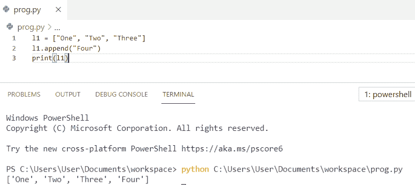

Add string to list python

你可能喜欢读，[如何用 Python](https://pythonguides.com/create-list-in-python/) 创建列表？

## 将字符串追加到列表 python

在这里，我们将看到如何**连接字符串来列出 python** 。

在这个例子中，我们首先将字符串转换成一个 [Python 列表](https://pythonguides.com/python-list-methods/)，然后使用 **+操作符**执行将字符串添加到列表中的任务。

**举例:**

```py
list1 = [101, 103]
str1 = 'aabb'
list1 += [str1]
print("The list is : " + str(list1))
```

你可以参考下面的截图来查看**将字符串添加到列表 python** 的输出。

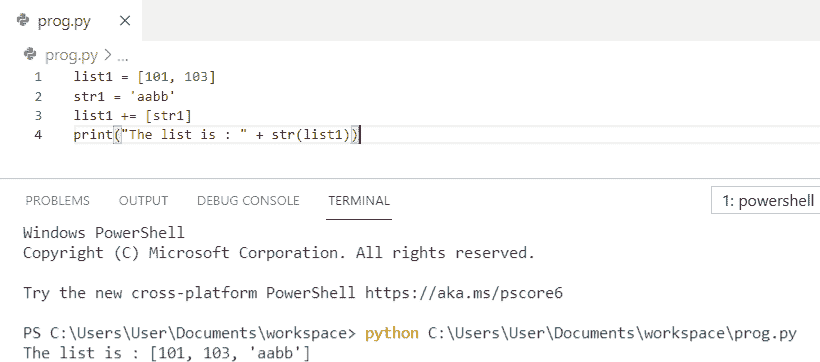

Append string to list python

上面的代码我们可以用来在 python 中**向列表追加字符串。**

读取 [Python 字符串以列出](https://pythonguides.com/python-string-to-list/)

## 将字符串插入列表 python

现在，我们将看到如何**插入字符串来列出 python** 。

为了**向列表**中插入一个字符串，我们使用了 **list1.insert()** 来添加列表中指定位置的值。

**举例:**

```py
list1 = ['aaa', 'bbb']
list1.insert(2, 'ccc')
print (list1)
```

您可以参考下面的截图来查看**插入字符串以列出 python** 的输出。

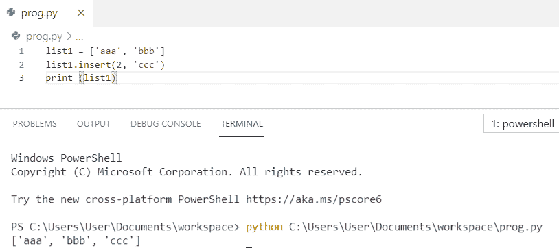

Insert string to list python

上面的 python 代码我们可以用来在 Python 中插入字符串到列表中**。**

阅读 [Python 字典扩展](https://pythonguides.com/python-dictionary-extend/)

## 连接字符串到列表 python

让我们看看如何**连接字符串来列出 python** 。

为了将字符串连接到列表，我们将在字符串上使用 **join** 方法，它将连接列表中的所有元素。

**举例:**

```py
list = ['aaa', 'bbb', 'ccc']
str = ','.join(list)
print(str)
```

您可以参考下面的截图来查看**连接字符串到列表 python** 的输出

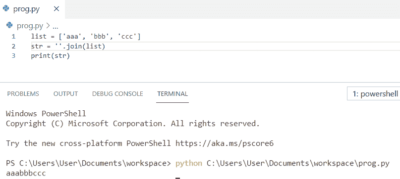

Join string to list python

阅读 [Python Tkinter 事件](https://pythonguides.com/python-tkinter-events/)

## 向空列表添加字符串 python

让我们看看如何**将字符串添加到空列表 python** 。

在这个例子中，我们将使用 python 中的 append 方法将 string 元素添加到空的 lis 中。

**举例:**

```py
my_list = []
my_list.append("abc")
print(my_list)
```

你可以参考下面的截图来看看**将字符串添加到空列表 python** 的输出。

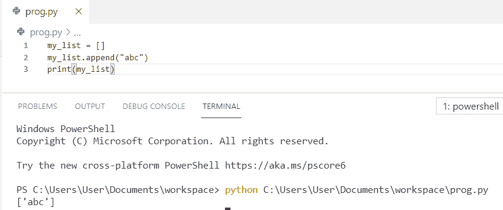

Add string to empty list python

读取循环的 [Django](https://pythonguides.com/django-for-loop/)

## 添加多个字符串到列表 python

现在，我们将看到如何**添加多个字符串来列出 python** 。

为了给 list python 添加多个字符串，我们将使用 **append** 方法给 list python 添加多个字符串。

**举例:**

```py
l = [1, 2, 3, 4, 5]
l.append("e")
l.append("f")
print(l)
```

你可以参考下面的截图来看看**添加多个字符串到列表 python** 的输出

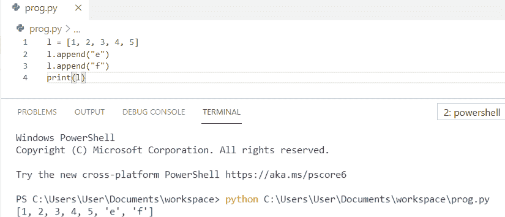

Add multiple strings to list python

## 将字符串添加到列表 python 的开头

现在，我们将看到如何**将字符串添加到 list python** 的开头。

为了**在列表的开头**添加一个字符串，我们使用了 **list1.insert()** 来添加列表中的值。

**举例:**

```py
list1 = [101, 102]
list1.insert(0, 'aaa')
print (list1)
```

你可以参考下面的截图来看看**将字符串添加到列表 python** 的开头的输出。

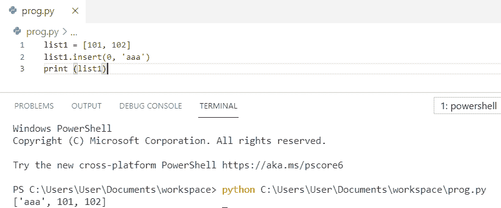

Add string to the beginning of list python

读取 [Matplotlib 日志日志图](https://pythonguides.com/matplotlib-log-log-plot/)

## 将字符串追加到空列表 python

让我们看看如何**将字符串追加到空列表 python** 。

在这个例子中，我们将使用 python 中的 append 方法将字符串追加到空列表中。

**举例:**

```py
list1 = []
list1.append("Python")
print(list1)
```

你可以参考下面的截图来看看输出**把字符串追加到空列表 python。**

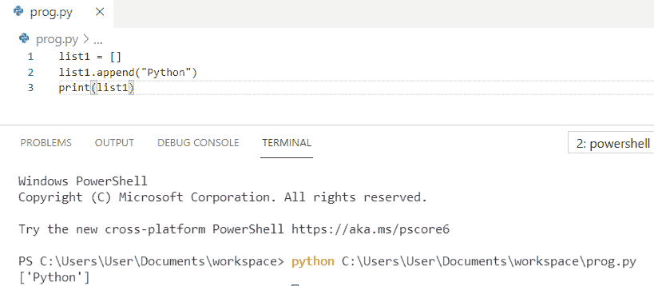

Append the string to empty list python

阅读 [Python 字典副本及示例](https://pythonguides.com/python-dictionary-copy/)

## 在列表中所有项目的开头插入字符串 python

在这里，我们将看到如何**在 list python** 中的所有条目的开头插入字符串。

在这个例子中，我们将使用循环的**在列表中所有项目的开头插入字符串。**

**举例:**

```py
my_list = [11, 12, 13, 14]
print(['Pythonguides{0}'.format(i) for i in my_list])
```

您可以参考下面的截图来查看**在列表中所有项目的开头插入字符串 python** 的输出

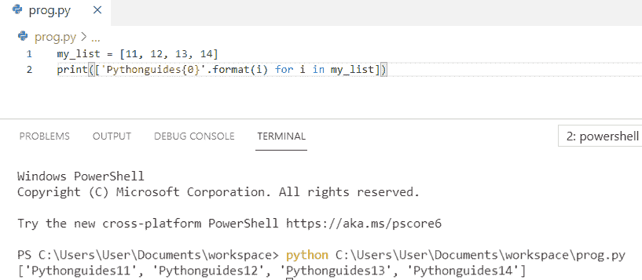

Insert the string at the beginning of all items in a list python

## 将字符串添加到列表末尾 python

在这里，我们将看到如何**将字符串添加到列表 python** 的末尾。

为了将字符串添加到列表的末尾，我们将首先将字符串转换成列表，然后使用 **+操作符**执行将字符串添加到列表的任务。

**举例:**

```py
list1 = [10, 11]
str1 = 'Python'
list1 += [str1]
print("The list is : " + str(list1))
```

你可以参考下面的截图来查看如何**将字符串添加到列表 python 的末尾**的输出

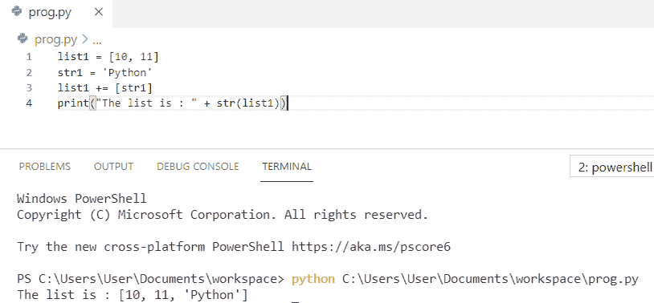

Add string to end of list python

由读取 [Python Django 组](https://pythonguides.com/python-django-group-by/)

## 如果字符串不存在，Python 会将其添加到列表中

现在，我们将看到 **python 将字符串添加到列表中，如果不存在**。

在这个例子中，我们必须使用 python 中的 append 方法将字符串添加到列表中，如果不存在的话。

**举例:**

```py
val = [1, 2]
val.append("three")
print (val)
```

如果不存在，您可以参考下面的截图来查看 **python 将字符串添加到列表的输出。**

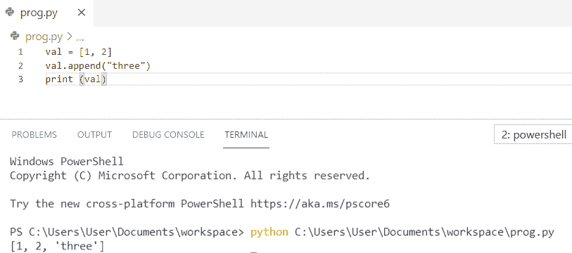

Python add string to list if not present

阅读:[在 Python 中连接多个列表](https://pythonguides.com/concatenate-multiple-lists-in-python/)

## Python 将字符串追加到列表中而不拆分

让我们来看一下 **python 将字符串追加到列表中而不拆分**。

在这个例子中，我们将在 python 中使用 **+操作符**到**将字符串追加到列表中，而不需要拆分**。

**举例:**

```py
list1 = ['to', 'Pythonguides']
list1 = ['Welcome'] + list1
print (list1)
```

你可以参考下面的截图来看看 **python 在不拆分**的情况下将字符串追加到列表的输出

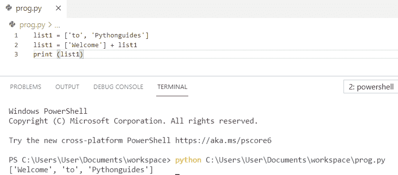

**Python append string to list without split**

阅读 [PdfFileReader Python 示例](https://pythonguides.com/pdffilereader-python-example/)

## 将字符串追加到列表 python 的开头

在这里，我们将看到如何**将字符串追加到列表 python** 的开头

为了**将字符串追加到列表**的开头，我们使用了 **[a] + l1** ，字符串将被追加到列表的开头。

**举例:**

```py
a = "Python"
l1 = [1, 2, 3]
res = [a] + l1
print(res)
```

你可以参考下面的截图来查看**将字符串附加到列表 python 开头的输出。**

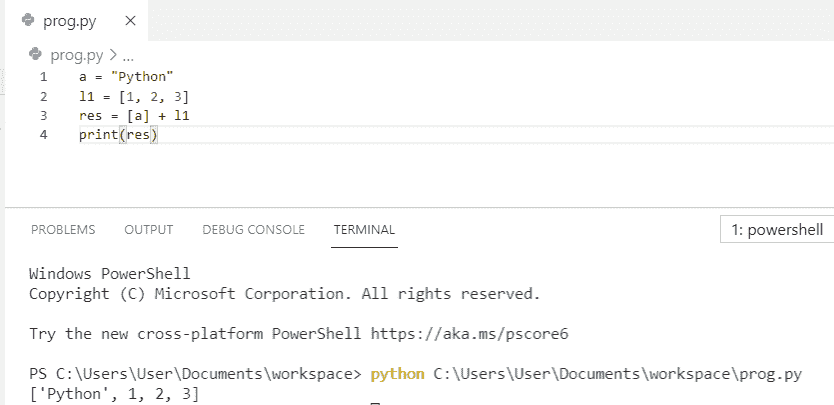

Append string to beginning of list python

您可能会喜欢以下 Python 列表教程:

*   [Python 连接列表与示例](https://pythonguides.com/python-concatenate-list/)
*   [检查一个列表是否存在于另一个列表中 Python](https://pythonguides.com/check-if-a-list-exists-in-another-list-python/)
*   [Python 向 CSV 写列表](https://pythonguides.com/python-write-a-list-to-csv/)
*   [Python 从列表中选择](https://pythonguides.com/python-select-from-a-list/)
*   [使用 For 循环在 Python 中添加列表元素](https://pythonguides.com/add-elements-in-list-in-python-using-for-loop/)
*   [使用 if-else 理解 Python 列表](https://pythonguides.com/python-list-comprehension-using-if-else/)

在这个 Python 教程中，我们学习了如何**添加字符串到列表 python** 。此外，我们还讨论了以下主题:

*   如何将字符串添加到列表 python
*   将字符串追加到列表 python
*   如何将字符串插入列表 python
*   将字符串连接到列表 python
*   如何在空列表中添加字符串
*   向列表 python 添加多个字符串
*   如何在列表 python 的开头添加字符串
*   将字符串追加到空列表 python
*   在列表 python 中所有项目的开头插入字符串
*   如何将字符串添加到列表末尾 python
*   Python 将字符串添加到列表中(如果不存在)
*   Python 将字符串追加到列表中而不拆分
*   将字符串追加到列表 python 的开头

[Bijay Kumar](https://pythonguides.com/author/fewlines4biju/)

Python 是美国最流行的语言之一。我从事 Python 工作已经有很长时间了，我在与 Tkinter、Pandas、NumPy、Turtle、Django、Matplotlib、Tensorflow、Scipy、Scikit-Learn 等各种库合作方面拥有专业知识。我有与美国、加拿大、英国、澳大利亚、新西兰等国家的各种客户合作的经验。查看我的个人资料。

[enjoysharepoint.com/](https://enjoysharepoint.com/)[](https://www.facebook.com/fewlines4biju "Facebook")[](https://www.linkedin.com/in/fewlines4biju/ "Linkedin")[](https://twitter.com/fewlines4biju "Twitter")