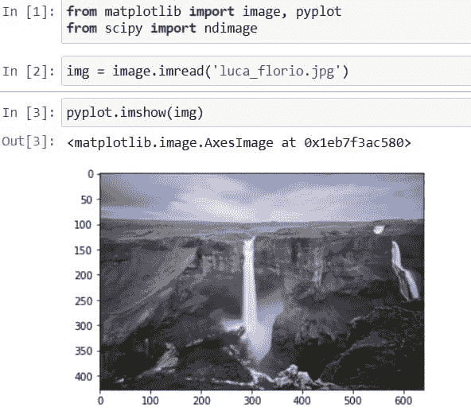
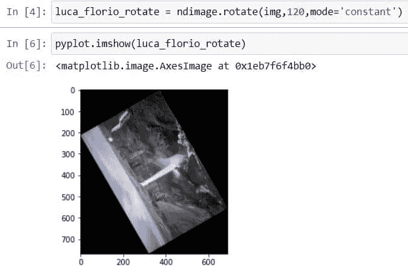
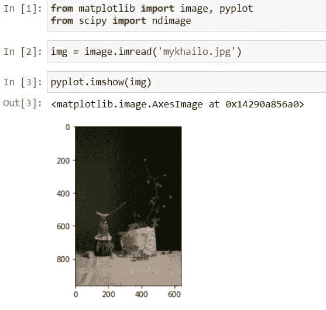
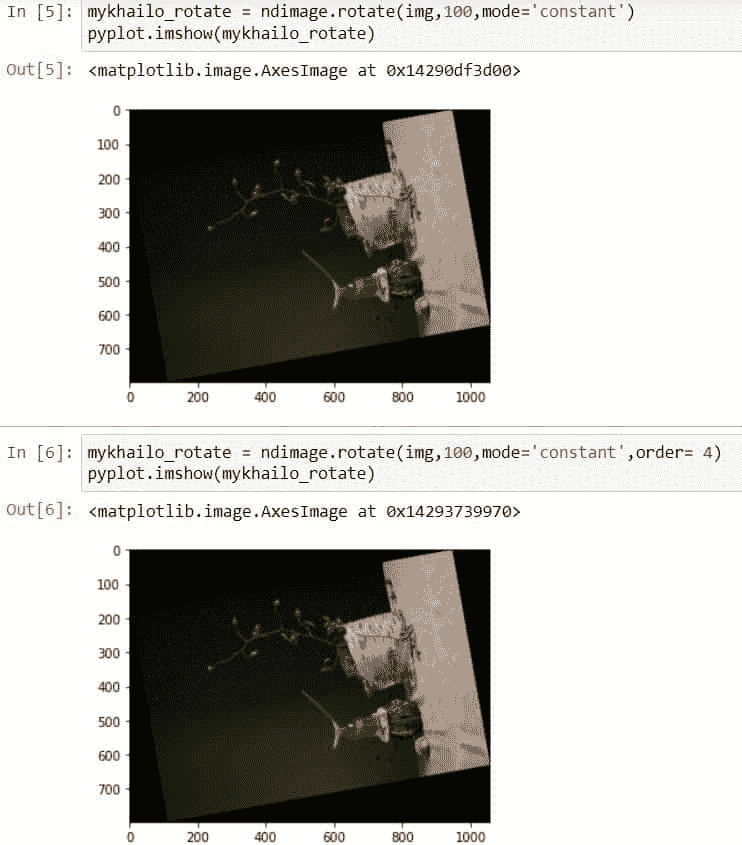
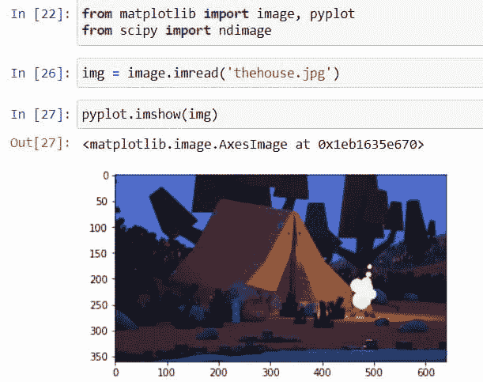
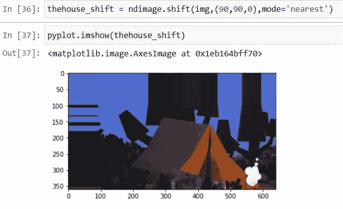
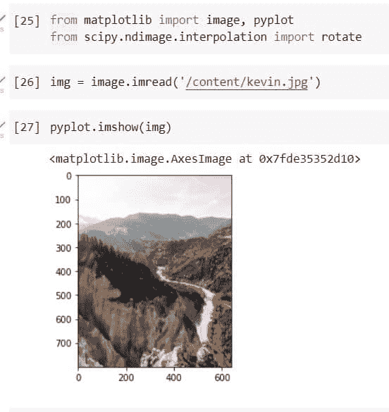
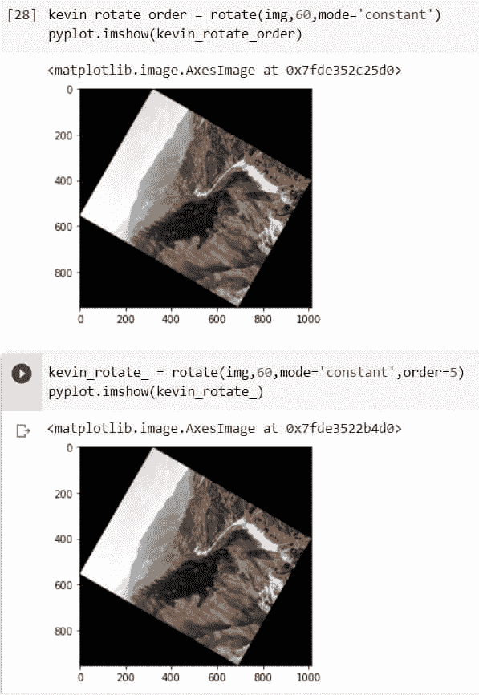
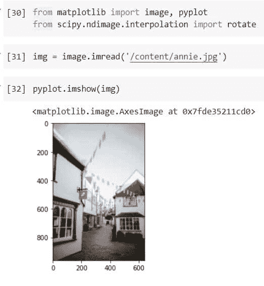
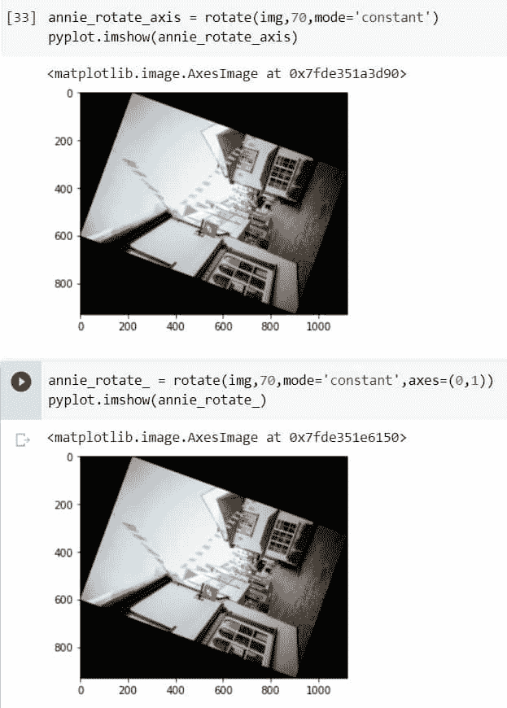

# Scipy Ndimage Rotate

> 原文：<https://pythonguides.com/scipy-ndimage-rotate/>

[](https://sharepointsky.teachable.com/p/python-and-machine-learning-training-course)

在这个 [Python 教程](https://pythonguides.com/learn-python/)中，我们将学习“ **Scipy ndimage rotate** ”，我们将使用服务器参数(如轴、顺序等)以不同的角度旋转图像。并涵盖以下主题。

*   Scipy ndimage rotate
*   Scipy ndimage 旋转顺序
*   Scipy ndimage 移位示例
*   Scipy ndimage 旋转插值旋转顺序
*   旋转插值旋转轴

另外，查看 Python SciPy 的最新教程: [Python Scipy 的数组导数](https://pythonguides.com/python-scipy-derivative-of-array/)

目录

[](#)

*   [Scipy ndimage rotate](#Scipy_ndimage_rotate "Scipy ndimage rotate")
*   [Scipy ndimage 旋转顺序](#Scipy_ndimage_rotate_order "Scipy ndimage rotate order")
*   [Scipy n image shift 示例](#Scipy_ndimage_shift_example "Scipy ndimage shift example")
*   [Scipy ndimage 旋转插值旋转命令](#Scipy_ndimage_rotate_interpolation_rotate_order "Scipy ndimage rotate interpolation rotate order")
*   [Scipy ndimage 旋转插补旋转轴](#Scipy_ndimage_rotate_interpolation_rotate_axis "Scipy ndimage rotate interpolation rotate axis")

## Scipy ndimage rotate

[Python Scipy](https://pythonguides.com/what-is-scipy-in-python/) 有一个模块`***scipy.ndimage***`来操纵图像或执行图像处理操作，这个模块有几种方法来处理图像处理任务。这里我们将使用其中一种方法`***rotate()***`来以指定的角度旋转给定的图像。

下面给出了方法`***scipy.ndimage.rotate()***`的语法。

```py
scipy.ndimage.rotate(input, angle, axes=(1, 0), reshape=True, output=None, mode='constant')
```

以下是方法`roatate()`最常用的参数。

*   ***input(array _ data):***就是我们要旋转的输入数组或者图像。
*   ***角度(浮点):*** 用于指定旋转角度，如 20 度或 90 度。
*   ***轴(元组中的两个整数):*** 旋转的平面由两个轴定义。
*   ***输出(数据类型或数组):*** 定义返回数组的数据类型，默认返回数组的数据类型与输入数组相同。
*   ***模式:*** 用于指定`***‘constant’, ‘mirror’, ‘wrap’, ‘reflect’, ‘nearest’***`的模式。

让我们按照以下步骤通过一个示例来理解:

使用下面的代码导入所需的库，如`matplotlib`和`scipy`。

```py
from matplotlib import image, pyplot
from scipy import ndimage
```

使用下面的代码从目录或者你的计算机上存在的任何地方加载图像。

```py
img = image.imread('luca_florio.jpg')
```

这里，模块`***image***`的函数`***imread()***`以像素阵列的形式读取图像。

使用模块`***pyplot***`的功能`***imshow()***`查看加载的图像，如下所示。

```py
pyplot.imshow(img)
```



Scipy ndimage rotate example

让我们使用下面的代码将上面加载的图像旋转到某个角度。

```py
luca_florio_rotate = ndimage.rotate(img,120,mode='constant')
```

在上面的代码中，我们使用 Python Scipy 的模块`***ndimage***`的函数`***rotate()***`来旋转图像。还提供了一些参数，如我们想要旋转的图像 img，120 度的旋转角度，以及模式为`***constant***`。

现在使用下面的代码查看旋转了 120 度的图像。

```py
pyplot.imshow(luca_florio_rotate)
```



Scipy ndimage rotate

看看上面的输出，看看我们是如何将图像旋转到 120 度的。

阅读: [Scipy 卷积器](https://pythonguides.com/scipy-convolve/)

## Scipy ndimage 旋转顺序

在这里，我们将使用相同的方法`***rotate()***`以指定的角度旋转给定的图像，我们已经在上面的小节中学习过。

下面给出了方法`***scipy.ndimage.rotate()***`的语法。

```py
scipy.ndimage.rotate(input, angle, axes=(1, 0), reshape=True, output=None, mode='constant')
```

以下是方法`roatate()`最常用的参数。

*   ***input(array _ data):***就是我们要旋转的输入数组或者图像。
*   ***角度(浮点):*** 用于指定旋转角度，如 20 度或 90 度。
*   ***轴(元组中的两个整数):*** 旋转的平面由两个轴定义。
*   ***输出(数据类型或数组):*** 定义返回数组的数据类型，默认返回数组的数据类型与输入数组相同。
*   ***模式:*** 用于指定`***‘constant’, ‘mirror’, ‘wrap’, ‘reflect’, ‘nearest’***`的模式。

让我们按照以下步骤通过一个示例来理解:

使用下面的代码导入所需的库，如`matplotlib`和`scipy`。

```py
from matplotlib import image, pyplot
from scipy import ndimage
```

使用下面的代码从目录或者你的计算机上存在的任何地方加载图像。

```py
img = image.imread('luca_florio.jpg')
```

这里，模块`***image***`的函数`***imread()***`以像素阵列的形式读取图像。

使用模块`***pyplot***`的功能`***imshow()***`查看加载的图像，如下所示。

```py
pyplot.imshow(img)
```



Scipy ndimage rotate order example

使用下面的代码在默认的顺序参数值上旋转图像。

```py
mykhailo_rotate = ndimage.rotate(img,100,mode='constant')
pyplot.imshow(mykhailo_rotate)
```

通过使用下面的代码将 order 参数值指定为 4，再次旋转同一个图像。

```py
mykhailo_rotate = ndimage.rotate(img,100,mode='constant',order= 4)
pyplot.imshow(mykhailo_rotate)
```



Scipy ndimage rotate order

这就是如何通过指定方法`***rotate()***`的顺序参数来旋转图像。

阅读:[科学常数](https://pythonguides.com/scipy-constants/)

## Scipy n image shift 示例

Python Scipy 子模块`***scipy.ndimage***`有一个方法`***shift()***`使用样条插值来移动图像数组。

下面给出了语法。

```py
scipy.ndimage.shift(input, shift, output=None mode='constant')
```

其中参数为:

*   ***input(array _ data):***就是我们要移位的输入数组或者图像。
*   ***shift(顺序或浮动):*** 用于指定图像移动的位置(轴)。
*   ***输出(数据类型或数组):*** 定义返回数组的数据类型，默认返回数组的数据类型与输入数组相同。
*   ***模式:*** 用于指定`***‘constant’, ‘mirror’, ‘wrap’, ‘reflect’, ‘nearest’***`的模式。

让我们通过以下步骤来了解如何移动图像:

使用下面的代码导入所需的库，如`matplotlib`和`scipy`。

```py
from matplotlib import image, pyplot
from scipy import ndimage
```

使用下面的代码从目录或者你的计算机上存在的任何地方加载图像。

```py
img = image.imread('thehouse.jpg')
pyplot.imshow(img)
```



Scipy ndimage shift example

让我们使用方法`shift()`将图像移动到不同的位置。

```py
thehouse_shift = ndimage.shift(img,(90,90,0),mode='nearest')
```

在上面的代码中，我们使用 Python Scipy 的模块`***ndimage***`的函数`***shift()***`来移动图像。还提供了一些参数，如我们想要移动的图像 img，使用颜色通道移动图像的 x 和 y 位置为`(90,90,0)`，模式为`***nearest***`。

现在使用下面的代码来查看移动后的图像。

```py
pyplot.imshow(thehouse_shift)
```



Scipy ndimage shift

阅读: [Scipy 优化–实用指南](https://pythonguides.com/scipy-optimize/)

## Scipy ndimage 旋转插值旋转命令

Python Scipy 在模块`***scipy.ndimage.interpolation***`中有一个方法`***rotate()***`,用于以指定的角度旋转图像。它使用样条插值算法旋转图像，样条插值算法有助于调整图像大小或扭曲。

在这里，我们将看到通过改变样条插值的顺序对图像或提供的数组的影响。

下面给出了语法。

```py
scipy.ndimage.interpolation.rotate(input, axes=(1, 0), angle, output=None, reshape=True, order=2, cval=0.0, mode='constant', prefilter=True)
```

其中参数为:

*   ***input(array _ data):***就是我们要旋转的输入数组或者图像。
*   ***角度(浮点):*** 用于指定旋转角度，如 20 度或 90 度。
*   ***shape(布尔):*** 如果为真，则形状根据输入数组进行调整，否则，在为假的情况下它不根据输入数组进行调整。
*   ***轴(元组中的两个整数):*** 旋转的平面由两个轴定义。
*   order(int):用于指定样条插值顺序。
*   ***输出(数据类型或数组):*** 定义返回数组的数据类型，默认返回数组的数据类型与输入数组相同。
*   ***cval(标量):*** 如果模式被设置为`***constant***`，那么这些值被用于所提供的输入数组的外部边界。
*   ***模式:*** 用于指定`***‘constant’, ‘mirror’, ‘wrap’, ‘reflect’, ‘nearest’***`的模式。

方法`***rotate()***`返回输入数组旋转后的 ndarray。

在这里，我们将按照以下步骤举例:

使用下面的代码导入所需的库，如`matplotlib`和`scipy`。

```py
from matplotlib import image, pyplot
from scipy import ndimage
```

使用下面的代码从目录或者你的计算机上存在的任何地方加载图像。

```py
img = image.imread('https://i0.wp.com/pythonguides.com/content/kevin.jpg')
```

这里，模块`***image***`的函数`***imread()***`以像素阵列的形式读取图像。

使用模块`***pyplot***`的功能`***imshow()***`查看加载的图像，如下所示。

```py
pyplot.imshow(img)
```



Scipy ndimage rotate interpolation rotate order example

首先，使用下面的代码，以默认顺序 3 旋转图像。

```py
kevin_rotate_order = rotate(img,60,mode='constant')
pyplot.imshow(kevin_rotate_order)
```

现在为参数顺序提供一个新值 5，使用下面的代码看看效果。

```py
kevin_rotate_ = rotate(img,60,mode='constant',order=5)
pyplot.imshow(kevin_rotate_)
```



Scipy ndimage rotate interpolation rotate order

查看两幅图像，我们注意到图像的旋转和大小有一点变化。

阅读:[科学统计-完整指南](https://pythonguides.com/scipy-stats/)

## Scipy ndimage 旋转插补旋转轴

在这里，我们将使用模块`***scipy.ndimage.interpolation***`的 Python Scipy same 方法`***rotate()***`以指定的角度旋转图像，我们已经在上面的小节中学习过。这里我们将通过改变该方法的轴参数来旋转图像。

使用下面的代码导入所需的库`matplotlib`和`scipy`。

```py
from matplotlib import image, pyplot
from scipy import ndimage
```

使用下面的代码从目录或者你的计算机上存在的任何地方加载图像。

```py
img = image.imread('https://i0.wp.com/pythonguides.com/content/kevin.jpg')
```

这里，模块`***image***`的函数`***imread()***`以像素阵列的形式读取图像。

使用模块`***pyplot***`的功能`***imshow()***`查看加载的图像，如下所示。

```py
pyplot.imshow(img)
```



Scipy ndimage rotate interpolation rotate axis example

使用下面的代码，用默认的轴将上面的图像旋转一个角度。

```py
annie_rotate_axis = rotate(img,70,mode='constant')
pyplot.imshow(annie_rotate_axis)
```

现在，使用下面的代码，通过改变轴来旋转相同的图像到某个角度。

```py
annie_rotate_ = rotate(img,70,mode='constant',axes=(0,1))
pyplot.imshow(annie_rotate_)
```



Scipy ndimage rotate interpolation rotate axis

这就是如何通过改变轴参数来旋转图像。

另外，看看更多的 Python Scipy 教程。

*   [Scipy 旋转图像+示例](https://pythonguides.com/scipy-rotate-image/)
*   [Python Scipy Ndimage 缩放](https://pythonguides.com/python-scipy-ndimage-zoom/)
*   [Python Scipy 统计数据偏差](https://pythonguides.com/python-scipy-stats-skew/)
*   [Scipy Linalg–实用指南](https://pythonguides.com/scipy-linalg/)
*   [Scipy Stats–完整指南](https://pythonguides.com/scipy-stats/)
*   [Scipy Integrate +示例](https://pythonguides.com/scipy-integrate/)
*   [敏感信号——有用教程](https://pythonguides.com/scipy-signal/)
*   [Scipy 正态分布](https://pythonguides.com/scipy-normal-distribution/)

因此，在本教程中，我们学习了" **Scipy ndimage rotate** "并涵盖了以下主题。

*   Scipy ndimage rotate
*   Scipy ndimage 旋转顺序
*   Scipy ndimage 移位示例
*   Scipy ndimage 旋转插值旋转顺序
*   旋转插值旋转轴

[Bijay Kumar](https://pythonguides.com/author/fewlines4biju/)

Python 是美国最流行的语言之一。我从事 Python 工作已经有很长时间了，我在与 Tkinter、Pandas、NumPy、Turtle、Django、Matplotlib、Tensorflow、Scipy、Scikit-Learn 等各种库合作方面拥有专业知识。我有与美国、加拿大、英国、澳大利亚、新西兰等国家的各种客户合作的经验。查看我的个人资料。

[enjoysharepoint.com/](https://enjoysharepoint.com/)[](https://www.facebook.com/fewlines4biju "Facebook")[](https://www.linkedin.com/in/fewlines4biju/ "Linkedin")[](https://twitter.com/fewlines4biju "Twitter")