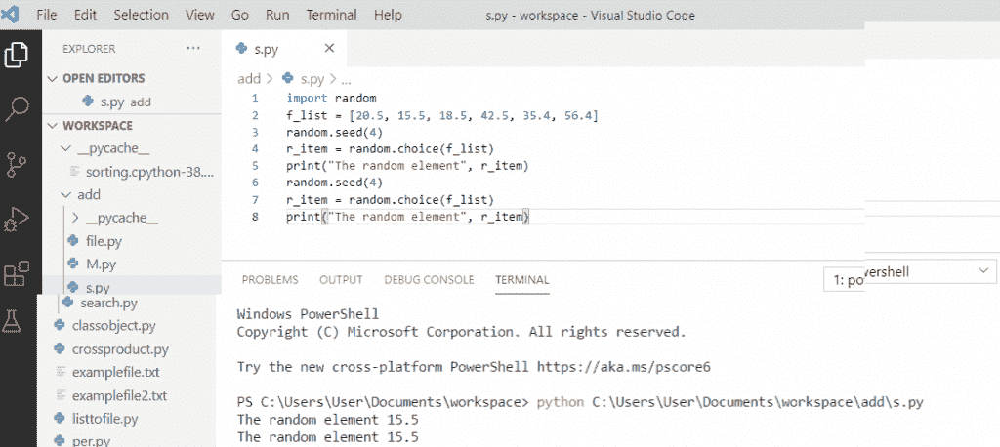

# Python 从列表中选择+示例

> 原文：<https://pythonguides.com/python-select-from-a-list/>

[](https://sharepointsky.teachable.com/p/python-and-machine-learning-training-course)

在这个 [python 教程](https://pythonguides.com/python-hello-world-program/)中，你将了解到 **python 的选择列表**。此外，我们将检查:

*   Python 从列表中选择
*   Python 从列表中随机选择
*   Python 从字典列表中选择
*   Python 从元组列表中选择值
*   Python 每次都会从列表中随机选择相同的元素
*   Python 以不同的概率从列表中选择
*   Python 使用 NumPy 以不同的概率从列表中选择元素
*   Python 从用户输入列表中选择

目录

[](#)

*   [Python 从列表中选择](#Python_select_from_the_list "Python select from the list")
*   [Python 从列表中随机选择](#Python_select_from_the_list_randomly "Python select from the list randomly")
*   [Python 从字典列表中选择](#Python_select_from_list_of_dictionaries "Python select from list of dictionaries")
*   [Python 从元组列表中选择值](#Python_select_value_from_list_of_tuples "Python select value from list of tuples")
*   [Python 每次都会从列表中随机选择相同的元素](#Python_randomly_selects_the_same_element_from_the_list_every_time "Python randomly selects the same element from the list every time")
*   [Python 从列表中选择概率](#Python_select_from_list_with_probability "Python select from list with probability")
*   [Python 使用 NumPy 从不同概率的列表中选择元素](#Python_select_element_from_list_with_different_probability_using_NumPy "Python select element from list with different probability using NumPy")

## Python 从列表中选择

*   为了从 [Python 列表](https://pythonguides.com/python-list-methods/)中选择元素，我们将使用 **list.append()** 。
*   我们将创建一个要访问的索引列表，循环用于遍历这个索引列表来访问指定的元素。
*   然后我们使用索引将这些元素添加到新列表中。

```py
my_list = [10, 11, 12, 13, 14]
i = [1, 4]
element = []
for index in i:
    element.append(my_list[index])
print(element)
```

在这个输出中，我们可以看到列表中指定的索引元素已经给出，我们将在新列表中获得相应的值。

可以参考下面截图**Python select from list**。


Python select from the list

阅读[如何用 Python 从列表中获取唯一值](https://pythonguides.com/get-unique-values-from-list-python/)

## Python 从列表中随机选择

为了从 [Python 列表](https://pythonguides.com/create-list-in-python/)中随机选择，我们有**内置模块** **random** ，用于处理列表中的随机数据。 **sample()** 是随机模块的内置方法，用于随机选择。

**举例:**

```py
import random
my_list = [10, 20, 30, 40, 50]
u_list = random.sample(my_list, 3)
print(u_list)
```

写完上面的代码后，一旦打印出 **" u_list "** ，那么输出将显示为 **"[50，10，40]"** ，这是列表中的随机值。

可以参考下面截图 **python 从列表中随机选择**。


Python select from the list randomly

## Python 从字典列表中选择

在 Python 中，有时我们必须**从字典列表**中选择值，并且我们需要初始化一个 [Python 字典列表](https://pythonguides.com/create-a-dictionary-in-python/)。list comprehension 用于根据条件从字典列表中选择值。

**举例:**

```py
my_list = [{'x':2, 'y':4, 'z':8}, {'x':5, 'y':8, 'z':18},
            {'x':48, 'y':5, 'z':15}, {'x':12, 'y':21, 'z':2}]
print ("n_list", str(my_list))
s = [d for d in my_list if d['z'] > 12]
print ("selected_ele", str(s))
```

写完上面的代码后，一旦你打印了 **" str(s) "** ，那么输出将显示为 **"selected_ele [{'x': 5，' y': 8，' z':18}，{'x':48，' y':5，' z':15}]** ，它返回从字典列表中选择的元素。

可以参考下面截图 **Python 从字典列表中选择**。


Python select from list of dictionaries

阅读: [Python NumPy linspace +示例](https://pythonguides.com/python-numpy-linspace/)

## Python 从元组列表中选择值

从 Python 中的[元组列表中选择一个值，我们必须使用**列表理解**和 **for** **循环**根据条件得到匹配模式。](https://pythonguides.com/create-a-tuple-in-python/)

**举例:**

```py
my_list = [(12,5),(16,6),(23,12),(30,15)]
s = [money for (money,id) in my_list if id == 15]
print(s)
```

写完上面的代码后，一旦打印出 **"s"** ，那么输出将显示为 **" [30] "** 。这里，循环的**用于根据给定条件从元组列表中获取值。**

可以参考下面的截图 **Python 从元组列表中选择值**。


Python select value from list of tuples

## Python 每次都会从列表中随机选择相同的元素

从列表中随机选择相同的元素是可能的。因此，我们有了 **random.seed()** 和 **random.choice()** 函数，它们每次都会提供相同的元素。

**举例:**

```py
import random 
f_list = [20.5\. 15.5, 18.5, 42.5, 35.4, 56.4]
random.seed(4)
r_item = random.choice(f_list)
print("The random element", r_item)
random.seed(4)
r_item = random.choice(f_list)
print("The random element", r_item)
```

在这个输出中，我们可以看到，每次都使用初始化随机数生成器的 **random.seed()** 从列表中随机选择相同的元素。

你可以参考下面的截图，python 每次都会从列表中随机选择相同的元素。



Python randomly selects the same element from the list every time

## Python 从列表中选择概率

为了从概率列表中进行选择，我们使用了 **random.choice()** 方法。它将从给定列表中返回任意随机值。

**举例:**

```py
import random
my_list = [10, 20, 30, 40, 50]
r = random.choice(my_list)
print(r)
```

写完上面的代码后，一旦你打印出 **" r "** ，那么输出将显示为 **" 10 "。**这里使用了 **random.choice()** ，它将从列表中以概率选择随机元素。

您可以参考下面 python 从列表中选择的概率截图。


Python select from list with probability

阅读: [Python NumPy concatenate](https://pythonguides.com/python-numpy-concatenate/)

## Python 使用 NumPy 从不同概率的列表中选择元素

为了从列表中选择一个元素，我们必须**导入 numpy** ，然后我们将创建一个列表。此外，我们将使用 **numpy.random.choice()** 方法从列表中选择具有不同概率的元素。

**举例:**

```py
import numpy as np
n_list = [51, 52, 53, 54, 55]
num = np.random.choice(n_list)
print(num)
```

写完上面的代码后，一旦你打印出 **"num"** ，那么输出将显示为 **" 53 "** 。这里， **np.random.choice(n_list)** 用于从列表中选择具有不同概率的元素。

你可以参考下面的截图 python 使用 NumPy 从不同概率的列表中选择元素


Python select element from list with different probability using NumPy

您可能会喜欢以下教程:

*   [Python 列表理解λ](https://pythonguides.com/python-list-comprehension/)
*   [将字符串追加到列表 Python 的开头](https://pythonguides.com/append-string-to-beginning-of-list-python/)
*   [Python 中的链表](https://pythonguides.com/linked-lists-in-python/)
*   [Python 将列表写入文件，并附有示例](https://pythonguides.com/python-write-list-to-file/)
*   [Python 类型错误:“列表”对象不可调用](https://pythonguides.com/python-typeerror-list-object-is-not-callable/)
*   [Python 将元组转换为列表](https://pythonguides.com/python-convert-tuple-to-list/)
*   [在 Python 中检查列表是否为空](https://pythonguides.com/check-if-a-list-is-empty-in-python/)
*   [Python 元组排序列表](https://pythonguides.com/python-sort-list-of-tuples/)

在本 python 教程中，我们学习了从列表中选择的 Python。此外，我们还讨论了以下主题:

*   Python 从列表中选择
*   Python 从列表中随机选择
*   Python 从字典列表中选择
*   Python 从元组列表中选择值
*   Python 每次都会从列表中随机选择相同的元素
*   Python 以不同的概率从列表中选择
*   Python 使用 NumPy 以不同的概率从列表中选择元素
*   Python 从用户输入列表中选择

[Bijay Kumar](https://pythonguides.com/author/fewlines4biju/)

Python 是美国最流行的语言之一。我从事 Python 工作已经有很长时间了，我在与 Tkinter、Pandas、NumPy、Turtle、Django、Matplotlib、Tensorflow、Scipy、Scikit-Learn 等各种库合作方面拥有专业知识。我有与美国、加拿大、英国、澳大利亚、新西兰等国家的各种客户合作的经验。查看我的个人资料。

[enjoysharepoint.com/](https://enjoysharepoint.com/)[](https://www.facebook.com/fewlines4biju "Facebook")[](https://www.linkedin.com/in/fewlines4biju/ "Linkedin")[](https://twitter.com/fewlines4biju "Twitter")