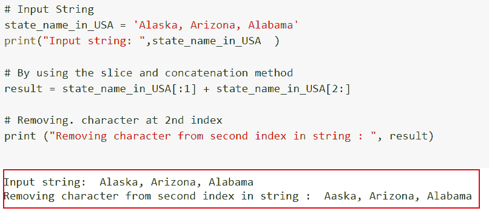
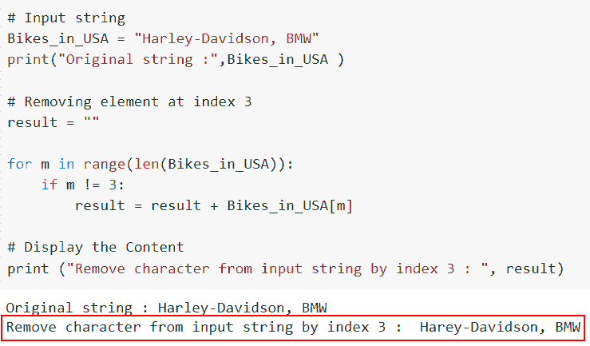
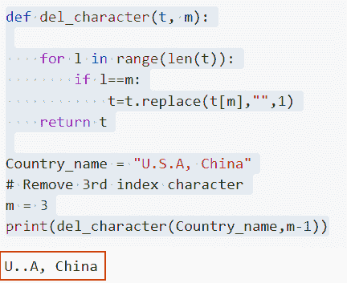
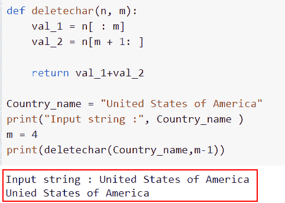
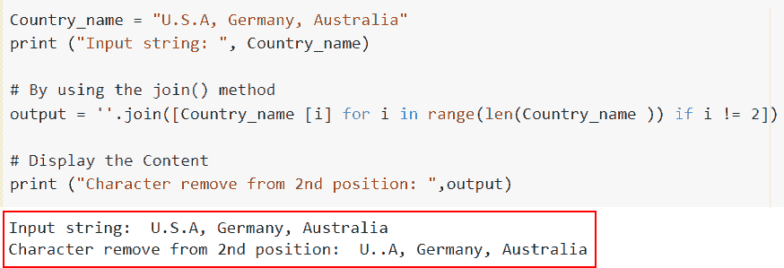

# 通过索引从 Python 字符串中移除字符

> 原文：<https://pythonguides.com/remove-character-from-python-string-through-index/>

[](https://sharepointsky.teachable.com/p/python-and-machine-learning-training-course)

在这里，我们将讨论**如何以不同的方式通过索引从 Python** 的字符串中删除一个字符，并讨论一些可以使用 [Python](https://pythonguides.com/python-hello-world-program/) 来执行它们的方法。以下是我们将要讨论的主题

*   如何使用切片和连接方法通过索引从 Python 字符串中移除字符
*   如何使用 native 方法通过索引从 Python 字符串中移除字符
*   如何使用 replace 方法通过索引从 Python 字符串中移除字符
*   如何使用拆分方法通过索引从 Python 字符串中移除字符
*   如何使用连接和列表理解方法通过索引从 Python 字符串中移除字符

目录

[](#)

*   [如何使用切片和拼接方法通过索引从 Python 字符串中删除字符](#How_to_remove_a_character_from_a_Python_string_through_index_by_using_the_slice_and_concatenation_method "How to remove a character from a Python string through index by using the slice and concatenation method")
*   [如何使用 native 方法通过 index 从 Python 字符串中删除字符](#How_to_remove_a_character_from_a_Python_string_through_index_by_using_the_native_method "How to remove a character from a Python string through index by using the native method")
*   [如何使用替换方法通过索引从 Python 字符串中删除字符](#How_to_remove_a_character_from_a_Python_string_through_index_by_using_the_replace_method "How to remove a character from a Python string through index by using the replace method")
*   [如何使用拆分方法通过索引从 Python 字符串中删除字符](#How_to_remove_a_character_from_a_Python_string_through_index_by_using_the_splitting_method "How to remove a character from a Python string through index by using the splitting method")
*   [如何使用连接和列表理解方法通过索引从 Python 字符串中删除字符](#How_to_remove_a_character_from_a_Python_string_through_index_by_using_the_join_and_list_comprehension_method "How to remove a character from a Python string through index by using the join and list comprehension method")

## 如何使用切片和拼接方法通过索引从 Python 字符串中删除字符

*   在这个例子中，我们将讨论如何使用 Python 中的切片和连接方法通过索引从字符串中删除字符。
*   要从元素集合中提取一部分元素，使用 Python 中的 ***slice()*** 方法。
*   通过指定索引，用户可以访问特定范围的元素。使用弦切片，可以修剪位置 I 之前和位置 I 之后的弦
*   此外，您可以连接两个或多个字符串。字符串串联是使用运算符或函数来组合两个或更多字符串的过程。通过使用+运算符，我们将连接两个字符串。

**举例**:

让我们举一个例子，看看如何通过使用切片和连接方法，通过索引从 Python 字符串中删除一个字符。

**源代码**:

```py
**# Input String**
state_name_in_USA = 'Alaska, Arizona, Alabama'
print("Input string: ",state_name_in_USA  )
 **# By using the slice and concatenation method** result = state_name_in_USA[:1] + state_name_in_USA[2:]
 **# Removing. character at 2nd index**
print ("Removing character from second index in string : ", result)
```

下面是以下给定代码的实现。



How to remove a character from a Python string through index by using the slice and concatenation method

这就是我们如何使用切片和连接方法通过索引从 Python 字符串中删除字符。

阅读:[如何在 Python 中修剪字符串](https://pythonguides.com/trim-a-string-in-python/)

## 如何使用 native 方法通过 index 从 Python 字符串中删除字符

*   在本节中，我们将讨论如何使用 Python 中的 native 方法通过索引从 Python 字符串中移除字符。
*   这里我们将使用 for 循环的概念，在出现字符时追加字符，并在索引为 I 时从初始 for 实例创建一个新字符串。

**举例**:

```py
**# Input string**
Bikes_in_USA = "Harley-Davidson, BMW"
print("Original string :",Bikes_in_USA )

**# Removing element at index 3**
result = ""

for m in range(len(Bikes_in_USA)):
    if m != 3:
        result = result + Bikes_in_USA[m]

**# Display the Content**
print ("Remove character from input string by index 3 : ", result)
```

在下面给出的代码中，我们创建了一个名为 **'Bikes_in_USA'** 的输入字符串，然后创建一个空字符串来存储新的结果。接下来，我们使用 for 循环并迭代这些值。

你可以参考下面的截图。



How to remove a character from a Python string through index by using the native method

正如你在截图中看到的，我们已经通过索引使用 native 方法从 Python 字符串中删除了一个字符。

阅读:[Python 中如何在数字前加零](https://pythonguides.com/add-zeros-before-a-number-in-python/)

## 如何使用替换方法通过索引从 Python 字符串中删除字符

*   在本节中，我们将了解如何使用 **replace()** 方法通过 Python 中的索引从字符串中删除字符。
*   在 Python 中用新字符替换单个字符时，使用 **replace()** 方法，通过该方法，我们将替换作为(")提供的空子串的 I 索引处的字符。
*   在这个例子中，如果我们想从字符串中删除字符，那么我们必须提到索引号。

**语法**:

让我们看一下语法并理解 Python 中的 **str.replace()** 方法的工作原理。

```py
str.replace(old,  new, count)
```

*   它由几个参数组成
    *   **old** :-该参数定义了将要被替换的字符串。
    *   **new** :用新值(一个字符或字符串)替换现有值。
    *   **count** :-一个整数值，表示要用新字符或子串替换多少个旧字符或子串。这是一个可选参数。

**举例**:

让我们举一个例子，看看如何使用 replace 方法通过索引从 Python 字符串中删除一个字符

**源代码**:

```py
def del_character(t, m):

    for l in range(len(t)):
        if l==m:
            t=t.replace(t[m],"",1)
    return t

Country_name = "U.S.A, China"
**# Remove 3rd index character**
m = 3
print(del_character(Country_name,m-1))
```

在上面的代码中，我们首先定义了一个函数，它接受一个字符串和一个索引，然后移除该索引处的字符。接下来，我们执行从 **0** 到输入字符串长度的循环，并检查当前迭代是否等于索引 **i** 。如果被识别，替换索引 I 处的字符的空字符串。

你可以参考下面的截图



How to remove a character from a Python string through index by using the replace method

在这个例子中，我们已经理解了如何使用 replace 方法通过索引从 Python 字符串中删除字符。

阅读:

阅读:[Python 中如何在数字前加零](https://pythonguides.com/add-zeros-before-a-number-in-python/)

## 如何使用拆分方法通过索引从 Python 字符串中删除字符

*   在这种方法中，字符串将被分成两半，一个在索引 I 之前，另一个在索引 I 之后。不包含第 I 个字符的字符串可以通过组合这两个字符串来生成。
*   我们将使用切片的概念来分割字符串。当我们为一个字符串指定开始和结束索引时，我们可以把它分割成更小的条目。
*   通过使用切片 **[i:]** 我们将获得除了所选字符之外的剩余字符串。

**举例**:

让我们举一个例子，看看如何使用 Python 中的 splitting 方法，通过索引从 Python 字符串中删除一个字符。

**源代码**:

```py
def deletechar(n, m):
    val_1 = n[ : m]
    val_2 = n[m + 1: ]

    return val_1+val_2

Country_name = "United States of America"
print("Input string :", Country_name )
m = 4
print(deletechar(Country_name,m-1))
```

该字符串被分成两个子字符串，每个子字符串存储在一个单独的变量中。然后使用连接操作符 **(+)** 将两个子字符串连接起来。接下来，我们必须传递给 **m-1** 给定函数中的索引。

下面是以下给定代码的执行。



How to remove a character from a Python string through index by using the splitting method

这就是如何使用 Python 中的 splitting 方法通过索引从 Python 字符串中删除字符。

阅读:[二分搜索法的 Python 程序](https://pythonguides.com/python-program-for-binary-search/)

## 如何使用连接和列表理解方法通过索引从 Python 字符串中删除字符

*   在这一节中，我们将讨论如何使用列表理解和 **join()** 方法通过索引从字符串中删除字符。
*   使用 Python 中的 **join()** 方法将一个字符串和一个 iterable 对象连接起来。它返回一个产品字符串，该字符串组合了 iterable 中的所有字符串。
*   通过使用 list comprehension 和 join 方法，我们可以很容易地将每个 string 元素拆分成相关的 list 元素，然后将它们连接起来以声明一个新的 string。
*   在这种方法中，首先将每个字符串元素转换成一个列表元素，然后将它们中的每一个组合起来，创建一个除给定索引之外的字符串。

**举例**:

这里我们将举一个例子，了解如何通过使用 list comprehension 和 **join()** 方法，通过索引从字符串中删除字符。

**源代码**:

```py
Country_name = "U.S.A, Germany, Australia"
print ("Input string: ", Country_name)

**# By using the join() method** 
output = ''.join([Country_name [i] for i in range(len(Country_name )) if i != 2]) 

 **# Display the Content** 
print ("Character remove from 2nd position: ",output) 
```

在上面的代码中，我们首先创建了一个名为**“Country _ name”**的输入字符串，并在其中为它分配了国家名称。接下来，我们使用了 **join()** 方法并用一个设定的条件迭代这些值，如果 **i！=2** ，在本例中，I 表示索引号。

下面是以下代码的截图



How to remove a character from a Python string through index by using the join and list comprehension method

您可能也喜欢阅读以下 Python 教程。

*   [删除 Python 中字符串的最后一个字符](https://pythonguides.com/remove-the-last-character-from-a-string-in-python/)
*   [如何用 Python 将列表追加到另一个列表中](https://pythonguides.com/python-append-list-to-another-list/)
*   [如何在 Python 中将集合转换成列表](https://pythonguides.com/convert-a-set-to-a-list-in-python/)
*   [如何在 Python 中寻找完全数](https://pythonguides.com/perfect-number-in-python/)
*   [如何在 Python 中使用 For 循环对列表中的元素求和](https://pythonguides.com/sum-elements-in-list-in-python-using-for-loop/)

在本文中，我们讨论了如何以不同的方式通过索引从 Python 的字符串中删除**字符，并讨论了一些可以使用 Python 来执行它们的方法。**

*   如何使用切片和连接方法通过索引从 Python 字符串中移除字符
*   如何使用 native 方法通过索引从 Python 字符串中移除字符
*   如何使用 replace 方法通过索引从 Python 字符串中移除字符
*   如何使用拆分方法通过索引从 Python 字符串中移除字符
*   如何使用连接和列表理解方法通过索引从 Python 字符串中移除字符

[Arvind](https://pythonguides.com/author/arvind/)

Arvind 目前是 TSInfo Technologies 的高级 Python 开发人员。他精通 Python 库，如 NumPy 和 Tensorflow。