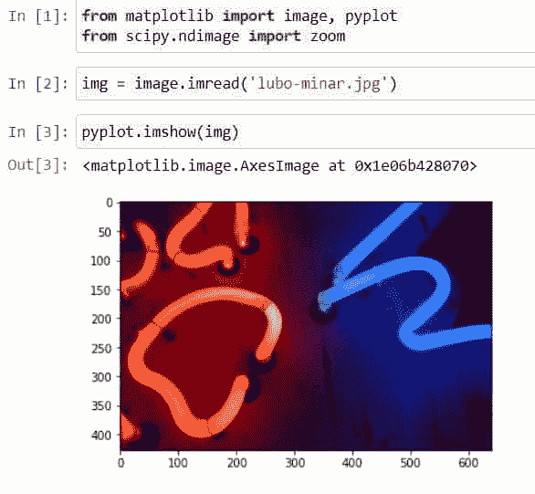
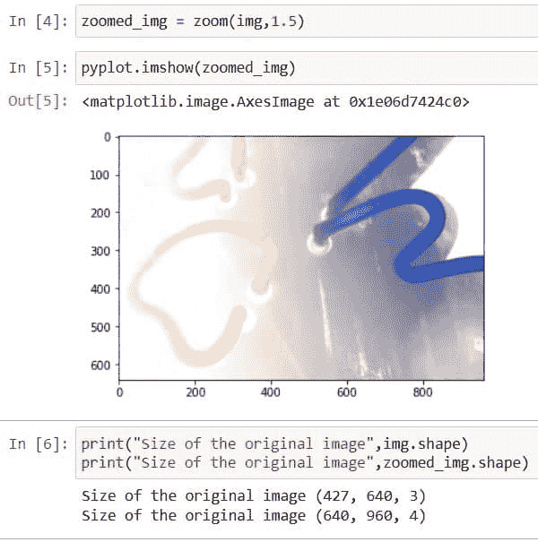
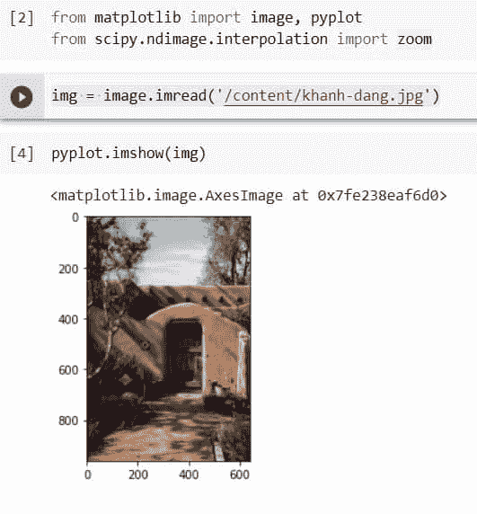
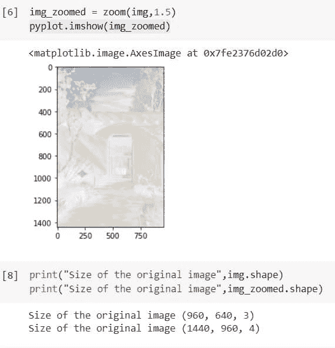
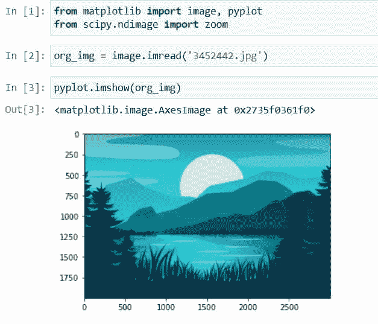
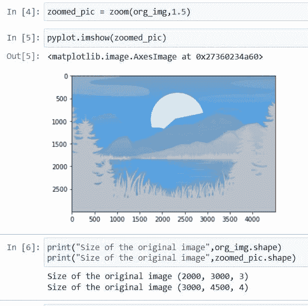
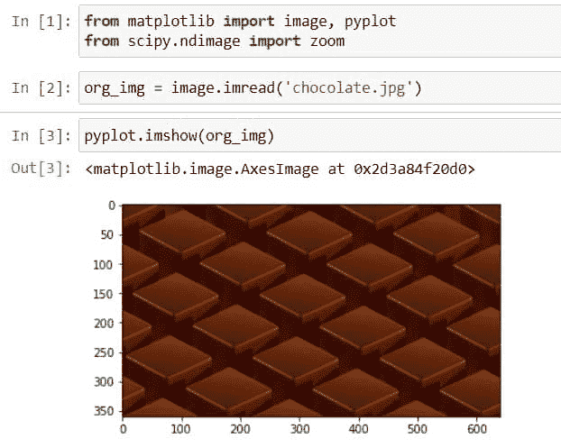
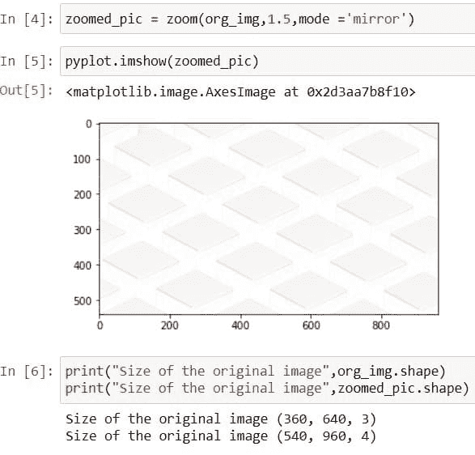
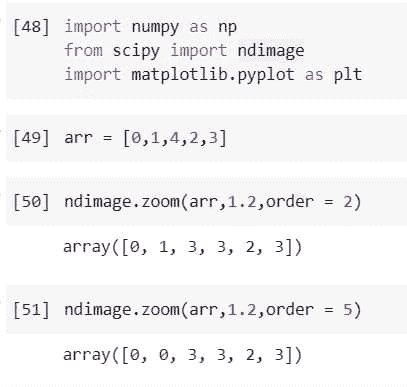
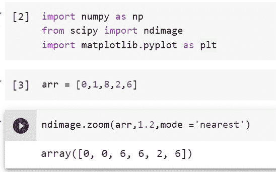

# Python Scipy Ndimage Zoom 示例

> 原文：<https://pythonguides.com/python-scipy-ndimage-zoom/>

[](https://sharepointsky.teachable.com/p/python-and-machine-learning-training-course)

在本 Python Scipy 教程中，我们将了解" **Python Scipy Ndimage Zoom** "并涵盖以下主题。

*   Python Scipy Ndimage Zoom
*   Python Scipy Ndimage 慢
*   Python Scipy 图像顺序
*   Python Scipy Ndimage 模式
*   Python Scipy Ndimage 插值
*   Python Scipy Ndimage 示例
*   Python Scipy Ndimage 插值缩放最近

目录

[](#)

*   [Python Scipy Ndimage 缩放](#Python_Scipy_Ndimage_Zoom "Python Scipy Ndimage Zoom")
*   [Python Scipy n image 插值](#Python_Scipy_Ndimage_interpolation "Python Scipy Ndimage interpolation")
*   [Python Scipy Ndimage 示例](#Python_Scipy_Ndimage_example "Python Scipy Ndimage example")
*   [Python Scipy Ndimage mode](#Python_Scipy_Ndimage_mode "Python Scipy Ndimage mode")
*   [Python Scipy Ndimage 顺序](#Python_Scipy_Ndimage_order "Python Scipy Ndimage order")
*   [Python Scipy Ndimage 插值缩放最近的](#Python_Scipy_Ndimage_Interpolation_Zoom_Nearest "Python Scipy Ndimage Interpolation Zoom Nearest")

## Python Scipy Ndimage 缩放

Python SciPy 在模块`***scipy.ndimage***`中有一个方法`***zoom()***`,它使用所请求顺序的样条插值来缩放数组。

下面给出了语法。

```py
scipy.ndimage.zoom(input, zoom, order=2, output=None, mode='wrap', prefilter=False, cval=0.1, grid_mode=True)
```

其中参数为:

*   ***输入(array_data):*** 输入的数组。
*   ***缩放(序列或浮动):*** 沿坐标轴，缩放因子。使用浮动时，每个轴的缩放是相同的。如果您使用的是序列，缩放应该每个轴只有一个值。
*   ***output(dtype 或 array):*** 返回数组的 dtype，或者要插入输出的数组。默认情况下，使用与输入相同的 dtype 构建数组。
*   ***顺序(int):*** 样条插值顺序，默认设置为 3。顺序必须介于 0 和 5 之间。
*   ***模式:*** 模式参数控制输入数组如何扩展到其界限之外。默认值为“常量”。它支持以下模式。
    *   栅格镜
    *   显示
    *   网格常数
    *   常数
    *   包
    *   最近的
    *   网格环绕
    *   镜子
*   ***cval(标量):*** 如果模式为“常量”，该值用于填充输入边之间的间隙。0 是默认值。
*   ***预过滤(布尔):*** 如果在插值前使用样条过滤器对输入数组进行预过滤，则该值为真。如果顺序大于 1，则默认值为 True，这将创建一个临时 float64 筛选值数组。如果 order > 1，如果设置为 False，输出将明显模糊，除非输入经过预滤波，在这种情况下，它是对原始输入运行样条滤波器的结果。
*   ***grid-mode(boolean):***为 False 时，像素中心之间的空间被放大。否则，使用全像素范围距离。当网格模式为假时，5d 信号被认为是 4d，但当网格模式为真时，5d 信号被认为是 4d。

方法`***zoom()***`返回 ndarray 类型的 ***`zoom`*** (缩放后的输入)。

让我们以下面的步骤为例:

使用下面的 python 代码导入所需的库。

```py
from matplotlib import image, pyplot
from scipy.ndimage import zoom
```

使用模块`***image***`的方法`***imread()***`读取图像，并将图像的位置传递给方法。

```py
img = image.imread('lubo-minar.jpg')
```

使用下面的代码查看图像。

```py
pyplot.imshow(img)
```



Python Scipy Ndimage Zoom example

现在将图像传递给模块`***ndimage***`的方法`***zoom()***`，使用下面的代码缩放图像。

```py
zoomed_img = zoom(img,1.5)
```

在上面的代码中，我们为方法`zoom()`提供了缩放因子等于 1.5 的图像。

使用下面的代码查看缩放的图像。

```py
pyplot.imshow(zoomed_img)
```

同时使用下面的代码检查图像的大小，原始的和缩放的。

```py
print("Size of the original image",img.shape)
print("Size of the original image",zoomed_img.shape)
```



Python Scipy Ndimage Zoom

这就是如何使用 Python SciPy 的方法`zoom()`。

阅读 [Python Scipy 两两距离](https://pythonguides.com/python-scipy-pairwise-distance/)

## Python Scipy n image 插值

Python SciPy 在模块`***scipy.interpolatin***`中有一个方法`***zoom()***`,它使用所请求顺序的样条插值来缩放数组。请注意，模块`***scipy.interpolation.zoom***`已折旧，请使用模块`***scipy.ndimage.zoom***`代替。

下面给出了语法。

```py
scipy.interpolatin.zoom(input, zoom, order=2, output=None, mode='wrap', prefilter=False, cval=0.1, grid_mode=True)
```

其中参数为:

*   ***输入(array_data):*** 输入的数组。
*   ***缩放(序列或浮动):*** 沿坐标轴，缩放因子。使用浮动时，每个轴的缩放是相同的。如果您使用的是序列，缩放应该每个轴只有一个值。
*   ***output(dtype 或 array):*** 返回数组的 dtype，或者要插入输出的数组。默认情况下，使用与输入相同的 dtype 构建数组。
*   ***顺序(int):*** 样条插值顺序，默认设置为 3。顺序必须介于 0 和 5 之间。
*   ***模式:*** 模式参数控制输入数组如何扩展到其界限之外。默认值为“常量”。它支持以下模式:栅格镜像反射、栅格常数、常数、环绕、最近、栅格环绕和镜像。

*   ***cval(标量):*** 如果模式为“常量”，该值用于填充输入边之间的间隙。0 是默认值。
*   ***预过滤(布尔):*** 如果在插值前使用样条过滤器对输入数组进行预过滤，则该值为真。如果顺序大于 1，则默认值为 True，这将创建一个临时 float64 筛选值数组。如果 order > 1，如果设置为 False，输出将明显模糊，除非输入经过预滤波，在这种情况下，它是对原始输入运行样条滤波器的结果。
*   ***grid-mode(boolean):***为 False 时，像素中心之间的空间被放大。否则，使用全像素范围距离。当网格模式为假时，5d 信号被认为是 4d，但当网格模式为真时，5d 信号被认为是 4d。

方法`***zoom()***`返回 ndarray 类型的 ***`zoom`*** (缩放后的输入)。

让我们以下面的步骤为例:

使用下面的 python 代码导入所需的库。

```py
from matplotlib import image, pyplot
from scipy.ndimage.interpolation import zoom
```

使用模块`***image***`的方法`***imread()***`读取图像，并将图像的位置传递给方法。

```py
img = image.imread('https://i0.wp.com/pythonguides.com/content/khanh-dang.jpg')
```

使用下面的代码查看图像。

```py
pyplot.imshow(img)
```



Python Scipy Ndimage interpolation example

现在将图像传递给模块`***ndimage***`的方法`***zoom()***`，使用下面的代码缩放图像。

```py
img_zoomed = zoom(img,1.5)
```

在上面的代码中，我们为方法`zoom()`提供了缩放因子等于 1.5 的图像。

使用下面的代码查看缩放的图像。

```py
pyplot.imshow(img_zoomed)
```

同时使用下面的代码检查图像的大小，原始的和缩放的。



Python Scipy Ndimage interpolation example

Read [Python Scipy Linalg Svd](https://pythonguides.com/python-scipy-linalg-svd/)

## Python Scipy Ndimage 示例

这里将使用 Python Scipy 的 ***`zoom()`*** 方法拍摄另一幅图像并缩放该图像。

使用下面的 python 代码导入所需的库。

```py
from matplotlib import image, pyplot
from scipy.ndimage.interpolation import zoom
```

使用模块`***image***`的方法`***imread()***`读取图像，并将图像的位置传递给方法。

```py
org_img = image.imread('3452442.jpg')
```

使用下面的代码查看图像。

```py
pyplot.imshow(org_img)
```



Python Scipy Ndimage example

现在使用下面的代码将图像提供给模块`***ndimage***`的方法`***zoom()***`来缩放图像。

```py
zoomed_pic = zoom(org_img,1.5)
```

在上面的代码中，我们为方法`***zoom()***`提供了缩放因子等于 1.5 的图像。

使用下面的代码查看缩放的图像。

```py
pyplot.imshow(zoomed_pic)
```

使用下面的代码检查图像、原始图像和缩放图像的大小。

```py
print("Size of the original image",org_img.shape)
print("Size of the original image",zoomed_pic.shape)
```



Python Scipy Ndimage

阅读 [Python Scipy 平滑](https://pythonguides.com/python-scipy-smoothing/)

## Python Scipy Ndimage mode

我们已经了解了方法`zoom()`的工作原理，也了解了该方法的参数。方法`***zoom()***`有一个参数，它是处理图像边界的`mode`。

*   ***网格-镜像:*** 这个词和“反射”这个词互换使用
*   反射:通过反射最后一个像素的边缘，输入被拉伸。半采样对称模式是这种模式的另一个名称。
*   ***grid-constant:*** 使用 cval 参数扩展输入，用相同的常数值填充边缘以外的所有值。插值用于不在输入范围内的样本。
*   ***常量:*** 超出输入边缘的所有值都用相同的常量值填充，如 cval 自变量所定义。在输入边界之外，不执行插值。
*   ***环绕:*** 输入通过环绕到相对的边缘来扩展，但是以这样的方式，最后一个点和第一个点完全重叠。在这种情况下，将在重叠点选择的样本没有很好地定义。
*   ***最近:*** 通过复制最后一个像素，将输入放大。
*   ***grid-wrap:***Wrapping 绕到输入的对边延伸。
*   ***镜像:*** 通过在最后一个像素的中心周围反射，输入被拉伸。

让我们以下面的步骤为例:

使用下面的 python 代码导入所需的库。

```py
from matplotlib import image, pyplot
from scipy.ndimage import zoom
```

阅读我们想要应用不同模式的图像。

```py
org_img = image.imread('chocolate.jpg')
```

使用下面的代码显示加载的图像。

```py
pyplot.imshow(org_img)
```



Scipy Ndimage mode example

现在提供图像作为模块`***ndimage***`的方法`***zoom()***`的输入，使用下面的代码缩放图像。

```py
zoomed_pic = zoom(org_img,1.5,mode ='mirror')
```

在上面的代码中，我们向方法`zoom()`提供了图像，缩放因子等于 1.5，模式等于镜像。代替`mirror`，我们可以根据需要使用 different 来得到结果。

使用下面的代码显示缩放的图像。

```py
pyplot.imshow(zoomed_pic)
```

使用下面的代码检查图像、原始图像和缩放图像的大小。

```py
print("Size of the original image",org_img.shape)
print("Size of the original image",zoomed_pic.shape)
```



Scipy Ndimage mode

这是如何使用参数模式，以填补扩大部分的图像使用不同的模式值。

读〔t0〕python scipy ndimage imread〔t1〕

## Python Scipy Ndimage 顺序

在学习方法`***zoom()***`的时候，我们遇到了参数`order`就是样条插值阶，默认设置为 3。顺序必须介于 0 和 5 之间。这里我们将调整这个参数，看看当我们改变参数`***order***`的值时，图像是如何缩放的。

让我们以下面的步骤为例:

使用下面的 python 代码导入所需的库。

```py
import numpy as np
from scipy import ndimage
import matplotlib.pyplot as plt
```

创建一个数组，并考虑这个数组包含图像的值。

```py
arr = [0,1,4,2,3]
```

使用下面的代码将上面创建的数组传递给一个阶数等于 2 的 zoom 方法。

```py
ndimage.zoom(arr,1.2,order = 2)
```

现在使用下面的代码将参数`order`的值改为 5。

```py
ndimage.zoom(arr,1.2,order = 5)
```



Python Scipy Ndimage order

从上面的输出中，我们可以比较包含等于 2 和 5 的顺序值的两个代码的结果。注意区别或者顺序如何影响结果。

Read [Python Scipy Softmax](https://pythonguides.com/python-scipy-softmax/)

## Python Scipy Ndimage 插值缩放最近的

在本节中，我们将使用 Python Scipy 的方法`***zoom()***`中的模式值`***nearest***`。这种模式使用图像的最后一个像素来填充图像的扩展区域。此外，我们将使用 Python Scipy 的模块`***interpolation***`的方法`***zoom()***`。

要了解缩放方法，请参考本教程的第一小节。

让我们以下面的步骤为例:

使用下面的 python 代码导入所需的库。

```py
import numpy as np
from scipy import ndimage
import matplotlib.pyplot as plt
```

创建一个数组，并考虑这个数组包含图像的值。

```py
arr = [0,1,8,2,6]
```

使用下面的代码将上面创建的数组传递给一个方法 zoom，默认模式等于 nearest。

```py
ndimage.zoom(arr,1.2,mode ='nearest')
```



Python Scipy Ndimage Interpolation Zoom Nearest

这就是如何使用 Python Scipy 的 metod `***zoom()***`的“最近”模式来缩放图像像素。

我们已经讲述了" **Python Scipy Ndimage Zoom** "并通过讲述以下主题学习了如何使用不同的模式值缩放图像。

*   Python Scipy Ndimage Zoom
*   Python Scipy Ndimage 慢
*   Python Scipy 图像顺序
*   Python Scipy Ndimage 模式
*   Python Scipy Ndimage 插值
*   Python Scipy Ndimage 示例
*   Python Scipy Ndimage 插值缩放最近

您可能还会喜欢以下 Python Scipy 教程:

*   [Python Scipy 卷积 2d](https://pythonguides.com/python-scipy-convolve-2d/)
*   [如何使用 Python Scipy 差分进化](https://pythonguides.com/scipy-differential-evolution/)
*   [使用 Python Lil_Matrix Scipy](https://pythonguides.com/python-lil_matrix-scipy/)
*   [如何使用 Python Scipy Linprog](https://pythonguides.com/python-scipy-linprog/)
*   [Python Scipy 稀疏 Csr_matrix](https://pythonguides.com/python-scipy-sparse-csr_matrix/)
*   [如何使用 Python Scipy Gaussian_Kde](https://pythonguides.com/python-scipy-gaussian_kde/)

[Bijay Kumar](https://pythonguides.com/author/fewlines4biju/)

Python 是美国最流行的语言之一。我从事 Python 工作已经有很长时间了，我在与 Tkinter、Pandas、NumPy、Turtle、Django、Matplotlib、Tensorflow、Scipy、Scikit-Learn 等各种库合作方面拥有专业知识。我有与美国、加拿大、英国、澳大利亚、新西兰等国家的各种客户合作的经验。查看我的个人资料。

[enjoysharepoint.com/](https://enjoysharepoint.com/)[](https://www.facebook.com/fewlines4biju "Facebook")[](https://www.linkedin.com/in/fewlines4biju/ "Linkedin")[](https://twitter.com/fewlines4biju "Twitter")