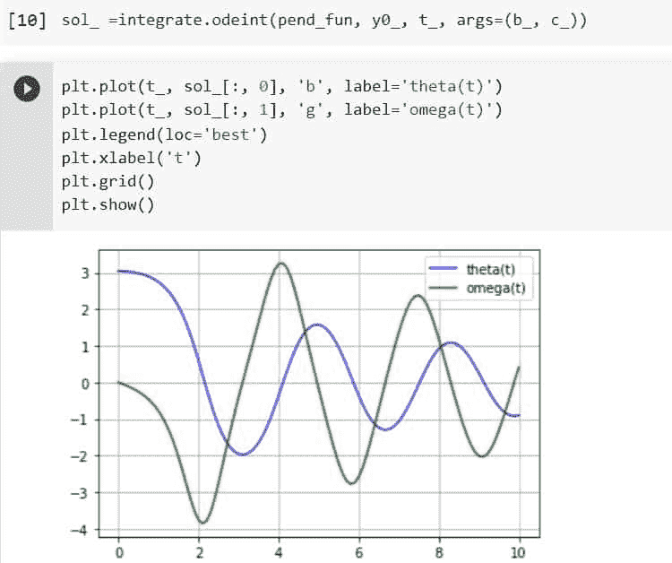
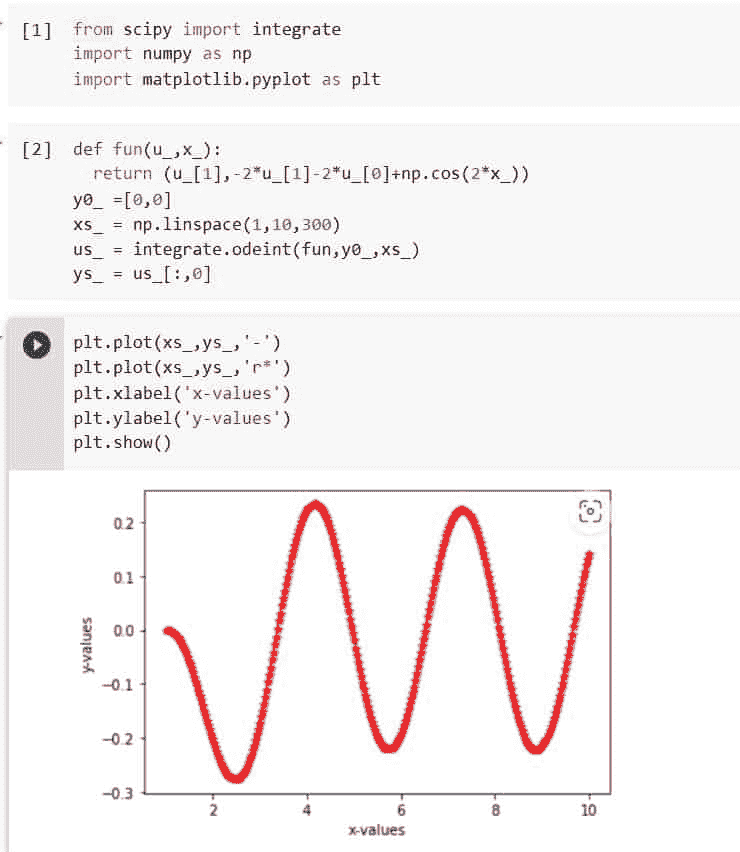

# Python Scipy Odeint

> 原文：<https://pythonguides.com/python-scipy-odeint/>

[](https://sharepointsky.teachable.com/p/python-and-machine-learning-training-course)

在本 [Python Scipy 教程](https://pythonguides.com/what-is-scipy-in-python/)中，我们将通过以下主题了解“ **Python Scipy Odeint** 解决微分方程相关问题以及如何在 Python Scipy 中实现。

*   微分方程的阶是什么？
*   Python Scipy Odeint
*   Odeint 与 Solve_ivp 方法有什么不同
*   如何积分二阶方程
*   Python Scipy Odeint 复杂
*   Python Scipy Odeint Rk45

目录

[](#)

*   [微分方程的阶是什么？](#What_is_the_order_of_the_differential_equations "What is the order of the differential equations?")
*   [Python Scipy Odeint](#Python_Scipy_Odeint "Python Scipy Odeint")
*   [Python Scipy Odeint Vs Solve _ IVP](#Python_Scipy_Odeint_Vs_Solve_ivp "Python Scipy Odeint Vs Solve_ivp")
*   [Python Scipy Odeint 二阶](#Python_Scipy_Odeint_2nd_order "Python Scipy Odeint 2nd order")
*   [Python Scipy Odeint Complex](#Python_Scipy_Odeint_Complex "Python Scipy Odeint Complex")
*   [Python Scipy Odeint Rk45](#Python_Scipy_Odeint_Rk45 "Python Scipy Odeint Rk45")

## 微分方程的阶是什么？

一个或多个变量(未知数)和它们的一些导数组成一个微分方程。换句话说，变量的导数由微分方程定义。

微分方程是根据它们的顺序分类的。微分方程中的最高导数有时也称为微分系数，它决定了微分方程的阶。

在本教程中，我们将使用 Python Scipy 方法求解常微分方程组。

## Python Scipy Odeint

Python Scipy 在模块`***scipy.integrate***`中有一个方法`***odeint()***`,通过积分来求解一组常微分方程。

下面给出了语法。

```py
scipy.integrate.odeint(func full_output=0, ml=None, mu=None, , y0, t, args=(), Dfun=None, col_deriv=0, rtol=None, atol=None, tcrit=None, h0=0.0, mxhnil=0, mxordn=12, mxords=5, hmax=0.0, hmin=0.0, ixpr=0, mxstep=0, printmessg=0, tfirst=False)
```

其中参数为:

*   **func(callable):** 计算 y 在时间 t 的导数。如果签名是可调用的(t，y，…)，则必须将 tfirst 参数设置为 True
*   **y0(数组):**y 的初始状态(可以是向量)。
*   **t(数组):**需要求解 y 的时间间隔列表。这个序列的第一个组成部分应该是开始值点。允许重复值；这个序列必须是单调递增或递减的。
*   **args(tuple):** 传递给函数的附加参数。
*   **dfun:** 函数的梯度(雅可比)。如果签名是可调用的(t，y，…)，参数 tfirst 必须设置为 True
*   **col_deriv(boolean):** 如果 Dfun 跨行定义导数而不是沿列定义导数(这需要更长时间)，则为 True。
*   **full_output(boolean):** 如果第二个输出应该是可选输出的字典，则为 True。
*   **printmessg(boolean):** 是否应打印收敛消息。
*   **tfirst(boolean):** 如果是这种情况，func 的前两个参数(和 Dfun，如果提供的话)必须是 t，y 而不是普通的 y，t。

方法`***odeint()***`返回类型为 array 的`**y**`(第一行的初始值为 y0，t 中每个选定时间的值为 y 的数组)。

让我们以下面的步骤为例:

```py
import numpy as np
import matplotlib.pyplot as plt
from scipy import integrate
```

向量[theta，omega]应为 y，我们用 Python 来实现这个系统。

```py
def pend_fun(y_, t_, b_, c_):
    theta_, omega_ = y_
    dydt_ = [omega_, -b_*omega_ - c_*np.sin(theta_)]
    return dydt_
```

我们假设 b = 0.20 和 c = 4.5 是常数。

```py
b_ = 0.20
c_ = 4.5
```

摆最初是静止的，ω(0)= 0，初始情况是它近似垂直，θ(0)= pi–0.1。那么初始条件向量就是。

```py
y0_ = [np.pi - 0.1, 0.0]
```

在 0 = t = 10 的范围内，我们将在 101 个均匀间隔的样本上产生一个解。这是我们的时间范围。

```py
t_ = np.linspace(0, 10, 101)
```

要生成解决方案，请调用 odeint。我们使用 args 参数向 odeint 提供参数 b 和 c，以便它们可以被传递给 pend。

```py
sol_ =integrate.odeint(pend_fun, y0_, t_, args=(b_, c_))
```

答案是保形数组(101，2)。θ(t)是第一列，ω是第二列(t)。下面的代码绘制了这两个元素。

```py
plt.plot(t_, sol_[:, 0], 'b', label='theta(t)')
plt.plot(t_, sol_[:, 1], 'g', label='omega(t)')
plt.legend(loc='best')
plt.xlabel('t')
plt.grid()
plt.show()
```



Python Scipy Odeint

这就是如何利用 Python Scipy 的方法`***odeint()***`对微分方程进行积分。

Read [Python Scipy Freqz](https://pythonguides.com/python-scipy-freqz/)

## Python Scipy Odeint Vs Solve _ IVP

`***scipy.integrate.ode***`类和函数`***scipy.integrate.solve_ivp***`使用系统定义函数，默认情况下，它要求 func 的前两个参数与那些参数的顺序相反。为了使用带有签名 func(t，y，…)的函数，有必要将参数 tfirst 设置为 True。

我们已经学习了“Python Scipy Odeint”，在这一节我们将学习 Python Scipy 的方法`***solve_ivp()***`。

方法`***solve_ivp()***`修复了 ODE 系统的初始值问题。给定一个初始值，这个函数数值积分一组常微分方程。

```py
dy / dt = f(t, y)
y(t0) = y0
```

这里，y(t)是 N 维向量值函数(状态)，t 是 1 维独立变量(时间)，f(t，y)是建立微分方程的 N 维向量值函数。给定 y(t0)=y0 的初始值，目标是找到大致满足微分方程的 y(t)。

刚性常微分方程解算器的右侧必须是复可微的，然而，一些解算器在复域中提供积分(满足柯西-黎曼方程[11])。

为 y0 传递复杂的数据类型，以解决复杂的问题。为真实和想象的部分分别重写你的问题是另一个总是可用的选择。

下面给出了语法。

```py
scipy.integrate.solve_ivp(fun, dense_output=False, events=None,  t_span, y0, method='RK45', t_eval=None,vectorized=False, args=None, **options)
```

其中参数为:

*   **fun(可调用):**系统在右侧。有趣的呼叫签名(t，y)。这里 t 是一个标量，ndarray 有两种可能:或者，如果它有 shape (n，)，fun 必须返回一个 shape (n，)的类数组对象。它也可以具有(n，k)形式，在这种情况下，fun 必须返回一个数组，该数组的形状(n，k)使得每一列都相当于 y 中的一列。矢量化参数控制两个选项中的哪一个被选中。矢量化实现通过有限差分近似实现更快的雅可比矩阵(刚性解算器需要)。
*   ***_* span(二元组浮点):**表示从 T0 到 T1 积分的区间。
*   **y0(array _ data like shape(n)):**用于指定初始状态。
*   **方法(字符串或 odsolver):** 用于指定使用哪种集成方法，如 RK45、Radau、RK23、DOP853、BDF 和 LSODA。
*   **t_eval(array_data):** 用于指定存储计算出的解的时间。
*   **dense_output(boolean):** 用于指定我们是否要计算连续解。
*   **事件(可调用):**用于跟踪事件。
*   **矢量化(布尔):**用于指定我们是否要以矢量化的方式实现函数。
*   **args(tuple):** 传递额外的参数。
*   *** *选项:**给所选解算器的选项下面是先前已实现的解算器可用的每个选项的列表。
*   **first_step(None，float):** 第一次步长因为 None 是默认值，所以应该由算法做出决定。
*   **max_step(float):** 允许的最大步长。当使用 np.inf 作为缺省值时，步长大小不受限制，完全由求解器决定。
*   **rtol，atol( array_data，float):** 相对和绝对公差。该解决方案保持小于 atol 加 rtol 乘以 abs (y)的局部误差估计。这里，绝对精度由 atol 控制，而相对精度(精确位数)由 rtol(正确小数位数)控制。将 atol 设置为小于可通过 rtol * abs(y)预测的最小值，以便 rtol 主导容许误差，从而获得所需的 rtol。如果 atol 大于 rtol * abs(y ),则不能保证会有同样多的准确数字。另一方面，为了获得所需的 atol，调整 rtol，使其永远不会超过 atol 和 rtol * abs(y)。如果 y 的分量的比例彼此不同，则对于 atol，传递具有形状(n，1)的阵列状可能是有利的。
*   **jac(array_data，sparse matrix):** 系统雅可比矩阵相对于 y 的右侧是拉道、BDF 和 LSODA 方法所需要的。(n，n)维雅可比矩阵有一个等于 d f_i / d y_j 的元素，雅可比矩阵可以用三种不同的方式描述。
    1.  如果矩阵或数组类型是类数组的，则雅可比矩阵被认为是常数。没有" LSODA "的支持。
    2.  如有必要，雅可比矩阵将被称为 jac(t，y ),如果它是可调用的，在这种情况下，它假定依赖于 t 和 Radau 和 BDF 算法的返回值可能是一个稀疏矩阵。
    3.  如果没有(默认值)，将使用有限差分来逼近雅可比矩阵。
*   **jac_sparsity(array_data，sparse matrix):** 概述了有限差分近似的雅可比矩阵的稀疏结构。它的形式必须是(n，n)。如果 jac 不是 None，就不考虑这个论点。如果提供稀疏结构，并且雅可比矩阵每行只有几个非零元素，计算速度会大大加快[10]。零条目表示雅可比的关联元素始终为零。如果没有(默认值)，则假定雅可比矩阵是稠密的。“LSODA”不支持，请使用 lband 和 uband。
*   **lband，uband(int):**‘lso da’技术参数，即 jac[i，j]！= 0 仅适用于 I–lband<= j<= I+uband，定义雅可比的带宽。不使用默认值。为了设置这些，您的 jac 方法必须以打包格式返回 Jacobian，这要求返回的数组有 n 列和 uband + lband + 1 行，其中写有 Jacobian 对角线。Jac packed[uband+I–j，j]具体等于 Jac[i，j]。Scipy.linalg.solve banded 采用相同的格式(查看示例)。为了降低通过有限差分估计的雅可比元素的数量，这些参数可以替代地利用 jac=None。
*   **min _ step(float):**“lso da”算法允许的最小步长。最小步长的默认值为 0

方法`***solve_ivp()***`返回一堆对象。

让我们举个例子，通过以下步骤来理解`***solve_ivp()***`是如何工作的:

使用下面的 python 代码导入所需的库或方法。

```py
from scipy import integrate
```

随机选择时间点的简单指数衰减。

```py
def exponential_decay_fun(t_, y_): return -0.4 * y_
sol = integrate.solve_ivp(exponential_decay_fun, [0, 10], [1, 3, 7])
print(sol.t)
```


Python Scipy Odeint Vs Solve_ivp

从上面的输出，我们可以得出 Python Scipy 的`***odeint***`和`***solve_ivp***`的区别。

阅读 [Python Scipy 最小化](https://pythonguides.com/python-scipy-minimize/)

## Python Scipy Odeint 二阶

感兴趣的变量的微分方程经常不仅依赖于一阶导数，而且依赖于高阶导数。

我们将使用上面小节中提到的 Python Scipy 的方法`***odeint()***`。

使用下面的 python 代码导入所需的库或方法。

```py
from scipy import integrate
import numpy as np
import matplotlib.pyplot as plt
```

使用下面的代码定义二阶函数并找到它的导数。

```py
def fun(u_,x_):
  return (u_[1],-2*u_[1]-2*u_[0]+np.cos(2*x_))
y0_ =[0,0]
xs_ = np.linspace(1,10,300)
us_ = integrate.odeint(fun,y0_,xs_)
ys_ = us_[:,0]
```

用下面的代码画出上面的导数。

```py
plt.plot(xs_,ys_,'-')
plt.plot(xs_,ys_,'r*')
plt.xlabel('x-values')
plt.ylabel('y-values')
plt.show()
```



Python Scipy Odeint 2nd order

这就是如何使用 Python Scipy 的方法`***odeint()***`对二阶方程进行积分。

阅读 [Python Scipy 距离矩阵](https://pythonguides.com/scipy-distance-matrix/)

## Python Scipy Odeint Complex

Python Scipy 在模块`***scipy.integrate***`中有一个方法`***complex_ode()***`，它是封装在复杂系统中的 Ode。类似于 ode，但在使用积分器之前，它将复值方程系统重新映射为实值方程系统。

下面给出了语法。

```py
scipy.integrate.complex_ode(f, jac=None)
```

其中参数为:

*   **f(可调用):**方程的 Rhs。Y.shape ==(n，)，t 是标量。使用 set f params(*args)设置 f_args。
*   **jac(可调用):**RHS ' Jacobian " d f[I]/d y[j]等于 jac[i，j]。调用“set f params(*args)”设置变量“jac args”。" ".

## Python Scipy Odeint Rk45

龙格-库塔-费尔伯格方法，有时也称为费尔伯格方法，是一种用于求解常微分方程的数值分析方法。它是由德国数学家欧文·费尔伯格在龙格-库塔程序的基础上创建的。

Fehlberg 的技术是独特的，因为它是一种龙格-库塔族嵌入式方法，这意味着它结合了同一函数的许多评估，以产生具有不同阶数和相似误差常数的方法。

Fehlberg 在 1969 年的出版物中介绍的方法，称为 RKF45 方法，是一种具有 5 阶误差估计量的 4 阶方法。高阶嵌入技术能够自动确定自适应步长，可用于通过进行附加计算来估计和调节解误差。

在本节中，我们将使用上述方法`***Rk45***`和方法`***solve_ivp()***`来求解微分方程，因为方法`***odeint()***`不支持`***Rk45***`的任何一种参数方法。

我们将按照以下步骤使用在上述小节中使用的相同示例:

使用下面的 python 代码导入所需的库或方法。

```py
from scipy import integrate
```

随机选择时间点的简单指数衰减，使用以下代码的方法`***RK45***`。

```py
def exponential_decay_fun(t_, y_): return -0.4 * y_
sol = integrate.solve_ivp(exponential_decay_fun, [0, 10], [1, 3, 7], method = 'RK45')
print(sol.t)
```


Python Scipy Odeint Rk45

这就是如何使用 Python Scipy 的方法`***Rk45***`和方法`***solve_ivp()***`来集成函数。

我们已经讲述了如何找到方程的高阶积分，还学习了“什么是 Solve_ivp 方法”等，主题如下。

*   微分方程的阶是什么？
*   Python Scipy Odeint
*   Odeint 与 Solve_ivp 方法有什么不同
*   如何积分二阶方程
*   Python Scipy Odeint 复杂
*   Python Scipy Odeint Rk45

您可能会喜欢以下 Python Scipy 教程:

*   [Python Scipy 置信区间](https://pythonguides.com/scipy-confidence-interval/)
*   [Python Scipy 指数](https://pythonguides.com/python-scipy-exponential/)
*   [Python Scipy Leastsq](https://pythonguides.com/python-scipy-leastsq/)
*   [Python Scipy 卡方检验](https://pythonguides.com/python-scipy-chi-square-test/)
*   [科学发现高峰](https://pythonguides.com/scipy-find-peaks/)
*   [Python Scipy FFT](https://pythonguides.com/python-scipy-fft/)

[Saurabh](https://pythonguides.com/author/saurabh/)

我叫 Kumar Saurabh，是一名 Python 开发人员，在 TSInfo Technologies 工作。此外，像 Python 编程，SciPy，机器学习，人工智能等技术的专业知识。是我喜欢做的事情。