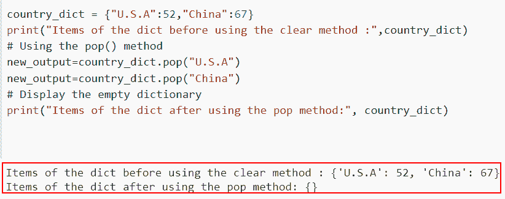
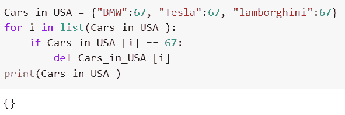

# 如何在 Python 中删除字典

> 原文：<https://pythonguides.com/delete-a-dictionary-in-python/>

[](https://sharepointsky.teachable.com/p/python-and-machine-learning-training-course)

在这个 [Python 教程](https://pythonguides.com/python-programming-for-the-absolute-beginner/)中，我们将学习从 [Python 字典](https://pythonguides.com/create-a-dictionary-in-python/)中删除键值对的各种方法。在 Python 中，信息的键值对存储在字典中。

作为一名开发人员，在制作 Python 项目时，我得到了删除 Python 中的字典的要求。

在这里我们将看到

*   如何使用 dict.clear()在 Python 中删除字典
*   使用 pop()删除 Python 中的字典
*   如何使用 del 关键字在 Python 中删除字典
*   使用 popitem()删除 Python 中的字典
*   如何使用字典理解在 Python 中删除字典

目录

[](#)

*   [在 Python 中删除字典](#Delete_a_Dictionary_in_Python "Delete a Dictionary in Python")
    *   [如何使用 dict.clear()](#How_to_delete_a_dictionary_in_Python_using_dictclear "How to delete a dictionary in Python using dict.clear()") 在 Python 中删除字典
    *   [使用 pop()](#Delete_a_Dictionary_in_Python_using_pop "Delete a Dictionary in Python using pop()") 删除 Python 中的字典
    *   [如何用 del 关键字删除 Python 中的字典](#How_to_delete_a_dictionary_in_Python_using_del_keyword "How to delete a dictionary in Python using del keyword")
    *   [使用 popitem()](#Delete_a_Dictionary_in_Python_using_popitem "Delete a Dictionary in Python using popitem()") 删除 Python 中的字典
    *   [如何使用字典理解删除 Python 中的字典](#How_to_delete_a_dictionary_in_Python_using_dict_comprehension "How to delete a dictionary in Python using dict comprehension")

## 在 Python 中删除字典

从 Python 字典中删除键值对有不同的方法，比如 **dict.clear()、del 关键字、pop()和 popitem()** 函数。

### 如何使用 dict.clear() 在 Python 中删除字典

*   在本节中，我们将讨论如何使用 **dict.clear()** 方法在 Python 中删除字典。
*   Python 字典的 **clear()** 函数用于删除每一项。当字典包含大量元素时，一次删除一个元素会花费很多时间。相反，使用 clear()方法一次性删除字典的所有元素。
*   要在 Python 中删除字典，我们将使用 **dict.clear()** 方法，这是 Python 中的一个内置函数，它将删除所有的键值对元素。

**语法:**

让我们看看语法，了解一下 **dict.clear()** 的工作原理。

```py
Dictionary_name.clear()
```

**注:**对于这个**“clear()”**方法，不需要其他参数。我们可以很容易地用 clear 方法给我们想要删除数据的字典命名。

**举例:**

这里我们将举一个例子，检查如何使用 **dict.clear()** 在 Python 中删除字典。

**源代码:**

```py
country_dict = {"U.S.A":52,"Estonia":47,"Kenya":82}
print("Items of the dict before using the clear method :",country_dict)

# Using the clear() method
new_output=country_dict.clear()

# Display the empty dictionary
print("Items of the dict after using the clear method:", new_output)
```

在下面给出的代码中，我们首先创建了一个名为 country_dict 的字典，并以键值对的形式分配元素。接下来，我们使用 **clear()** 方法从给定的字典中删除所有元素。

下面是以下给定代码的实现。


How to delete a dictionary in Python using dict.clear()

这就是如何使用 dict.clear()在 Python 中删除字典。

阅读: [Python 字典 pop](https://pythonguides.com/python-dictionary-pop/)

### 使用 pop() 删除 Python 中的字典

*   现在让我们讨论如何使用 **pop()** 方法删除 Python 中的键值对元素。
*   使用 Python 中的 **pop()** 函数删除字典元素。它删除连接到给定键的元素。
*   如果字典包含提供的键，它将删除它并返回它的值。如果给定的键不可用，它将抛出一个 KeyError 异常。

**语法:**

下面是 Python 中 **dictionary.pop()** 方法的语法

```py
dict.pop(key, default)
```

*   它由几个参数组成
    *   **Key:** 该参数定义了我们想要删除的 Key。
    *   **Default:** 这是一个可选参数，如果字典中没有这个键，它将返回这个值。

**举例:**

让我们举一个例子，看看如何使用 pop()方法在 Python 中删除键值对元素。

**源代码:**

```py
country_dict = {"U.S.A":52,"China":67}
print("Items of the dict before using the clear method :",country_dict)
# Using the pop() method
new_output=country_dict.pop("U.S.A")
new_output=country_dict.pop("China")
# Display the empty dictionary
print("Items of the dict after using the pop method:", country_dict) 
```

在上面的代码中，我们首先创建了 dictionary 并分配了 **country_name** 。之后，我们使用了 **pop()** 函数，在这个函数中，我们指定了想要从字典中删除的关键元素。

下面是以下给定代码的执行过程



Delete a Dictionary in Python using pop

在这个例子中，我们已经理解了如何使用 pop()方法在 Python 中删除字典。

阅读: [Python 字典索引](https://pythonguides.com/python-dictionary-index/)

### 如何用 del 关键字删除 Python 中的字典

*   在这个例子中，我们将学习如何使用 del 关键字在 Python 中删除字典。
*   **del** 关键字在 Python 中常用来删除对象。因为 Python 中的一切都是一种对象类型，所以本例中的对象将是一个字典。
*   在 Python 中，从输入字典值中删除键值对的另一种方法是使用 **del** 关键字。

**语法:**

让我们看一下语法，理解 Python 中 del 关键字的工作原理。

```py
del dict[object]
```

注意:在这个例子中，对象是一个字典，我们必须从中删除元素。

**举例:**

在这里我们将看到如何使用关键字*在 Python 中删除字典*

```py
Cars_in_USA = {"BMW":67, "Tesla":67, "lamborghini":67}
for i in list(Cars_in_USA ):
    if Cars_in_USA [i] == 67:
        del Cars_in_USA [i]
print(Cars_in_USA )
```

在给定的示例中，我们创建了名为**“Cars _ in _ USA”**的字典，并迭代循环的值。接下来，我们设置字典是否包含 **67** 值的条件。如果可用，则该元素将被移除。

你可以参考下面的截图。



How to delete a dictionary in Python using del keyword

正如你在截图中看到的，我们已经讨论了如何使用 del 关键字在 Python 中删除字典。

阅读: [Python 字典扩展](https://pythonguides.com/python-dictionary-extend/)

### 使用 popitem() 删除 Python 中的字典

*   在这一节中，我们将讨论如何使用 **popitem()** 方法在 Python 中删除字典。
*   Python 中的 **popitem()** 函数删除一个 dictionary 元素。它删除任何元素，并返回最后一个元素。如果字典为空，它会产生一个 KeyError。
*   **popitem()** 函数不接受任何参数，并返回从字典中删除的键值对。

**语法:**

下面是 Python 中 **dictionary.popitem()** 方法的语法。

```py
dict.popitem()
```

示例:

让我们举个例子，看看如何使用 **popitem()** 方法在 Python 中删除一个字典。

**源代码:**

```py
bikes_in_USA = {'Harley Davidson':62, 'Confederate':34, 'Motus MSTR':23}
# using the popitem() method
bikes_in_USA.popitem()
bikes_in_USA.popitem()
bikes_in_USA.popitem()
# Display the Content
print(bikes_in_USA)
```

在下面给出的代码中，我们首先创建了一个字典，然后使用 **popitem()** 方法从输入字典中删除元素。

下面是下面给出的代码的截图。


Delete a Dictionary in Python using popitem()

这是如何使用 Python 中的 popitem()删除 Python 中的字典。

阅读: [Python 字典计数](https://pythonguides.com/python-dictionary-count/)

### 如何使用字典理解删除 Python 中的字典

*   在这里，我们将看到如何在 Python 中使用 dict comprehension 方法删除字典。
*   Python 中的 **items()** 函数只是返回一个对象，其中包含特定字典中所有键值对的列表，并且不需要任何参数。
*   通过接受来自某个 iterable 的键值对，Python Dict Comprehension 可以用来生成字典。

**语法:**

让我们来看看句法，了解一下 dict 理解法的工作原理。

```py
{key: value for key, value in iterable}
```

**举例:**

我们举个例子，用 dict comprehension 方法检查一下如何在 Python 中删除一个字典。

**源代码:**

```py
country_dict = {"U.S.A":76,"Estonia":76,"Kenya":76}
print("Items  of the dictionary before using the deletion operation :",country_dict )

new_output = {k:new_val for k, new_val in country_dict.items() if new_val != 76} 
print("Items  of the dictionary after using the deletion operation :",new_output )
```

在上面的代码中，我们首先创建了字典，并为它分配了国家名称元素。接下来，我们应用了字典理解方法，其中我们设置了条件 if new_val！= 76.如果值与给定的字典匹配，那么元素将被删除。

下面是以下给定代码的实现。


How to delete a dictionary in Python using dict comprehension method

您可能也喜欢阅读以下 Python 教程。

*   [Python 字典更新](https://pythonguides.com/python-dictionary-update/)
*   [Python 列表字典](https://pythonguides.com/python-dictionary-of-lists/)
*   [Python 字典元组列表](https://pythonguides.com/python-dictionary-of-tuples/)
*   [Python 字典多键](https://pythonguides.com/python-dictionary-multiple-keys/)

在本文中，我们讨论了从 Python 字典中删除键值对的几种不同方法。下面这个话题我们已经讲过了。

*   如何使用 dict.clear()在 Python 中删除字典
*   使用 pop()删除 Python 中的字典
*   如何使用 del 关键字在 Python 中删除字典
*   使用 popitem()删除 Python 中的字典
*   如何使用字典理解在 Python 中删除字典

[Bijay Kumar](https://pythonguides.com/author/fewlines4biju/)

Python 是美国最流行的语言之一。我从事 Python 工作已经有很长时间了，我在与 Tkinter、Pandas、NumPy、Turtle、Django、Matplotlib、Tensorflow、Scipy、Scikit-Learn 等各种库合作方面拥有专业知识。我有与美国、加拿大、英国、澳大利亚、新西兰等国家的各种客户合作的经验。查看我的个人资料。

[enjoysharepoint.com/](https://enjoysharepoint.com/)[](https://www.facebook.com/fewlines4biju "Facebook")[](https://www.linkedin.com/in/fewlines4biju/ "Linkedin")[](https://twitter.com/fewlines4biju "Twitter")*