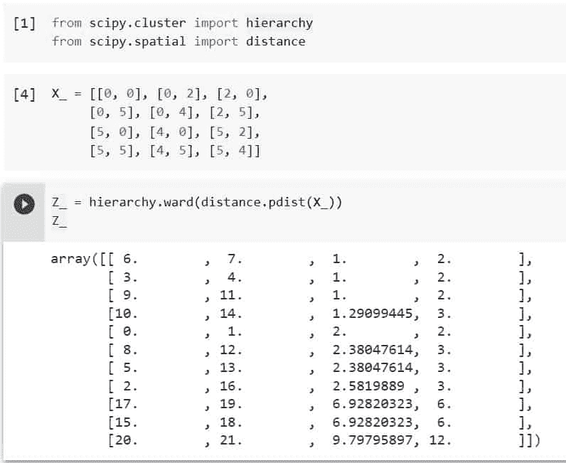
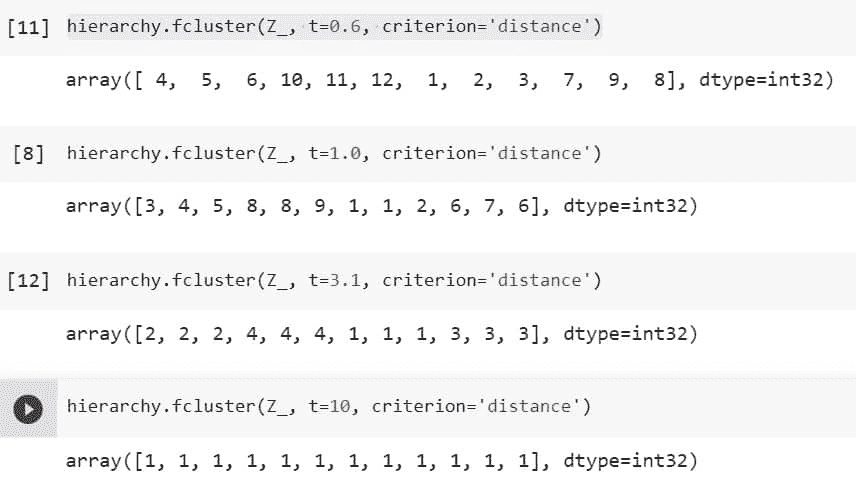
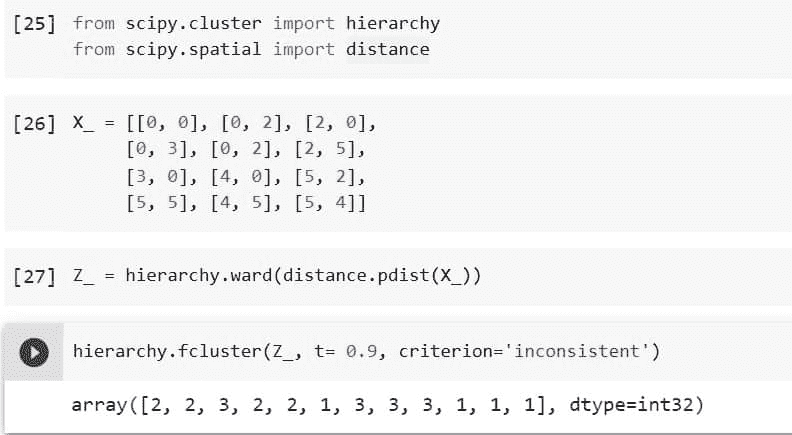
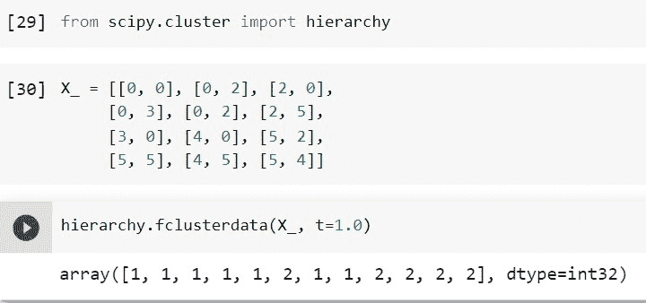

# Python Scipy Fcluster

> 原文：<https://pythonguides.com/python-scipy-fcluster/>

[](https://sharepointsky.teachable.com/p/python-and-machine-learning-training-course)

本教程向我们介绍了" **Python Scipy Fcluster** "如何将相似的观察值聚类到一个或多个聚类中，我们还将通过以下主题了解数据点聚类的步骤。

*   什么是集群？
*   如何在 Python Scipy 中创建集群
*   Python Scipy 集群测试
*   如何使用 Maxclust 获得所需的集群
*   Python Scipy 集群不一致
*   Python 科学集群数据

目录

[](#)

*   [什么是聚类？](#What_is_clustering "What is clustering?")
*   [python scipy fccluster](#Python_Scipy_Fcluster "Python Scipy Fcluster")的开发
*   [python scipy fccluster t](#Python_Scipy_Fcluster_T "Python Scipy Fcluster T")的开发
*   [Python Scipy 集群 max Cluster](#Python_Scipy_Cluster_Maxclust "Python Scipy Cluster Maxclust")
*   [Python Scipy 集群不一致](#Python_Scipy_Cluster_Inconsistent "Python Scipy Cluster Inconsistent")
*   [Python Scipy 的 fcluster 数据](#Python_Scipy_Fcluster_Data "Python Scipy Fcluster Data")

## 什么是聚类？

无监督的机器学习任务包括聚类。由于这个过程是如何运作的，我们也可以称之为聚类分析。

当使用聚类方法时，我们将为算法提供大量未标记的输入数据，并允许它识别它可以识别的任何数据组或集合。

这些集合被称为集群。聚类是数据点的集合，这些数据点根据它们与区域中其他数据点的关系而彼此相关。模式发现和特征工程是聚类的两个应用。

聚类背后的基本思想是将一组观察值划分为子组或聚类，使得属于同一聚类的观察值具有一些特征。

阅读: [Python Scipy 插值](https://pythonguides.com/python-scipy-interpolate/)

## python scipy fccluster的开发

在模块`***scipy.cluster.hierarchy***`中有一个 Python Scipy 的方法`***fcluster()***`从提供的链接矩阵定义的层次聚类中创建平面聚类。

下面给出了语法。

```py
scipy.cluster.hierarchy.fcluster(Z, t, criterion='inconsistent', depth=2, R=None, monocrit=None)
```

其中参数为:

*   **Z(ndarray):** 链接函数的返回矩阵用层次聚类进行编码。
*   **t(标量):** *对于标准“不一致”、“距离”或“单一”:*应用该阈值将导致平坦聚类。*对于“maxclust”或“maxclust_monocrit”标准:*请求的最大集群数如下。
*   **criteria(string):**创建平面聚类时要应用的标准。可以使用以下任意值:`inconsistent`、`distance`、`maxclust`、`monocrit`和`maxclust_monocrit`

*   **depth(int):** 可以进行不一致性计算的最大深度。关于其他的标准，它没有任何意义。2 是默认值。
*   **R(ndarray):** 应用于“不一致”标准的不一致矩阵。如果未给出，则计算该矩阵。
*   **monocrit(ndarray):**n-1 个元素的集合。用于设定非单胎 I 阈值的统计称为 monocrit[i]。monocrit 向量必须是单调的，这意味着给定具有索引 I 的节点 c，monocrit[i] > = monocrit[j]对应于 c 之下的节点的所有节点索引 j

方法`***fcluster()***`返回 ***`fclusters` (T[i]是原始观测 I 所属的平簇数。*它是一个长度为 n 的数组。**

让我们以下面的步骤为例:

使用下面的 python 代码导入所需的库或方法。

```py
from scipy.cluster import hierarchy
from scipy.spatial import distance
```

任何聚类链接方法的输出，如***scipy . cluster . hierarchy . ward***，都是一个链接矩阵 z。使用下面的代码创建一个 x 数据数组，它是美国城市的起点和终点。

```py
X_ = [[0, 0], [0, 2], [2, 0],
     [0, 5], [0, 4], [2, 5],
     [5, 0], [4, 0], [5, 2],
     [5, 5], [4, 5], [5, 4]]
```

使用方法`pdist()`将输入数据`***X_***`压缩成一个矩阵，并使用下面的代码将该数据传递给聚类方法`***ward()***`。

```py
Z_ = hierarchy.ward(distance.pdist(X_))
Z_
```



Python Scipy Fcluster

上述矩阵的第一个和第二个元素表示一个树状图，是在每一步中组合的两个聚类。

矩阵中的第三个元素是两个聚类之间的距离，第四个元素是新聚类的大小或包含的原始数据点的数量。

现在使用下面的代码将上面的矩阵传递给方法 fcluster。

```py
hierarchy.fcluster(Z_, t=0.8, criterion='distance')
```


Python Scipy Fcluster Example

返回 12 个独立的聚类，因为阈值 t 太小，不允许数据中的任何两个样本创建一个聚类。我们可以调整阈值(t)来形成我们将在下一小节中学习的聚类。

阅读 [Python Scipy 两两距离](https://pythonguides.com/python-scipy-pairwise-distance/)

## python scipy fccluster t的开发

可以使用`***scipy.cluster.hierarchy.fcluster***`将树状图拉平，它将原始数据点分配给单个聚类。这种分配很大程度上由距离阈值(t)决定，距离阈值是允许的最大簇间距离。

在本节中，我们将继续我们在上述小节**“Python Scipy f cluster”**中使用的相同示例。

在上面的子部分代码之后运行下面的代码，以了解阈值(t)是如何工作的。

```py
hierarchy.fcluster(Z_, t=0.6, criterion='distance')
```

使用下面的代码运行 t=1.0 的相同代码。

```py
hierarchy.fcluster(Z_, t=1.0, criterion='distance')
```

那么 t=3.1

```py
hierarchy.fcluster(Z_, t=3.1, criterion='distance')
```

最后 t=10

```py
hierarchy.fcluster(Z_, t=10, criterion='distance')
```



Python Scipy Fcluster T

*   在第一种情况下返回 12 个独立的聚类，因为阈值 t 太低，不允许数据中的任何两个样本创建聚类。
*   在第二种情况下，阈值足够高以允许这些点与离它们最近的那些点融合。因此，在这种情况下，只返回 9 个集群。
*   在第三种情况下，可以连接多达 8 个数据点，这种情况具有高得多的阈值；因此，在这种情况下会返回 4 个群集。
*   最后，第四种情况的阈值足够高以允许所有数据点的融合，导致单个聚类的返回。

这就是如何使用阈值(t)来形成集群。

阅读[使用 Python Scipy Linalg Svd](https://pythonguides.com/python-scipy-linalg-svd/)

## Python Scipy 集群 max Cluster

方法`***fcluster()***`接受在创建平面集群时应用的参数 ***`criterion`*** 。它可以是下列任何值。

*   ***不一致:*** 不一致值小于或等于 t 的集群节点的任何叶后代都被认为是同一个平面集群的成员。如果没有满足这个要求的非单例集群，每个节点都有自己的集群。
*   ***距离:*** 创建平面聚类，每个平面聚类中初始观察值之间的最大同宿距离为 t。
*   ***max cluster:***找到一个最小阈值 r，低于该阈值 r，将不超过 t 个平簇形成，并且单个平簇中任何两个原始观测值之间的共亨距离不超过 r。
*   ***monocrit:*** 其中 monocrit[j] = t，从索引为 I 的集群节点 c 创建平面集群
*   ***maxclust _ monocrit:***当 monocrit[i] = r 对于 c 以下且包含 c 的所有簇索引 I，从非单个簇节点 c 形成平面簇，R 被减小，使得可以形成 t 个或更少的平面簇。monocrit 里一定有单调。

请记住本教程的第二小节，用于**‘maxclust’或‘maxclust _ monocrit’标准**的参数`***t***`将是所请求的集群的最大数量。

这里我们将直接使用我们在上面的小节**“Python Scipy f cluster”**中使用的相同代码。

假设我们需要形成 5 个集群，那么 ***t*** 的值将是 ***5*** 和 ***判据*** 等于 ***maxclust*** ，如下面的代码所示。

```py
hierarchy.fcluster(Z_, t=5, criterion='maxclust')
```


Python Scipy Cluster Maxclust

从上面的输出中，我们得到了五个集群，如 ***first_cluster = [2，2]，second_cluster = [3]，third_cluster = [5，5，5]，fourth_cluster = [1，1，1]*** 和 ***fifth_cluster = [4，4，4]*** 。

这就是如何使用带有参数`***t***`的标准的值`***maxclust***`来获得所需集群的数量。

阅读 [Python Scipy 平滑](https://pythonguides.com/python-scipy-smoothing/)

## Python Scipy 集群不一致

从上面的小节中我们已经知道，方法`***fcluster()***`接受一个参数 ***`criterion`*** ，该参数在创建平面集群时被应用。这个标准接受一个值`***inconsistent***`。

不一致意味着如果集群节点的不一致值小于或等于 t，则该节点的所有叶后代都是同一个平面集群的成员。当没有满足此要求的非单一集群时，每个节点都有自己的集群。

让我们按照下面的步骤来看一个例子。

使用下面的 python 代码导入所需的库或方法。

```py
from scipy.cluster import hierarchy
from scipy.spatial import distance
```

创建一个 x 数组数据，它是美国各州的开始和结束距离点，例如 ***阿拉巴马州(0，0 到 0，2)******加利福尼亚州(0，2 到 2，0)*** ， ***佛罗里达州(2，0 到 0，3)*** ， ***佐治亚州(0，3 到 0，2)*** ， ***夏威夷(0，2 到 2 ****内华达******新 Jersy*** 和 ***纽约*** 使用下面的代码。****

```py
X_ = [[0, 0], [0, 2], [2, 0],
     [0, 3], [0, 2], [2, 5],
     [3, 0], [4, 0], [5, 2],
     [5, 5], [4, 5], [5, 4]]
```

```py
Z_ = hierarchy.ward(distance.pdist(X_))
```

现在使用下面的代码将上述数据传递给方法`***fcluster()***`和`***criterion***`等式`***inconsistent***`。

```py
hierarchy.fcluster(Z_, t= 0.9, criterion='inconsistent')
```



Python Scipy Cluster Inconsistent

阅读 [Python Scipy Ndimage Imread 教程](https://pythonguides.com/python-scipy-ndimage-imread/)

## Python Scipy 的 fcluster 数据

Python Scipy 的模块`***scipy.cluster.hierarchy***`中的方法`***fclusterdata()***`使用了特定的度量标准，即分组观察数据。

x，包含 m 维中的 n 个观察值，使用单链接算法执行分级聚类，使用以 t 作为截止阈值的不一致性方法执行平面聚类，以及使用单链接算法执行原始观察值的聚类。

下面给出了语法。

```py
scipy.cluster.hierarchy.fclusterdata(X, t, criterion='inconsistent', metric='euclidean', depth=2, method='single', R=None)
```

其中参数为:

*   **X(ndarray (N，M):**M 维中有 N 个观测值，数据矩阵为 N 乘 M。
*   **t(标量):** *对于标准“不一致”、“距离”或“单一”:*应用该阈值将导致平坦聚类。*对于“maxclust”或“maxclust_monocrit”标准:*请求的最大集群数如下。
*   **criteria(string):**创建平面聚类时要应用的标准。以下任何一个值都可以用作此值:`inconsistent`、`distance`、`maxclust`、`monocrit`和`maxclust_monocrit`。
*   **公制(字符串):**用于计算成对距离的距离公制。
*   **depth(int):** 可以进行不一致性计算的最大深度。关于其他的标准，它没有任何意义。2 是默认值。
*   方法(字符串):推荐的连锁方法(完全、单一、平均、加权、沃德、中位数形心)。
*   **R(ndarray):** 应用于“不一致”标准的不一致矩阵。如果未给出，则计算该矩阵。

方法`***fclusterdata()***`返回`***fclusterdata***` (T[i]是原始观察值 I 所属的平面簇号。它是一个长度为 n 的向量。

让我们来看一个例子，其中的数据与我们在上面的**“Python Scipy 集群不一致”**小节中按照以下步骤创建的数据相同。

使用下面的 python 代码导入所需的库或方法。

```py
from scipy.cluster import hierarchy
```

创建一个 x 数组数据，它是美国各州的开始和结束距离点，例如 ***阿拉巴马州(0，0 到 0，2)******加利福尼亚州(0，2 到 2，0)*** ， ***佛罗里达州(2，0 到 0，3)*** ， ***佐治亚州(0，3 到 0，2)*** ， ***夏威夷(0，2 到 2 ****内华达******新 Jersy*** 和 ***纽约*** 使用下面的代码。****

```py
X_ = [[0, 0], [0, 2], [2, 0],
     [0, 3], [0, 2], [2, 5],
     [3, 0], [4, 0], [5, 2],
     [5, 5], [4, 5], [5, 4]]
```

使用“scipy . cluster . hierarchy . f cluster”查找用户指定的距离阈值 t = 1.0 的平面分类。

```py
hierarchy.fclusterdata(X_, t=1.0)
```



Python Scipy Fcluster Data

在上面的输出中，四个聚类是数据集 X_，距离阈值 t = 1.0 的结果。

典型的 SciPy 层次聚类工作流中的所有步骤都由我们在**“Python SciPy f cluster”**小节中执行的便利方法“fclusterdata()”抽象，例如以下步骤:

*   使用 scipy.spatial.distance.pdist，根据提供的数据创建压缩矩阵。
*   使用类似`***ward()***`的聚类方法。
*   使用***scipy . cluster . hierarchy . f cluster***，找到具有用户定义的距离阈值 t 的平坦聚类

以上三个步骤都可以使用方法`***fclusterdata()***`来完成。

我们已经了解了如何使用“Python Scipy Fcluster”对相似的数据点进行聚类，并使用标准值`***maxclust***`获得所需的聚类数。此外，我们还讨论了以下主题。

*   什么是集群？
*   如何在 Python Scipy 中创建集群
*   Python Scipy 集群测试
*   如何使用 Maxclust 获得所需的集群
*   Python Scipy 集群不一致
*   Python 科学集群数据

您可能会喜欢以下 Python Scipy 教程:

*   [Python Scipy Softmax](https://pythonguides.com/python-scipy-softmax/)
*   [如何使用 Python Scipy 差分进化](https://pythonguides.com/scipy-differential-evolution/)
*   [如何使用 Python Scipy Linprog](https://pythonguides.com/python-scipy-linprog/)
*   [Python Lil_Matrix Scipy](https://pythonguides.com/python-lil_matrix-scipy/)
*   [如何使用 Python Scipy Gaussian_Kde](https://pythonguides.com/python-scipy-gaussian_kde/)

[Bijay Kumar](https://pythonguides.com/author/fewlines4biju/)

Python 是美国最流行的语言之一。我从事 Python 工作已经有很长时间了，我在与 Tkinter、Pandas、NumPy、Turtle、Django、Matplotlib、Tensorflow、Scipy、Scikit-Learn 等各种库合作方面拥有专业知识。我有与美国、加拿大、英国、澳大利亚、新西兰等国家的各种客户合作的经验。查看我的个人资料。

[enjoysharepoint.com/](https://enjoysharepoint.com/)[](https://www.facebook.com/fewlines4biju "Facebook")[](https://www.linkedin.com/in/fewlines4biju/ "Linkedin")[](https://twitter.com/fewlines4biju "Twitter")**