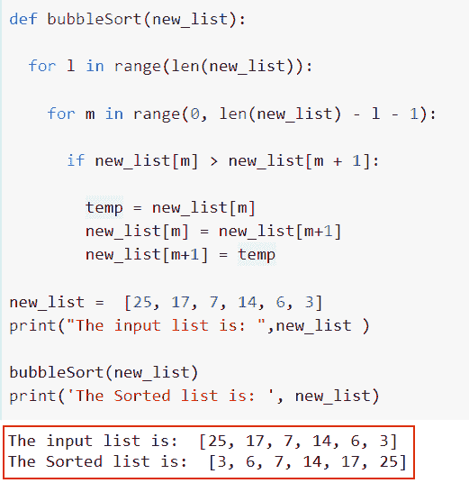
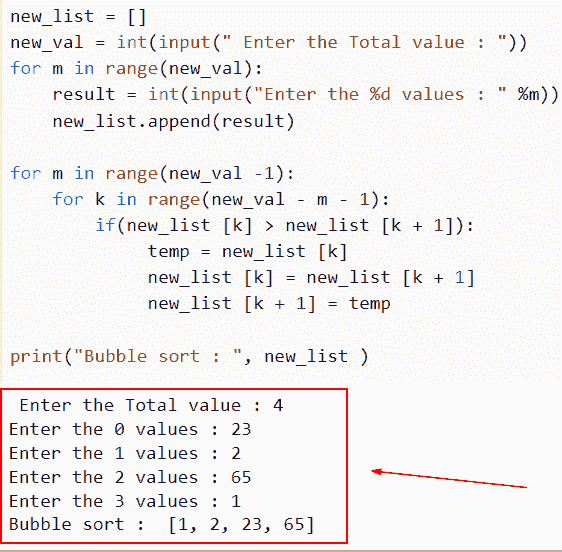
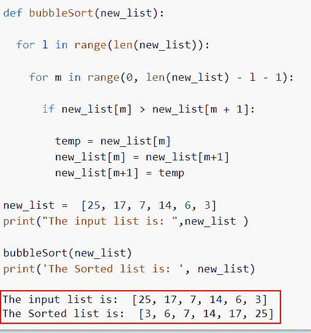
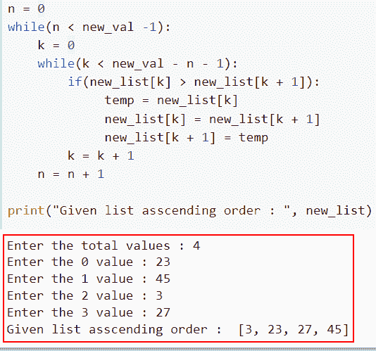
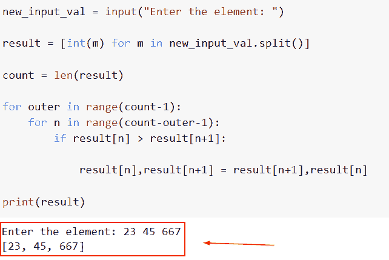

# 用于冒泡排序的 Python 程序

> 原文：<https://pythonguides.com/python-program-for-bubble-sort/>

[](https://sharepointsky.teachable.com/p/python-and-machine-learning-training-course)

在本 Python 教程中，我们将讨论如何在 Python 中实现**冒泡排序程序，并通过一个实例来理解冒泡排序的概念。除此之外，我们还将讨论以下主题。**

*   用于冒泡排序的 Python 程序
*   使用 for 循环进行冒泡排序的 Python 程序
*   使用 using 函数进行冒泡排序的 Python 程序
*   使用该列表编写一个用于冒泡排序的 Python 程序
*   Python 冒泡排序列表理解

目录

[](#)

*   [用于冒泡排序的 Python 程序](#Python_program_for_bubble_sort "Python program for bubble sort")
*   [使用 for 循环进行冒泡排序的 Python 程序](#Python_program_for_bubble_sort_using_for_loop "Python program for bubble sort using for loop")
*   [使用函数](#Python_program_for_bubble_sort_with_using_function "Python program for bubble sort with using function")进行冒泡排序的 Python 程序
*   [写一个使用链表进行冒泡排序的 Python 程序](#Write_a_Python_Program_for_bubble_sort_using_a_list "Write a Python Program for bubble sort using a list")
*   [Python 冒泡排序列表理解](#Python_bubble_sort_list_comprehension "Python bubble sort list comprehension")

## 用于冒泡排序的 Python 程序

*   通过比较两个相邻的值，冒泡排序算法按升序排列列表项。如果第一个值大于第二个值，第二个值将取代第一个值，并且第一个值下移。如果第一个值小于第二个值，则没有交换。
*   第一次迭代包括比较和交换操作，以便按升序排列值。在第一和第二索引值之间进行比较。交换发生并重复，直到满足标准的结尾。

**冒泡排序工作**:

*   下面是给定的值列表，其中存储了整数
*   new_list = [25，17，7，14，6，3]
*   在这里，算法对元素进行排序
*   第一次迭代
*   [25，17，7，14，6，3]
    它将使前两个值相等，在这里 25 > 17 然后互相交换。现在我们得到了一个新的列表
*   [17, 25, 7, 14, 6, 3]
*   在第二次比较中，25 > 7，然后发生交换——
*   [17, 7, 25, 14, 6, 3]
*   在第三次比较中，25>14 然后交换–
*   [17, 7, 14, 25, 6, 3]
*   第四次比较，25>6 然后互换——
    【17，7，14，6，25，3】
    第五次比较，25 > 3 然后互换——
*   [17, 7, 14, 6, 3, 25]
*   这里第一次迭代完成了，我们在最后得到了最大的元素。现在我们需要 len(new _ list 1)—

**冒泡排序算法**

*   开发冒泡排序()函数。
*   向函数提供一个参数列表。
*   为了访问每个列表，创建一个循环。
*   构建一个循环来评估列表项
*   比较两个相关的对象
*   如果组件顺序不对，就交换它们，结果是一个排序列表。
*   打印列表。

让我们举一个例子，检查并讨论 Python 中冒泡排序操作的编程部分。

源代码:

```py
def bubbleSort(new_list):

  for l in range(len(new_list)):

    for m in range(0, len(new_list) - l - 1):

      if new_list[m] > new_list[m + 1]:

        temp = new_list[m]
        new_list[m] = new_list[m+1]
        new_list[m+1] = temp

new_list =  [25, 17, 7, 14, 6, 3]
print("The input list is: ",new_list )

bubbleSort(new_list)
print('The Sorted list is: ', new_list)
```

下面是以下给定代码的实现



Python program for bubble sort

这就是我们如何用 Python 创建一个冒泡排序的程序。

阅读 [Python 字典排序](https://pythonguides.com/python-dictionary-sort/)

## 使用 for 循环进行冒泡排序的 Python 程序

*   这是一种基本的排序算法，它在要排序的列表上迭代移动，比较每对相邻的项目，如果它们的顺序不对，就交换它们。在对列表进行排序之前，重复这些阶段，直到不再需要交换。
*   如果列表中的第一个和第二个元素顺序不对，比较它们并交换它们。如果第二个和第三个元素的顺序不对，比较它们并交换它们。以类似的方式继续，直到列表的最后一个元素。
*   重复以下所有步骤，直到列表排序完毕。

**举例**:

```py
new_list = []
new_val = int(input(" Enter the Total value : "))
for m in range(new_val):
    result = int(input("Enter the %d values : " %m))
    new_list.append(result)

for m in range(new_val -1):
    for k in range(new_val - m - 1):
        if(new_list [k] > new_list [k + 1]):
             temp = new_list [k]
             new_list [k] = new_list [k + 1]
             new_list [k + 1] = temp

print("Bubble sort : ", new_list )
```

下面是以下给定代码的输出



Python program for bubble sort using for loop

在这个例子中，我们已经理解了如何通过使用 for 循环方法在 Python 中**创建冒泡排序程序。**

阅读[如何在 Python 中找到完全数](https://pythonguides.com/perfect-number-in-python/)

## 使用函数进行冒泡排序的 Python 程序

使用冒泡排序算法一次计算数组中一对相邻的元素。如果对中的第一个元素比第二个大，两个元素的位置交换，否则，我们继续。

**举例**:

```py
def bubbleSort(new_list):

  for l in range(len(new_list)):

    for m in range(0, len(new_list) - l - 1):

      if new_list[m] > new_list[m + 1]:

        temp = new_list[m]
        new_list[m] = new_list[m+1]
        new_list[m+1] = temp

new_list =  [25, 17, 7, 14, 6, 3]
print("The input list is: ",new_list )

bubbleSort(new_list)
print('The Sorted list is: ', new_list)
```

你可以参考下面的截图



Python program for bubble sort with using function

这就是如何使用 Python 中的函数**创建一个按升序排序的列表。**

## 写一个使用链表进行冒泡排序的 Python 程序

*   最简单的排序算法是冒泡排序。使用这种方法可以按升序或降序对元素进行排序。它的名字暗示了这种算法是如何运行的，在每次新的迭代中，列表中最大的元素从列表中“冒”出来。
*   第一次迭代包括比较和交换操作，以便按升序排列值。在第一和第二索引值之间进行比较。交换发生并重复，直到满足标准的结尾。

**举例**:

```py
new_list = []
new_val = int(input("Enter the total values : "))
for n in range(new_val):
    value = int(input("Enter the %d value : " %n))
    new_list.append(value)

n = 0
while(n < new_val -1):
    k = 0
    while(k < new_val - n - 1):
        if(new_list[k] > new_list[k + 1]):
             temp = new_list[k]
             new_list[k] = new_list[k + 1]
             new_list[k + 1] = temp
        k = k + 1
    n = n + 1

print("Given list asscending order : ", new_list)
```

下面是以下给定代码的实现



Write a Python Program for bubble sort using the list

这就是我们如何通过使用列表来**创建一个用于冒泡排序的 Python 程序。**

阅读[如何在 Python 中反转一个数字](https://pythonguides.com/reverse-a-number-in-python/)

## Python 冒泡排序列表理解

*   基本上，列表理解包括从已经存在的可重复项创建新的列表。它也可以被认为是一个更有吸引力的外观和 for 和 if 循环的简单表示。相比之下，列表理解比循环更快。
*   在这个例子中，我们将使用 **input()** 函数，从用户那里获取输入，并使用列表理解方法来迭代这些值

**举例**:

```py
new_input_val = input("Enter the element: ")

result = [int(m) for m in new_input_val.split()]

count = len(result)

for outer in range(count-1): 
    for n in range(count-outer-1):
        if result[n] > result[n+1]:

            result[n],result[n+1] = result[n+1],result[n]

print(result)
```

下面是以下代码的截图



Python bubble sort list comprehension

在这个例子中，我们已经理解了如何通过使用 Python 中的列表理解来**创建冒泡排序。**

您可能会喜欢以下 Python 教程:

*   [偶数或奇数的 Python 程序](https://pythonguides.com/python-program-for-even-or-odd/)
*   [Python 中的复数](https://pythonguides.com/complex-numbers-in-python/)
*   [Python 回文程序](https://pythonguides.com/python-palindrome-program/)
*   [Python 字典元组列表](https://pythonguides.com/python-dictionary-of-tuples/)
*   [钻石图案的 Python 程序](https://pythonguides.com/python-program-for-a-diamond-pattern/)
*   [如何用 python 从两个列表创建字典](https://pythonguides.com/python-creates-a-dictionary-from-two-lists/)

在本教程中，我们讨论了如何在 Python 中执行**冒泡排序程序，并通过一个实例理解了冒泡排序的概念。除此之外，我们还讨论了以下主题。**

*   用于冒泡排序的 Python 程序
*   使用 for 循环进行冒泡排序的 Python 程序
*   使用 using 函数进行冒泡排序的 Python 程序
*   使用该列表编写一个用于冒泡排序的 Python 程序
*   Python 冒泡排序列表理解

[Arvind](https://pythonguides.com/author/arvind/)

Arvind 目前是 TSInfo Technologies 的高级 Python 开发人员。他精通 Python 库，如 NumPy 和 Tensorflow。