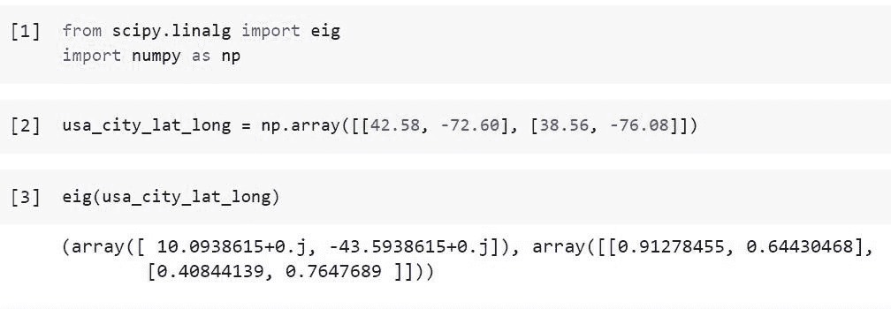
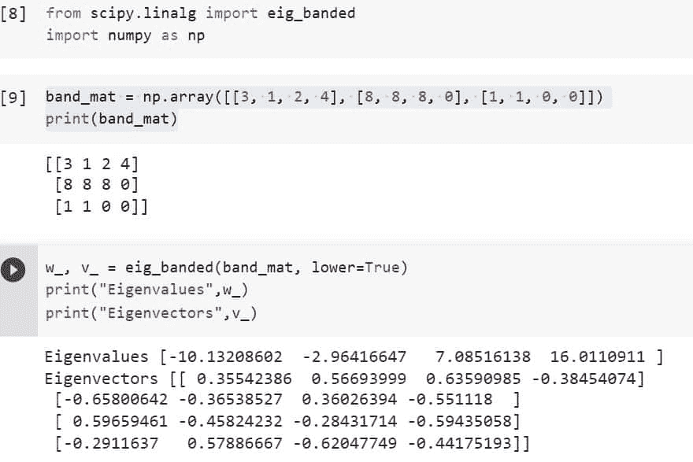
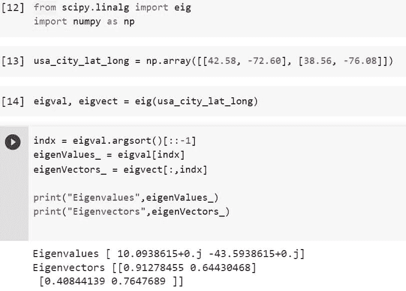
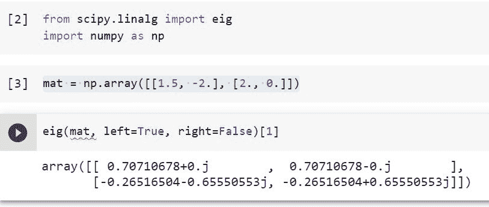
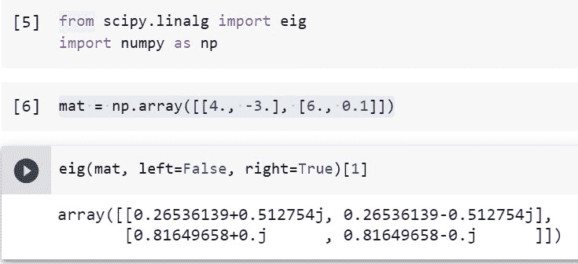

# Python Scipy Linalg 指令

> 原文：<https://pythonguides.com/python-scipy-linalg-eig/>

[](https://sharepointsky.teachable.com/p/python-and-machine-learning-training-course)

我们将学习“ **Python Scipy Linalg Eig** ”，它可以计算矩阵或带状矩阵的特征值或左或右特征向量，以及如何对这些值进行排序。此外，我们将讨论以下主题。

*   Python Scipy Linalg 指令
*   Python Scipy Linalg Eig Banded
*   Python Scipy Linalg 对八
*   Python Scipy 的特征值和特征向量如何排序
*   如何获得 Python Scipy Eig 左特征向量
*   如何求 Python Scipy Eig 右特征向量

目录

[](#)

*   [Python Scipy Linalg Eig](#Python_Scipy_Linalg_Eig "Python Scipy Linalg Eig")
*   [Python Scipy Linalg Eig 带状](#Python_Scipy_Linalg_Eig_Banded "Python Scipy Linalg Eig Banded")
*   [Python Scipy Linalg Eig Vs Eigh](#Python_Scipy_Linalg_Eig_Vs_Eigh "Python Scipy Linalg Eig Vs Eigh")
*   [蟒蛇 Scipy Linalg 卵型品种](#Python_Scipy_Linalg_Eig_Sort "Python Scipy Linalg Eig Sort")
*   [Python Scipy Linalg Eig 左特征向量](#Python_Scipy_Linalg_Eig_Left_Eigenvector "Python Scipy Linalg Eig Left Eigenvector")
*   [Python Scipy Linalg Eig 右特征向量](#Python_Scipy_Linalg_Eig_Right_Eigenvector "Python Scipy Linalg Eig Right Eigenvector")

## Python Scipy Linalg Eig

Python Scipy 的方法`***eig()***`存在于模块`***scipy.linalg***`中，用于识别和解决方阵的普通或广义特征值问题，或寻找一般矩阵的右或左特征向量和特征值(w)。

下面给出了语法。

```py
scipy.linalg.eig(a, b=None, left=False, right=True, overwrite_a=False, overwrite_b=False, check_finite=True, homogeneous_eigvals=False)
```

其中参数为:

*   **a(array_data (M，M)):** 需要确定特征值和特征向量的实矩阵或复矩阵。
*   **b(array_data (M，M)):** 广义特征值问题右侧的矩阵。当缺省值为 None 时，假设单位矩阵。
*   **left(boolean):** 是否计算左特征向量并返回。默认情况下，它是假的。
*   **right(boolean):** 是否计算右特征向量并返回。默认情况下，这是真的。
*   **overwrite_a(boolean):** 是否替换 a 中的数据
*   **overwrite_b(布尔):**是否替换 b 中的数据。
*   **check_finite(boolean):** 如果需要验证输入矩阵只包含有限个数字。禁用可能会提高性能，但如果输入包含无限或 nan，可能会导致问题(崩溃、非终止)。
*   **齐次 _egvals(布尔):**如果 f 为真，则以齐次坐标返回特征值。

方法`***eig()***`返回 ***`w`(特征值，对每一个都重复适当的次数。除非齐次特征值=真，否则形状为(M，)*** 、***`vl`(VL[:，i]列包含对应特征值 w[i]的归一化*左特征向量。仅在左为真时返回)**和 vr **(列 vr[:，i]包含对应于特征值 w[i]的归一化的*右特征向量。仅在 right=True 时返回)*** 。

让我们以下面的步骤为例:

使用下面的 python 代码导入所需的库或方法。

```py
from scipy.linalg import eig
import numpy as np
```

使用下面的代码创建一个包含美国城市经度和纬度的数组，比如`**Greenfield, MA, USA : La = 42.587334, Lo = -72.603416**`、`**Cambridge, MD, USA : La = 38.563461, Lo = -76.085251**`。

```py
usa_city_lat_long = np.array([[42.58, -72.60.], [38.56, -76.08]])
```

现在使用下面的代码将上面创建的数据传递给方法`***eig()***`。



Python Scipy Linalg Eig

从输出中，我们可以看到使用 Python Scipy 的方法`***eig()***`计算出的美国城市的纬度和经度的特征向量和特征值。

阅读 [Python Scipy 稀疏 Csr_matrix](https://pythonguides.com/python-scipy-sparse-csr_matrix/)

## Python Scipy Linalg Eig 带状

模块`***scipy.linalg***`的 Python Scipy 的方法`***eig_banded()***`识别实对称或复埃尔米特带状矩阵的特征值。

带状矩阵，也称为带状矩阵，是一种具有非零元素的稀疏矩阵，在数学上，它被限制在由主对角线和零条或多条对角线组成的对角线带中。

下面给出了语法。

```py
scipy.linalg.eig_banded(a_band, lower=False, eigvals_only=False, overwrite_a_band=False, select='a', select_range=None, max_ev=0, check_finite=True)
```

其中参数为:

*   **a _ band():**M 乘 M 的矩阵`a`的带
*   **lower(boolean):** 是矩阵的下级形式。(默认为大写形式)。
*   **eigvals_only(boolean):** 不计算特征向量，只计算特征值。(默认情况下，也会计算特征向量)。
*   **overwrite _ a_band(boolean):**从 a _ band 中删除数据。
*   **select_range(min，max):** 选择一个特征值范围。
*   **选择(v，I，a):** 需要计算哪些特征值，a 为所有特征值，I 为最小< = i < =最大指数的特征值，v 为范围[(min，max]内的特征值。
*   **max_ev(int):** 预计 select=='v '的特征值的最大数量。与任何其他选择值无关。如果有疑问，忽略这个论点。
*   **check_finite(boolean):** 是否确定输入矩阵只有有限个数字。禁用可能会提高性能，但如果输入包含无限或 nan，可能会导致问题(崩溃、非终止)。

方法`***eig_banded()***`返回 ***`w`(特征值按照它们的重数以递增顺序重复)******`v`(列 v[:，i]包含对应于特征值 w[i]的归一化特征向量)*** 。

让我们举一个例子，通过以下步骤计算带矩阵的特征值:

使用下面的 python 代码导入所需的库或方法。

```py
from scipy.linalg import eig
import numpy as np
```

使用下面的代码创建一个低阶的带状矩阵。

```py
band_mat = np.array([[3, 1, 2, 4], [8, 8, 8, 0], [1, 1, 0, 0]])
print(band_mat)
```

使用下面的代码计算带状矩阵的特征值或特征向量。

```py
w_, v_ = eig_banded(band_mat, lower=True)
print("Eigenvalues",w_)
print("Eigenvectors",v_)
```



Python Scipy Linalg Eig Banded

这就是如何使用 Python Scipy 的方法`***eig_banded()***`计算实对称或复厄米带矩阵的特征值或特征向量。

读取 [Python Scipy Lognormal](https://pythonguides.com/python-scipy-lognormal/)

## Python Scipy Linalg Eig Vs Eigh

保证特征值通过**“eigh()”**排序，这也采用了受益于矩阵的对称性质的更快算法。如果你确定你的矩阵是对称的，使用这个函数。

我们要知道 **"eigh()"** 默认情况下只使用你矩阵的最低三角分量，假设上三角部分是由矩阵的对称性决定的。

我们可以验证 **"eig()"** 使用较慢的算法，因此通过使用例如 IPython 的神奇命令`***%timeit***`对一般矩阵有效。我们还会看到，一般来说，如果我们用更大的矩阵进行测试，这里的特征值是不排序的。

## 蟒蛇 Scipy Linalg 卵型品种

方法`***eig()***`没有任何属性来对返回值的特征向量和特征值进行排序。为了对特征值或特征向量进行排序，我们将利用 NumPy 方法`***numpy.argsort***`。

例如，我们将使用我们在上述小节**“Python Scipy Lialg Eig”**中所做的相同示例。

使用下面的 python 代码导入所需的库或方法。

```py
from scipy.linalg import eig
import numpy as np
```

使用下面的代码创建一个包含美国城市经度和纬度的数组，比如`**Greenfield, MA, USA : La = 42.587334, Lo = -72.603416**`、`**Cambridge, MD, USA : La = 38.563461, Lo = -76.085251**`。

```py
usa_city_lat_long = np.array([[42.58, -72.60.], [38.56, -76.08]])
```

现在使用下面的代码将上面创建的数据传递给方法`***eig()***`。

```py
eigval, eigvect = eig(usa_city_lat_long)
```

使用下面的代码对特征值和特征向量进行排序。

```py
indx = eigval.argsort()[::-1]   
eigenValues_ = eigval[indx]
eigenVectors_ = eigvect[:,indx]

print("Eigenvalues",eigenValues_)
print("Eigenvectors",eigenVectors_) 
```



Python Scipy Linalg Eig Sort

两个变量`***Eigenvalues and Eigenvectors***`显示了上面输出中的排序值。

这就是如何应用 NumPy 的方法`***argsort()***`对特征值和特征向量进行排序。

阅读 [Python Scipy IIR 滤波器](https://pythonguides.com/python-scipy-iir-filter/)

## Python Scipy Linalg Eig 左特征向量

Python Scipy 的方法`***eig()***`接受 boolean 类型的参数`***left***`，如果该参数设置为 True，那么`***eig()***`返回规范化的左特征向量。

下面给出了语法。

```py
scipy.linalg.eig(a, left=False)
```

其中参数为:

*   **a(array_data (M，M)):** 需要确定特征值和特征向量的实矩阵或复矩阵。
*   **left(boolean):** 是否计算左特征向量并返回。默认情况下，它是假的。

让我们举一个例子，按照以下步骤计算给定矩阵的左特征向量:

使用下面的 python 代码导入所需的库或方法。

```py
from scipy.linalg import eig
import numpy as np
```

使用下面的代码创建一个矩阵。

```py
mat = np.array([[1.5, -2.], [2., 0.]])
```

现在将上面的矩阵传递给方法`***eig()***`，参数`***left***`等于`True`，使用下面的代码计算左特征向量。

```py
eig(mat, left=True, right=False)[1]
```



Python Scipy Linalg Eig Left Eigenvector

这就是如何使用 Python Scipy 的方法`***eig()***`和参数`***left***`计算矩阵的左特征向量。

阅读 [Python Scipy Butterworth 过滤器](https://pythonguides.com/python-scipy-butterworth-filter/)

## Python Scipy Linalg Eig 右特征向量

Python Scipy 的方法`***eig()***`接受 boolean 类型的参数`***right***`，如果该参数设置为 True，那么`***eig()***`返回规范化的右特征向量。

下面给出了语法。

```py
scipy.linalg.eig(a, right=False)
```

其中参数为:

*   **a(array_data (M，M)):** 需要确定特征值和特征向量的实矩阵或复矩阵。
*   **right(boolean):** 是否计算右特征向量并返回。默认情况下，这是真的。

让我们举一个例子，按照以下步骤计算给定矩阵的右特征向量:

使用下面的 python 代码导入所需的库或方法。

```py
from scipy.linalg import eig
import numpy as np
```

使用下面的代码创建一个矩阵。

```py
mat = np.array([[4., -3.], [6., 0.1]])
```

现在将上面的矩阵传递给方法`***eig()***`，参数`***right***`等于`True`，使用下面的代码计算左特征向量。

```py
eig(mat, left=False, right=True)[1]
```



Python Scipy Linalg Eig Right Eigenvector

这就是如何使用 Python Scipy 的方法`***eig()***`和参数`***right***`计算矩阵的右特征向量。

除了学习如何计算和排序实对称矩阵或埃尔米特矩阵或带状矩阵的特征值和特征向量，我们还学习了如何确定矩阵的精确左右特征向量，主题如下。

*   Python Scipy Linalg 指令
*   Python Scipy Linalg Eig Banded
*   Python Scipy Linalg 对八
*   Python Scipy 的特征值和特征向量如何排序
*   如何获得 Python Scipy Eig 左特征向量
*   如何求 Python Scipy Eig 右特征向量

您可能会喜欢以下 Python Scipy 教程:

*   [Python Scipy Stats Fit](https://pythonguides.com/python-scipy-stats-fit/)
*   [Python Scipy 集群 Vq](https://pythonguides.com/python-scipy-cluster-vq/)
*   [Python Scipy 曲线拟合](https://pythonguides.com/python-scipy-curve-fit/)
*   [Python Scipy Load Mat File](https://pythonguides.com/python-scipy-load-mat-file/)
*   [Python Scipy 衍生的数组](https://pythonguides.com/python-scipy-derivative-of-array/)
*   [python scipy tttest _ in】的缩写](https://pythonguides.com/python-scipy-ttest_ind/)

[Bijay Kumar](https://pythonguides.com/author/fewlines4biju/)

Python 是美国最流行的语言之一。我从事 Python 工作已经有很长时间了，我在与 Tkinter、Pandas、NumPy、Turtle、Django、Matplotlib、Tensorflow、Scipy、Scikit-Learn 等各种库合作方面拥有专业知识。我有与美国、加拿大、英国、澳大利亚、新西兰等国家的各种客户合作的经验。查看我的个人资料。

[enjoysharepoint.com/](https://enjoysharepoint.com/)[](https://www.facebook.com/fewlines4biju "Facebook")[](https://www.linkedin.com/in/fewlines4biju/ "Linkedin")[](https://twitter.com/fewlines4biju "Twitter")