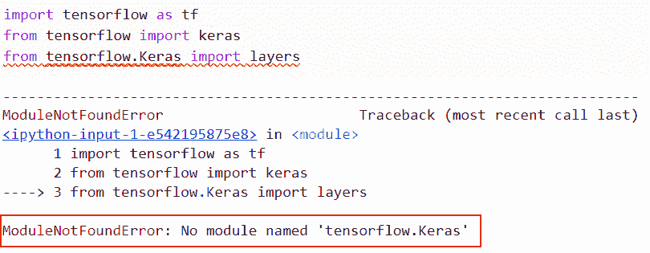
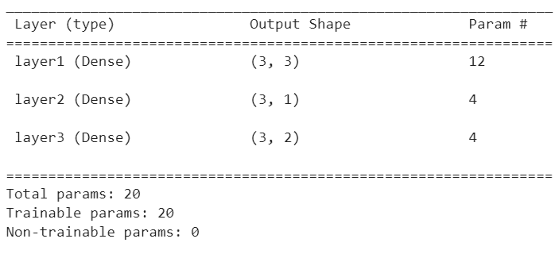
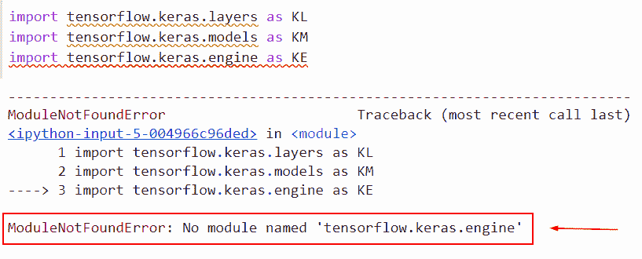
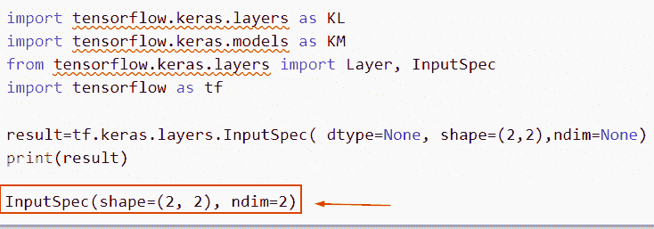
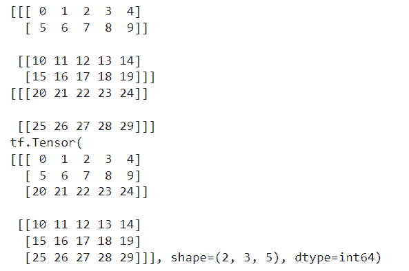
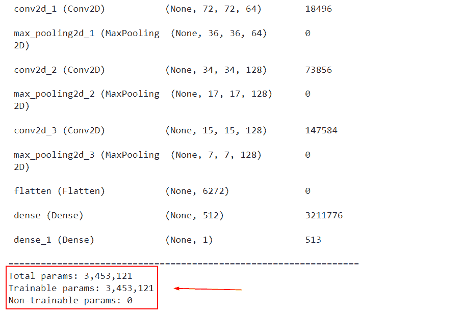
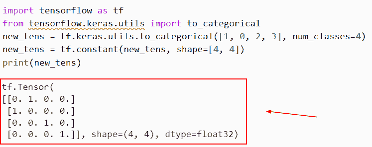
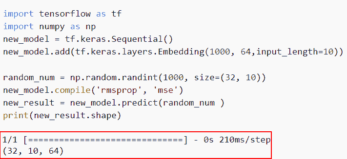
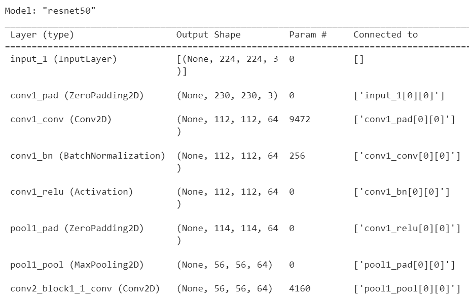

# Modulenotfounderror no module named tensorflow Keras

> 原文：<https://pythonguides.com/modulenotfounderror-no-module-named-tensorflow-keras/>

[](https://sharepointsky.teachable.com/p/python-and-machine-learning-training-course)

在本 [Python 教程](https://pythonguides.com/learn-python/)中，我们将讨论错误“ ***modulenotfounderror 没有命名为 TensorFlow Keras*** 的模块”。我们还将讨论以下主题:

*   Modulenotfounderror no module named tensorflow Keras
*   Modulenotfounderror 没有名为“tensor flow . keras . layers . experimental . preprocessing”的模块
*   Modulenotfounderror 没有名为“tensorflow.keras.engine”的模块
*   Modulenotfounderror 没有名为“tensorflow.keras.layers.merge”的模块
*   Modulenotfounderror no module named ‘tensorflow.keras.utils.vis_utils’
*   Modulenotfounderror no module named ‘tensorflow.keras.utils.np_utils’
*   Modulenotfounderror 没有名为“tensor flow . keras . layers . embeddings”的模块
*   Modulenotfounderror 没有名为“tensor flow . keras . applications . resnet”的模块
*   Modulenotfounderror 没有名为“tensor flow . keras . layers . recurrent”的模块

目录

[](#)

*   [Modulenotfounderror 没有名为 tensorflow Keras 的模块](#Modulenotfounderror_no_module_named_tensorflow_Keras "Modulenotfounderror no module named tensorflow Keras")
*   [Modulenotfounderror 没有名为“tensorflow.keras.engine”的模块](#Modulenotfounderror_no_module_named_tensorflowkerasengine "Modulenotfounderror no module named ‘tensorflow.keras.engine’")
*   [Modulenotfounderror 没有名为“tensorflow.keras.layers.merge”的模块](#Modulenotfounderror_no_module_named_tensorflowkeraslayersmerge "Modulenotfounderror no module named ‘tensorflow.keras.layers.merge’")
*   [Modulenotfounderror no module named ‘tensorflow.keras.utils.vis_utils’](#Modulenotfounderror_no_module_named_tensorflowkerasutilsvis_utils "Modulenotfounderror no module named ‘tensorflow.keras.utils.vis_utils’")
*   [Modulenotfounderror no module named ‘tensorflow.keras.utils.np_utils’](#Modulenotfounderror_no_module_named_tensorflowkerasutilsnp_utils "Modulenotfounderror no module named ‘tensorflow.keras.utils.np_utils’")
*   [Modulenotfounderror 没有名为“tensor flow . keras . layers . embeddings”的模块](#Modulenotfounderror_no_module_named_tensorflowkeraslayersembeddings "Modulenotfounderror no module named ‘tensorflow.keras.layers.embeddings’")
*   [Modulenotfounderror 没有名为“tensor flow . keras . applications . resnet”的模块](#Modulenotfounderror_no_module_named_TensorFlowkerasapplicationsresnet "Modulenotfounderror no module named ‘TensorFlow.keras.applications.resnet’")
*   [Modulenotfounderror 没有名为‘tensor flow . keras . layers . recurrent’的模块](#Modulenotfounderror_no_module_named_tensorflowkeraslayersrecurrent "Modulenotfounderror no module named ‘tensorflow.keras.layers.recurrent")

## Modulenotfounderror 没有名为 tensorflow Keras 的模块

*   这里我们要讨论的是 **module not found 错误没有名为 TensorFlow 的模块。Keras** 。
*   您可以使用 **tf.keras()** 创建、拟合、测试和应用深度学习模型来生成预测。常见的深度学习任务，如分类和回归预测建模，现在对于只想完成一些事情的典型开发人员来说是触手可及的。

**举例**:

让我们举个例子，看看如何解决名为 TensorFlow 的模块中的**模块未找到错误。Keras** 。

源代码

```py
import tensorflow as tf
from tensorflow import keras
from tensorflow.Keras import layers
```

下面是下面给出的代码的截图。



modulenotfounderror no module named tensorflow Keras

正如您在截图中看到的，输出显示错误 **ModuleNotFoundError:没有名为 tensorFlow 的模块。Keras** 。

**原因:**这个错误是因为没有模块 **tensorflow.keras** ，在任何版本的 tensorflow 中都不工作。

现在让我们来看看这个问题的解决方案。

**解决方案:**

```py
import tensorflow as tf
from tensorflow import keras
from tensorflow.keras import layers

new_model = keras.Sequential(
    [
        layers.Dense(3, activation="relu", name="layer1"),
        layers.Dense(1, activation="relu", name="layer2"),
        layers.Dense(2, name="layer3"),
    ]
)
tens_1 = tf.ones((3, 3))
tens_2 = new_model(tens_1)
new_model.summary()
```

在下面给出的代码中，我们首先导入了 tensorflow 库和 keras 层。接下来，我们使用 ***keras 创建一个模型。序贯()*** 而在这之内，我们提到了具有激活功能的密集层‘relu’。接下来，我们将显示模型的摘要。

你可以参考下面的截图。



Solution of modulenotfounderror no module named tensorflow Keras

这就是我们如何解决 tensorflow 中名为 tensorflow Keras 的错误 modulenotfounderror no 模块。

读取:[属性错误:模块“tensorflow”没有属性“scalar _ summary”](https://pythonguides.com/attributeerror-module-tensorflow-has-no-attribute-scalar_summary/)

## Modulenotfounderror 没有名为“tensorflow.keras.engine”的模块

*   在本节中，我们将讨论名为**tensor flow 的属性错误 modulenotfounderror no 模块。TensorFlow 中的 Keras.engine'** 。
*   使用 Keras 引擎可以减少典型使用场景中所需的用户交互量，并提供清晰、响应迅速的错误通知。

示例:

```py
import tensorflow.keras.layers as KL
import tensorflow.keras.models as KM
import tensorflow.keras.engine as KE
```

下面是以下给定代码的实现



modulenotfounderror no module named tensorflow.keras_.engine

正如您在截图中看到的，输出显示错误 **ModuleNotFoundError:没有名为 tensorFlow 的模块。Keras.engine** 。

**原因**:这个错误是因为没有模块 **tensorflow.keras.engine** ，在最新版本的 tensorflow 中无法使用。

现在让我们来看看这个问题的解决方案。

**解决方案:**

```py
import tensorflow.keras.layers as KL
import tensorflow.keras.models as KM
from tensorflow.keras.layers import Layer, InputSpec

result= tf.keras.layers.InputSpec(dtype=None, shape=(2,2),ndim=None)
print(result)
```

在下面给出的代码中，我们导入了 **'tensorflow 的新模块。Keras.engine'** 来自 **tensorflow.keras.layers** 导入层，InputSpec，这是 tensorflow 中的更新版本。



Solution of modulenotfounderror no module named tensorflow.keras_.engine

在本例中，我们已经讨论了如何解决错误**module 未找到名为 tensorflow.keras_ 的错误模块。发动机**。

阅读: [Attributeerror 模块“tensorflow”没有属性“squared _ difference”](https://pythonguides.com/attributeerror-module-tensorflow-has-no-attribute-squared_difference/)

## Modulenotfounderror 没有名为“tensorflow.keras.layers.merge”的模块

*   这里我们要讨论的 **modulenotfounderror no 模块名为‘tensor flow’。Tensorflow 中的 Keras.layers.merge'** 。
*   在图像中合并图层的过程通常称为“拼合”图像。在图像中，您可以决定是合并所有层还是仅合并部分层。当层被组合时，图像的存储器需求减少。

**举例**:

```py
from keras.layers.merge import concatenate
```

下面是下面给出的代码的截图。


modulenotfounderror no module named tensorflow.keras_.layers.merge

正如您在屏幕截图中看到的，输出显示名为**tensor flow . keras _ . layers . merge**的 modulenotfounderror no 模块。

**原因:**这个错误是因为没有 keras.layers.merge 模块，在最新版本的 tensorflow 中不起作用。

此错误的解决方案

在本例中，我们将使用**TF . keras . layers . concatenate()**函数连接两个输入层。

**语法**:

让我们看看语法，了解如何在 TensorFlow 中使用**TF . keras . layers . concatenate()**函数。

```py
tf.keras.layers.concatenate(
    inputs, axis=-1, **kwargs
)
```

*   它由几个参数组成
    *   **输入**:该参数定义了输入张量的列表。
    *   **轴**:缺省情况下，它取-1 值，并定义串联轴。
    *   ****kwargs** :该参数表示标准层关键字参数。

示例:

```py
import tensorflow as tf
import numpy as np
from keras.layers import concatenate
USA_based_random_num = np.arange(20).reshape(2, 2, 5)
print(USA_based_random_num )
sample_num = np.arange(20, 30).reshape(2, 1, 5)
print(sample_num)

result= tf.keras.layers.concatenate([USA_based_random_num , sample_num],axis=1)
print(result)
```

首先在上面的代码中，我们导入了 tensorflow 和 numpy 库。在本例中，我们定义了一个变量“USA_based_random_num ”,并使用 np.arange()函数创建了一个数组。

接下来，我们使用 tf.keras.layers.concatenate()函数，它将返回一个输入张量，即沿着轴的输入的串联。

下面是以下给定代码的实现。



Solution of modulenotfounderror no module named tensorflow.keras_.layers.merge_

这就是我们如何解决 tensorflow 中名为 tensor flow . keras _ . layers . merge _ 的 modulenotfounderror no 模块的错误解。

阅读:[如何将字典转换为张量张量流](https://pythonguides.com/how-to-convert-dictionary-to-tensor-tensorflow/)

## Modulenotfounderror no module named ‘tensorflow.keras.utils.vis_utils’

*   本例中我们将讨论如何求解 tensorflow 中名为**' tensor flow . keras . utils . vis _ utils '**的 modulenotfounderror no 模块。
*   用 TensorFlow 安装 Keras 有两种方法:安装一个 Python 安装，比如 ActivePython，它附带了数百个广受欢迎的包，比如 Keras 和 TensorFlow。使用 pip 可以同时安装 Keras 和 TensorFlow。

**举例**:

```py
from keras.utils.visualize_util import plot
```

你可以参考下面的截图


modulenotfounderror no module named tensorflow.keras_.utils_.vis_utils

在上面的例子中，这个模块在 tensorflow 版本中并不存在。

以下是此错误的解决方案

```py
from keras import layers
from keras import models
from keras import optimizers

model = models.Sequential()
model.add(layers.Conv2D(32, (3, 3), activation='relu',
                        input_shape=(150, 150, 3)))
model.add(layers.MaxPooling2D((2, 2)))
model.add(layers.Conv2D(64, (3, 3), activation='relu'))
model.add(layers.MaxPooling2D((2, 2)))
model.add(layers.Conv2D(128, (3, 3), activation='relu'))
model.add(layers.MaxPooling2D((2, 2)))
model.add(layers.Conv2D(128, (3, 3), activation='relu'))
model.add(layers.MaxPooling2D((2, 2)))
model.add(layers.Flatten())
model.add(layers.Dense(512, activation='relu'))
model.add(layers.Dense(1, activation='sigmoid'))

model.summary()

from keras import optimizers

model.compile(loss='binary_crossentropy', optimizer=keras.optimizers.RMSprop(learning_rate=0.01))
```

在下面给出的代码中，我们首先导入了模型和优化器。接下来，我们创建了一个顺序模型，其中提到了第一层 conv2d，在这个参数中，我们传递了输入值和激活函数。

之后，我们声明了下一层 max pooling2d，并在其中传递了输入值。

下面是以下给定代码的执行过程



Solution of modulenotfounderror no module named tensorflow.keras_.utils_.vis_utils

正如你在截图中看到的，我们已经讨论了如何解决名为 **tensorflow.keras_ 的错误 modulenotfounderror no 模块。utils_。TensorFlow 中的 vis_utils** 。

阅读:[模块“张量流”没有属性“函数”](https://pythonguides.com/module-tensorflow-has-no-attribute-function/)

## Modulenotfounderror no module named ‘tensorflow.keras.utils.np_utils’

*   本节我们将了解如何求解 tensorflow 中名为**' tensor flow . keras . utils . NP _ utils '**的 modulenotfounderror no 模块。
*   表示各种类别的整数的 numpy 数组(or)向量可以转换为 numpy 数组(or)矩阵，其二进制值和列数等于使用方法 to categorical()的数据中的类别数。

**举例:**

```py
import tensorflow.keras.utils.np_utils
```

下面是以下给定代码的实现


modulenotfounderror no module named tensorflow.keras_.utils_.np_utils

正如您在屏幕截图中看到的，输出显示了 modulenotfounderror no 名为 **tensorflow.keras_ 的模块。utils_。np_utils** 。

**原因**:这个错误是因为没有模块 **tensorflow.keras_。utils_。np_utils** 并且在最新版本的 tensorflow 中不工作。

此错误的解决方案。

在本例中，我们将使用**TF . keras . utils . to _ categorial()**函数，该函数用于将向量转换为二进制类矩阵。

**语法**:

```py
tf.keras.utils.to_categorical(
    y, num_classes=None, dtype='float32'
)
```

*   它由几个参数组成
    *   **y** :从 0 到 num classes–1 的整数包含在一个类似数组的结构中，该结构将被转换成一个矩阵。
    *   **num_classes** :组合的类数。如果没有，这意味着 max(y) + 1。
    *   **dtype** :默认取 float32，定义数据类型。

```py
import tensorflow as tf 
from tensorflow.keras.utils import to_categorical
USA_based_code = tf.keras.utils.to_categorical([1, 0, 2, 3], num_classes=4)
USA_based_code = tf.constant(USA_based_code, shape=[4, 4])
print(USA_based_code)
```

在下面给出的代码中，我们首先将 tensorflow.keras.utils 导入到 _ categorial，然后声明一个变量“USA_based_code ”,并使用 TF . keras . utils . to _ categorial()函数。

下面是下面给出的代码的截图。



Solution of modulenotfounderror no module named tensorflow.keras_.utils_.np_utils

这就是我们如何解决名为 tensorflow.keras_ 的错误 modulenotfounderror no 模块。utils_。张量流中的 np_utils。

阅读:[张量流将稀疏张量转换为张量](https://pythonguides.com/tensorflow-convert-sparse-tensor-to-tensor/)

## Modulenotfounderror 没有名为“tensor flow . keras . layers . embeddings”的模块

*   在此示例中，我们将讨论 tensorflow 中名为“tensor flow . keras . layers . embeddings”的错误 modulenotfounderror no 模块。
*   浮点值的密集向量是一种嵌入(向量的长度是您指定的参数)。嵌入值是可训练的参数，而不是手动指定的(模型在训练期间学习的权重，以同样的方式，模型学习密集层的权重)。

**举例**:

```py
from tensorflow.keras.layers.embeddings import Embedding
```

下面是以下给定代码的实现


modulenotfounderror no module named tensorflow.keras_.layers.embeddings

此错误的解决方案。

在本例中，我们将使用**TF . keras . layers . embedding(**)函数，该函数用于将正数索引转换为密集向量。

**语法**:

```py
tf.keras.layers.Embedding(
    input_dim,
    output_dim,
    embeddings_initializer='uniform',
    embeddings_regularizer=None,
    activity_regularizer=None,
    embeddings_constraint=None,
    mask_zero=False,
    input_length=None,
    **kwargs
)
```

*   它由几个参数组成
    *   **input_dim** :词汇的大小，表示为最大整数索引+1。
    *   **output_dim** :该参数定义了整数值，表示密集嵌入的维数。
    *   **嵌入 _ 初始化器**:这是嵌入矩阵的初始化器。
    *   **mask_zero** :布尔值，表示输入值 0 是否是必须隐藏的唯一“填充”值。这有助于利用循环层，它可以接受不同长度的输入。
    *   如果这是准确的，将会抛出一个异常，并且所有后续的模型层都需要支持屏蔽。如果 mask_zero 设置为 True，则索引 0 不能用于词汇表(输入 dim 应该等于词汇表的大小加 1)。

**举例**:

```py
import tensorflow as tf
import numpy as np
new_model = tf.keras.Sequential()
new_model.add(tf.keras.layers.Embedding(1000, 64,input_length=10))

random_num = np.random.randint(1000, size=(32, 10))
new_model.compile('rmsprop', 'mse')
new_result = new_model.predict(random_num )
print(new_result.shape)
```

你可以参考下面的截图



Solution of modulenotfounderror no module named tensorflow.keras_.layers.embeddings

正如你在截图中看到的，我们已经讨论了如何解决 tensorflow 中名为**tensor flow . keras _ . layers . embeddings**的错误 modulenotfounderror no 模块。

阅读:[模块“tensorflow”没有属性“sparse _ placeholder”](https://pythonguides.com/module-tensorflow-has-no-attribute-sparse_placeholder/)

## Modulenotfounderror 没有名为“tensor flow . keras . applications . resnet”的模块

*   这里我们要讨论的是如何解决 TensorFlow 中名为**' tensor flow . keras . applications . resnet '**的错误 modulenotfounderror no 模块。
*   对于像图像识别这样的应用，使用具有 ResNet 的卷积神经网络。

**举例**:

我们举个例子，检查如何解决 TensorFlow 中名为**' tensor flow . keras . applications . resnet '**的错误 modulenotfounderror no 模块。

**源代码:**

```py
import tensorflow.keras.applications.ResNet
```

下面是以下给定代码的实现。


modulenotfounderror no module named TensorFlow.keras_.applications.resnet

**解决方案**:

以下是此错误的解决方案

```py
import keras
import keras.applications.resnet
from keras.applications.resnet import ResNet50
model = ResNet50(include_top=True, weights='imagenet', input_tensor=None, input_shape=None)
model.summary()
```

下面是以下给定代码的实现



Solution of modulenotfounderror no module named TensorFlow.keras_.applications.resnet

在本例中，我们讨论了 TensorFlow 中名为**tensor flow . keras _ . applications . resnet**的错误模块。

阅读:[模块“tensorflow”没有属性“truncated _ normal”](https://pythonguides.com/module-tensorflow-has-no-attribute-truncated_normal/)

## Modulenotfounderror 没有名为‘tensor flow . keras . layers . recurrent’的模块

本节我们将讨论如何解决 tensorflow 中名为**tensor flow . keras . layers . recurrent**的错误 modulenotfounderror no 模块。

**举例**:

```py
from tensorflow.keras.layers.recurrent import Sequential
```

下面是以下给定代码的实现。


modulenotfounderror no module named tensorflow.keras_.layers.recurrent

正如您在屏幕截图中看到的，输出显示错误 **modulenotfounderror 没有名为“tensor flow . keras . layers . recurrent”的模块**

**原因**:这个错误是因为没有模块**tensorflow . keras . layers . recurrent**，在任何版本的 tensor flow 中都不起作用。

现在让我们来看看这个问题的解决方案

**解决方案:**

```py
import numpy as np
import tensorflow as tf
from tensorflow.keras import Input, Model
from tensorflow.keras.layers import Dense, Flatten, Conv2D

np.random.seed(44)
tf.random.set_seed(44)

new_arr = np.random.rand(4, 32, 32, 3)

input_shape = Input(shape=new_arr.shape[1:])
convolution_layer = Conv2D(filters=8, kernel_size=(3, 3), activation='relu')(input_shape)
flatten = Flatten()(convolution_layer)
feature_map = Dense(8, activation='relu')(flatten)
new_output = Dense(2, activation='softmax')(flatten)
result = Model(inputs=input_shape, outputs=new_output)

result(new_arr)
```

在上面的代码中，我们已经导入了 numpy 和 TensorFlow 库。接下来，我们使用了 **tf.random.set_seed()** 函数。全局和操作级种子是操作使用的随机种子的来源。

当全局种子是预先确定的而操作种子不是预先确定的时，除了全局种子之外，系统确定性地选择一个操作种子来产生不同的随机序列。接下来，我使用了 **conv2d()** 图层，并用 **kernel_size()** 分配滤镜。

之后，我们添加具有输入形状 **8** 和激活函数**‘relu’**的密集层。

下面是以下给定代码的执行过程


Solution of modulenotfounderror no module named tensorflow.keras_.layers.recurrent

还有，多看看一些 Python TensorFlow 教程。

*   [模块“张量流”没有属性“日志”](https://pythonguides.com/module-tensorflow-has-no-attribute-log/)
*   [TensorFlow 全连通层](https://pythonguides.com/tensorflow-fully-connected-layer/)
*   [批量归一化张量流](https://pythonguides.com/batch-normalization-tensorflow/)
*   [TensorFlow feed_dict + 9 个例子](https://pythonguides.com/tensorflow-feed_dict/)

所以，在这个 Python 教程中，我们讨论了错误“ ***modulenotfounderror 没有命名为 TensorFlow Keras*** 的模块”。我们还讨论了以下主题:

*   modulenotfounderror 没有名为“tensor flow . keras . layers . experimental . preprocessing”的模块
*   modulenotfounderror 没有名为“tensorflow.keras.engine”的模块
*   modulenotfounderror 没有名为“tensorflow.keras.layers.merge”的模块
*   modulenotfounderror no module named ‘tensorflow.keras.utils.vis_utils’
*   modulenotfounderror no module named ‘tensorflow.keras.utils.np_utils’
*   modulenotfounderror 没有名为“tensor flow . keras . layers . embeddings”的模块
*   modulenotfounderror 没有名为“tensor flow . keras . applications . resnet”的模块
*   modulenotfounderror 没有名为“tensor flow . keras . layers . recurrent”的模块

[Bijay Kumar](https://pythonguides.com/author/fewlines4biju/)

Python 是美国最流行的语言之一。我已经与 Python 合作了很长一段时间，我在 Tkinter、panases、NumPy、Turtle、Django、Matplotlib、Tensorflow、Scipy、Scikit-Learn 等各种库的工作方面很有经验。我有与美国、加拿大、英国、澳大利亚、新西兰等国家的客户合作的经验。[查看我的个人资料](https://pythonguides.com/about-us/)。

[enjoysharepoint.com/](https://enjoysharepoint.com/)[](https://www.facebook.com/fewlines4biju "Facebook")[](https://www.linkedin.com/in/fewlines4biju/ "Linkedin")[](https://twitter.com/fewlines4biju "Twitter")