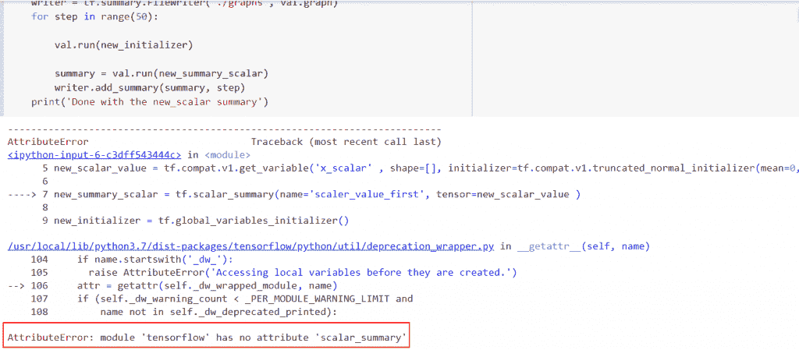
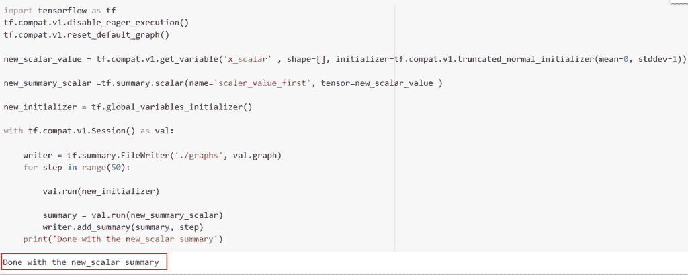
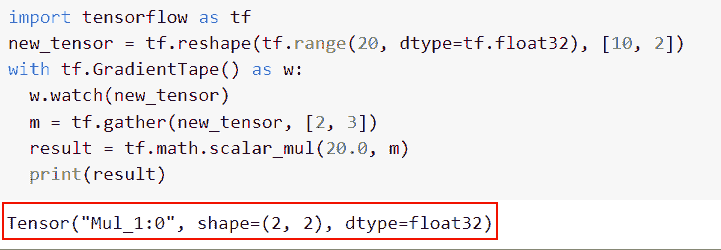
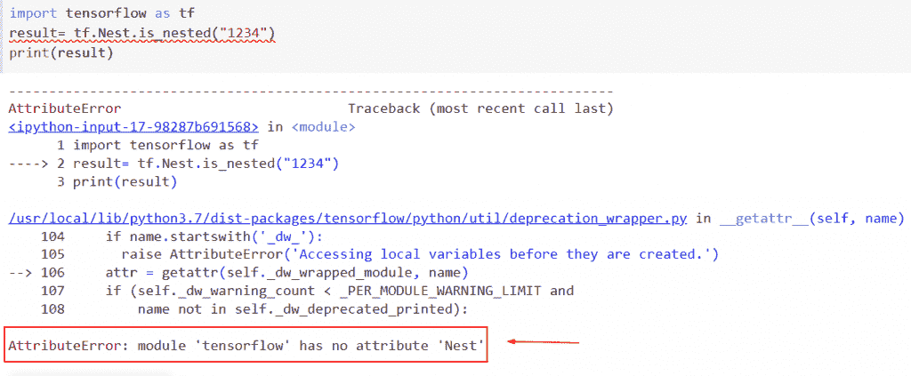
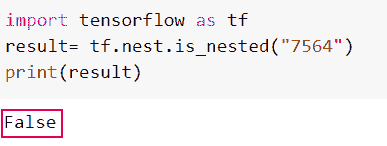
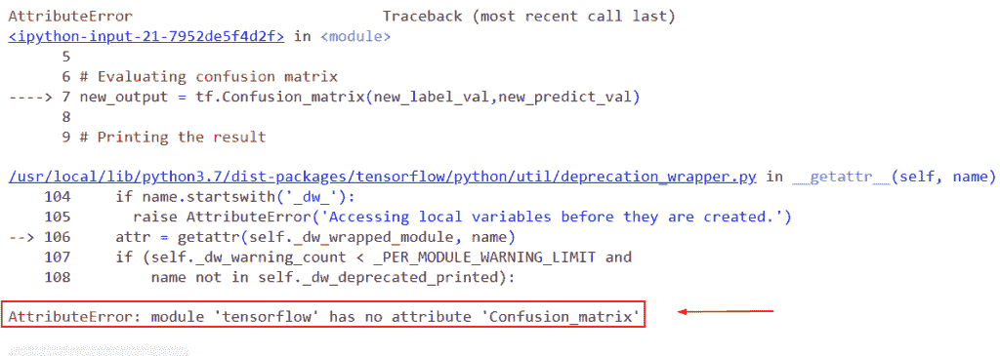

# Attributeerror:模块“tensorflow”没有属性“scalar_summary”

> 原文：<https://pythonguides.com/attributeerror-module-tensorflow-has-no-attribute-scalar_summary/>

[](https://sharepointsky.teachable.com/p/python-and-machine-learning-training-course)

在本文中，我们将讨论如何解决没有属性“scaler _ summmary”的 attributeerror 模块“tensorflow”。让我们讨论一下如何在 TensorFlow 中使用 scalar_summary()函数。我们还将讨论以下主题:

*   Attributeerror:模块“tensorflow”没有属性“scalar_summary”
*   Attributeerror:模块“tensorflow”没有属性“scaler”
*   Attributeerror:模块“tensorflow”没有属性“nest”
*   Attributeerror:模块“tensorflow”没有属性“Confusion_matrix”

目录

[](#)

*   [属性错误:模块“tensorflow”没有属性“scalar _ summary”](#attributeerror_module_tensorflow_has_no_attribute_scalar_summary "attributeerror: module ‘tensorflow’ has no attribute ‘scalar_summary’")
*   [属性错误:模块“tensorflow”没有属性“scaler”](#attributeerror_module_tensorflow_has_no_attribute_scaler "attributeerror: module ‘tensorflow’ has no attribute ‘scaler’")
*   [属性错误:模块“tensorflow”没有属性“nest”](#attributeerror_module_tensorflow_has_no_attribute_nest "attributeerror: module ‘tensorflow’ has no attribute ‘nest’")
*   [属性错误:模块“tensorflow”没有属性“混淆 _ 矩阵”](#attributeerror_module_tensorflow_has_no_attribute_Confusion_matrix "attributeerror: module ‘tensorflow’ has no attribute ‘Confusion_matrix’")

## 属性错误:模块“tensorflow”没有属性“scalar _ summary”

*   在本节中，我们将讨论如何解决 attributeerror 模块“tensorflow”没有属性“scalar_summary”。
*   该名称以任何活动名称范围为前缀，将成为用于 TensorBoard 的摘要标签。

**举例**:

```
import tensorflow as tf
tf.compat.v1.disable_eager_execution()
tf.compat.v1.reset_default_graph()   

new_scalar_value = tf.compat.v1.get_variable('x_scalar' , shape=[], initializer=tf.compat.v1.truncated_normal_initializer(mean=0, stddev=1))

new_summary_scalar = tf.scalar_summary(name='scaler_value_first', tensor=new_scalar_value )

new_initializer = tf.global_variables_initializer()

with tf.compat.v1.Session() as val:

    writer = tf.summary.FileWriter('./graphs', val.graph)
    for step in range(50):

        val.run(new_initializer)

        summary = val.run(new_summary_scalar)
        writer.add_summary(summary, step)
    print('Done with the new_scalar summary')
```

在下面给出的代码中，我们导入了别名为“tf”的 tensorflow 库，然后使用了 tf.compat.v1.get_variable()函数，如果不存在，该函数 tf.get variable()会生成一个具有所请求的形状和初始值的变量，如果不存在，则返回具有所请求的形状和初始值的变量。

下面是以下给定代码的实现



attributeerror module tensorflow has no attribute scalar_summary

以下是此错误的解决方案

原因:此错误的原因是 tf.scalar_summary()函数在 Tensorflow 任何版本中都不可用。现在，在这种情况下，我们使用**TF . s summary . scalar()**函数。

**语法**:

```
tf.summary.scalar(
                  name, 
                  data, 
                  step=None,
                  description=None
                 )
```

*   它由几个参数组成
    *   **名称**:本次总结的标题。此名称加上任何当前名称范围将成为 TensorBoard 的摘要标签。
    *   **数据**:可以转换成 float32 张量的实数标量。
    *   **step** :明确本总结的 int64 和单调步长值。默认情况下，它不接受任何值。
    *   描述:默认情况下，它采用 none 值，这是对此摘要的详细描述。

```
import tensorflow as tf
tf.compat.v1.disable_eager_execution()
tf.compat.v1.reset_default_graph()   

new_scalar_value = tf.compat.v1.get_variable('x_scalar' , shape=[], initializer=tf.compat.v1.truncated_normal_initializer(mean=0, stddev=1))

new_summary_scalar =tf.summary.scalar(name='scaler_value_first', tensor=new_scalar_value )

new_initializer = tf.global_variables_initializer()

with tf.compat.v1.Session() as val:

    writer = tf.summary.FileWriter('./graphs', val.graph)
    for step in range(50):

        val.run(new_initializer)

        summary = val.run(new_summary_scalar)
        writer.add_summary(summary, step)
    print('Done with the new_scalar summary')
```

在这个例子中，我们使用了 **tf.summary.scalar()** 函数，在这个函数中，我们指定了 summary 和 tensor 的名称。接下来，我们将在会话中创建 writer。最后，给作者加上总结。

你可以参考下面的截图



Solution of attributeerror module tensorflow has no attribute scalar_summary

这是如何解决 attributeerror 模块 tensorflow 没有属性 scalar_summary。

读取[属性错误:模块“tensorflow”没有属性“mul”](https://pythonguides.com/module-tensorflow-has-no-attribute-mul/)

## 属性错误:模块“tensorflow”没有属性“scaler”

*   这里我们将讨论如何解决 attributeerror 模块' tensorflow '没有属性会话。
*   标量类型的张量平均值由**标量()**函数产生。scaler 也称为秩 0 张量，是一个零维数组。使用**标量()**函数，产生一个标量。

**举例**:

```
import tensorflow as tf
tf.compat.v1.disable_eager_execution()
tf.compat.v1.reset_default_graph()   

new_scalar_value = tf.compat.v1.get_variable('x_scalar' , shape=[], initializer=tf.compat.v1.truncated_normal_initializer(mean=0, stddev=1))

new_summary_scalar =tf.scalar.summary(name='scaler_value_first', tensor=new_scalar_value )

new_initializer = tf.global_variables_initializer()

with tf.compat.v1.Session() as val:

    writer = tf.summary.FileWriter('./graphs', val.graph)
    for step in range(50):

        val.run(new_initializer)

        summary = val.run(new_summary_scalar)
        writer.add_summary(summary, step)
    print('Done with the new_scalar summary')
```

下面是以下代码的截图


attributeerror module tensorflow has no attribute scaler

此错误的解决方案

在本例中，我们将使用 tf.math.scalar_mul()函数。

**语法**:

```
tf.math.scalar_mul(
                   scalar,
                   x,
                   name=None
                 )
```

*   它由几个参数组成
    *   **标量**:该参数指定已知的形状。
    *   **x** :定义要缩放的输入张量或索引切片。
    *   **name** :默认情况下，取 none 值，指定操作的名称。

```
import tensorflow as tf 
new_tensor = tf.reshape(tf.range(20, dtype=tf.float32), [10, 2])
with tf.GradientTape() as w:
  w.watch(new_tensor)
  m = tf.gather(new_tensor, [2, 3]) 
  result = tf.math.scalar_mul(20.0, m)
  print(result)
```

在下面给定的代码中，我们使用了**TF . shape()**函数将给定的张量整形为想要的形状，使用**TF . shape()**函数。接下来，我们使用了 **tf.math.scalar_mul()** ，从而将一个标量乘以。

你可以参考下面的截图



Solution of attributeerror module tensorflow has no attribute scaler

正如你在截图中看到的，我们已经解决了 attributeerror 模块 tensorflow 没有属性 scaler。

读取[模块“张量流”没有属性“日志”](https://pythonguides.com/module-tensorflow-has-no-attribute-log/)

## 属性错误:模块“tensorflow”没有属性“nest”

*   让我们讨论一下如何解决 attributeerror 模块‘tensor flow’没有属性‘nest’。
*   为了执行这个任务，我们将使用 **tf。Nest()** 函数和任何其他类型的值，通常是兼容类型之一，如 int、float、ndarray 或 TensorFlow 数据类型，如 Tensor、Variable。通常被称为结构的原子。

**举例**:

```
import tensorflow as tf
result= tf.Nest.is_nested("1234")
print(result)
```

下面是以下给定代码的实现



attributeerror module tensorflow has no attribute Nest

此错误的解决方案

原因:这个错误背后的原因是 **tf。Nest()** 函数在 Tensorflow 版本中不起作用，该函数在最新版本的 tensorflow 2.9 中进行了修改，即 **tf.nest()** 。

**源代码**:

```
import tensorflow as tf
result= tf.nest.is_nested("7564")
print(result)
```

你可以参考下面的截图



Solution of attributeerror module tensorflow has no attribute nest

这就是如何解决 attributeerror 模块 tensorflow 没有属性嵌套

读取[模块“tensorflow”没有属性“truncated _ normal”](https://pythonguides.com/module-tensorflow-has-no-attribute-truncated_normal/)

## 属性错误:模块“tensorflow”没有属性“混淆 _ 矩阵”

*   本节我们将讨论如何解决 attributerror 模块' tensorflow '没有属性' confusion_matrix '。
*   在 Python TensorFlow 中，混淆矩阵用于从预测和标签中找到混淆矩阵。
*   一个叫做混淆矩阵的表格被用来描述一个分类系统的表现。分类算法的输出被可视化并总结在混淆矩阵中。

**语法**:

让我们看一下语法并理解 tf.confusion_matrix()函数的工作原理

```
tf.math.confusion_matrix(
    labels,
    predictions,
    num_classes=None,
    weights=None,
    dtype=tf.dtypes.int32,
    name=None
)
```

*   它由几个参数组成
    *   **标签**:对于分类任务，使用真实标签的 1-D 张量。
    *   **预测**:该参数定义了给定分类的预测。
    *   **num_classes** :该参数定义一个分类任务可以使用多少个标签。如果未指定该值，将使用标签数组和预测来确定。
    *   **weights** :默认情况下，它不取任何值，它将检查形状是否与预测相匹配。
    *   **dtype** :默认取 tf.dtypes.int32()，指定混淆矩阵的数据类型。

**举例**:

```
import tensorflow as tf

new_label_val = tf.constant([2,6,7],dtype = tf.int32)
new_predict_val = tf.constant([15,78,2],dtype = tf.int32)

# Evaluating confusion matrix
new_output = tf.Confusion_matrix(new_label_val,new_predict_val)

# Printing the result
print('Confusion_matrix: ',new_output)
```

下面是以下给定代码的实现



Attributeerror module tensorflow has no attribute Confusion_matrix

以下是此错误的解决方案

**原因**:此错误原因 TensorFlow 最新版本中没有此函数，此函数需要几个参数。

```
import tensorflow as tf

new_label_val = tf.constant([2,6,7],dtype = tf.int32)
new_predict_val = tf.constant([15,78,2],dtype = tf.int32)

# Evaluating confusion matrix
new_output = tf.confusion_matrix(new_label_val,new_predict_val)

# Printing the result
print('Confusion_matrix: ',new_output)
```

下面是以下代码的截图


正如你在截图中看到的，我们已经解决了属性错误:模块“tensorflow”没有属性“Confusion_matrix”

在本 Python 教程中，我们讨论了如何求解没有属性“scaler _ summmary”的 attributeerror 模块“tensorflow”。我们来讨论一下如何在 TensorFlow 中使用 **scalar_summary()** 函数。我们还讨论了以下主题:

*   Attributeerror:模块“tensorflow”没有属性“scalar_summary”
*   Attributeerror:模块“tensorflow”没有属性“scaler”
*   Attributeerror:模块“tensorflow”没有属性“nest”
*   Attributeerror:模块“tensorflow”没有属性“Confusion_matrix”

您可能会喜欢以下 Python Tensorflow 教程:

*   [模块“tensorflow”没有属性“get _ variable”](https://pythonguides.com/module-tensorflow-has-no-attribute-get_variable/)
*   [模块“tensorflow”没有属性“div”](https://pythonguides.com/module-tensorflow-has-no-attribute-div/)
*   [模块“tensorflow”没有属性“sparse _ placeholder”](https://pythonguides.com/module-tensorflow-has-no-attribute-sparse_placeholder/)
*   [模块“tensorflow”没有属性“optimizer”](https://pythonguides.com/module-tensorflow-has-no-attribute-optimizers/)
*   [张量流将稀疏张量转换为张量](https://pythonguides.com/tensorflow-convert-sparse-tensor-to-tensor/)

[Arvind](https://pythonguides.com/author/arvind/)

Arvind 目前是 TSInfo Technologies 的高级 Python 开发人员。他精通 Python 库，如 NumPy 和 Tensorflow。