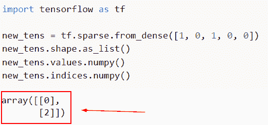
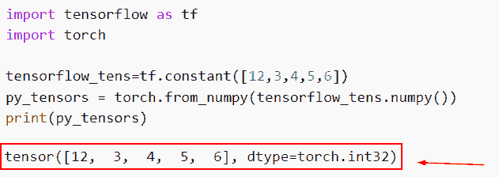
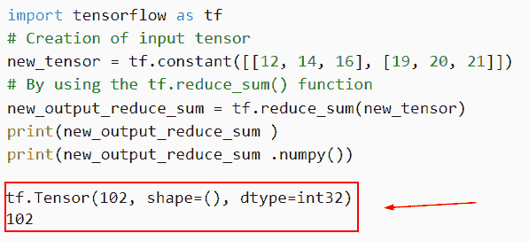
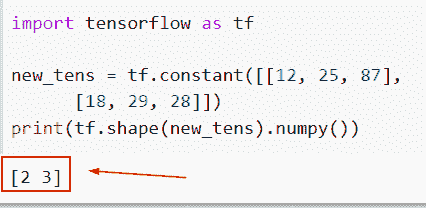
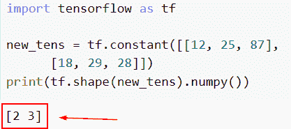

# 张量流将稀疏张量转换为张量

> 原文：<https://pythonguides.com/tensorflow-convert-sparse-tensor-to-tensor/>

[](https://sharepointsky.teachable.com/p/python-and-machine-learning-training-course)

你知道**如何把稀疏张量转换成张量**吗，我们会在 Python 中讨论稀疏张量和一个张量。稀疏张量数据集是其中大多数条目为零的数据集；这方面的一个例子是一个大的对角矩阵。(其中大部分为零)。

*   张量流将稀疏张量转换为张量
*   张量流将张量转换为稀疏张量
*   将张量流张量转换为 torch 张量
*   张量流将张量转换为数字
*   张量流将张量转换为维度
*   张量流张量长度

目录

[](#)

*   [Tensorflow 将稀疏张量转换为张量](#Tensorflow_convert_sparse_tensor_to_tensor "Tensorflow convert sparse tensor to tensor")
*   [将张量转换为稀疏张量](#Convert_tensor_to_sparse_tensor "Convert tensor to sparse tensor")
*   [如何将张量流张量转换为 torch 张量](#How_to_Convert_tensorflow_tensor_to_torch_tensor "How to Convert tensorflow tensor to torch tensor")
*   [将张量转换为数字](#Convert_Tensor_to_a_number "Convert Tensor to a number")
*   [将张量转换为维度](#Convert_Tensor_to_dimensions "Convert Tensor to dimensions")
*   [张量流张量长度](#TensorFlow_tensor_length "TensorFlow tensor length")

## Tensorflow 将稀疏张量转换为张量

*   在本节中，我们将讨论如何在 [Python TensorFlow](https://pythonguides.com/tensorflow/) 中将稀疏张量转换为张量。
*   被称为稀疏张量的数据集是其中大多数条目为零的数据集；这方面的一个例子是一个大的对角矩阵。(其中大部分为零)。存储非零值及其相关坐标，而不是张量对象的整组值。

**语法**:

以下是给定代码的语法

```
tf.sparse.to_dense(
    sp_input, default_value=None, validate_indices=True, name=None
)
```

**举例**:

```
import tensorflow as tf
new_tensor = tf.SparseTensor(dense_shape=[3, 5],values=[7, 8, 9],indices =[[0, 1],[0, 3],[2, 0]])
result=tf.sparse.to_dense(new_tensor).numpy()
print(result)
```

在这个例子中，我们导入了 tensorflow 库，然后使用 tf 创建了一个张量。SparseTensor()函数，在这个函数中，我们指定了 dense_shape、值和索引。

接下来，为了将稀疏张量转换成张量，我们使用了。numpy()函数并显示结果。

下面是以下代码的截图


Tensorflow convert sparse tensor to tensor

这就是我们如何在 Python TensorFlow 中将稀疏张量转换为张量。

阅读:[模块“张量流”没有属性“会话”](https://pythonguides.com/module-tensorflow-has-no-attribute-session/)

## 将张量转换为稀疏张量

*   这里我们将讨论如何在 Python TensorFlow 中将张量转换为稀疏张量。
*   在本例中，我们将使用 **tf.sparse.from_dense()** 函数，该函数用于将密集张量转换为稀疏张量。

**语法**:

下面是 Python TensorFlow 中***TF . sparse . from _ dense()***函数的语法

```
tf.sparse.from_dense(
    tensor, name=None
)
```

*   它由几个参数组成
    *   **张量**:该参数定义了要转换为稀疏张量的输入张量和密集张量。
    *   **name** :该参数定义了操作的名称，默认为 none。

**举例**:

```
import tensorflow as tf

new_tens = tf.sparse.from_dense([1, 0, 1, 0, 0])
new_tens.shape.as_list()
new_tens.values.numpy()
new_tens.indices.numpy()
```

你可以参考下面的截图



Convert tensor to sparse tensor

正如你在截图中看到的，输出显示了张量到稀疏张量的转换。

阅读:[张量流得到形状](https://pythonguides.com/tensorflow-get-shape/)

## 如何将张量流张量转换为 torch 张量

*   让我们讨论如何在 Python TensorFlow 中将 TensorFlow 张量转换为 torch 张量。
*   在这个例子中，我们将使用 torch.from_numpy()函数，这个 numpy 数组可以使用 torch.from numpy()函数转换成 PyTorch 中的张量。
*   它预期一个 NumPy 数组(numpy.ndarray)的输入。张量是输出格式。返回的张量和 ndarray 使用的内存是相同的。没有办法调整返回张量的大小。

**语法**:

下面是 Python 中的 **torch.from_numpy()** 函数的语法

```
torch.from_numpy(ndarray)
```

注意:它只包含一个参数，并且指定 NumPy 数组。

**例子**

```
import tensorflow as tf
import torch

tensorflow_tens=tf.constant([12,3,4,5,6])
py_tensors = torch.from_numpy(tensorflow_tens.numpy())
print(py_tensors)
```

在下面给出的代码中，我们首先导入了所有必需的库，然后使用 tf.constant()函数创建了一个张量。接下来，我们要将张量流张量转换为 PyTorch 张量。为此，我们使用了 torch.from_numpy()函数，并在该函数中为其指定了张量。

下面是以下代码的截图



How to Convert tensorflow tensor to torch tensor

这就是我们如何在 Python TensorFlow 中将 tensorflow 张量转换为 torch 张量。

阅读:[Python tensor flow reduce _ sum](https://pythonguides.com/python-tensorflow-reduce_sum/)

## 将张量转换为数字

*   在这一节中，我们将讨论如何把张量转换成数字。
*   为了完成这项任务，我们将使用 tf.reduce_sum()函数，该函数用于计算所有维度的张量元素总和。

**语法**:

让我们看一下语法并理解 Python TensorFlow 中 tf.reduce_sum()函数的工作原理。

```
tf.math.reduce_sum(
    input_tensor, axis=None, keepdims=False, name=None
)
```

*   它由几个参数组成
    *   **input_tensor** :该参数定义了输入张量，用于减少张量。
    *   **轴**:默认情况下，不取值，降维，检查条件，如果不取值，则降维，所有维度必须在[-rank(input_tensor)，rank(input_tensor)]范围内。
    *   **keepdims** :如果为真，则保留长度为 1 的缩减维度。
    *   **name** :默认情况下，取 none 值，指定操作的名称。

**举例**:

让我们举一个例子，检查如何将输入张量转换为数字。

**源代码**:

```
import tensorflow as tf
# Creation of input tensor
new_tensor = tf.constant([[12, 14, 16], [19, 20, 21]])
# By using the tf.reduce_sum() function
new_output_reduce_sum = tf.reduce_sum(new_tensor)
print(new_output_reduce_sum ) 
print(new_output_reduce_sum .numpy())
```

在下面给出的代码中，我们首先导入 TensorFlow 库，然后通过使用 **tf.constant()** 函数创建一个输入张量，在这个函数中，我们将整数值指定为一个参数。

接下来，我们要将张量转换成一个数字，为此我们使用了 tf.reduce_sum()函数，并将张量作为一个参数。

下面是下面给出的代码的截图。



Convert TensorFlow to a number

在这个例子中，我们已经讨论了张量流到数字的转换。

阅读: [Python TensorFlow 随机均匀](https://pythonguides.com/tensorflow-random-uniform/)

## 将张量转换为维度

*   这里我们将讨论如何在 Python TensorFlow 中将输入张量转换为维度。
*   为了执行这个任务，我们将使用 **tf.shape()** 函数，这个函数返回一个包含给定张量形状的张量。

**语法**:

让我们看看语法，了解一下 Python TensorFlow 中 tf.shape()函数的工作原理。

```
tf.shape(
    input,
    out_type=tf.dtypes.int32,
    name=None
)
```

*   它由几个参数组成
    *   **输入**:该参数定义输入张量并应用于函数。
    *   **out_type** :默认取 ***tf.dtypes.int32*** ，是该操作指定的输出类型。
    *   **name** :该参数定义了操作的名称，默认为 none。

**举例**:

```
import tensorflow as tf

new_tens = tf.constant([[12, 25, 87],
      [18, 29, 28]])
print(tf.shape(new_tens).numpy())
```

在这个例子中，我们已经通过使用 **tf.constant()** 函数创建了一个张量，然后使用 ***tf.shape()*** 函数获得该张量的维数。

下面是以下给定代码的实现。



Convert Tensor to dimensions

正如你在截图中看到的，我们已经讨论了张量到维度的转换。

阅读:[Python tensor flow expand _ dims](https://pythonguides.com/tensorflow-expand_dims/)

## 张量流张量长度

*   在本节中，我们将讨论如何在 Python TensorFlow 中获取输入张量的长度。
*   通过使用 ***tf.size()*** 函数，它将返回输入张量的大小，这个函数有三个参数。

**语法**:

下面是 Python TensorFlow 中 tf.size()函数的语法。

```
tf.size(
    input,
    out_type=tf.dtypes.int32,
    name=None
)
```

*   它由几个参数组成
    *   **输入**:该参数定义了输入张量，可以是稀疏张量。
    *   **out_type** :默认取 ***tf.dtypes.int32*** ，指定非量化数值输出。
    *   **name** :指定操作的名称，默认情况下不取值。

**举例**:

让我们举一个例子，了解我们如何显示输入张量的长度。

```
import tensorflow as tf

new_tens = tf.constant([[12, 25, 87],
      [18, 29, 28]])
print(tf.shape(new_tens).numpy())
```

你可以参考下面的截图。



TensorFlow tensor length

还有，多看看一些 TensorFlow 教程。

*   [张量低乘法](https://pythonguides.com/tensorflow-multiplication/)
*   [Tensorflow 将字符串转换为整型](https://pythonguides.com/tensorflow-convert-string-to-int/)
*   [张量流获取变量](https://pythonguides.com/tensorflow-get-variable/)
*   [张量流占位符](https://pythonguides.com/tensorflow-placeholder/)
*   [张量流截断法线](https://pythonguides.com/tensorflow-truncated-normal/)
*   [如何将 TensorFlow 转换为 one hot](https://pythonguides.com/convert-tensorflow-to-one-hot/)
*   [将字典转换为张量张量流](https://pythonguides.com/how-to-convert-dictionary-to-tensor-tensorflow/)
*   [熊猫数据帧到张量流数据集](https://pythonguides.com/convert-pandas-dataframe-to-tensorflow-dataset/)

在本 TensorFlow 教程中，我们学习了 ***如何在 Python*** 中将稀疏张量转换为张量。此外，我们还讨论了以下一组示例。

*   张量流将稀疏张量转换为张量
*   如何将张量转换为稀疏张量
*   如何将张量流张量转换为 torch 张量
*   将张量转换为数字
*   将张量转换为维度
*   张量流张量长度

[Bijay Kumar](https://pythonguides.com/author/fewlines4biju/)

Python 是美国最流行的语言之一。我从事 Python 工作已经有很长时间了，我在与 Tkinter、Pandas、NumPy、Turtle、Django、Matplotlib、Tensorflow、Scipy、Scikit-Learn 等各种库合作方面拥有专业知识。我有与美国、加拿大、英国、澳大利亚、新西兰等国家的各种客户合作的经验。查看我的个人资料。

[enjoysharepoint.com/](https://enjoysharepoint.com/)[](https://www.facebook.com/fewlines4biju "Facebook")[](https://www.linkedin.com/in/fewlines4biju/ "Linkedin")[](https://twitter.com/fewlines4biju "Twitter")