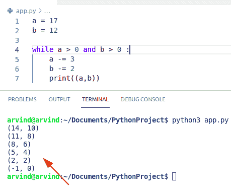
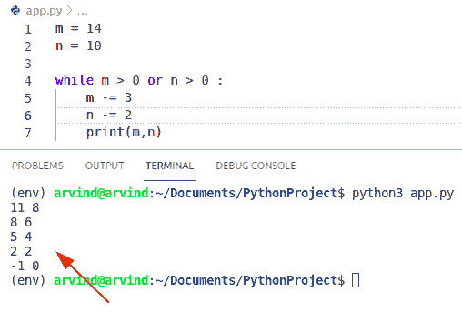
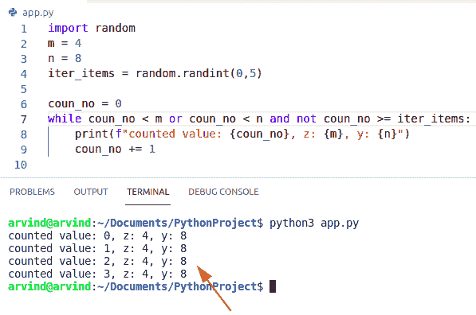
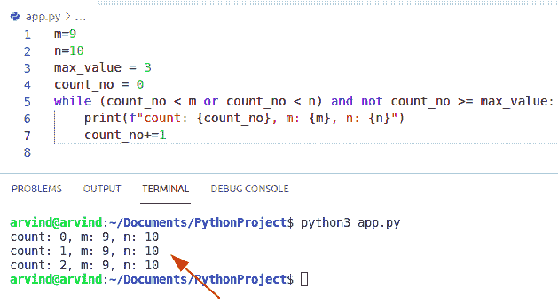

# Python while 循环多个条件

> 原文：<https://pythonguides.com/python-while-loop-multiple-conditions/>

[](https://sharepointsky.teachable.com/p/python-and-machine-learning-training-course)

在本 [Python 教程](https://pythonguides.com/learn-python/)中，我们将讨论 **Python while 循环多个条件。**

目录

[](#)

*   [Python while 循环多个条件](#Python_while_loop_multiple_conditions "Python while loop multiple conditions")
*   [Not 运算符使用 while 循环使用多个条件](#Not_operator_to_use_multiple_conditions_using_while_loop "Not operator to use multiple conditions using while loop")
*   [在 Python 中对多个条件进行分组](#Grouping_multiple_conditions_in_Python "Grouping multiple conditions in Python")

## Python while 循环多个条件

*   让我们看看如何在 Python 中使用 [while 循环来使用**多个条件。**](https://pythonguides.com/python-while-loop/)
*   while 循环用于在块上迭代序列。用户不知道在执行过程中将发生的迭代次数。它可用于需要满足某个条件或表达式才能执行多个语句的问题。
*   使用**和**操作符要求 while 循环执行多个条件。

**语法:**

下面是 Python 中 while 循环的语法。

```
while expression:
     statement(s)
```

**举例:**

让我们举一个例子，并检查如何使用 while 循环来使用多个条件

```
a = 17
b = 12

while a > 0 and b > 0 :
    a -= 3
    b -= 2
    print((a,b))
```

在这个例子中，我们可以很容易地使用 while 循环。现在创建两个变量并给它们赋值。

下面是以下代码的截图



Python while loop multiple conditions

再比如用 while 循环检查**如何使用多个条件。**

*   在这个例子中，我们将使用一个**或**操作符来组合 while 循环条件。
*   在这里，我们可以很容易地使用 OR 逻辑运算符来组合多个条件。
*   逻辑**和** **或**运算符分别对它们求值并考虑它们的结果。while 循环体将执行，并且该条件表达式为真。

**举例:**

让我们举一个例子，看看如何在多种情况下使用 OR 运算符

```
m = 14
n = 10

while m > 0 or n > 0 :
    m -= 3
    n -= 2
    print(m,n)
```

下面是以下代码的截图



Python while loop multiple conditions by or operator

阅读[使用 Python 中的 JSON 数据](https://pythonguides.com/json-data-in-python/)

## Not 运算符使用 while 循环使用多个条件

*   在这个例子中，我们可以很容易地使用逻辑 not 运算符来执行带有多个条件的 Python while 循环。
*   not 运算符反转给定表达式的值。简而言之，如果两个操作数中有一个为真，我们就可以给出条件为真。
*   让我们举一个例子，看看如何在 while 循环多重条件中使用 not 运算符。

```
import random
m = 4
n = 8
iter_items = random.randint(0,5)

coun_no = 0
while coun_no < m or coun_no < n and not coun_no >= iter_items:
    print(f"counted value: {coun_no}, z: {m}, y: {n}")
    coun_no += 1 
```

下面是以下代码的截图



Python while loop multiple conditions by not operator

阅读 Python 中的[排序算法](https://pythonguides.com/sorting-algorithms-in-python/)

## 在 Python 中对多个条件进行分组

*   Python 语句中的多个条件要求同时有几个真条件。在这个例子中，我们可以很容易地在 while 循环条件中使用多个逻辑操作符。
*   在这里，我们可以很容易地使用括号从左到右可视化条件表达式。
*   这可以通过在单个语句中使用“and”和“or”运算符来实现。
*   在本例中，将 **max_value function** 设置为一个小值，以便在多种条件下查看。

**举例:**

```
m=9
n=10
max_value = 3
count_no = 0
while (count_no < m or count_no < n) and not count_no >= max_value:
    print(f"count: {count_no}, m: {m}, n: {n}")
    count_no+=1
```

下面是以下代码的截图



Grouping multiple conditions

您可能会喜欢以下 Python 教程:

*   [Python 中 For 循环 vs while 循环](https://pythonguides.com/for-loop-vs-while-loop-in-python/)
*   [Python For 循环](https://pythonguides.com/python-for-loop/)
*   [Python while 循环继续](https://pythonguides.com/python-while-loop-continue/)
*   [如何在 Python 中使用 For 循环对列表中的元素求和](https://pythonguides.com/sum-elements-in-list-in-python-using-for-loop/)

在本教程中，我们学习了 Python 中的 **while 循环多个条件。**

[Bijay Kumar](https://pythonguides.com/author/fewlines4biju/)

Python 是美国最流行的语言之一。我从事 Python 工作已经有很长时间了，我在与 Tkinter、Pandas、NumPy、Turtle、Django、Matplotlib、Tensorflow、Scipy、Scikit-Learn 等各种库合作方面拥有专业知识。我有与美国、加拿大、英国、澳大利亚、新西兰等国家的各种客户合作的经验。查看我的个人资料。

[enjoysharepoint.com/](https://enjoysharepoint.com/)[](https://www.facebook.com/fewlines4biju "Facebook")[](https://www.linkedin.com/in/fewlines4biju/ "Linkedin")[](https://twitter.com/fewlines4biju "Twitter")