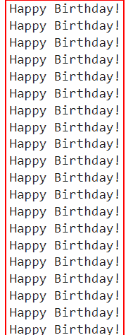
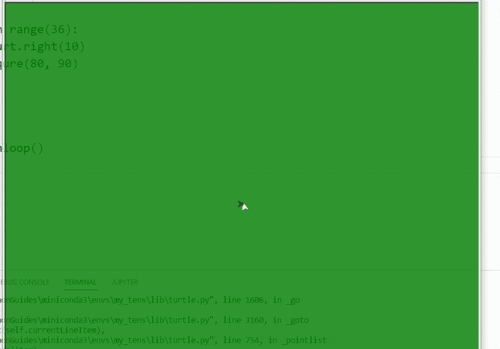
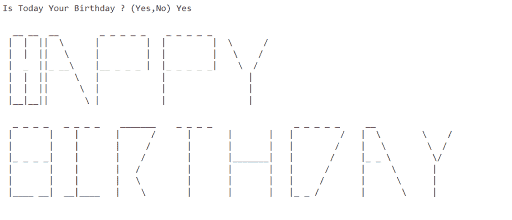

# 生日祝福的 Python 程序

> 原文：<https://pythonguides.com/python-program-for-birthday-wishes/>

[](https://sharepointsky.teachable.com/p/python-and-machine-learning-training-course)

本文将讨论如何用 Python 代码祝某人生日。在本教程中，您将了解 Python 编程的一些基本思想，以及如何使用 Python 代码进行编码的概述。你将编写一个基本程序在屏幕上显示你的生日。

目录

[](#)

*   [生日祝福的 Python 程序](#Python_program_for_birthday_wishes "Python program for birthday wishes")
*   [生日祝福的 Python 代码](#Python_code_for_birthday_wishes "Python code for birthday wishes")
*   [用 Turtle 写生日快乐 Python 程序](#Write_Happy_Birthday_Python_Program_In_Turtle "Write Happy Birthday Python Program In Turtle")
*   [生日祝福使用 python 输入功能](#Birthday_wishes_using_python_input_function "Birthday wishes using python input function")

## 生日祝福的 Python 程序

虽然我们都经常祝我们所爱的人生日快乐，但有些人选择不这样做。他们无法恰当地表达出来，这就是原因。你可以学习如何用 Python 语言说生日快乐。

用 pyfiglet 完成程序生日快乐 Python 程序。

**举例**:

```
import pyfiglet

result = pyfiglet.figlet_format("Happy Birthday to You ", font = "slant"  )

print(result)
```

绕过关键字“slant”作为 figlet format()函数中的字体参数，在这种情况下，我们将以倾斜字体输出输入提供的编码文本。

为了执行这个任务，我们首先要导入 pyfiglet 包。Python 程序可以利用 Pyfiglet 模块的众多函数在输出中生成具有高字体大小和其他格式的精美文本。

要安装您的系统 pyfiglet，您可以很容易地使用下面给出的命令

```
pip install pyfiglet
```

为了显示生日快乐的祝愿，我们将使用 pyfiglet.figlet_format()函数。由于 pyfiglet 模块，我们可以在 Python 示例程序中使用 figlet format()函数。pyfiglet 使用 ASCII 艺术字体呈现 ASCII 文本。

**语法**:

下面是 Python 中 figlet_format()函数的语法

```
pfg.figlet_format('inputText', font = 'typeOfFont') 
```

*   它由几个参数组成:
    *   **inputText** :如果我们传递一个带有输入文本的参数，这个函数会将输入文本转换成输出中的复杂模式文本，输入文本以 ASCII 编码的形式提供。
    *   **font** :默认情况下，取' typeoffont '值，在这个函数中，字体类型是可选参数。该选项指定将在输出中使用的花式文本字体，并且已经编码的输入文本也将使用相同的花式文本模式打印。在本例中，我们将使用 font= "slant "。

下面是以下代码的截图


Python program for birthday wishes

读 [Python 程序求偶数或奇数](https://pythonguides.com/python-program-for-even-or-odd/)

## 生日祝福的 Python 代码

这里是另一个生日祝福的 **python 代码的例子。**

在这个例子中，我们将使用 if 和 elif 条件，我们可以用它来检查几个表达式。如果 if a 条件为假，则检查下一个 elif 块的条件，依此类推。如果所有条件都为假，则执行 else 的主体。

```
import time
from random import randint

for m in range(1,70):
    print('')

for m in range(1,100):
    num = randint(1, 100)
    while(num > 0):

        num -= 1
    if(m%10==0):
        print('Happy Birthday!')
    elif(m%9 == 0):
        print( "Happy Birthday!")
    elif(m%5==0):
        print("Happy Birthday!")
    elif(m%8==0):
        print("Happy Birthday!")
    elif(m%7==0):
        print("Happy Birthday!")
    elif(m%6==0):
        print("Happy Birthday!")
    else:
        print("Happy Birthday!")

    time.sleep(0.2)
```

在下面给定的代码中，我们设置了范围(1，70)并迭代这些值，然后它进入另一个 for 循环，但这次数字的范围是 1 到 100。软件将为每次迭代选择 1 到 10 之间的随机数，并将其添加到“num”变量中。然后，在“num”变量的值变为零之前，将打印空格。

然后，根据模数结果(如果“i%number”等于零，其中数字是 10、9、8、7 或 6)，程序将输出文本或两者都输出。最后，程序会在每次迭代之间小睡 0.2 秒。

下面是以下给定代码的执行过程



Python program for birthday wishes method

读 [Python 程序查闰年](https://pythonguides.com/python-program-to-check-leap-year/)

## 用 Turtle 写生日快乐 Python 程序

首先在这个例子中，我们将使用' tur '导入 [Python turtle](https://pythonguides.com/python-turtle-commands/) 模块，然后将标题命名为“PythonGuides”。接下来，我们将使用绿色作为背景色。在上面的例子中，我们正在定义 ***forward()和 right()*** 函数来绘制一个正方形。

在这段代码中，我们绘制了生日快乐的正方形，保持 15 的长度。笔的颜色和颜色相同，即绿色。正方形的位置被初始化为 goto(80，90)。

```
from turtle import *
import turtle as tur

turt=tur.Turtle()
tur.title("PythonGuides")
turt.width(8)
turt.color("cyan")
new=tur.getscreen()
turt.speed(10)

new.bgcolor("green")

turt.left(180)
turt.penup()
turt.forward(300)
turt.right(90)
turt.forward(100)
turt.pendown()

# Display H

turt.forward(50)
turt.right(90)
turt.forward(50)
turt.left(90)
turt.forward(50)
turt.left(90)

turt.penup()
turt.forward(50)
turt.left(90)
turt.pendown()
turt.forward(50)
turt.left(90)
turt.forward(50)
turt.right(90)
turt.forward(50)

# Display A

turt.penup()
turt.left(90)
turt.forward(15)
turt.pendown()
turt.left(70)
turt.forward(110)
turt.right(70)
turt.right(70)
turt.forward(110)
turt.left(180)
turt.forward(55)
turt.left(70)
turt.forward(38)
turt.left(70)
turt.penup()
turt.forward(55)
turt.left(110)

turt.forward(100)

# Display P

turt.left(90)
turt.pendown()
turt.forward(100)
turt.right(90)
turt.forward(50)
turt.right(20)
turt.forward(20)
turt.right(70)
turt.forward(40)
turt.right(70)
turt.forward(20)
turt.right(20)
turt.forward(50)
turt.left(90)
turt.forward(50)
turt.left(90)
turt.penup()
turt.forward(100)

# Display P

turt.left(90)
turt.pendown()
turt.forward(100)
turt.right(90)
turt.forward(50)
turt.right(20)
turt.forward(20)
turt.right(70)
turt.forward(40)
turt.right(70)
turt.forward(20)
turt.right(20)
turt.forward(50)
turt.left(90)
turt.forward(50)
turt.left(90)
turt.penup()
turt.forward(100)

# Display Y

turt.forward(20)
turt.pendown()
turt.left(90)
turt.forward(50)
turt.left(30)
turt.forward(60)
turt.backward(60)
turt.right(60)
turt.forward(60)
turt.backward(60)
turt.left(30)

# go to Home

turt.penup()
turt.home()

turt.color("yellow")
new.bgcolor("blue")
# setting second row

turt.backward(300)
turt.right(90)
turt.forward(60)
turt.left(180)

# Display P

turt.pendown()
turt.forward(100)
turt.right(90)
turt.forward(50)
turt.right(20)
turt.forward(20)
turt.right(70)
turt.forward(40)
turt.right(70)
turt.forward(20)
turt.right(20)
turt.forward(50)
turt.backward(50)
turt.left(180)
turt.right(20)
turt.forward(20)
turt.right(70)
turt.forward(40)
turt.right(70)
turt.forward(20)
turt.right(20)
turt.forward(50)
turt.right(90)
turt.forward(10)

# go to Home

turt.penup()
turt.home()

# setting up

turt.backward(200)
turt.right(90)
turt.forward(10)
turt.left(90)
turt.pendown()
turt.forward(20)
turt.penup()
turt.home()

# D

turt.backward(150)
turt.right(90)
turt.forward(60)
turt.pendown()
turt.backward(100)
turt.right(90)
turt.forward(10)
turt.backward(70)
turt.left(180)
turt.right(20)
turt.forward(20)
turt.right(70)
turt.forward(88)
turt.right(70)
turt.forward(20)
turt.right(20)
turt.forward(70)

turt.penup()
turt.home()

# set up for A

turt.backward(50)
turt.right(90)
turt.forward(65)
turt.left(90)

# printing A

turt.pendown()
turt.left(70)
turt.forward(110)
turt.right(70)
turt.right(70)
turt.forward(110)
turt.left(180)
turt.forward(55)
turt.left(70)
turt.forward(38)
turt.left(70)
turt.penup()
turt.forward(55)
turt.left(110)

turt.forward(100)

# printing Y

turt.pendown()
turt.left(90)
turt.forward(50)
turt.left(30)
turt.forward(60)
turt.backward(60)
turt.right(60)
turt.forward(60)
turt.backward(60)
turt.left(30)

# go to Home

turt.penup()
turt.home()

# settig position

turt.right(90)
turt.forward(215)
turt.right(90)
turt.forward(200)
turt.right(90)

#color

turt.color("blue")
new.bgcolor("black")

# setup
turt.penup()
turt.left(90)
turt.forward(80)
turt.left(90)
turt.forward(7)

turt.forward(100)

# design

#design pattern
turt.home()
turt.forward(200)
turt.pendown()
turt.color("PURPLE")
turt.width(3)
turt.speed(0)

def squre(length, angle):

    turt.forward(length)
    turt.right(angle)
    turt.forward(length)
    turt.right(angle)

    turt.forward(length)
    turt.right(angle)
    turt.forward(length)
    turt.right(angle)

squre(80, 90)

for i in range(36):
      turt.right(10)
      squre(80, 90)

tur.mainloop() 
```



Python program Happy birthday wish

阅读 [Python 程序求正方形的面积](https://pythonguides.com/python-program-to-find-the-area-of-square/)

## 生日祝福使用 python 输入功能

下面是另一个用 python 输入生日祝福的函数。

在这个例子中，我们将定义一个名为 birthday_wish 的函数，然后使用 input()函数来获取今天是不是你的生日的消息。如果你输入 yes，它会显示“生日快乐”。

**源代码**:

```
new_str = """
  __ __  __        _ _ _ _ _    _ _ _ _ _               
 |  |  ||  \      |         |  |         |  \      /
 |  |  ||   \     |         |  |         |   \    /  
 |  _  ||_ __\    |__ _ _ _ |  |_ _ _ _ _|    \  /     
 |  |  ||     \   |            |                |
 |  |  ||      \  |            |                |
 |__|__||       \ |            |                |

  _ _ _ _   _ _ _ _    _______    _ _ _ _                _ _ _ _ _     __
 |       |    |       |      /      |       |       |   |         /   |  \        \    /
 |       |    |       |     /       |       |       |   |        /    |   \        \  / 
 |_ _ _ _|    |       |    /        |       |_______|   |       /     |_ _ \        \/
 |       |    |       |   /         |       |       |   |      /      |     \       |
 |       |    |       |   \         |       |       |   |     /       |      \      |
 |____ __|  __|____   |    \        |       |       |   |_ _ /        |       \     |

"""

def birthday_wish():
    result = input("Is Today Your Birthday ? (Yes,No) ")
    if result == 'Yes':
        print(new_str)

birthday_wish()
```

下面是以下给定代码的实现



Python program birthday wish

在本 Python 教程中，我们讨论了如何用 Python 代码祝某人生日。在本节中，您学习了作为 Python 程序员如何使用不同的方法发送生日祝福。

您可能会喜欢以下 python 教程:

*   [Python 程序求矩形的面积](https://pythonguides.com/python-program-to-find-an-area-of-a-rectangle/)
*   [Python 程序打印图案](https://pythonguides.com/print-pattern-in-python/)
*   [Python 程序反转字符串的例子](https://pythonguides.com/python-program-to-reverse-a-string/)
*   [Python 程序求 n 个数之和](https://pythonguides.com/python-program-to-find-sum-of-n-numbers/)
*   [Python 程序打印质数](https://pythonguides.com/python-program-to-print-prime-numbers/)

[Arvind](https://pythonguides.com/author/arvind/)

Arvind 目前是 TSInfo Technologies 的高级 Python 开发人员。他精通 Python 库，如 NumPy 和 Tensorflow。