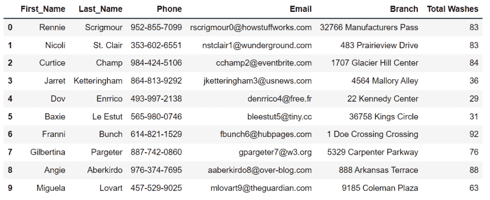
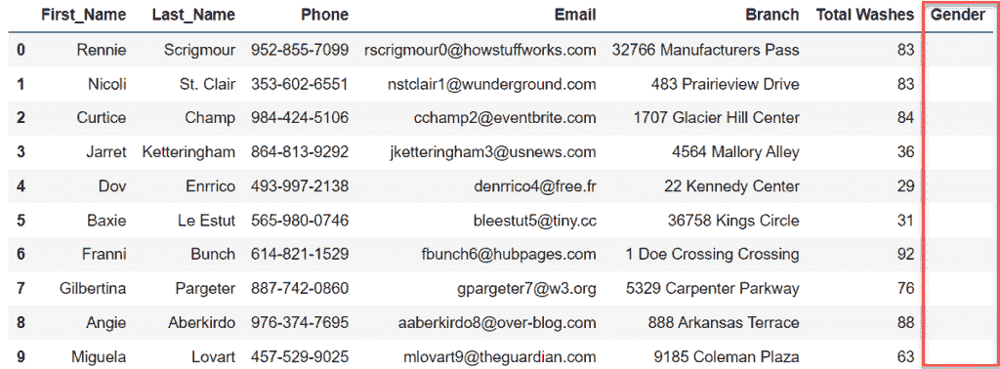
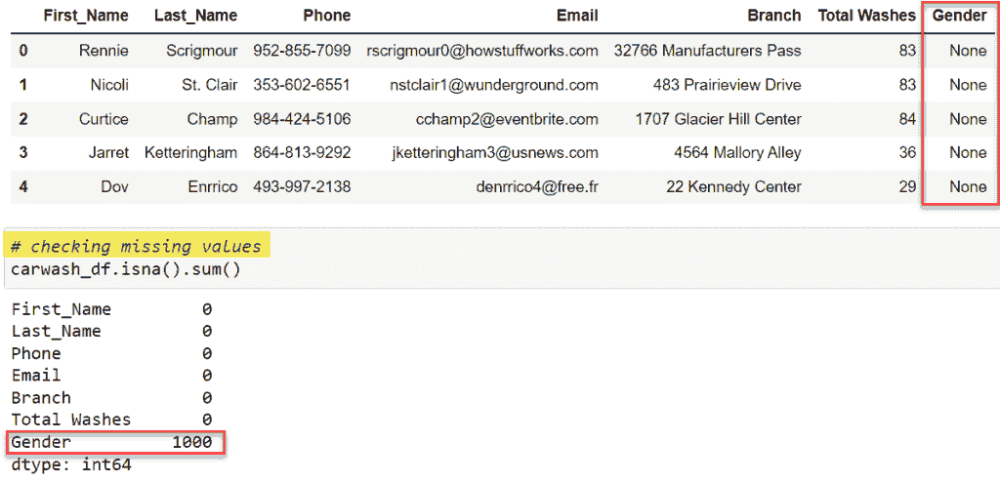

# Python 中如何在数据帧中添加空列

> 原文：<https://pythonguides.com/add-empty-column-dataframe-python/>

[](https://sharepointsky.teachable.com/p/python-and-machine-learning-training-course)

最近，在从事 python pandas 项目时，我遇到了一个场景，我必须在 dataframe 中添加一个空列。这个空列迟早会被项目中的值填充。

所以在这篇 Python 熊猫教程中，我解释了用 Python 在数据帧中添加空列的不同方法。还有，我已经讲了这几点:—

*   在 dataframe python 中添加空列
*   在数据框中的特定位置添加一个新列
*   熊猫创建带有名称的空列
*   向数据框架 pandas 添加多个空列
*   熊猫从列表中添加空列

目录

[](#)

*   [在数据框架 Python 中添加空列](#Add_Empty_Column_in_DataFrame_Python "Add Empty Column in DataFrame Python")
    *   [使用引号向 pandas 数据帧添加一个空列](#Add_an_empty_column_to_pandas_dataframe_using_a_quote "Add an empty column to pandas dataframe using a quote")
    *   [使用 np.nan](#Add_an_empty_column_to_pandas_dataframe_using_npnan "Add an empty column to pandas dataframe using np.nan") 向 pandas 数据帧添加一个空列
    *   [使用 None 向 pandas 数据帧添加一个空列](#Add_an_empty_column_to_the_pandas_dataframe_using_None "Add an empty column to the pandas dataframe using None")
*   [在数据框熊猫的特定位置添加新列](#Add_New_Column_to_DataFrame_Pandas_at_Specific_Position "Add New Column to DataFrame Pandas at Specific Position")
    *   [使用 Insert()方法在数据帧的特定位置添加一列](#Add_a_column_to_the_dataframe_at_a_specific_position_using_the_Insert_method "Add a column to the dataframe at a specific position using the Insert() method")
    *   [使用 reindex()方法在数据帧的特定位置添加一列](#Add_a_column_to_the_dataframe_at_a_specific_position_using_reindex_method "Add a column to the dataframe at a specific position using reindex() method")
*   [向数据帧添加多个空列熊猫](#Add_Multiple_Empty_Columns_to_DataFrame_Pandas "Add Multiple Empty Columns to DataFrame Pandas")
    *   [添加多个空列](#Add_multiple_empty_columns "Add multiple empty columns")
    *   [熊猫从列表中添加空列](#Pandas_Add_Empty_Columns_from_the_List "Pandas Add Empty Columns from the List")
*   [结论](#Conclusion "Conclusion")

## 在数据框架 Python 中添加空列

数据帧是行和列格式的数据集合。在 python 中，可以使用 [Pandas 库](https://pythonguides.com/pandas-in-python/)创建数据帧。熊猫中的空列被称为缺失值，它们用 **NaN** (不是数字)来表示。

Zips Car Wash 是美国一家很受欢迎的汽车清洗公司，他们长期以来一直在维护客户的详细信息。

假设，最近他们决定在数据库中增加一个新的列——性别，这样以后他们就可以找到哪个性别的人经常来洗车。

现在，由于他们正在添加一个新列，因此这个新列将暂时保持为空，随着客户再次访问，他们将尝试用值替换 nan。

让我们了解一下在 dataframe python 中添加空列的最简单方法。阅读完整的博客，了解在 dataframe pandas 中添加空列的其他方法。

我使用一个虚拟洗车数据集来演示如何在 dataframe pandas 中添加一个空列。点击下面的按钮下载数据集。

[Download the Carwash dummy dataset](https://pythonguides.com/wp-content/uploads/2022/10/carwash_dataset.csv)

这是当前数据集的样子，现在我将向该数据集添加一个新的空列——性别。



Add an empty column in the dataframe pandas

### 使用引号向 pandas 数据帧添加一个空列

引号(“”)用于在 python 中创建字符串数据类型。在 python 中，写在引号内的任何内容都将被视为一个字符串，熊猫也是如此。

在下面的代码中， *carwash_df* 是上面显示的数据帧，当使用赋值(=)操作符时，我传递了一个空引号(')，然后创建了新的空列。

```py
carwash_df['Gender'] = ' '
```

或者，当在 python pandas 数据帧中使用双引号时，可以获得相同的结果。

```py
carwash_df['Gender'] = " "
```

**请注意**:–由于 pandas 不会将空字符串视为缺失值，这就是为什么当我在数据集中检查缺失值时，pandas 会为性别列抛出 False。

此外，如下图所示，它在性别列中不显示 nan。



Add Empty Column in DataFrame Python

### 使用 np.nan 向 pandas 数据帧添加一个空列

NaN 指的是丢失的值，没有关于其全名的具体信息。大多数开发者称之为非数字(NaN)。

如果我将向 pandas 数据帧添加一个具有 nan 值的列，这将表示该列为空或者该列没有值。

```py
carwash_df['Gender'] = np.nan
```

确保在执行上述代码之前导入 NumPy。如果您遇到导入错误——没有名为 numpy 的模块，则通过 Pip 或 Conda 安装 NumPy。了解更多信息[导入错误–没有名为 numpy](https://pythonguides.com/python-numpy-not-found/) 的模块

在上面代码片段的输出中，性别列缺少值(NaN)。


Add Empty Column in DataFrame Python pandas

### 使用 None 向 pandas 数据帧添加一个空列

“无”( None)作为单词 suggest 不表示任何东西，用作占位符。创建 value=None 的列表示该列在 python pandas 中是空的。熊猫会将 *None* 视为缺失值。



Add an empty column to the pandas dataframe using None

在这一节中，我解释了在 dataframe pandas python 中添加空列的三种方法。熊猫可以遵循相同的方法来创建其他带有名称的空列。在这里您可以用 python pandas 显示客户的全名。

阅读 [Python 熊猫掉行示例](https://pythonguides.com/python-pandas-drop-rows-example/)

## 在数据框熊猫的特定位置添加新列

之前，我在洗车数据帧中添加了一个新列*性别*。这个新栏目是最后加的。所以现在，公司想把专栏移到 python pandas 中的特定位置。

目标是将索引 2 中的性别列移位。有三种方法可以在数据框的特定位置添加新列:-

*   删除现有列，然后使用 python pandas 中的 Insert()方法在 dataframe pandas 的特定位置添加一个新列。
*   在 python pandas 中使用 **reindex()** 方法更改现有列的位置。

我将向您展示在 python pandas 中的特定位置添加列的两种方法。阅读完整的博客。

### 使用 Insert()方法在数据帧的特定位置添加一列

在我在数据帧中插入新列之前，确保重复的列已经被删除，以避免混淆。因为，因为，我恢复了上面的例子，所以这里是删除它的代码。

```py
**# remove Gender Column**
carwash_df_test = carwash_df.drop(columns=['Gender']) 
```

**注意:–***car wash _ df _ test*是新创建的数据帧，用于存储 *carwash_df* 的副本。

现在让我们使用 python pandas 中的 *insert()* 方法在 dataframe pandas 的特定位置添加一个新列。

```py
carwash_df_test.insert(
    loc=2, 
    column='Gender', 
    value=None
)
```

**参数描述:**

*   **loc** :要添加新列的索引号
*   **列**:列的名称
*   **Value** :此处提供的值将应用于该列的所有行。无将显示无。

下图中的输出显示在 python pandas 中 index=2 处添加了新的列 Gender。


Pandas insert an empty column at a specific position

当您想要在特定位置向 dataframe pandas 添加新列时，这种方法非常理想。

### 使用 reindex()方法在数据帧的特定位置添加一列

python pandas 中的 reindex()方法允许将现有列从一个位置重新定位或移动到另一个位置。

我们在这里使用 *carwash_df* ,它已经在末尾显示了性别列，如下图所示。


Add a column to the dataframe at a specific position using reindex() method

**代码片段:**

下面是实现 reindex 来更改 python pandas 中的*性别*列的位置的代码。

```py
carwash_df = carwash_df.reindex(columns=['First_Name', 'Last_Name', '**Gender**', 'Phone', 'Email', 'Branch ', 'Total Washes'])
```

请注意*性别*一栏，我们已经放在 python 熊猫里的具体位置了。

**参数描述:**

*   **列**:提供列名新排列的列列表。

下图显示了上述代码的输出，这里的*性别*列在 python pandas 中从 index=6 变为 index=2。


Pandas insert an empty column at a specific position

当您想要在特定位置向 dataframe pandas 添加现有列时，这种方法非常理想。

至此，我们已经学习了熊猫在特定位置插入一个空列。

阅读[如何在 Python Pandas](https://pythonguides.com/python-pandas-drop-duplicates/) 中使用 drop_duplicates()函数删除重复项

## 向数据帧添加多个空列熊猫

Zips 洗车公司在美国各州有多家分公司。此外，他们决定在英国、瑞士、意大利、西班牙和德国等一些欧洲国家扩张。

因此，现在他们想在数据帧 pandas 中添加多列完整的分支地址。这些是他们想要添加到熊猫数据框架中的新列:

*   街道
*   城市/城镇
*   州/省/地区
*   邮政编码
*   纬度
*   经度

这是一些必须添加到 *carwash_df* 中的列。有两种方法可以将多个空列添加到数据框中

1.  添加多个空列
2.  熊猫从列表中添加空列

让我们继续探索这两种方法，并理解如何在 python pandas 中添加多个列。

### 添加多个空列

通过传递两个列表中所有列的名称，可以在 python pandas 中创建多个空列，如下面的代码片段所示。

所有空列的值都是 None，也可以用 **np.nan** 、**引号(')、(" ")**来代替 None。

```py
carwash_df[['Street', 'City', 'State', 'Zip code', 'Latitude', 'Longitude']] = None
```


Add multiple empty columns in python pandas

### 熊猫从列表中添加空列

空列的列表可以循环添加到 pandas 数据帧中。在 python 中，我们有 for & while 循环，使用它可以从列表中添加空列。

在下面的代码片段中，我们演示了从列表中添加空列的 for 和 while 循环。分配给每列的默认值是 None。您可以将它们从 None 更改为 missing values (np.nan)或空字符串(' ')。

```py
**# list of new columns**
new_col = ['Street', 'City', 'State', 'Zip code', 'Latitude', 'Longitude']

**# add empty columns using for loop**
for i in new_col:
    carwash_df_test[i] = None

**# drop the columns**
carwash_df_test.drop(columns=new_col)

**# add empty columns using while loop** 
while len(new_col) < 0:
    test = carwash_df_test[i] = None
```


Pandas Add Empty Columns from the List

这不，你还可以用 python 中的内置操作——assign()，apply()，insert()，reindex()给 dataframe pandas 添加多个空列。

[Download the Car wash Dataset](https://pythonguides.com/wp-content/uploads/2022/10/carwash_dataset.csv)[Download the complete ipynb file](https://pythonguides.com/wp-content/uploads/2022/10/How-to-Add-Empty-Column-in-DataFrame-Python.zip)

## 结论

在本教程中，我们学习了在 dataframe 中添加空列的各种方法。我们已经探索了使用空字符串、None 和 missing values (nan)在 dataframe 中添加新列。此外，我们还讨论了以下主题:

*   在 dataframe python 中添加空列
*   在数据框中的特定位置添加一个新列
*   熊猫创建带有名称的空列
*   向数据框架 pandas 添加多个空列
*   熊猫从列表中添加空列

您可能会喜欢以下 Python 熊猫教程:

*   [Python 熊猫 CSV 教程](https://pythonguides.com/python-pandas-csv/)
*   [Python 中熊猫缺失数据](https://pythonguides.com/missing-data-in-pandas/)
*   [Python 熊猫中的交叉表](https://pythonguides.com/crosstab-in-python-pandas/)
*   [Python 熊猫中的 group by](https://pythonguides.com/groupby-in-python-pandas/)
*   [如何在 Python 中使用 Pandas drop()函数](https://pythonguides.com/pandas-drop/)

[Vineet Singh](https://pythonguides.com/author/vineet/)

有 4 年 IT 经验的机器学习工程师。我在多个领域工作过，我唯一的目标是简化技术。目前，我在 Tsinfo Technologies 工作，是一名 Python 开发人员，我的职业是程序员、博客作者和 YouTuber，我正在努力让这个世界变得更美好。