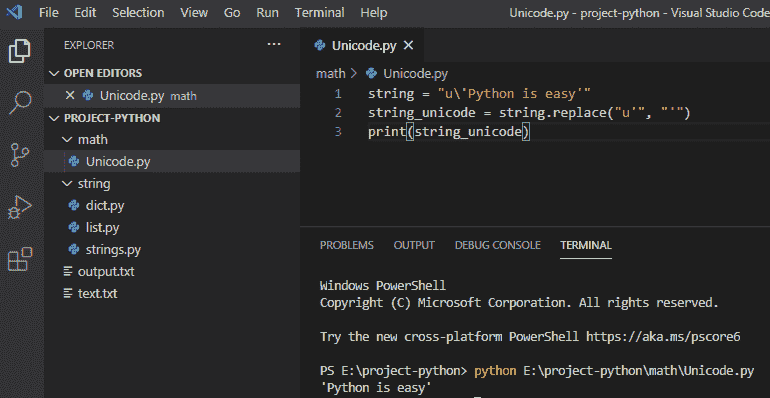
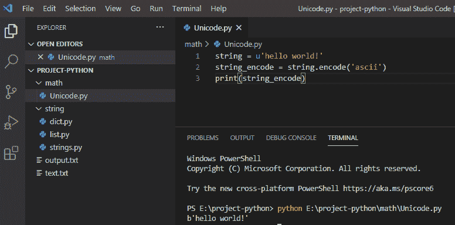
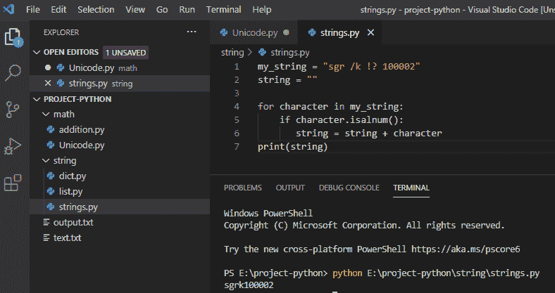
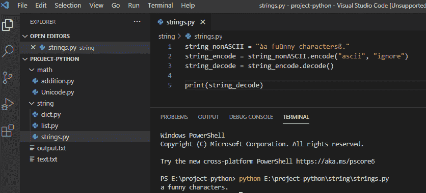

# 移除 python 中的 Unicode 字符

> 原文：<https://pythonguides.com/remove-unicode-characters-in-python/>

[](https://sharepointsky.teachable.com/p/python-and-machine-learning-training-course)

在本 [Python 教程](https://pythonguides.com/python-download-and-installation/)中，我们将讨论如何**移除 python** 中的 unicode 字符。此外，我们还将讨论:

*   从字符串 python 中移除 Unicode 字符
*   Python 从字符串中删除了 Unicode“u”
*   移除 python 字符串中的特殊字符
*   移除 python 中的非 ASCII 字符

目录

[](#)

*   [从字符串](#Remove_Unicode_characters_in_python_from_string "Remove Unicode characters in python from string")中删除 python 中的 Unicode 字符
*   [Python 从字符串中移除 Unicode“u”](#Python_remove_Unicode_u_from_string "Python remove Unicode “u” from string")
*   [删除 python 字符串中的特殊字符](#Remove_special_characters_in_python_string "Remove special characters in python string")
*   [删除 python 中的非 ASCII 字符](#Remove_non-ASCII_characters_in_python "Remove non-ASCII characters in python")

## 从字符串中删除 python 中的 Unicode 字符

在 python 中，要从字符串 python 中删除 Unicode 字符，我们需要使用 **str.encode()** 对字符串进行编码，以便从字符串中删除 Unicode 字符。

**举例:**

```py
string_unicode = " Python is easy \u200c to learn. "
string_encode = string_unicode.encode("ascii", "ignore")
string_decode = string_encode.decode()
print(string_decode)
```

写完上面的代码后(从字符串 python 中删除 Unicode 字符)，你将打印出 **" string_decode "** ，然后输出将显示为 **" Python 很容易学。"**。这里，encode()用于从字符串中移除 Unicode。你可以参考下面的截图来移除字符串 python 中的 Unicode 字符。


remove unicode characters python

## Python 从字符串中移除 Unicode“u”

在 python 中，要从字符串中删除 Unicode **" u "** 字符，我们可以使用 replace()方法从字符串中删除 Unicode " u"。

**举例:**

```py
string = "u\'Python is easy'"
string_unicode = string.replace("u'", "'")
print(string_unicode)
```

写完上面的代码后(python 从一个字符串中删除 Unicode“u”)，你将打印出**“string _ Unicode”**，然后输出将显示为**“Python 很简单。”**。这里，它从字符串中删除了 Unicode 码**“u”**。从 string python 中移除 Unicode **" u "** 可以参考下面的截图。



remove unicode characters python

我们也可以，do **python 通过使用 **encode()** 从字符串**中移除 Unicode“u”字符，这里的**“u”**是用别的东西移除的 Unicode。

**举例:**

```py
string = u'hello world!'
string_encode = string.encode('ascii')
print(string_encode)
```

写完上面的代码后(python 从字符串中删除了 Unicode“u”字符)，您将打印出**“string _ encode”**，然后输出将显示为**“b ' hello world！”**。这里，它用别的东西从字符串中删除了 Unicode 字符**“u”**。你可以参考下面的截图来移除字符串 python 中的 Unicode **" u "** 字符。



Python remove Unicode “u” character from a string

这是怎么做到的，我们可以从字符串 **中 ****去除 Unicode“u”字符。******

阅读:[用 Python 把 PDF 文件转换成 Docx](https://pythonguides.com/convert-pdf-file-to-docx-in-python/)

## 删除 python 字符串中的特殊字符

在 python 中，为了删除 python 字符串中的特殊字符，我们使用 isalnum()从字符串中删除特殊字符。特殊字符可以是空格、标点符号或斜线。

**举例:**

```py
my_string = "sgr /k !? 100002"
string = ""
for character in my_string:
if character.isalnum():
string = string + character
print(string)
```

写完上面的代码后(去掉 python 字符串中的特殊字符)，您将打印出 **" string"** ，然后输出将显示为 **" sgrk100002 "** 。在这里，它从字符串中删除特殊字符，并返回一个包含字母和数字的字符串，循环将遍历每个字符。你可以参考下面的截图来移除 python 字符串中的特殊字符。



Remove special characters in python string

这就是我们如何能够**删除 python 字符串**中的特殊字符。

## 删除 python 中的非 ASCII 字符

在 python 中，要去除 python 中的非 ASCII 字符，我们需要使用 **string.encode()** ，编码为 **ASCII** ，错误为 **ignore** ，返回一个没有 **ASCII** 字符的字符串使用 **string.decode()** 。

**举例:**

```py
string_nonASCII = " àa fuünny charactersß. "
string_encode = string_nonASCII.encode("ascii", "ignore")
string_decode = string_encode.decode()
print(string_decode)
```

写完上面的代码(去掉 python 中的非 ASCII 字符)，你将打印出 **" string_decode "** ，然后输出将显示为**"一个有趣的字符。"**。这里，encode()用于从字符串中删除非 ASCII 字符，而 **decode()** 将对字符串进行编码。你可以参考下面的截图来移除 python 中的非 ASCII 字符。



Remove non-ASCII characters in python

这就是我们如何在 python 中**移除** **非 ASCII 字符。**

您可能会喜欢以下 Python 教程:

*   [Python 中的注释行](https://pythonguides.com/comment-lines-in-python/)
*   [偶数或奇数的 Python 程序](https://pythonguides.com/python-program-for-even-or-odd/)
*   [Python 字典追加示例](https://pythonguides.com/python-dictionary-append/)
*   [在 Python 中检查列表是否为空](https://pythonguides.com/check-if-a-list-is-empty-in-python/)
*   [Python 将列表转换成字符串](https://pythonguides.com/python-convert-list-to-string/)
*   [Python 方块一号](https://pythonguides.com/python-square-a-number/)
*   [什么是 Python 字典+用 Python 创建字典](https://pythonguides.com/create-a-dictionary-in-python/)
*   [无换行符的 Python 打印](https://pythonguides.com/python-print-without-newline/)
*   [Python 字典方法+示例](https://pythonguides.com/python-dictionary-methods/)

在本教程中，我们已经讨论了如何在 python 中移除 Unicode 字符。我们用 Python 中的例子讨论了如何移除 [Unicode 字符](https://en.wikipedia.org/wiki/List_of_Unicode_characters)。

[Bijay Kumar](https://pythonguides.com/author/fewlines4biju/)

Python 是美国最流行的语言之一。我从事 Python 工作已经有很长时间了，我在与 Tkinter、Pandas、NumPy、Turtle、Django、Matplotlib、Tensorflow、Scipy、Scikit-Learn 等各种库合作方面拥有专业知识。我有与美国、加拿大、英国、澳大利亚、新西兰等国家的各种客户合作的经验。查看我的个人资料。

[enjoysharepoint.com/](https://enjoysharepoint.com/)[](https://www.facebook.com/fewlines4biju "Facebook")[](https://www.linkedin.com/in/fewlines4biju/ "Linkedin")[](https://twitter.com/fewlines4biju "Twitter")