# Python 回文程序，带例子

> 原文：<https://pythonguides.com/python-palindrome-program/>

[](https://sharepointsky.teachable.com/p/python-and-machine-learning-training-course)

你知道什么是回文吗？在本 [Python 教程](https://pythonguides.com/python-hello-world-program/)中，我们将了解如何编写一个 Python 程序来检查是否是回文。此外，我们将涵盖以下主题。

*   写一个 Python 回文程序串
*   写一个 Python 回文程序号
*   用 loop 写一个 Python 回文程序
*   用递归写一个 Python 回文程序
*   如何写一个最长的回文 Python 程序
*   Python 程序是否为回文
*   写一个 Python 程序检查是否是回文
*   如何在不使用字符串函数的情况下用 python 写一个回文程序
*   用 python 写一个回文程序，使用 reverse 函数
*   写一个 Python 程序来打印 1 到 100 之间的回文数字
*   Python 程序寻找回文单词
*   使用 while 循环用 python 写一个回文程序
*   使用 if else 用 python 写一个回文程序
*   用 python 写一个使用切片的回文程序
*   用 python 写一个使用列表的回文程序

目录

[](#)

*   [Python 回文程序](#Python_palindrome_program "Python palindrome program")
*   [Python 回文程序串](#Python_Palindrome_program_string "Python Palindrome program string")
*   [Python 回文程序号](#Python_Palindrome_program_number "Python Palindrome program number")
*   [Python 回文程序使用循环](#Python_Palindrome_program_using_loop "Python Palindrome program using loop")
*   [Python 回文程序使用递归](#Python_Palindrome_program_using_recursion "Python Palindrome program using recursion")
*   [最长回文 Python 程序](#longest_Palindrome_Python_program "longest Palindrome Python program")
*   [Python 程序是否为回文](#Python_program_for_palindrome_or_not "Python program for palindrome or not")
*   [Python 程序检查是否是回文](#Python_program_to_check_if_it_is_palindrome_or_not "Python program to check if it is palindrome or not")
*   [python 中不使用字符串函数的回文程序](#palindrome_program_in_python_without_using_the_string_function "palindrome program in python without using the string function")
*   [python 回文程序使用反函数](#Palindrome_program_in_python_using_reverse_function "Palindrome program in python using reverse function")
*   [Python 程序打印 1 到 100 之间的回文数字](#Python_Program_to_print_palindrome_numbers_between_1_to_100 "Python Program to print palindrome numbers between 1 to 100")
*   [Python 程序寻找回文单词](#Python_Program_to_find_palindrome_word "Python Program to find palindrome word")
*   [使用 while 循环的 python 回文程序](#palindrome_program_in_python_using_a_while_loop "palindrome program in python using a while loop")
*   [使用 if else 的 python 回文程序](#palindrome_program_in_python_using_if_else "palindrome program in python using if else")
*   [python 中使用切片的回文程序](#Palindrome_program_in_python_using_slicing "Palindrome program in python using slicing")
*   [python 中使用链表的回文程序](#palindrome_program_in_python_using_a_list "palindrome program in python using a list")

## Python 回文程序

*   任何数字或字符串在颠倒后保持不变，称为回文。
*   回文是由字母组成的一个单词或一组数字，当向前和向后阅读时，这些字母拼成同一个单词。Python 回文允许回文单词中包含标点、符号、字母和空格。
*   它通过比较实际单词和单词的反义词来工作，如果存在精确匹配，则匹配值为真。Python 有三种不同形式的回文方法论:数字回文、多词回文和单词回文。
*   比如**“妈妈”**正向或反向都一样。

**举例**:

```py
new_val=input(("Enter a string:"))
if(new_val==new_val[::-1]):
   print("String is a palindrome")
else:
  print("String is Not a palindrome")
```

为了检查回文，上面的程序首先接受用户的输入(使用 input 函数)。接下来，使用切片操作**【start:end:step】**确定字符串是否被反转。在这种情况下，步长值为-1 会反转字符串，并检查字符串是否为回文。

下面是以下给定代码的实现。

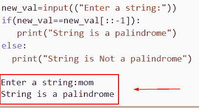

Python palindrome program

这就是我们如何用 Python 创建一个回文程序。

阅读: [Python 字典附加示例](https://pythonguides.com/python-dictionary-append/)

## Python 回文程序串

*   这里我们将讨论如何在回文程序中使用字符串输入。
*   在这个 Python 应用程序中，使用 For 循环迭代字符串中的每个字符。在 for 循环(before)中，每个字符都有一个 str1 值。然后使用 Python if 语句检查回文字符串。

**举例**:

```py
new_str = input("Enter the string value: ")
empty_string = ""

for m in new_str:
    empty_string = m + empty_string
print("Reverse Order :  ", empty_string)

if(new_str == empty_string):
   print("It is a Palindrome String")
else:
   print("It is Not a plaindrome string ")
```

下面是以下代码的截图

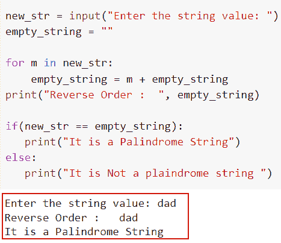

Python Palindrome program string

正如你在截图中看到的，我们在回文程序中使用了字符串输入值。

阅读:[在 Python 中检查列表是否为空](https://pythonguides.com/check-if-a-list-is-empty-in-python/)

## Python 回文程序号

*   当反转时，一个数必须保持不变，才有资格成为回文。如果数字不等于它本身的倒数，它就不是一个回文。
*   整数将被转换为字符串格式，然后字符串将使用这种方法反转。最后一步将涉及验证更改后的号码是否与原始号码一致。
*   要将整数转换成字符串，我们可以很容易地使用 **str()** 函数。通过使用字符串切片，它将反转数字。

**举例**:

```py
new_val=input(("Enter the value:"))
new_reverse = int(str(new_val)[::-1])

if new_val == new_reverse:
  print('It is Not Palindrome')
else:
  print("It is Palindrome")
```

在给定的示例中，我们使用了 input 语句，然后使用了 **str()** 函数将整数值转换为字符串。它将检查条件，如果数字是相反的，那么它将返回一个回文，否则它将返回“这不是一个回文”。

下面是以下给定代码的实现。

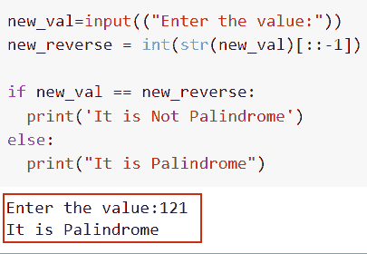

Python Palindrome program number

这是如何在 Python 中使用整数创建回文程序。

阅读: [Python 方块一号](https://pythonguides.com/python-square-a-number/)

## Python 回文程序使用循环

*   让我们用 Python 中的 for 循环创建一个回文程序。
*   如果反数等于同一个数，那么这个元素就叫做回文数。例如 **121=121** 所以，121 是一个回文数。
*   我们将在声明变量时提到整数。然后，它将使用 if-else 语句检查该数是否等于倒数。

**举例**:

```py
new_number = input('Enter the number: ')
n=0
for n in range(len(new_number)):
   if new_number[n]!=new_number[-1-n]:
      print(new_number,'It is not a Palindrome')
      break
   else:
      print(new_number,'It is a Palindrome')
      break
```

你可以参考下面的截图

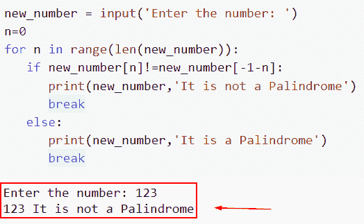

Python Palindrome program using loop

在这个例子中，我们已经了解了如何使用 Python 中的 for 循环来创建回文程序。

阅读: [Python 打印无换行符](https://pythonguides.com/python-print-without-newline/)

## Python 回文程序使用递归

*   当需要确定一个文本是否是回文时，简单的索引和用户定义的函数与递归一起使用。
*   当从右到左和从左到右阅读时，回文是在它们各自的索引中具有相同字符的字符串或值。
*   递归计算较大问题的较小部分的结果，然后组合这些部分以获得较大问题的解决方案。

**举例**:

```py
def check_palindrome(n):
    if len(n) < 1:
        return True
    else:
        if n[0] == n[-1]:
            return check_palindrome(n[1:-1])
        else:
            return False
new_variable = input(("Enter a value: "))
if(check_palindrome(new_variable)):
    print("This is a palindrome")
else:
    print("This is not a palindrome")
```

在下面给出的代码中，我们首先定义了函数**‘check _ palindome’**，在这个括号中，我们传递了关键字**‘n’**作为参数。接下来，我们设置条件，如果数字的长度大于 1，那么它将满足条件 **(n[1:-1])** 。

下面是以下给定代码的执行。

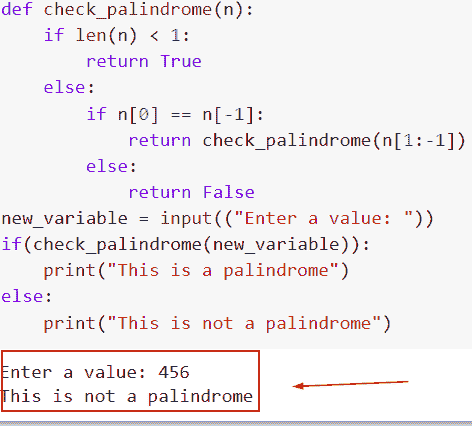

Python Palindrome program using recursion

这是如何使用递归方法创建一个回文程序。

阅读: [11 Python 列表方法](https://pythonguides.com/python-list-methods/)

## 最长回文 Python 程序

*   假设我们有字符串 S，必须定位 S 中最长的回文子串。我们假设字符串 S 的长度为 1000 个字符。因此，如果字符串为**【加州】**，那么**【C】**就是最长的回文子串。

示例:

我们举个例子，看看如何在 Python 中找到最长的回文字符串。

**源代码**:

```py
class program(object):
   def longestPalindrome(self, t):
      new_val = [[False for m in range(len(t))] for m in range(len(t))]
      for  m in range(len(t)):
         new_val[m][m] = True
      new_maximum_length = 1
      initial = 0
      for z in range(2,len(t)+1):
         for m in range(len(t)-z+1):
            end = m+z
            if z==2:
               if t[m] == t[end-1]:
                  new_val[m][end-1]=True
                  new_maximum_length = z
                  start = m
            else:
               if t[m] == t[end-1] and new_val[m+1][end-2]:
                  new_val[m][end-1]=True
                  new_maximum_length = z
                  initial = m
      return t[initial:initial+new_maximum_length]
result = program()
print(result.longestPalindrome("California"))
```

下面是以下给定代码的实现

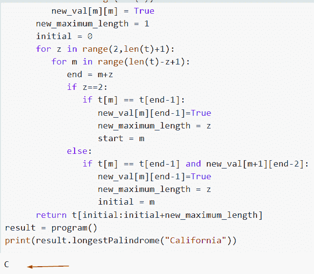

Python Palindrome program stack

阅读:[在 Python 中创建一个空数组](https://pythonguides.com/create-an-empty-array-in-python/)

## Python 程序是否为回文

*   回文是由字母组成的一个单词或一组数字，当向前和向后阅读时，这些字母拼成同一个单词。Python 回文允许在回文单词中使用标点、符号、字母，甚至空格。
*   它通过比较实际单词和单词的反义词来工作，如果存在精确匹配，则匹配值为真。Python 有三种不同形式的回文方法论:数字回文、多词回文和单词回文。
*   首先，我们将读取数字，然后在一个临时变量中，存储字母或数字。接下来，反转数字，并将临时变量与已反转的字母或整数进行比较。
*   如果两个字符或数字相同，打印“该字符串/数字是回文”。“这个字符串/数字不是一个回文”，如果不是，打印。

**举例**:

```py
new_number = 231
rev_number = int(str(new_number)[::-1])

if new_number == rev_number:
  print('It is a Palindrome number')
else:
  print("It is Not a Palindrome number")
```

在下面给定的代码中，我们首先声明变量，并给它赋一个整数。接下来，我们将使用 **str()** 函数，该函数会将整数转换为字符串，并为反数赋值。

接下来，我们设置给定数是否等于反数的条件。如果它是相等的，那么它是一个回文，否则它将显示它不是一个回文数。

你可以参考下面的截图

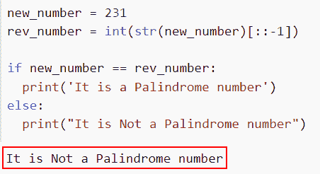

Python program for palindrome or not

这就是我们如何在 Python 中检查程序是否是回文。

阅读:[python 中的无效语法](https://pythonguides.com/invalid-syntax-in-python/)

## Python 程序检查是否是回文

*   这里我们将讨论 Python 中的字符串或数字是否为回文。
*   称为回文数的一组数字在向后读时保持不变。此外，相反，这些数字是对称的。当它们被倒置时，它的数字等于原始数字。例如，数字 **121** 是一个回文。
*   第一步是以相反的顺序编号，第二步我们将与操作前的编号进行比较。

**举例**:

我们举个例子，用 Python 检查一下字符串是不是回文。

**源代码**:

```py
def Palindrome(t):
 return t == t[::-1]

t = "USA"
result = Palindrome(t)

if result:
 print("Yes, It is a Palindrome")
else:
 print("No, It is not a Palindrome")
```

在下面给出的代码中，我们首先定义函数**‘回文’**function，在这个括号内，我们给变量**‘t’**赋值，并设置反向条件 **t[::-1]** 。接下来，我们将结果的条件设置为回文与否。

你可以参考下面的截图。

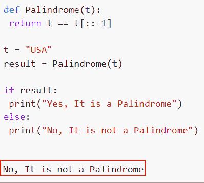

Python program to check if it is a palindrome or not

阅读: [Python 添加示例](https://pythonguides.com/python-addition/)

## python 中不使用字符串函数的回文程序

*   为了检查 Python 中的回文数，我们还可以使用一个函数。如果这个字符串的反向包含相同的字符串，那么这个字符串被称为回文。
*   在这个例子中，我们不打算使用 string 函数，而是声明一个变量并给字符串赋值，在这个变量中我们要检查这个字符串是否是回文。
*   接下来，我们将创建另一个变量，在其中存储反转的字符串，然后我们使用 for-loop 方法并设置条件，如果原始的**数字==反转的**数字。如果相等，那么它是一个回文，否则它将返回它不是一个回文。

**举例**:

```py
b="mom"
c=""
for m in b:
    c=m+c
if c==b:
    print("This word",c,"is palindrome")
else:
    print("It",c,"is not a palindrome")
```

下面是以下给定代码的执行过程

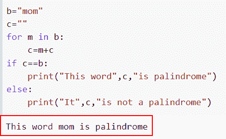

palindrome program in python without using the string function

在这个例子中，我们已经了解了如何在不使用字符串函数的情况下在 Python 中检查回文数。

阅读: [Python 对于基数为 10 的 int()无效文字](https://pythonguides.com/python-invalid-literal-for-int-with-base-10/)

## python 中使用反转函数的回文程序

*   在这个例子中，我们将讨论如何使用 reverse 函数在 Python 中创建一个回文程序。
*   为了执行这个任务，我们将使用 reversed 函数，Python 有一个名为 reversed 的内置方法，可以用来反向获取序列的迭代器。
*   reversed 函数类似于 iter()方法，但顺序相反。用于迭代可迭代对象的对象称为迭代器。iterable 上的 iter 方法允许我们创建迭代器对象。

**举例**:

```py
new_string_value = 'NewYork'  

# This string is reverse.  
result = reversed(new_string_value)  

if list(new_string_value) == list(result):  
   print(" String is PALINDROME !")  
else:  
   print(" String is NOT PALINDROME !") 
```

下面是以下给定代码的实现

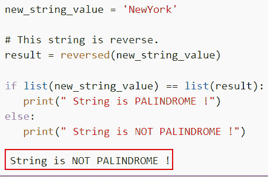

Palindrome program in python using reverse function

这是如何在 Python 中使用 reverse 函数创建回文程序。

阅读: [Python While 循环示例](https://pythonguides.com/python-while-loop/)

## Python 程序打印 1 到 100 之间的回文数字

*   我们来讨论一下如何用 Python 打印 1 到 100 之间的回文数字。
*   当一个数反过来，结果和原来的一样，就说是回文。
*   用户可以使用这个 Python 程序输入上限值。然后程序产生从 1 到用户输入的整数的回文数。首先，我们使用 For 循环在 1 和最大值之间循环。

**举例**:

```py
lower_val = int(input("Enter the Lowest Number : "))
higher_val = int(input("Enter the Highest Number : "))

print("Palindrome Numbers are between 1 and 100")
for new_number in range(lower_val, higher_val + 1):
    new_val = new_number
    original_num = 0

    while(new_val > 0):
        result = new_val % 10
        original_num = (original_num * 10) + result
        new_val = new_val //10

    if(new_number == original_num):
        print("%d " %new_number, end = '  ')
```

在下面首先给出的代码中，我们使用了 input 函数并输入了整数值。接下来，我们从 1 到 100 迭代这些值。

下面是以下给定代码的实现。

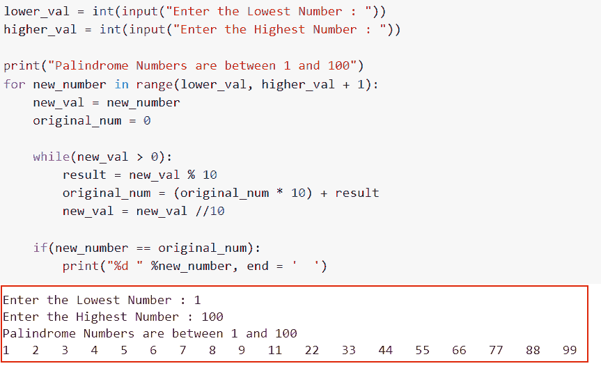

Python Program to print palindrome numbers between 1 to 100

这就是我们如何用 Python 打印 1 到 100 之间的回文数字。

阅读: [Python 检查变量是否为整数](https://pythonguides.com/python-check-if-the-variable-is-an-integer/)

## Python 程序寻找回文单词

*   当反转时，一个数必须保持不变，才有资格成为回文。如果数字不等于它本身的倒数，它就不是一个回文。
*   整数将被转换为字符串格式，然后字符串将使用这种方法反转。最后一步将涉及验证更改后的号码是否与原始号码一致。

**举例**:

```py
new_val=input(("Enter a word:"))
if(new_val==new_val[::-1]):
   print("Word is a palindrome")
else:
  print("Word is Not a palindrome")
```

你可以参考下面的截图

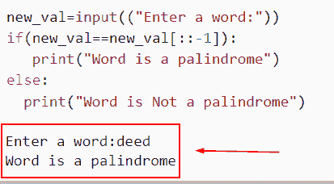

Python Program to find palindrome word

在这个例子中，我们已经理解了如何显示回文单词。

阅读:[检查一个数是否是素数 Python](https://pythonguides.com/check-if-a-number-is-a-prime-python/)

## 使用 while 循环的 python 回文程序

*   在这一节中，我们将讨论如何使用 while 循环概念来显示回文数。
*   Python 中 while 循环的代码块迭代在每次提供的条件或条件表达式为真时运行。

**举例**:

```py
new_num = int(input("Please Enter the number:"))

new_val = 0
i = new_num

while(i > 0):
    Result = i % 10
    new_val  = (new_val  * 10) + Result
    i = i //10

print("Reverse number is = %d" %new_val)
if(new_num == new_val):
    print("%d It is a Palindrome number:" %new_num)
else:
    print("%d It is Not a Pallindrome number:" %new_num)
```

首先，我们将从用户那里获取一个输入数字，然后利用 while 循环来反转一个指定的整数。原数和倒数要比较。如果两个数字完全匹配，则该数字是 Python 回文。

你可以参考下面的截图。

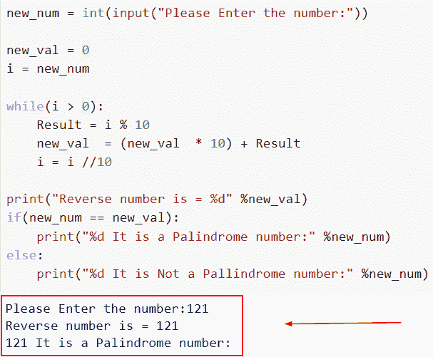

palindrome program in python using a while loop

正如你在截图中看到的，我们已经通过使用 for 循环检查了数字是否是回文。

读取:python 中的[哈希表](https://pythonguides.com/hash-table-in-python/)

## 使用 if else 的 python 回文程序

*   在本节中，我们将讨论如何使用 Python 中的 if-else 条件来检查它是否是一个回文。
*   如前所述，在此过程中将定位反转的字符串，然后将它与原始字符串进行比较。

**举例**:

```py
new_str = input("Enter the string value: ")
empty_string = ""

for m in new_str:
    empty_string = m + empty_string
print("Reverse Order :  ", empty_string)

if(new_str == empty_string):
   print("It is a Palindrome String")
else:
   print("It is Not a plaindrome string ")
```

在这个例子中，我们使用了 input 函数并设置了条件 if(new_str == empty_string):它将检查字符串是否是回文。

下面是以下给定代码的实现。

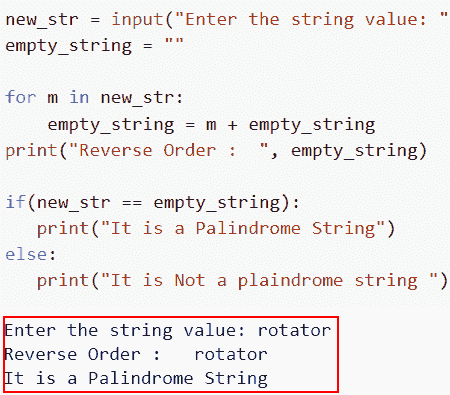

palindrome program in python using if else

这就是我们如何通过使用 if-else 条件来检查数字是否是回文。

阅读:[如何在 Python 中从路径获取文件名](https://pythonguides.com/python-get-filename-from-the-path/)

## python 中使用切片的回文程序

*   在这个例子中，我们将讨论如何使用切片方法返回回文数。
*   为了检查回文，上面的程序首先接受用户的输入(使用 input 函数)。接下来，使用切片操作**【start:end:step】**确定字符串是否被反转。
*   在这种情况下，步长值为-1 会反转字符串，并检查字符串是否为回文。

**举例**:

```py
new_str=input("Enter the value:")
if(new_str==new_str[::-1]):
      print("This is a palindrome number")
else:
      print("This is not a palindrome")
```

下面是以下给定代码的输出

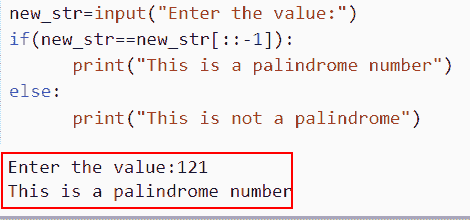

palindrome program in python using slicing

阅读: [Python if else with examples](https://pythonguides.com/python-if-else/)

## python 中使用链表的回文程序

*   在这一节中，我们将讨论如何使用 list 并检查它是否是一个回文。
*   定义了一个名为“检查回文列表”的方法，它接受一个字符串作为参数。将原始字符串与反转后的字符串进行比较。
*   列表是在方法之外定义的，显示在控制台上，它是重复的，在转换为字符串之前，使用“join”技术将元素连接在一起，并在调用方法时传递必要的参数。

**举例**:

```py
def palindrome(new_val):
   if new_val == new_val[::-1]:
      print("This list is not a palindrome")
   else:
      print("This list is a palindrome")

new_list = [121, 'mom', 11, 'rotator', 77]

new_list = ' '.join([str(i) for i in new_list])
palindrome(new_list) 
```

下面是以下给定代码的执行过程

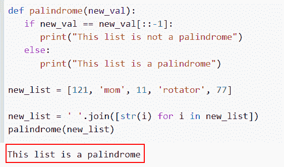

palindrome program in python using a list

这里是一些更相关的 Python 教程的列表。

*   [在 Python 中创建一个元组](https://pythonguides.com/create-a-tuple-in-python/)
*   [偶数或奇数的 Python 程序](https://pythonguides.com/python-program-for-even-or-odd/)
*   [Python 关键字与示例](https://pythonguides.com/python-keywords/)
*   [Python 中的构造函数](https://pythonguides.com/constructor-in-python/)
*   [Python 匿名函数](https://pythonguides.com/python-anonymous-function/)

在这篇文章中，我们讨论了如何在 python 中创建一个回文程序，我们也检查了它是否是回文，我们也讨论了下面的主题。

*   写一个 Python 回文程序串
*   写一个 Python 回文程序号
*   用 loop 写一个 Python 回文程序
*   用递归写一个 Python 回文程序
*   如何写一个最长的回文 Python 程序
*   Python 程序是否为回文
*   写一个 Python 程序检查是否是回文
*   如何在不使用字符串函数的情况下用 python 写一个回文程序
*   用 python 写一个回文程序，使用 reverse 函数
*   写一个 Python 程序来打印 1 到 100 之间的回文数字
*   Python 程序寻找回文单词
*   使用 while 循环用 python 写一个回文程序
*   使用 if else 用 python 写一个回文程序
*   用 python 写一个使用切片的回文程序
*   用 python 写一个使用列表的回文程序

[Bijay Kumar](https://pythonguides.com/author/fewlines4biju/)

Python 是美国最流行的语言之一。我从事 Python 工作已经有很长时间了，我在与 Tkinter、Pandas、NumPy、Turtle、Django、Matplotlib、Tensorflow、Scipy、Scikit-Learn 等各种库合作方面拥有专业知识。我有与美国、加拿大、英国、澳大利亚、新西兰等国家的各种客户合作的经验。查看我的个人资料。

[enjoysharepoint.com/](https://enjoysharepoint.com/)[](https://www.facebook.com/fewlines4biju "Facebook")[](https://www.linkedin.com/in/fewlines4biju/ "Linkedin")[](https://twitter.com/fewlines4biju "Twitter")