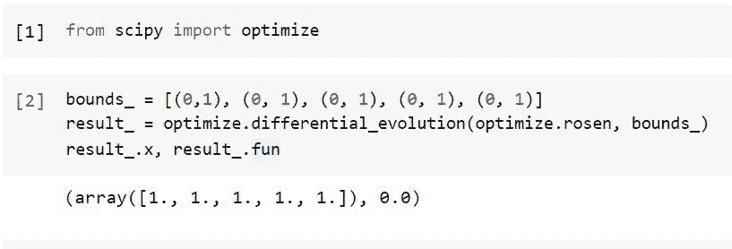
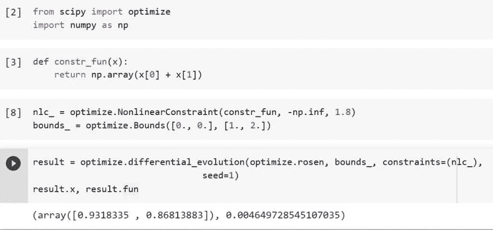
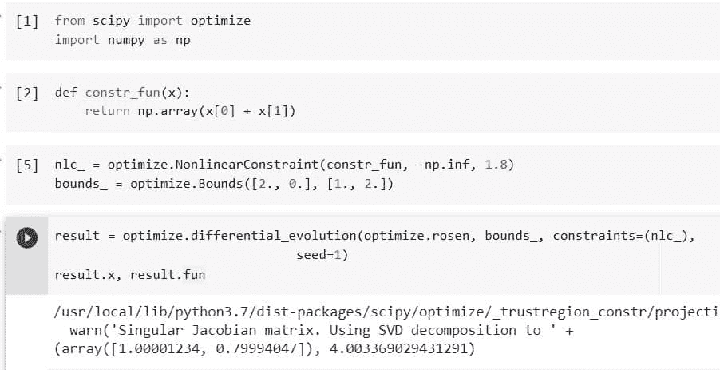

# 如何使用 Python Scipy 差分进化

> 原文：<https://pythonguides.com/scipy-differential-evolution/>

[](https://sharepointsky.teachable.com/p/python-and-machine-learning-training-course)

我们将学习“ ***Python Scipy 差分进化*** ”，差分进化(DE)是一种基于种群的元启发式搜索技术，它基于进化过程迭代地改进潜在的解决方案，以优化问题。还将介绍如何使用不同的策略并行计算解决方案，主题如下。

*   什么是差异进化
*   Python 科学差分进化
*   如何使用不同策略的科学差分进化
*   如何并行执行快速差分进化
*   定义约束并在差异进化中使用它们
*   Python Scipy 差分进化界限

目录

[](#)

*   [什么是差异进化](#What_is_Differential_Evolution "What is Differential Evolution")
*   [Python Scipy 差分进化](#Python_Scipy_Differential_Evolution "Python Scipy Differential Evolution")
*   [Python Scipy 差分进化策略](#Python_Scipy_Differential_Evolution_Strategy "Python Scipy Differential Evolution Strategy")
*   [Python Scipy 差分进化并行](#Python_Scipy_Differential_Evolution_Parallel "Python Scipy Differential Evolution Parallel")
*   [Python Scipy 差分进化约束](#Python_Scipy_Differential_Evolution_Constraints "Python Scipy Differential Evolution Constraints")
*   [Python Scipy 差分进化界限](#Python_Scipy_Differential_Evolution_Bounds "Python Scipy Differential Evolution Bounds")

## 什么是差异进化

差分进化(DE)，一种用于进化计算的技术，寻求迭代地增强关于指定质量度量的候选解。

由于它们可以搜索很宽的潜在解空间，并且对被优化的问题很少或不做假设，这种技术经常被称为元启发式。然而，像 DE 这样的元试探法并不能确保找到理想的解决方案。

不同于传统的优化技术，如梯度下降和拟牛顿法，它们都要求优化问题是可微的，DE 不使用被优化问题的梯度，因此适用于多维实值函数。因此，差分进化可以应用于优化问题，甚至不连续，噪音，随时间变化等。

***DE*** 使用简单的公式来组合当前的候选解，以创建新的候选解，维持候选解的群体，并保留手头的优化任务上具有最高分数或适应度的候选解。

在这种方法中，不需要梯度，因为优化问题被视为“黑箱”,它只提供给定候选解的质量度量。

*   潜在解决方案的群体是差分进化算法的基本变体的运行方式(称为代理)。通过组合群体中当前代理的位置，这些代理使用简单的数学公式在搜索空间中移动。
*   如果一个代理的新位置是一个改进，它被接受并添加到群体中；否则就是刚淘汰。人们希望，但不能保证，重复这一程序将导致最终发现一个可行的解决办法。

阅读:[如何使用 Python Scipy Linprog](https://pythonguides.com/python-scipy-linprog/)

## Python Scipy 差分进化

模块`**scipy.optimize**`有一个方法`**differential_evolution()**`,可以找到多元函数的全局最小值。

下面给出了语法。

```
scipy.optimize.differential_evolution(func, bounds, strategy='best1bin', maxiter=1000, popsize=15, tol=0.01, mutation=(0.5, 1), recombination=0.7, seed=None, callback=None, disp=False, polish=True, init='latinhypercube', atol=0, updating='immediate', workers=1, constraints=(), x0=None, *, integrality=None, vectorized=False)
```

其中参数为:

*   **func(可调用):**目标是最小化目标函数。必须具有 f(x，*args)的形式，其中 args 是完整解释函数所需的所有附加固定参数的元组，x 是一维数组形式的输入。n 就参数(x)而言等于 len。
*   **界限(序列):**对于变量，界限。可以用两种方法之一来指定边界:1 .Bounds 类实例。2.(min，max)对，为 x 中的每个元素指定 func 的优化参数的有限下限和上限。参数的数量 N 通过边界的总和计算得出。
*   **策略(字符串):**使用差异进化的技术。应该是下列值之一:“best1bin”、“best1exp”、“rand1exp”、“randtobest1exp”、“currenttobest1exp”、“best2exp”、“rand2exp”、“randtobest1bin”、“currenttobest1bin”、“best2bin”、“rand2bin”、“rand1bin”。
*   **maxiter(int):** 整个种群最多可以进化的代数。(maxiter + 1) * popsize * N 是可以执行的函数求值的最大次数(没有抛光)。
*   **popsize(int):** 用于确定人口总体规模的乘数。人口中有 popsize * N 人。如果 init 关键字用于提供初始填充，则忽略该术语。当使用 init='sobol '时，通过在 popsize * N 之后取 2 的下一次幂来确定群体大小。
*   **tol(float):** 当求解器达到收敛的相对容差时，NP . STD(pop)= atol+tol * NP . ABS(NP . mean(群体能量))，其中，atol 和 tol 是对应的绝对容差和相对容差。
*   **突变(浮点或元组):**诱变常数。术语“不同重量”也在文献中使用，用字母 f 表示。如果提供浮子，应使用范围[0，2]。当值以元组(min，max)的形式给出时，使用抖动。在逐代的基础上，抖动随机修改变异常数。对于世代，U[min，max]用于计算变异常数。抖动可以大大加速收敛。虽然增加变异常数会减慢收敛速度，但会扩大搜索范围。
*   **重组(浮点):**范围[0，1]应该是重组常数。这在文献中也称为交叉概率，用字母 CR 表示。增加这个值允许更多的突变体存活到下一代，但是这样做是以牺牲种群稳定性为代价的。
*   **seed:** 如果 seed 为 None(或 np.random)则使用 Numpy.random。它使用 RandomState 的单例。如果种子是整数，则创建 RandomState 的一个新实例，并用该种子作为种子。如果种子已经有一个生成器或 RandomState 实例，则使用它。对于重复最小化，请指定一个种子。
*   **disp(bool):** 在每次迭代时，打印计算后的函数。
*   **回调:**跟踪最小化过程的函数。目前为止最好的答案是 xk。val 表示总体收敛的分数值。当 val 大于 1 时，该功能停止。当回调返回 True 时，最小化停止(任何抛光仍在进行)。
*   **polish(boolean):** 如果为真(默认)，则在最后使用 L-BFGS-B 方法对最佳群体成员进行抛光，这可以略微增强最小化。当研究一个有限的问题时，信任-建构方法被用来代替它。
*   **init(string，array_data):** 表示执行的群体初始化的种类。应该是以下之一:“latinhypercube”、“sobol”、“halton”、“random”。

*   **atol(float):** 当达到收敛的绝对容差 NP . STD(pop)= atol+tol * NP . ABS(NP . mean(群体能量))时，其中 atol 和 tol 是对应的绝对和相对容差，问题无法解决。
*   **更新(延迟，立即):**如果“立即”，则最优解向量在整个一代中重复更新。结果，收敛可能发生得更快，因为试验向量可能受益于理想结果的持续发展。当选择该选项时，最佳解决方案向量每一代更新一次。与并行化或矢量化兼容的唯一选项是“延迟”，它可以被 workers 和矢量化关键字覆盖。
*   workers(int 或 map-like):如果 workers 是一个整数，则群体被分成 workers 部分并并行计算(使用多重处理)。池)。要利用所有的 CPU 内核，请提供-1。或者，提供一个类似于映射的可调用函数，比如多重处理。Pool.map 用于同时评估总体。该评估由工人(func，iterable)完成。如果工人！= 1，此选项将用 updating='deferred '替换 updating 关键字。如果工人！= 1，此选项优先于矢量化关键字。它还要求 func 是可选择的。
*   约束(bounds，LinearConstraint，NonLinearConstraint):除了边界 kwd 所施加的限制之外，对求解器的附加限制。采用了兰皮宁的策略。
*   x0(array_like 或 None):在开始时给出最小化的粗略估计。一旦群体被初始化，这个向量就代替初始(最佳)成员。即使给 init 一个初始种群，这种替换仍然会执行。Shape == x0 (N，)。
*   integrality(一维数组):一个布尔值，指示决策变量是否限于每个决策变量的整数值。该阵列传输到(N，)。如果任何决策变量需要积分，抛光过程不会改变它们。我们只利用落在上限和下限内的整数。如果边界之间没有整数值，将引发 ValueError。
*   矢量化(布尔值):给定一个 x 数组，x.shape == (N，S)，func 应该返回一个包含 shape 的数组，其中 S 是需要生成的解向量的数量，如果矢量化设置为 True。如果使用了约束，每个构建约束对象的函数都应该接受一个 x 数组，其中 x.shape == (N，S)并返回一个 shape (M，S)数组，其中 M 是约束组件的数量。工作者并行化的这种替代方案可以通过最小化来自重复函数调用的解释器开销来提高优化速度。如果工人！= 1，将不使用该关键字。updating='deferred '选项将优先于 updating 关键字。有关何时使用“矢量化”和何时使用“workers”的更多信息，请参见注释部分。

方法`**differential_evolution()**`返回`**res**`:optimize result 对象用于表示优化结果。解决方案数组 x、success、指示优化器是否成功终止的布尔指示以及解释终止原因的消息都是重要的特性。

让我们举个例子，了解一下方法`differential_evolution()`是如何工作的。

使用下面的 python 代码导入所需的库或方法。

```
from scipy import optimize
```

考虑 Rosenbrock 函数最小化问题。在“scipy.optimize”中，这个函数是使用下面的代码在 Rosen 中实现的。

```
bounds_ = [(0,1), (0, 1), (0, 1), (0, 1), (0, 1)]
result_ = optimize.differential_evolution(optimize.rosen, bounds_)
result_.x, result_.fun
```



Python Scipy Differential Evolution

这就是如何使用 Python Scipy 的方法`***differential_evolution()***`对目标函数`rsoen`执行差分进化。

阅读: [Python Scipy Lognormal + 10 个例子](https://pythonguides.com/python-scipy-lognormal/)

## Python Scipy 差分进化策略

该算法特别适合于非微分非线性目标函数，因为它在搜索过程中不使用梯度信息。

该方法通过跟踪被表示为具有实值的向量的潜在答案群体来操作。当前解决方案的修改版本用于产生新的候选解决方案，每次算法迭代时，这些新的候选解决方案替换相当大的群体块。

使用 ***“策略”*** ，形成新的候选解，所述策略包括选择向其引入突变的基础解和来自群体的额外候选解，从所述群体中确定突变的数量和种类，称为差异向量。例如，对于变异中的差异向量，策略可能选择最佳候选解作为基础和随机解。

使用以下常用术语描述差异策略:

**“DE/x/y/z”:**其中 DE 指的是“差异进化”，x 表示将被改变的初始解。例如，“rand”代表随机，“best”代表在群体中找到的最佳解决方案。变量 y 和 z 用于表示添加到基础解的差向量的数量，例如 1，概率分布用于决定每个解在总体中是被保留还是被替换，例如分别为二项式或指数式。

由于配置“DE/best/1/bin”和“DE/best/2/bin”在广泛的目标函数上的强大性能，它们是很受欢迎的配置。

***【策略】*** 参数是 Python Scipy 方法`***differential_evolution***`的一个至关重要的超参数，它规定了所执行的差分进化搜索的种类。这通常设置为***【best 1 bin】***(DE/best/1/bin)，这是一个适合大多数问题的设置。通过从群体中选择随机解决方案，将它们彼此相除，并将结果的缩放版本添加到群体中的顶部候选解决方案，它生成新的候选解决方案。

阅读: [Python Scipy Butterworth 滤镜](https://pythonguides.com/python-scipy-butterworth-filter/)

## Python Scipy 差分进化并行

该函数将并行最小化，因此要了解差分进化并行是如何工作的，请参考上面小节中解释的参数`updating`和`workers`。

让我们以与上述小节相同的示例为例，但按照以下步骤进行并行化:

使用下面的 python 代码导入所需的库或方法。

```
from scipy import optimize
```

使用下面的代码考虑 Rosenbrock 函数最小化问题。

```
bounds_ = [(1,3), (1, 3), (1, 3), (1, 3), (1, 3)]
result_ = optimize.differential_evolution(optimize.rosen, bounds_,updating='deferred',workers=2)
result_.x, result_.fun
```


Python Scipy Differential Evolution Parallel

这就是如何使用 Python Scipy 的方法`***differential_evolution()***`和参数`***workers***`来执行并行差分进化。

阅读: [Python Scipy 曲线拟合–详细指南](https://pythonguides.com/python-scipy-curve-fit/)

## Python Scipy 差分进化约束

我们已经了解了如何计算差异进化及其参数，因此在本节中，我们将按照以下步骤进行约束最小化:

使用下面的 python 代码导入所需的库或方法。

```
from scipy import optimize
import numpy as np
```

使用下面的代码定义约束函数。

```
def constr_fun(x):
    return np.array(x[0] + x[1])
```

使用下面的代码，使用方法`***NonLinearConstraint***`和`***Bounds***`定义约束和界限或限制。

```
nlc_ = optimize.NonlinearConstraint(constr_fun, -np.inf, 1.8)
bounds_ = optimize.Bounds([0., 0.], [1., 2.])
```

现在使用下面的代码最小化约束。

```
result = optimize.differential_evolution(optimize.rosen, bounds_, constraints=(nlc_),
                                seed=1)
result.x, result.fun
```



Python Scipy Differential Evolution Constraints

这就是如何通过 Python Scipy 的方法`***differential_evolution()***`使用约束。

阅读: [Python Scipy 加载 Mat 文件](https://pythonguides.com/python-scipy-load-mat-file/)

## Python Scipy 差分进化界限

Python Scipy 的方法`***differential_evolution()***`接受一个参数`***bounds***`。有两种方法来定义边界:1 .界限类实例号。2.对于 x 中的每个元素，使用(min，max)对来提供 func 的优化参数的有限下限和上限。边界总数用于计算参数计数 n。

让我们以上面小节中使用的相同示例为例，通过以下步骤来理解参数界限是如何工作的:

使用下面的 python 代码导入所需的库或方法。

```
from scipy import optimize
import numpy as np
```

使用下面的代码定义约束函数。

```
def constr_fun(x):
    return np.array(x[0] + x[1])
```

使用下面的代码，使用方法`***NonLinearConstraint***`和`***Bounds***`定义约束和界限或限制。

```
nlc_ = optimize.NonlinearConstraint(constr_fun, -np.inf, 1.8)
bounds_ = optimize.Bounds([0., 0.], [1., 2.])
```

在上面的代码中界限被定义为`Bounds([0., 0.], [1., 2.])`。

现在使用下面的代码最小化约束。

```
result = optimize.differential_evolution(optimize.rosen, bounds_, constraints=(nlc_),
                                seed=1)
result.x, result.fun
```

现在，使用下面的代码更改界限的值。

```
nlc_ = optimize.NonlinearConstraint(constr_fun, -np.inf, 1.8)
bounds_ = optimize.Bounds([2., 0.], [1., 2.])
```

使用下面的代码计算不同边界的最小化约束。

```
result = optimize.differential_evolution(optimize.rosen, bounds_, constraints=(nlc_),
                                seed=1)
result.x, result.fun
```



Python Scipy Differential Evolution Bounds

这就是如何定义边界并在`***differential_evolution()***` Python Scipy 中使用它们。

您可能也喜欢阅读下面的 Python Scipy 教程。

*   [Python Scipy Gamma](https://pythonguides.com/python-scipy-gamma/)
*   [Python Scipy 平滑](https://pythonguides.com/python-scipy-smoothing/)
*   [Python Scipy Softmax](https://pythonguides.com/python-scipy-softmax/)
*   [Python Scipy 统计数据偏差](https://pythonguides.com/python-scipy-stats-skew/)
*   [Python Scipy Kdtree](https://pythonguides.com/python-scipy-kdtree/)
*   [Python Scipy 统计模式](https://pythonguides.com/python-scipy-stats-mode/)

我们已经学习了如何使用差分进化找到最优解，并并行执行差分进化以使过程更快，还学习了如何使用差分进化的约束和界限。

*   什么是差异进化
*   Python 科学差分进化
*   如何使用不同策略的科学差分进化
*   如何并行执行快速差分进化
*   定义约束并在差异进化中使用它们
*   Python Scipy 差分进化界限

[Bijay Kumar](https://pythonguides.com/author/fewlines4biju/)

Python 是美国最流行的语言之一。我从事 Python 工作已经有很长时间了，我在与 Tkinter、Pandas、NumPy、Turtle、Django、Matplotlib、Tensorflow、Scipy、Scikit-Learn 等各种库合作方面拥有专业知识。我有与美国、加拿大、英国、澳大利亚、新西兰等国家的各种客户合作的经验。查看我的个人资料。

[enjoysharepoint.com/](https://enjoysharepoint.com/)[](https://www.facebook.com/fewlines4biju "Facebook")[](https://www.linkedin.com/in/fewlines4biju/ "Linkedin")[](https://twitter.com/fewlines4biju "Twitter")