# Python 字典方法+示例

> 原文：<https://pythonguides.com/python-dictionary-methods/>

[](https://sharepointsky.teachable.com/p/python-and-machine-learning-training-course)

一个 **Python 字典**只不过是键值对。它是无序数据值的集合。在 python 中，字典是用带键和值的花括号写的。在本教程中，我们将通过例子检查各种 **Python 字典方法**。

我们将在这里讨论下面的 python 字典方法:

*   Python 字典键()方法
*   Python 字典值()方法
*   Python 字典中的 get()方法
*   Python 字典中的 add()方法
*   Python 字典长度()方法
*   Python 字典更新()方法
*   Python 字典中的 Clear 方法等等

如果您是 Python 新手，请查看 [Python 下载和安装步骤](https://pythonguides.com/python-download-and-installation/)和 [Python Hello World 程序](https://pythonguides.com/python-hello-world-program/)。

目录

[](#)

*   [Python 字典方法](#Python_Dictionary_Methods "Python Dictionary Methods")
*   [Python 字典键()方法](#Python_dictionary_keys_method "Python dictionary keys() method")
*   [Python 字典 values()方法](#Python_dictionary_values_method "Python dictionary values() method")
*   [Python 字典的 get()方法](#Python_dictionary_get_method "Python dictionary get() method")
*   [Python 字典的 add()方法](#Python_dictionary_add_method "Python dictionary add() method")
*   [Python 字典长度()方法](#Python_dictionary_length_method "Python dictionary length() method")
*   [Python 字典更新()方法](#Python_dictionary_update_method "Python dictionary update() method")
*   [Python 字典列表](#Python_dictionary_list "Python dictionary list")
*   [Python 字典理解](#Python_dictionary_comprehension "Python dictionary comprehension")
*   [检查字典 python 中是否存在关键字](#Check_if_key_exists_in_dictionary_python "Check if key exists in dictionary python")
*   [Python 字典删除键](#Python_dictionary_remove_key "Python dictionary remove key")
*   [在 python 字典中查找最大值](#Find_max_value_in_dictionary_python "Find max value in dictionary python")
*   [在 python 字典中查找最小值](#Find_min_value_in_dictionary_python "Find min value in dictionary python")
*   [Python 字典 clear()方法](#Python_dictionary_clear_method "Python dictionary clear() method")

## Python 字典方法

这里我们将检查各种 **python 字典方法**，如 key()、values()、get()、add()、length()、update()、list()等。

此外，我们将看到什么是字典中的最大值和字典 python 中的最小值等。

我们将检查 **Python 字典方法**的各种例子。

阅读: [Python 字典附加示例](https://pythonguides.com/python-dictionary-append/)

## Python 字典键()方法

python 中的**字典键()方法返回字典键的新视图。在视图对象中进行的任何更改都会反映在字典中。**

**举例:**

```py
food = {'Tom': 'Burger', 'Jim': 'Pizza', 'Tim: 'Donut'}
f = food.keys()
print(f)
```

写完上面的代码(python dictionary keys 方法)，你将打印出 **" f "** ，然后输出将显示为 **"([ 'Tom '，' Jim '，' Tim' ]) "** 。这里，钥匙是汤姆，吉姆和蒂姆。你可以参考下面的截图来创建一个 python 字典键的方法。

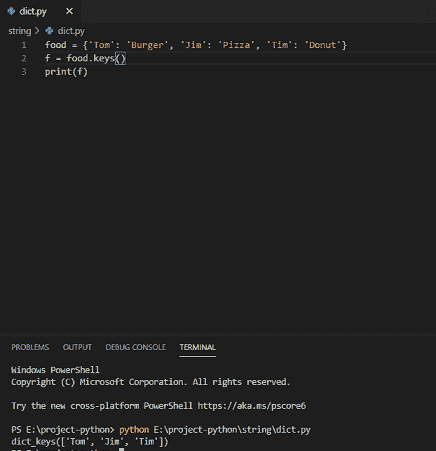

Python dictionary keys() method

这是如何使用 Python 字典中的 Keys 方法。

## Python 字典 values()方法

**Python 字典值()方法**返回字典值的新视图。在视图对象中进行的任何更改都会反映在字典中。

**举例:**

```py
food = {'Tom': 'Burger', 'Jim': 'Pizza', 'Tim: 'Donut'}
f = food.values()
print(f)
```

写完上面的代码(python 字典值方法)后，你将打印出 **" f "** ，然后输出将显示为 **"([ 'Burger '，' Pizza '，' Donut' ]) "** 。在这里，值是汉堡、披萨和甜甜圈。创建 python 字典值的方法可以参考下面的截图。

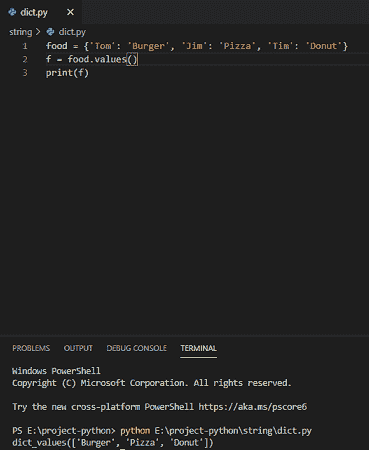

Python dictionary values() method

这是一个如何使用 Python 字典值方法的示例。

## Python 字典的 get()方法

Python 字典 get()方法返回指定键的值，如果没有找到键，则返回 none。

**举例:**

```py
employee = {1020: 'Kim', 1021: 'Ani', 1022: 'Mishka'}
print(employee.get(1021))
```

写完上面的代码(python dictionary get 方法)后，您将打印出 **"employee.get(1021)"** ，然后输出将显示为 **" Ani "** 。这里，指定的键是 1021，其值是 Ani。创建 python 字典 get 方法可以参考下面的截图。

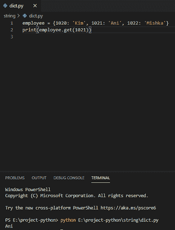

Python dictionary get() method

如果指定的键不存在，那么它将作为**“无”**返回。

**举例:**

```py
employee = {1020: 'Kim', 1021: 'Ani', 1022: 'Mishka'}
print(employee.get(1023))
```

可以看到键 **1023** 不存在。创建 python 字典 get 方法可以参考下面的截图。

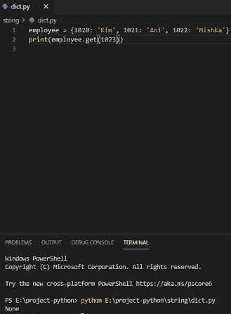

python dictionary get method

在这里我们看到了，如何使用 **python 字典的 get 方法**。

## Python 字典的 add()方法

字典中的 **Python add() item 方法**是通过给它一个新的键并赋一个值来完成的。

**举例:**

```py
employee = {1020: 'Kim', 1021: 'Ani', 1022: 'Mishka'}
employee[1023] = 'Tom'
print(employee)
```

写完上面的代码(python dictionary add item)，你将打印出 **"employee"** ，然后输出将显示为 **" {1020: 'Kim '，1021: 'Ani '，1022: 'Mishka '，1023: 'Tom'} "** 。在这里，我们添加 1023 作为一个键，它的值是 Tom。

您可以参考下面的截图来创建 python 字典添加项目。

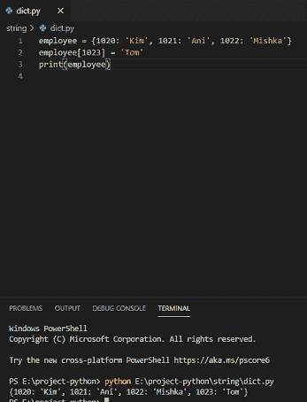

Python dictionary add() method

这就是如何使用 Python 字典的 add 方法。

## Python 字典长度()方法

**Python dictionary len()方法**用于确定一个字典有多少项(键值对)。它给出了 Python 中字典的总长度。

**举例:**

```py
employee = {1020: 'Kim', 1021: 'Ani', 1022: 'Mishka'}
print(len(employee))
```

写完上面的代码(python 字典长度方法)，你将打印出**(len(employee))"**然后输出将显示为 **" 3 "** 。这里，长度将提供数量。创建 python 字典长度方法可以参考下面的截图。

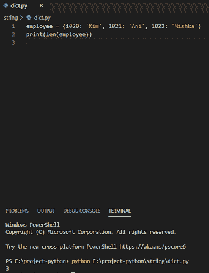

Python dictionary length() method

这是 Python 字典中长度方法的使用方法。

## Python 字典更新()方法

**Python dictionary update()方法**用于更新字典中的指定项。指定的项目可以是可迭代的。

**举例:**

```py
employee = {1020: 'Kim', 1021: 'Ani', 1022: 'Mishka'}
employee.update({1023: 'Ritika'})
print(employee)
```

写完上面的代码(python 字典更新方法)，你会打印出**(employee)**然后输出会出现一个**“{ 1020:' Kim '，1021: 'Ani '，1022: 'Mishka '，1023:' ri tika ' }”**。在这里，更新会将指定的项添加到字典中。

创建 python 字典更新方法可以参考下面的截图。

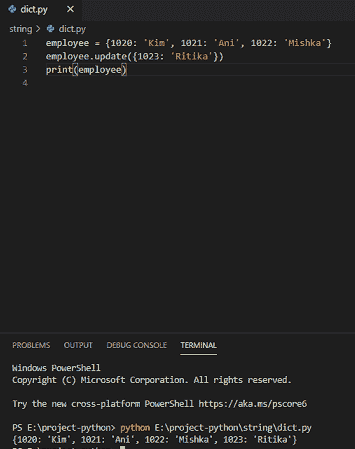

Python dictionary update() method

这里我们看到了如何使用另一个 Python 字典方法，那就是 Python 字典更新方法。

## Python 字典列表

**Python 字典列表**用于在字典中制作列表。列表中的值可以是任何类型。我们不能使用列表的字典作为键，但是同样可以使用值。

**举例:**

```py
dict = {}
dict["Name"] = ["Jack"]
dict["Marks"] = [45]
print(dict)
```

写完上面的代码(python dictionary of list)，你将打印出**(dict)**，然后输出将显示为 **" {'Name': ['Jack']，' Marks': [45] } "** 。这里，我们创建一个空字典，然后是值。

你可以参考下面的截图来创建一个 python 字典列表。

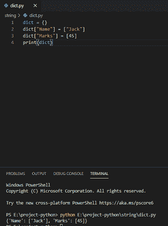

Python dictionary list

## Python 字典理解

Python 字典理解使用简单的表达式和简洁的方式来创建字典。

**举例:**

```py
dict1 = {n:n*3 for n in range(6)}
print(dict1)
```

写完上面的代码(python 字典理解)，你将打印出**(dict 1)**然后输出将显示为**“{ 0:0，1: 3，2: 6，3: 9，4: 12，5:15 }”**。这里，n 从 0 开始，一直到 5，然后乘以 3，以键值对的形式输出。

你可以参考下面的截图来理解创建 python 字典。

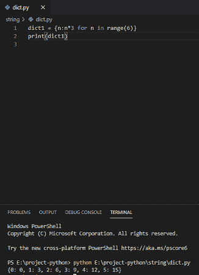

Python dictionary comprehension

## 检查字典 python 中是否存在关键字

在 python 中，为了检查字典中是否存在该键，我们需要使用关键字"中的**"来指定字典中是否存在该键。**

**举例:**

```py
my_dict = {"name": "Harry", "roll": "23", "marks": "64"}
if "marks" in my_dict:
print("Yes, 'marks' is one of the keys in dictionary")
```

在编写完上面的代码(检查字典 python 中是否存在这个键)之后，您将打印这些代码，然后输出将显示为一个**“是的，‘marks’是字典中的一个键”**。在这里，标记是作为字典中的一个关键字出现的。

可以参考下面的截图，查看字典 python 中是否存在该键。

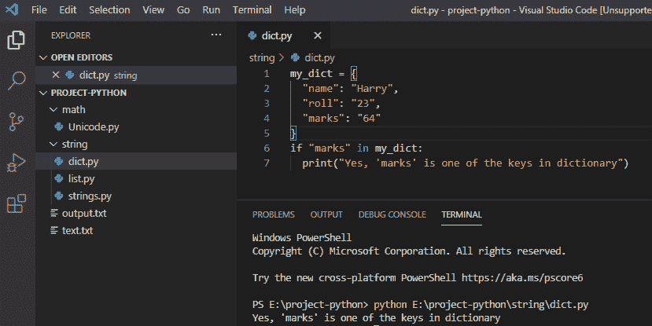

Check if key exists in dictionary python

上面的代码我们可以用来**检查 python 字典**中是否存在 key。

## Python 字典移除键

在 python 中，要从字典中删除键，我们可以使用 **del** 关键字从字典中删除特定的键。

**举例:**

```py
my_dict = {"name": "Harry", "roll": "23", "marks": "64"}
del my_dict["roll"]
print(my_dict)
```

写完上面的代码(python dictionary remove 键)，你将打印出 **" my_dict "** ，然后输出将显示为 **" {'name': 'Harry '，' marks': '64' } "** 。这里，del 用于从字典中移除指定的键，而我的指定键是从字典中移除的**【roll】**。

可以参考下面截图 python 字典移除键。

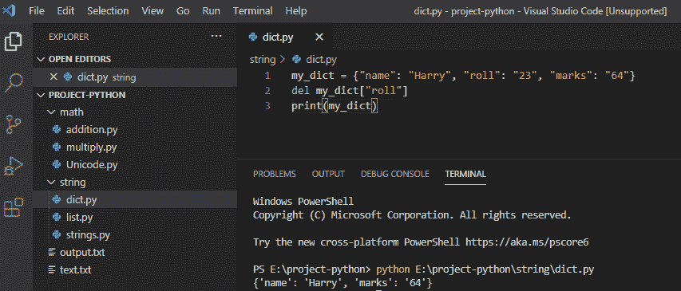

Python dictionary remove key

我们还可以通过使用 **pop()** 方法从字典中删除指定的键元素来删除键。

**举例:**

```py
my_dict = {"name": "Harry", "roll": "23", "marks": "64"}
my_dict.pop("roll")
print(my_dict)
```

写完上面的代码(python dictionary remove 键)，你将打印出 **" my_dict "** ，然后输出将显示为 **" {'name': 'Harry '，' marks': '64' } "** 。这里， **pop()** 方法用于从字典中删除指定键，指定键为**【roll】**，从字典中删除。

可以参考下面截图 python 字典移除键。

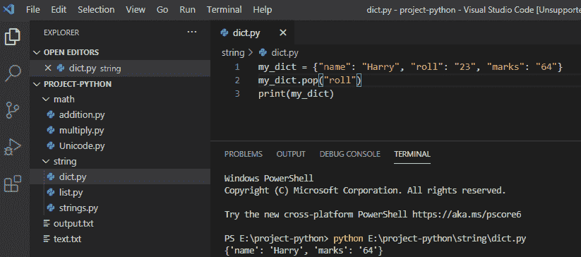

Python dictionary remove key

## 在 python 字典中查找最大值

在 python 中， **max()** value 会在字典中找到值最大的键。

**举例:**

```py
my_dictionary = {"avinav": 11, "John": 22, "nick": 23}
maximum_key = max(my_dictionary, key=my_dictionary.get)
print(maximum_key)
```

写完上面的代码(在 python 字典中查找最大值)，你将打印出**“maximum _ key”**，然后输出将显示为**“尼克”**。这里，max()值将查找字典中具有最大值的键。

你可以参考下面的截图在字典 python 中查找最大值

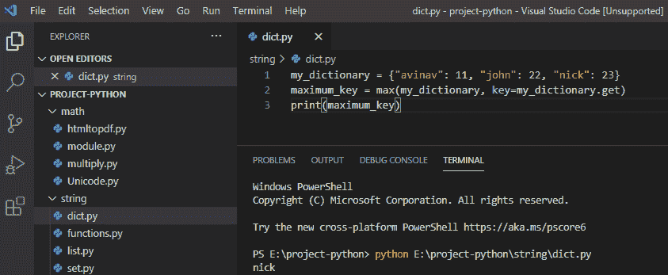

Find max value in dictionary python

上面的代码我们可以用来**在 Python** 中查找字典中的最大值。

## 在 python 字典中查找最小值

在 python 中， **min()** value 会在字典中找到值最小的键。

**举例:**

```py
my_dictionary = {"avinav": 111, "John": 222, "nick": 223}
minimum_key = min(my_dictionary, key=my_dictionary.get)
print(minimum_key)
```

写完上面的代码(在 python 字典中查找最小值)，你将打印出 **" minimum_key "** ，然后输出将显示为 **" avinav "** 。这里，min()值将查找字典中具有最小值的键。

你可以参考下面的截图在字典 python 中查找最小值

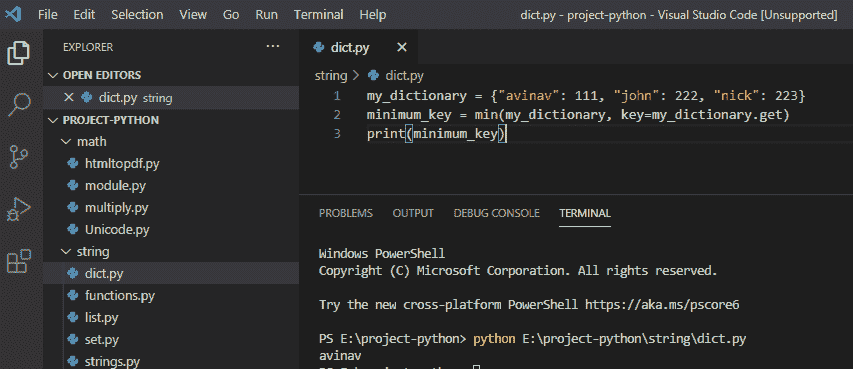

Find min value in dictionary python

这就是如何在 Python 字典中找到最小值。

## Python 字典 clear()方法

在 python 字典中，我们有方法 **clear()** ，它将从字典中删除所有元素。

**举例:**

```py
Student = {
  "Nick": "America",
  "Roll": 154,
  "year": 2019
}
Student.clear()
print(Student)
```

编写完上面的代码(python dictionary clear()方法)后，您将打印出 **" Student "** ，然后输出将显示为 **" {} "** 。这里， **clear()** 方法将删除学生列表中的所有元素。

可以参考下面截图 python 字典 clear()方法。

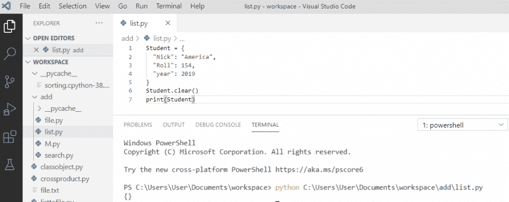

Python dictionary clear() method

这就是 Python 字典 clear 方法的使用方法。

在这个 [Python](https://en.wikipedia.org/wiki/Python_(programming_language)) 教程中，我们通过一些例子了解了 **python 字典方法**。

您可能会喜欢以下 Python 教程:

*   [11 Python 列表方法](https://pythonguides.com/python-list-methods/)
*   [Python 中的复数](https://pythonguides.com/complex-numbers-in-python/)
*   [如何在 Python 中创建列表](https://pythonguides.com/create-list-in-python/)
*   [Python 字符串函数](https://pythonguides.com/string-methods-in-python/)
*   [如何在 python 中把整数转换成字符串](https://pythonguides.com/convert-an-integer-to-string-in-python/)
*   [如何在 python 中连接字符串](https://pythonguides.com/concatenate-strings-in-python/)
*   [如何在 python 中使用正则表达式拆分字符串](https://pythonguides.com/python-split-string-regex/)
*   [Python 串联字典](https://pythonguides.com/python-concatenate-dictionary/)

这里我们检查了各种 **Python 字典方法**,比如:

*   Python 字典 **keys()** 方法
*   Python 字典 **values()** 方法
*   Python 字典 **get()** 方法
*   Python 字典 add()方法
*   Python 字典 **length()** 方法
*   Python 字典 **update()** 方法
*   Python 字典列表
*   检查字典 python 中是否存在关键字
*   Python 字典移除键
*   在 python 字典中查找最大值
*   在字典 python 中查找最小值
*   Python 字典 clear()方法

[Bijay Kumar](https://pythonguides.com/author/fewlines4biju/)

Python 是美国最流行的语言之一。我从事 Python 工作已经有很长时间了，我在与 Tkinter、Pandas、NumPy、Turtle、Django、Matplotlib、Tensorflow、Scipy、Scikit-Learn 等各种库合作方面拥有专业知识。我有与美国、加拿大、英国、澳大利亚、新西兰等国家的各种客户合作的经验。查看我的个人资料。

[enjoysharepoint.com/](https://enjoysharepoint.com/)[](https://www.facebook.com/fewlines4biju "Facebook")[](https://www.linkedin.com/in/fewlines4biju/ "Linkedin")[](https://twitter.com/fewlines4biju "Twitter")