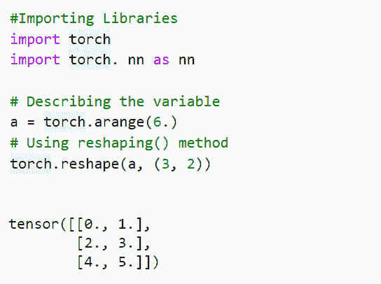
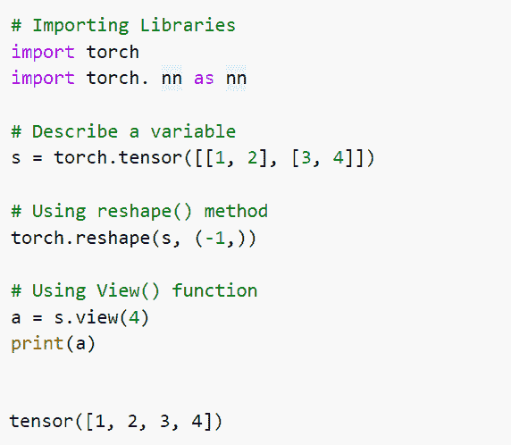
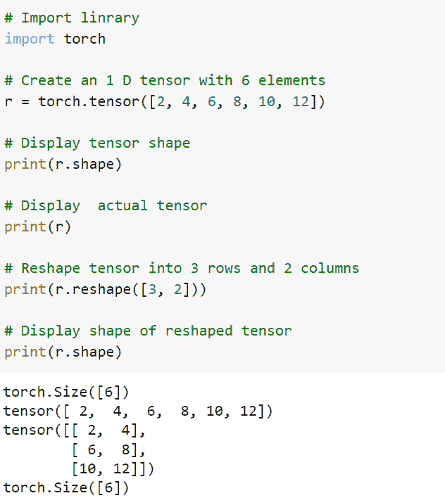
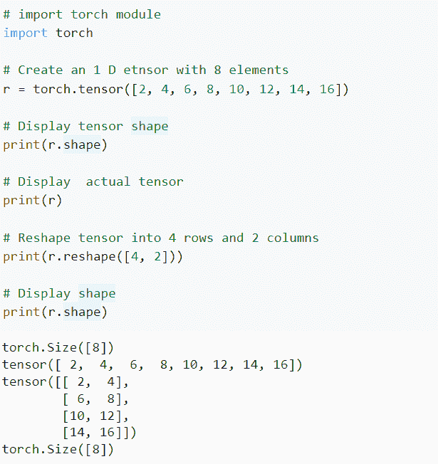
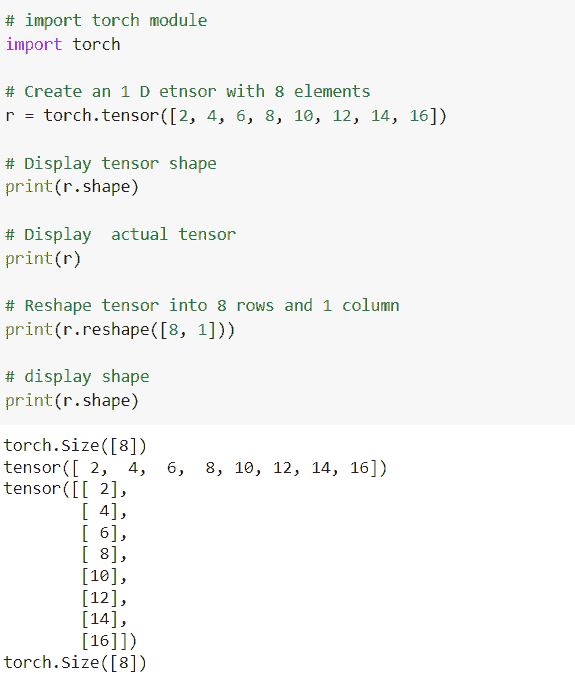

# PyTorch 整形张量-有用的教程

> 原文：<https://pythonguides.com/pytorch-reshape-tensor/>

[](https://sharepointsky.teachable.com/p/python-and-machine-learning-training-course)

在本 [Python 教程](https://pythonguides.com/learn-python/)中，我们将学习 Python 中的 ***PyTorch 重塑张量*** 。整形允许我们转换具有相似数据和元素数量的形状，这意味着它返回与识别的数组相同的数据，但具有不同的识别维度大小。

此外，我们还将涵盖与 **PyTorch** **整形张量**相关的不同示例。我们将讨论这些话题。

*   PyTorch 整形张量
*   PyTorch 整形张量示例
*   PyTorch 重塑张量视图
*   PyTorch 将一维张量整形为二维张量
*   PyTorch 将张量整形为 4 行 2 列
*   PyTorch 将张量整形为 8 行 1 列

目录

[](#)

*   [PyTorch 整形张量](#PyTorch_reshape_tensor "PyTorch reshape tensor")
*   [PyTorch 整形张量示例](#PyTorch_reshape_tensor_example "PyTorch reshape tensor example")
*   [PyTorch 重塑张量视图](#PyTorch_reshape_tensor_view "PyTorch reshape tensor view")
*   [PyTorch 将一维张量整形为二维张量](#PyTorch_reshape_one-dimension_tensor_into_two_dimension_tensor "PyTorch reshape one-dimension tensor into two dimension tensor")
*   [PyTorch 将张量整形为 4 行 2 列](#PyTorch_reshape_a_tensor_into_4_rows_and_2 "PyTorch reshape a tensor into 4 rows and 2 ")
*   [列](#columns "columns")
*   [PyTorch 将张量整形为 8 行 1 列](#PyTorch_reshape_a_tensor_into_8_rows_and_1_column "PyTorch reshape a tensor into 8 rows and 1 column")

## PyTorch 整形张量

在本节中，我们将学习 python 中的 **PyTorch 整形张量**。

Reshape 允许我们转换具有相似数据和元素数量的形状，这意味着它返回与识别的数组相同的数据，但具有不同的识别维度大小。

**语法:**

PyTorch 整形张量的语法:

```
torch.reshape(input,shape)
```

参数:

以下是 PyTorch 整形张量的参数

*   **输入:**输入参数作为要整形的张量。
*   **形状:**形状参数被用作新的形状。

至此，我们已经了解了 PyTorch 整形张量。

阅读: [PyTorch 超参数调谐](https://pythonguides.com/pytorch-hyperparameter-tuning/)

## PyTorch 整形张量示例

在本节中，我们将借助 python 中的一个例子了解**如何实现 PyTorch reshape** **张量。**

**shape()**函数返回具有相似数据和元素数量的张量作为输入，但具有已识别的形状。

当可行时，返回的张量将是输入的视图。具有一致步幅的恒定输入可以在不复制的情况下被重新整形。

**代码:**

在下面的代码中，我们将导入所有必要的库，如 import torch 和 import torch.nn。

*   a = torch.arange。)用于通过 torch.arange()函数声明变量。
*   **torch . shape(a，(3，2)):** 这里我们使用了 shape()函数，在这个函数中，我们使用了一些参数，比如输入和形状。

```
#Importing Libraries
import torch
import torch. nn as nn

# Describing the variable
a = torch.arange(6.)
# Using reshaping() method 
torch.reshape(a, (3, 2))
```

**输出:**

运行上面的代码后，我们得到下面的输出，我们可以看到 PyTorch 整形张量值打印在屏幕上。



PyTorch reshape tensor example

这样，我们借助一个例子，了解了 PyTorch 整形张量。

阅读: [PyTorch Numpy to Tensor](https://pythonguides.com/pytorch-numpy-to-tensor/)

## PyTorch 重塑张量视图

在本节中，我们将了解 python 的 PyTorch 重塑张量视图。

PyTorch 整形张量视图被定义为返回与自张量具有相同数据但形状不同的新张量的过程。

它返回张量并分配相似的数据，应该有相同数量的元素，但可能有不同的大小。

**代码:**

在下面的代码中，我们将导入所有必要的如 import torch 和 import torch.nn。

*   **s = torch.tensor([[1，2]，[3，4]]):** 这里我们用 torch.tensor()函数来描述 s 变量。
*   **torch . shape(s，(-1，)):**这里我们使用了 torch . shape()函数，在这个函数中，我们使用了一些参数，比如输入和形状。
*   **a = s.view(4)** 这里我们使用 view()函数返回一个新的张量，该张量具有与自张量相同的数据，但形状不同。
*   **print(a)** 用于通过 print()函数打印变量。

```
# Importing Libraries
import torch
import torch. nn as nn

# Describe a variable
s = torch.tensor([[1, 2], [3, 4]])

# Using reshape() method
torch.reshape(s, (-1,))

# Using View() function
a = s.view(4)
print(a)
```

**输出:**

运行上述代码后，我们得到以下输出，可以看到 PyTorch reshape tensor 视图打印在屏幕上。



PyTorch reshape tensor view

这就是我们使用 PyTorch reshape 视图的方式。

阅读: [PyTorch 激活功能](https://pythonguides.com/pytorch-activation-function/)

## PyTorch 将一维张量整形为二维张量

在本节中，我们将学习 python 中的 **PyTorch reshape tensor 一维张量到二维张量**。

整形方法用于将张量整形为给定的形状。这里，我们把一维张量改造成二维张量。

或者可以说，借助于整形方法，一维张量可以转化为二维张量。

**代码:**

在下面的代码中，首先我们导入 torch 库，比如 import torch。

*   **r = torch.tensor([2，4，6，8，10，12]):** 这里我们创建一个包含 6 个元素的一维张量。
*   **print(r.shape):** 这里我们借助 print()函数显示张量形状。
*   **print(r):** 这里我们在 print()函数的帮助下显示实际的张量。
*   **print(r . shape([3，2]):**这里我们将张量整形为三行两列。
*   **print(r.shape):** 这里我们使用 print()函数显示一个整形张量的形状。

```
# Import linrary
import torch

# Create an 1 D tensor with 6 elements
r = torch.tensor([2, 4, 6, 8, 10, 12])

# Display tensor shape
print(r.shape)

# Display  actual tensor
print(r)

# Reshape tensor into 3 rows and 2 columns
print(r.reshape([3, 2]))

# Display shape of reshaped tensor
print(r.shape)
```

**输出:**

运行上面的代码后，我们得到了下面的输出，其中我们可以看到 PyTorch 将一个维度的张量整形为打印在屏幕上的两个维度的张量。



PyTorch reshape one dimension tensor to two dimension tensor

这样，我们就理解了 PyTorch 把一维张量改造成二维张量。

阅读: [PyTorch MNIST 教程](https://pythonguides.com/pytorch-mnist/)

## PyTorch 将张量整形为 4 行 2 列

## 列

在这一节中，我们将学习 python 中的 **PyTorch 将张量整形为 4 行 2 列**。

整形方法用于将张量整形为给定的形状。在这里，我们将张量重塑为四行两列。

**代码:**

在下面的代码中，首先我们将导入 torch 库，如 import torch。

*   **r = torch.tensor([2，4，6，8，10，12，14，16]):** 这里我们创建一个有八个元素的一维张量。
*   **print(r.shape):** 这里我们使用 print()函数显示一个张量形状。
*   **print(r . shape([4，2]):**这里我们把张量整形为四行两列。
*   **print(r.shape):** 这里我们借助 print()函数显示形状。

```
# import torch module
import torch

# Creating an one Dimensional tensor with Eight elements
r = torch.tensor([2, 4, 6, 8, 10, 12, 14, 16])

# Showing tensor shape
print(r.shape)

# Showing  actual tensor
print(r)

# Reshape tensor into Four rows and Two columns
print(r.reshape([4, 2]))

# Showing the shape
print(r.shape)
```

**输出:**

运行上面的代码后，我们得到下面的输出，其中我们可以看到 PyTorch 将张量重新整形为 4 行 2 列。



PyTorch reshape tensor into 4 rows and 2 columns

这样，我们理解了 PyTorch 整形张量为 4 行 2 列。

阅读: [PyTorch 车型总结](https://pythonguides.com/pytorch-model-summary/)

## PyTorch 将张量整形为 8 行 1 列

在这一节中，我们将学习 python 中的 **PyTorch 将张量整形为 8 行** **和 1 列**。

整形方法用于将张量整形为给定的形状。在这里，我们将张量整形为八行一列。

**代码:**

在下面的代码中，首先我们将导入 torch 库，如 import torch。

*   **r = torch.tensor([2，4，6，8，10，12，14，16]):** 这里我们创建一个有八个元素的一维张量。
*   **print(r.shape):** 这里我们使用 print()函数显示一个张量形状。
*   **print(r):** 这里我们在 print()函数的帮助下显示实际的张量。
*   **print(r . shape([8，1]):**这里我们将张量整形为八行一列。
*   **print(r.shape):** 这里我们借助 print()函数显示形状。

```
# import torch module
import torch

# Creating an one Dimensional tensor with Eight elements
r = torch.tensor([2, 4, 6, 8, 10, 12, 14, 16])

# Showing tensor shape
print(r.shape)

# Showing the actual tensor
print(r)

# Reshapeing teh tensor into eight rows and one column
print(r.reshape([8, 1]))

# Showing the shape
print(r.shape)
```

**输出:**

运行上面的代码后，我们得到了下面的输出，其中我们可以看到 PyTorch 将一个张量整形为 8 行 1 列并打印在屏幕上。



PyTorch reshape a tensor into 8 rows and 1 column

因此，我们了解了 PyTorch 将张量整形为 8 列 1 行。

另外，再看看一些 PyTorch 教程。

*   [数据加载器指针+示例](https://pythonguides.com/pytorch-dataloader/)
*   [创建 PyTorch 空张量](https://pythonguides.com/pytorch-empty-tensor/)
*   [PyTorch 提前停止](https://pythonguides.com/pytorch-early-stopping/)
*   [PyTorch 添加尺寸](https://pythonguides.com/pytorch-add-dimension/)
*   [PyTorch 预训练模型](https://pythonguides.com/pytorch-pretrained-model/)
*   [指针为 Numpy](https://pythonguides.com/pytorch-tensor-to-numpy/)

因此，在本教程中，我们讨论了 **PyTorch Reshape Tensor** ，并且我们还涵盖了与其实现相关的不同示例。这是我们已经讨论过的例子列表。

*   PyTorch 整形张量
*   PyTorch 整形张量示例
*   PyTorch 重塑张量视图
*   PyTorch 将一维张量整形为二维张量
*   PyTorch 将张量整形为 4 行 2 列
*   PyTorch 将张量整形为 8 行 1 列

[Bijay Kumar](https://pythonguides.com/author/fewlines4biju/)

Python 是美国最流行的语言之一。我从事 Python 工作已经有很长时间了，我在与 Tkinter、Pandas、NumPy、Turtle、Django、Matplotlib、Tensorflow、Scipy、Scikit-Learn 等各种库合作方面拥有专业知识。我有与美国、加拿大、英国、澳大利亚、新西兰等国家的各种客户合作的经验。查看我的个人资料。

[enjoysharepoint.com/](https://enjoysharepoint.com/)[](https://www.facebook.com/fewlines4biju "Facebook")[](https://www.linkedin.com/in/fewlines4biju/ "Linkedin")[](https://twitter.com/fewlines4biju "Twitter")