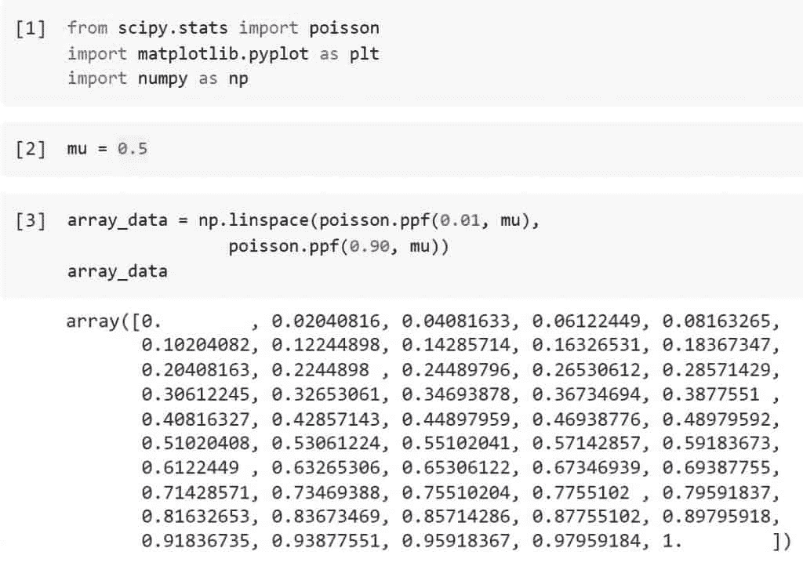
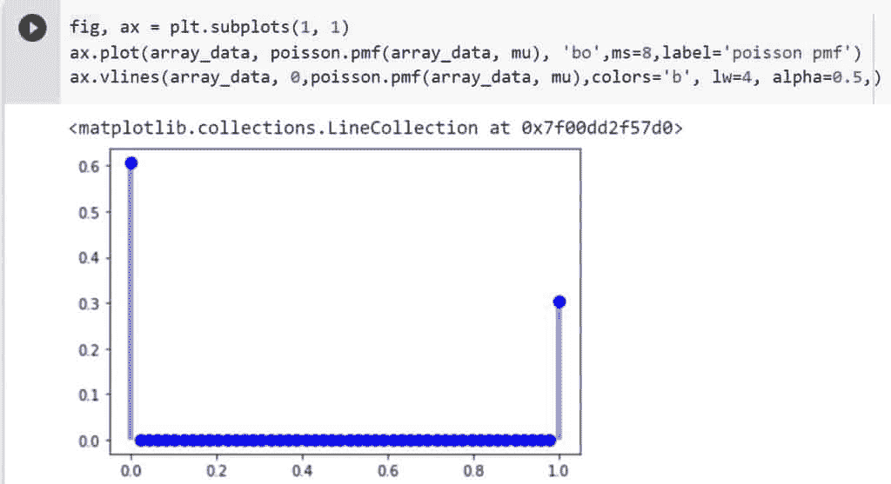
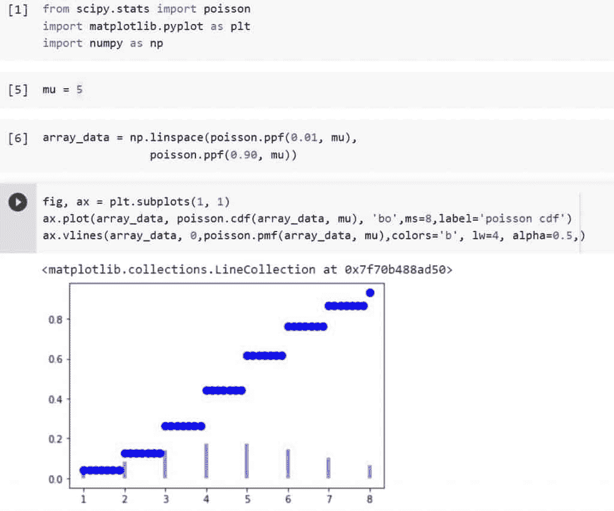
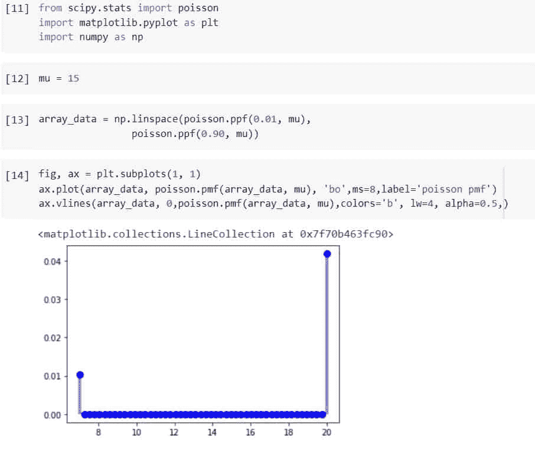
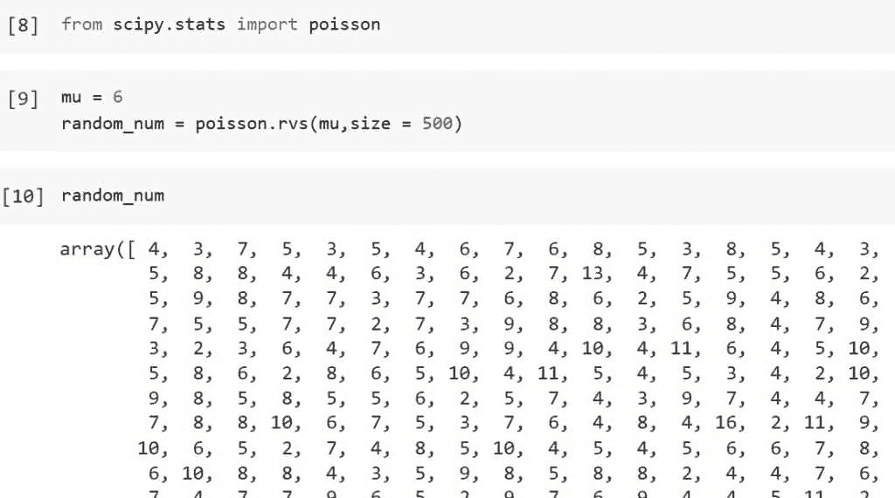
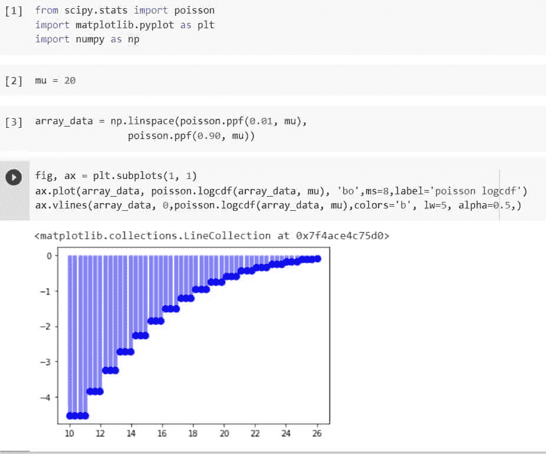
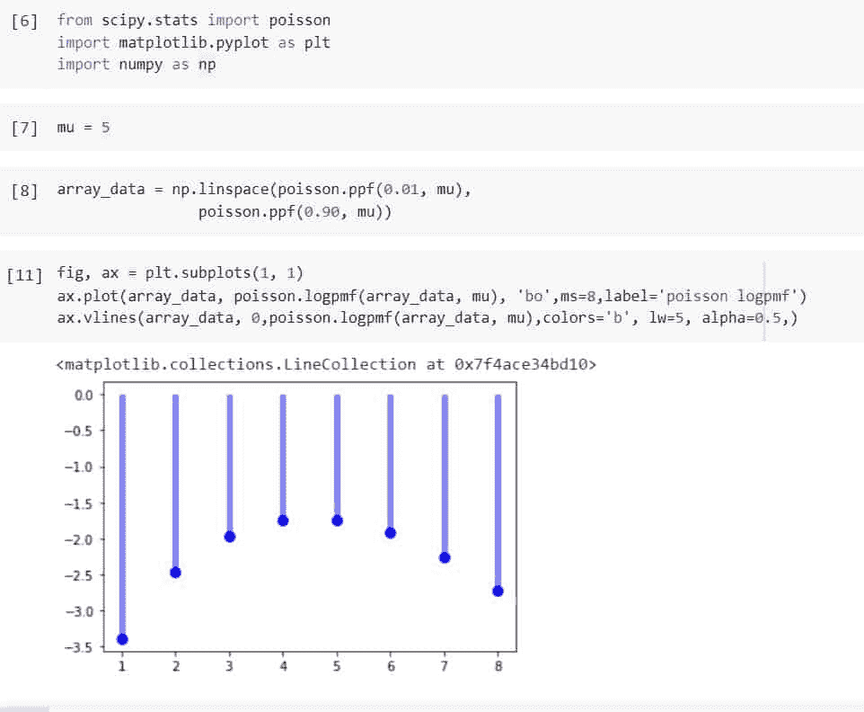
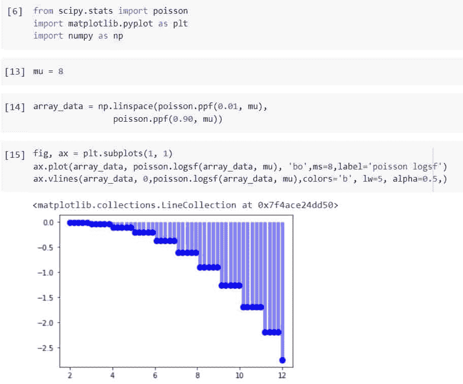
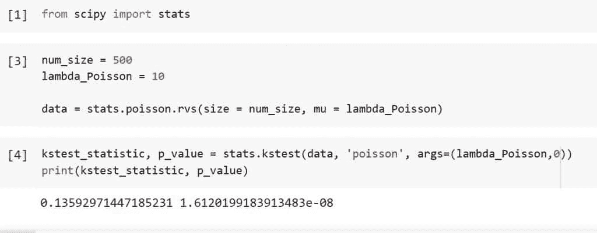

# python Scipy Stats Poisson–有用的指南

> 原文：<https://pythonguides.com/python-scipy-stats-poisson/>

[](https://sharepointsky.teachable.com/p/python-and-machine-learning-training-course)

在本 [Python 教程](https://pythonguides.com/learn-python/)中，我们将学习到“ ***Python Scipy Stats 泊松*** ”来计算泊松分布的 ***CDF*** 、 ***PDF*** 、 ***Logpdf*** 等。此外，我们还将讨论以下主题。

*   什么是泊松分布
*   Python Scipy Stats Poisson CDF
*   Python Scipy Stats kstest 泊松
*   Python Scipy Stats 零膨胀泊松
*   python scipy stats poisson Pmf(python scipy 统计鱼 PMF)
*   Python Scipy 统计泊松 Rvs
*   Python Scipy Stats Poisson Logcdf
*   python scipy stats poisson logpmf(python scipy 统计鱼日志)
*   Python Scipy 统计泊松日志

目录

[](#)

*   [什么是泊松分布](#What_is_Poisson_Distribution "What is Poisson Distribution")
*   [Python Scipy Stats Poisson](#Python_Scipy_Stats_Poisson "Python Scipy Stats Poisson")
*   [python scipy stats poisson CDF](#Python_Scipy_Stats_Poisson_CDF "Python Scipy Stats Poisson CDF")
*   [python scipy stats fish PMF](#Python_Scipy_Stats_Poisson_Pmf "Python Scipy Stats Poisson Pmf")
*   [Python Scipy Stats 泊松 Rvs](#Python_Scipy_Stats_Poisson_Rvs "Python Scipy Stats Poisson Rvs")
*   [python scipy stats fish logcdf](#Python_Scipy_Stats_Poisson_Logcdf "Python Scipy Stats Poisson Logcdf")
*   [python scipy stats fish logpmf](#Python_Scipy_Stats_Poisson_Logpmf "Python Scipy Stats Poisson Logpmf")
*   [Python Scipy 统计泊松日志 sf](#Python_Scipy_Stats_Poisson_Logsf "Python Scipy Stats Poisson Logsf")
*   [Python Scipy Stats ks test Poisson](#Python_Scipy_Stats_kstest_Poisson "Python Scipy Stats kstest Poisson")

## 什么是泊松分布

泊松分布是一种概率分布，在统计学中用于确定某一事件在特定时间段内发生的频率。换句话说，这是一个计数分布。

泊松分布常用于理解在一定时期内以稳定速率发生的独立事件。它以法国数学家丹尼斯·泊松的名字命名。

假设泊松分布是一个离散函数，那么在一个(可能是无限的)列表中，只有某些值对于变量是可能的。换句话说，变量不能接受任何连续范围内的所有值。

对于泊松分布，变量不能采用任何小数值或十进制值；它只能接受整数值(0、1、2、3 等。).

阅读: [Python Scipy Kdtree](https://pythonguides.com/python-scipy-kdtree/)

## Python Scipy Stats Poisson

`***scipy.stats.poisson***`代表离散随机变量。它有不同种类的分布函数，如 CDF、中位数等。

它有一个重要的参数`***loc***`,用于使用这些参数移动分布的平均值。

下面给出了语法。

```py
scipy.stats.poisson.method_name(mu,k,loc,moments)
```

其中参数为:

*   ***mu:*** 用于定义形状参数。
*   ***k:*** 它是数据。
*   ***loc:*** 用于指定平均值，默认为 0。
*   ***矩:*** 用于计算标准差、峰度、均值等统计量。

以上参数是对象`***scipy.stats.poisson()***`中所有方法的公共参数。下面给出了方法。

*   ***scipy . stats . poisson . CDF():***它用于累积分布函数。
*   ***************阿松************。rvs():*** 获取随机变量。
*   ***************阿松************。stats():*** 用于获取标准差、均值、峰度、偏斜度。
*   ***************阿松************。logPDF():*** 用于获取与概率密度函数相关的日志。
*   ***************阿松************。logCDF():*** 用于查找与累积分布函数相关的日志。
*   ***************阿松************。sf():*** 用于获取生存函数值。
*   ***************阿松************。isf():*** 用于获取逆生存函数值。
*   ***************阿松************。logsf():*** 用于查找与生存函数相关的日志。
*   ***************阿松************。mean():*** 用于求正态分布相关的均值。
*   ***************阿松************。medain():*** 用于求正态分布相关的中位数。
*   ***************阿松************。var():*** 用于求与分布相关的方差。
*   ***************阿松************。std():*** 用于求与分布相关的标准差

让我们通过使用上面提到的方法之一来举一个例子，以了解如何使用带参数的方法。

使用下面的代码导入所需的库。

```py
from scipy.stats import poisson
import matplotlib.pyplot as plt
import numpy as np
```

代码为形状参数创建一个变量，并分配一些值。

```py
mu = 0.5
```

使用下面的代码，使用对象`***poisson***`的方法`***ppf()***`创建一个数据数组。

```py
array_data = np.linspace(poisson.ppf(0.01, mu),
                poisson.ppf(0.90, mu))
array_data
```



Scipy Stats Poisson Example

现在使用下面的代码，通过访问模块`***scipy.stats***`的对象`***poisson***`的方法`***pdf()***`来绘制概率密度函数。

```py
fig, ax = plt.subplots(1, 1)
ax.plot(array_data, poisson.pmf(array_data, mu), 'bo',ms=8,label='poisson pmf')
ax.vlines(array_data, 0,poisson.pmf(array_data, mu),colors='b', lw=4, alpha=0.5,)
```



Scipy Stats Poisson

这就是如何使用对象`***poission***`在 Python SciPy 的帮助下创建一个发行版。

另外，检查: [Python Scipy Stats Kurtosis](https://pythonguides.com/python-scipy-stats-kurtosis/)

## python scipy stats poisson CDF

对象`***poisson***`有一个方法`***cdf()***`来计算泊松分布的累积分布。

下面给出了语法。

```py
scipy.stats.poisson.cdf(mu,k,loc)
```

其中参数为:

*   **mu:** 用于定义形状参数。
*   **k:** 是数据。
*   **loc:** 用于指定平均值，默认为 0。

让我们以下面的步骤为例:

使用下面的 python 代码导入所需的库。

```py
from scipy.stats import poisson
import matplotlib.pyplot as plt
import numpy as np
```

代码为形状参数创建一个变量，并分配一些值。

```py
mu = 5
```

使用下面的代码，使用对象`***poisson***`的方法`***ppf()***`创建一个数据数组。

```py
array_data = np.linspace(poisson.ppf(0.01, mu),
                poisson.ppf(0.90, mu))
```

现在使用下面的代码，通过访问模块`***scipy.stats***`的对象`***poisson***`的方法`***cdf()***`来绘制累积分布图。

```py
fig, ax = plt.subplots(1, 1)
ax.plot(array_data, poisson.cdf(array_data, mu), 'bo',ms=8,label='poisson cdf')
ax.vlines(array_data, 0,poisson.pmf(array_data, mu),colors='b', lw=4, alpha=0.5,)
```



Scipy Stats Poisson CDF

阅读: [Python Scipy 最小化](https://pythonguides.com/python-scipy-minimize/)

## python scipy stats fish PMF

确定随机变量的特定泊松分布的概率质量函数值。Python Scipy 在模块`***scipy.stats***`中有一个方法`***pmf()***`。

下面给出了语法。

```py
scipy.stats.poisson.pmf(mu,k,loc)
```

其中参数为:

*   **mu:** 用于定义形状参数。
*   **loc:** 用于指定平均值，默认为 0。
*   **大小:**是样本大小。

让我们以下面的步骤为例:

使用下面的代码导入所需的库。

```py
from scipy.stats import poisson
import matplotlib.pyplot as plt
import numpy as np
```

代码为形状参数创建一个变量，并分配一些值。

```py
mu = 15
```

使用下面的代码，使用对象`***poisson***`的方法`***ppf()***`创建一个数据数组。

```py
array_data = np.linspace(poisson.ppf(0.01, mu),
                poisson.ppf(0.90, mu))
```

现在使用下面的代码，通过访问模块`***scipy.stats***`的对象`***poisson***`的方法`***pdf()***`来绘制概率密度函数。

```py
fig, ax = plt.subplots(1, 1)
ax.plot(array_data, poisson.pmf(array_data, mu), 'bo',ms=8,label='poisson pmf')
ax.vlines(array_data, 0,poisson.pmf(array_data, mu),colors='b', lw=4, alpha=0.5,)
```



Python Scipy Stats Poisson Pmf

阅读: [Python Scipy 置信区间](https://pythonguides.com/scipy-confidence-interval/)

## Python Scipy Stats 泊松 Rvs

对象`***poisson***`的 Python Scipy 的方法 ***`rvs()`*** 从泊松分布生成随机数或样本。

下面给出了语法。

```py
scipy.stats.poisson.cdf(mu,loc,size)
```

其中参数为:

*   **mu:** 用于定义形状参数。
*   **loc:** 用于指定平均值，默认为 0。
*   **大小:**是样本大小。

让我们通过一个例子来了解如何按照以下步骤使用对象泊松的方法`***rvs()***`生成随机数:

使用下面的 python 代码导入所需的库或方法。

```py
from scipy.stats import poisson
```

使用以下代码定义 mu 和样本大小等于 5000。

```py
mu = 6
random_num = poisson.rvs(mu,size = 500)
```

使用下面的代码显示生成的随机数。

```py
random_num
```



Python Scipy Stats Poisson Rvs

这就是如何使用 Python Scipy 的方法`***rvs()***`生成随机数。

阅读: [Python Scipy 卡方测试](https://pythonguides.com/python-scipy-chi-square-test/)

## python scipy stats fish logcdf

Python Scipy 的模块`***scipy.stats.poisson***`中的方法`***logcdf()***`计算泊松分布的累积分布的对数。

下面给出了语法。

```py
scipy.stats.poisson.logcdf(mu,k,loc)
```

其中参数为:

*   ***mu:*** 用于定义形状参数。
*   ***k:*** 它是数据。
*   ***loc:*** 用于指定平均值，默认为 0。

让我们以下面的步骤为例:

使用下面的代码导入所需的库。

```py
from scipy.stats import poisson
import matplotlib.pyplot as plt
import numpy as np
```

为形状参数创建一个变量，并指定一些值。

```py
mu = 20
```

使用下面的代码，使用对象`***poisson***`的方法`***ppf()***`创建一个数据数组。

```py
array_data = np.linspace(poisson.ppf(0.01, mu),
                poisson.ppf(0.90, mu))
```

现在使用下面的代码，通过访问模块`***scipy.stats***`的对象`***poisson***`的方法`***logcdf()***`来绘制泊松分布的 CDF 日志。

```py
fig, ax = plt.subplots(1, 1)
ax.plot(array_data, poisson.logcdf(array_data, mu), 'bo',ms=8,label='poisson logcdf')
ax.vlines(array_data, 0,poisson.logcdf(array_data, mu),colors='b', lw=5, alpha=0.5,)
```



Pyton Scipy Stats Poisson Logcdf

阅读: [Python Scipy FFT](https://pythonguides.com/python-scipy-fft/)

## python scipy stats fish logpmf

Python Scipy 的 scipy.stats.poisson 模块中的方法`***logpmf()***`计算泊松分布概率的对数。

下面给出了语法。

```py
scipy.stats.poisson.logpmf(mu,k,loc)
```

其中参数为:

*   ***mu:*** 用于定义形状参数。
*   ***k:*** 它是数据。
*   ***loc:*** 用于指定平均值，默认为 0。

让我们以下面的步骤为例:

使用下面的代码导入所需的库。

```py
from scipy.stats import poisson
import matplotlib.pyplot as plt
import numpy as np
```

为形状参数创建一个变量，并指定一些值。

```py
mu = 5
```

使用下面的代码，使用对象`***poisson***`的方法`***ppf()***`创建一个数据数组。

```py
array_data = np.linspace(poisson.ppf(0.01, mu),
                poisson.ppf(0.90, mu))
```

现在通过使用下面的代码访问模块`***scipy.stats***`的对象`***poisson***`的方法`***logpmf()***`来绘制泊松分布的 pmf 的对数。

```py
fig, ax = plt.subplots(1, 1)
ax.plot(array_data, poisson.logpmf(array_data, mu), 'bo',ms=8,label='poisson logpmf')
ax.vlines(array_data, 0,poisson.logpmf(array_data, mu),colors='b', lw=5, alpha=0.5,)
```



Python Scipy Stats Logpmf

阅读: [Python Scipy Matrix +示例](https://pythonguides.com/python-scipy-matrix/)

## Python Scipy 统计泊松日志 sf

Python Scipy 的模块`***scipy.stats.poisson***`中的方法`***logsf()***`计算泊松分布生存函数的对数。

下面给出了语法。

```py
scipy.stats.poisson.logsf(mu,k,loc)
```

其中参数为:

*   ***mu:*** 用于定义形状参数。
*   ***k:*** 它是数据。
*   ***loc:*** 用于指定平均值，默认为 0。

让我们以下面的步骤为例:

使用下面的代码导入所需的库。

```py
from scipy.stats import poisson
import matplotlib.pyplot as plt
import numpy as np
```

为形状参数创建一个变量，并指定一些值。

```py
mu = 8
```

使用下面的代码，使用对象`***poisson***`的方法`***ppf()***`创建一个数据数组。

```py
array_data = np.linspace(poisson.ppf(0.01, mu),
                poisson.ppf(0.90, mu))
```

现在通过使用下面的代码访问模块`***scipy.stats***`的对象`***poisson***`的方法`***logsf()***`来绘制泊松分布的 sf 的对数。

```py
fig, ax = plt.subplots(1, 1)
ax.plot(array_data, poisson.logsf(array_data, mu), 'bo',ms=8,label='poisson logpmf')
ax.vlines(array_data, 0,poisson.logsf(array_data, mu),colors='b', lw=5, alpha=0.5,)
```



Python Scipy Stats Logsf

阅读: [Scipy Ndimage Rotate](https://pythonguides.com/scipy-ndimage-rotate/)

## Python Scipy Stats ks test Poisson

模块`***scipy.stats***`中 Python Scipy 的方法`***kstest()***`执行 Kolmogorov-Smirnov 测试，以确定一个或两个样本的拟合优度。

使用单样本检验(x)将样本的基本分布 F(x)与给定的分布 G 进行比较。使用双样本检验比较两个不同样本的基本分布。只有连续分布才能用于任一检验的有效性。

下面给出了语法。

```py
scipy.stats.kstest(rvs, cdf, args=(), N=10, alternative='less', mode='exact')
```

其中参数为:

*   **rvs(str，array_data):** 如果是数组，应该是随机变量观测值的 1 维数组。应该调用一个产生随机变量的函数，它必须有一个关键字参数大小。如果是字符串，它必须是 scipy.stats 中用于产生随机数的发行版的名称。
*   **cdf(str，array_data):** 如果数据是 array_like，则运行双样本检验(并且 rvs 必须是 array_like ),这应该是随机变量观测值的一维数组。如果有一个可调用的，cdf 就用这个可调用的来计算。如果是字符串，它需要是 scipy.stats 中发行版的名称，因为那将是 cdf 函数。
*   **args(sequence，tuple):** 当 rvs 或 cdf 为可调用或字符串时，使用分布参数。
*   **N(int):** 如果 rvs 是可调用的或字符串，则为样本大小。默认情况下，为 20。
*   替代(较小、较大、双边):解释替代和无效假设。“双面”是默认设置。
*   **mode():** 指定用于确定 p 值的分布。有以下选择(“自动”是默认设置):“精确”、“近似”、“自动”和“渐近”。

方法`***kstest()***`返回 float 类型的`***statistic***`和`***p-value***`。

让我们创建一个泊松分布来产生数字的随机分布。要确定它是否类似泊松分布，请按照以下步骤使用 KS 测试:

使用下面的 python 代码导入所需的库。

```py
from scipy import stats
```

使用下面的代码创建一个泊松分布来创建一个数字的随机分布。

```py
num_size = 500
lambda_Poisson = 10

data = stats.poisson.rvs(size = num_size, mu = lambda_Poisson)
```

现在看看它是否类似泊松分布，并使用下面的代码执行 KS 测试。

```py
kstest_statistic, p_value = stats.kstest(data, 'poisson', args=(lambda_Poisson,0))
print(kstest_statistic, p_value)
```



Python Scipy Stats kstest Poisson

另外，看看更多的 Python SciPy 教程。

*   [Scipy Convolve–完整指南](https://pythonguides.com/scipy-convolve/)
*   [Python Scipy 正常测试](https://pythonguides.com/python-scipy-normal-test/)
*   [Python Lil_Matrix Scipy](https://pythonguides.com/python-lil_matrix-scipy/)
*   [敏感信号——有用教程](https://pythonguides.com/scipy-signal/)
*   [Scipy Integrate +示例](https://pythonguides.com/scipy-integrate/)
*   [Python Scipy Mann Whitneyu](https://pythonguides.com/python-scipy-mann-whitneyu/)
*   [Scipy 优化–实用指南](https://pythonguides.com/scipy-optimize/)

因此，在本教程中，我们已经了解了“***Python Scipy Stats Poisson***”以及以下主题。

*   什么是泊松分布
*   Python Scipy Stats Poisson CDF
*   Python Scipy Stats kstest 泊松
*   Python Scipy Stats 零膨胀泊松
*   python scipy stats poisson Pmf(python scipy 统计鱼 PMF)
*   Python Scipy 统计泊松 Rvs
*   Python Scipy Stats Logcdf
*   Python Scipy Stats Logpmf
*   Python Scipy 状态日志

[Bijay Kumar](https://pythonguides.com/author/fewlines4biju/)

Python 是美国最流行的语言之一。我从事 Python 工作已经有很长时间了，我在与 Tkinter、Pandas、NumPy、Turtle、Django、Matplotlib、Tensorflow、Scipy、Scikit-Learn 等各种库合作方面拥有专业知识。我有与美国、加拿大、英国、澳大利亚、新西兰等国家的各种客户合作的经验。查看我的个人资料。

[enjoysharepoint.com/](https://enjoysharepoint.com/)[](https://www.facebook.com/fewlines4biju "Facebook")[](https://www.linkedin.com/in/fewlines4biju/ "Linkedin")[](https://twitter.com/fewlines4biju "Twitter")