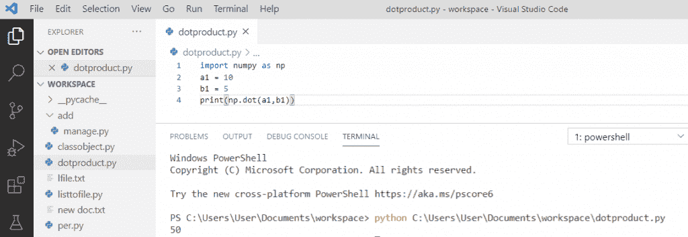
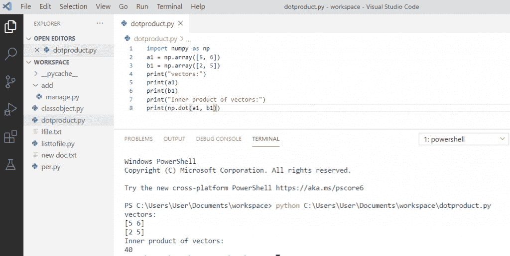
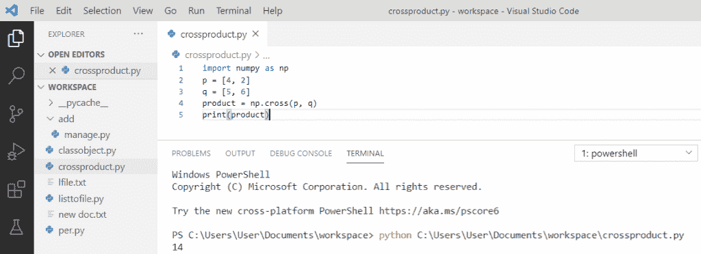
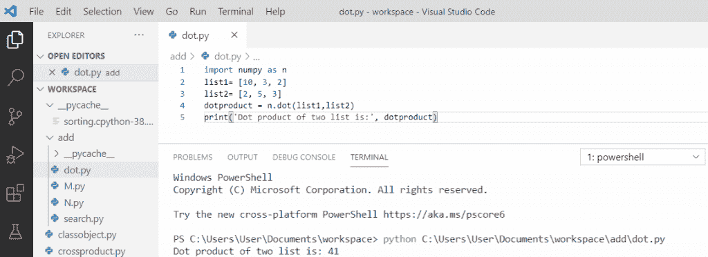
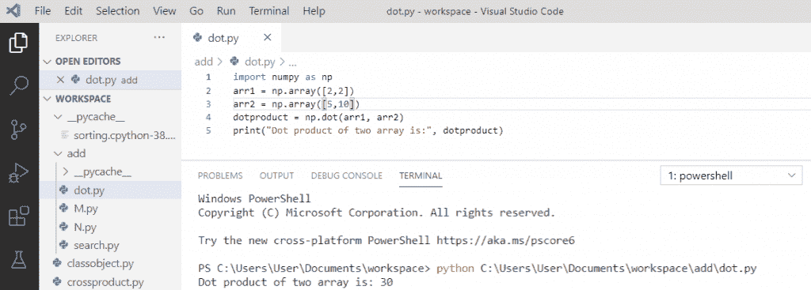
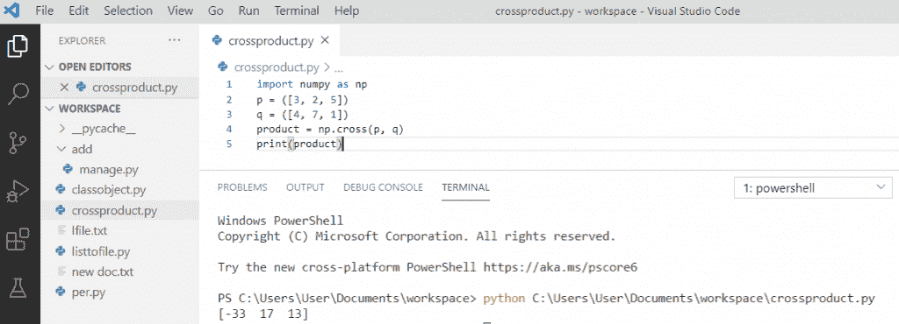

# Python 点积和叉积

> 原文：<https://pythonguides.com/python-dot-product/>

[](https://sharepointsky.teachable.com/p/python-and-machine-learning-training-course)

在本 [Python 教程](https://pythonguides.com/python-gui-programming/)中，我们将讨论 **python** **点积**和**叉积**。此外，我们将看到以下主题:

*   python 中的**点积是什么？**
*   什么是 NumPy，如何在 python 中安装 Numpy
*   没有 NumPy 的 Python 点积
*   python 中使用 NumPy 的点积
*   python 中两个向量的点积
*   Python 计算两个给定向量的内积
*   二维数组的 Python 点积
*   两个向量的 Python 叉积
*   两个列表的 Python 点积
*   两个数组的 Python 点积
*   二维数组的 Python 叉积
*   三维数组的 Python 叉积

目录

[](#)

*   [什么是 Python 点积？](#What_is_Python_dot_product "What is Python dot product?")
*   [什么是 Numpy，如何在 python 中安装 Numpy](#What_is_Numpy_and_how_to_install_NumPy_in_python "What is Numpy and how to install NumPy in python")
*   [没有 NumPy 的 Python 点积](#Python_dot_product_without_NumPy "Python dot product without NumPy")
*   [python 中使用 NumPy 的点积](#Dot_product_in_python_using_NumPy "Dot product in python using NumPy")
*   [python 中两个向量的点积](#Dot_product_of_two_vectors_in_python "Dot product of two vectors in python")
*   [Python 计算两个给定向量的内积](#Python_compute_the_inner_product_of_two_given_vectors "Python compute the inner product of two given vectors")
*   [二维数组的 Python 点积](#Python_dot_product_of_2-dimensional_arrays "Python dot product of 2-dimensional arrays")
*   [Python 两个向量的叉积](#Python_cross_product_of_two_vectors "Python cross product of two vectors")
*   [两个列表的 Python 点积](#Python_dot_product_of_two_lists "Python dot product of two lists")
*   [两个数组的 Python 点积](#Python_dot_product_of_two_arrays "Python dot product of two arrays")
*   [二维数组的 Python 叉积](#Python_cross_product_of_2-dimensional_arrays "Python cross product of 2-dimensional arrays")
*   [三维数组的 Python 叉积](#Python_cross_product_of_3-dimensional_arrays "Python cross product of 3-dimensional arrays")

## 什么是 Python 点积？

**Python 点积**在代数运算中也称为标量积，它接受两个等长序列并返回一个数字。

## 什么是 Numpy，如何在 python 中安装 Numpy

*   Numpy 是一个 python 库，用于处理数组和矩阵。
*   如果你已经在一个系统上安装了 **python** 和 **pip** ，那么 NumPy 的安装就非常容易了。
*   使用 cmd 中的命令**“pip install Numpy”**安装 Numpy。
*   一旦安装了 NumPy，通过添加 **import** numpy 将它导入您的应用程序。

## 没有 NumPy 的 Python 点积

如果我们没有 NumPy 包，那么我们可以定义两个向量 **a** 和 **b** 。然后使用 **zip** 函数，该函数接受两个等长向量并将它们合并成对。将每对中的值相乘，并将每次相乘的乘积相加，得到点积。

**举例:**

```py
a = [5, 10, 2]
b = [2, 4, 3]
dotproduct=0
for a,b in zip(a,b):
    dotproduct = dotproduct+a*b
print('Dot product is:', dotproduct)
```

写完上面的代码后，一旦你打印出 **" dotproduct "** 那么输出将是 **"Dot product is: 56"** 。它将每对中的值相乘，并将乘积加到最终值中。

没有 NumPy 的 **python 点积可以参考下面的截图。**


Python dot product without NumPy

## python 中使用 NumPy 的点积

Python 提供了一种非常有效的方法来计算两个向量的**点积。通过使用 **numpy.dot()** 方法，该方法在 **Numpy 模块**中可用。**

**举例:**

```py
import numpy as n
a = [5, 10, 2]
b = [2, 4, 3]
dotproduct = n.dot(a,b)
print('Dot product is:', dotproduct)
```

写完上面的代码后，一旦你打印出 **" dotproduct "** 那么输出将是 **"Dot product is: 56"** 。它将使用点()计算点积。

使用 NumPy 的 **python 点积可以参考下面的截图。**


Dot product in python using NumPy

## python 中两个向量的点积

两个向量 a1 和 b1 的 **Python 点积**将返回标量。对于两个标量，它们的点积相当于一个简单的乘法。

**举例:**

```py
import numpy as np
a1 = 10
b1 = 5
print(np.dot(a1,b1))
```

写完上面的代码后，一旦你将打印 **" np.dot(a1，b1) "** 那么输出将是 **" 50 "** 。它将使用点()计算点积。

两个向量的 **python 点积可以参考下面的截图。**



Dot product of two vectors in python

## Python 计算两个给定向量的内积

内积是点积的推广。这是一种将向量相乘的方法。通过使用**点()**方法，我们可以找到内积。

**举例:**

```py
import numpy as n
p
a1 = np.array([5, 6]
)
b1 = np.array([2, 5]
)
print("vectors:")
print(a1)
print(b1)
print("Inner product of vectors:")
print(np.dot(a1,b1))
```

写完上面的代码，一旦你打印出 **" np.dot(a1，b1) "** 那么输出就是**"向量的内积:40"** 。它将使用点()计算向量的内积。

你可以参考下面的截图 **python 计算两个给定向量的内积**



Python compute the inner product of two given vectors

## 二维数组的 Python 点积

如果数组是**二维**， **numpy.dot()** 将导致矩阵乘法。

**举例:**

```py
import numpy as np 
p = [[2,5],[3,2]]
q = [[1,0],[4,1]]
dotproduct = np.dot(p,q)
print(dotproduct)
```

写完上面的代码后，一旦你将打印 **" dotproduct "** 那么输出将是 **"[[22 5] [11 2]]"** 。通过使用 dot()方法，它返回两个向量 p 和 q 的矩阵乘积。

二维数组的 **python 点积可以参考下面的截图**


Python dot product of 2-dimensional arrays

## Python 两个向量的叉积

为了找到两个向量的**叉积**，我们将使用 **numpy cross()** 函数。

**举例:**

```py
import numpy as np
p = [4, 2]
q = [5, 6]
product = np.cross(p,q)
print(product)
```

写完上面的代码后，一旦你打印出 **" product "** ，那么输出将是 **" 14 "** 。通过使用 **cross()** 方法，它返回两个向量 p 和 q 的叉积

你可以参考下面两个向量的 python 叉积截图。



Python cross product of two vectors

## 两个列表的 Python 点积

Python 提供了一种非常高效的方法来计算两个列表的**点积。通过使用 **numpy.dot()** 方法，该方法在 **Numpy 模块**中可用。**

**举例:**

```py
import numpy as n
list1= [10, 3, 2]
list2= [2, 5, 3]
dotproduct = n.dot(list1,list2)
print('Dot product of two list is:', dotproduct)
```

写完上面的代码后，一旦你将打印 **" dotproduct "** 那么输出将是**"两个列表的点积是:41"** 。它将使用点()计算两个列表**“列表 1 和列表 2”**的点积。

你可以参考下面两个列表的 python 点积截图



Python dot product of two lists

## 两个数组的 Python 点积

python 中的函数 **numpy.dot()** 返回两个数组 **arr1 和 arr2** 的点积。如果 arr1 和 arr2 都是一维的，则点()乘积返回标量。

**举例:**

```py
import numpy as np
arr1 = np.array([2,2])
arr2 = np.array([5,10])
dotproduct = np.dot(arr1, arr2)
print("Dot product of two array is:", dotproduct)
```

写完上面的代码，一旦你打印出 **" dotproduct "** 那么输出将是**"两个数组的点积是:30"** 。它将使用点()计算两个数组**“arr 1 和 arr 2”**的点积，并返回一个标量值。

你可以参考下面两个数组的 python 点积截图



Python dot product of two arrays

## 二维数组的 Python 叉积

为了找到二维数组的叉积，我们将使用 numpy 库的 **numpy.cross()** 函数。

**举例:**

```py
import numpy as np
p = [[2, 2]
, [3, 1]]
q = [[6, 7]
, [5, 4]]
product = np.cross(p,q)
print(product)
```

写完上面的代码后，一旦你打印出 **" product "** ，那么输出将是 **" [2 7] "** 。通过使用 **cross()** 方法我们将得到两个给定向量 p 和 q 的叉积

你可以参考下面的二维数组的 python 叉积截图


Python cross product of 2-dimensional arrays

## 三维数组的 Python 叉积

为了找到三维数组的叉积，我们将使用 numpy 库的 **numpy.cross()** 函数。

**举例:**

```py
import numpy as np
p = ([3, 2, 5])
q = ([4, 7, 1]
)
product = np.cross(p,q)
print(product)
```

写完上面的代码后，一旦你打印出 **" product "** ，那么输出将是 **" [-33 17 13] "** 。通过使用 **cross()** 方法我们将得到两个给定向量 p 和 q 的叉积

你可以参考下面的三维数组的 python 叉积截图



Python cross product of 3-dimensional arrays

您可能会喜欢以下 Python 教程:

*   [Python 退出命令](https://pythonguides.com/python-exit-command/)
*   [Python 回文程序](https://pythonguides.com/python-palindrome-program/)
*   [Python 输入和 raw_input 函数](https://pythonguides.com/python-input-and-raw_input-function/)
*   [Python 中的排序算法](https://pythonguides.com/sorting-algorithms-in-python/)
*   [在 Python 中使用 JSON 数据](https://pythonguides.com/json-data-in-python/)
*   [使用 Python 发送电子邮件](https://pythonguides.com/send-email-using-python/)
*   [Python 获得一个 IP 地址](https://pythonguides.com/python-get-an-ip-address/)
*   [Python – stderr, stdin and stdout](https://pythonguides.com/python-stderr-stdin-and-stdout/)
*   [Python 读取二进制文件](https://pythonguides.com/python-read-a-binary-file/)

在本教程中，我们学习了 ****python** **点积**和 **Python 叉积**** ，并且我们还看到了如何使用它，例如:

*   python 中的点积是什么？
*   什么是 NumPy，如何在 python 中安装 Numpy
*   没有 NumPy 的 Python 点积
*   python 中使用 NumPy 的点积
*   python 中两个向量的点积
*   Python 计算两个给定向量的内积
*   二维数组的 Python 点积
*   两个向量的 Python 叉积
*   两个列表的 Python 点积
*   两个数组的 Python 点积
*   二维数组的 Python 叉积
*   三维数组的 Python 叉积

[Bijay Kumar](https://pythonguides.com/author/fewlines4biju/)

Python 是美国最流行的语言之一。我从事 Python 工作已经有很长时间了，我在与 Tkinter、Pandas、NumPy、Turtle、Django、Matplotlib、Tensorflow、Scipy、Scikit-Learn 等各种库合作方面拥有专业知识。我有与美国、加拿大、英国、澳大利亚、新西兰等国家的各种客户合作的经验。查看我的个人资料。

[enjoysharepoint.com/](https://enjoysharepoint.com/)[](https://www.facebook.com/fewlines4biju "Facebook")[](https://www.linkedin.com/in/fewlines4biju/ "Linkedin")[](https://twitter.com/fewlines4biju "Twitter")