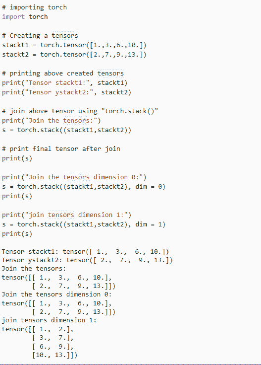
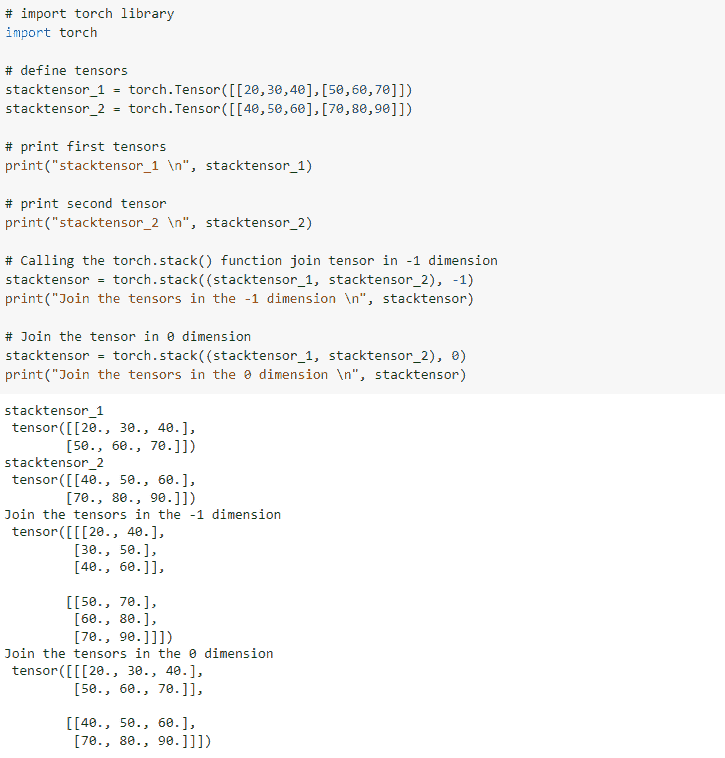
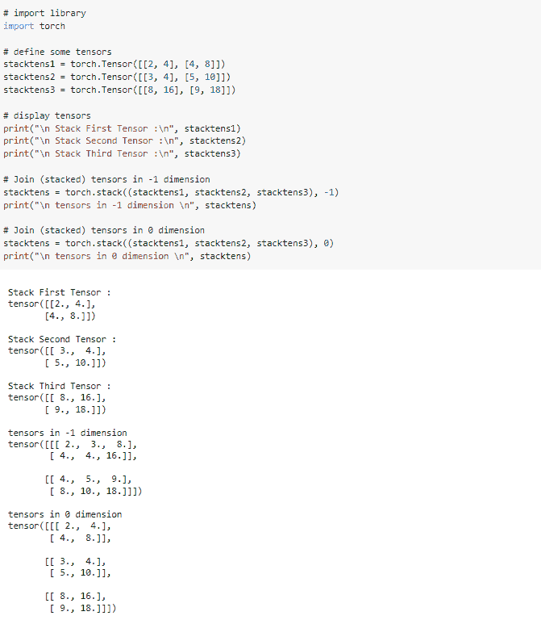
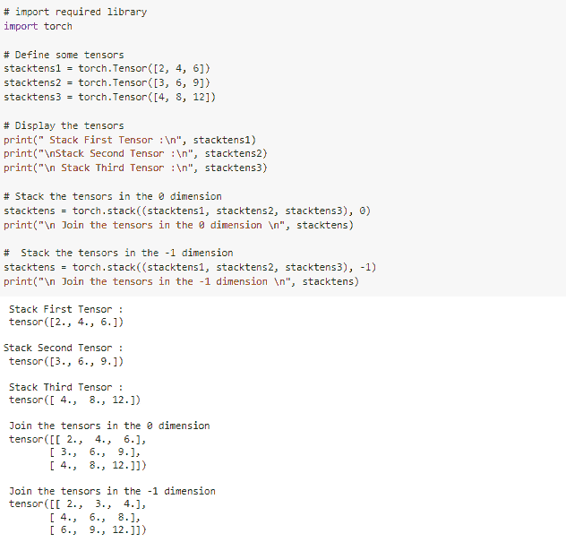

# PyTorch 堆栈教程+示例

> 原文：<https://pythonguides.com/pytorch-stack/>

[](https://sharepointsky.teachable.com/p/python-and-machine-learning-training-course)

***py torch torch . stack()***函数用于连接具有相同维度和形状的张量。详细来说，我们将讨论 Python 中使用 [PyTorch 的 ***stack()*** 函数。](https://pythonguides.com/what-is-pytorch/)

此外，我们将介绍与 PyTorch 堆栈函数相关的不同示例。我们将讨论这些话题。

*   什么是 PyTorch 堆栈
*   PyTorch 堆栈示例
*   如何使用 Pytorch 堆栈张量
*   PyTorch 2d 张量将被叠加以创建 3d 张量
*   PyTorch 1d 张量堆叠并生成 2d 张量作为最终张量
*   PyTorch 堆栈显示输入张量形状不同时的错误

目录

[](#)

*   [什么是 PyTorch 堆栈](#What_is_PyTorch_stack "What is PyTorch stack ")
*   [PyTorch 堆栈示例](#PyTorch_stack_example "PyTorch stack example")
*   [如何使用 Pytorch 堆栈张量](#How_to_use_Pytorch_stack_tensors "How to use Pytorch stack tensors")
*   [PyTorch 2d 张量被叠加以创建 3d 张量](#PyTorch_2d_tensor_to_be_stack_to_create_a_3d_tensor "PyTorch 2d tensor to be stack to create a 3d tensor")
*   [PyTorch 堆叠 1d 张量并生成 2d 张量作为最终张量](#PyTorch_1d_tensor_stacked_and_generate_a_2d_tensor_as_final_tensor "PyTorch 1d tensor stacked and generate a 2d tensor as final tensor")
*   [PyTorch 堆栈显示输入张量形状不同时的错误](#PyTorch_stack_to_show_error_when_the_input_tensor_are_not_of_the_same_shape "PyTorch stack to show error when the input tensor are not of the same shape")

## 什么是 PyTorch 堆栈

在本节中，我们将学习 python 中的 PyTorch 堆栈。

***PyTorch stack()*** 方法用于将一系列张量与一个新维度连接或串联。该函数用于连接具有相同维度和形状的张量。

**语法:**

PyTorch 堆栈的语法:

```
torch.stack(tensors, dim=0, out=None)
```

**参数:**

以下是 PyTorch 堆栈的参数:

*   **张量:**张量被定义为一系列具有新维度的张量。
*   **dim:**dim 是要插入的维数，其整数介于 0 和输入张量的维数之间。
*   **out:**out 是描述输出张量的参数。

这就是我们借助 torch.stack()函数理解 Pytorch 堆栈的方式。

阅读:[如何使用 PyTorch Full()函数](https://pythonguides.com/pytorch-full-function/)

## PyTorch 堆栈示例

在这一节中，我们将借助 python 中的一个例子来学习如何实现 PyTorch 堆栈。

***torch.stack()*** 方法，其中所有张量需要具有相同的大小，并用于将一系列张量与一个新维度结合或连接。

**代码:**

在下面的代码中，我们将导入 torch 模块，如 import torch。

*   **stackt1 = torch.tensor([1。,3.,6.,10.]):** 这里我们使用 torch.tensor()函数创建一个张量。
*   **print("Tensor stackt1:"，stackt1)** 用于打印使用 print()函数创建的张量。
*   **s = torch.stack((stackt1，stackt2)):** 这里我们调用的是 stack()函数。
*   **print(s):** 这里我们借助 print()函数打印连接后的最终张量。

```
# importing torch
import torch

# Creating a tensors
stackt1 = torch.tensor([1.,3.,6.,10.])
stackt2 = torch.tensor([2.,7.,9.,13.])

# printing above created tensors
print("Tensor stackt1:", stackt1)
print("Tensor ystackt2:", stackt2)

# join above tensor using "torch.stack()"
print("Join the tensors:")
s = torch.stack((stackt1,stackt2))

# print final tensor after join
print(s)

print("Join the tensors dimension 0:")
s = torch.stack((stackt1,stackt2), dim = 0)
print(s)

print("join tensors dimension 1:")
s = torch.stack((stackt1,stackt2), dim = 1)
print(s)
```

**输出:**

运行上面的代码后，我们得到下面的输出，其中我们可以看到 PyTorch 堆栈值被打印在屏幕上。



PyTorch stack example

至此，我们借助 python 中的一个例子理解了 PyTorch 堆栈。

阅读:[创建 PyTorch 空张量](https://pythonguides.com/pytorch-empty-tensor/)

## 如何使用 Pytorch 堆栈张量

在本节中，我们将学习 python 中的 PyTorch 堆栈张量。

PyTorch 堆栈张量被定义为沿着新的维度连接两个或更多个张量的序列的方法。

**代码:**

在下面的代码中，我们将导入火炬库作为导入火炬。

*   **stacktensor_1 =火炬。张量([[20，30，40]，[50，60，70]]):** 这里我们用 torch.tensor()函数来描述变量。
*   **print("stacktensor_1 \n "，stacktensor_1)** 用于使用 print()函数打印第一个张量。
*   **stack tensor = torch.stack((stack tensor _ 1，stacktensor_2)，-1):** 这里我们调用的是 torch . stack()函数。
*   **print(" Join tensor in-1 dimension \ n "，stacktensor)** 用于通过 print()函数打印堆栈张量值。

```
# import torch library
import torch

# define tensors
stacktensor_1 = torch.Tensor([[20,30,40],[50,60,70]])
stacktensor_2 = torch.Tensor([[40,50,60],[70,80,90]])

# print first tensors
print("stacktensor_1 \n", stacktensor_1)

# print second tensor
print("stacktensor_2 \n", stacktensor_2)

# Calling the torch.stack() function join tensor in -1 dimension
stacktensor = torch.stack((stacktensor_1, stacktensor_2), -1)
print("Join the tensors in the -1 dimension \n", stacktensor)

# Join the tensor in 0 dimension
stacktensor = torch.stack((stacktensor_1, stacktensor_2), 0)
print("Join the tensors in the 0 dimension \n", stacktensor)
```

**输出:**

运行上面的代码后，我们得到下面的输出，其中我们可以看到 PyTorch 堆栈张量值打印在屏幕上。



PyTorch stack tensor

这就是我们如何通过使用 torch.stack()函数来理解 PyTorch 堆栈张量。

阅读:[py torch Lenet 简介](https://pythonguides.com/pytorch-lenet/)

## PyTorch 2d 张量被叠加以创建 3d 张量

在这一节中，我们将学习 PyTorch 2d 张量如何在 python 中创建 3d 张量。

这里我们用的是二维张量，我们把所有的张量连接在一起，创建了三维张量。

**代码:**

在下面的代码中，我们将导入 torch 库，如 import torch。

*   **stacktens1 =火炬。张量([[2，4]，[4，8]]):** 这里我们用 torch.tensor()函数声明变量。
*   **print("\n 栈首张量:\n "，stacktens1)** 用于通过 print()函数打印栈首张量。
*   **stack tens = torch . stack((stack tens 1，stacktens2，stacktens3)，-1):** 这里我们是-1 维的堆叠张量。
*   **print(" \n-1 维张量\ n "，stacktens)** 用于借助 print()函数打印-1 维张量。
*   **stack tens = torch . stack((stack tens 1，stacktens2，stacktens3)，0):** 这里我们把 0 维的张量堆叠起来。

```
# import library
import torch

# declaring some tensors
stacktens1 = torch.Tensor([[2, 4], [4, 8]])
stacktens2 = torch.Tensor([[3, 4], [5, 10]])
stacktens3 = torch.Tensor([[8, 16], [9, 18]])

# Display the tensors
print("\n Stack First Tensor :\n", stacktens1)
print("\n Stack Second Tensor :\n", stacktens2)
print("\n Stack Third Tensor :\n", stacktens3)

# stacked tensors in -1 dimension
stacktens = torch.stack((stacktens1, stacktens2, stacktens3), -1)
print("\n tensors in -1 dimension \n", stacktens)

# stacked tensors in 0 dimension
stacktens = torch.stack((stacktens1, stacktens2, stacktens3), 0)
print("\n tensors in 0 dimension \n", stacktens)
```

**输出:**

在下面的输出中，您可以看到 PyTorch 2d 张量将被堆叠以创建打印在屏幕上的 3d 张量值。



PyTorch 2d tensor to be stack to create 3d tensor

这样，我们就了解了 PyTorch 二维张量是如何叠加起来产生三维张量的。

阅读: [PyTorch 添加尺寸](https://pythonguides.com/pytorch-add-dimension/)

## PyTorch 堆叠 1d 张量并生成 2d 张量作为最终张量

在本节中，我们将学习 PyTorch 1d 张量堆栈，并生成一个 2d 张量作为 python 中的最终张量。

这里我们使用 torch.stack()函数从 PyTorch 一维张量生成二维张量作为最终张量。

**代码:**

在下面的代码中，我们将导入所需的库，如 import torch。

*   **stacktens1 =火炬。张量([2，4，6]):** 这里我们用 torch.tensor()函数来定义张量。
*   **print("栈首张量:\n "，stacktens1)** 用于借助 print()函数打印栈首张量。
*   **stack tens = torch . stack((stack tens 1，stacktens2，stacktens3)，0):** 这里我们调用的是 stack()函数。

```
# import required library
import torch

# Define some tensors
stacktens1 = torch.Tensor([2, 4, 6])
stacktens2 = torch.Tensor([3, 6, 9])
stacktens3 = torch.Tensor([4, 8, 12])

# Display the tensors
print(" Stack First Tensor :\n", stacktens1)
print("\nStack Second Tensor :\n", stacktens2)
print("\n Stack Third Tensor :\n", stacktens3)

# Stack the tensors in the 0 dimension
stacktens = torch.stack((stacktens1, stacktens2, stacktens3), 0)
print("\n Join the tensors in the 0 dimension \n", stacktens)

#  Stack the tensors in the -1 dimension
stacktens = torch.stack((stacktens1, stacktens2, stacktens3), -1)
print("\n Join the tensors in the -1 dimension \n", stacktens)
```

**参数:**

运行上面的代码后，我们得到下面的输出，其中我们可以看到 PyTorch 1d 张量被堆叠并生成一个 2d 张量作为最终张量，值被打印在屏幕上。



PyTorch 1d tensor stacked and generate 2d tensor as final tensor

这就是我们如何理解 PyTorch 1d 张量如何堆叠并生成 2d 张量作为最终张量。

阅读: [PyTorch nn Conv2d](https://pythonguides.com/pytorch-nn-conv2d/)

## PyTorch 堆栈显示输入张量形状不同时的错误

在本节中，我们将了解 PyTorch 堆栈，当 python 中的输入张量形状不同时，它会显示错误。

这里我们使用 PyTorch 堆栈，它可以显示输入张量没有类似形状时的误差。

**代码:**

在下面的代码中，我们将导入必要的库，如 import torch。

*   **stacktens1 = torch.tensor([1。, 3., 6., 10.]):** 这里我们使用 torch.tensor()函数创建堆栈张量。
*   **print("Tensor stacktens:"，stacktens1)** 用于通过 print()函数打印张量堆栈。
*   **s = torch.stack((stacktens1，stacktens2)):** 这里我们调用的是 stack()函数。

```
# importing torch
import torch

# Creating the stack tensors
stacktens1 = torch.tensor([1., 3., 6., 10.])
stacktens2 = torch.tensor([2., 7., 9.])

# Printing the tensors
print("Tensor stacktens:", stacktens1)
print("Tensor stac:", stacktens2)

# Stack the tensor using "torch.stack()"
print("Stack the tensors:")
s = torch.stack((stacktens1, stacktens2))
# Print the final tensor after join
print(s)

print("Stack the tensors dimension 0:")
s = torch.stack((stacktens1, stacktens2), dim=0)
print(s)

print("Stack the tensors dimension 1:")
s = torch.stack((stacktens1, stacktens2), dim=1)
print(s)
```

**输出:**

运行上面的代码后，我们得到了下面的输出，其中我们可以看到，当输入张量的形状不同时，会显示错误。


PyTorch stack to show error when the input tensor are not of the same shape

这就是我们理解 Pytorch 堆栈在输入张量形状不同时如何显示误差的方式。

另外，再看看一些 PyTorch 教程。

*   [pytorch league relu](https://pythonguides.com/pytorch-leaky-relu/)
*   [PyTorch 猫功能](https://pythonguides.com/pytorch-cat-function/)
*   [PyTorch 激活功能](https://pythonguides.com/pytorch-activation-function/)
*   [py torch RNN–详细指南](https://pythonguides.com/pytorch-rnn/)
*   [PyTorch MNIST 教程](https://pythonguides.com/pytorch-mnist/)

因此，在本教程中，我们讨论了 ***PyTorch 栈*** ，我们还涵盖了与其实现相关的不同示例。这是我们已经讨论过的例子列表。

*   PyTorch 栈是什么？
*   PyTorch 堆栈示例
*   如何使用 Pytorch 堆栈张量
*   PyTorch 2d 张量将被叠加以创建 3d 张量
*   PyTorch 1d 张量堆叠并生成 2d 张量作为最终张量
*   PyTorch 堆栈显示输入张量形状不同时的错误

[Bijay Kumar](https://pythonguides.com/author/fewlines4biju/)

Python 是美国最流行的语言之一。我从事 Python 工作已经有很长时间了，我在与 Tkinter、Pandas、NumPy、Turtle、Django、Matplotlib、Tensorflow、Scipy、Scikit-Learn 等各种库合作方面拥有专业知识。我有与美国、加拿大、英国、澳大利亚、新西兰等国家的各种客户合作的经验。查看我的个人资料。

[enjoysharepoint.com/](https://enjoysharepoint.com/)[](https://www.facebook.com/fewlines4biju "Facebook")[](https://www.linkedin.com/in/fewlines4biju/ "Linkedin")[](https://twitter.com/fewlines4biju "Twitter")