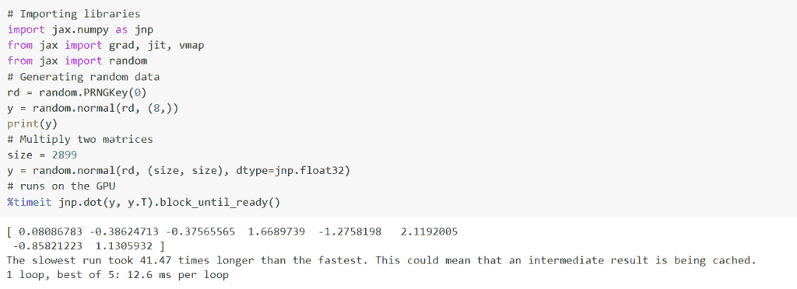
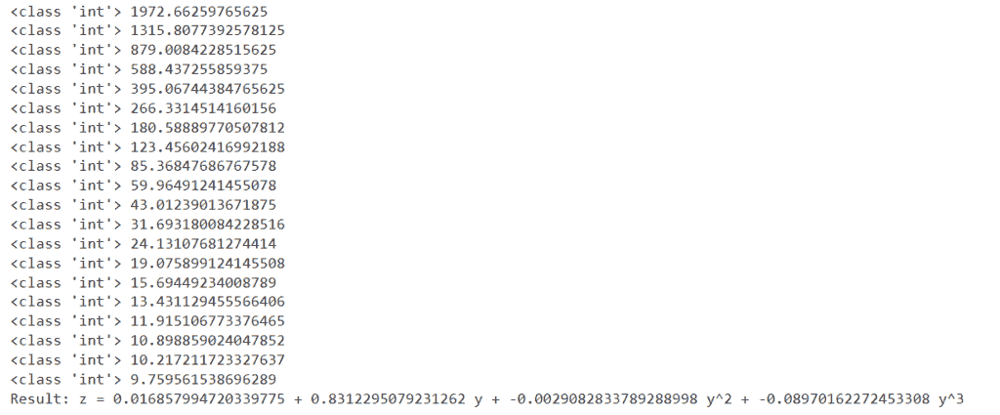

# Jax 与 py torch[主要区别]

> 原文：<https://pythonguides.com/jax-vs-pytorch/>

[](https://sharepointsky.teachable.com/p/python-and-machine-learning-training-course)

在本 [Python 教程](https://pythonguides.com/learn-python/)中，我们将学习 Python 中的 **Jax Vs PyTorch** 。Jax 是一种显示和创建数值程序转换的编程语言。它还能够为 CPU 或加速 GPU 编译数值程序。

而 [PyTorch](https://pythonguides.com/what-is-pytorch/) 是一个开源的机器学习库，主要用于 python 中的计算机视觉和自然语言处理。我们还将介绍与 **Jax vs PyTorch** 相关的不同例子。这些是我们将在本教程中讨论的主题。

*   Jax 简介
*   PyTorch 简介
*   Jax Vs PyTorch
*   Jax Vs PyTorch Vs Tensorflow
*   Jax 与 PyTorch 基准测试

目录

[](#)

*   [Jax 简介](#Introduction_to_Jax "Introduction to Jax")
*   [py torch 简介](#Introduction_to_PyTorch "Introduction to PyTorch")
*   [Jax Vs PyTorch](#Jax_Vs_PyTorch "Jax Vs PyTorch")
*   [Jax Vs PyTorch Vs TensorFlow](#Jax_Vs_PyTorch_Vs_TensorFlow "Jax Vs PyTorch Vs TensorFlow")
*   [Jax Vs PyTorch 基准测试](#Jax_Vs_PyTorch_benchmark "Jax Vs PyTorch benchmark")

## Jax 简介

在这一节中，我们将学习什么是 JAX 以及它在 python 中是如何工作的。

JAX 代表处决后。它是由 DeepMind 开发的机器学习库。Jax 是一个 JIT( Just In Time)编译器，它专注于控制在使用 python 时创建优化代码的 FLOPS 的最大数量。

Jax 是一种显示和创建数值程序转换的编程语言。它还能够为 CPU 或加速 GPU 编译数值程序。

Jax 不仅为 CPU，也为 GPU 和 TPU 启用了 Numpy 代码。

**代码:**

在下面的代码中，我们将导入所有必要的库如***import jax . numpy as jnp***， ***import grad*** ， ***jit*** ， ***vmap from jax*** ， ***和 import random from jax*** 。

*   **rd =随机。PRNGKey(0)** 用于生成随机数据，随机状态由两个无符号的 32 位整数描述，我们称之为密钥。
*   **y = random.normal(rd，(8，))**用于生成从正态分布中抽取的数字样本。
*   **print(y)** 用于使用 print()函数打印 y 值。
*   **size = 2899** 用于给出尺寸。
*   **random.normal(rd，(size，size)，dtype=jnp.float32)** 用于生成从正态分布中抽取的数字样本。
*   **%timeit jnp.dot(y，y.T)。block_until_ready()** 当 GPU 可用时在 GPU 上运行，否则在 CPU 上运行。

```
# Importing libraries
import jax.numpy as jnp
from jax import grad, jit, vmap
from jax import random
# Generating random data
rd = random.PRNGKey(0)
y = random.normal(rd, (8,))
print(y)
# Multiply two matrices
size = 2899
y = random.normal(rd, (size, size), dtype=jnp.float32)
# runs on the GPU
%timeit jnp.dot(y, y.T).block_until_ready() 
```

**输出:**

运行上面的代码后，我们得到下面的输出，其中我们可以看到两个矩阵的乘积被打印在屏幕上。



Introduction to JAX

至此，我们理解了 Jax 及其在 python 中的工作方式。

阅读: [PyTorch 激活功能](https://pythonguides.com/pytorch-activation-function/)

## py torch 简介

在本节中，我们将了解什么是 PyTorch 以及如何在 python 中使用 PyTorch。

PyTorch 是一个开源的机器学习库，主要用于 python 中的计算机视觉和自然语言处理。它是由脸书人工智能研究实验室开发的。

它是在修改的 BSD 许可证下发布的软件。它是基于 python 构建的，python 支持在 GPU(图形处理器)上计算张量。

PyTorch 易于使用，具有高效的内存使用，动态计算图，灵活，并创建可行的编码来提高处理速度。PyTorch 是最值得推荐的深度学习和人工智能库。

**代码:**

在下面的代码中，我们将导入所有必要的库，如 import torch 和 import math。

*   **y = torch.linspace(-math.pi，math.pi，2000，device=device，dtype=dtype)** 用于创建随机输入输出数据。
*   **m = torch.randn(()，device=device，dtype=dtype)** 用于随机初始化权重。
*   **z _ pred = m+n * y+o * y * * 2+p * y * * 3**用作前向传递来计算预测的 z。
*   **损失=(z _ pred–z)。pow(2)。sum()。item()** 用于计算损失。
*   **print(int，loss)** 用于打印损失。
*   **grad _ m = grad _ z _ pred . sum():**这里我们应用反向传播来计算与损耗有关的 m、n、o 和 p 的梯度。
*   **m -= learning_rate * grad_m** 用于使用梯度下降更新权重。
*   **print(f ' result:z = { m . item()}+{ n . item()} y+{ o . item()} y^2+{ p . item()}y^3′)**用于使用 print()函数打印结果。

```
# Importing libraries
import torch 
import math 

# Device Used
dtype = torch.float 
device = torch.device("cpu") 

# Create random input and output data 
y = torch.linspace(-math.pi, math.pi, 2000, device=device, dtype=dtype) 
z = torch.sin(y)  

# Randomly initialize weights 
m = torch.randn((), device=device, dtype=dtype) 
n = torch.randn((), device=device, dtype=dtype) 
o = torch.randn((), device=device, dtype=dtype) 
p = torch.randn((), device=device, dtype=dtype) 

learning_rate = 1e-6 
for i in range(2000): 
    # Forward pass: compute predicted z 
    z_pred = m + n * y + o * y ** 2 + p * y ** 3 

    # Compute and print loss 
    loss = (z_pred - z).pow(2).sum().item() 
    if i % 100 == 99: 
        print(int, loss) 

    # Backprop to compute gradients of m, n, o, p with respect to loss 
    grad_z_pred = 2.0 * (z_pred - z) 
    grad_m = grad_z_pred.sum() 
    grad_n = (grad_z_pred * y).sum() 
    grad_o = (grad_z_pred * y ** 2).sum() 
    grad_p = (grad_z_pred * y ** 3).sum() 

    # Update weights using gradient descent 
    m -= learning_rate * grad_m 
    n -= learning_rate * grad_n 
    o -= learning_rate * grad_o 
    p -= learning_rate * grad_p 

# Print the result
print(f'Result: z = {m.item()} + {n.item()} y + {o.item()} y^2 + {p.item()} y^3') 
```

**输出:**

在下面的输出中，您可以看到项目的结果被打印在屏幕上。



Introduction to PyTorch

至此，我们理解了 PyTorch 及其实现。

阅读: [PyTorch 全连接层](https://pythonguides.com/pytorch-fully-connected-layer/)

## Jax Vs PyTorch

在本节中，我们将了解 python 中 Jax 和 PyTorch 的主要区别。

| **Jax** | **指针** |
| Jax 于 2018 年 12 月发布 | PyTorch 于 2016 年 10 月发布。 |
| Jax 是由 Google 开发的 | PyTorch 是脸书开发的 |
| 它的图形创建是静态的 | 它的图形创建是动态的 |
| 目标受众是研究人员 | 目标受众是研究人员和开发人员 |
| Jax 实现具有线性运行时复杂性。 | PyTorch 实现具有二次时间复杂度。 |
| Jax 比 PyTorch 更灵活，因为它允许您定义函数，然后自动计算这些函数的导数。 | PyTorch 很灵活。 |
| 开发阶段正在开发(v0.1.55) | 发展阶段成熟(v1.8.0) |
| Jax 比 PyTorch 更高效，因为它可以跨多个 CPU 自动并行化我们的代码。 | PyTorch 效率很高。 |

Jax Vs PyTorch

至此，我们了解了 Jax 和 PyTorch 之间的主要区别。

阅读: [PyTorch 逻辑回归](https://pythonguides.com/pytorch-logistic-regression/)

## Jax Vs PyTorch Vs TensorFlow

在本节中，我们将了解 python 中 Jax Vs py torch Vs**tensor flow**的主要区别。

| ***Jax*** | ***PyTorch*** | ***张量流*** |
| Jax 是 Google 开发的。 | PyTorch 是脸书开发的。 | TensorFlow 是 Google 开发的。 |
| Jax 是灵活的。 | PyTorch 很灵活。 | TensorFlow 不灵活。 |
| Jax 的目标受众是研究人员 | PyTorch 的目标受众是研究人员和开发人员 | TensorFlow 的目标受众是研究人员和开发人员。 |
| Jax 创建了静态图 | PyTorch 创造了动态图表 | TensorFlow 创建了静态和动态图形 |
| Jax 既有高级 API，也有低级 API | PyTorch 有一个低级 API | TensorFlow 有一个高级 API |
| Jax 比 PyTorch 和 TensorFlow 更高效 | PyTorch 的效率比 Jax 低 | Tensorflow 的效率也不如 Jax |
| Jax 的开发阶段是 Developing(v0.1.55) | PyTorch 开发阶段已经成熟(1.8.0 版) | TensorFlow 开发阶段已经成熟(v2.4.1) |

Jax Vs PyTorch Vs TensorFlow

这样，我们理解了 Jax Vs PyTorch Vs TensorFlow。

阅读: [PyTorch 数据加载器+示例](https://pythonguides.com/pytorch-dataloader/)

## Jax Vs PyTorch 基准测试

在本节中，我们将学习 python 中的 **Jax Vs PyTorch 基准测试**。

Jax 是一个用于改变数值函数的机器学习库。它可以为 CPU 或加速器 GPU 汇编数值程序。

**代码:**

*   在下面的代码中，我们将导入所有必要的库，如 import jax.numpy as jnp，import grad，jit，vmap from jax，import random from jax。
*   **m =随机。PRNGKey(0)** 用于生成随机数据，随机状态由两个无符号的 32 位整数描述，我们称之为密钥。
    **i = random.normal(rd，(8，))**用于生成从正态分布中抽取的数字样本。
*   **print(y)** 用于使用 print()函数打印 y 值。
    **size = 2899** 用来给尺寸。
    **random.normal(rd，(size，size)，dtype=jnp.float32)** 用于生成从正态分布中抽取的数字样本。
    **%timeit jnp.dot(y，y.T)。block_until_ready()** 当 GPU 可用时在 GPU 上运行，否则在 CPU 上运行。
*   **%timeit jnp.dot(i，i.T)。block_until_ready():** 这里我们使用 block_until_ready，因为 jax 使用异步执行。
*   i = num.random.normal(size=(siz，siz))。astype(num.float32) 用于传输 GPU 上的数据

```
# Importing Libraries
import jax.numpy as jnp
from jax import grad, jit, vmap
from jax import random

# Multiplying Matrices
m = random.PRNGKey(0)
i = random.normal(m, (10,))
print(i)

# Multiply two big matrices
siz = 2800
i = random.normal(m, (siz, siz), dtype=jnp.float32)
%timeit jnp.dot(i, i.T).block_until_ready()  

# Jax Numpy function work on regular numpy array
import numpy as num
i = num.random.normal(size=(siz, siz)).astype(num.float32)
%timeit jnp.dot(i, i.T).block_until_ready()

# Transfer the data to GPU
from jax import device_put

i = num.random.normal(size=(siz, siz)).astype(num.float32)
i = device_put(i)
%timeit jnp.dot(i, i.T).block_until_ready()
```

**输出:**

运行上面的代码后，我们得到下面的输出，从中我们可以看到使用 Jax 的矩阵乘法是在屏幕上完成的。


Jax Vs PyTorch benchmark

**PyTorch 基准**

PyTorch benchmark 帮助我们验证我们的代码符合性能预期，并比较解决问题的不同方法。

**代码:**

在下面的代码中，我们将导入所有必要的库，如 import torch 和 import timeit。

*   **返回 m.mul(n)。sum(-1)** 用于通过相乘和求和来计算批量点。
*   **m = m . shape(-1，1，m.shape[-1])** 用于通过简化为 bmm 来计算批量点。
*   **i = torch.randn(1000，62)** 用作基准测试的输入。
*   **print(f'multiply_sum(i，I):{ j . time it(100)/100 * 1e 6:>5.1f } us ')**用于打印乘法和求和值。
*   **print(f'bmm(i，I):{ J1 . time it(100)/100 * 1e 6:>5.1f } us ')**用于打印 bmm 值。

```
# Import library
import torch
import timeit

# Define the Model
def batcheddot_multiply_sum(m, n):
    # Calculates batched dot by multiplying and sum
    return m.mul(n).sum(-1)

def batcheddot_bmm(m, n):
    #Calculates batched dot by reducing to bmm
    m = m.reshape(-1, 1, m.shape[-1])
    n = n.reshape(-1, n.shape[-1], 1)
    return torch.bmm(m, n).flatten(-3)

# Input for benchmarking
i = torch.randn(1000, 62)

# Ensure that both functions compute the same output
assert batcheddot_multiply_sum(i, i).allclose(batcheddot_bmm(i, i))

# Using timeit.Timer() method
j = timeit.Timer(
    stmt='batcheddot_multiply_sum(i, i)',
    setup='from __main__ import batcheddot_multiply_sum',
    globals={'i': i})

j1 = timeit.Timer(
    stmt='batcheddot_bmm(i, i)',
    setup='from __main__ import batcheddot_bmm',
    globals={'i': i})

print(f'multiply_sum(i, i):  {j.timeit(100) / 100 * 1e6:>5.1f} us')
print(f'bmm(i, i):      {j1.timeit(100) / 100 * 1e6:>5.1f} us')
```

**输出:**

运行上面的代码后，我们得到下面的输出，其中我们可以看到使用 PyTorch 基准的乘法和求和值打印在屏幕上。


Jax Vs PyTorch benchmark

至此，我们了解了 python 中 Jax 与 PyTorch 的基准测试。

另外，再看看一些 PyTorch 教程。

*   [PyTorch 预训练模型](https://pythonguides.com/pytorch-pretrained-model/)
*   [PyTorch 栈教程](https://pythonguides.com/pytorch-stack/)
*   [指针为 Numpy](https://pythonguides.com/pytorch-tensor-to-numpy/)
*   [PyTorch 批量归一化](https://pythonguides.com/pytorch-batch-normalization/)
*   [PyTorch 超参数调谐](https://pythonguides.com/pytorch-hyperparameter-tuning/)
*   [PyTorch 负荷模型](https://pythonguides.com/pytorch-load-model/)

因此，在本教程中，我们讨论了 **Jax Vs Pytorch** ，并且我们还讨论了与其实现相关的不同示例。这是我们已经讨论过的例子列表。

*   Jax 简介
*   PyTorch 简介
*   Jax Vs PyTorch
*   Jax Vs PyTorch Vs TensorFlow
*   Jax 与 PyTorch 基准测试

[Bijay Kumar](https://pythonguides.com/author/fewlines4biju/)

Python 是美国最流行的语言之一。我从事 Python 工作已经有很长时间了，我在与 Tkinter、Pandas、NumPy、Turtle、Django、Matplotlib、Tensorflow、Scipy、Scikit-Learn 等各种库合作方面拥有专业知识。我有与美国、加拿大、英国、澳大利亚、新西兰等国家的各种客户合作的经验。查看我的个人资料。

[enjoysharepoint.com/](https://enjoysharepoint.com/)[](https://www.facebook.com/fewlines4biju "Facebook")[](https://www.linkedin.com/in/fewlines4biju/ "Linkedin")[](https://twitter.com/fewlines4biju "Twitter")