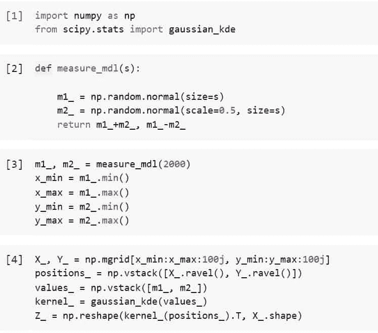
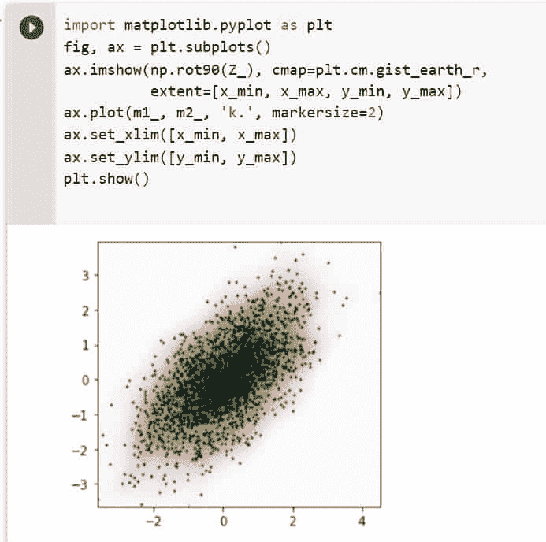
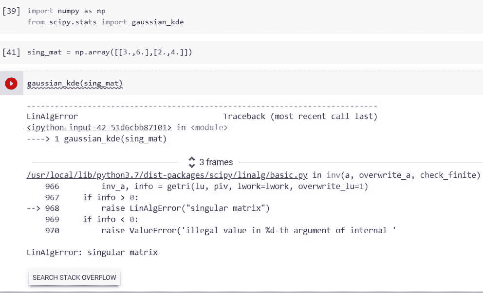
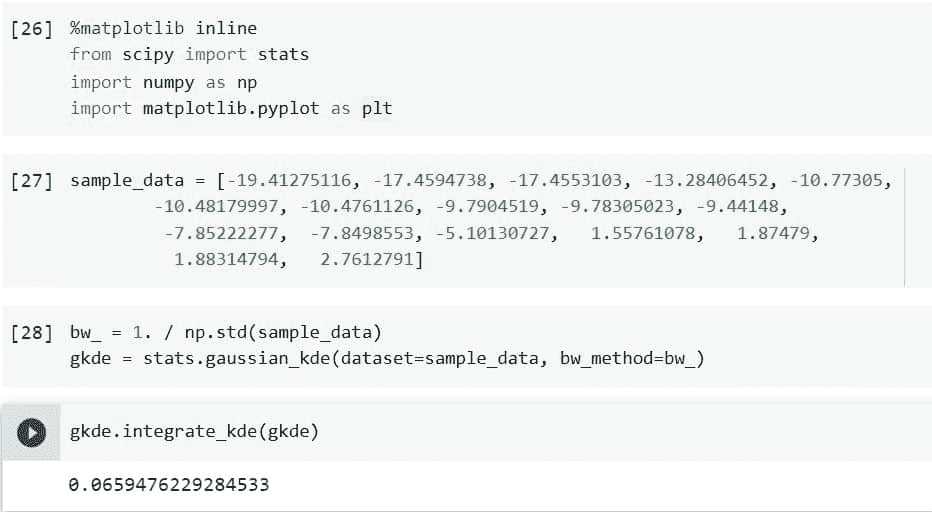
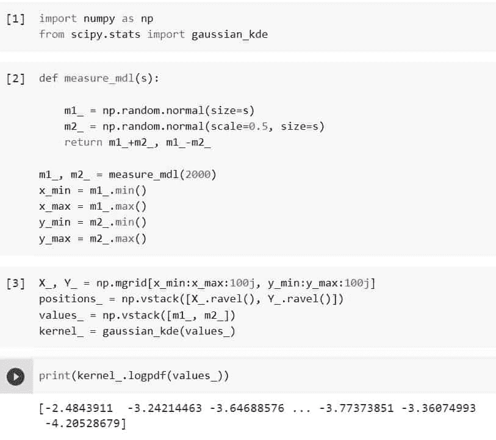
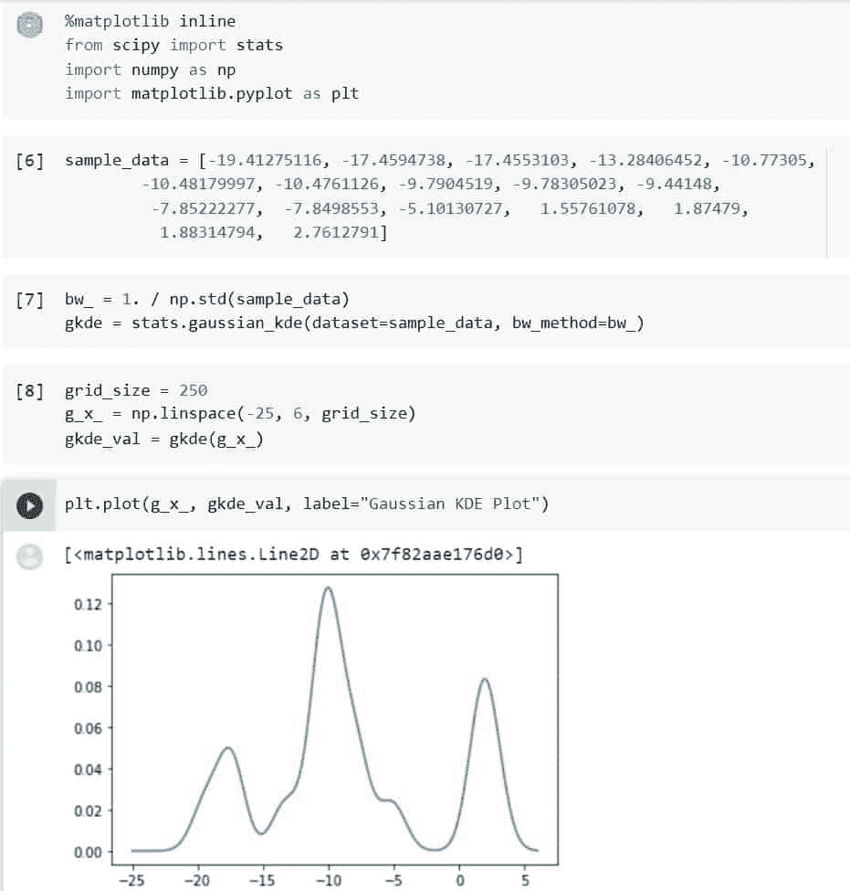
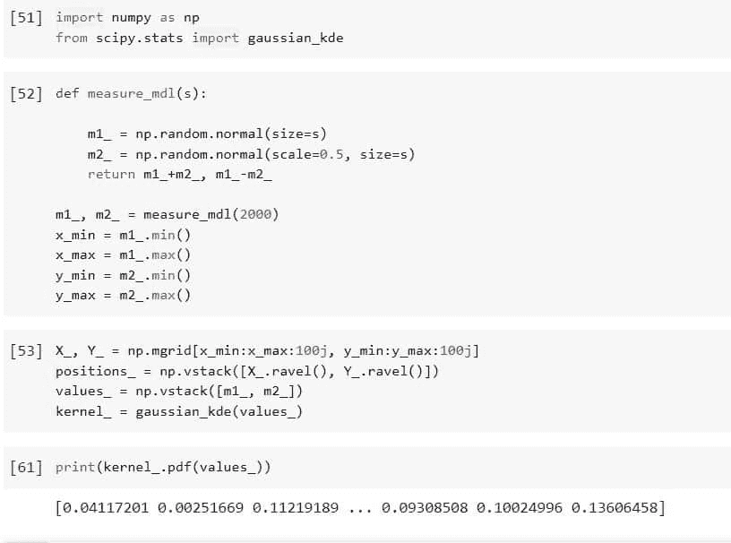
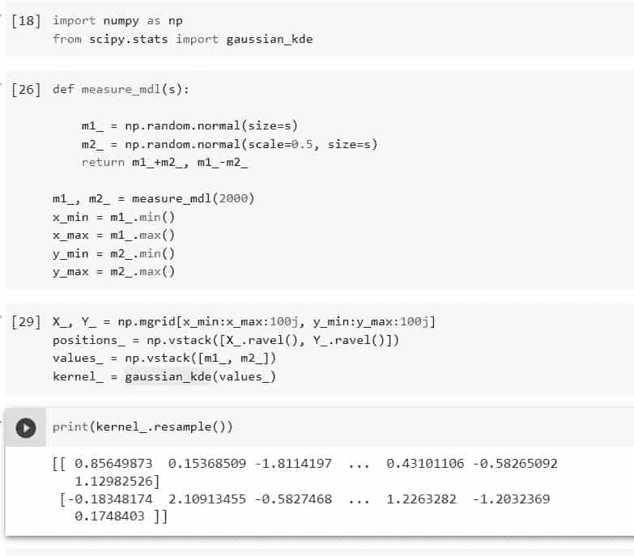

# 如何使用 Python Scipy Gaussian_Kde

> 原文：<https://pythonguides.com/python-scipy-gaussian_kde/>

[](https://sharepointsky.teachable.com/p/python-and-machine-learning-training-course)

在本教程中，我们将学习"***Python Scipy Gaussian _ Kde***"以了解" **Python Scipy Gaussian_Kde** "将如何在本教程中涵盖，以便您可以使用高斯 Kde 进行绘图、积分、重采样和其他操作。此外，谈谈以下主题。

*   什么是 KDE？
*   Python Scipy 高斯 _Kde
*   Python Scipy 高斯 _Kde 带宽
*   Python Scipy 高斯 _Kde 奇异矩阵
*   Python Scipy 高斯 _Kde 集成
*   Python Scipy Gaussian_Kde Logpdf
*   Python Scipy 高斯 _Kde 图
*   Python Scipy 高斯 _Kde PDF
*   Python Scipy 高斯 _Kde 重采样

目录

[](#)

*   什么是 KDE？
*   [Python Scipy Gaussian_Kde](#Python_Scipy_Gaussian_Kde "Python Scipy Gaussian_Kde")
*   [Python Scipy Gaussian_Kde 带宽](#Python_Scipy_Gaussian_Kde_Bandwidth "Python Scipy Gaussian_Kde Bandwidth")
*   [Python Scipy Gaussian_Kde 奇异矩阵](#Python_Scipy_Gaussian_Kde_Singular_Matrix "Python Scipy Gaussian_Kde Singular Matrix")
*   [Python Scipy Gaussian_Kde 集成](#Python_Scipy_Gaussian_Kde_Integrate "Python Scipy Gaussian_Kde Integrate")
*   [Python Scipy Gaussian_Kde 日志 pdf](#Python_Scipy_Gaussian_Kde_Logpdf "Python Scipy Gaussian_Kde Logpdf")
*   [Python Scipy Gaussian_Kde 图](#Python_Scipy_Gaussian_Kde_Plot "Python Scipy Gaussian_Kde Plot")
*   [Python Scipy Gaussian _ Kde PDF](#Python_Scipy_Gaussian_Kde_PDF "Python Scipy Gaussian_Kde PDF")
*   [Python Scipy Gaussian_Kde 重采样](#Python_Scipy_Gaussian_Kde_Resample "Python Scipy Gaussian_Kde Resample")

## 什么是 KDE？

核密度估计(KDE)是一种技术，在某种程度上，它将高斯混合的思想引入其逻辑结论。KDE 采用每个点一个高斯分量的混合，产生基本上非参数的密度估计量。

确定每个位置的分布形式的核，以及调节每个点的核的大小的核带宽，是核密度估计的自由参数。在实践中有许多可用的核，我们可以用来估计核密度。

阅读: [Python Scipy Lognormal](https://pythonguides.com/python-scipy-lognormal/)

## Python Scipy Gaussian_Kde

Gaussian_Kde 使用高斯核来表示核密度估计。随机变量的概率密度函数(PDF)可以使用核密度估计以非参数方式进行估计。单变量和多变量数据都可用于高斯 KDE。

自动带宽计算是其中的一部分。双峰或多峰分布经常过于平滑；单峰分布的估计效果最好。

Python Scipy 在模块`***scipy.stats***`中包含一个类`***gaussian_kde()***`,用于表示高斯核的核密度估计。

下面给出了语法。

```py
scipy.stats.gaussian_kde(dataset, bw_method=None, weights=None)
```

其中参数为:

**dataset(array_data):** 根据数据估计点。当处理单变量数据时，这是一个一维数组，否则，这是一个带有形状的二维数组。

**bw_method(string):** 采用该方法确定估计器带宽。这可以是一个可调用的标量常量、“ ***斯科特*** ”或“ ***西尔弗曼*** ”如果是标量，这将被用作 ***kde.factor*** 。如果是可调用的，应该只接受一个高斯 ***kde*** 实例，返回一个标量。如果没有，则使用 Scott(默认)。

**权重(array_data):** 数据点的权重。此处的形状必须与数据集的形状相匹配。如果没有(默认)，则认为样本的权重相等。

让我们以下面的步骤为例:

使用下面的 python 代码导入所需的库。

```py
import numpy as np
from scipy.stats import gaussian_kde
```

使用手动功能`measure_mdl`创建一些二维随机数据。

```py
def measure_mdl(s):

    m1_ = np.random.normal(size=s)
    m2_ = np.random.normal(scale=0.5, size=s)
    return m1_+m2_, m1_-m2_

m1_, m2_ = measure_mdl(2000)
x_min = m1_.min()
x_max = m1_.max()
y_min = m2_.min()
y_max = m2_.max()
```

使用这些数据，使用下面的代码估计内核密度。

```py
X_, Y_ = np.mgrid[x_min:x_max:100j, y_min:y_max:100j]
positions_ = np.vstack([X_.ravel(), Y_.ravel()])
values_ = np.vstack([m1_, m2_])
kernel_ = gaussian_kde(values_)
Z_ = np.reshape(kernel_(positions_).T, X_.shape)
```



Python Scipy Gaussian Kde

使用下面的代码绘制上面的数据。

```py
import matplotlib.pyplot as plt
fig, ax = plt.subplots()
ax.imshow(np.rot90(Z_), cmap=plt.cm.gist_earth_r,
          extent=[x_min, x_max, y_min, y_max])
ax.plot(m1_, m2_, 'k.', markersize=2)
ax.set_xlim([x_min, x_max])
ax.set_ylim([y_min, y_max])
plt.show() 
```



Python Scipy Gaussian Kde Example

这是如何使用 Python Scipy 的方法`***gaussian_kde()***`使用高斯核来表示核密度估计。

阅读: [Python Scipy Butterworth 滤镜](https://pythonguides.com/python-scipy-butterworth-filter/)

## Python Scipy Gaussian_Kde 带宽

当试图查看您的发行版时，带宽选择是必不可少的。不幸的是，大多数人只是简单地调用常规函数来创建密度图，而没有考虑带宽。

因此，情节可能不正确地描绘信息，这可能导致错误的推论。让我们更详细地讨论带宽选择，并确定如何使您的密度图更准确。

带宽选择如何影响曲线的平滑度。

*   欠平滑是由窄带宽引起的:这意味着密度图将类似于不同峰值的集合。
*   带宽过大会导致过度平滑:这意味着任何非单峰分布特征都将被隐藏，而密度图将呈现单峰分布。

带宽选择不当会导致欠平滑或过平滑。在这两种情况下，现实对我们来说都是模糊的。这个问题促使我们去问:“我怎样才能预先确定一个好的带宽值？”。

我们需要一种算法来选择理想的带宽值，同时避免过度平滑和欠平滑。这种算法的名称是带宽选择器，Python Scipy 为这种算法接受一个参数`***bw_method***`，其值类似于`***silverman***`和`***scott***`。

为了得到更好的平滑曲线，我们可以根据需要使用上面文章中的任何方法或算法，这两种算法在带宽选择方面非常有名。

阅读: [Python Scipy Butterworth 滤镜](https://pythonguides.com/python-scipy-butterworth-filter/)

## Python Scipy Gaussian_Kde 奇异矩阵

行列式为零的矩阵称为奇异矩阵。此外，这种矩阵缺少逆矩阵。在本节中，我们将尝试使用奇异矩阵来计算高斯 KDE。

使用下面的 python 代码导入所需的库或方法。

```py
import numpy as np
from scipy.stats import gaussian_kde
```

使用下面的代码创建一个奇异矩阵。

```py
sing_mat = np.array([[3.,6.],[2.,4.]])
```

现在使用下面的代码计算高斯 KDE。

```py
gaussian_kde(sing_mat)
```



Python Scipy Gaussian Kde Singular Matrix

从输出来看，它显示了误差线性 error:奇异矩阵，因此我们可以使用本质上是奇异矩阵的数据来计算高斯 KDE。

Raed: [Python Scipy 派生的数组](https://pythonguides.com/python-scipy-derivative-of-array/)

## Python Scipy Gaussian_Kde 集成

***`gaussian_kde()`*** 有一个方法`***integrate_kde()***`来计算核密度估计与另一个的乘积的积分。

下面给出了语法。

```py
gaussian_kde.integrate_kde(other)
```

其中，参数 other 是其他 KDE 的实例，该方法返回标量值。

让我们以下面的步骤为例:

使用下面的 python 代码导入所需的库或方法。

```py
%matplotlib inline
from scipy import stats
import numpy as np
import matplotlib.pyplot as pl
```

使用下面的代码生成样本数据。

```py
sample_data = [-19.41275116, -17.4594738, -17.4553103, -13.28406452, -10.77305,
        -10.48179997, -10.4761126, -9.7904519, -9.78305023, -9.44148,
         -7.85222277,  -7.8498553, -5.10130727,   1.55761078,   1.87479,
          1.88314794,   2.7612791]
```

使用下面的代码创建一个高斯 KDE 的实例。

```py
bw_ = 1\. / np.std(sample_data)
gkde = stats.gaussian_kde(dataset=sample_data, bw_method=bw_)
```

现在访问方法`integrate_kde()`并将上面的 kde 实例`gkde`作为另一个实例传递给方法来计算积分。

```py
gkde.integrate_kde(gkde)
```



Python Scipy Gaussian Kde Integrate

从输出来看，核密度估计的整数值是 0.0659，这就是如何使用 Python Scipy 对象`***gaussian_kde***`的方法`***integrate_kde()***`计算 KDE 的积分。

阅读: [Python Scipy Gamma](https://pythonguides.com/python-scipy-gamma/)

## Python Scipy Gaussian_Kde 日志 pdf

对象`***gaussain_kde***`有一个方法`***logpdf()***`来使用提供的数据点计算 log pdf。

让我们举一个例子，使用我们在“Python Scipy Gaussian_Kde”小节中使用的相同代码。

使用下面的 python 代码导入所需的库。

```py
import numpy as np
from scipy.stats import gaussian_kde
```

使用手动功能`measure_mdl`创建一些二维随机数据。

```py
def measure_mdl(s):

    m1_ = np.random.normal(size=s)
    m2_ = np.random.normal(scale=0.5, size=s)
    return m1_+m2_, m1_-m2_

m1_, m2_ = measure_mdl(2000)
x_min = m1_.min()
x_max = m1_.max()
y_min = m2_.min()
y_max = m2_.max()
```

使用这些数据，使用下面的代码估计内核密度。

```py
X_, Y_ = np.mgrid[x_min:x_max:100j, y_min:y_max:100j]
positions_ = np.vstack([X_.ravel(), Y_.ravel()])
values_ = np.vstack([m1_, m2_])
kernel_ = gaussian_kde(values_)
```

现在通过使用下面的代码将数据作为`***values_***`提供给方法`***logpdf()***`来计算`***kernel_***`的对数 pdf。

```py
print(kernel_.logpdf(values_))
```



Python Scipy Gaussian Kde Logpdf

这就是如何使用 Python Scipy 的方法`***logpdf()***`计算高斯 KDE 的对数 pdf。

阅读: [Python Scipy Stats Norm](https://pythonguides.com/python-scipy-stats-norm/)

## Python Scipy Gaussian_Kde 图

我们已经了解了如何计算高斯 KDE 及其参数，在本节中，我们将使用样本数据计算并绘制高斯 KDE。

使用下面的 python 代码导入所需的库或方法。

```py
%matplotlib inline
from scipy import stats
import numpy as np
import matplotlib.pyplot as pl
```

使用下面的代码生成样本数据。

```py
sample_data = [-19.41275116, -17.4594738, -17.4553103, -13.28406452, -10.77305,
        -10.48179997, -10.4761126, -9.7904519, -9.78305023, -9.44148,
         -7.85222277,  -7.8498553, -5.10130727,   1.55761078,   1.87479,
          1.88314794,   2.7612791]
```

使用下面的代码创建一个高斯 KDE 的实例。

```py
bw_ = 1\. / np.std(sample_data)
gkde = stats.gaussian_kde(dataset=sample_data, bw_method=bw_)
```

现在使用下面的代码计算高斯 KDE。

```py
grid_size = 250
g_x_ = np.linspace(-25, 6, grid_size)
gkde_val = gkde(g_x_)
```

使用下面的代码绘制高斯 KDE。

```py
plt.plot(g_x_, gkde_val, label="Gaussian KDE Plot")
```



Python Scipy Gaussian Kde Plot

这是如何使用 Python 的 matplotlib 库和给定或生成的数据绘制或绘制高斯 KDE 的方法。

阅读: [Python Scipy Kdtree](https://pythonguides.com/python-scipy-kdtree/)

## Python Scipy Gaussian _ Kde PDF

对象`***gaussain_kde***`有一个方法`***pdf()***`来使用提供的数据点评估预测的 pdf。

让我们举一个例子，使用我们在“Python Scipy Gaussian_Kde”小节中使用的相同代码。

使用下面的 python 代码导入所需的库。

```py
import numpy as np
from scipy.stats import gaussian_kde
```

使用手动功能`measure_mdl`创建一些二维随机数据。

```py
def measure_mdl(s):

    m1_ = np.random.normal(size=s)
    m2_ = np.random.normal(scale=0.5, size=s)
    return m1_+m2_, m1_-m2_

m1_, m2_ = measure_mdl(2000)
x_min = m1_.min()
x_max = m1_.max()
y_min = m2_.min()
y_max = m2_.max()
```

使用这些数据，使用下面的代码估计内核密度。

```py
X_, Y_ = np.mgrid[x_min:x_max:100j, y_min:y_max:100j]
positions_ = np.vstack([X_.ravel(), Y_.ravel()])
values_ = np.vstack([m1_, m2_])
kernel_ = gaussian_kde(values_)
```

现在通过使用下面的代码将数据作为`***values_***`提供给方法`***pdf()***`来计算`***kernel_***`的 pdf。

```py
print(kernel_.pdf(values_))
```



Python Scipy Gaussian Kde PDF

这就是如何使用 Python Scipy 的方法`***pdf()***`计算高斯 KDE 的概率密度函数。

阅读: [Python Scipy 统计峰度](https://pythonguides.com/python-scipy-stats-kurtosis/)

## Python Scipy Gaussian_Kde 重采样

对象`***gaussian_kde***`有一个方法`***resample***`从计算出的 pdf 中随机抽取一个数据集。

下面给出了语法。

```py
gaussian_kde.resample(size=None, seed=None)
```

其中参数为:

*   **size(int):** 要抽取的样本数量。如果未指定大小，则大小等于基础数据集中的实际样本数。
*   **seed(int，numpy.random.Generator):** 如果种子为 None(或 np.random)，则使用 numpy.random。它使用 RandomState 的单例。使用一个新的 RandomState 实例，如果种子是一个 int，则使用种子作为种子。如果包含种子的生成器或随机状态实例已经存在，则使用它。

方法`***resample()***`返回 ndarray 类型的样本数据集。

这里我们将使用我们在上面的“Python Scipy Gaussian_Kde”小节中所做的示例。

使用下面的 python 代码导入所需的库。

```py
import numpy as np
from scipy.stats import gaussian_kde
```

使用手动功能`measure_mdl`创建一些二维随机数据。

```py
def measure_mdl(s):

    m1_ = np.random.normal(size=s)
    m2_ = np.random.normal(scale=0.5, size=s)
    return m1_+m2_, m1_-m2_

m1_, m2_ = measure_mdl(2000)
x_min = m1_.min()
x_max = m1_.max()
y_min = m2_.min()
y_max = m2_.max()
```

使用这些数据，估计内核密度，并使用下面的代码对数据进行重新采样。

```py
X_, Y_ = np.mgrid[x_min:x_max:100j, y_min:y_max:100j]
positions_ = np.vstack([X_.ravel(), Y_.ravel()])
values_ = np.vstack([m1_, m2_])
kernel_ = gaussian_kde(values_)

print(kernel_.resample())
```



Python Scipy Gaussian Kde Resample

这是如何使用 Python Scipy 对象`***gaussian_kde()***`的方法`***resample()***`从计算的 pdf 中随机绘制数据集的重采样。

您可能也喜欢阅读下面的 Python SciPy 教程。

*   [Python Scipy 置信区间](https://pythonguides.com/scipy-confidence-interval/)
*   [Python Scipy Gaussian_Kde](https://pythonguides.com/python-scipy-gaussian_kde/)
*   [Python Lil_Matrix Scipy](https://pythonguides.com/python-lil_matrix-scipy/)
*   [Python Scipy 卡方检验](https://pythonguides.com/python-scipy-chi-square-test/)
*   [Python Scipy 特殊模块](https://pythonguides.com/python-scipy-special/)
*   [Scipy Linalg–实用指南](https://pythonguides.com/scipy-linalg/)

因此，在本教程中，我们学习了高斯 KDE，计算了对数 pdf，整合了 KDE，绘制或重新采样了 KDE 数据值，还绘制了高斯 KDE 图。我们还讨论了下面列出的主题。

*   什么是 KDE？
*   Python Scipy 高斯 _Kde
*   Python Scipy 高斯 _Kde 带宽
*   Python Scipy 高斯 _Kde 奇异矩阵
*   Python Scipy 高斯 _Kde 集成
*   Python Scipy Gaussian_Kde Logpdf
*   Python Scipy 高斯 _Kde 图
*   Python Scipy 高斯 _Kde PDF
*   Python Scipy 高斯 _Kde 重采样

[Bijay Kumar](https://pythonguides.com/author/fewlines4biju/)

Python 是美国最流行的语言之一。我从事 Python 工作已经有很长时间了，我在与 Tkinter、Pandas、NumPy、Turtle、Django、Matplotlib、Tensorflow、Scipy、Scikit-Learn 等各种库合作方面拥有专业知识。我有与美国、加拿大、英国、澳大利亚、新西兰等国家的各种客户合作的经验。查看我的个人资料。

[enjoysharepoint.com/](https://enjoysharepoint.com/)[](https://www.facebook.com/fewlines4biju "Facebook")[](https://www.linkedin.com/in/fewlines4biju/ "Linkedin")[](https://twitter.com/fewlines4biju "Twitter")