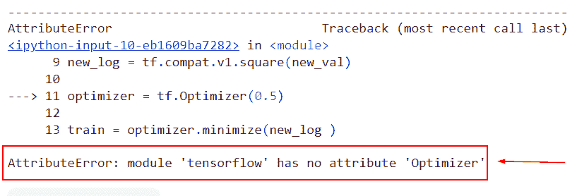
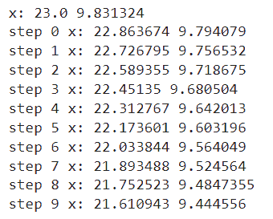
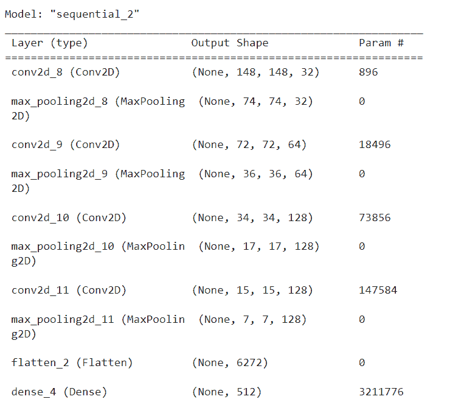
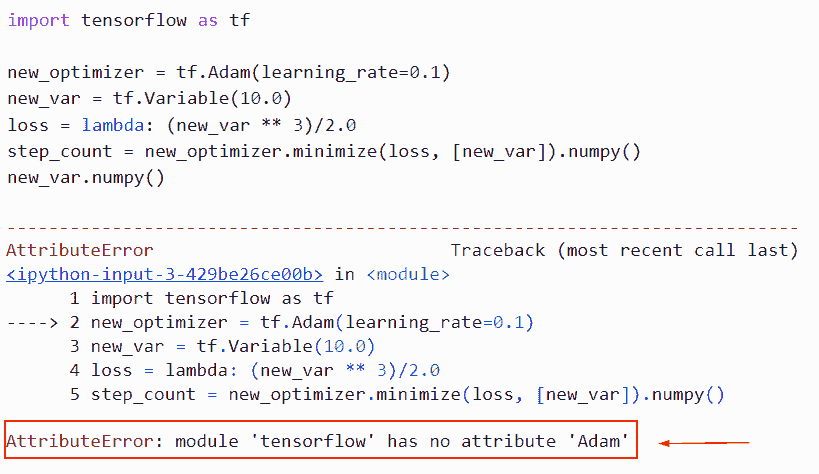
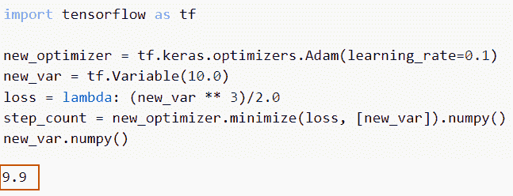
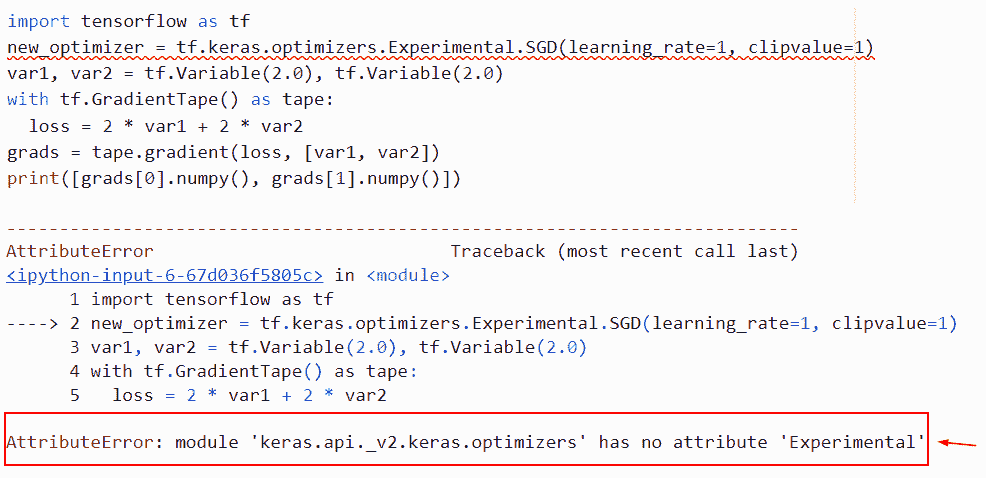
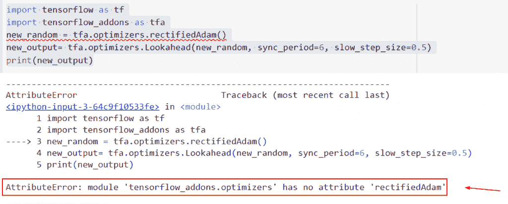
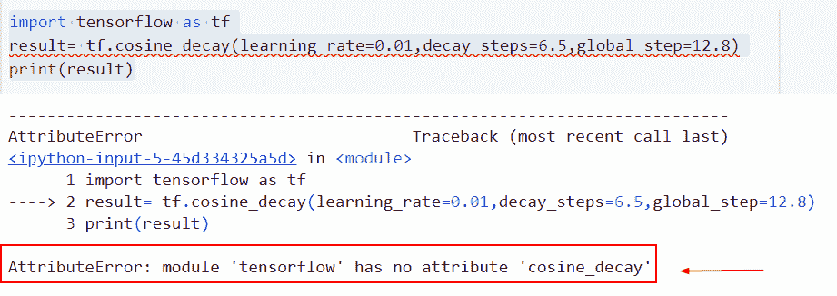
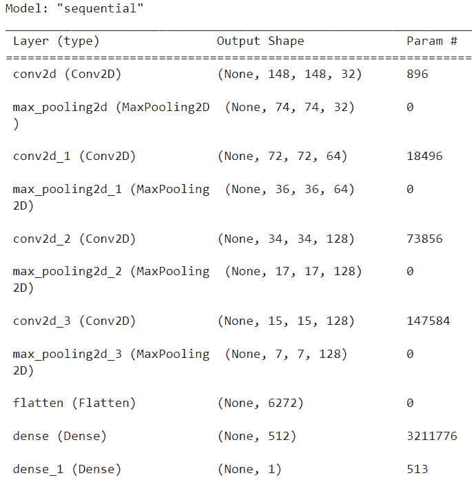

# 模块“tensorflow”没有属性“optimizers”

> 原文：<https://pythonguides.com/module-tensorflow-has-no-attribute-optimizers/>

[](https://sharepointsky.teachable.com/p/python-and-machine-learning-training-course)

在这个 [Python 教程](https://pythonguides.com/learn-python/)中，我们将重点关注如何修复 ***属性错误:模块“tensorflow”在我们的模型中没有属性*** **【优化器】**，我们还将看一些如何在 ***TensorFlow*** 中使用优化器函数的例子。我们将讨论这些话题。

*   Attributeerror 模块“tensorflow”没有属性“optimizers”
*   Attributeerror 模块的 tensorflow。“Keras.optimizers”没有属性“rmsprop”
*   Attributeerror 模块的 tensorflow。“Keras.optimizers”没有属性“adam”
*   Attributeerror 模块的 tensorflow。“Keras.optimizers”没有“experimental”属性
*   Attributeerror 模块的 tensorflow。“Keras.optimizers”没有属性“rectified adam”
*   Attributeerror 模块的 tensorflow。“keras . optimizer . schedules”没有属性“cosine_decay”
*   Attributeerror 模块“tensor flow . python . keras . optimizer”没有属性“sgd”

目录

[](#)

*   [Attributeerror 模块“tensorflow”没有属性“optimizer”](#Attributeerror_module_tensorflow_has_no_attribute_Optimizers "Attributeerror module ‘tensorflow’ has no attribute ‘Optimizers’")
*   [Attributeerror 模块' tensorflow。“Keras.optimizers”没有属性“rms prop”](#Attributeerror_module_tensorflowKerasoptimizers_has_no_attribute_rmsprop "Attributeerror module ‘tensorflow.Keras.optimizers’ has no attribute ‘rmsprop’")
*   [Attributeerror 模块“tensorflow”没有属性“Adam”](#Attributeerror_module_tensorflow_has_no_attribute_adam "Attributeerror module ‘tensorflow’ has no attribute ‘adam’")
*   [Attributeerror 模块' tensorflow。“Keras.optimizers”没有“Experimental”属性](#Attributeerror_module_tensorflowKerasoptimizers_has_no_attribute_Experimental "Attributeerror module ‘tensorflow.Keras.optimizers’  has no attribute ‘Experimental’")
*   [Attributeerror 模块' tensor flow . addons . optimizer '没有属性' rectified adam'](#Attributeerror_module_tensorflowaddonsoptimizers_has_no_attribute_rectified_adam "Attributeerror module ‘tensorflow.addons.optimizers’  has no attribute ‘rectified adam’")
*   [Attributeerror 模块' tensorflow '没有属性' cosine_decay'](#Attributeerror_module_tensorflow_has_no_attribute_cosine_decay "Attributeerror module ‘tensorflow’  has no attribute ‘cosine_decay’")
*   [Attributeerror 模块' tensor flow . python . keras . optimizer '没有属性' sgd'](#Attributeerror_module_tensorflowpythonKerasoptimizers_has_no_attribute_sgd "Attributeerror module ‘tensorflow.python.Keras.optimizers’  has no attribute ‘sgd’")

## Attributeerror 模块“tensorflow”没有属性“optimizer”

*   为了最小化损失函数并更快地提高模型精度，优化器是通过调整各种参数和权重来减少损失(一种误差)的方法或算法。
*   优化器是扩展类的一个子类，包含用于训练特定模型的额外数据。重要的是要记住，不需要张量，优化器类是用提供的参数初始化的。优化人员正在努力提高特定模型的性能和速度。

**举例**:

```
import tensorflow as tf 

tf.compat.v1.disable_eager_execution() 

new_tens = tf.Variable(23, name = 'new_tens', dtype = tf.float32) 

new_val = tf.compat.v1.log(new_tens) 

new_log = tf.compat.v1.square(new_val) 

optimizer = tf.Optimizer(0.5) 

train = optimizer.minimize(new_log ) 

init = tf.compat.v1.initialize_all_variables() 

def optimize(): 

   with tf.compat.v1.Session() as session: 

      session.run(init) 

      print("x:", session.run(new_tens), session.run(new_log )) 

      for step in range(10): 

         session.run(train) 

         print("step", step, "x:", session.run(new_tens), session.run(new_log )) 

optimize() 
```

下面是以下给定代码的执行过程



Attributeerror module ‘tensorflow’ has no attribute ‘optimizers’

以下是此错误的解决方案。

在本例中，我们将使用 TF . compat . v1 . train . gradientdescentoptimizer()函数和执行梯度下降算法的函数优化器。

**语法**:

```
tf.compat.v1.train.GradientDescentOptimizer(
    learning_rate, use_locking=False, name='GradientDescent'
)
```

*   它由几个参数组成
    *   **learning_rate** :该参数定义浮点值，是要使用的学习速率。
    *   **use_locking** :检查条件是否成立，然后使用锁进行更新操作。
    *   **name** :默认情况下，它采用‘gradient descent’值并指定操作的名称。

```
import tensorflow as tf 

tf.compat.v1.disable_eager_execution() 

new_tens = tf.Variable(23, name = 'new_tens', dtype = tf.float32) 

new_val = tf.compat.v1.log(new_tens) 

new_log = tf.compat.v1.square(new_val) 

optimizer = tf.compat.v1.train.GradientDescentOptimizer(0.5) 

train = optimizer.minimize(new_log ) 

init = tf.compat.v1.initialize_all_variables() 

def optimize(): 

   with tf.compat.v1.Session() as session: 

      session.run(init) 

      print("x:", session.run(new_tens), session.run(new_log )) 

      for step in range(10): 

         session.run(train) 

         print("step", step, "x:", session.run(new_tens), session.run(new_log )) 

optimize() 
```

你可以参考下面的截图



Solution of Attributeerror module ‘tensorflow’ has no attribute ‘optimizers’

这就是我们如何解决 attributeerror 模块“tensorflow”没有属性“optimizers”。

阅读:[模块“tensorflow”没有属性“div”](https://pythonguides.com/module-tensorflow-has-no-attribute-div/)

## Attributeerror 模块' tensorflow。“Keras.optimizers”没有属性“rms prop”

*   在本节中，我们将讨论如何求解 attributeerror 模块 tensorflow。Keras.optimizers 没有属性“rmsprop”。
*   为了训练神经网络，RMSprop 是一种基于梯度的优化方法。随着数据通过神经网络等极其复杂的过程，梯度有消失或扩大的趋势(参见消失梯度问题)。提出了一种用于小批量学习的随机方法 Rmsprop。
*   深度学习的粉丝中最受欢迎的优化器之一是 prop 女士。这可能是因为，虽然没有出版，但它在附近是众所周知的。

**举例**:

```
from keras import layers
from keras import models
from tensorflow.keras import optimizers

model = models.Sequential()
model.add(layers.Conv2D(32, (3, 3), activation='relu',
                        input_shape=(150, 150, 3)))
model.add(layers.MaxPooling2D((2, 2)))
model.add(layers.Conv2D(64, (3, 3), activation='relu'))
model.add(layers.MaxPooling2D((2, 2)))
model.add(layers.Conv2D(128, (3, 3), activation='relu'))
model.add(layers.MaxPooling2D((2, 2)))
model.add(layers.Conv2D(128, (3, 3), activation='relu'))
model.add(layers.MaxPooling2D((2, 2)))
model.add(layers.Flatten())
model.add(layers.Dense(512, activation='relu'))
model.add(layers.Dense(1, activation='sigmoid'))

model.summary()

from keras import optimizers

model.compile(loss='binary_crossentropy', optimizer=optimizers.RMSprop(lr=1e-4), metrics=['acc'])
```

下面是以下给定代码的实现


Attributeerror module tensorflow.Keras_.optimizers has no attribute rmsprop

此错误的解决方案。

在本例中，我们将使用 TF . optimizer . rms prop()函数。

**语法**:

```
tf.keras.optimizers.RMSprop(
    learning_rate=0.001, rho=0.9, momentum=0.0, epsilon=1e-07, centered=False,
    name='RMSprop', **kwargs
)
```

示例:

```
from keras import layers
from keras import models
from keras import optimizers

model = models.Sequential()
model.add(layers.Conv2D(32, (3, 3), activation='relu',
                        input_shape=(150, 150, 3)))
model.add(layers.MaxPooling2D((2, 2)))
model.add(layers.Conv2D(64, (3, 3), activation='relu'))
model.add(layers.MaxPooling2D((2, 2)))
model.add(layers.Conv2D(128, (3, 3), activation='relu'))
model.add(layers.MaxPooling2D((2, 2)))
model.add(layers.Conv2D(128, (3, 3), activation='relu'))
model.add(layers.MaxPooling2D((2, 2)))
model.add(layers.Flatten())
model.add(layers.Dense(512, activation='relu'))
model.add(layers.Dense(1, activation='sigmoid'))

model.summary()

from keras import optimizers

model.compile(loss='binary_crossentropy', optimizer=keras.optimizers.RMSprop(learning_rate=0.01))
```

下面是以下给定代码的实现。



Solution of Attributeerror module tensorflow.Keras_.optimizers has no attribute rmsprop

正如你在截图中看到的，我们已经解决了 attributeerror 模块 tensorflow。Keras.optimizers 没有 rmsprop 属性。

阅读:[模块“tensorflow”没有属性“truncated _ normal”](https://pythonguides.com/module-tensorflow-has-no-attribute-truncated_normal/)

## Attributeerror 模块“tensorflow”没有属性“Adam”

*   Adam 是目前使用的最流行的优化方法之一。这种方法确定了每个参数的自适应学习率。
*   这种方法结合了 momentum 和 RMSprop 的优点。即存储先前平方梯度以及先前梯度的衰减平均值。

**举例**:

```
import tensorflow as tf
new_optimizer = tf.Adam(learning_rate=0.1)
new_var = tf.Variable(10.0)
loss = lambda: (new_var ** 3)/2.0   
step_count = new_optimizer.minimize(loss, [new_var]).numpy()
new_var.numpy()
```

下面是以下代码的截图



Attributeerror module tensorflow have no attribute adam

此错误的解决方案。

在这个例子中，我们将使用 tf。这个函数可以优化算法。

**语法**:

```
tf.keras.optimizers.Adam(
    learning_rate=0.001,
    beta_1=0.9,
    beta_2=0.999,
    epsilon=1e-07,
    amsgrad=False,
    name='Adam',
    **kwargs
)
```

*   它由几个参数组成
    *   **learning_rate** =是 TF . keras . optimizer . schedules、浮点值或张量的调度。LearningRateSchedule 或返回实际值的 callable，不接受任何参数。学习标准值的速度为 0.001。
    *   **beta** _1:要使用的实际值、浮点值、常量浮点张量或不接受参数的可调用函数。第一时刻的估计指数下降率。默认情况下，0.9。
    *   **amsgrad** :默认情况下，它采用 false 值，并应用算法的 amsgrad 变体。
    *   **name** :该参数指定操作的名称，默认取‘Adam’。

```
import tensorflow as tf

new_optimizer = tf.keras.optimizers.Adam(learning_rate=0.1)
new_var = tf.Variable(10.0)
loss = lambda: (new_var ** 3)/2.0   
step_count = new_optimizer.minimize(loss, [new_var]).numpy()
new_var.numpy()
```

你可以参考下面的截图。



Solution of Attributeerror module tensorflow has no attribute adam

这就是我们解决 attributeerror 模块 tensorflow 没有属性 adam 的方法。

阅读:[模块“张量流”没有属性“日志”](https://pythonguides.com/module-tensorflow-has-no-attribute-log/)

## Attributeerror 模块' tensorflow。“Keras.optimizers”没有“Experimental”属性

*   这表明正在讨论的类或方法是未完成的，处于开发的早期阶段，或者，不经常地，不符合标准。
*   这是一个用户贡献的集合，仍然可以作为测试和反馈的开源资源，即使它们没有与核心 TensorFlow 完全集成。

**语法**:

下面是**TF . keras . optimizer . experimental . optimizer()**函数的语法

```
tf.keras.optimizers.experimental.Optimizer(
    name,
    clipnorm=None,
    clipvalue=None,
    global_clipnorm=None,
    use_ema=False,
    ema_momentum=0.99,
    ema_overwrite_frequency=None,
    jit_compile=True,
    **kwargs
)
```

*   它由几个参数组成
    *   **name** :优化器生成的动量累加器权重的术语。
    *   **clipnorm** : Float。如果设置，每个权重的梯度被单独剪裁，以使其范数不高于该值。
    *   **clipvalue** :如果设置，每个权重的梯度被裁剪为不高于该值。

**举例**:

```
import tensorflow as tf 
new_optimizer = tf.keras.optimizers.Experimental.SGD(learning_rate=1, clipvalue=1)
var1, var2 = tf.Variable(2.0), tf.Variable(2.0)
with tf.GradientTape() as tape:
  loss = 2 * var1 + 2 * var2
grads = tape.gradient(loss, [var1, var2])
print([grads[0].numpy(), grads[1].numpy()])
```

你可以参考下面的截图



Attributeerror module tensorflow.Keras_.optimizers has no attribute Experimental

正如你在截图中看到的，我们已经解决了 attributeerror 模块 tensorflow。Keras.optimizers 没有 Experimental 属性。

阅读: [TensorFlow 全连通层](https://pythonguides.com/tensorflow-fully-connected-layer/)

## Attributeerror 模块' tensor flow . addons . optimizer '没有属性' rectified adam'

*   在本节中，我们将讨论如何求解 attributeerror 模块 tensorflow。“Keras.optimizers”没有属性“rectified adam”。
*   修正的 Adam，通常称为 RAdam，是一种随机优化器变体，它添加了一个项来修正自适应学习率的方差。它试图解决亚当的可怕的趋同问题。

**举例**:

```
import tensorflow as tf
import tensorflow_addons as tfa
new_random = tfa.optimizers.rectifiedAdam()
new_output= tfa.optimizers.Lookahead(new_random, sync_period=6, slow_step_size=0.5)
print(new_output)
```

下面是以下给定代码的实现



Attributeerror module tensorflow.addons.optimizers has no attribute rectified adam

此错误的解决方案

在本例中，我们将使用 tensor flow . addons . optimizer()函数

**语法**:

下面是 Python TensorFlow 中 tensor flow . addons . optimizer()函数的语法

```
tfa.optimizers.RectifiedAdam(
    learning_rate: Union[FloatTensorLike, Callable, Dict] = 0.001,
    beta_1: tfa.types.FloatTensorLike = 0.9,
    beta_2: tfa.types.FloatTensorLike = 0.999,
    epsilon: tfa.types.FloatTensorLike = 1e-07,
    weight_decay: Union[FloatTensorLike, Callable, Dict] = 0.0,
    amsgrad: bool = False,
    sma_threshold: tfa.types.FloatTensorLike = 5.0,
    total_steps: int = 0,
    warmup_proportion: tfa.types.FloatTensorLike = 0.1,
    min_lr: tfa.types.FloatTensorLike = 0.0,
    name: str = 'RectifiedAdam',
    **kwargs
)
```

*   它由几个参数组成
    *   learning_rate:是张量或浮点值。
    *   **beta_1** :浮点量或固定浮点张量。一阶矩指数递减率的估计。
    *   **beta_2** :浮点量或固定浮点张量。二阶矩指数下降率的估计。
    *   **weight_decay** :张量或浮点值或时间表，是每个自变量的权重衰减。
    *   **amsgrad** :是否应用算法的 amsgrad 变体，然后 threshold 简单计算平均平均值。
    *   **warmup_proportion** :浮点值。
    *   **min_lr** :浮点值，最小学习值。

```
import tensorflow as tf
import tensorflow_addons as tfa
new_random = tfa.optimizers.RectifiedAdam()
new_output= tfa.optimizers.Lookahead(new_random, sync_period=6, slow_step_size=0.5)
print(new_output)
```

下面是以下给定代码的实现。


Solution of Attributeerror module tensorflow.addons.optimizers has no attribute rectified adam

这就是我们如何解决 attributeerror 模块 tensor flow . addons . optimizer 没有纠正 adam。

阅读:[批量归一化张量流](https://pythonguides.com/batch-normalization-tensorflow/)

## Attributeerror 模块' tensorflow '没有属性' cosine_decay'

*   本节我们将讨论如何解决 attributeerror 模块' tensorflow '没有属性' cosine_decay '。
*   随着模型训练的进展，经常建议降低学习速率。当给定初始学习率时，该函数应用余弦衰减函数。
*   为了计算衰减学习率，需要一个全局步长值。可以使用在每个训练步骤中递增的张量流变量。

**举例**:

```
import tensorflow as tf
result= tf.cosine_decay(learning_rate=0.01,decay_steps=6.5,global_step=12.8)
print(result)
```

下面是以下代码的截图



Attributeerror module tensorflow has no attribute cosine_decay

此错误的解决方案。

在本例中，我们将使用**TF . compat . v1 . train . cosine _ decay()**函数，该函数将余弦衰减应用于学习率。

**语法**:

下面是 TF . compat . v1 . train . cosine _ decay()函数的语法

```
tf.compat.v1.train.cosine_decay(
    learning_rate, global_step, decay_steps, alpha=0.0, name=None
) 
```

*   它由几个参数组成
    *   **learning _ rate**:Python 整数、标量 float32 或 float64 张量等。最初学习的速度。
    *   **global _ step**:Python 数，标量 int32 或 int64，或者张量。要计算衰减，请使用全局步长。
    *   **decay _ steps**:Python 数，标量 int32 或 int64，或者张量。衰减阶段的数量。
    *   **alpha** :默认取 0.0 值，指定最小学习率值为 learning_rate 的分数。

```
import tensorflow as tf
result= tf.compat.v1.train.cosine_decay(learning_rate=0.01,decay_steps=6.5,global_step=12.8)
print(result)
```

你可以参考下面的截图


Solution of Attributeerror module tensorflow has no attribute cosine_decay

阅读: [TensorFlow feed_dict + 9 个例子](https://pythonguides.com/tensorflow-feed_dict/)

## Attributeerror 模块' tensor flow . python . keras . optimizer '没有属性' sgd'

*   这里我们将讨论如何解决 attributeerror 模块' tensor flow . python . keras . optimizer '没有属性' sgd '。
*   术语“随机”是指与随机概率相关的过程或系统。因此，在随机梯度下降中，每次迭代都随机选择少量样本，而不是整个数据集。
*   用于计算每次迭代梯度的数据集样本数在梯度下降中称为“批次”，这是短语的复数形式。传统梯度下降优化(如批次梯度下降)中的批次被假定为整个数据集。

**举例**:

```
from keras import layers
from keras import models
from tensorflow.keras import optimizers

model = models.Sequential()
model.add(layers.Conv2D(32, (3, 3), activation='relu',
                        input_shape=(150, 150, 3)))
model.add(layers.MaxPooling2D((2, 2)))
model.add(layers.Conv2D(64, (3, 3), activation='relu'))
model.add(layers.MaxPooling2D((2, 2)))
model.add(layers.Conv2D(128, (3, 3), activation='relu'))
model.add(layers.MaxPooling2D((2, 2)))
model.add(layers.Conv2D(128, (3, 3), activation='relu'))
model.add(layers.MaxPooling2D((2, 2)))
model.add(layers.Flatten())
model.add(layers.Dense(512, activation='relu'))
model.add(layers.Dense(1, activation='sigmoid'))

model.summary()

from keras import optimizers

model.compile(loss='binary_crossentropy', optimizer=optimizers.sgd(lr=1e-4), metrics=['acc'])
```

下面是以下给定代码的实现


Attributeerror module tensorflow.python.Keras_.optimizers has no attribute sgd

此错误的解决方案

```
from keras import layers
from keras import models
from tensorflow.keras import optimizers

model = models.Sequential()
model.add(layers.Conv2D(32, (3, 3), activation='relu',
                        input_shape=(150, 150, 3)))
model.add(layers.MaxPooling2D((2, 2)))
model.add(layers.Conv2D(64, (3, 3), activation='relu'))
model.add(layers.MaxPooling2D((2, 2)))
model.add(layers.Conv2D(128, (3, 3), activation='relu'))
model.add(layers.MaxPooling2D((2, 2)))
model.add(layers.Conv2D(128, (3, 3), activation='relu'))
model.add(layers.MaxPooling2D((2, 2)))
model.add(layers.Flatten())
model.add(layers.Dense(512, activation='relu'))
model.add(layers.Dense(1, activation='sigmoid'))

model.summary()

from keras import optimizers

model.compile(loss='binary_crossentropy', optimizer=optimizers.sgd(lr=1e-4), metrics=['acc'])
```

你可以参考下面的截图



Solution of Attributeerror module tensorflow.python.Keras_.optimizers has no attribute sgd

这就是我们解决 attributerror 模块“tensor flow . python . keras . optimizer”没有属性“sgd”的方法。

还要看下面的 Python 中的 TendorFlow 教程。

*   [TensorFlow 稀疏张量+示例](https://pythonguides.com/tensorflow-sparse-tensor/)
*   [二元交叉熵张量流](https://pythonguides.com/binary-cross-entropy-tensorflow/)
*   [梯度下降优化器张量流](https://pythonguides.com/gradient-descent-optimizer-tensorflow/)
*   [将列表转换为张量张量流](https://pythonguides.com/convert-list-to-tensor-tensorflow/)
*   [模块“张量流”没有属性“函数”](https://pythonguides.com/module-tensorflow-has-no-attribute-function/)

在本 Python 教程中，我们重点讨论了如何修复 ***属性错误:模块“tensorflow”在我们的模型中没有属性*** **【优化器】**，我们还将看一些如何在 ***TensorFlow*** 中使用优化器函数的示例。我们已经讨论了这些主题。

*   Attributeerror 模块“tensorflow”没有属性“optimizers”
*   Attributeerror 模块的 tensorflow。“Keras.optimizers”没有属性“rmsprop”
*   Attributeerror 模块的 tensorflow。“Keras.optimizers”没有属性“adam”
*   Attributeerror 模块的 tensorflow。“Keras.optimizers”没有“experimental”属性
*   Attributeerror 模块的 tensorflow。“Keras.optimizers”没有属性“rectified adam”
*   Attributeerror 模块的 tensorflow。“keras . optimizer . schedules”没有属性“cosine_decay”
*   Attributeerror 模块“tensor flow . python . keras . optimizer”没有属性“sgd”

[Bijay Kumar](https://pythonguides.com/author/fewlines4biju/)

Python 是美国最流行的语言之一。我从事 Python 工作已经有很长时间了，我在与 Tkinter、Pandas、NumPy、Turtle、Django、Matplotlib、Tensorflow、Scipy、Scikit-Learn 等各种库合作方面拥有专业知识。我有与美国、加拿大、英国、澳大利亚、新西兰等国家的各种客户合作的经验。查看我的个人资料。

[enjoysharepoint.com/](https://enjoysharepoint.com/)[](https://www.facebook.com/fewlines4biju "Facebook")[](https://www.linkedin.com/in/fewlines4biju/ "Linkedin")[](https://twitter.com/fewlines4biju "Twitter")