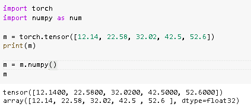
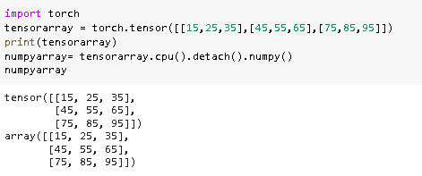
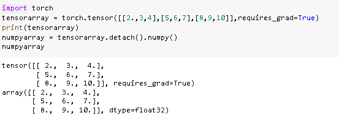
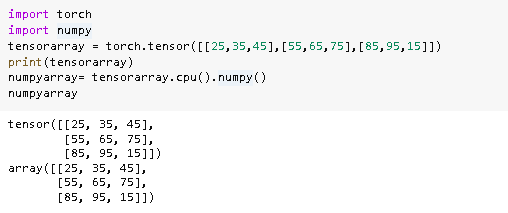
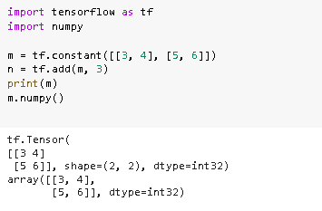
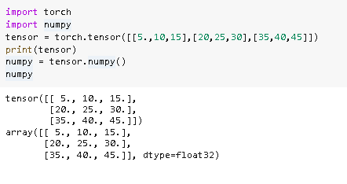
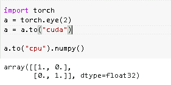
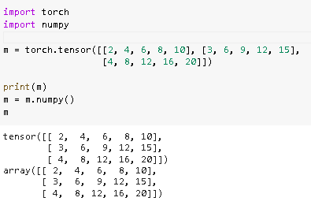

# 张量积是 Numpy

> 原文：<https://pythonguides.com/pytorch-tensor-to-numpy/>

[](https://sharepointsky.teachable.com/p/python-and-machine-learning-training-course)

在这个 [Python 教程](https://pythonguides.com/learn-python/)中，我们将学习关于 **PyTorch 张量到 NumPy** 的知识，我们还将涵盖与 **PyTorch 张量到 NumPy** 相关的不同示例。我们将讨论这些话题。

*   张量积是 numpy
*   PyTorch 张量到 numpy 分离
*   PyTorch 张量到 numpy 浮点
*   PyTorch 张量到 numpy CPU
*   张量积是 numpy int
*   张量张量为 numpy dtype
*   PyTorch 张量到 numpy GPU
*   PyTorch Cuda 张量到 numpy
*   将 PyTorch 张量变换为 numpy

目录

[](#)

*   [指针为 NumPy](#PyTorch_Tensor_to_NumPy "PyTorch Tensor to NumPy")
*   [PyTorch 张量到 numpy 分离](#PyTorch_tensor_to_numpy_detach "PyTorch tensor to numpy detach")
*   [PyTorch 张量到 numpy 浮点](#PyTorch_tensor_to_numpy_float "PyTorch tensor to numpy float")
*   [指针是指 CPU 的 numpy】](#PyTorch_tensor_to_numpy_CPU "PyTorch tensor to numpy CPU")
*   [指针是指 numpy int](#PyTorch_tensor_to_numpy_int "PyTorch tensor to numpy int")
*   [PyTorch 张量到 numpy dtype](#PyTorch_tensor_to_numpy_dtype "PyTorch tensor to numpy dtype")
*   [PyTorch 张量到 numpy GPU](#PyTorch_tensor_to_numpy_GPU "PyTorch tensor to numpy GPU")
*   [PyTorch Cuda 张量到 NumPy](#PyTorch_Cuda_tensor_to_NumPy "PyTorch Cuda tensor to NumPy")
*   [将 PyTorch 张量转换为 numpy](#Transform_PyTorch_tensor_to_numpy "Transform PyTorch tensor to numpy")

## 指针为 NumPy

在这一节中，我们将学习如何在 python 中将 **PyTorch 张量转换为 NumPy** 。

*   PyTorch 张量与 numpy 数组相同，它只是一个简单的 n 维数组，用于任意数值计算。
*   PyTorch tensor to numpy 定义为占用 CPU 并与 numpy 数组共享相同内存的进程。

**代码:**

在下面的代码中，我们将导入一些库，从中可以看到张量到 [NumPy 数组](https://pythonguides.com/python-numpy-array/)的转换。

*   **m = torch.tensor([12.14，22.58，32.02，42.5，52.6])** 用于创建具有浮点类型元素的一维张量。
*   **print(m)** 用于在屏幕上打印张量数组。
*   **m = m.numpy()** 是用来将张量转换成 numpy 数组的方法。
*   **m** 这个 m 用来在屏幕上显示 numpy 数组。

```
**# importing torch module**
import torch

**# import numpy module**
import numpy as num

m = torch.tensor([12.14, 22.58, 32.02, 42.5, 52.6])

print(m)

m = m.numpy()

m
```

**输出:**

运行上面的代码后，我们得到下面的输出，其中我们可以看到张量数组正在转换成 NumPy 数组，结果打印在屏幕上。



PyTorch tensor to NumPy

同样，检查:[交叉熵损失 PyTorch](https://pythonguides.com/cross-entropy-loss-pytorch/)

## PyTorch 张量到 numpy 分离

在本节中，我们将了解如何在 python 中将 **PyTorch 张量转换为 numpy detach** 。

PyTorch tensor to numpy detach 定义为从 CPU 分离张量的过程，之后使用 **numpy()** 进行 numpy 转换。

**代码:**

在下面的代码中，我们将导入 torch 模块，从中可以看到 tensor 到 numpy detach 的转换。

*   **tensor array = torch . tensor([[15，25，35]，[45，55，65]，[75，85，95]])** 用于创建张量数组。
*   **print(tensorarray)** 用于在屏幕上打印张量数组。
*   **numpyarray= tensorarray.cpu()。分离()。numpy()** 用于将张量收敛到 numpy detach。
*   **numpyarray** 用于在屏幕上显示 numpy 数组。

```
import torch
tensorarray = torch.tensor([[15,25,35],[45,55,65],[75,85,95]])
print(tensorarray)
numpyarray= tensorarray.cpu().detach().numpy()
numpyarray
```

**输出:**

在下面的输出中，我们可以看到张量到 numpy detach 的转换显示在屏幕上。



PyTorch tensor to numpy detach

阅读: [PyTorch 保存模型–完整指南](https://pythonguides.com/pytorch-save-model/)

## PyTorch 张量到 numpy 浮点

在这一节中，我们将学习如何在 python 中将 **PyTorch 张量转换成 NumPy float** 。

*   在前进之前，我们应该有一个关于浮动的知识。Float 是一种数据类型，包括以十进制格式表示的分数。
*   PyTorch tensor to numpy float 用于将张量数组转换为 numpy float 数组。

**代码:**

在下面的代码中，我们将导入 torch 模块，用于张量到 NumPy float 的转换。

*   **tensor array = torch . tensor([[2。，3，4]，[5，6，7]，[8，9，10]]，requires_grad=True)** 用于创建张量数组。
*   **print(tensorarray)** 用于在屏幕上打印张量数组。
*   **numpyarray = tensor array . detach()。numpy()** 用于将张量数组转换为 numpy 浮点数。
*   **numpyarray** 用于在屏幕上显示 numpy 数组。

```
import torch
tensorarray = torch.tensor([[2.,3,4],[5,6,7],[8,9,10]],requires_grad=True)
print(tensorarray)
numpyarray = tensorarray.detach().numpy()
numpyarray
```

**输出:**

运行上面的代码后，我们得到下面的输出，其中我们可以看到张量数组被转换为 NumPy 浮点数组。



PyTorch tensor to NumPy float

阅读: [PyTorch 批量标准化](https://pythonguides.com/pytorch-batch-normalization/)

## 指针是指 CPU 的 numpy】

在这一节中，我们将学习如何用 python 将张量转换成 numpy CPU。

*   PyTorch 张量与 numpy 数组相同，它只是一个简单的 n 维数组，并使用任意数值计算。
*   PyTorch 张量到 numpy CPU 是张量到 numpy CPU 的转换过程。张量存储在 CPU 上，共享同一个内存。

**代码:**

在下面的代码中，我们将导入一些库，从这些库中可以完成张量到 numpy CPU 的转换。

*   **tensor array = torch . tensor([[25，35，45]，[55，65，75]，[85，95，15]])** 用于创建张量数组。
*   **print(tensorarray)** 用于在屏幕上打印张量数组。
*   **numpyarray= tensorarray.cpu()。numpy()** 用于将张量转换为 numpy CPU。
*   **numpyarray** 用于在屏幕上显示 numpy 数组。

```
import torch
import numpy
tensorarray = torch.tensor([[25,35,45],[55,65,75],[85,95,15]])
print(tensorarray)
numpyarray= tensorarray.cpu().numpy()
numpyarray
```

**输出:**

在下面的输出中，我们可以看到张量到 numpy CPU 的转换被打印在屏幕上。



PyTorch tensor to NumPy CPU

阅读:[Keras Vs py torch–主要区别](https://pythonguides.com/keras-vs-pytorch/)

## 指针是指 numpy int

在本节中，我们将学习 python 中的 **PyTorch tensor 到 numpy int** 。

**PyTorch tensor to NumPy int** 定义为我们将张量数组转换为数组中 NumPy 的过程。

**代码:**

在下面的代码中，我们将导入一些库，从中我们可以将数组张量转换为 numpy。

*   **m = tf.constant([[3，4]，[5，6]])** 用于创建张量数组。
*   **print(m)** 用于打印 m 的值
*   **m.numpy()** 用于将 Pytorch 张量转换为 numpy。

```
import tensorflow as tf
import numpy

m = tf.constant([[3, 4], [5, 6]])                 
n = tf.add(m, 3)
print(m)
m.numpy()
```

**输出:**

运行上面的代码后，我们得到下面的输出，其中我们可以看到 PyTorch 张量到 numpy inst 被打印在屏幕上。



PyTorch tensor to numpy int

阅读:[py torch ms loss–详细指南](https://pythonguides.com/pytorch-mseloss/)

## PyTorch 张量到 numpy dtype

在这一节中，我们将学习 python 中 NumPy dtype 的 **PyTorch 张量。**

*   在继续之前，我们应该了解一些关于 dtype 的知识。
*   dtype 是一种数据类型，它描述了固定大小的内存块与数组保持联系的字节数。数据类型的类型有整型、浮点型等。
*   PyTorch 张量到 numpy dtype 定义为将张量转换为 numpy dtype 数组的过程。

**代码:**

在下面的代码中，我们将导入一些库，从这些库中我们可以将 tensor 转换为 numpy dtype。

*   张量= torch.tensor([[5。，10，15]，[20，25，30]，[35，40，45]]) 用于创建张量数组。
*   **print(tensor)** 用于在屏幕上打印张量数组。
*   **numpy = tensor.numpy()** 用于将张量转换为 numpy 数组。

```
import torch
import numpy
tensor = torch.tensor([[5.,10,15],[20,25,30],[35,40,45]])
print(tensor)
numpy = tensor.numpy()
numpy
```

**输出:**

在下面的输出中，我们可以看到 PyTorch 张量到 numpy dtype 被打印在屏幕上。



PyTorch tensor to NumPy dtype

阅读 [PyTorch 逻辑回归](https://pythonguides.com/pytorch-logistic-regression/)

## PyTorch 张量到 numpy GPU

在本节中，我们将学习 python 中的 **PyTorch 张量到 NumPy GPU** 。

张量可以从 numpy 数组中生成，它类似于 NumPy，其属性描述数据类型、形状等。

**代码:**

在下面的代码中，我们将导入 torch 模块，从中我们可以将张量转换为 numpy GPU 数组。

*   **torch.eye(2)** 函数返回大小为 m*n 的 2d 张量。
*   **a.to("cuda")** Cuda 是一种应用编程接口，允许软件使用某些类型的图形处理单元(GPU)。
*   **a . to(“CPU”)。numpy()** 用于将张量转换为 numpy。

```
import torch
a = torch.eye(2)
a = a.to("cuda")

a.to("cpu").numpy()
```

**输出:**

运行上述代码后，我们得到以下输出，其中我们可以看到 PyTorch 张量到 NumPy GPU 数组打印在屏幕上。



PyTorch tensor to NumPy GPU

读取 [PyTorch 双星交叉熵](https://pythonguides.com/pytorch-binary-cross-entropy/)

## PyTorch Cuda 张量到 NumPy

在本节中，我们将学习如何在 python 中将 **PyTorch Cuda tensor 转换为 numpy** 。

*   在继续之前，我们应该了解一些关于 Cuda 的知识。
*   Cuda 代表计算统一设备架构，这是一个应用程序编程接口，允许软件使用特定类型的 GPU。
*   PyTorch Cuda tensor to numpy 定义为将 Cuda tensor 转换为 numpy 数组的过程。

**代码:**

在下面的代码中，我们将导入一些库，我们可以从中创建张量，然后将张量转换为 NumPy。

*   **tensor = torch.tensor([2，4，6，8，10]，dtype=torch.float32，requires_grad=True)。cuda()** 用于在 GPU 上创建张量。
*   **print(tensor)** 用于在屏幕上打印张量数组。
*   **num = tensor.detach()。cpu()。numpy()** 用于将张量转换为 numpy。
*   **num** 用于在屏幕上显示 numpy 数组。

```
import torch
import numpy

 **# Create tensor on the GPU**
tensor = torch.tensor([2, 4, 6, 8, 10], dtype=torch.float32, requires_grad=True).cuda()
print(tensor)
num = tensor.detach().cpu().numpy()
num
```

**输出:**

在下面的输出中，我们可以看到 PyTorch Cuda 张量到 numpy 数组的转换被打印在屏幕上。


PyTorch Cuda tensor to numpy

阅读: [PyTorch 数据加载器+示例](https://pythonguides.com/pytorch-dataloader/)

## 将 PyTorch 张量转换为 numpy

在这一节中，我们将学习如何用 python 将 PyTorch 张量转换成 numpy。

将 PyTorch 张量转换为 numpy 定义为将 PyTorch 张量转换为 numpy 数组的过程。

**代码:**

在下面的代码中，我们将导入一些库，从中我们可以将 PyTorch 转换为 numpy。

*   **m = torch.tensor([[2，4，6，8，10]，[3，6，9，12，15]，[4，8，12，16，20]])** 用于创建具有整数类型元素的二维张量。
*   **print(m)** 用于打印张量数组。
*   **m = m.numpy()** 用于将张量转换为 numpy 数组。
*   **m** 用于在屏幕上显示 numpy 数组。

```
 import torch

import numpy

m = torch.tensor([[2, 4, 6, 8, 10], [3, 6, 9, 12, 15], 
                  [4, 8, 12, 16, 20]])  
print(m)

m = m.numpy()

m
```

**输出:**运行上面的代码后，我们得到下面的输出，其中我们可以看到张量到 NumPy 数组的转换被打印在屏幕上。



Transform PyTorch tensor to numpy

因此，在本教程中，我们讨论了从 **PyTorch 张量到 numpy** 的关系，并且讨论了与其实现相关的不同示例。这是我们已经讨论过的例子列表。

*   张量积是 numpy
*   PyTorch 张量到 numpy 分离
*   PyTorch 张量到 numpy 浮点
*   PyTorch 张量到 numpy CPU
*   张量积是 numpy int
*   张量张量为 numpy dtype
*   PyTorch 张量到 numpy GPU
*   PyTorch Cuda 张量到 numpy
*   将 PyTorch 张量变换为 numpy

[Bijay Kumar](https://pythonguides.com/author/fewlines4biju/)

Python 是美国最流行的语言之一。我从事 Python 工作已经有很长时间了，我在与 Tkinter、Pandas、NumPy、Turtle、Django、Matplotlib、Tensorflow、Scipy、Scikit-Learn 等各种库合作方面拥有专业知识。我有与美国、加拿大、英国、澳大利亚、新西兰等国家的各种客户合作的经验。查看我的个人资料。

[enjoysharepoint.com/](https://enjoysharepoint.com/)[](https://www.facebook.com/fewlines4biju "Facebook")[](https://www.linkedin.com/in/fewlines4biju/ "Linkedin")[](https://twitter.com/fewlines4biju "Twitter")