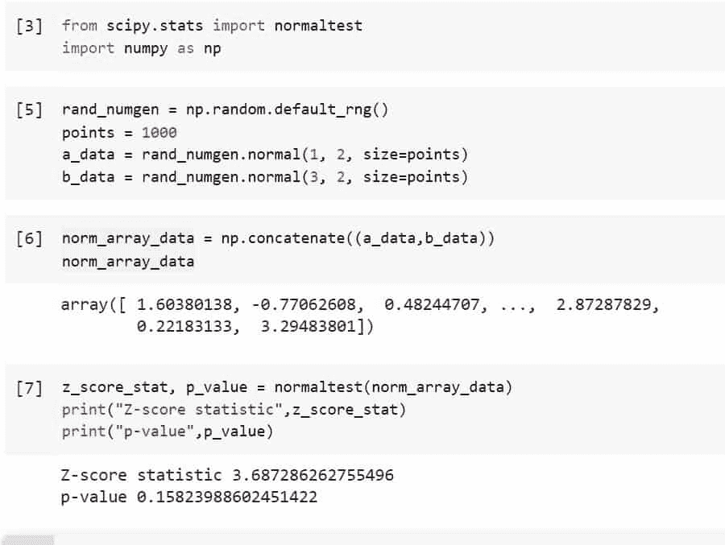
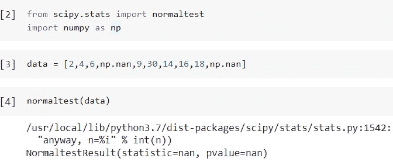
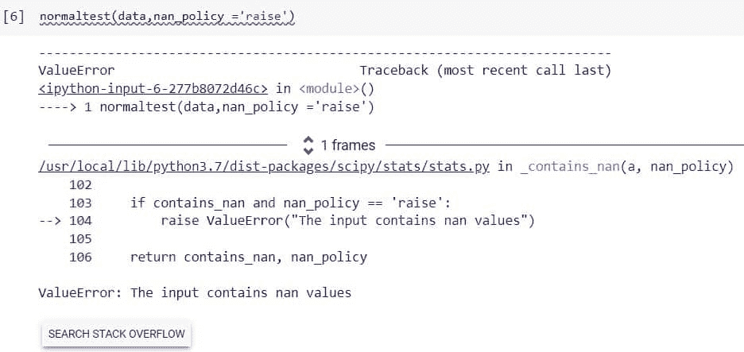
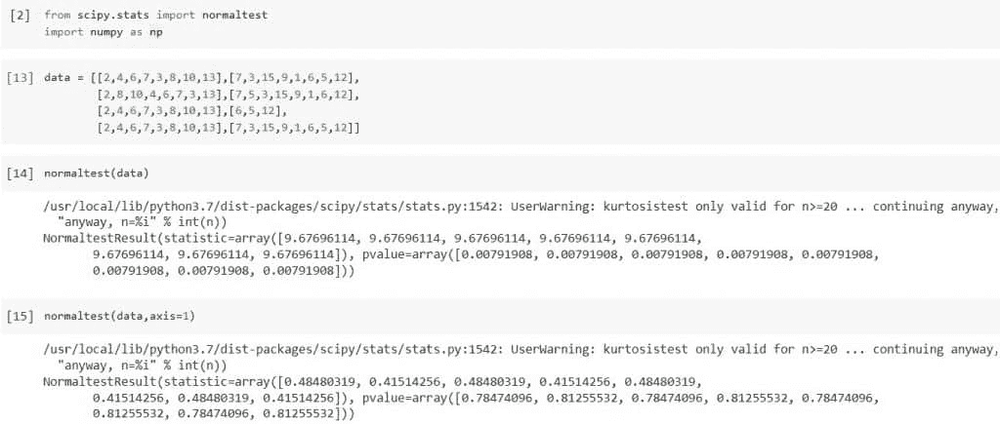

# Python Scipy 正常测试[带示例]

> 原文：<https://pythonguides.com/python-scipy-normal-test/>

[](https://sharepointsky.teachable.com/p/python-and-machine-learning-training-course)

在本 [Python 教程](https://pythonguides.com/learn-python/)中，我们将学习“***Python Scipy Normal Test***”来检查样本的正态性。此外，我们还将使用一些示例来涵盖以下主题。

*   什么是正常测试
*   Python Scipy 正常测试
*   Python Scipy 正常测试解释
*   Python Scipy 正常测试 Nan 策略
*   Python Scipy 正常测试轴

另外，查看相关教程: [Python Scipy Stats Norm](https://pythonguides.com/python-scipy-stats-norm/)

目录

[](#)

*   [什么是正常测试](#What_is_Normal_test "What is Normal test")
*   [Python Scipy 正常测试](#Python_Scipy_Normal_Test "Python Scipy Normal Test")
*   [Python Scipy 正常测试解释](#Python_Scipy_Normal_Test_Interpretation "Python Scipy Normal Test Interpretation")
*   [Python Scipy 正常测试 Nan](#Python_Scipy_Normal_Test_Nan "Python Scipy Normal Test Nan")
*   [Python Scipy 正常测试轴](#Python_Scipy_Normal_Test_Axis "Python Scipy Normal Test Axis")

## 什么是正常测试

数据的正态性正在接受检验。但这实际上意味着什么呢？术语“正态性”描述了一种特殊类型的统计分布，称为“正态分布”，也称为“高斯分布”或“钟形曲线”

数据的平均值和标准偏差用于定义正态分布，即连续的对称分布。无论均值或标准差如何，正态分布的形式永远不会改变。曲线下的数据分布是关键属性。

*   理想化的分布是正态分布。使用正态性检验，您实际上是在确定您的数据是否足够接近正态，以使您能够放心地使用您的统计工具，而不是确定它是否绝对符合正态分布。
*   在某些情况下，您可能能够利用统计工具，而不必担心您的数据是否正态，因为它对正态假设是稳健的。换句话说，当正态性假设在某种程度上被违反时，正态性检验不会做出不必要的反应。

阅读: [Python Scipy Stats 泊松](https://pythonguides.com/python-scipy-stats-poisson/)

## Python Scipy 正常测试

Python Scipy 在模块`***scipy.stats***`中有一个方法`***normaltest()***`来检查样本是否偏离正态分布。

下面给出了语法。

```py
scipy.stats.normaltest(a, axis=1, nan_policy='omit')
```

其中参数为:

*   ***a(array_data):*** 它是我们要测试的作为样本的数据的数组。
*   ***轴(int):*** 用于指定在哪个轴上计算测试。默认情况下，它是 0。
*   ***nan_ploicy:*** 用于处理数组内存在的 nan 值。它有一些以不同方式处理 nan 值的参数，这些参数是`***omit***`、`***propagate***`和`***raise***`。

方法`***normaltest()***`返回两个值作为统计数据和数组或浮点类型的 p 值。

让我们以一个示例为例，按照以下步骤测试该示例:

使用下面的 python 代码导入所需的库。

```py
from scipy.stats import normaltest
import numpy as np
```

使用下面的代码创建一个随机数生成器，并在生成器的帮助下生成正常的数组数据。

```py
rand_numgen = np.random.default_rng()
points = 1000
a_data = rand_numgen.normal(1, 2, size=points)
b_data = rand_numgen.normal(3, 2, size=points)
```

使用下面的代码将这两个数据组合成一个数据数组。

```py
norm_array_data = np.concatenate((a_data,b_data))
norm_array_data
```

使用下面的代码对作为样本的数据数组执行常规测试。

```py
z_score_stat, p_value = normaltest(norm_array_data)
print("Z-score statistic",z_score_stat)
print("p-value",p_value)
```



Scipy Normal test

从输出中，我们可以看到 p 值大于 0.5，这意味着样本不符合正态分布。

这就是如何使用 Python Scipy 库检查样本的正态性。

阅读: [Python Scipy Kdtree](https://pythonguides.com/python-scipy-kdtree/)

## Python Scipy 正常测试解释

为了解释普通测试，我们需要知道返回方法`***normaltest()***`的一个值，即 p 值。

每个正态性检验提供一个 P 值。为了理解任何 P 值，我们必须知道零假设。所考虑的假设是，所有的值都来自具有高斯分布的总体。

P 值提供了答案，如果零假设为真，数据的随机样本偏离高斯理想的可能性有多大？。如果 P 值大于 0.05，答案是肯定的。如果 P 值小于或等于 0.05，答案是否定的。

***如果正态性检验的 P 值很高，应该得出什么结论？*** 我们只能说明数据是符合高斯分布的。正态性检验不能确定数据取自高斯分布的样本。

正态性检验唯一能做的就是表明，与高斯理想的偏离，并不比你纯粹随机观察到的要大。在处理庞大的数据集时，这是令人欣慰的。较小的数据集降低了正态性检验检测甚至轻微偏离高斯理想的能力。

***如果正态性检验的 P 值低，我该从中得出什么？*** 数据是从高斯分布中抽样出来的，按照零假设。如果 P 值足够低，则零假设被拒绝，因此，另一个假设(数据不是从高斯总体中采样的)被接受。

对于大数据集，分布可能非常接近高斯分布，也可能非常接近高斯分布。你无法从正态性检验中了解到任何关于替代分布的信息。

如果您的 P 值低到足以认为偏离高斯分布具有“统计显著性”，我们有四种选择:

*   该信息可以来源于不同的识别分布。在这种情况下，我们也许可以改变我们的值，使它们呈现高斯分布。例如，如果数据来自对数正态分布，则将所有值转换为它们的对数。
*   正态性检验的失败可能是由于一个或多个异常值的存在。执行异常值测试，考虑消除异常值。
*   如果偏离常态很小，人们可以决定不采取行动。统计测试通常只轻微违反高斯假设。
*   使用不做高斯分布假设的非参数检验。然而，使用非参数检验是一个重大决定，不使用它们也是如此。它不应该是自动化的，也不应该依赖于单一的正态性测试。

阅读: [Python Scipy 统计峰度](https://pythonguides.com/python-scipy-stats-kurtosis/)

## Python Scipy 正常测试 Nan

为了处理样本或数据数组中可能出现的 nan 值，Python Scipy 方法`***normaltest()***`支持参数`***nan_policy***`。下面列出了 nan 策略处理 nan 值的三种备选方案或方法。

*   省略:NaN 值将不包括在计算中。如果用来计算统计数据的轴切片仍然没有足够的数据，输出中的相关条目将是 NaN。
*   raise:如果存在 NaN，将生成 ValueError。
*   propagate:如果在计算统计数据的轴切片(例如，行)中有 NaN，则输出的对应元素将是 NaN。

让我们使用下面的步骤，通过一个例子来理解在执行正常测试时如何处理 nan 值:

使用下面的 python 代码导入所需的库。

```py
from scipy.stats import normaltest
import numpy as np
```

使用下面的代码创建一个包含 nan 值的数组。

```py
data = [2,4,6,np.nan,9,30,14,16,18,np.nan]
```

使用下面的代码对上述包含 nan 值的数据进行正常测试。

```py
normaltest(data)
```

默认情况下，上面的代码将输出显示为 nan。



Python Scipy Normal Test Nan

同样，在`***nan_policy***`等于`***omit***`的情况下执行测试，该选项将忽略数据中的 nan 值并执行测试。

```py
normaltest(data,nan_policy ='omit')
```


Python Scipy Normal Test Nan Example

现在，再次在`***nan_policy***`等于`***raise***`的情况下执行测试，该选项将抛出数据内 nan 值的错误。

```py
normaltest(data,nan_policy ='raise')
```



Python Scipy Normal Test Nan Example Raise

这就是如何使用 Python Scipy 的方法`***normaltest()***`的参数`***nan_policy***`处理给定数据中的 nan 值。

raed:[Python Scipy Stats multivarial _ Normal](https://pythonguides.com/python-scipy-stats-multivariate_normal/)

## Python Scipy 正常测试轴

Python Scipy `***normaltest()***`函数接受`***axis***`作为参数来测试数据沿特定轴的正态性，我们在前面的小节“Python Scipy Stats Normal Test”中了解到了这一点

二维数组有两个对应的轴，一个水平穿过列(轴 1)，另一个垂直穿过行(轴 0)。

让我们按照以下步骤检查特定轴上数据的正态性:

使用下面的 python 代码导入所需的库。

```py
from scipy.stats import normaltest
import numpy as np
```

使用下面的代码创建数据。

```py
data = [[2,4,6,7,3,8,10,13],[7,3,15,9,1,6,5,12],
        [2,8,10,4,6,7,3,13],[7,5,3,15,9,1,6,12],
        [2,4,6,7,3,8,10,13],[6,5,12],
        [2,4,6,7,3,8,10,13],[7,3,15,9,1,6,5,12]]
```

使用下面的代码对数据进行常规测试。

```py
normaltest(data)
```

再次使用下面的代码在轴= 1 的情况下执行测试。

```py
normaltest(data,axis=1)
```



Python Scipy Normal Test Axis

您可能也喜欢阅读下面的 Python SciPy 教程。

*   [Python Scipy 最小化](https://pythonguides.com/python-scipy-minimize/)
*   [Python Scipy IIR 滤波器](https://pythonguides.com/python-scipy-iir-filter/)
*   [Python Scipy Freqz](https://pythonguides.com/python-scipy-freqz/)
*   [Python Scipy 指数](https://pythonguides.com/python-scipy-exponential/)
*   [科学发现高峰](https://pythonguides.com/scipy-find-peaks/)
*   [python scipy tttest _ in】的缩写](https://pythonguides.com/python-scipy-ttest_ind/)
*   [Python Scipy Gamma](https://pythonguides.com/python-scipy-gamma/)

因此，在本教程中，我们学习了“ ***Python Scipy 正常测试*** ”并涵盖了以下主题。

*   什么是正常测试
*   Python Scipy 正常测试
*   Python Scipy 正常测试解释
*   Python Scipy 正常测试 Nan 策略
*   Python Scipy 正常测试轴

[Bijay Kumar](https://pythonguides.com/author/fewlines4biju/)

Python 是美国最流行的语言之一。我从事 Python 工作已经有很长时间了，我在与 Tkinter、Pandas、NumPy、Turtle、Django、Matplotlib、Tensorflow、Scipy、Scikit-Learn 等各种库合作方面拥有专业知识。我有与美国、加拿大、英国、澳大利亚、新西兰等国家的各种客户合作的经验。查看我的个人资料。

[enjoysharepoint.com/](https://enjoysharepoint.com/)[](https://www.facebook.com/fewlines4biju "Facebook")[](https://www.linkedin.com/in/fewlines4biju/ "Linkedin")[](https://twitter.com/fewlines4biju "Twitter")