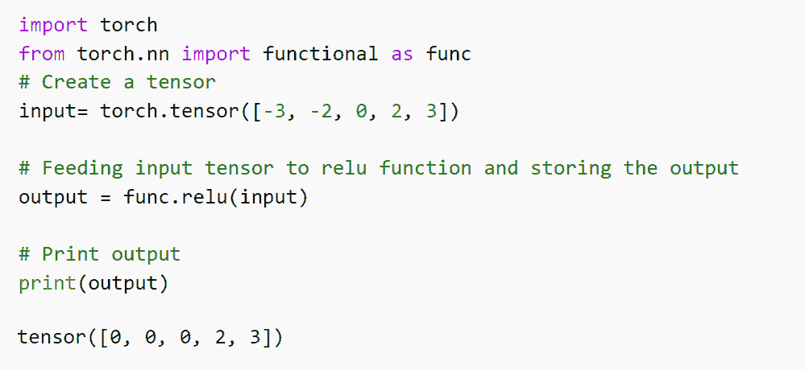
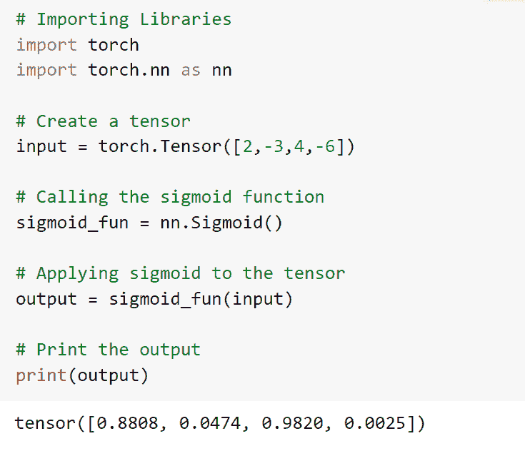
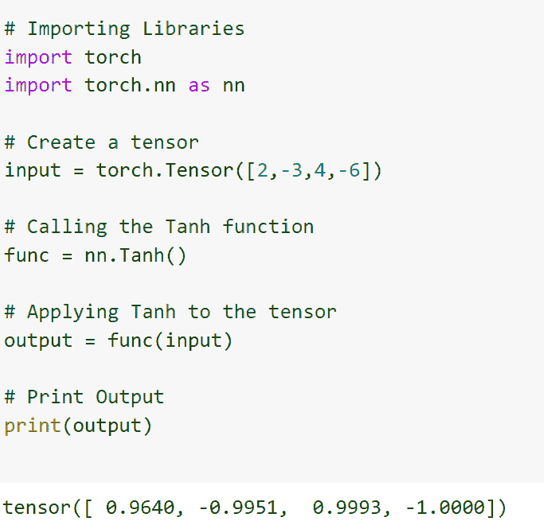
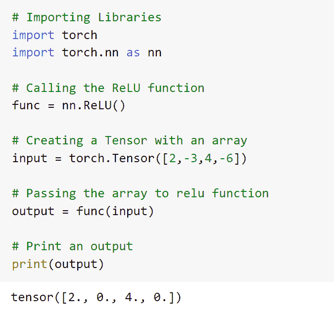
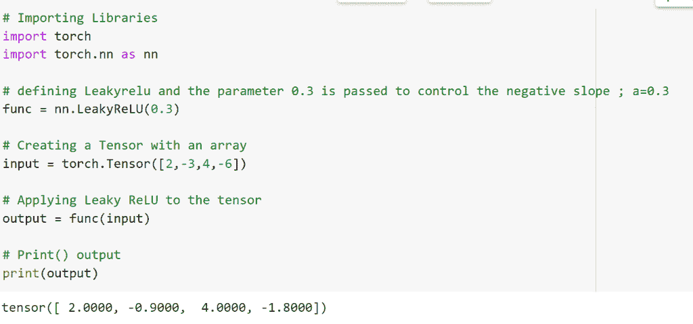
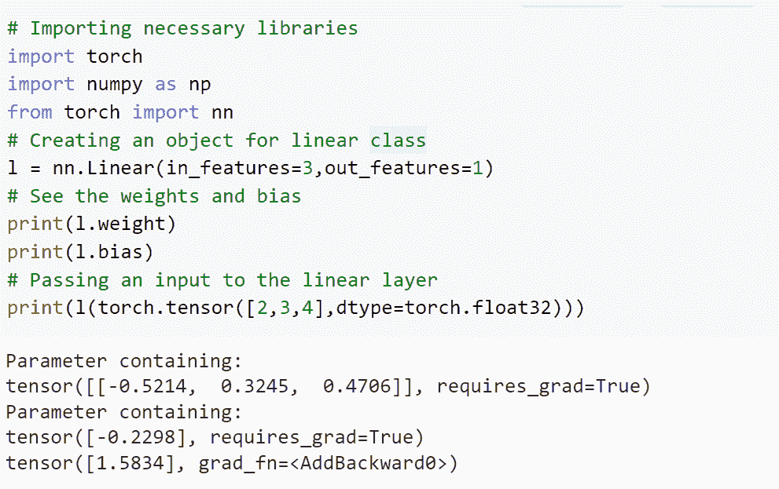
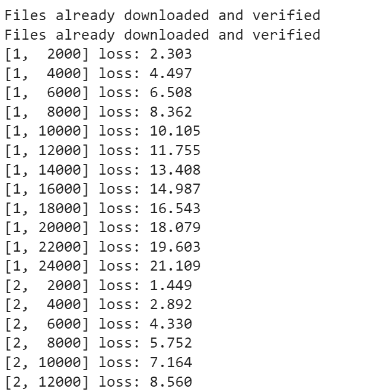
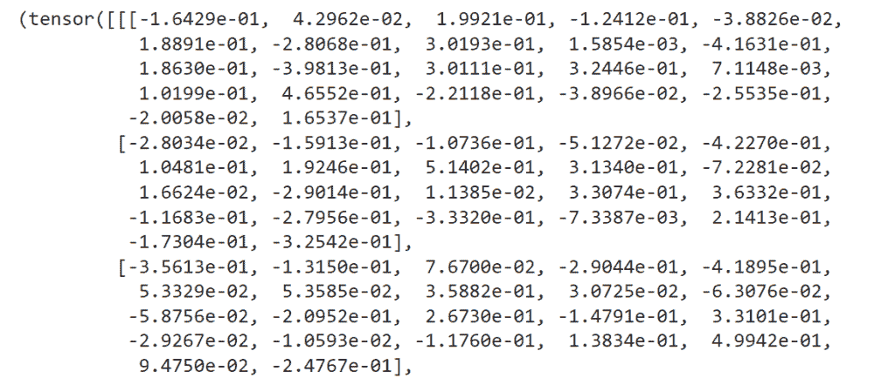
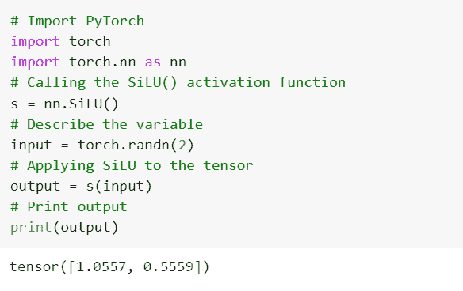
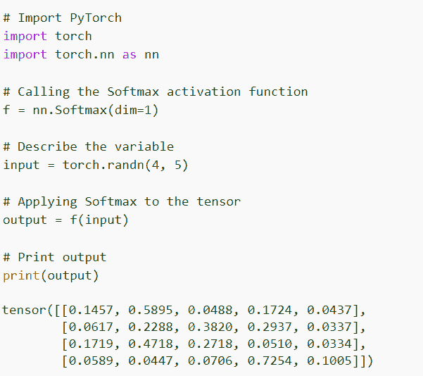

# PyTorch 激活函数[有 11 个例子]

> 原文：<https://pythonguides.com/pytorch-activation-function/>

[](https://sharepointsky.teachable.com/p/python-and-machine-learning-training-course)

在本 [Python 教程](https://pythonguides.com/learn-python/)中，我们将学习 **PyTorch 激活函数**。激活函数是执行计算以给出输出的函数，该输出充当下一个神经元的输入。此外，我们还将介绍与 PyTorch 激活功能相关的不同示例。并涵盖这些主题。

*   PyTorch 激活功能
*   PyTorch 乙状结肠激活函数
*   PyTorch 原位激活功能
*   PyTorch tanh 激活函数
*   PyTorch ReLU 激活功能
*   PyTorch 泄漏 ReLu 激活功能
*   PyTorch 线性激活函数
*   PyTorch 分类激活功能
*   PyTorch lstm 激活功能
*   PyTorch swish 激活功能
*   PyTorch softmax 激活功能

目录

[](#)

*   [PyTorch 激活功能](#PyTorch_activation_function "PyTorch activation function")
*   [PyTorch 乙状结肠激活功能](#PyTorch_sigmoid_activation_function "PyTorch sigmoid activation function ")
*   [PyTorch 原位激活功能](#PyTorch_inplace_activation_function "PyTorch inplace activation function ")
*   [PyTorch tanh 激活功能](#PyTorch_tanh_activation_function "PyTorch tanh activation function")
*   [PyTorch ReLU 激活功能](#PyTorch_ReLU_activation_function "PyTorch ReLU activation function")
*   [PyTorch 泄漏 ReLU 激活功能](#PyTorch_leaky_ReLU_activation_function "PyTorch leaky ReLU activation function ")
*   [PyTorch 线性激活功能](#PyTorch_linear_activation_function "PyTorch linear activation function")
*   [PyTorch 分类激活功能](#PyTorch_classification_activation_function "PyTorch classification activation function")
*   [PyTorch lstm 激活功能](#PyTorch_lstm_activation_function "PyTorch lstm activation function")
*   [PyTorch swish 激活功能](#PyTorch_swish_activation_function "PyTorch swish activation function")
*   [PyTorch softmax 激活功能](#PyTorch_softmax_activation_function "PyTorch softmax activation function")

## PyTorch 激活功能

在本节中，我们将学习 python 中的 PyTorch 激活函数。

激活函数是神经网络的构建模块。它应用非线性变换并确定神经元是否应该被激活。

它应该应用于输入的加权和的输出。激活函数的主要部分是在神经网络的决策边界中建立非线性。

**代码:**

在下面的代码中，首先我们将导入 torch 模块，然后我们将从 ***torch.nn*** 导入 functional 作为 ***func*** 。

*   **input= torch.tensor([-3，-2，0，2，3]) :** 我们使用 torch.tensor()函数声明输入变量。
*   **output = func.relu(input)** 用于将输入张量馈入 relu 激活函数并存储输出。
*   **打印(输出):**print()函数用于打印输出值。

```py
# Importing Library
import torch
from torch.nn import functional as func
# Create a tensor
input= torch.tensor([-3, -2, 0, 2, 3])

# Feeding input tensor to relu function and storing the output
output = func.relu(input)

# Print output
print(output)
```

**输出:**

在下面的输出中，您可以看到 PyTorch 激活函数的输出打印在屏幕上。



PyTorch activation function

至此，我们了解了如何在 python 中使用 PyTorch 激活函数。]

另外，检查: [PyTorch 全连接层](https://pythonguides.com/pytorch-fully-connected-layer/)

## PyTorch 乙状结肠激活功能

在本节中，我们将学习 python 中的 **PyTorch sigmoid 激活函数**。

Sigmoid 是非线性激活函数。它不会穿过原点，因为它是一条 S 形曲线，输出介于 0 和 1 之间。

输出值用作概率，经常用于二元分类。

**代码:**

在下面的代码中，首先我们将导入 torch 模块，然后我们将从 torch.nn 导入 functional as func。

*   **输入=火炬。张量([2，-3，4，-6]):** 我们通过使用 torch.tensor()函数来声明输入变量。
*   **sigmoid_fun = nn。Sigmoid():** 我们调用 Sigmoid 激活函数。
*   **output = sigmoid _ fun(input):**这里我们将 sigmoid 应用于张量。
*   **打印(输出):**print()函数用于打印输出值。

```py
# Importing Libraries
import torch
import torch.nn as nn

# Create a tensor
input = torch.Tensor([2,-3,4,-6])

# Calling the sigmoid function
sigmoid_fun = nn.Sigmoid()

# Applying sigmoid to the tensor
output = sigmoid_fun(input)

# Print the output
print(output) 
```

**输出:**

在下面的输出中，您可以看到 PyTorch sigmoid 激活函数值的输出打印在屏幕上。



PyTorch sigmoid activation function

这就是我们如何使用 Pytorch sigmoid 激活函数来构建神经网络。

阅读: [PyTorch 车型总结——详细教程](https://pythonguides.com/pytorch-model-summary/)

## PyTorch 原位激活功能

在本节中，我们将学习 python 中的 **PyTorch 就地激活函数**。

激活函数被定义为执行计算以给出作为下一个神经元的输入的输出的函数。

激活函数通过使用线性概念并减小误差和调整权重来保持非线性关系，因为它应该是可微分的。

**语法:**

PyTorch 就地激活函数的语法:

这里 ReLU 是激活函数，在这个函数中，我们使用的是原位参数。

```py
nn.ReLU(inplace=True)
```

**参数:**

**inplace = True** 这意味着它将直接改变输入，而不分配任何额外的输出，inplace 的默认值为 False。

这就是 inplace 参数在激活函数中的工作方式。

阅读: [PyTorch 逻辑回归](https://pythonguides.com/pytorch-logistic-regression/)

## PyTorch tanh 激活功能

在本节中，我们将学习 python 中的 **PyTorch tanh 激活函数**。

双曲正切函数类似于 sigmoid 函数。它也是一条 S 形曲线，但它穿过原点，Tanh 的输出值范围是从-1 到+1。双曲正切也是一个非线性和可微的函数。

**代码:**

在下面的代码中，首先我们将导入 torch 模块，然后我们将从 torch.nn 导入 functional as func。

*   **输入=火炬。张量([2，-3，4，-6]):** 我们通过使用 torch.tensor()函数来声明输入变量。
*   **func = nn。Tanh()** 这里我们调用的是 Tanh 函数。
*   **output = func(input):** 对张量应用双曲正切。
*   **打印(输出):**print()函数用于打印输出值。

```py
# Importing Libraries
import torch
import torch.nn as nn

# Create a tensor
input = torch.Tensor([2,-3,4,-6])

# Calling the Tanh function
func = nn.Tanh()

# Applying Tanh to the tensor
output = func(input)

# Print Output
print(output)
```

**输出:**

在下面的输出中，您可以看到屏幕上打印了 **PyTorch Tanh 激活函数**的值。



PyTorch activation function Tanh

由此，我们了解了 PyTorch Tanh 激活功能。

阅读: [PyTorch 提前停止+示例](https://pythonguides.com/pytorch-early-stopping/)

## PyTorch ReLU 激活功能

在本节中，我们将学习 Python 中的 **PyTorch ReLU 激活函数**。

ReLu 代表校正线性激活函数。这是一个流行的非线性激活函数。

它也是一个非线性和可微的函数。在 ReLU 中，如果输入是负的，那么它的导数变为零，神经元的学习速率停止。

**代码:**

在下面的代码中，首先我们将导入 torch 模块，然后我们将从 torch.nn 导入 functional as func。

*   **func = nn。ReLU():** 这里我们调用的是 Tanh 函数。
*   **输入=火炬。张量([2，-3，4，-6]):** 我们通过使用 torch.tensor()函数来声明输入变量。
*   **output = func(input):** 对张量应用双曲正切。
*   **打印(输出):**print()函数用于打印输出值。

```py
# Importing Libraries
import torch
import torch.nn as nn

# Calling the ReLU function
func = nn.ReLU()

# Creating a Tensor with an array
input = torch.Tensor([2,-3,4,-6])

# Passing the array to relu function
output = func(input)

# Print an output
print(output)
```

**输出:**

在下面的输出中，您可以看到 PyTorch ReLu 激活函数值被打印在屏幕上。



PyTorch activation function ReLU

至此，我们了解了如何使用 PyTorch ReLU 激活函数。

阅读:[py torch ms loss](https://pythonguides.com/pytorch-mseloss/)

## PyTorch 泄漏 ReLU 激活功能

在本节中，我们将学习 Python 中的 **PyTorch leaky ReLU 激活函数**。

泄漏 ReLU 功能是另一种类型的激活功能。它类似于 ReLU 激活功能。这个功能非常有用。

如果输入值是负的，那么函数的微分不为零，并且神经元的学习速率不停止。

**代码:**

在下面的代码中，首先我们将导入 torch 模块，然后我们将从 torch.nn 导入 functional as func。

*   **func = nn。LeakyReLU(0.3):** 我们正在定义 LeakyReLU，传递参数 0.3 来控制负斜率。
*   **输入=火炬。张量([2，-3，4，-6]):** 这里用数组创建一个张量。
*   **output = func(input):** 对张量应用 Leaky ReLU。
*   **打印(输出):**print()函数用于打印输出。

```py
# Importing Libraries
import torch
import torch.nn as nn

# defining Leakyrelu and the parameter 0.3 is passed to control the negative slope ; a=0.3
func = nn.LeakyReLU(0.3)

# Creating a Tensor with an array
input = torch.Tensor([2,-3,4,-6])

# Applying Leaky ReLU to the tensor
output = func(input)

# Print() output 
print(output)
```

**输出:**

在下面的输出中，你可以看到 **PyTorch 泄漏 ReLu 激活功能**的值被打印在屏幕上。



PyTorch Activation Function Leaky ReLU

这就是我们如何使用 PyTorch 泄漏 ReLU 激活函数来构建神经网络。

阅读: [PyTorch 批量标准化](https://pythonguides.com/pytorch-batch-normalization/)

## PyTorch 线性激活功能

在本节中，我们将学习 Python 中的 **PyTorch 线性激活函数**。

神经网络线性激活函数被定义为获取输入和输出参数并生成矩阵的过程。

众所周知，激活功能是 PyTorch 的基础。它应用非线性变换并确定神经元是否应该被激活。

**代码:**

在下面的代码中，首先我们将导入 torch 模块，然后将 numpy 作为 np 导入，还将从 torch 导入 nn。

*   **l = nn。Linear(in_features=3，out_features=1)** 用于为线性类创建一个对象。
*   **print(l.weight)** 用于打印重量。
*   **print(l.bias)** 用于打印偏差。
*   **print(l(torch.tensor([2，3，4)，dtype = torch . float 32)):**这里我们给线性层传递一个输入。

```py
# Importing necessary libraries
import torch
import numpy as np
from torch import nn
# Creating an object for linear class
l = nn.Linear(in_features=3,out_features=1)
# See the weights and bias
print(l.weight)
print(l.bias)
# Passing an input to the linear layer
print(l(torch.tensor([2,3,4],dtype=torch.float32)))
```

**输出:**

在下面的输出中，您可以看到线性激活函数值被打印在屏幕上。



PyTorch activation function linear

这样，我们理解了 PyTorch 线性激活函数。

阅读: [PyTorch 负载模型+示例](https://pythonguides.com/pytorch-load-model/)

## PyTorch 分类激活功能

在本节中，我们将学习 python 中的 **PyTorch 分类激活函数**。

激活函数被应用于输入的加权和的输出。激活函数的主要部分是在神经网络的决策边界中启动非线性。

**代码:**

在下面的代码中，首先我们将导入所有必要的库，如 import torch、import torchvision 和 import torchvision。变换，导入 torch.nn，导入 torch.nn.functional

*   **变换=变换。撰写([转换。ToTensor()，转换。Normalize((0.7，0.7，0.7)，(0.7，0.7，0.7))])** 用于定义变换。
*   **阶级分类(nn。Module):** 我们正在 init()和 forward()方法的帮助下定义一个模型类。
*   **判据= nn。CrossEntropyLoss():** 这里我们定义一个损失函数。
*   **优化器= optim。SGD(net.parameters()，lr=0.001，momentum=0.9):** 用于初始化优化器。
*   **输入，标签=数据**用于获取输入。
*   **optimizer.zero_grad()** 用于将参数梯度归零。
*   **print(f'[{epoch + 1}，{ x+1:5d }]loss:{ run loss/2000:. 3f } ')**用于打印历元。

```py
# Importing libraries
import torch
import torchvision
import torchvision.transforms as transforms
import torch.nn as nn
import torch.nn.functional as Function
# Define a transform
transform = transforms.Compose(
    [transforms.ToTensor(),
     transforms.Normalize((0.7, 0.7, 0.7), (0.7, 0.7, 0.7))])

batch_size = 2
# Load training dataset
trainingset = torchvision.datasets.CIFAR10(root='./data', train=True,
                                        download=True, transform=transform)
trainingloader = torch.utils.data.DataLoader(trainingset, batch_size=batch_size,
                                          shuffle=True, num_workers=2)

test_set = torchvision.datasets.CIFAR10(root='./data', train=False,
                                       download=True, transform=transform)
test_loader = torch.utils.data.DataLoader(test_set, batch_size=batch_size,
                                         shuffle=False, num_workers=2)

class classification(nn.Module):
    def __init__(self):
        super().__init__()
        self.conv1 = nn.Conv2d(3, 6, 5)
        self.pool = nn.MaxPool2d(2, 2)
        self.conv2 = nn.Conv2d(6, 16, 5)
        self.fc1 = nn.Linear(16 * 5 * 5, 120)
        self.fc2 = nn.Linear(120, 84)
        self.fc3 = nn.Linear(84, 10)

    def forward(self, y):
        y = self.pool(Function.relu(self.conv1(y)))
        y = self.pool(Function.relu(self.conv2(y)))
        # flatten all dimensions except batch
        y = torch.flatten(y, 1) 
        y = Function.relu(self.fc1(y))
        y = Function.relu(self.fc2(y))
        y = self.fc3(y)
        return y

net = classification()

import torch.optim as optim
# Define Loss function
criterion = nn.CrossEntropyLoss()
# Initialize optimizer
optimizer = optim.SGD(net.parameters(), lr=0.001, momentum=0.9)

# loop over the dataset multiple times
for epoch in range(3):  

    runloss = 0.0
    for x, data in enumerate(trainingloader, 0):
        # get the inputs; data is a list of [inputs, labels]
        inputs, labels = data

        # zero the parameter gradients
        optimizer.zero_grad()

        # forward + backward + optimize
        outputs = net(inputs)
        loss = criterion(outputs, labels)
        loss.backward()
        optimizer.step()

        # print statistics
        runloss += loss.item()
        # print every 2000 mini-batches
        if x % 2000 == 1999:    
            print(f'[{epoch + 1}, {x + 1:5d}] loss: {runloss / 2000:.3f}')
            running_loss = 0.0

print('complete training')
```

**输出:**

在下面的输出中，您可以看到 PyTorch 分类激活功能损失值打印在屏幕上。



PyTorch activation function classification

这就是 PyTorch 分类激活功能的工作方式。

阅读:[交叉熵损失 PyTorch](https://pythonguides.com/cross-entropy-loss-pytorch/)

## PyTorch lstm 激活功能

在本节中，我们将学习 python 中的 **PyTorch lstm 激活函数**。

lstm 代表长短期记忆，它使用激活功能来激活细胞。

激活函数主要用于 PyTorch 的构建模块，它执行计算以提供输出，该输出可以作为下一个神经元的输入。

**代码:**

在下面的代码中，首先我们将导入 torch 模块，然后我们将从 torch.nn 导入 functional as func。

*   **nn = nn。LSTM(12，22，4)** 调用 LSTM 激活函数。
*   **input = torch.randn(7，5，12)** 我们在用 torch.random()函数描述变量。
*   **output= nn(input，(h0，c0))** 用于对张量应用 LSTM。
*   **print(output)**print()函数用于打印输出值。

```py
# Import Library
import torch
import torch.nn as nn
# Calling the LSTM activation function
nn = nn.LSTM(12, 22, 4)
# Describe the variable by using torch.random()
input = torch.randn(7, 5, 12)
h0 = torch.randn(4, 5, 22)
c0 = torch.randn(4, 5, 22)
# Applying LSTM to the tensor
output= nn(input, (h0, c0))
# Print the output values
print(output)
```

**输出:**

在这个输出中，您可以看到 PyTorch lstm 激活函数值打印在屏幕上。



PyTorch activation function lstm

至此，我们了解了 python 中的 PyTorch lstm 激活函数。

阅读: [PyTorch 保存模型–完整指南](https://pythonguides.com/pytorch-save-model/)

## PyTorch swish 激活功能

在本节中，我们将学习 python 中的 **PyTorch swish 激活函数**。

swish 是一个激活函数，是一个可承受的参数。如我们所知，激活函数应用于输入的加权和的输出，并且它是神经网络的构建块。

swish 函数也称为路斯函数。路斯代表 Sigmoid 线性单位。

**代码:**

在下面的代码中，首先我们将导入 torch 模块，然后我们将从 torch.nn 导入 functional as func。

*   s = nn。路斯()用于调用路斯激活函数。
*   **input = torch.randn(2)** 用于通过使用 torch.random()函数来描述输入变量。
*   **输出= s(输入)**用于将路斯应用于张量。
*   **print(output)**print()函数用于打印输出值。

```py
# Import PyTorch
import torch 
import torch.nn as nn
# Calling the SiLU() activation function
s = nn.SiLU()
# Describe the variable 
input = torch.randn(2)
# Applying SiLU to the tensor
output = s(input)
# Print output
print(output)
```

**输出:**

在下面的输出中，您可以看到 PyTorch swish 激活功能的输出值打印在屏幕上。



PyTorch activation function swish

至此，我们了解了 python 中的 PyTorch swish 激活函数。

阅读:[亚当优化器 PyTorch](https://pythonguides.com/adam-optimizer-pytorch/)

## PyTorch softmax 激活功能

本节我们将学习 python 中的 **[PyTorch](https://pythonguides.com/what-is-pytorch/) softmax 激活函数**。

PyTorch softmax 激活函数被应用于 n 维输入张量并对它们进行重新缩放，使得 n 维张量的输出张量位于范围[0，1]内。

**代码:**

在下面的代码中，首先我们将导入 torch 模块，然后我们将从 torch.nn 导入 functional as func。

*   **f = nn。Softmax(dim=1)** 用于调用 Softmax 激活功能。
*   **input = torch.randn(4，5)** 用于通过使用 torch.random()函数来描述输入张量。
*   **output = f(input)** 用于将 softmax 应用于张量。
*   **print(output)**print()函数用于打印输出值。

```py
# Import PyTorch
import torch 
import torch.nn as nn

# Calling the Softmax activation function
f = nn.Softmax(dim=1)

# Describe the variable 
input = torch.randn(4, 5)

# Applying Softmax to the tensor
output = f(input)

# Print output
print(output)
```

**输出:**

在此输出中，您可以看到 PyTorch softmax 激活函数值打印在屏幕上。



PyTorch activation function softmax

这就是 PyTorch softmax 激活功能的工作方式。

另外，看看更多的 Python PyTorch 教程。

*   [PyTorch nn 线性](https://pythonguides.com/pytorch-nn-linear/)
*   [Keras Vs PyTorch](https://pythonguides.com/keras-vs-pytorch/)
*   [指针为 Numpy](https://pythonguides.com/pytorch-tensor-to-numpy/)

因此，在本教程中，我们讨论了 **PyTorch 激活函数**,我们还涵盖了与其实现相关的不同示例。这是我们已经讨论过的例子列表。

*   PyTorch 激活功能
*   PyTorch 乙状结肠激活函数
*   PyTorch 原位激活功能
*   PyTorch tanh 激活函数
*   PyTorch ReLU 激活功能
*   PyTorch 泄漏 ReLu 激活功能
*   PyTorch 线性激活函数
*   PYTorch 分类激活功能
*   PyTorch lstm 激活功能
*   PyTorch swish 激活功能
*   PyTorch softmax 激活功能

[Bijay Kumar](https://pythonguides.com/author/fewlines4biju/)

Python 是美国最流行的语言之一。我从事 Python 工作已经有很长时间了，我在与 Tkinter、Pandas、NumPy、Turtle、Django、Matplotlib、Tensorflow、Scipy、Scikit-Learn 等各种库合作方面拥有专业知识。我有与美国、加拿大、英国、澳大利亚、新西兰等国家的各种客户合作的经验。查看我的个人资料。

[enjoysharepoint.com/](https://enjoysharepoint.com/)[](https://www.facebook.com/fewlines4biju "Facebook")[](https://www.linkedin.com/in/fewlines4biju/ "Linkedin")[](https://twitter.com/fewlines4biju "Twitter")