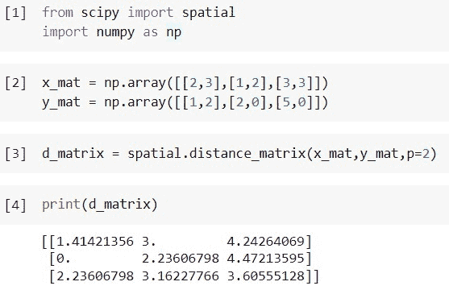
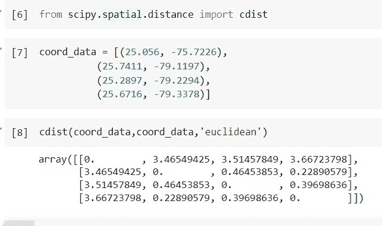
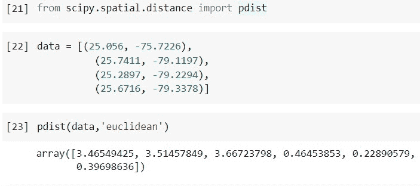
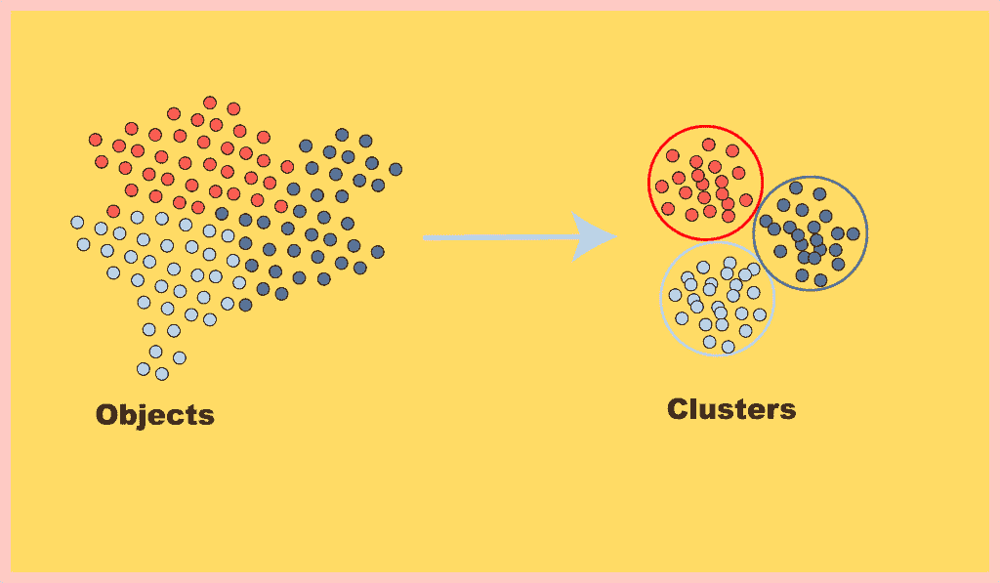
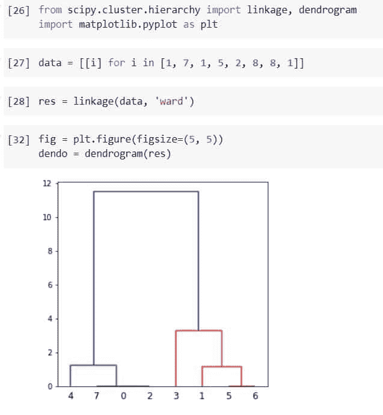
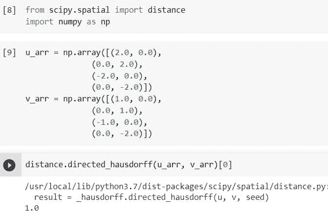
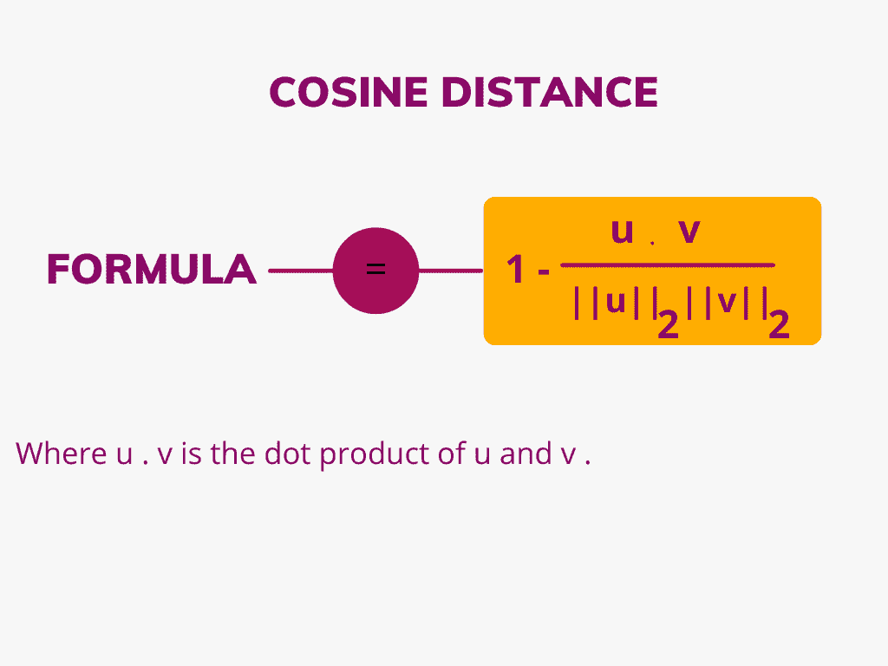
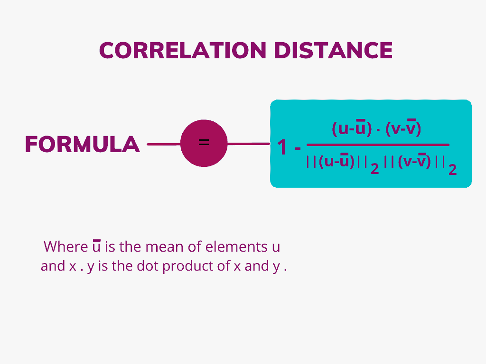

# Python 科学距离矩阵

> 原文：<https://pythonguides.com/scipy-distance-matrix/>

[](https://sharepointsky.teachable.com/p/python-and-machine-learning-training-course)

在本 [Python 教程](https://pythonguides.com/learn-python/)中，我们将学习“ **Python Scipy 距离矩阵**”，其中我们将使用不同的距离方法(如欧几里德、曼哈顿等)计算矩阵或数组之间的距离，并涵盖以下主题。

*   Python 科学距离矩阵
*   Python 科学距离矩阵 Cdist
*   Python Scipy 距离矩阵 Pdist
*   Python 科学距离矩阵欧几里得
*   Python Scipy 距离矩阵城市街区
*   Python Scipy 距离矩阵聚类
*   Python Scipy 距离矩阵定向 Hausdorff
*   Python Scipy 距离矩阵余弦
*   Python 科学距离相关矩阵

另外，查看 Python SciPy 的最新教程: [Python Scipy Stats Kurtosis](https://pythonguides.com/python-scipy-stats-kurtosis/)

目录

[](#)

*   [Python Scipy 距离矩阵](#Python_Scipy_Distance_Matrix "Python Scipy Distance Matrix")
*   [Python Scipy 距离矩阵 Cdist](#Python_Scipy_Distance_Matrix_Cdist "Python Scipy Distance Matrix Cdist")
*   [Python 科学距离矩阵 Pdist](#Python_Scipy_Distance_Matrix_Pdist "Python Scipy Distance Matrix Pdist")
*   [Python Scipy 距离矩阵欧几里德](#Python_Scipy_Distance_Matrix_Euclidean "Python Scipy Distance Matrix Euclidean")
*   [Python Scipy 距离矩阵 Cityblock](#Python_Scipy_Distance_Matrix_Cityblock "Python Scipy Distance Matrix Cityblock")
*   [Python Scipy 距离矩阵聚类](#Python_Scipy_Distance_Matrix_Clustering "Python Scipy Distance Matrix Clustering")
*   [Python Scipy 距离矩阵定向 Hausdorff](#Python_Scipy_Distance_Matrix_Directed_Hausdorff "Python Scipy Distance Matrix Directed Hausdorff")
*   [Python Scipy 距离矩阵余弦](#Python_Scipy_Distance_Matrix_Cosine "Python Scipy Distance Matrix Cosine")
*   [Python Scipy 距离相关矩阵](#Python_Scipy_Distance_Correlation_Matrix "Python Scipy Distance Correlation Matrix")

## Python Scipy 距离矩阵

成对计算的矩阵向量之间的距离包含在距离矩阵中。我们可以使用由`***scipy.spatial***`模块提供的`***distance_matrix()***`方法来计算距离矩阵。在大多数情况下，矩阵具有二维数组的形状，矩阵行充当矩阵的向量(一维数组)。

下面给出了语法。

```
scipy.spatial.distance_matrix(x, y, threshold=1000000, p=2)
```

其中参数为:

*   **x(array_data(m，k):** 有 M 个向量的 K 维矩阵。
*   **y(array_data(n，k)):** N 乘向量的 K 维矩阵。
*   **threshold(positive int):** 如果 M * N * K 大于阈值，则该算法使用 Python 循环而不是大型临时数组。
*   **p(float):** 应该应用哪个闵可夫斯基 p 范数。

方法`***distance_matrix()***`返回一个矩阵，该矩阵测量 x 中的每个向量和 y 中的每个 ndarray 类型的向量之间的间距。

让我们以下面的步骤为例:

使用下面的 python 代码导入所需的库。

```
from scipy import spatial
import numpy as np
```

使用下面的代码创建矩阵。

```
x_mat = np.array([[2,3],[1,2],[3,3]])
y_mat = np.array([[1,2],[2,0],[5,0]])
```

使用下面的代码计算距离矩阵。

```
d_matrix = spatial.distance_matrix(x_mat,y_mat,p=2)
```

使用下面的代码查看距离矩阵。

```
print(d_matrix)
```



Python Scipy Distance Matrix

这就是如何使用模块 Python `***scipy.spatial***`的方法`***distance_matrix()***`计算距离矩阵。

也可阅读: [Python Scipy 指数](https://pythonguides.com/python-scipy-exponential/)

## Python Scipy 距离矩阵 Cdist

Python Scipy 在模块`***scipy.spatial.distance***`中包含了一个方法`***cdist()***`，该方法计算两个输入集合之间的距离。

下面给出了语法。

```
scipy.spatial.distance.cdist(XA, XB, metric='cosine')
```

其中参数为:

*   **XA(array _ data):**n 维中的原始 m [B] 观察值的数组，每个测量 m [B] 乘 n
*   **XB(array _ data):**n 维中的原始 m [B] 观察值的数组，每个测量 m [B] 乘 n
*   **metric(callabel，str):** 要应用的距离单位。距离函数可以是"堪培拉"、"布雷柯蒂斯"、"切比雪夫"、"相关"、"城市街区"、"余弦"、"欧几里得"、"骰子"、"汉明"、"库尔辛斯基"、"简森山农"、"库尔辛斯基"、"匹配"、"马哈拉诺比斯"、"明科夫斯基"、"罗素劳"、"罗格斯坦本"、"修克列迪安"。

方法 ***`cdist()`*** 返回的结果是大小为 m [A] 乘 m [B] 的距离矩阵。

让我们以下面的步骤为例:

使用下面的 python 代码导入所需的库。

```
from scipy.spatial.distance import cdist
```

使用下面的代码创建数据。

```
coord_data = [(25.056, -75.7226),
          (25.7411, -79.1197),
          (25.2897, -79.2294),
          (25.6716, -79.3378)]
```

在四个二维坐标之间，计算它们的欧几里得距离。

```
cdist(coord_data,coord_data,'euclidean')
```



Python Scipy Distance Matrix Cdist

这就是如何使用 Python Scipy 的方法`***cdist()***`来计算两个输入集合的每一对之间的距离。

阅读: [Python Scipy 卡方测试](https://pythonguides.com/python-scipy-chi-square-test/)

## Python 科学距离矩阵 Pdist

Python Scipy 在模块`***scipy.spatial.distance***`中包含一个方法`***pdist()***`,用于计算 n 维空间中观测值之间的成对距离。

下面给出了语法。

```
scipy.spatial.distance.pdist(X, metric='minkowski)
```

其中参数为:

*   **X(array _ data):**n 维中 m 个唯一观测值的数组，m 乘 n 排列。
*   **metric(callabel，str):** 要应用的距离单位。距离函数可以是"堪培拉"、"布雷柯蒂斯"、"切比雪夫"、"相关"、"城市街区"、"余弦"、"欧几里得"、"骰子"、"汉明"、"库尔辛斯基"、"简森山农"、"库尔辛斯基"、"匹配"、"马哈拉诺比斯"、"明科夫斯基"、"罗素劳"、"罗格斯坦本"、"修克列迪安"。

方法`pdist()`返回 ndarray 类型的 ***`Y`(这是压缩的距离矩阵 Y)*** 。

让我们按照以下步骤，通过插图来理解:

使用下面的 python 代码导入所需的库。

```
from scipy.spatial.distance import pdist
```

使用下面的代码创建数据。

```
data = [(25.056, -75.7226),
          (25.7411, -79.1197),
          (25.2897, -79.2294),
          (25.6716, -79.3378)]
```

使用欧几里德距离(2-范数)作为点之间的距离度量来计算 m 点之间的距离。在矩阵数据中，点被排列成 m 个 n 维行向量。

```
pdist(data,'euclidean')
```



该指南使用 Python Scipy 的`***pdist()***`计算 n 维空间中观测值之间的成对距离

阅读: [Scipy 寻找峰值–有用教程](https://pythonguides.com/scipy-find-peaks/)

## Python Scipy 距离矩阵欧几里德

Python Scipy 在模块`***scipy.spatial.distance***`中包含了一个方法`***euclidean()***`，用于计算两个一维数组之间的欧几里德距离。

下面给出了语法。

```
scipy.spatial.distance.euclidean(u, v, w=None)
```

其中参数为:

*   **u(array_data):** 输入矩阵或数组。
*   **v(array_data):** 输入矩阵或数组。
*   **w(array_data):** 每个值在 u 和 v 中的权重，当默认选择无时，每个值的权重为 1。

方法`***euclidean()***`返回 double 类型的 ***`euclidean`(这是两个向量 u 和 v 的欧几里德距离)*** 。

让我们按照下面的步骤做一些例子:

导入方法`***euclidean()***`并使用下面的 python 代码计算距离。

```
from scipy.spatial.distance import euclidean
euclidean([2, 1, 0], [1, 1, 2])
```


Python Scipy Distance Matrix Euclidean

看上面的输出，给定数组的欧氏距离是 2.236。

这就是如何使用 Python Scipy 的方法`***euclidean()***`计算欧几里德距离。

阅读: [Python Scipy 特辑](https://pythonguides.com/python-scipy-special/)

## Python Scipy 距离矩阵 Cityblock

Python Scipy 模块`***scipy.spatial.distance***`包含一个计算曼哈顿距离(也称为城市街区距离)的方法`***cityblock()***`。

下面给出了语法。

```
scipy.spatial.distance.cityblock(u, v, w=None)
```

其中参数为:

*   **u(array_data):** 输入矩阵或数组。
*   **v(array_data):** 输入矩阵或数组。
*   **w(array_data):** 每个值在 u 和 v 中的权重，默认选择无时，每个值的权重为 1。

方法`***cityblokc()***`返回 double 类型的 ***(这是两个向量 u 和 v 的曼哈顿(cityblock)距离)*** 。

让我们按照下面的步骤做一些例子:

导入方法`***cityblok()***`并使用下面的 python 代码计算曼哈顿的距离。

```
from scipy.spatial.distance import cityblock
cityblock([1, 0, 2], [2, 1, 2])
```


Python Scipy Distance Matrix Cityblock

看看上面的输出，给定数组的 cityblock(曼哈顿)距离是 2。

这就是如何使用 Python Scipy 的方法`***cityblock()***`计算城市街区距离。

阅读: [Python Scipy Matrix +示例](https://pythonguides.com/python-scipy-matrix/)

## Python Scipy 距离矩阵聚类

Python Scipy 模块`***scipy.spatial.hierarchy***`包含一个方法`***linkage()***`,该方法使用分层或凝聚方法对数据进行聚类。但是 ***“什么是层次聚类？”***

*   一种称为分层聚类的算法，通常被称为分层聚类分析，根据对象的相似程度将对象划分为多个聚类。结果是一个集群的集合，每个集群都不同于其他集群，但都有大体相似的东西。



Python Scipy Distance Matrix Clustering

下面给出了语法。

```
scipy.cluster.hierarchy.linkage(y, method='complete', optimal_ordering=False, metric='euclidean')
```

其中参数为:

*   **y(ndarray):** 一个压缩的距离矩阵。距离矩阵的上部三角形包含在称为压缩距离矩阵的平面阵列中。Pdist 返回这个表单作为结果。一个 m 乘 n 的数组也可以用来传递一组 n 维的 m 个观察向量。在压缩距离矩阵中不能有任何 nan 或 INF，所有元素必须是有限的。
*   **方法(str，function):** 要使用的适当的联动算法。
*   **optimal _ ordering(boolean):**如果为真，连接矩阵将被重新排列，以使后续叶之间的距离尽可能短。当数据被可视化时，这导致了更容易理解的树结构。默认为 False，因为该算法可能会降低性能，尤其是对于大型数据集。
*   **度量(str):** 如果 y 是观测向量的集合，那么使用这个距离度量；否则，忽略它。有关可接受的距离测量列表，请参考 pdist 功能。此外，还提供自定义距离功能。

方法 ***`linkage()`*** 返回 ndarray 类型的 ***`z`(链接矩阵用于对层次分组进行编码)*** 。

使用下面的 python 代码导入所需的库。

```
from scipy.cluster.hierarchy import linkage, dendrogram
import matplotlib.pyplot as plt
```

使用下面的代码创建我们想要执行聚类的数据。

```
data = [[i] for i in [1, 7, 1, 5, 2, 8, 8, 1]]
```

将上面创建的数据传递给带有 ward 的方法`***linkage()***`,使用下面的代码计算聚类。

```
res = linkage(data, 'ward')
```

使用下面的代码绘制上述结果的树状图。

```
fig = plt.figure(figsize=(5, 5))
dendo = dendrogram(res)
```

在上面的代码中，我们已经将方法`***linkage(data,'ward')***`的结果传递给方法`***dendrogram(res)***`来显示获得聚类的树状图。



Python Scipy Distance Matrix Clustering

这就是如何使用 Python Scipy 的方法`***linkage()***`计算距离矩阵聚类。

阅读:[Scipy Stats Zscore+Examples](https://pythonguides.com/scipy-stats-zscore/)

## Python Scipy 距离矩阵定向 Hausdorff

Python Scipy 模块`***scipy.spatial.distance***`包含一个方法`***directed_hausdorff()***`,用于查找两个二维数组之间的有向 hausdorff 距离。

下面给出了语法。

```
scipy.spatial.distance.directed_hausdorff(u, v, seed=2)
```

其中参数为:

*   **u(array_data，(M，N)):** 输入矩阵或数组。
*   **v(array_data，(ON)):** 输入矩阵或数组。
*   **seed(int):** 默认值 0 通过随机重新排列 u 和 v 的值来确保可重复性。

方法`***directed_hausdorff()***`分别返回 double、int 和 int 类型的 ***`d`(数组 u 和 v 的有向豪斯多夫距离)*** 、 ***`index_1`(构成豪斯多夫对的 u 中的点的索引)*** 和 ***`index_2`(构成豪斯多夫对的 v 中的点的索引)*** 。

让我们以下面的步骤为例:

使用下面的 python 代码导入所需的库。

```
from scipy.spatial import distance
import numpy as np
```

使用下面的代码创建两个二维数组。

```
u_arr = np.array([(2.0, 0.0),
              (0.0, 2.0),
              (-2.0, 0.0),
              (0.0, -2.0)])
v_arr = np.array([(1.0, 0.0),
              (0.0, 1.0),
              (-1.0, 0.0),
              (0.0, -2.0)])
```

使用下面的代码计算上面创建的数组的有向豪斯多夫距离。

```
distance.directed_hausdorff(u_arr, v_arr)[0]
```



Python Scipy Distance Matrix Directed Hausdorff

看看上面的输出，给定数组之间的有向 Hausdorff 距离是 1。

这就是如何使用 Python Scipy 的方法`***directed_hausdorff()***`计算有向 Hausdorff 距离。

阅读: [Scipy 卷积-完整指南](https://pythonguides.com/scipy-convolve/)

## Python Scipy 距离矩阵余弦

Python Scipy 模块`***scipy.spatial.distance***`包含一个方法`***cosine()***`,用于识别一维数组的余弦距离。

假设 u 和 v 的余弦距离为:



Python Scipy Distance Matrix Cosine

下面给出了语法。

```
scipy.spatial.distance.cosine(u, v, w=None)
```

其中参数为:

*   **u(array_data):** 输入矩阵或数组。
*   **v(array_data):** 输入矩阵或数组。
*   **w(array_data):** 每个值在 u 和 v 中的权重，当默认选择无时，每个值的权重为 1。

方法`***cosine()***`返回 double 类型的 ***`cosine`(这是 u 和 v 彼此之间的余弦距离)*** 。

让我们以下面的步骤为例:

导入方法`***cosine()***`并使用下面的 python 代码计算距离。

```
from scipy.spatial.distance import cosine
cosine([0, 1, 1], [1, 0, 1])
```


Python Scipy Distance Matrix Cosine

看上面的输出，给定数组的余弦距离是 0.5。

这就是如何使用 Python Scipy 的方法`***cosine()***`计算余弦距离。

阅读: [Scipy Integrate +示例](https://pythonguides.com/scipy-integrate/)

## Python Scipy 距离相关矩阵

Python Scipy 在模块`***scipy.spatial.distance***`中有一个方法`***correlation()***`,用于识别两个一维数组中间的相关距离。

假设 u 和 v 的相关距离为:



Python Scipy Distance Correlation Matrix

下面给出了语法。

```
scipy.spatial.distance.correlation(u, v, w, centered = False)
```

*   **u(array_data):** 输入矩阵或数组。
*   **v(array_data):** 输入矩阵或数组。
*   **w(array_data):** 每个值在 u 和 v 中的权重，当默认选择无时，每个值的权重为 1。
*   **居中(布尔):**如果准确，u 和 v 会在中间。默认情况下为 True。

方法`***correlation()***`返回 double 类型的`***correlation***`(这是一维数组 u 和 v 在相关性方面的分离)。

让我们以下面的步骤为例:

导入方法`***correlation()***`并使用下面的 python 代码计算距离。

```
from scipy.spatial.distance import correlation
correlation([0, 1, 1], [1, 0, 1])
```


Python Scipy Distance Correlation Matrix

看上面的输出，给定数组的相关距离是 1.5。

这就是如何使用 Python Scipy 的方法`***correlation()***`计算相关距离。

您可能也喜欢阅读下面的 Python Scipy 教程。

*   [Scipy Stats–完整指南](https://pythonguides.com/scipy-stats/)
*   [Scipy Sparse–有用的教程](https://pythonguides.com/scipy-sparse/)
*   [Scipy 优化–实用指南](https://pythonguides.com/scipy-optimize/)
*   [敏感信号——有用教程](https://pythonguides.com/scipy-signal/)

因此，在本教程中，我们已经了解了“Python Scipy 距离矩阵”并涵盖了以下主题。

*   Python 科学距离矩阵
*   Python 科学距离矩阵 Cdist
*   Python Scipy 距离矩阵 Pdist
*   Python 科学距离矩阵欧几里得
*   Python Scipy 距离矩阵城市街区
*   Python Scipy 距离矩阵聚类
*   Python Scipy 距离矩阵定向 Hausdorff
*   Python Scipy 距离矩阵余弦
*   Python 科学距离相关矩阵

[Bijay Kumar](https://pythonguides.com/author/fewlines4biju/)

Python 是美国最流行的语言之一。我从事 Python 工作已经有很长时间了，我在与 Tkinter、Pandas、NumPy、Turtle、Django、Matplotlib、Tensorflow、Scipy、Scikit-Learn 等各种库合作方面拥有专业知识。我有与美国、加拿大、英国、澳大利亚、新西兰等国家的各种客户合作的经验。查看我的个人资料。

[enjoysharepoint.com/](https://enjoysharepoint.com/)[](https://www.facebook.com/fewlines4biju "Facebook")[](https://www.linkedin.com/in/fewlines4biju/ "Linkedin")[](https://twitter.com/fewlines4biju "Twitter")