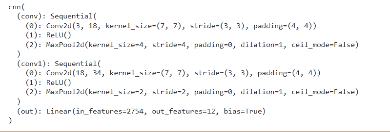
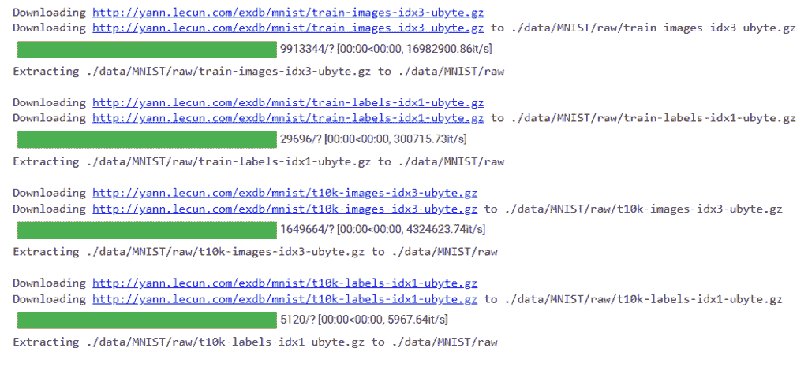

# PyTorch MNIST 教程

> 原文：<https://pythonguides.com/pytorch-mnist/>

[](https://sharepointsky.teachable.com/p/python-and-machine-learning-training-course)

在这个 [Python 教程](https://pythonguides.com/learn-python/)中，我们将学习 Python 中的 **PyTorch MNIST** ，我们还将涵盖与 **PyTorch Minist** 相关的不同示例。我们将讨论这些话题。

*   皮托奇·姆尼斯特
*   PyTorch mnist 示例
*   PyTorch mnist 分类
*   皮托奇赔偿 cnn
*   PyTorch mnist 数据集
*   PyTorch mnist 培训
*   皮托奇·蒙特斯特时尚
*   PyTorch 赔偿负荷
*   PyTorch 最大精确度

目录

[](#)

*   [PyTorch 赔偿](#PyTorch_MNIST "PyTorch MNIST")
*   [PyTorch MNIST 的例子](#PyTorch_MNIST_Example "PyTorch MNIST Example")
*   [PyTorch MNIST 分类](#PyTorch_MNIST_Classification "PyTorch MNIST Classification")
*   [PyTorch 赔偿 CNN](#PyTorch_MNIST_CNN "PyTorch MNIST CNN")
*   [PyTorch MNIST 数据集](#PyTorch_MNIST_Dataset "PyTorch MNIST Dataset")
*   [PyTorch MNIST 培训](#PyTorch_MNIST_Training "PyTorch MNIST Training")
*   [PyTorch MNIST 时尚](#PyTorch_MNIST_Fashion "PyTorch MNIST Fashion")
*   [PyTorch 补偿负荷](#PyTorch_MNIST_Load "PyTorch MNIST Load")
*   [PyTorch MNIST 精度](#PyTorch_MNIST_Accuracy "PyTorch MNIST Accuracy")

## PyTorch 赔偿

在这一节中，我们将学习 python 中的 PyTorch minist 如何工作。

**代表 **改进型国家标准技术研究院** 数据库，是一个手写数字的大型数据库，主要用于训练各种处理系统。**

 ****语法:**

```py
datasets.MNIST(root='./data', train=False, download=True, transform=None)
```

**参数:**

*   **root** 用于给存储数据库的数据库赋予根。
*   **train = False**train 参数被设置为 False，因为我们想要测试集，而不是训练集。
*   **download = True**download 被设置为 True，因为我们想要下载数据集。
*   **transform=None** 因为没有数据转换，所以转换参数设置为 None。

同样，检查: [PyTorch 二元交叉熵](https://pythonguides.com/pytorch-binary-cross-entropy/)

## PyTorch MNIST 的例子

在本节中，我们将通过一个例子来了解如何实现 PyTorch mnist 数据。

MNIST 是一个大型数据库，主要用于训练各种处理系统。

**代码:**

在下面的代码中，我们将导入 torch 模块，从中我们可以看到屏幕上加载了 mnist 数据库。

*   **dts。使用 MNIST(root = 'data '，train = True，transform = ToTensor()，download = True，)**作为训练数据集。
*   **dts。使用 MNIST(root = 'data '，train = False，transform = ToTensor())** 作为测试数据集。

```py
from torchvision import datasets as dts
from torchvision.transforms import ToTensor 
traindt = dts.MNIST(
    root = 'data',
    train = True,                         
    transform = ToTensor(), 
    download = True,            
)
testdt = dts.MNIST(
    root = 'data', 
    train = False, 
    transform = ToTensor()
)
```

**输出:**

运行上面的代码后，我们得到了下面的输出，其中我们可以看到屏幕上下载了 mnist 数据集。


PyTorch Mnist example

阅读: [PyTorch 逻辑回归](https://pythonguides.com/pytorch-logistic-regression/)

## PyTorch MNIST 分类

在本节中，我们将学习 python 中的 **PyTorch mnist 分类**。

**MNIST** 数据库一般用于训练和测试机器学习领域的数据。

**代码:**

在下面的代码中，我们将导入 torch 库，从中我们可以获得 mnist 分类。

*   mnisttrainset = dts。MNIST(root= '。/data '，train=True，download=True，transform = trtransform)作为 mnist 训练数据集。
*   **train ldr = trch . utils . data . data loader(mnisttrainset，batch_size=10，shuffle=True)** 用于加载数据。
*   **nn。线性()**用作有输入输出的前馈网络。
*   **cmodel = classicationmodel()**用作分类模型。
*   **print(cmodel)** 用于打印模型。

```py
import torch as trch
import torchvision.datasets as dts 
import torchvision.transforms as trnsfrms
import torch.nn as nn
import matplotlib.pyplot as plot

trnsform = trnsfrms.Compose([trnsfrms.ToTensor(), trnsfrms.Normalize((0.7,), (0.7,)),])

mnisttrainset = dts.MNIST(root='./data', train=True, download=True, transform=trnsform)
trainldr = trch.utils.data.DataLoader(mnisttrainset, batch_size=10, shuffle=True)

mnist_testset = dts.MNIST(root='./data', train=False, download=True, transform=trnsform)
testldr = trch.utils.data.DataLoader(mnist_testset, batch_size=10, shuffle=True)
trnsform = trnsfrms.Compose([trnsfrms.ToTensor(), trnsfrms.Normalize((0.7,), (0.7,)),])
class classicationmodel(nn.Module):
    def __init__(self):
        super( classicationmodel,self).__init__()
        self.linear1 = nn.Linear(28*28, 100) 
        self.linear2 = nn.Linear(100, 50) 
        self.final = nn.Linear(50, 10)
        self.relu = nn.ReLU()

    def forward(self, image):
        a = image.view(-1, 28*28)
        a = self.relu(self.linear1(a))
        a = self.relu(self.linear2(a))
        a = self.final(a)
        return a

cmodel = classicationmodel()
print(cmodel)
```

**输出:**

在下面的输出中，我们可以看到 PyTorch mnist 分类数据被打印在屏幕上。


PyTorch Mnist classification

Read: [Keras Vs PyTorch](https://pythonguides.com/keras-vs-pytorch/)

## PyTorch 赔偿 CNN

在这一节中，我们将学习 python 中的 **PyTorch MNIST CNN 数据**。

**CNN** 代表**卷积神经网络**，是识别中最常用的一种人工神经网络。

**代码:**

在下面的代码中，我们将导入一些 torch 模块，从中我们可以获得 CNN 数据。

*   **dts。MNIST()** 被用作数据集。
*   **nn。Sequential()** 在我们想要按顺序运行某些层时使用。
*   **nn。MaxPool2d()** 被用作由输入平面组成的应用输入信号。
*   **outp = self.out(a)** 用于得到模型的输出。
*   **CNN = cnn()** 用作 CNN 模型。
*   **打印(CNN)** 用于打印 CNN 模型。

```py
from torchvision import datasets as dts
from torchvision.transforms import ToTensor
traindt = dts.MNIST(
    root = 'data',
    train = True,                         
    transform = ToTensor(), 
    download = True,            
)
testdt = dts.MNIST(
    root = 'data', 
    train = False, 
    transform = ToTensor()
)
import torch.nn as nn
class cnn(nn.Module):
    def __init__(self):
        super(cnn, self).__init__()
        self.conv = nn.Sequential(         
            nn.Conv2d(
                in_channels=3,              
                out_channels=18,            
                kernel_size=7,              
                stride=3,                   
                padding=4,                  
            ),                              
            nn.ReLU(),                      
            nn.MaxPool2d(kernel_size=4),    
        )
        self.conv1 = nn.Sequential(         
            nn.Conv2d(18, 34, 7, 3, 4),     
            nn.ReLU(),                      
            nn.MaxPool2d(2),                
        )

        self.out = nn.Linear(34 * 9 * 9, 12)
    def forward(self, a):
        a = self.conv1(a)
        a = self.conv2(a)
        a = a.view(a.size(0), -1)       
        outp = self.out(a)
        return outp, a 
CNN = cnn()
print(CNN)
```

**输出:**

运行上面的代码后，我们得到下面的输出，其中我们可以看到 PyTorch mnist CNN 模型数据被打印在屏幕上。



PyTorch mnist CNN

阅读:[py torch ms loss–详细指南](https://pythonguides.com/pytorch-mseloss/)

## PyTorch MNIST 数据集

在本节中，我们将了解 Python 中的 **PyTorch MNIST 数据集作品**。

**MNIST** 数据集被称为**修改的**T4 国家标准与技术研究院数据集。它主要用于使用深度学习模型的文本分类。

**语法:**

MNIST 数据集的以下语法:

```py
torchvision.datasets.MNIST(root: str, train: bool = True , transform = None, target_transform = None, download: bool = False)
```

**参数:**

*   **root** 是 mnist 数据集所在的目录。
*   **train:** 如果为真，则创建数据集。
*   **下载:**如果为真，则从网上下载数据集，放入根目录。
*   **转换**接收 PIL 图像并返回一个转换后的版本。
*   **target_transform:** 接受目标并对其进行转换的函数。

阅读: [PyTorch 张量到 Numpy](https://pythonguides.com/pytorch-tensor-to-numpy/)

## PyTorch MNIST 培训

在本节中，我们将了解**如何使用 python 中的 PyTorch MNIST 数据集**来训练数据。

**MNIST** 数据集用于用训练数据训练模型，用测试数据评估模型。

**代码:**

在下面的代码中，我们将导入 torch 模块，从中我们可以用训练数据训练模型。

*   **trains = torch vision . datasets . Mn ist(root = '。/data '，train=True，transform=trans。ToTensor()，download=True)** 用于导入 mnist 数据集。
*   **train ldr = torch . utils . data . DataLoader(dataset = trains，batch_size=bachsiz，shuffle=True)** 用于在 data loader 的帮助下加载数据。
*   **nn。线性()**用于创建带有输入和输出的前馈神经网络。
*   **optim = torch . optim . Adam(modl . parameters()、lr=l_r)** 用于初始化优化器。
*   **losses = criter(outp，lbls)** 用于创建亏损。
*   **print(f ' epochs[{ epoch+1 }/{ numepchs }]，Step[{x+1}/{nttlstps}]，Losses:{ Losses . item():. 4f } ')**用于在屏幕上打印 epoch 和 Losses。

```py
import torch
import torch.nn as nn 
import torchvision
import torchvision.transforms as trans
import matplotlib.pyplot as plot 
inpsiz = 784 
hidensiz = 500 
numclases = 10
numepchs = 4
bachsiz = 100
l_r = 0.001 

trainds = torchvision.datasets.MNIST(root='./data', 
                                          train=True, 
                                          transform=trans.ToTensor(),  
                                          download=True)
testds = torchvision.datasets.MNIST(root='./data', 
                                           train=False, 
                                           transform=trans.ToTensor()) 

trainldr = torch.utils.data.DataLoader(dataset=trainds, 
                                           batch_size=bachsiz, 
                                           shuffle=True)
testldr = torch.utils.data.DataLoader(dataset=testds, 
                                           batch_size=bachsiz, 
                                           shuffle=False)

class neural_network(nn.Module):
    def __init__(self, inpsiz, hidensiz, numclases):
         super(neural_network, self).__init__()
         self.inputsiz = inpsiz
         self.l1 = nn.Linear(inpsiz, hidensiz) 
         self.relu = nn.ReLU()
         self.l2 = nn.Linear(hidensiz, numclases) 
    def forward(self, y):
         outp = self.l1(y)
         outp = self.relu(outp)
         outp = self.l2(outp)

         return outp
modl = neural_network(inpsiz, hidensiz, numclases)

criter = nn.CrossEntropyLoss()
optim = torch.optim.Adam(modl.parameters(), lr=l_r)
nttlstps = len(trainldr)
for epoch in range(numepchs):
    for x, (imgs, lbls) in enumerate(trainldr): 
         imgs = imgs.reshape(-1, 28*28)
         labls = lbls

         outp = modl(imgs)
         losses = criter(outp, lbls)

         optim.zero_grad()
         losses.backward()
         optim.step() 
    if (x+1) % 100 == 0:
             print (f'Epochs [{epoch+1}/{numepchs}], Step[{x+1}/{nttlstps}], Losses: {losses.item():.4f}') 
```

**输出:**

运行上面的代码后，我们得到下面的输出，可以看到 epoch 和 losses 被打印在屏幕上。


PyTorch mnist training

阅读: [PyTorch 批量标准化](https://pythonguides.com/pytorch-batch-normalization/)

## PyTorch MNIST 时尚

在这一节中，我们将学习 python 中的 PyTorch mnist 风格。

时尚 MNIST 数据集用于计算机视觉，也用于评估用于分类的深度神经网络。

**语法:**

以下是时尚 MNIST 的语法，其中 torchvision 已经有了时尚 MNIST 数据集。

```py
torchvision.datasets.FashionMNIST(root: str, train: bool = True, transform = None, traget_transform = None, download: bool = False)
```

**参数:**

*   **root** 存储我们 FashionMNIST 数据集的根目录。
*   **训练**如果为真，则创建数据集。
*   **transform** 该函数接收 PIL 图像并返回一个变换版本。
*   **target_transform** 该函数接收目标并对其进行转换。
*   **下载**如果为真，则下载数据集并将其放入根目录。

阅读: [PyTorch 负载模型+示例](https://pythonguides.com/pytorch-load-model/)

## PyTorch 补偿负荷

在这一节中，我们将学习如何用 python 加载 mnist 数据集。

在这里，我们可以从 PyTorch torchvision 加载 **MNIST** 数据集。 **MNIST** 数据集用于用训练数据训练模型，用测试数据评估模型。

**代码:**

在下面的代码中，我们将导入 torch 模块，从中可以加载 mnist 数据集。

*   **数据集。MNIST(root= '。/data '，train=True，transform=trans。ToTensor()，download=True)** 用于初始化训练数据集。
*   testdt=dtsets。MNIST(root= '。/data '，train=False，transform=trans。ToTensor()，download= True) 用于初始化测试数据集。

```py
import torch
import torch.nn as nn 
import torchvision
import torchvision.transforms as trans
from torchvision import datasets as dtsets

traindt = dtsets.MNIST(root='./data', 
                            train=True, 
                            transform=trans.ToTensor(),
                            download=True)

testdt = dtsets.MNIST(root='./data', 
                           train=False, 
                           transform=trans.ToTensor(),download=True)
```

**输出:**

运行上述代码后，我们得到以下输出，从中可以看到 MNIST 数据集已加载到屏幕上。



PyTorch mnist load

阅读: [PyTorch nn 线性+例题](https://pythonguides.com/pytorch-nn-linear/)

## PyTorch MNIST 精度

在本节中，我们将学习 python 中的 **PyTorch mnist 精度**。

PyTorch mnist 是用于训练和测试模型并获得模型准确性的大量数据。

**代码:**

在下面的代码中，我们将导入 torch 模块，从中我们可以计算模型的准确性。

*   **数据集。FashionMNIST()** 作为数据集使用。
*   **nn。Sequential()** 在我们想要按顺序运行某些层时使用。
*   **nn。MaxPool2d()** 适用于由几个输入平面组成的一个输入信号。
*   optim = optim。Adam(Cnn.parameters()，lr = 0.01) 用于初始化优化器。
*   **ax = var(imgs)** 用于给出批量数据。
*   **loss . backward()**用作反向传播。
*   **predicy = torch.max(testoutp，1)[1].data.squeeze()** 用于预测 y 值。
*   **accu = (predicy == lbls)。sum()。item() / float(lbls.size(0))** 用于计算精度。
*   **print('模型精度%.2f' % accu)** 用于打印模型精度。

```py
import torch
from torchvision import datasets
from torchvision.transforms import ToTensor
traindt = datasets.FashionMNIST(
    root = 'data',
    train = True,                         
    transform = ToTensor(), 
    download = True,            
)
testdt = datasets.FashionMNIST(
    root = 'data', 
    train = False, 
    transform = ToTensor()
)
from torch.utils.data import DataLoader 
ldrs = {
    'train' : torch.utils.data.DataLoader(traindt, 
                                          batch_size=80, 
                                          shuffle=True, 
                                          num_workers=1),

    'test'  : torch.utils.data.DataLoader(test_data, 
                                          batch_size=80, 
                                          shuffle=True, 
                                          num_workers=1),
}
import torch.nn as nn
class cnn(nn.Module):
    def __init__(self):
        super(cnn, self).__init__()
        self.conv = nn.Sequential(         
            nn.Conv2d(
                in_channels=1,              
                out_channels=16,            
                kernel_size=5,              
                stride=1,                   
                padding=2,                  
            ),                              
            nn.ReLU(),                      
            nn.MaxPool2d(kernel_size=2),    
        )
        self.conv1 = nn.Sequential(         
            nn.Conv2d(16, 32, 5, 1, 2),     
            nn.ReLU(),                      
            nn.MaxPool2d(2),                
        )
        self.out = nn.Linear(32 * 7 * 7, 10)
    def forward(self, y):
        y = self.conv(y)
        y = self.conv1(y)
        y = y.view(y.size(0), -1)       
        outp = self.out(y)
        return outp, y   
Cnn = cnn()
lossfunct = nn.CrossEntropyLoss()   
from torch import optim
optim = optim.Adam(Cnn.parameters(), lr = 0.01)   
from torch.autograd import Variable as var
numepch = 3
def train(numepchs, Cnn, ldrs):

    Cnn.train()

   ** # Train the model**
    ttlstp = len(ldrs['train'])

    for epoch in range(numepchs):
        for a, (imgs, lbls) in enumerate(ldrs['train']):
            ax = var(imgs)   
            ay = var(lbls)   
            outp = Cnn(ax)[0]               
            losses = lossfunct(outp, ay)

            optim.zero_grad()           
            losses.backward()    

            optim.step()                

            if (a+1) % 100 == 0:
                print ('Epoch [{}/{}], Step [{}/{}], Loss: {:.4f}' 
                       .format(epoch + 1, numepchs, i + 1, ttlstp, losses.item()))

def test():
    **# Test the model**
    Cnn.eval()
    with torch.no_grad():
        corct = 0
        ttl = 0
        for imgs, lbls in ldrs['test']:
            testoutp, lstlayr = Cnn(imgs)
            predicy = torch.max(testoutp, 1)[1].data.squeeze()
            accu = (predicy == lbls).sum().item() / float(lbls.size(0))
            pass
            print(' Accuracy of the model  %.2f' % accu)
test()
```

**输出:**

在下面的输出中，我们可以看到模型的精度显示在屏幕上。


PyTorch mnist accuracy

另外，再看看一些 PyTorch 教程。

*   [交叉熵损失 PyTorch](https://pythonguides.com/cross-entropy-loss-pytorch/)
*   [PyTorch 保存模型–完整指南](https://pythonguides.com/pytorch-save-model/)
*   [Adam 优化器 PyTorch 及示例](https://pythonguides.com/adam-optimizer-pytorch/)
*   [PyTorch 模型评估+示例](https://pythonguides.com/pytorch-model-eval/)
*   [rn 指针](https://pythonguides.com/pytorch-rnn/)

因此，在本教程中，我们讨论了 **PyTorch Minist** ,我们还讨论了与其实现相关的不同示例。这是我们已经讨论过的例子列表。

*   皮托奇·姆尼斯特
*   PyTorch mnist 示例
*   PyTorch mnist 分类
*   皮托奇赔偿 cnn
*   PyTorch mnist 数据集
*   PyTorch mnist 培训
*   皮托奇·蒙特斯特时尚
*   PyTorch 赔偿负荷
*   PyTorch 最大精确度

[Bijay Kumar](https://pythonguides.com/author/fewlines4biju/)

Python 是美国最流行的语言之一。我从事 Python 工作已经有很长时间了，我在与 Tkinter、Pandas、NumPy、Turtle、Django、Matplotlib、Tensorflow、Scipy、Scikit-Learn 等各种库合作方面拥有专业知识。我有与美国、加拿大、英国、澳大利亚、新西兰等国家的各种客户合作的经验。查看我的个人资料。

[enjoysharepoint.com/](https://enjoysharepoint.com/)[](https://www.facebook.com/fewlines4biju "Facebook")[](https://www.linkedin.com/in/fewlines4biju/ "Linkedin")[](https://twitter.com/fewlines4biju "Twitter")**