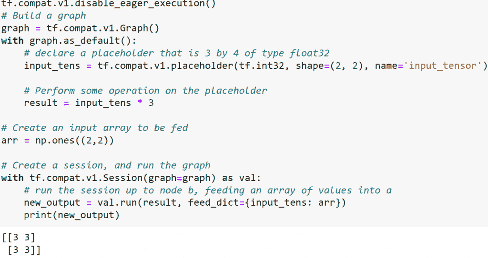
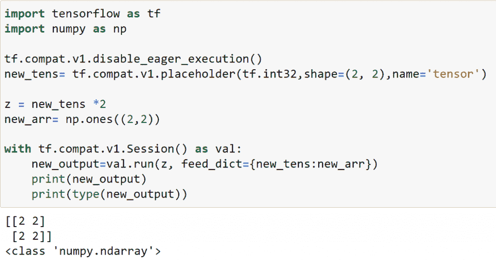
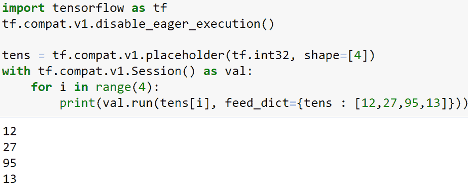
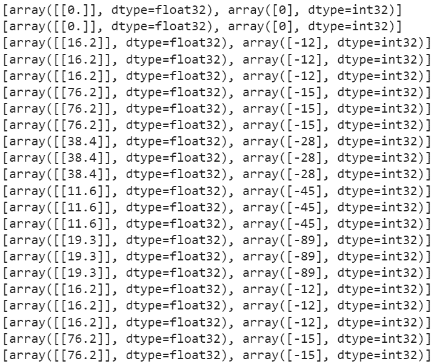
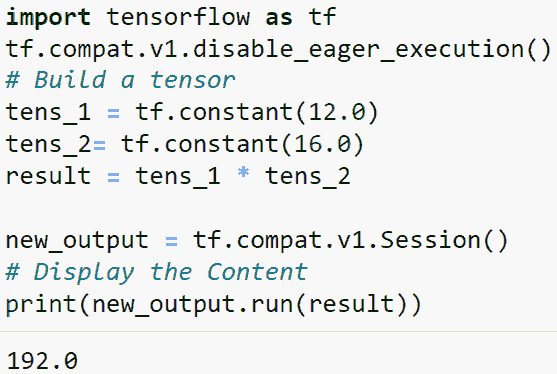
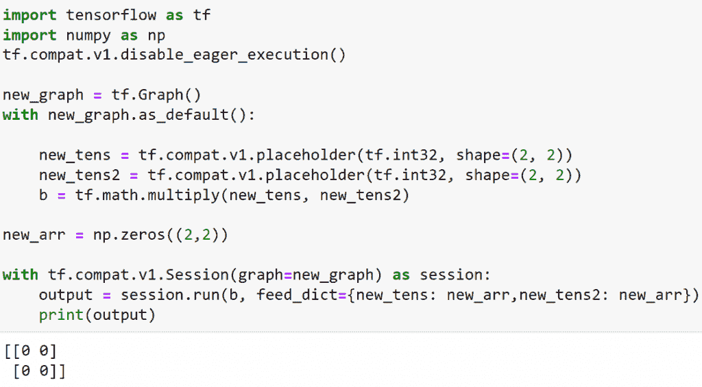
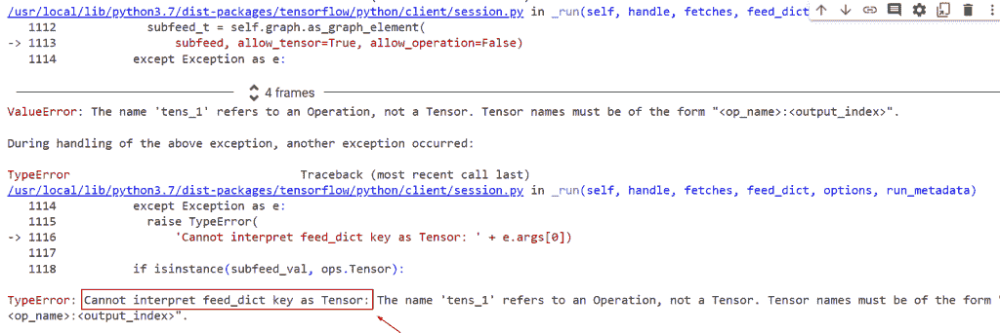
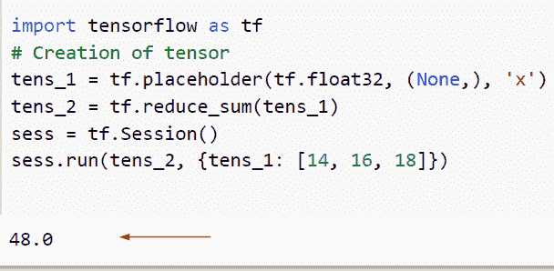

# TensorFlow feed_dict + 9 个示例

> 原文：<https://pythonguides.com/tensorflow-feed_dict/>

[](https://sharepointsky.teachable.com/p/python-and-machine-learning-training-course)

你知道如何在 TensorFlow 占位符 中创建一个 ***feed_dict 吗？因此，在这个 [Python 教程](https://pythonguides.com/learn-python/)中，我们将学习 Python 中的 **TensorFlow feed_dict** ，我们还将涵盖与 **TensorFlow feed_dict** 相关的不同示例。我们将讨论这些话题。***

*   TensorFlow feed_dict 多值
*   TensorFlow feed_dict numpy 数组
*   TensorFlow feed_dict 与数据集
*   TensorFlow feed_dict 张量
*   TensorFlow feed _ 字典列表
*   TensorFlow feed_dict batch
*   TensorFlow 会话运行时没有 feed_dict
*   TensorFlow 评估馈送 _ 字典
*   TensorFlow 无法将 feed_dict 键解释为张量

目录

[](#)

*   [TensorFlow feed_dict](#TensorFlow_feed_dict "TensorFlow feed_dict")
*   [TensorFlow feed_dict 多值](#TensorFlow_feed_dict_multiple_values "TensorFlow feed_dict multiple values")
*   [TensorFlow feed_dict numpy 数组](#TensorFlow_feed_dict_numpy_array "TensorFlow feed_dict numpy array")
*   [TensorFlow feed_dict 张量](#TensorFlow_feed_dict_tensor "TensorFlow feed_dict tensor")
*   [TensorFlow feed_dict list](#TensorFlow_feed_dict_list "TensorFlow feed_dict list")
*   [TensorFlow feed_dict batch](#TensorFlow_feed_dict_batch "TensorFlow feed_dict batch")
*   [TensorFlow 会话在没有 feed_dict 的情况下运行](#TensorFlow_session_run_without_feed_dict "TensorFlow session run without feed_dict")
*   [张量流评估馈送 _ 字典](#TensorFlow_eval_feed_dict "TensorFlow eval feed_dict")
*   [TensorFlow 无法将 feed_dict 键解释为张量](#TensorFlow_cannot_interpret_the_feed_dict_key_as_tensor "TensorFlow cannot interpret the feed_dict key as tensor")

## TensorFlow feed_dict

*   在本节中，我们将讨论如何使用 TensorFlow 在占位符中使用 feed_dict。
*   在 TensorFlow 中，有一些占位符与任何人都可以声明的变量相同，即使是在运行时使用 feed_dict 参数。feed_dict 参数在 TensorFlow 中用于将值提供给这些占位符，以避免出现提示您为 TensorFlow 中的占位符提供值的错误。
*   我们通过使用语法 feed_dict= **{x:[2，20]，b:[1，25]})**，在每个会话中包含 feed dict pass 和 fetch。提要字典为该计算指定占位符值，而 fetches 参数指示我们想要计算的内容。
*   在 TensorFlow 中，占位符是一个变量，它分配数据并将值输入计算图。这种方法允许用户提供操作数据并生成我们的计算图。
*   在 Python 中，如果我们想要初始化一些数据，那么我们使用变量，但是在 placeholder 中，你可以将数据输入到计算图中。
*   在 TensorFlow 的最新版本中，我们准备使用 tf.compat.v1.placeholder()函数，这个函数只会在 TensorFlow 2.x 版本中执行。

**语法**:

让我们看看语法并理解 Python TensorFlow 中的**TF . compat . v1 . placeholder()**函数的工作原理。

```
tf.compat.v1.placeholder
                       (
                        dtype,
                        shape=None,
                        name=None
                       )
```

现在让我们讨论一下我们将在示例中使用的这些参数

*   它由几个参数组成
    *   **dtype:** 该参数指定张量中的元素类型。
    *   形状:默认情况下，它没有值，如果你没有在张量中提到形状，那么你可以输入任何形状的张量。
    *   **名称:**该参数指定操作的名称，可选参数。

示例:

让我们举个例子，看看如何使用 TensorFlow 在占位符中创建一个 **feed_dict。**

```
import tensorflow as tf

tf.compat.v1.disable_eager_execution()
input_tens_1 = tf.compat.v1.placeholder(tf.int32)
input_tens_2 = tf.compat.v1.placeholder(tf.int32)
result = tf.math.multiply(input_tens_1, input_tens_2)
with tf.compat.v1.Session() as val:
    new_output=val.run(result, feed_dict={input_tens_1: 56, input_tens_2: 78})
    print(new_output)
```

*   在下面的代码中，我们导入了别名为“tf”的 TensorFlow 库，然后声明了两个占位符，其数据类型为 **tf.int32()** 。
*   之后，我们通过使用 **tf.math.multiply** 执行操作，然后通过导入**TF . compat . v1 . disable _ eager _ execution()**函数创建会话。
*   创建会话时，我们将 **feed_dict** 指定为参数。

下面是以下代码的截图


Tensorflow feed_dict

这就是我们如何在 TensorFlow 占位符中使用 fee_dict

读取: [Tensorflow 获取静态值](https://pythonguides.com/tensorflow-get-static-value/)

## TensorFlow feed_dict 多值

*   让我们通过 TensorFlow 来讨论如何使用占位符 fee_dict 中的多个值。
*   为了执行这个特定的任务，我们将使用 **tf.graph()** 的概念，图指定了节点和一条边，而节点接受更多的张量作为输入，并生成给定的张量作为输出。在这个例子中，我们将使用 **tf.compat.v1.graph()** 。在 Tensorflow 中，如果你想在图形中添加变量，你可以很容易地调用构造函数，当创建一个张量时，我们有与初始值相同的数据类型。
*   在 tf。 **placeholder()** 我们可以很容易地在稍后的会话中将该值存储为 **feed_dict** 。如果我们在运行会话时没有传递任何值，那么将会产生一个错误。

语法:

下面是 Python TensorFlow 中 **tf.placeholder()** 函数的语法

```
tf.compat.v1.placeholder
                       (
                        dtype,
                        shape=None,
                        name=None
                       )
```

示例:

让我们举一个例子，了解如何在 feed_dict 中使用多个值

```
import tensorflow as tf
import numpy as np

tf.compat.v1.disable_eager_execution()
# Build a graph
graph = tf.compat.v1.Graph()
with graph.as_default():
    # declare a placeholder that is 3 by 4 of type float32
    input_tens = tf.compat.v1.placeholder(tf.int32, shape=(2, 2), name='input_tensor')

    # Perform some operation on the placeholder
    result = input_tens * 3

# Create an input array to be fed
arr = np.ones((2,2))

# Create a session, and run the graph
with tf.compat.v1.Session(graph=graph) as val:
    # run the session up to node b, feeding an array of values into a
    new_output = val.run(result, feed_dict={input_tens: arr})
    print(new_output)
```

*   在上面的代码中，我们导入了 TensorFlow 库，然后声明了一个 2 乘 2 张量的占位符，其值是 32 位整数(或者可以转换为 32 位整数)。
*   一旦执行了这段代码，输出会显示 3 乘以 1 的值，这意味着输入数组被乘以了两倍。

下面是以下代码的截图



TensorFlow feed_dict multiple values

正如你在截图中看到的，我们已经在 feed_dict 中分配了输入张量和数组

阅读:[张量流交叉熵损失](https://pythonguides.com/tensorflow-cross-entropy-loss/)

## TensorFlow feed_dict numpy 数组

*   在这一节中，我们将讨论如何在 feed_dict 中创建一个 numpy 数组。
*   为了执行这个特定的任务，我们将使用**TF . compat . v1 . placeholder()**函数，并将**数据类型、形状**指定为参数。
*   接下来，我们将使用 **np.ones()** 函数创建 numpy 数组，在这个函数中，我们提到了形状。

示例:

```
import tensorflow as tf
import numpy as np

tf.compat.v1.disable_eager_execution()
new_tens= tf.compat.v1.placeholder(tf.int32,shape=(2, 2),name='tensor')

z = new_tens *2
new_arr= np.ones((2,2))

with tf.compat.v1.Session() as val:
    new_output=val.run(z, feed_dict={new_tens:new_arr})
    print(new_output)
    print(type(new_output))
```

你可以参考下面的截图



TensorFlow feed_dict numpy array

在给定的例子中，我们在 feed_dict 中分配了 numpy 数组

阅读:[梯度下降优化器张量流](https://pythonguides.com/gradient-descent-optimizer-tensorflow/)

## TensorFlow feed_dict 张量

*   这里我们将讨论如何使用 TensorFlow 在 feed_dict 中创建张量。
*   为了执行这个特定的任务，我们将使用**TF . compat . v1 . placeholder()**函数，占位符是一个变量，它分配数据并将值输入计算图。

示例:

我们举个例子，了解一下如何在 feed_dict 中创建张量。

```
import tensorflow as tf

tf.compat.v1.disable_eager_execution()
input_tensor_1= tf.compat.v1.placeholder(tf.int32)
input_tensor_2 = tf.compat.v1.placeholder(tf.int32)
result = tf.add(input_tensor_1, input_tensor_2)
with tf.compat.v1.Session() as val:
    new_output=val.run(result, feed_dict={input_tensor_1: 156, input_tensor_2: 278})
    print(new_output)
```

*   在下面的代码中，我们导入了别名为“tf”的 TensorFlow 库，然后声明了两个占位符，其数据类型为 **tf.int32()** 。
*   之后，我们通过使用 **tf.add()** 执行操作，然后通过导入**TF . compat . v1 . disable _ eager _ execution()**函数创建会话。
*   创建会话时，我们将 **feed_dict** 指定为参数。

下面是以下代码的截图


TensorFlow feed_dict tensor

这就是我们如何在 feed_dict 中分配输入张量

阅读:[张量流 clip_by_value](https://pythonguides.com/tensorflow-clip_by_value/)

## TensorFlow feed_dict list

*   在本节中，我们将讨论如何使用 TensorFlow 在 feed_dict 中声明一个列表。
*   为了执行这个特定的任务，我们将在创建会话时使用 **for-loop()** 方法。
*   在这个例子中，我们将使用**TF . compat . v1 . placeholder()**函数，然后通过使用 for 循环方法，我们可以很容易地迭代已经在 **feed_dict()** 中分配的占位符值，并且在其中，我们已经在其中分配了 list。

示例:

```
import tensorflow as tf
tf.compat.v1.disable_eager_execution()

tens = tf.compat.v1.placeholder(tf.int32, shape=[4])
with tf.compat.v1.Session() as val:
    for i in range(4):
        print(val.run(tens[i], feed_dict={tens : [12,27,95,13]}))
```

在下面给出的代码中，我们导入了

你可以参考下面的截图



TensorFlow feed_dict list

正如你在截图中看到的，我们已经在 feed_dict 中分配了列表

阅读:[张量流乘法](https://pythonguides.com/tensorflow-multiplication/)

## TensorFlow feed_dict batch

*   在本节中，我们将讨论如何使用 TensorFlow 在 feed_dict 中获取批处理。
*   为了完成这个任务，我们将使用**TF . data . dataset . from _ tensor slices()**函数，在这个函数中，我们将设置 batch 和 **epochs()** 值。
*   接下来，我们将声明大小和纪元值的变量，然后使用 **tf.variable scope()** 函数。该函数声明新的变量，并在禁用急切执行时按预期工作。

示例:

```
import tensorflow as tf
from __future__ import absolute_import
from __future__ import division

def ds_train(new_val_size, new_epochs):  
    new_val = (tf.data.Dataset.from_tensor_slices(([16.2,76.2,38.4,11.6,19.3], [-12,-15,-28,-45,-89]))
            .batch(new_val_size)
            .repeat(new_epochs)        
            )
    return new_val

new_val_size= 1
input_size = 1
new_epochs = 2

with tf.variable_scope("dataset"):       
    result= ds_train(new_val_size, new_epochs)

with tf.variable_scope("iterator"):
    val_iterate = result.make_initializable_iterator()
    new_iterate_handle = tf.placeholder(tf.string, shape=[])
    iterator = tf.data.Iterator.from_string_handle(new_iterate_handle, 
                                                val_iterate.output_types,
                                                val_iterate.output_shapes)

    def next_item():
        new_element = iterator.get_next(name="new_element")
        m, n = tf.cast(new_element[0], tf.float32), new_element[1]
        return m, n        

inputs = tf.Variable(tf.zeros(shape=[new_val_size,input_size]), dtype=tf.float32, name="inputs", trainable=False, use_resource=True)
target = tf.Variable(tf.zeros(shape=[new_val_size], dtype=tf.int32), dtype=tf.int32, name="target", trainable=False,use_resource=True)
is_new = tf.placeholder_with_default(tf.constant(False), shape=[], name="new_item_flag")

def new_data(new_val_size, input_size):

    next_inputs, next_target = next_item()
    next_inputs = tf.reshape(next_inputs, shape=[new_val_size, input_size])
    with tf.control_dependencies([tf.assign(inputs, next_inputs), tf.assign(target, next_target)]):
        return tf.identity(inputs), tf.identity(target)

def old_data():

    return inputs, target

next_inputs, next_target = next_item()

inputs, target =  tf.cond(is_new, lambda:new_data(new_val_size, input_size), old_data)

with tf.Session() as sess:
    sess.run([tf.global_variables_initializer(),tf.local_variables_initializer()])
    handle_t = sess.run(val_iterate.string_handle())
    sess.run(val_iterate.initializer)
    while True:
        try:
            print(sess.run([inputs, target], feed_dict={new_iterate_handle:handle_t, is_new: False}))
            print(sess.run([inputs, target], feed_dict={new_iterate_handle:handle_t, is_new: False}))
            print(sess.run([inputs, target], feed_dict={new_iterate_handle:handle_t, is_new: True}))
        except tf.errors.OutOfRangeError:
            print("End of training dataset.")
            break 
```

在下面给出的代码中，我们使用了**TF . data . iterator . from _ string _ handle()**函数，该函数指示了遍历数据集，然后使用 **tf.variables()** 函数声明张量的状态。

下面是以下代码的截图



TensorFlow feed_dict batch

这就是我们如何通过 Tensorflow 在 feed_dict 中使用批处理

阅读: [Python TensorFlow 占位符](https://pythonguides.com/tensorflow-placeholder/)

## TensorFlow 会话在没有 feed_dict 的情况下运行

*   这里我们可以在 TensorFlow 中不使用 feed_dict 创建一个正在运行的会话。
*   在本例中，我们将使用 tf.compat.v1.Session()的概念，它是一个用于运行会话的类。为了完成这项任务，我们将首先导入带有 tf 别名的 TensorFlow 库，其中 tf 代表 TensorFlow [](https://pythonguides.com/tensorflow/)，它用于数值计算问题。接下来，我们将创建一个张量形式的变量，并分配一个 **tf.constant()** 函数。
*   在 Python 中，这个函数采用一个常数值，表示不修改的值，它还初始化一个对象，如数组或列表。
*   这里我们将在节点 **new_output** 应用数学运算 **(*)** 。为了运行这个会话，我们将使用 **val.run()** 语法。在这个参数中，我们将使用乘法运算。

语法:

下面是 Python TensorFlow 中 **tf.compat.v1.Session()** 函数的语法

```
tf.compat.v1.Session(
    target='', graph=None, config=None
)
```

*   它由几个参数组成。
    *   target:这是一个可选参数，默认情况下，它在流程引擎中使用。
    *   graph:要开始的图形，是一个可选参数。
    *   Config:默认情况下，它不接受任何值，并通过配置进行缓冲。

示例:

让我们举一个例子，了解一下 **tf.compat.v1.Session()** 函数创建任意会话的工作原理。

```
import tensorflow as tf
tf.compat.v1.disable_eager_execution()
# Build a tensor
tens_1 = tf.constant(12.0)
tens_2= tf.constant(16.0)
result = tens_1 * tens_2

new_output = tf.compat.v1.Session()
# Display the Content
print(new_output.run(result))
```

你可以参考下面的截图



TensorFlow session run without feed_dict

这就是我们不使用 feed_dict 运行会话的方式

阅读:[将列表转换为张量张量流](https://pythonguides.com/convert-list-to-tensor-tensorflow/)

## 张量流评估馈送 _ 字典

*   在本节中，我们将讨论如何通过 TensorFlow 来使用 feed_dict 中的 eval。
*   为了执行这个特定的任务，我们将使用 **tf.graph()** ，这个方法定义了在操作之间流动的数据单元。
*   在这个例子中，我们将使用**TF . compat . v1 . placeholder()**函数，在这个函数中，我们将数据类型和形状指定为一个参数。

示例:

```
import tensorflow as tf
import numpy as np
tf.compat.v1.disable_eager_execution()

new_graph = tf.Graph()
with new_graph.as_default():

    new_tens = tf.compat.v1.placeholder(tf.int32, shape=(2, 2))
    new_tens2 = tf.compat.v1.placeholder(tf.int32, shape=(2, 2))
    b = tf.math.multiply(new_tens, new_tens2)

new_arr = np.zeros((2,2))

with tf.compat.v1.Session(graph=new_graph) as session:
    output = session.run(b, feed_dict={new_tens: new_arr,new_tens2: new_arr})
    print(output)
```

下面是以下给定代码的输出



TensorFlow eval feed_dict

阅读:[Python tensor flow expand _ dims](https://pythonguides.com/tensorflow-expand_dims/)

## TensorFlow 无法将 feed_dict 键解释为张量

*   在本节中，我们将讨论“TensorFlow 无法将 feed_dict 键解释为张量”的错误消息。
*   当我试图获取输入张量中的值时，输出引发了这个错误，并且无法将 feed_dict 解释为张量。在这个例子中，我们将使用 **tf.placeholder()** 创建一个张量，在这个张量中，我们已经指定了数据类型和操作名称。
*   接下来，我们将运行会话，并为 feed_dict 分配张量值 **{x: [34，78，18]})。**

示例:

```
import tensorflow as tf
tens_1 = tf.placeholder(tf.float32, (None,), 'tens_1')
tens_2 = tf.reduce_sum(x)
sess = tf.Session()

sess.run(y, {x: [34, 78, 18]})
sess.run(y, {'tens_1': [34, 78, 18]})
```



TensorFlow cannot interpret the feed_dict key as tensor

此错误的解决方案

```
import tensorflow as tf
# Creation of tensor
tens_1 = tf.placeholder(tf.float32, (None,), 'x')
tens_2 = tf.reduce_sum(tens_1)
sess = tf.Session()
sess.run(tens_2, {tens_1: [14, 16, 18]})
```

下面是以下代码的截图



Solution of TensorFlow cannot interpret the feed_dict key as tensor

这就是我们如何解决 TensorFlow 无法解释 feed_dict 的错误

您可能也喜欢阅读以下 Python TensorFlow 教程。

*   [Python TensorFlow one_hot](https://pythonguides.com/tensorflow-one_hot/)
*   [批量归一化张量流](https://pythonguides.com/batch-normalization-tensorflow/)
*   [Python TensorFlow 随机均匀](https://pythonguides.com/tensorflow-random-uniform/)
*   [Python tensor flow reduce _ sum](https://pythonguides.com/python-tensorflow-reduce_sum/)
*   [TensorFlow Tensor to numpy](https://pythonguides.com/tensorflow-tensor-to-numpy/)
*   [模块“tensorflow”没有属性“truncated _ normal”](https://pythonguides.com/module-tensorflow-has-no-attribute-truncated_normal/)

在本教程中，我们已经学习了 Python 中的 **TensorFlow feed_dict** ，我们还介绍了与 **TensorFlow feed_dict** 相关的不同示例。我们将讨论这些话题。

*   TensorFlow feed_dict 多值
*   TensorFlow feed_dict numpy 数组
*   TensorFlow feed_dict 与数据集
*   TensorFlow feed_dict 张量
*   TensorFlow feed _ 字典列表
*   TensorFlow feed_dict batch
*   张量流 feed-dict 数据集
*   TensorFlow 会话运行时没有 feed_dict
*   TensorFlow 评估馈送 _ 字典
*   TensorFlow 无法将 feed_dict 键解释为张量

[Bijay Kumar](https://pythonguides.com/author/fewlines4biju/)

Python 是美国最流行的语言之一。我从事 Python 工作已经有很长时间了，我在与 Tkinter、Pandas、NumPy、Turtle、Django、Matplotlib、Tensorflow、Scipy、Scikit-Learn 等各种库合作方面拥有专业知识。我有与美国、加拿大、英国、澳大利亚、新西兰等国家的各种客户合作的经验。查看我的个人资料。

[enjoysharepoint.com/](https://enjoysharepoint.com/)[](https://www.facebook.com/fewlines4biju "Facebook")[](https://www.linkedin.com/in/fewlines4biju/ "Linkedin")[](https://twitter.com/fewlines4biju "Twitter")