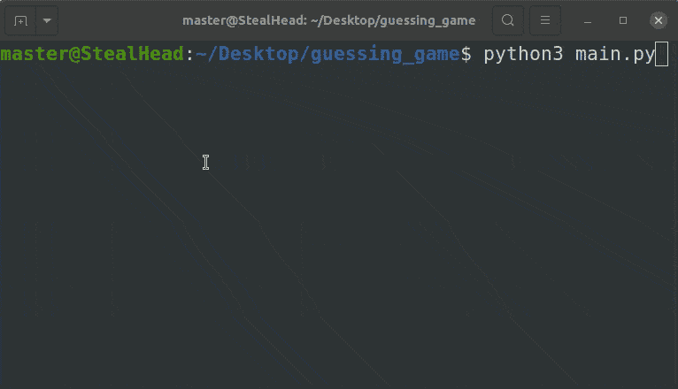
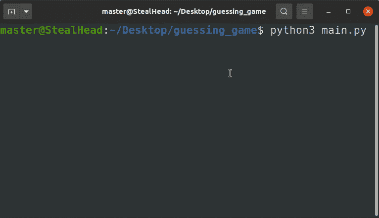
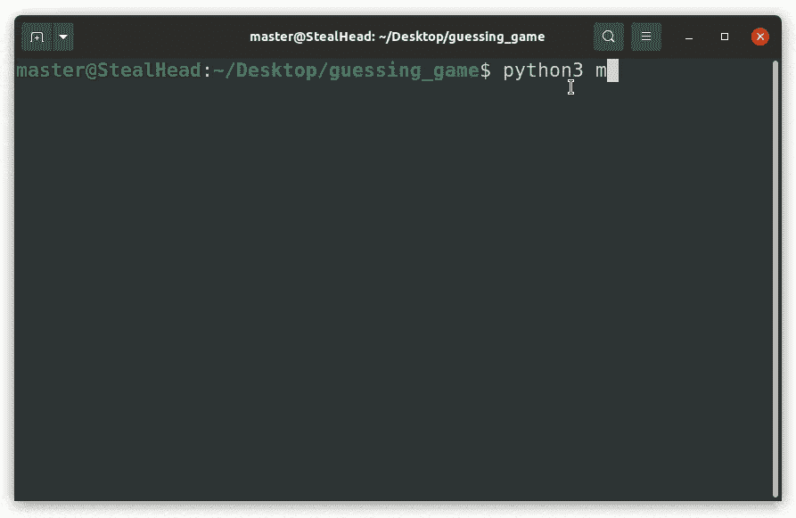
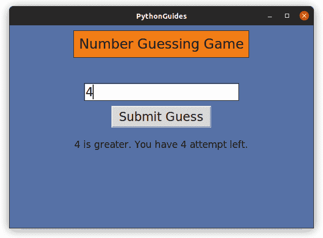
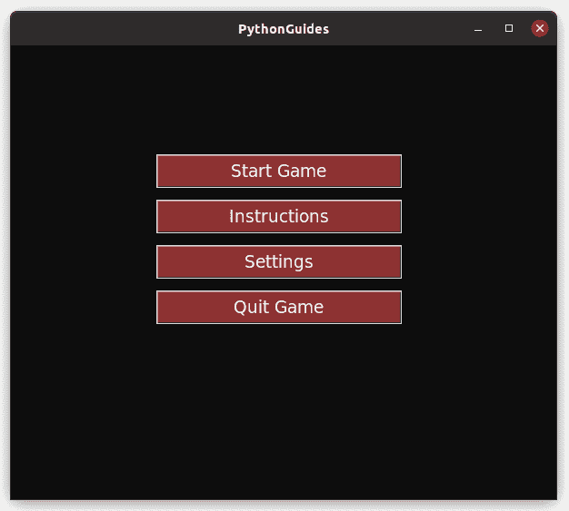

# Python 数字猜谜游戏

> 原文：<https://pythonguides.com/python-number-guessing-game/>

[](https://sharepointsky.teachable.com/p/python-and-machine-learning-training-course)

在本 [Python 教程](https://pythonguides.com/learn-python/)中，我们将学习如何创建 **Python 数字猜谜游戏**。我们从基础开始，一直到创建这个应用程序的高级方法。此外，我们已经讨论了这些主题。

1.  Python 数字猜谜游戏概述
2.  Python 数字猜测游戏 While 循环
3.  用于循环的 Python 数字猜谜游戏
4.  Python 随机数猜谜游戏
5.  Python 猜数字游戏代码
6.  猜数字游戏 Python Tkinter
7.  猜数字游戏 Python 项目

目录

[](#)

*   [Python 猜数字游戏概述](#Python_Number_Guessing_Game_Overview "Python Number Guessing Game Overview")
*   [Python 边猜数字边循环的游戏](#Python_Number_Guessing_Game_While_Loop "Python Number Guessing Game While Loop")
*   [Python 数字猜谜游戏 For Loop](#Python_Number_Guessing_Game_For_Loop "Python Number Guessing Game For Loop")
*   [Python 随机数猜谜游戏](#Python_Random_Number_Guessing_Game "Python Random Number Guessing Game")
*   [Python 数字猜谜游戏代码](#Python_Number_Guessing_Game_Code "Python Number Guessing Game Code")
*   [猜数字游戏 Python Tkinter](#Number_Guessing_Game_Python_Tkinter "Number Guessing Game Python Tkinter")
*   [猜数字游戏 Python 项目](#Number_Guessing_Game_Python_Project "Number Guessing Game Python Project")

## Python 猜数字游戏概述

在这一节中，我们将简要介绍一下 **Python 数字猜谜游戏**。


*   在这个游戏中，[程序产生随机数](https://pythonguides.com/python-generate-random-number/),但是玩家看不到这个数字。
*   玩家试图猜测数字。如果玩家输入的数字与系统生成的数字相同，程序将显示获胜信息，游戏结束。
*   如果玩家输入了错误的数字，那么这个数字就会被评估。如果数字大于正确答案，系统会提示输入的数字为“高”，否则如果数字小于正确答案，系统会提示输入的数字为“低”。
*   用户赢得游戏的尝试次数是有限的。
*   下面是 **python 猜数游戏**的基本演示。在这个游戏中，正确答案是 7，用户有无限的机会猜测数字。


Python Number Guessing Game Overview

如果不是 python 中的条件，则读取

## Python 边猜数字边循环的游戏

在这一节中，我们将学习 **python 数字猜测游戏 while loop** 。我们将理解游戏中 while 循环的必要性。

*   python 中使用了两种类型的循环。for 循环和 while 循环。
*   当我们知道必须执行循环多少次时，通常会使用“for”循环。在下一节中，我们将更多地讨论' for '循环。
*   “While”循环通常在我们必须无限次运行循环时使用。例如，如果我们想在这个游戏中给无限的机会猜测数字，那么我们将使用 [while 循环](https://pythonguides.com/python-while-loop-condition/)。
*   请注意，while 循环不仅在我们必须运行无限循环时使用，还有其他用途。我们在前面的语句中提到了这一点，因为我们将使用 while 语句运行无限循环。
*   在我们的例子中，我们将继续运行程序，直到用户猜出正确的答案。

**源代码:**

在这段源代码中，我们使用“while”循环开始了一个无限循环。只有当用户给出正确答案时，这个循环才会终止。

run 是标记为 True 的标志，这意味着循环将继续运行。当用户将输入正确的答案时，该标志变为假，循环将在此结束。

```
run = True
while run:
    user_input = int(input('Enter Number: '))
    if user_input == 7:
        print('You won!')
        run = False
    else:
        print('try again!')
        continue
```

**输出:**

在这个输出中，程序一直提示输入数字，直到玩家没有给出正确的答案。


Python Number Guessing Game While Loop

阅读[使用 python 从 URL 下载 zip 文件](https://pythonguides.com/download-zip-file-from-url-using-python/)

## Python 数字猜谜游戏 For Loop

在本节中，我们将了解使用‘for’循环的 **python 数字猜测游戏。我们将探索在猜谜游戏**中使用**循环的方法。**

*   “For”循环在有限的时间内运行。换句话说，如果我们知道我们必须运行循环多少次，那么我们可以使用“for”循环。
*   这完全取决于偏好和复杂性，否则同样的任务也可以用 while 循环来完成。
*   在我们的 Python 数字猜测游戏中，我们将使用 for 循环来限制玩家的尝试次数。
*   游戏结束后，玩家将失去机会，我们将提供 5 次猜测正确答案的机会。

**源代码:**

在这个源代码中，我们只能尝试 5 次，正确答案是 7。

每次玩家猜错时，屏幕上会显示一条重试消息，并显示剩余的尝试次数。

```
attempt = 5
for i in range(5):
    user_input = int(input('Enter Number: '))

    if user_input == 7:
        print('You won!')
        break
    else:
        print(f'Try again! {attempt} left.')
        attempt -= 1
        continue 
```

**输出:**

在这个输出中，当输入 7 时，程序以韩元结束！消息。但是对于剩余的尝试次数，将显示“重试”消息，同时显示剩余的尝试次数。



Python Number Guessing Game For Loop

读取 [Python 返回函数](https://pythonguides.com/python-return-function/)

## Python 随机数猜谜游戏

在本节中，我们将学习 **Python 随机数猜测游戏**。

*   随机数可以使用 python 随机模块生成。因为我们只想生成整数，所以我们将使用随机模块的 randint()方法。
*   Python `**random.randint()**`方法接受起始和结束数字。然后它会生成这个范围内的任何数字。
*   到目前为止，我们在上面的程序中硬编码结果为 7，但从现在开始，我们将使用 python 随机模块生成一个随机数。

```
random.randint(0, 10)
```

*   这是 Python `random.randint()`方法实现的一个例子。这里 0 是起点(上限)，10 是终点(下限)。
*   程序每次运行时，都会显示 0 到 10 之间的随机数。

**源代码:**

在这段代码中，我们使用了一个随机模块来生成玩家需要猜测的随机数。

```
import random

num = random.randint(0, 10)
print('Number:',num)
attempt = 4 
msg = 'You Lost!'   

while attempt > 0:
    user_input = int(input('Enter Number: '))

    if user_input == num:
        msg = 'You Won!'
        break
    else:
        print(f'Try again! {attempt} attempt left.')
        attempt -= 1
        continue

print(msg)
```

**输出:**

这个输出执行了两次，所以请完整地观看。每次程序产生一个我们必须猜测的随机数。为了使事情更简单，我们也显示了答案。



Python Random Number Guessing Game

阅读[如何用 python 将整数转换成字符串](https://pythonguides.com/convert-an-integer-to-string-in-python/)

## Python 数字猜谜游戏代码

在本节中，我们创建了一个 **python 数字猜谜游戏脚本**。这将是一个基于命令行的游戏。我们已经在下一节创建了基于图形用户界面的游戏。

*   随机方法是用来产生随机数，玩家需要猜测，以赢得游戏。
*   在下面的代码中，您可以看到随机数的范围在 0 到 10 之间。您可以根据需要更改该范围。

```
import random

num = random.randint(0, 10)
print(f'''
---------------------------
Correct answer: {num}
---------------------------
''')
```

*   我们将尝试次数限制为 5 次。虽然在下面的代码中提到了 4，如果你运行这个程序，它会给你 5 次机会。
*   msg 被设置为空字符串，因为我们稍后将在代码中更新这个空列表来显示消息。

```
attempt = 4
msg = ''
```

*   在剩余的代码中，首先我们保证尝试次数不为 0。
    `while attempt > 0`如果尝试次数为 0，表示玩家输掉了游戏。
*   为了接受连续输入，我们将 input 语句放在 while 循环中。
*   If-else 条件用于比较用户输入和随机生成的数字。
*   如果数字匹配，则玩家赢得游戏，程序结束。但是如果数字不匹配，那么将用户输入与随机生成的数字进行比较。
*   比较为玩家显示提示。输入的数字大于或小于答案。

**源代码:**

这里是 python 数字猜谜游戏代码的完整源代码。

```
import random

num = random.randint(0, 10)
print(f'''
---------------------------
Correct answer: {num}
---------------------------
''')

attempt = 4
msg = ''
while attempt > 0:

    user_input = int(input('Enter Number: '))
    if user_input == num:
        msg = 'You Won!'
        break
    elif user_input > num:
        print(f'{user_input} is greater.\nRemaining attempts: {attempt}.')
        attempt -= 1

    elif user_input < num:
        print(f'{user_input} is smaller.\nRemaining attempts: {attempt}.')
        attempt -= 1

    else:
        print('Something went wrong!')
        break

print(msg)
```

**输出:**

在这个输出中，程序生成一个随机数，用户试图猜测它。尝试的次数有限。玩家得到每一个错误答案的提示。



Python Number Guessing Game Code

阅读 [Python 字典方法](https://pythonguides.com/python-dictionary-methods/)

## 猜数字游戏 Python Tkinter

在本节中，我们将学习使用 python Tkinter 创建一个数字猜谜游戏。

*   Python Tkinter 是一个模块，我们可以用它来创建 GUI(图形用户界面)应用程序。
*   `ws = Tk()`，我们已经创建了一个 Tk 类的对象。现在我们将使用 ws 对象来模拟这个类。
*   我们创建了这个函数，使用 if-else 条件来确保玩家仍然有机会。
*   如果机会大于 0，则执行用户输入和生成的随机数之间的比较。
*   玩家将收到提示，如果输入错误的数字，也只有 5 次机会。

```
from tkinter import *
import random

ws = Tk()
ws.title('PythonGuides')
ws.geometry('600x400')
ws.config(bg='#5671A6')

ranNum = random.randint(0, 10)
chance = 5
var = IntVar()
disp = StringVar()

def check_guess():
    global ranNum
    global chance
    usr_ip = var.get()
    if chance > 0:
        if usr_ip == ranNum:
            msg = f'You won! {ranNum} is the right answer.'
        elif usr_ip > ranNum:
            chance -= 1
            msg = f'{usr_ip} is greater. You have {chance} attempt left.'
        elif usr_ip < ranNum:
            chance -= 1
            msg = f'{usr_ip} is smaller. You have {chance} attempt left.'
        else:
            msg = 'Something went wrong!'
    else:
        msg = f'You Lost! you have {chance} attempt left.'

    disp.set(msg)

Label(
    ws,
    text='Number Guessing Game',
    font=('sans-serif', 20),
    relief=SOLID,
    padx=10,
    pady=10,
    bg='#F27D16'
).pack(pady=(10, 0))

Entry(
    ws,
    textvariable=var,
    font=('sans-serif', 18)
).pack(pady=(50, 10))

Button(
    ws,
    text='Submit Guess',
    font=('sans-serif', 18),
    command=check_guess
).pack()

Label(
    ws,
    textvariable=disp,
    bg='#5671A6',
    font=('sans-serif', 14)
).pack(pady=(20,0))

ws.mainloop()
```

**输出:**

在这个输出中，显示了 **python 数字猜测游戏 GUI** 。玩家将在输入框中输入任意数字，如果该数字与系统生成的随机数匹配，则玩家赢得游戏。



Python Number Guessing Game GUI

阅读 [11 Python 列表方法](https://pythonguides.com/python-list-methods/)

## 猜数字游戏 Python 项目

在这一节中，我们将**创建一个数字猜谜游戏 python** 项目，你可以在你的辅修或主修中使用它。

*   在这个游戏中，我们创建了 4 个页面:
    *   菜单页面
    *   开始游戏
    *   说明
    *   设置
    *   退出游戏
*   点击开始按钮将带你到主游戏页面。在那里你可以玩这个游戏。
*   菜单页上的退出游戏按钮将终止游戏。
*   说明和设置是待办事项页面。您可以编写自己的说明并确定设置。
*   设置可以涉及改变随机数的上限和下限范围，改变页面的主题(背景色和前景色)，添加滑块来打开或关闭。
*   这样你就可以准备一个次要或主要的项目，这将有助于你取得好成绩。

**菜单页面的源代码**:

```
from tkinter import *

def game():
    ws.destroy()
    import app

def instr():
    ws.destroy()
    import instruction

def change_setting():
    ws.destroy()
    import chng_setting

ws = Tk()
ws.title('PythonGuides')
ws.geometry('600x500')
ws.config(bg='#0D0D0D')

start_game = Button(
    ws,
    width=20,
    text='Start Game',
    font=('sans-serif', 14),
    bg='#8C3232',
    fg='white',
    command= game
)
start_game.place(x=160, y=120)

instructions = Button(
    ws,
    width=20,
    text='Instructions',
    font=('sans-serif', 14),
    bg='#8C3232',
    fg='white',
    command=instr
)
instructions.place(x=160, y=170)

setting = Button(
    ws,
    width=20,
    text='Settings',
    font=('sans-serif', 14),
    bg='#8C3232',
    fg='white',
    command=change_setting
)
setting.place(x=160, y=220)

exit = Button(
    ws,
    width=20,
    text='Quit Game',
    font=('sans-serif', 14),
    bg='#8C3232',
    fg='white',
    command=exit
)
exit.place(x=160, y=270)

ws.mainloop()
```

**菜单页面的输出:**

这是应用程序的菜单或主页的输出。点击任何其他按钮将进入下一页。



Python Number Guessing Game Using Tkinter Menu Page

**游戏开始页面的源代码**:

下面是猜数字游戏的完整 Python 项目的源代码。这个游戏是基于 GUI 的，使用 python Tkinter 库创建的。

```
from tkinter import *
import random

ws = Tk()
ws.title('PythonGuides')
ws.geometry('600x400')
ws.config(bg='#5671A6')

ranNum = random.randint(0, 10)
chance = 5
var = IntVar()
disp = StringVar()

def check_guess():
    global ranNum
    global chance
    usr_ip = var.get()
    if chance > 0:
        if usr_ip == ranNum:
            msg = f'You won! {ranNum} is the right answer.'
        elif usr_ip > ranNum:
            chance -= 1
            msg = f'{usr_ip} is greater. You have {chance} attempt left.'
        elif usr_ip < ranNum:
            chance -= 1
            msg = f'{usr_ip} is smaller. You have {chance} attempt left.'
        else:
            msg = 'Something went wrong!'
    else:
        msg = f'You Lost! you have {chance} attempt left.'

    disp.set(msg)

Label(
    ws,
    text='Number Guessing Game',
    font=('sans-serif', 20),
    relief=SOLID,
    padx=10,
    pady=10,
    bg='#F27D16'
).pack(pady=(10, 0))

Entry(
    ws,
    textvariable=var,
    font=('sans-serif', 18)
).pack(pady=(50, 10))

Button(
    ws,
    text='Submit Guess',
    font=('sans-serif', 18),
    command=check_guess
).pack()

Label(
    ws,
    textvariable=disp,
    bg='#5671A6',
    font=('sans-serif', 14)
).pack(pady=(20,0))

ws.mainloop()
```

**开始游戏页面的输出:**

在该输出中，玩家必须输入数字，如果该数字与系统生成的随机数匹配，则玩家获胜。玩家有 5 次机会猜测正确的数字。


Python Number Guessing Game GUI

您可能会喜欢以下 Python 教程:

*   [解析 Python 时出现意外的 EOF](https://pythonguides.com/unexpected-eof-python/)
*   [Python 对于基数为 10 的 int()无效文字](https://pythonguides.com/python-invalid-literal-for-int-with-base-10/)
*   [删除 python 中的 Unicode 字符](https://pythonguides.com/remove-unicode-characters-in-python/)
*   [Python 中的注释行](https://pythonguides.com/comment-lines-in-python/)
*   [在 Python 中检查列表是否为空](https://pythonguides.com/check-if-a-list-is-empty-in-python/)

在这个 Python 教程中，我们学习了如何**创建 Python 数字猜谜游戏**。此外，我们已经讨论了这些主题。

*   Python 数字猜谜游戏概述
*   Python 数字猜测游戏 While 循环
*   用于循环的 Python 数字猜谜游戏
*   Python 随机数猜谜游戏
*   Python 猜数字游戏代码
*   猜数字游戏 Python Tkinter
*   猜数字游戏 Python 项目

[Bijay Kumar](https://pythonguides.com/author/fewlines4biju/)

Python 是美国最流行的语言之一。我从事 Python 工作已经有很长时间了，我在与 Tkinter、Pandas、NumPy、Turtle、Django、Matplotlib、Tensorflow、Scipy、Scikit-Learn 等各种库合作方面拥有专业知识。我有与美国、加拿大、英国、澳大利亚、新西兰等国家的各种客户合作的经验。查看我的个人资料。

[enjoysharepoint.com/](https://enjoysharepoint.com/)[](https://www.facebook.com/fewlines4biju "Facebook")[](https://www.linkedin.com/in/fewlines4biju/ "Linkedin")[](https://twitter.com/fewlines4biju "Twitter")