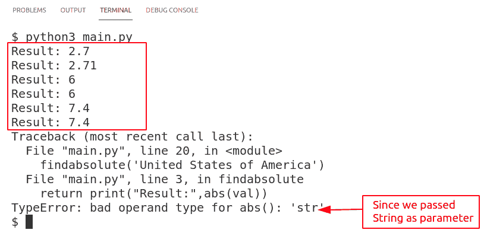
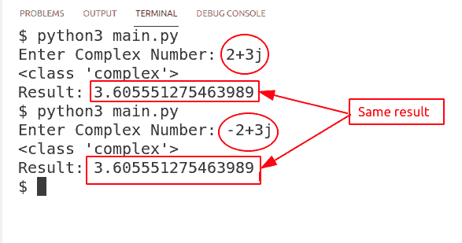
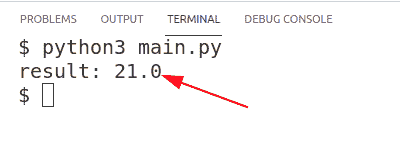
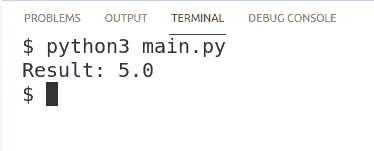

# Python 绝对值

> 原文：<https://pythonguides.com/python-absolute-value/>

[](https://sharepointsky.teachable.com/p/python-and-machine-learning-training-course)

在本 [Python 教程](https://pythonguides.com/python-hello-world-program/)中，我们将学习 Python 绝对值。此外，我们将涵盖这些主题。

*   Python 吸收值
*   Python 绝对值语法
*   Python 列表的绝对值
*   Python 绝对值函数
*   Python 绝对值 Numpy
*   Python 复数的绝对值
*   Python 绝对值数学
*   没有 ABS 的 Python 绝对值
*   Python 绝对值数据帧

目录

[](#)

*   [Python 吸收值](#Python_Absolulte_Value "Python Absolulte Value")
*   [Python 绝对值语法](#Python_Absolute_Value_syntax "Python Absolute Value syntax")
*   [Python 列表的绝对值](#Python_Absolute_Value_of_List "Python Absolute Value of List")
*   [Python 绝对值函数](#Python_Absolute_Value_Function "Python Absolute Value Function")
*   [Python 绝对值 Numpy](#Python_Absolute_Value_Numpy "Python Absolute Value Numpy")
*   [Python 复数的绝对值](#Python_Absolute_Value_of_Complex_Number "Python Absolute Value of Complex Number")
*   [Python 绝对值数学](#Python_Absolute_Value_Math "Python Absolute Value Math")
*   [Python 绝对值不带 ABS](#Python_Absolute_Value_Without_ABS "Python Absolute Value Without ABS")
*   [Python 绝对值数据帧](#Python_Absolute_Value_DataFrame "Python Absolute Value DataFrame")

## Python 吸收值

数字的 Python 绝对值是数字从 0 向右方向的距离。换句话说，一个数只有正数才叫做绝对值。例如-5 的绝对值将是 5。

*   在绝对法中，负号被忽略，只考虑数字。
*   使用 python **abs()** 方法，我们可以找到任何整数、浮点数和复数的绝对值。
*   abs()函数的另一种方法是使用 python 指数。对数字应用 2 的指数，然后对结果应用 0.5 的指数。这是一个不使用 python 中的 abs()方法就能快速找到绝对值的方法。
*   我们将在后面的小节中详细解释这种攻击。

还有，检查: [Python 漂亮打印 JSON](https://pythonguides.com/python-pretty-print-json/)

## Python 绝对值语法

在上一节中，我们已经了解了 python 中什么是绝对数字，并且我们遇到了 python 中的 **abs()** 方法，使用该方法我们可以找到数字的绝对值。

*   在本节中，我们将学习 python 的语法 **`abs()`** 方法。
*   Python **`abs()`** 方法只接受一个参数，那就是要求绝对值的数字。
*   您可以提供整数、浮点数或复数以外的值。下面是 python 绝对值的语法。

```py
abs(value)
```

## Python 列表的绝对值

List 在一个变量下保存多种数据类型的信息。在这一节中，我们将学习 python 列表的绝对值。

*   使用 python abs()方法我们会找到列表中每一项的绝对值。
*   在使用这个方法之前，确保列表中的所有项都是整数、浮点数或复数。Python abs()方法不适用于其他数据类型。
*   在我们的例子中，我们创建了一个整型、浮点型和复杂型值的列表。结果将是 python 列表的绝对值。

**源代码**:

在这段代码中，我们创建了一个包含数字(整数、浮点数和复数)的列表，然后使用 abs()方法在列表中转换这些值。我们已经通过 for 循环传递了列表，并将值存储在一个空列表中，然后打印该列表作为结果。

```py
list_without_abs = [1, 2.3, -4, -2.71j]
print('List without Absolute Value: ', list_without_abs)

list_with_abs = []
for item in list_without_abs:
    list_with_abs.append(abs(item))

print("List with Absolute value",str(list_with_abs))
```

**输出:**

在这个输出中，列表中的值被转换成绝对值。Absolute 只捕获值，忽略符号。最终结果没有负值在里面。


Python Absolute Value of List

阅读:Python 中的[平方根](https://pythonguides.com/square-root-in-python/)

## Python 绝对值函数

在本节中，我们将了解 python 绝对值函数。python **abs()** 函数用于求一个数的绝对值。

*   Absolute 函数忽略数字上的符号，只返回数字。换句话说，如果传递的是负值，那么它将返回正值。
*   python abs()函数中传递的值可以是整数、浮点数或复数。
*   在我们的示例中，我们创建了一个函数，它将向用户询问一个数字，然后返回该数字的绝对值。

**源代码:**

在这段代码中，我们创建了一个接受用户值的函数。该程序放在 python 异常处理块中。该函数返回数字的绝对值。此外，我们已经多次调用该函数，以使事情更容易理解。

```py
def findabsolute(val):
    try:
        return print("Result:",abs(val))
    except ValueError:
        return print("Only integer, float or complex values allowed")

#complex number
findabsolute(-2.7j)
findabsolute(2.71j)

#integer number
findabsolute(6)
findabsolute(-6)

#float number
findabsolute(7.4)
findabsolute(-7.4)

# string
findabsolute('United States of America')
```

**输出:**

在这个输出中，我们显示了每个数据类型(整型、浮点型和复杂型)的结果。当我们在函数中传递 python 字符串值时，程序抛出了一个错误。



Python Absolute Value Function

阅读: [Python 数字猜谜游戏](https://pythonguides.com/python-number-guessing-game/)

## Python 绝对值 Numpy

使用 python numpy 中的 **`numpy.absolute()`** 模块我们可以求出数字的绝对值。我们已经就这个话题写了一篇详细的博客 [Python NumPy 绝对值并附有例子](https://pythonguides.com/python-numpy-absolute-value/)。

## Python 复数的绝对值

复数是实数和虚数的组合。在本节中，我们将学习如何找到复数的 python 绝对值。

*   你可能想知道什么是复数中的虚数。一元数是数学中尚未解决的数。并且这些数字通过在实数(s)后加上 **j** 或 **J** 来表示。
*   复数的例子可以是 PI (π) = 3.1428514 的值，并且它继续下去。所以为了简化，我们可以这样写 **3.14+0j**
*   在我们的例子中，我们将用 python 将复数转换成绝对值。

**源代码:**

在这段代码中，我们要求用户以复数的形式输入，然后使用 python 内置的 **abs()** 方法将这个数字转换成绝对值。

```py
num = complex(input('Enter Complex Number: '))
print(type(num))
print("Result:",abs(num))
```

**输出:**

在这个输出中，程序运行了两次。第一次，我们输入 2+3j，显示肯定的结果，第二次，我们提供-2+3j。这个值与前一个值相似，但它有一个负号，但绝对值与第一个值相同。负号被忽略。



Python Absolute Value of Complex Number

读取:[如果不是 python 中的条件](https://pythonguides.com/if-not-condition-in-python/)

## Python 绝对值数学

Python 数学模块提供了多种方法来帮助解决 python 中的数学问题。在本节中，我们将使用数学模块学习 python 绝对值。

*   使用 python 数学模块中的 **fabs()** 方法我们可以计算一个数的绝对值。
*   该过程的第一步是导入 python 内置的数学模块。

```py
import math

print("result:",math.fabs(-21))
```

**输出:**

在此输出中，用户输入了-21，结果 python 中的 math.fabs()模块返回了 21.0。



Python Absolute Value Math

阅读: [Python 返回函数](https://pythonguides.com/python-return-function/)

## Python 绝对值不带 ABS

在本节中，我们将学习不使用 abs 函数的 python 绝对值。

*   不使用 python 内置的 abs()方法，有多种求绝对值的方法。
*   这些方法被称为黑客，它们不能保证在所有情况下都有效。
*   你可以使用 if-else 梯形图只打印数字的正值，因为这也是复数的任务，但它可能不适用于复数。
*   另一种方式可以是 2 的乘方和执行 0.5 的乘方的结果。这样，在第一部分中，负号被移除，而在第二部分中，数字被恢复到其原始值。

**源代码:**

在这段代码中，我们创建了一个函数 manual_abs()。这个函数接受一个数字作为输入，并返回一个数字的绝对值。它首先计算数字的 2 次幂，然后计算 0.5 次幂的结果。

```py
def manual_abs(num):
    return (num**2)**(0.5)

print(manual_abs(-5))
```

**输出:**

在这个输出中，-5 作为参数输入，结果 5.0 作为输出产生。



Python Absolute Value Without abs()

阅读: [Python 查找列表中元素的索引](https://pythonguides.com/python-find-index-of-element-in-list/)

## Python 绝对值数据帧

在本节中，我们将学习 python 绝对值数据帧。为了进行演示，我们为[交通事故报告](https://www.kaggle.com/ggsri123/realtime-traffic-incident-reports)创建了一个数据集。因为绝对值只能由数字(整数、浮点数、复数)计算，所以我们将只对纬度和经度列执行操作。所以换句话说，我们将覆盖列的 Python 绝对值。

*   在 Python Pandas 中使用`pandas.DataFrame.abs`方法我们可以计算列的绝对值。
*   此函数只能应用于带有数值的列。

**源代码:**

在这个源代码中，我们使用了从 Kaggle 网站下载的数据集“traffic_incident_report.csv”。我们已经根据我们的要求修改了这个数据集。

```py
**# import module**
import pandas as pd

**# read csv file**
df = pd.read_csv('Traffic_incident_report.csv')

**# absolute value of Latitude column**
lat = df.Latitude.abs()

**# absolute value of Longitute column**
long = df.Longitude.abs()

# adding column to exsiting dataframe
df['abs_lat'] = lat
df['abs_long'] = long

**# display** 
df 
```

**输出:**

在这个输出中，我们在 jupyter 笔记本上实现了这个程序。如果你没有使用 jupyter 笔记本，那么使用`print(df)`来显示信息。这里，我们计算了纬度和经度列的绝对值，然后将该列添加到现有的 dataframe 中。